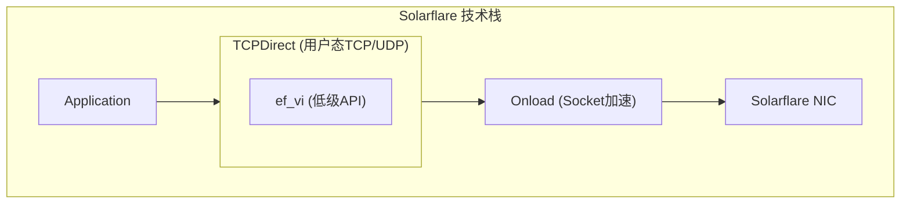
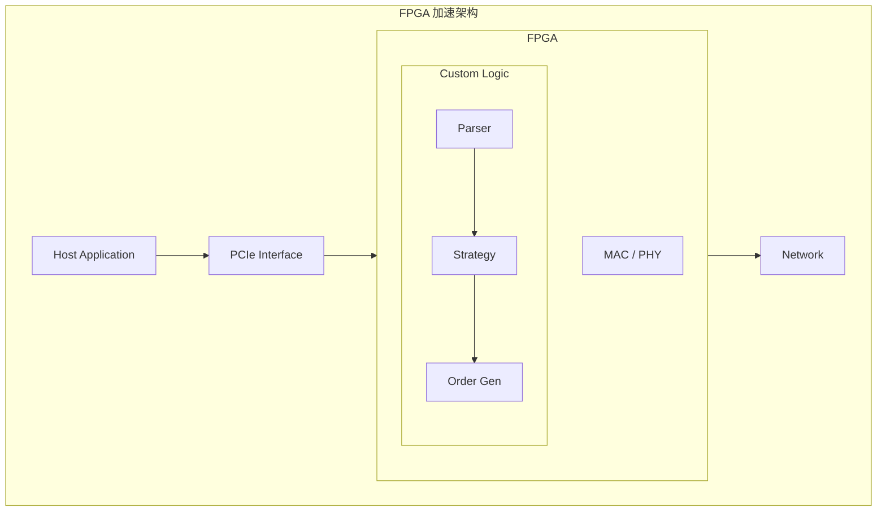

+++
title = "17.Solarflare/Onload与FPGA网卡"
slug = "hft-21-Solarflare与FPGA网卡"
date = 2026-01-21
description = "深入剖析Solarflare网卡技术，包括ef_vi、TCPDirect、硬件时间戳、FPGA加速和选型对比"
[taxonomies]
tags = ["HFT", "Solarflare", "FPGA", "KernelBypass", "低延迟"]
+++

## 概述

Solarflare（现AMD/Xilinx）网卡是HFT行业的标准选择，提供多种Kernel Bypass技术。

---

## 一、Solarflare技术栈

### 1.1 技术层次



**延迟对比**：

| 技术 | 延迟 |
|------|------|
| 标准Socket | 10-50μs |
| Onload | 2-5μs |
| ef_vi | 1-2μs |
| TCPDirect | 1-2μs（保持TCP语义） |

### 1.2 Onload

```cpp
// Onload是透明的Socket加速
// 只需设置环境变量，无需修改代码

// 使用Onload运行程序
// $ onload ./my_trading_app

// 配置选项
// EF_POLL_USEC=10  # 轮询间隔
// EF_SPIN=1        # 启用自旋
// EF_INT_DRIVEN=0  # 禁用中断

// 代码无需修改
int fd = socket(AF_INET, SOCK_STREAM, 0);
connect(fd, ...);
send(fd, ...);
recv(fd, ...);
```

---

## 二、ef_vi API

### 2.1 初始化

```cpp
#include <etherfabric/vi.h>
#include <etherfabric/pd.h>
#include <etherfabric/memreg.h>

class EfViHandler {
public:
    bool init(const char* interface) {
        // 打开驱动句柄
        if (ef_driver_open(&driver_handle_) < 0) {
            return false;
        }
        
        // 分配保护域
        if (ef_pd_alloc(&pd_, driver_handle_, 
                        if_nametoindex(interface), 0) < 0) {
            return false;
        }
        
        // 分配虚拟接口
        if (ef_vi_alloc_from_pd(&vi_, driver_handle_, &pd_,
                                driver_handle_, -1, -1, -1, 
                                NULL, -1, EF_VI_FLAGS_DEFAULT) < 0) {
            return false;
        }
        
        // 分配接收缓冲区
        alloc_rx_buffers();
        
        return true;
    }
    
private:
    ef_driver_handle driver_handle_;
    ef_pd pd_;
    ef_vi vi_;
};
```

### 2.2 收发包

```cpp
class EfViHandler {
public:
    // 发送数据包
    void send_packet(const void* data, size_t len) {
        // 获取发送缓冲区
        struct tx_buffer* buf = get_tx_buffer();
        memcpy(buf->data, data, len);
        
        // 提交发送
        ef_vi_transmit(&vi_, buf->dma_addr, len, buf->id);
    }
    
    // 轮询接收
    void poll() {
        ef_event events[16];
        int n_ev = ef_eventq_poll(&vi_, events, 16);
        
        for (int i = 0; i < n_ev; i++) {
            switch (EF_EVENT_TYPE(events[i])) {
                case EF_EVENT_TYPE_RX:
                    handle_rx(events[i]);
                    break;
                case EF_EVENT_TYPE_TX:
                    handle_tx_complete(events[i]);
                    break;
            }
        }
    }
    
private:
    void handle_rx(ef_event& ev) {
        int id = EF_EVENT_RX_RQ_ID(ev);
        int len = EF_EVENT_RX_BYTES(ev);
        
        struct rx_buffer* buf = &rx_buffers_[id];
        process_packet(buf->data, len);
        
        // 重新提交缓冲区
        ef_vi_receive_post(&vi_, buf->dma_addr, id);
    }
};
```

---

## 三、TCPDirect

### 3.1 基本使用

```cpp
#include <zf/zf.h>

class TCPDirectClient {
public:
    bool init() {
        // 初始化ZF栈
        struct zf_attr* attr;
        zf_attr_alloc(&attr);
        
        if (zf_init() < 0) return false;
        if (zf_stack_alloc(attr, &stack_) < 0) return false;
        
        zf_attr_free(attr);
        return true;
    }
    
    bool connect(const char* ip, int port) {
        struct zftl* tl;
        struct sockaddr_in addr = {};
        addr.sin_family = AF_INET;
        addr.sin_port = htons(port);
        inet_pton(AF_INET, ip, &addr.sin_addr);
        
        // 创建TCP连接
        if (zftl_listen(stack_, (struct sockaddr*)&addr, 
                        sizeof(addr), attr_, &tl) < 0) {
            return false;
        }
        
        // 等待连接完成
        while (zftl_accept(tl, &zock_) == -EAGAIN) {
            zf_reactor_perform(stack_);
        }
        
        return true;
    }
    
    int send(const void* data, size_t len) {
        struct iovec iov = {(void*)data, len};
        return zft_send(zock_, &iov, 1, 0);
    }
    
    int recv(void* buf, size_t len) {
        struct iovec iov = {buf, len};
        return zft_recv(zock_, &iov, 1, 0);
    }
    
    void poll() {
        zf_reactor_perform(stack_);
    }
    
private:
    struct zf_stack* stack_;
    struct zft* zock_;
    struct zf_attr* attr_;
};
```

### 3.2 零拷贝接收

```cpp
void zero_copy_recv() {
    struct zft_msg msg;
    struct iovec iov[4];
    msg.iovcnt = 4;
    msg.iov = iov;
    
    // 零拷贝接收
    zft_zc_recv(zock_, &msg, 0);
    
    if (msg.iovcnt > 0) {
        // 直接访问接收数据（无需拷贝）
        for (int i = 0; i < msg.iovcnt; i++) {
            process_data(iov[i].iov_base, iov[i].iov_len);
        }
        
        // 释放缓冲区
        zft_zc_recv_done(zock_, &msg);
    }
}
```

---

## 四、硬件时间戳

### 4.1 PTP同步

```cpp
class HWTimestampReader {
public:
    void enable_timestamps(ef_vi* vi) {
        // 启用接收时间戳
        ef_vi_receive_set_timestamp(vi);
    }
    
    uint64_t get_rx_timestamp(ef_vi* vi, ef_event& ev) {
        ef_precisetime ts;
        
        if (ef_vi_receive_get_timestamp(vi, 
            EF_EVENT_RX_RQ_ID(ev), &ts) == 0) {
            return ts.tv_sec * 1000000000ULL + ts.tv_nsec;
        }
        
        return 0;
    }
    
    uint64_t get_tx_timestamp(ef_vi* vi, ef_event& ev) {
        ef_precisetime ts;
        
        if (ef_vi_transmit_alt_get_timestamp(vi, 
            EF_EVENT_TX_ALT_ID(ev), &ts) == 0) {
            return ts.tv_sec * 1000000000ULL + ts.tv_nsec;
        }
        
        return 0;
    }
};
```

### 4.2 延迟测量

```cpp
class LatencyMeasurer {
public:
    void measure_one_way(ef_vi* vi) {
        // 接收时获取硬件时间戳
        uint64_t rx_hw_ts = get_rx_timestamp(vi, ev);
        
        // 从数据包中提取发送方时间戳
        uint64_t tx_hw_ts = extract_sender_timestamp(packet);
        
        // 单向延迟
        int64_t latency_ns = rx_hw_ts - tx_hw_ts;
        
        // 注意：需要时钟同步（PTP）
        histogram_.record(latency_ns);
    }
    
    void measure_round_trip() {
        // 发送时记录时间戳
        uint64_t send_ts = get_tx_timestamp(vi, tx_ev);
        
        // 接收响应时获取时间戳
        uint64_t recv_ts = get_rx_timestamp(vi, rx_ev);
        
        // RTT
        uint64_t rtt_ns = recv_ts - send_ts;
        rtt_histogram_.record(rtt_ns);
    }
};
```

---

## 五、FPGA网卡

### 5.1 FPGA加速架构



**Wire-to-Wire延迟**：<1μs

### 5.2 FPGA vs 软件对比

| 特性 | 软件(ef_vi) | FPGA |
|------|-------------|------|
| 延迟 | 1-2μs | <1μs |
| 抖动 | 几百ns | <10ns |
| 灵活性 | 高 | 低 |
| 开发成本 | 低 | 高 |
| 策略复杂度 | 高 | 低-中 |

### 5.3 FPGA适用场景

```
适合FPGA的场景：
1. 简单但延迟敏感的策略（如套利）
2. 市场数据解析和分发
3. 风控检查（硬限制）
4. 订单路由

不适合FPGA的场景：
1. 复杂策略逻辑
2. 需要频繁调整的策略
3. 需要大量历史数据的计算
```

---

## 六、选型对比

### 6.1 技术选型矩阵

| 需求 | 推荐方案 |
|------|----------|
| 最低延迟，简单策略 | FPGA |
| 低延迟，复杂策略 | ef_vi / TCPDirect |
| 中等延迟，快速开发 | Onload |
| 成本敏感 | DPDK |
| 兼容性优先 | Onload |

### 6.2 厂商对比

| 厂商 | 产品 | 延迟 | 特点 |
|------|------|------|------|
| AMD/Solarflare | X2522 | ~1μs | 成熟稳定 |
| Mellanox/NVIDIA | ConnectX-6 | ~0.9μs | RDMA支持 |
| Intel | E810 | ~1.5μs | 广泛兼容 |
| Xilinx | Alveo | <1μs | FPGA灵活 |

---

## 七、最佳实践

### 7.1 部署检查清单

```bash
# 1. 检查网卡状态
ethtool -i eth0

# 2. 禁用中断聚合
ethtool -C eth0 rx-usecs 0 tx-usecs 0

# 3. 配置队列数
ethtool -L eth0 combined 1

# 4. 绑定中断到特定CPU
echo 2 > /proc/irq/<irq>/smp_affinity

# 5. 检查Onload状态
onload_stackdump

# 6. 配置大页
echo 2048 > /proc/sys/vm/nr_hugepages
```

### 7.2 调优参数

```cpp
// Onload环境变量
setenv("EF_POLL_USEC", "0");     // 持续轮询
setenv("EF_SPIN", "1");           // 自旋模式
setenv("EF_INT_DRIVEN", "0");     // 禁用中断
setenv("EF_TCP_SNDBUF", "65536"); // 发送缓冲区
setenv("EF_TCP_RCVBUF", "65536"); // 接收缓冲区
setenv("EF_NONAGLE", "1");        // 禁用Nagle
```

---

## 总结

| 方案 | 延迟 | 复杂度 | 成本 | 适用场景 |
|------|------|--------|------|----------|
| Onload | 2-5μs | 低 | 中 | 快速部署 |
| ef_vi | 1-2μs | 高 | 中 | 高性能 |
| TCPDirect | 1-2μs | 中 | 中 | TCP应用 |
| FPGA | <1μs | 很高 | 高 | 极致延迟 |

**选型建议**：
1. 先用Onload验证性能需求
2. 需要更低延迟时迁移到ef_vi/TCPDirect
3. 只有确实需要亚微秒延迟时才考虑FPGA

---

## 相关文章

- [上一篇：DPDK深度实践](/articles/hft/hft-16-DPDK深度实践/)
- [下一篇：交易所撮合引擎原理](/articles/hft/hft-18-交易所撮合引擎原理/)
