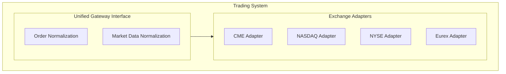

+++
title = "19.全球主要交易所技术对比"
date = 2026-01-21
description = "全球主要交易所技术栈对比，包括CME/NASDAQ/NYSE等的协议特点、延迟数据和Co-location"
[taxonomies]
tags = ["HFT", "交易所", "CME", "NASDAQ", "NYSE"]
+++

## 概述

不同交易所有不同的技术特点。本文对比全球主要交易所的技术栈。

---

## 一、美国交易所

### 1.1 CME (芝加哥商业交易所)

```
产品：期货、期权（指数、商品、利率、外汇）

协议：
- 行情：CME MDP 3.0 (基于SBE)
- 交易：iLink 3 (基于FIXP)

技术特点：
- 撮合：Pro-Rata + FIFO混合
- 延迟：Gateway ~20μs，E2E ~100μs
- 行情：UDP多播
- Co-lo：Aurora, IL

费率（ES合约示例）：
- Maker: $0.10/手
- Taker: $0.20/手

特殊功能：
- Mass Quote
- 自定义价差
- CME Globex
```

### 1.2 NASDAQ

```
产品：股票、ETF、期权

协议：
- 行情：ITCH 5.0 (二进制)
- 交易：OUCH 5.0 (二进制)

技术特点：
- 撮合：Price-Time FIFO
- 延迟：Gateway ~50μs
- 行情：UDP多播
- Co-lo：Carteret, NJ

费率：
- Maker: -$0.002/股（返佣）
- Taker: +$0.003/股

订单类型：
- 支持Peg订单
- 中间价订单
- IOC/FOK
```

### 1.3 NYSE

```
产品：股票、ETF

协议：
- 行情：Pillar Gateway (XDP)
- 交易：Pillar Trading Gateway

技术特点：
- 撮合：Price-Time FIFO
- 延迟：~100μs
- 特殊：DMM（指定做市商）角色
- Co-lo：Mahwah, NJ

费率：
- 根据交易量tier
- Maker返佣，Taker付费

特殊功能：
- 开盘/收盘竞价
- D-Limit订单（延迟半秒）
```

---

## 二、欧洲交易所

### 2.1 LSE (伦敦证券交易所)

```
产品：股票、ETF、债券

协议：
- 行情：Millennium Exchange
- 交易：Native Trading Gateway

技术特点：
- 撮合：Price-Time
- 延迟：Gateway ~100μs
- Co-lo：伦敦 Basildon

市场结构：
- SETS（电子订单簿）
- RSP（零售服务提供商）
```

### 2.2 Eurex (欧洲期货交易所)

```
产品：期货、期权（主要是欧洲指数和利率）

协议：
- 行情：EOBI (Enhanced Order Book Interface)
- 交易：ETI (Enhanced Trading Interface)

技术特点：
- 撮合：Price-Time + Pro-Rata
- 延迟：~50μs
- Co-lo：法兰克福

特殊功能：
- 做市商义务
- 期权Delta对冲
```

---

## 三、亚太交易所

### 3.1 SGX (新加坡交易所)

```
产品：期货、股票（亚洲指数、商品）

协议：
- 行情：ITCH-like
- 交易：OUCH-like

技术特点：
- 撮合：Price-Time
- 延迟：~50μs
- Co-lo：新加坡

特殊产品：
- A50期货（中国相关）
- 铁矿石期货
```

### 3.2 HKEX (香港交易所)

```
产品：股票、期货、期权

协议：
- 行情：OMD (Orion Market Data)
- 交易：OCG (Orion Central Gateway)

技术特点：
- 撮合：Price-Time
- 延迟：~1ms（相对较高）
- 特殊：印花税

市场特点：
- T+2结算
- 沪港通/深港通
```

### 3.3 上交所/深交所

```
产品：A股、ETF、债券

协议：
- 行情：Binary格式
- 交易：STEP/Binary

技术特点：
- T+1交易
- 涨跌停限制（±10%）
- 10%波动熔断

特殊规则：
- 科创板/创业板不同规则
- 集合竞价时段
```

---

## 四、技术对比表

### 4.1 延迟对比

| 交易所 | Gateway延迟 | E2E延迟 | Co-lo位置 |
|--------|-------------|---------|-----------|
| CME | ~20μs | ~100μs | Aurora, IL |
| NASDAQ | ~50μs | ~200μs | Carteret, NJ |
| NYSE | ~100μs | ~300μs | Mahwah, NJ |
| LSE | ~100μs | ~300μs | Basildon |
| Eurex | ~50μs | ~150μs | Frankfurt |
| SGX | ~50μs | ~200μs | Singapore |
| HKEX | ~1ms | ~3ms | Hong Kong |

### 4.2 协议对比

| 交易所 | 行情协议 | 交易协议 | 编码 |
|--------|----------|----------|------|
| CME | MDP 3.0 | iLink 3 | SBE |
| NASDAQ | ITCH 5.0 | OUCH 5.0 | Binary |
| NYSE | XDP | Pillar | Binary |
| Eurex | EOBI | ETI | Binary |
| LSE | Millennium | Native | Binary |

### 4.3 撮合算法对比

| 交易所 | 主要算法 | 特殊规则 |
|--------|----------|----------|
| CME | Pro-Rata + FIFO | 按合约不同 |
| NASDAQ | FIFO | Peg订单 |
| NYSE | FIFO | DMM |
| Eurex | Pro-Rata | 做市商义务 |

---

## 五、连接架构

### 5.1 多交易所连接



### 5.2 统一订单接口

```cpp
// 统一订单结构
struct NormalizedOrder {
    std::string exchange;
    std::string symbol;
    std::string native_symbol;  // 交易所原生代码
    
    Side side;
    OrderType type;
    TimeInForce tif;
    
    double price;
    int64_t quantity;
    
    // 转换为交易所格式
    std::vector<uint8_t> to_native_format() const;
};

// 交易所适配器接口
class ExchangeAdapter {
public:
    virtual void connect() = 0;
    virtual void disconnect() = 0;
    
    virtual void send_order(const NormalizedOrder& order) = 0;
    virtual void cancel_order(uint64_t order_id) = 0;
    
    virtual void subscribe_market_data(const std::string& symbol) = 0;
    
    // 回调
    virtual void on_execution_report(const ExecutionReport& report) = 0;
    virtual void on_market_data(const MarketData& data) = 0;
};
```

---

## 六、选择考虑因素

### 6.1 策略适配

```
策略类型 → 适合的交易所：

做市商策略：
- CME（Pro-Rata有利于大单）
- Eurex（做市商返佣）

套利策略：
- 多交易所（需要低延迟）
- CME vs ICE（跨交易所）

趋势跟踪：
- 流动性高的交易所
- 费用敏感度低

高频统计套利：
- NASDAQ/NYSE（股票）
- CME（期货）
```

### 6.2 基础设施考虑

```
Co-location成本：
- 美国交易所：$5,000-20,000/月
- 欧洲交易所：€3,000-15,000/月
- 亚洲交易所：$3,000-10,000/月

网络连接：
- 专线 vs 互联网
- 冗余设计
- 多数据中心

合规要求：
- 注册要求
- 报告要求
- 风控要求
```

---

## 总结

**选择交易所的关键因素**：

1. **产品匹配**：是否有你需要交易的产品
2. **延迟要求**：策略对延迟的敏感度
3. **费用结构**：Maker/Taker费率
4. **撮合算法**：FIFO vs Pro-Rata
5. **技术复杂度**：协议和接入难度
6. **合规要求**：注册和报告要求

**建议**：
- 从一个交易所开始
- 建立可扩展的适配器架构
- 统一内部数据格式
- 考虑时区和交易时间

---

## 相关文章

- [上一篇：交易所撮合引擎原理](/articles/hft/hft-18-交易所撮合引擎原理/)
- [下一篇：高性能序列化技术](/articles/hft/hft-20-高性能序列化技术/)
