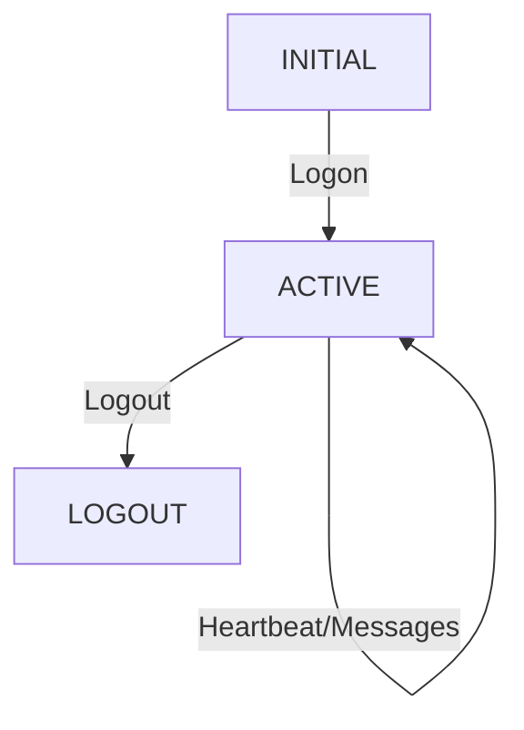

+++
title = "24. HFT面试题-网络与协议"
date = 2026-01-21
weight = 24000
description = "HFT网络与协议面试题，包括FIX协议、TCP优化、多播和延迟测量"
[taxonomies]
tags = ["HFT", "面试", "网络", "FIX协议", "TCP"]
+++

## 一、FIX协议

### Q1: 解释FIX协议的消息结构

**答案**：

**FIX消息结构**：

`8=FIX.4.4│9=xxx│35=D│49=SENDER│56=TARGET│...│10=xxx│`

| 字段 | 标签 | 说明 |
|------|------|------|
| BeginString | 8 | 协议版本 |
| BodyLength | 9 | 消息长度 |
| MsgType | 35 | 消息类型 |
| SenderCompID | 49 | 发送方 |
| TargetCompID | 56 | 目标方 |
| CheckSum | 10 | 校验和 |

关键字段：
- 8 (BeginString): 协议版本，如FIX.4.4
- 9 (BodyLength): 消息体长度
- 35 (MsgType): 消息类型
  - 0: Heartbeat
  - 1: Test Request
  - 5: Logout
  - 8: Execution Report
  - D: New Order Single
  - F: Order Cancel Request
- 49 (SenderCompID): 发送方标识
- 56 (TargetCompID): 接收方标识
- 34 (MsgSeqNum): 序列号
- 10 (CheckSum): 校验和

消息示例（New Order Single）：
8=FIX.4.4|9=126|35=D|49=TRADER|56=EXCHANGE|34=1|
52=20240101-09:30:00.000|11=ORDER123|55=AAPL|54=1|
38=100|40=2|44=150.00|10=123|
```

### Q2: 实现FIX消息解析器

```cpp
class FIXParser {
public:
    struct Field {
        int tag;
        std::string_view value;
    };
    
    std::vector<Field> parse(const char* data, size_t len) {
        std::vector<Field> fields;
        fields.reserve(32);  // 预分配
        
        const char* ptr = data;
        const char* end = data + len;
        
        while (ptr < end) {
            // 解析tag
            int tag = 0;
            while (ptr < end && *ptr != '=') {
                tag = tag * 10 + (*ptr - '0');
                ptr++;
            }
            ptr++;  // skip '='
            
            // 解析value
            const char* value_start = ptr;
            while (ptr < end && *ptr != '\x01') {
                ptr++;
            }
            
            fields.push_back({tag, {value_start, 
                static_cast<size_t>(ptr - value_start)}});
            ptr++;  // skip SOH
        }
        
        return fields;
    }
    
    // 快速获取特定字段
    std::string_view get_field(const std::vector<Field>& fields, int tag) {
        for (const auto& f : fields) {
            if (f.tag == tag) return f.value;
        }
        return {};
    }
};
```

### Q3: FIX会话管理

**问题**：解释FIX会话的状态机和序列号管理。

**答案**：

**会话状态机**：



序列号管理：
1. 双向独立序列号（Inbound/Outbound）
2. 每条消息序列号递增
3. Gap检测：收到序列号 > 期望序列号
4. Gap处理：
   - 发送Resend Request (MsgType=2)
   - 接收方重发缺失消息
   - 或发送Sequence Reset (MsgType=4)

代码实现：
```cpp
class FIXSession {
public:
    void on_message(const FIXMessage& msg) {
        int seq = msg.get_seq_num();
        
        if (seq == expected_seq_) {
            expected_seq_++;
            process_message(msg);
        } else if (seq > expected_seq_) {
            // Gap detected
            request_resend(expected_seq_, seq - 1);
            buffer_message(msg);
        } else {
            // Duplicate or PossDup
            if (!msg.is_poss_dup()) {
                log_error("Sequence too low");
            }
        }
    }
    
private:
    int expected_seq_ = 1;
    int outbound_seq_ = 1;
};
```

---

## 二、TCP优化

### Q4: 解释TCP_NODELAY的作用

**答案**：

```
Nagle算法（默认开启）：
- 合并小包，减少网络拥塞
- 等待ACK或累积足够数据再发送
- 引入延迟（可达40ms）

TCP_NODELAY禁用Nagle：
- 立即发送数据，不等待
- 对于低延迟交易至关重要

代码：
```cpp
int enable = 1;
setsockopt(fd, IPPROTO_TCP, TCP_NODELAY, &enable, sizeof(enable));
```

相关优化：
- TCP_QUICKACK：禁用延迟ACK
- SO_SNDBUF/SO_RCVBUF：调整缓冲区
- TCP_CORK：手动控制合并（Linux）
```

### Q5: TCP vs UDP在HFT中的使用

**问题**：什么时候使用TCP，什么时候使用UDP？

**答案**：

```
TCP适用场景：
- 订单提交和管理（必须可靠）
- 需要有序传输
- 连接数量有限

UDP适用场景：
- 市场数据多播
- 可容忍少量丢包
- 需要最低延迟

UDP多播优势：
- 单次发送，多个接收
- 无连接建立开销
- 无拥塞控制延迟

UDP风险：
- 数据包可能丢失
- 需要应用层处理重传
- 需要序列号检测Gap

混合方案：
- UDP接收市场数据
- TCP作为备份通道
- 应用层序列号和重传
```

### Q6: Socket缓冲区调优

```cpp
void optimize_socket(int fd) {
    // 1. 禁用Nagle
    int one = 1;
    setsockopt(fd, IPPROTO_TCP, TCP_NODELAY, &one, sizeof(one));
    
    // 2. 禁用延迟ACK
    setsockopt(fd, IPPROTO_TCP, TCP_QUICKACK, &one, sizeof(one));
    
    // 3. 小缓冲区减少排队延迟
    int bufsize = 4096;  // 小缓冲区
    setsockopt(fd, SOL_SOCKET, SO_RCVBUF, &bufsize, sizeof(bufsize));
    setsockopt(fd, SOL_SOCKET, SO_SNDBUF, &bufsize, sizeof(bufsize));
    
    // 4. 启用Busy Polling
    int busy_poll = 50;  // 50 microseconds
    setsockopt(fd, SOL_SOCKET, SO_BUSY_POLL, &busy_poll, sizeof(busy_poll));
    
    // 5. 低延迟模式
    int lowat = 1;
    setsockopt(fd, SOL_SOCKET, SO_RCVLOWAT, &lowat, sizeof(lowat));
    
    // 6. 保活
    setsockopt(fd, SOL_SOCKET, SO_KEEPALIVE, &one, sizeof(one));
    
    // 7. 非阻塞
    int flags = fcntl(fd, F_GETFL, 0);
    fcntl(fd, F_SETFL, flags | O_NONBLOCK);
}
```

---

## 三、多播

### Q7: 实现多播接收

```cpp
class MulticastReceiver {
public:
    bool join(const char* group_ip, int port, const char* interface_ip) {
        fd_ = socket(AF_INET, SOCK_DGRAM, 0);
        if (fd_ < 0) return false;
        
        // 允许地址重用
        int reuse = 1;
        setsockopt(fd_, SOL_SOCKET, SO_REUSEADDR, &reuse, sizeof(reuse));
        
        // 绑定端口
        struct sockaddr_in addr{};
        addr.sin_family = AF_INET;
        addr.sin_port = htons(port);
        addr.sin_addr.s_addr = htonl(INADDR_ANY);
        
        if (bind(fd_, (struct sockaddr*)&addr, sizeof(addr)) < 0) {
            return false;
        }
        
        // 加入多播组
        struct ip_mreq mreq{};
        mreq.imr_multiaddr.s_addr = inet_addr(group_ip);
        mreq.imr_interface.s_addr = inet_addr(interface_ip);
        
        if (setsockopt(fd_, IPPROTO_IP, IP_ADD_MEMBERSHIP, 
                       &mreq, sizeof(mreq)) < 0) {
            return false;
        }
        
        return true;
    }
    
    int receive(char* buffer, size_t len) {
        return recv(fd_, buffer, len, 0);
    }
    
private:
    int fd_ = -1;
};
```

### Q8: 多播数据的Gap处理

**问题**：如何处理多播数据的丢包？

**答案**：

```cpp
class GapHandler {
public:
    enum class Action {
        PROCESS,     // 正常处理
        BUFFER,      // 缓存等待Gap填补
        REQUEST_RETRANSMIT,  // 请求重传
        RESET        // 请求完整快照
    };
    
    Action on_message(uint64_t sequence) {
        if (sequence == expected_seq_) {
            expected_seq_++;
            drain_buffer();
            return Action::PROCESS;
        }
        
        if (sequence > expected_seq_) {
            // 检测到Gap
            uint64_t gap_size = sequence - expected_seq_;
            
            if (gap_size <= max_buffer_size_) {
                // 缓存并请求重传
                request_retransmit(expected_seq_, sequence - 1);
                return Action::BUFFER;
            } else {
                // Gap太大，请求快照
                return Action::RESET;
            }
        }
        
        // 重复消息，忽略
        return Action::PROCESS;
    }
    
private:
    void drain_buffer() {
        while (!buffer_.empty()) {
            auto it = buffer_.find(expected_seq_);
            if (it == buffer_.end()) break;
            
            process_buffered(it->second);
            buffer_.erase(it);
            expected_seq_++;
        }
    }
    
    uint64_t expected_seq_ = 1;
    size_t max_buffer_size_ = 1000;
    std::map<uint64_t, Message> buffer_;
};
```

---

## 四、延迟测量

### Q9: 测量网络往返延迟（RTT）

```cpp
class RTTMeasurer {
public:
    void send_ping(int fd) {
        PingMessage ping;
        ping.timestamp = rdtsc();
        ping.sequence = next_seq_++;
        
        send(fd, &ping, sizeof(ping), 0);
        pending_pings_[ping.sequence] = ping.timestamp;
    }
    
    void on_pong(const PongMessage& pong) {
        auto it = pending_pings_.find(pong.sequence);
        if (it == pending_pings_.end()) return;
        
        uint64_t rtt_cycles = rdtsc() - it->second;
        uint64_t rtt_ns = cycles_to_ns(rtt_cycles);
        
        rtt_stats_.record(rtt_ns);
        pending_pings_.erase(it);
    }
    
    void print_stats() const {
        printf("RTT Stats:\n");
        printf("  Min:  %lu ns\n", rtt_stats_.min());
        printf("  Mean: %.1f ns\n", rtt_stats_.mean());
        printf("  P99:  %lu ns\n", rtt_stats_.p99());
        printf("  Max:  %lu ns\n", rtt_stats_.max());
    }
    
private:
    uint64_t next_seq_ = 0;
    std::unordered_map<uint64_t, uint64_t> pending_pings_;
    LatencyHistogram rtt_stats_;
};
```

### Q10: 使用硬件时间戳测量延迟

```cpp
class HWTimestampMeasurer {
public:
    void enable_hw_timestamping(int fd) {
        int flags = SOF_TIMESTAMPING_TX_HARDWARE |
                    SOF_TIMESTAMPING_RX_HARDWARE |
                    SOF_TIMESTAMPING_RAW_HARDWARE;
        
        setsockopt(fd, SOL_SOCKET, SO_TIMESTAMPING, 
                   &flags, sizeof(flags));
    }
    
    uint64_t extract_hw_timestamp(struct msghdr* msg) {
        for (struct cmsghdr* cmsg = CMSG_FIRSTHDR(msg);
             cmsg != nullptr;
             cmsg = CMSG_NXTHDR(msg, cmsg)) {
            
            if (cmsg->cmsg_level == SOL_SOCKET &&
                cmsg->cmsg_type == SO_TIMESTAMPING) {
                
                struct timespec* ts = (struct timespec*)CMSG_DATA(cmsg);
                // ts[2] is hardware timestamp
                return ts[2].tv_sec * 1000000000ULL + ts[2].tv_nsec;
            }
        }
        return 0;
    }
    
    void measure_one_way_latency(int fd) {
        char buffer[1500];
        struct iovec iov = {buffer, sizeof(buffer)};
        char control[256];
        
        struct msghdr msg = {};
        msg.msg_iov = &iov;
        msg.msg_iovlen = 1;
        msg.msg_control = control;
        msg.msg_controllen = sizeof(control);
        
        recvmsg(fd, &msg, 0);
        
        uint64_t hw_ts = extract_hw_timestamp(&msg);
        // Compare with sender's timestamp in the packet
    }
};
```

---

## 五、协议设计

### Q11: 设计一个低延迟的二进制协议

**问题**：设计一个用于HFT系统内部通信的协议。

**答案**：

```cpp
// 设计原则：
// 1. 固定长度消息（避免解析开销）
// 2. 对齐（避免非对齐访问）
// 3. 紧凑（减少数据量）

struct alignas(64) OrderMessage {
    // Header (8 bytes)
    uint8_t msg_type;       // 消息类型
    uint8_t flags;          // 标志位
    uint16_t length;        // 消息长度
    uint32_t sequence;      // 序列号
    
    // Body (48 bytes)
    uint64_t order_id;      // 订单ID
    uint64_t timestamp_ns;  // 纳秒时间戳
    uint32_t symbol_id;     // 品种ID（使用数字而非字符串）
    int32_t price;          // 价格（定点数）
    int32_t quantity;       // 数量
    uint8_t side;           // 买卖方向
    uint8_t order_type;     // 订单类型
    uint8_t tif;            // Time in Force
    uint8_t reserved[5];    // 保留对齐
    
    // Padding to 64 bytes (cache line)
    uint8_t padding[8];
};

static_assert(sizeof(OrderMessage) == 64, "Must be cache line size");

// 零拷贝解析
class FastParser {
public:
    const OrderMessage* parse(const char* data) {
        // 直接转型，无需拷贝
        return reinterpret_cast<const OrderMessage*>(data);
    }
};
```

---

## 总结

**网络与协议面试要点**：

1. **FIX协议**
   - 消息结构和关键字段
   - 会话管理和序列号
   - 性能优化（预解析、索引）

2. **TCP优化**
   - TCP_NODELAY必须开启
   - 缓冲区调优
   - Kernel Bypass

3. **UDP多播**
   - Gap检测和处理
   - 缓冲策略
   - 快照恢复

4. **延迟测量**
   - 硬件时间戳
   - RTT测量
   - 分段计时

---

## 相关文章

- [上一篇：HFT面试题-算法与数据结构](@/articles/hft/hft-23-HFT面试题-算法与数据结构.md)
- [下一篇：HFT面试题-智力与概率题](@/articles/hft/hft-25-HFT面试题-智力与概率题.md)
