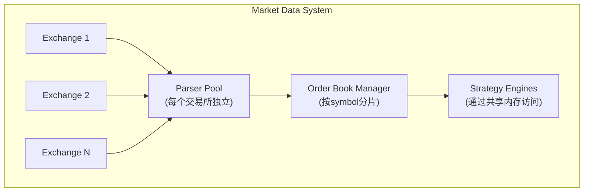

+++
title = "27. HFT技术面试技巧"
slug = "hft-26-HFT技术面试技巧"
date = 2026-01-21
weight = 27000
description = "HFT技术面试技巧，包括白板编程、系统设计回答框架、如何展示低延迟经验和常见追问应对"
[taxonomies]
tags = ["HFT", "面试", "技术面试", "编程", "系统设计"]
+++

## 概述

HFT技术面试有其特殊性。本文提供针对性的面试技巧。

---

## 一、白板编程

### 1.1 HFT编码风格

```cpp
// 面试时展示的代码风格应反映HFT要求

// 差的风格
void processOrder(Order order) {
    std::string symbol = order.getSymbol();  // 不必要的拷贝
    if (symbol.empty()) return;
    
    std::vector<Fill> fills;  // 动态分配
    for (auto& level : book.getLevels()) {  // 可能有锁
        // ...
    }
}

// 好的风格
void process_order(const Order& order) {  // const引用
    if (order.symbol[0] == '\0') return;  // 直接访问
    
    Fill fills[MAX_FILLS];  // 栈分配
    int fill_count = 0;
    
    // 直接访问预分配的数据结构
    for (int i = 0; i < book_.level_count; ++i) {
        // ...
    }
}
```

### 1.2 常见编程题

```cpp
// 题目：实现滑动窗口最大值（O(1)获取）
class SlidingWindowMax {
public:
    explicit SlidingWindowMax(int window) : window_(window) {}
    
    void push(int val) {
        // 移除过期元素
        while (!deque_.empty() && 
               deque_.front().idx <= idx_ - window_) {
            deque_.pop_front();
        }
        
        // 移除所有比当前值小的元素
        while (!deque_.empty() && deque_.back().val < val) {
            deque_.pop_back();
        }
        
        deque_.push_back({val, idx_});
        ++idx_;
    }
    
    int max() const {
        return deque_.empty() ? 0 : deque_.front().val;
    }
    
private:
    struct Entry { int val; int idx; };
    std::deque<Entry> deque_;
    int window_;
    int idx_ = 0;
};

// 面试时的关键点：
// 1. 解释时间复杂度：摊销O(1)
// 2. 讨论内存使用：最坏O(n)
// 3. 可能的优化：使用固定大小环形缓冲区
```

### 1.3 展示低延迟思维

```cpp
// 面试中主动提出优化

"这个实现可以工作，但如果要在HFT中使用，
我会考虑以下优化："

// 1. 避免动态分配
"使用固定大小的数组替代deque"

// 2. 缓存友好
"确保数据结构是连续内存布局"

// 3. 减少分支
"用位运算替代条件判断（如果适用）"

// 4. 内联关键函数
"标记为inline或always_inline"

// 示例优化版本
class OptimizedSlidingMax {
    static constexpr int MAX_SIZE = 1024;
    
    struct Entry {
        int val;
        int idx;
    } entries_[MAX_SIZE];
    
    int head_ = 0;
    int tail_ = 0;
    int window_;
    int idx_ = 0;
    
public:
    __attribute__((always_inline))
    void push(int val) {
        // 使用模运算的环形缓冲区
        while (head_ != tail_ && 
               entries_[(head_) & (MAX_SIZE-1)].idx <= idx_ - window_) {
            head_++;
        }
        // ...
    }
};
```

---

## 二、系统设计

### 2.1 回答框架

```
1. 澄清需求 (2-3分钟)
   - 具体的延迟要求？
   - 吞吐量要求？
   - 可用性要求？
   - 哪些可以trade-off？

2. 高层架构 (5分钟)
   - 画出主要组件
   - 数据流向
   - 关键接口

3. 深入关键组件 (10-15分钟)
   - 选择1-2个最重要的组件
   - 详细设计
   - 数据结构选择
   - 具体的技术选型

4. 权衡讨论 (5分钟)
   - 这个设计的优缺点
   - 其他可能的方案
   - 如何演进

5. 扩展讨论 (如果有时间)
   - 监控和运维
   - 容错和恢复
   - 测试策略
```

### 2.2 示例：设计市场数据处理系统

```
需求：
- 处理10个交易所的市场数据
- 构建统一的Order Book
- 延迟要求：<100μs

第一步：澄清
"这个100μs是指从收到数据到Order Book更新完成吗？"
"需要持久化吗？"
"有多少个symbol需要追踪？"

第二步：高层架构



第三步：关键组件深入

"让我详细讲一下Order Book Manager："

- 数据结构：
  使用数组索引的价格级别，而非map
  价格转为tick数作为索引
  
- 分片策略：
  按symbol哈希分片到不同核心
  避免跨核心通信
  
- 更新逻辑：
  使用无锁单生产者更新
  策略通过只读视图访问
```

### 2.3 应对追问

```
追问："如何处理交易所故障？"

回答：
"好问题。有几个层面需要考虑：

1. 检测故障
   - 心跳超时
   - 序列号Gap过大
   - 数据质量异常（如价格跳变）

2. 通知策略
   - 标记该交易所数据为stale
   - 策略可以选择继续用其他交易所数据

3. 恢复流程
   - 重新连接
   - 请求快照
   - 验证数据完整性后恢复

4. 降级策略
   - 如果是主要交易所，可能需要暂停相关策略"
```

---

## 三、展示低延迟经验

### 3.1 量化描述

```
避免模糊描述：
❌ "我优化了系统性能"
❌ "我减少了延迟"

使用具体数字：
✓ "我将P99延迟从500μs降到了50μs"
✓ "优化后吞吐量从100K msg/s提升到1M msg/s"
✓ "内存使用减少了40%"

描述方法论：
"我先用perf分析找到热点，
发现XX%的时间花在内存分配上。
通过引入对象池，减少了动态分配，
延迟降低了XX%。"
```

### 3.2 技术深度展示

```
面试官问："你如何测量延迟？"

初级回答：
"我用gettimeofday记录时间"

中级回答：
"我用clock_gettime(CLOCK_MONOTONIC)，
精度更高，不受NTP调整影响"

高级回答：
"在热路径上我用RDTSCP直接读取CPU周期计数，
开销只有几十个周期。
对于网络延迟，我使用网卡的硬件时间戳，
通过PTP同步到亚微秒精度。
统计上我关注P50、P99、P99.9，
因为平均值会掩盖尾延迟问题。"
```

### 3.3 问题诊断能力

```
面试官问："延迟突然变高，你怎么诊断？"

展示系统性方法：

"我会按层排查：

1. 网络层
   - 检查网卡统计：丢包、错误
   - 查看交换机延迟
   - 确认没有网络重传

2. 系统层
   - 检查CPU使用率和频率
   - 查看是否有频繁的上下文切换
   - 检查内存带宽和缓存命中率
   
3. 应用层
   - 查看应用日志和内部指标
   - 分析GC日志（如果适用）
   - 检查队列积压情况

4. 对比分析
   - 与正常时期的指标对比
   - 查看最近的变更

常见原因：
- NUMA远程内存访问
- CPU降频（thermal throttling）
- 后台进程干扰
- 内存不足导致swap"
```

---

## 四、常见追问与应对

### 4.1 技术追问

```
Q: "为什么选择X技术而不是Y？"

不好的回答：
"因为X更流行"
"因为我之前用过X"

好的回答：
"我们选择X是因为在我们的benchmark中，
X在[具体场景]下比Y快30%。
Y的优势是[某些方面]，
但对于我们的用例，延迟是最重要的考量。"
```

### 4.2 设计追问

```
Q: "这个设计有什么缺点？"

主动承认限制，展示思考深度：

"这个设计的主要trade-off是：

1. 内存使用较高
   因为使用数组索引，需要预分配
   在价格范围很大的市场可能浪费内存

2. 灵活性较低
   固定的分片数量，扩展需要重启

3. 跨分片操作开销
   如果策略需要访问多个symbol，
   需要跨核心通信

可能的改进：
- 使用二级索引减少内存使用
- 支持动态重分片
- 引入symbol组概念减少跨核心访问"
```

### 4.3 经验追问

```
Q: "你犯过什么严重的错误？"

选择一个可以展示学习能力的例子：

"有一次我在优化关键路径时，
引入了一个只在特定市场条件下触发的bug。
正常测试没有发现，但在波动大的时候会导致计算错误。

我从中学到：
1. 测试要覆盖边界条件和极端情况
2. 关键变更需要在类似生产的环境验证
3. 添加了运行时断言检测异常值

现在我们有了更完善的测试框架和灰度发布流程。"
```

---

## 五、面试准备

### 5.1 知识清单

**必须精通**：
- [ ] C++内存模型和并发
- [ ] 网络编程（TCP/UDP/多播）
- [ ] 操作系统（进程/线程/调度）
- [ ] 数据结构和算法
- [ ] 性能分析工具

**应该了解**：
- [ ] 交易所协议（FIX/ITCH等）
- [ ] 做市商策略基础
- [ ] 风控概念
- [ ] 硬件（CPU/内存/网络）

**加分项**：
- [ ] FPGA基础
- [ ] 内核开发经验
- [ ] 量化金融知识

### 5.2 准备项目故事

```
准备3-5个项目故事，每个能讲5-10分钟：

1. 性能优化项目
   - 问题是什么
   - 如何分析
   - 做了什么改进
   - 量化的结果

2. 系统设计项目
   - 需求背景
   - 架构决策
   - 技术选型
   - 权衡考量

3. 故障排除经历
   - 问题现象
   - 诊断过程
   - 根因分析
   - 长期改进

4. 团队协作案例
   - 跨团队项目
   - 技术分歧解决
   - 指导新人

每个故事都准备追问的回答。
```

---

## 总结

**HFT面试关键点**：

1. **展示数字思维**
   - 量化一切
   - 了解各种操作的延迟数量级

2. **深度而非广度**
   - 在某个领域展示专家级理解
   - 能够深入讨论实现细节

3. **权衡思维**
   - 没有完美的方案
   - 能够分析trade-off

4. **持续学习**
   - 对新技术保持好奇
   - 承认不知道的，展示如何学习

---

## 相关文章

- [上一篇：HFT行为面试指南](@/articles/hft/hft-26-HFT行为面试指南.md)
