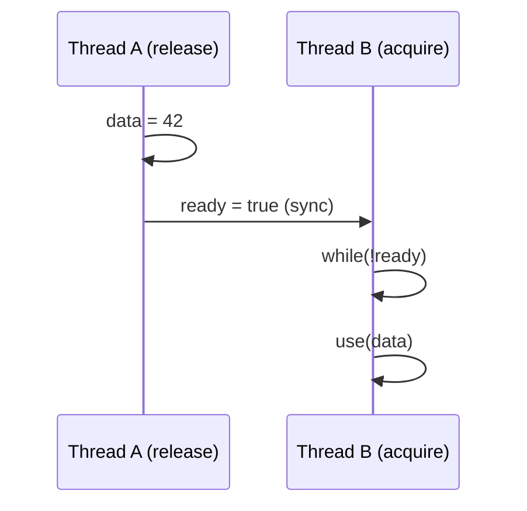

+++
title = "HFT笔试题-无锁数据结构"
date = 2026-01-31
weight = 28000
description = "HFT无锁数据结构笔试题：CAS原理、SPSC队列、无锁栈、ABA问题、内存序"
[taxonomies]
tags = ["HFT", "笔试", "无锁", "CAS", "低延迟"]
+++

# HFT 笔试题 - 无锁数据结构

本文汇集 HFT（高频交易）无锁数据结构相关的笔试题，覆盖 CAS 原理、无锁队列、内存序、ABA 问题等核心概念。

**难度标注**：★☆☆ 基础 | ★★☆ 中级 | ★★★ 困难

---

## 一、选择题

### 题目 1 ★☆☆

CAS（Compare-And-Swap）操作的原子性由什么保证？

A. 操作系统内核  
B. 编译器优化  
C. CPU 硬件指令  
D. 软件锁

<details>
<summary>查看答案与解析</summary>

**答案：C**

**CAS 原理**：
```c
// CAS 伪代码
bool CAS(int *ptr, int expected, int new_value) {
    if (*ptr == expected) {
        *ptr = new_value;
        return true;
    }
    return false;
}
```

**硬件实现**（x86）：
```asm
; CMPXCHG 指令
lock cmpxchg [ptr], new_value
; 如果 [ptr] == EAX，则 [ptr] = new_value，ZF=1
; 否则 EAX = [ptr]，ZF=0
```

**LOCK 前缀作用**：
- 锁定内存总线或缓存行
- 保证原子性
- 隐含内存屏障

</details>

---

### 题目 2 ★★☆

关于无锁编程，以下描述**错误**的是：

A. 无锁不等于无等待（wait-free）  
B. 无锁数据结构可能导致饥饿  
C. 无锁编程一定比加锁更快  
D. 无锁需要处理 ABA 问题

<details>
<summary>查看答案与解析</summary>

**答案：C**

**进度保证级别**：

| 级别 | 保证 | 特点 |
|------|------|------|
| Wait-Free | 每个操作有限步完成 | 最强，无饥饿 |
| Lock-Free | 系统整体有进展 | 可能饥饿 |
| Obstruction-Free | 单独运行时有进展 | 需要辅助机制 |
| Blocking | 使用锁 | 可能死锁 |

**C 选项错误原因**：
- 低竞争时，加锁可能更快（无 CAS 重试）
- 无锁增加代码复杂度
- CAS 重试在高竞争时效率低
- 需要根据场景选择

</details>

---

### 题目 3 ★★☆

什么是 ABA 问题？

A. 内存访问冲突  
B. CAS 操作中值从 A 变 B 再变回 A 导致误判  
C. 内存分配失败  
D. 缓存一致性问题

<details>
<summary>查看答案与解析</summary>

**答案：B**

**ABA 问题示例**：

```
无锁栈的 pop 操作：

初始：head → A → B → C

Thread 1:
1. 读取 head = A, next = B
2. 准备 CAS(head, A, B) // 被抢占

Thread 2:
3. pop A（head = B）
4. pop B（head = C）
5. push A（head = A → C）// A 被复用

Thread 1 继续:
6. CAS(head, A, B) 成功！// A 确实等于 head
7. 但 head → B → ??? // B 已经被释放！
```

**解决方案**：

```c
// 1. 带版本号的指针
typedef struct {
    void *ptr;
    uint64_t version;
} tagged_ptr_t;

// 2. 使用 double-width CAS
bool dcas(tagged_ptr_t *target, 
          tagged_ptr_t expected,
          tagged_ptr_t desired);

// 3. Hazard Pointers（风险指针）
// 4. RCU（延迟释放）
```

</details>

---

### 题目 4 ★★★

以下哪种内存序（memory order）开销最小？

A. `memory_order_seq_cst`  
B. `memory_order_acquire`  
C. `memory_order_release`  
D. `memory_order_relaxed`

<details>
<summary>查看答案与解析</summary>

**答案：D**

**内存序开销对比**：

| 内存序 | 开销 | 保证 |
|--------|------|------|
| relaxed | 最小 | 仅原子性 |
| consume | 小 | 数据依赖顺序 |
| acquire | 中 | 后续读写不前移 |
| release | 中 | 之前读写不后移 |
| acq_rel | 较大 | acquire + release |
| seq_cst | 最大 | 全局顺序 |

**选择建议**：
```c
// 计数器：只需原子性
atomic_fetch_add_explicit(&counter, 1, memory_order_relaxed);

// 锁获取：需要 acquire
while (!atomic_exchange_explicit(&lock, 1, memory_order_acquire));

// 锁释放：需要 release
atomic_store_explicit(&lock, 0, memory_order_release);

// 默认/不确定：使用 seq_cst（最安全）
atomic_store(&flag, 1);  // 默认 seq_cst
```

</details>

---

### 题目 5 ★★★

SPSC（单生产者单消费者）队列为什么比 MPMC 队列更高效？

A. 使用了更好的算法  
B. 不需要原子操作  
C. 无竞争，可用简单内存序  
D. 代码更简单

<details>
<summary>查看答案与解析</summary>

**答案：C**

**SPSC vs MPMC**：

| 特性 | SPSC | MPMC |
|------|------|------|
| 生产者同步 | 无需 | 需要 CAS |
| 消费者同步 | 无需 | 需要 CAS |
| 内存序 | relaxed + release/acquire | 通常需要 seq_cst |
| 缓存效率 | 高 | 低（伪共享） |
| CAS 重试 | 无 | 可能频繁 |

**SPSC 实现**：
```c
// 生产者：只修改 tail
buffer[tail] = item;
atomic_store_explicit(&tail, (tail + 1) % SIZE, 
                      memory_order_release);

// 消费者：只修改 head
item = buffer[head];
atomic_store_explicit(&head, (head + 1) % SIZE,
                      memory_order_release);

// 无需 CAS，无竞争
```

</details>

---

## 二、填空题

### 题目 6 ★☆☆

x86 架构的 CAS 指令是 ______ ，需要配合 ______ 前缀保证多核原子性。

<details>
<summary>查看答案</summary>

**答案**：CMPXCHG，LOCK

```asm
; 单字 CAS
lock cmpxchg [rbx], rcx
; 如果 [rbx] == rax，则 [rbx] = rcx
; 否则 rax = [rbx]

; 双字 CAS（128位）
lock cmpxchg16b [rbx]
; 比较 rdx:rax 和 [rbx]
; 如果相等，[rbx] = rcx:rbx
```

**LOCK 前缀效果**：
- 锁定缓存行（现代 CPU）
- 隐含全屏障
- 保证原子性

</details>

---

### 题目 7 ★★☆

无锁队列通常使用 ______ 数组实现，生产者维护 ______ 指针，消费者维护 ______ 指针。

<details>
<summary>查看答案</summary>

**答案**：环形（circular/ring），tail（写入位置），head（读取位置）

```c
struct spsc_queue {
    alignas(64) atomic_size_t head;  // 消费者
    alignas(64) atomic_size_t tail;  // 生产者
    T buffer[SIZE];
};

// 入队
bool enqueue(T item) {
    size_t t = tail;
    if ((t + 1) % SIZE == head)  // 满
        return false;
    buffer[t] = item;
    tail = (t + 1) % SIZE;       // release
    return true;
}

// 出队
bool dequeue(T *item) {
    size_t h = head;
    if (h == tail)               // 空
        return false;
    *item = buffer[h];
    head = (h + 1) % SIZE;       // release
    return true;
}
```

**缓存行对齐**：避免 head 和 tail 的伪共享。

</details>

---

### 题目 8 ★★★

C++11 内存序中，______ 保证之前的写操作不会被重排到之后，______ 保证之后的读操作不会被重排到之前。

<details>
<summary>查看答案</summary>

**答案**：memory_order_release，memory_order_acquire

```c
// 生产者
data = 42;
atomic_store_explicit(&ready, true, memory_order_release);
// release: data 的写入一定在 ready 之前完成

// 消费者
while (!atomic_load_explicit(&ready, memory_order_acquire));
// acquire: 之后读取 data 一定看到最新值
printf("%d\n", data);  // 一定输出 42
```

**配对使用**：


</details>

---

## 三、简答题

### 题目 9 ★★☆

解释 Lock-Free 和 Wait-Free 的区别。

<details>
<summary>参考答案</summary>

**定义**：

| 级别 | 保证 |
|------|------|
| Lock-Free | 至少一个线程在有限步内完成 |
| Wait-Free | 每个线程都在有限步内完成 |

**Lock-Free 示例**（CAS 循环）：
```c
void lock_free_push(stack_t *s, node_t *node) {
    do {
        node->next = s->head;
    } while (!CAS(&s->head, node->next, node));
    // 可能无限重试（饥饿），但系统有进展
}
```

**Wait-Free 示例**（带帮助机制）：
```c
// 每个操作分配唯一序号
// 其他线程帮助完成待处理操作
void wait_free_push(stack_t *s, node_t *node) {
    int ticket = atomic_fetch_add(&s->ticket, 1);
    
    // 先帮助之前的操作
    for (int i = s->done; i < ticket; i++) {
        help_operation(s, i);
    }
    
    // 然后完成自己的操作（有限步）
    complete_my_operation(s, ticket, node);
}
```

**实际应用**：
- Lock-Free 更常见，实现简单
- Wait-Free 保证公平，但复杂度高
- HFT 通常用 SPSC（天然 Wait-Free）

</details>

---

### 题目 10 ★★★

解释 Hazard Pointers 如何解决 ABA 问题。

<details>
<summary>参考答案</summary>

**原理**：延迟释放，确保无其他线程持有指针。

```c
// 每个线程的 Hazard Pointer
thread_local void *hazard_ptr;

// 退役节点列表
thread_local retire_list_t retired;

void *safe_read(atomic_ptr *p) {
    void *ptr;
    do {
        ptr = atomic_load(p);
        hazard_ptr = ptr;        // 发布 hazard
        // 再次检查，确保 ptr 仍有效
    } while (ptr != atomic_load(p));
    return ptr;
}

void safe_release() {
    hazard_ptr = NULL;
}

void retire(void *ptr) {
    // 加入退役列表
    retired.add(ptr);
    
    // 尝试回收
    if (retired.size() > THRESHOLD) {
        scan_and_reclaim();
    }
}

void scan_and_reclaim() {
    // 收集所有线程的 hazard pointers
    set<void*> hazards;
    for (each thread t) {
        if (t.hazard_ptr)
            hazards.insert(t.hazard_ptr);
    }
    
    // 回收不在 hazards 中的节点
    for (ptr in retired) {
        if (!hazards.contains(ptr)) {
            free(ptr);
            retired.remove(ptr);
        }
    }
}
```

**使用示例**：
```c
void pop(stack_t *s) {
    node_t *head;
    do {
        head = safe_read(&s->head);
        if (!head) {
            safe_release();
            return NULL;
        }
        node_t *next = head->next;
    } while (!CAS(&s->head, head, next));
    
    safe_release();
    
    // 延迟释放
    retire(head);
    return head->data;
}
```

</details>

---

## 四、编程题

### 题目 11 ★★☆

实现一个无锁 SPSC 环形队列。

<details>
<summary>参考答案</summary>

```c
#include <stdatomic.h>
#include <stdbool.h>
#include <stddef.h>
#include <stdlib.h>
#include <stdio.h>

#define CACHE_LINE 64
#define QUEUE_SIZE 1024  // 必须是 2 的幂

typedef struct {
    // 避免伪共享
    alignas(CACHE_LINE) atomic_size_t head;
    alignas(CACHE_LINE) atomic_size_t tail;
    alignas(CACHE_LINE) void *buffer[QUEUE_SIZE];
} spsc_queue_t;

void spsc_init(spsc_queue_t *q) {
    atomic_init(&q->head, 0);
    atomic_init(&q->tail, 0);
}

bool spsc_push(spsc_queue_t *q, void *item) {
    size_t tail = atomic_load_explicit(&q->tail, memory_order_relaxed);
    size_t next = (tail + 1) & (QUEUE_SIZE - 1);
    
    // 检查是否满
    if (next == atomic_load_explicit(&q->head, memory_order_acquire)) {
        return false;
    }
    
    // 写入数据
    q->buffer[tail] = item;
    
    // 发布 tail
    atomic_store_explicit(&q->tail, next, memory_order_release);
    
    return true;
}

void *spsc_pop(spsc_queue_t *q) {
    size_t head = atomic_load_explicit(&q->head, memory_order_relaxed);
    
    // 检查是否空
    if (head == atomic_load_explicit(&q->tail, memory_order_acquire)) {
        return NULL;
    }
    
    // 读取数据
    void *item = q->buffer[head];
    
    // 更新 head
    atomic_store_explicit(&q->head, (head + 1) & (QUEUE_SIZE - 1),
                          memory_order_release);
    
    return item;
}

// 测试
#include <pthread.h>

spsc_queue_t queue;
#define NUM_ITEMS 1000000

void *producer(void *arg) {
    for (size_t i = 1; i <= NUM_ITEMS; i++) {
        while (!spsc_push(&queue, (void*)i)) {
            // 忙等待或 yield
        }
    }
    return NULL;
}

void *consumer(void *arg) {
    size_t sum = 0;
    for (size_t i = 0; i < NUM_ITEMS; i++) {
        void *item;
        while ((item = spsc_pop(&queue)) == NULL) {
            // 忙等待
        }
        sum += (size_t)item;
    }
    printf("Sum: %zu (expected: %zu)\n", 
           sum, (size_t)NUM_ITEMS * (NUM_ITEMS + 1) / 2);
    return NULL;
}

int main() {
    spsc_init(&queue);
    
    pthread_t p, c;
    pthread_create(&p, NULL, producer, NULL);
    pthread_create(&c, NULL, consumer, NULL);
    
    pthread_join(p, NULL);
    pthread_join(c, NULL);
    
    return 0;
}
```

</details>

---

### 题目 12 ★★★

实现一个无锁栈（Lock-Free Stack）。

<details>
<summary>参考答案</summary>

```c
#include <stdatomic.h>
#include <stdbool.h>
#include <stdlib.h>
#include <stdio.h>
#include <stdint.h>

// 带版本号的指针，解决 ABA
typedef struct {
    uintptr_t ptr : 48;
    uintptr_t tag : 16;
} tagged_ptr_t;

typedef struct node {
    int data;
    struct node *next;
} node_t;

typedef struct {
    _Atomic(tagged_ptr_t) head;
} stack_t;

void stack_init(stack_t *s) {
    tagged_ptr_t empty = {0, 0};
    atomic_store(&s->head, empty);
}

void stack_push(stack_t *s, int data) {
    node_t *node = malloc(sizeof(node_t));
    node->data = data;
    
    tagged_ptr_t old_head, new_head;
    
    do {
        old_head = atomic_load(&s->head);
        node->next = (node_t *)old_head.ptr;
        new_head.ptr = (uintptr_t)node;
        new_head.tag = old_head.tag + 1;  // 增加版本号
    } while (!atomic_compare_exchange_weak(&s->head, &old_head, new_head));
}

bool stack_pop(stack_t *s, int *data) {
    tagged_ptr_t old_head, new_head;
    node_t *node;
    
    do {
        old_head = atomic_load(&s->head);
        node = (node_t *)old_head.ptr;
        
        if (!node) {
            return false;  // 空栈
        }
        
        new_head.ptr = (uintptr_t)node->next;
        new_head.tag = old_head.tag + 1;
    } while (!atomic_compare_exchange_weak(&s->head, &old_head, new_head));
    
    *data = node->data;
    
    // 注意：实际应用需要延迟释放（hazard pointers/RCU）
    // free(node);  // 简化版直接释放
    
    return true;
}

// 测试
#include <pthread.h>

stack_t stack;
atomic_int push_count = 0;
atomic_int pop_count = 0;

void *pusher(void *arg) {
    for (int i = 0; i < 10000; i++) {
        stack_push(&stack, i);
        atomic_fetch_add(&push_count, 1);
    }
    return NULL;
}

void *popper(void *arg) {
    int data;
    int count = 0;
    while (count < 10000) {
        if (stack_pop(&stack, &data)) {
            count++;
            atomic_fetch_add(&pop_count, 1);
        }
    }
    return NULL;
}

int main() {
    stack_init(&stack);
    
    pthread_t threads[4];
    pthread_create(&threads[0], NULL, pusher, NULL);
    pthread_create(&threads[1], NULL, pusher, NULL);
    pthread_create(&threads[2], NULL, popper, NULL);
    pthread_create(&threads[3], NULL, popper, NULL);
    
    for (int i = 0; i < 4; i++) {
        pthread_join(threads[i], NULL);
    }
    
    printf("Pushed: %d, Popped: %d\n", 
           atomic_load(&push_count), atomic_load(&pop_count));
    
    return 0;
}
```

</details>

---

### 题目 13 ★★★

实现一个简单的对象池（Object Pool）。

<details>
<summary>参考答案</summary>

```c
#include <stdatomic.h>
#include <stdlib.h>
#include <stdio.h>
#include <stdalign.h>

#define POOL_SIZE 1024
#define CACHE_LINE 64

typedef struct object {
    struct object *next;  // 空闲链表指针
    char data[56];        // 实际数据
} object_t;

typedef struct {
    alignas(CACHE_LINE) _Atomic(object_t *) free_list;
    alignas(CACHE_LINE) atomic_size_t alloc_count;
    alignas(CACHE_LINE) atomic_size_t free_count;
    object_t *pool;       // 预分配的对象数组
} object_pool_t;

void pool_init(object_pool_t *pool) {
    // 预分配对象
    pool->pool = aligned_alloc(CACHE_LINE, 
                               POOL_SIZE * sizeof(object_t));
    
    // 构建空闲链表
    for (int i = 0; i < POOL_SIZE - 1; i++) {
        pool->pool[i].next = &pool->pool[i + 1];
    }
    pool->pool[POOL_SIZE - 1].next = NULL;
    
    atomic_store(&pool->free_list, pool->pool);
    atomic_store(&pool->alloc_count, 0);
    atomic_store(&pool->free_count, 0);
}

object_t *pool_alloc(object_pool_t *pool) {
    object_t *obj;
    object_t *next;
    
    do {
        obj = atomic_load(&pool->free_list);
        if (!obj) {
            return NULL;  // 池耗尽
        }
        next = obj->next;
    } while (!atomic_compare_exchange_weak(&pool->free_list, &obj, next));
    
    atomic_fetch_add(&pool->alloc_count, 1);
    return obj;
}

void pool_free(object_pool_t *pool, object_t *obj) {
    object_t *head;
    
    do {
        head = atomic_load(&pool->free_list);
        obj->next = head;
    } while (!atomic_compare_exchange_weak(&pool->free_list, &head, obj));
    
    atomic_fetch_add(&pool->free_count, 1);
}

void pool_destroy(object_pool_t *pool) {
    free(pool->pool);
}

void pool_stats(object_pool_t *pool) {
    printf("Allocations: %zu, Frees: %zu\n",
           atomic_load(&pool->alloc_count),
           atomic_load(&pool->free_count));
}

// 测试
#include <pthread.h>

object_pool_t pool;

void *worker(void *arg) {
    object_t *objs[100];
    
    for (int round = 0; round < 100; round++) {
        // 分配
        for (int i = 0; i < 100; i++) {
            objs[i] = pool_alloc(&pool);
            if (objs[i]) {
                // 使用对象
                objs[i]->data[0] = (char)round;
            }
        }
        
        // 释放
        for (int i = 0; i < 100; i++) {
            if (objs[i]) {
                pool_free(&pool, objs[i]);
            }
        }
    }
    
    return NULL;
}

int main() {
    pool_init(&pool);
    
    pthread_t threads[4];
    for (int i = 0; i < 4; i++) {
        pthread_create(&threads[i], NULL, worker, NULL);
    }
    
    for (int i = 0; i < 4; i++) {
        pthread_join(threads[i], NULL);
    }
    
    pool_stats(&pool);
    pool_destroy(&pool);
    
    return 0;
}
```

</details>

---

## 五、Bug 分析题

### 题目 14 ★★☆

以下无锁代码有什么问题？

```c
atomic_int counter = 0;

void increment() {
    int old = atomic_load(&counter);
    atomic_store(&counter, old + 1);
}
```

<details>
<summary>查看答案与解析</summary>

**问题**：非原子的读-改-写操作。

```
Thread 1              Thread 2
--------              --------
load (old = 0)        
                      load (old = 0)
store (1)             
                      store (1)  ← 丢失更新！

结果：counter = 1，而不是 2
```

**修复**：

```c
// 方案 1：使用原子加法
void increment_v1() {
    atomic_fetch_add(&counter, 1);
}

// 方案 2：使用 CAS 循环
void increment_v2() {
    int old;
    do {
        old = atomic_load(&counter);
    } while (!atomic_compare_exchange_weak(&counter, &old, old + 1));
}
```

</details>

---

### 题目 15 ★★★

以下 SPSC 队列实现有什么问题？

```c
void *buffer[SIZE];
size_t head = 0, tail = 0;

bool push(void *item) {
    if ((tail + 1) % SIZE == head)
        return false;
    buffer[tail] = item;
    tail = (tail + 1) % SIZE;
    return true;
}

void *pop() {
    if (head == tail)
        return NULL;
    void *item = buffer[head];
    head = (head + 1) % SIZE;
    return item;
}
```

<details>
<summary>查看答案与解析</summary>

**问题**：
1. head/tail 非原子访问
2. 缺少内存屏障，可能乱序
3. 可能读到未完成的写入

```
生产者                消费者
--------              --------
tail = (tail+1)%SIZE  
                      if (head == tail)  // 可能看到新 tail
                      item = buffer[head] // 但看到旧 buffer!
buffer[tail] = item   
```

**修复**：

```c
atomic_size_t head = 0, tail = 0;
void *buffer[SIZE];

bool push(void *item) {
    size_t t = atomic_load_explicit(&tail, memory_order_relaxed);
    size_t next = (t + 1) % SIZE;
    
    if (next == atomic_load_explicit(&head, memory_order_acquire))
        return false;
    
    buffer[t] = item;
    
    // release 确保 buffer 写入在 tail 之前
    atomic_store_explicit(&tail, next, memory_order_release);
    return true;
}

void *pop() {
    size_t h = atomic_load_explicit(&head, memory_order_relaxed);
    
    // acquire 确保看到生产者的写入
    if (h == atomic_load_explicit(&tail, memory_order_acquire))
        return NULL;
    
    void *item = buffer[h];
    
    atomic_store_explicit(&head, (h + 1) % SIZE, memory_order_release);
    return item;
}
```

</details>

---

## 六、高频考点总结

| 考点 | 频率 | 难度 | 关键知识 |
|------|------|------|----------|
| CAS 原理 | ★★★ | ★★☆ | 硬件实现、CMPXCHG |
| 内存序 | ★★★ | ★★★ | acquire/release/seq_cst |
| ABA 问题 | ★★★ | ★★★ | 版本号、Hazard Pointer |
| SPSC 队列 | ★★★ | ★★☆ | 环形缓冲、无竞争 |
| 无锁栈 | ★★☆ | ★★★ | CAS 循环、延迟释放 |
| Lock-Free vs Wait-Free | ★★☆ | ★★☆ | 进度保证 |
| 对象池 | ★★☆ | ★★☆ | 预分配、空闲链表 |

---

## 相关文章

- [上一篇：HFT技术面试技巧](@/articles/hft/hft-27-HFT技术面试技巧.md)
- [下一篇：HFT笔试题-性能分析](@/articles/hft/hft-29-HFT笔试题-性能分析.md)

**知识基础**：
- [HFT-Cpp必知必会](@/articles/hft/hft-01-Cpp必知必会.md)
