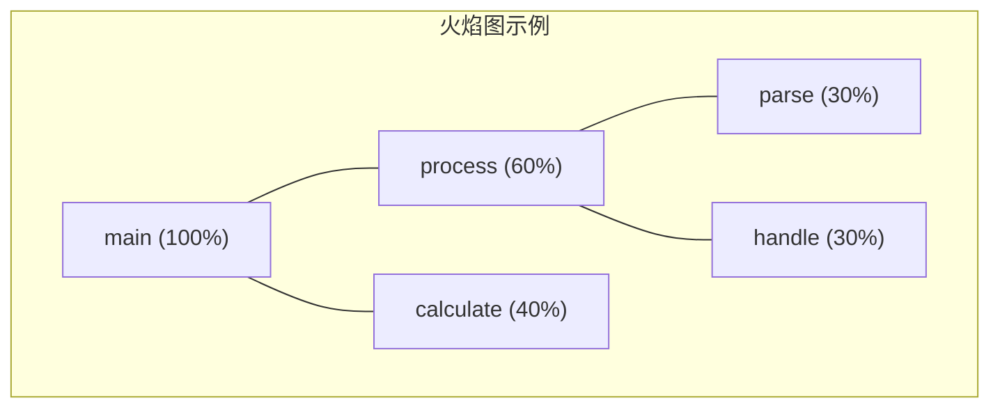

+++
title = "29.HFT笔试题-性能分析"
date = 2026-01-31
description = "HFT性能分析笔试题：延迟测量、perf工具、火焰图、性能瓶颈定位"
[taxonomies]
tags = ["HFT", "笔试", "性能分析", "perf", "低延迟"]
+++

# HFT 笔试题 - 性能分析

本文汇集 HFT（高频交易）性能分析相关的笔试题，覆盖延迟测量、性能工具、瓶颈定位、优化方法等核心概念。

**难度标注**：★☆☆ 基础 | ★★☆ 中级 | ★★★ 困难

---

## 一、选择题

### 题目 1 ★☆☆

测量代码执行时间最精确的方法是：

A. `gettimeofday()`  
B. `clock()`  
C. `rdtsc` 指令  
D. `time` 命令

<details>
<summary>查看答案与解析</summary>

**答案：C**

**精度对比**：

| 方法 | 精度 | 开销 | 适用场景 |
|------|------|------|----------|
| `time` 命令 | 毫秒 | 高 | 粗略测量 |
| `gettimeofday()` | 微秒 | 中 | 一般测量 |
| `clock_gettime()` | 纳秒 | 中 | 精确测量 |
| `rdtsc` | 时钟周期 | 极低 | 微基准测试 |

**rdtsc 使用**：
```c
static inline uint64_t rdtsc() {
    uint32_t lo, hi;
    __asm__ volatile("rdtsc" : "=a"(lo), "=d"(hi));
    return ((uint64_t)hi << 32) | lo;
}

// 使用
uint64_t start = rdtsc();
// 被测代码
uint64_t end = rdtsc();
uint64_t cycles = end - start;

// 转换为纳秒（假设 3GHz CPU）
double ns = cycles / 3.0;
```

**注意事项**：
- 多核需要绑定 CPU
- 考虑 CPU 频率变化
- 使用 `rdtscp` 避免乱序

</details>

---

### 题目 2 ★★☆

以下哪个工具最适合分析 CPU 缓存未命中？

A. `strace`  
B. `perf stat`  
C. `top`  
D. `lsof`

<details>
<summary>查看答案与解析</summary>

**答案：B**

**工具用途对比**：

| 工具 | 用途 |
|------|------|
| `strace` | 系统调用跟踪 |
| `perf stat` | 硬件性能计数器 |
| `top` | 进程资源监控 |
| `lsof` | 打开文件列表 |

**perf stat 缓存分析**：
```bash
$ perf stat -e cache-misses,cache-references,L1-dcache-load-misses ./app

 Performance counter stats for './app':

     1,234,567      cache-references
       123,456      cache-misses     # 10.0% miss rate
        45,678      L1-dcache-load-misses
```

**常用事件**：
```bash
# CPU 周期和指令
perf stat -e cycles,instructions ./app

# 缓存
perf stat -e L1-dcache-loads,L1-dcache-load-misses,LLC-load-misses ./app

# 分支预测
perf stat -e branch-instructions,branch-misses ./app

# TLB
perf stat -e dTLB-load-misses,iTLB-load-misses ./app
```

</details>

---

### 题目 3 ★★☆

火焰图（Flame Graph）的宽度表示什么？

A. 函数调用深度  
B. 函数执行时间占比  
C. 内存使用量  
D. CPU 频率

<details>
<summary>查看答案与解析</summary>

**答案：B**

**火焰图解读**：



- **Y轴**：调用栈深度（底部是根）
- **X轴宽度**：时间/样本占比（越宽越热）

**生成火焰图**：
```bash
# 1. 采集数据
perf record -g ./app

# 2. 生成折叠栈
perf script | stackcollapse-perf.pl > out.folded

# 3. 生成火焰图
flamegraph.pl out.folded > flamegraph.svg
```

**颜色含义**：
- 通常：随机颜色，无特殊含义
- 差分火焰图：红色表示增加，蓝色表示减少

</details>

---

### 题目 4 ★★★

以下哪个因素对延迟的影响最大（单次访问）？

A. L1 缓存未命中  
B. L2 缓存未命中  
C. L3 缓存未命中  
D. 系统调用

<details>
<summary>查看答案与解析</summary>

**答案：D**

**延迟参考值**（现代 CPU）：

| 操作 | 延迟 |
|------|------|
| L1 缓存命中 | ~1-4 cycles (~1ns) |
| L2 缓存命中 | ~10-12 cycles (~4ns) |
| L3 缓存命中 | ~30-50 cycles (~15ns) |
| 内存访问 | ~100-300 cycles (~60-100ns) |
| 系统调用 | ~200-1000 cycles (~100-500ns) |
| 上下文切换 | ~1000-5000 cycles (~1-5μs) |
| 缺页中断 | ~10,000,000 cycles (~10ms) |

**分析**：
- 单次系统调用：~100-500ns
- 单次 L3 未命中到内存：~60-100ns
- 系统调用开销更大

**但频繁 L3 未命中累积影响可能更大**

</details>

---

### 题目 5 ★★★

关于 CPU 流水线停顿（Pipeline Stall），以下哪个不是常见原因？

A. 数据依赖  
B. 分支预测错误  
C. 缓存未命中  
D. 函数内联

<details>
<summary>查看答案与解析</summary>

**答案：D**

**流水线停顿原因**：

| 原因 | 停顿类型 | 解决方案 |
|------|----------|----------|
| 数据依赖 | RAW/WAR/WAW | 寄存器重命名、乱序执行 |
| 分支预测错误 | 控制冒险 | 无分支代码、likely/unlikely |
| 缓存未命中 | 访存延迟 | 预取、缓存友好 |
| 指令缓存未命中 | 取指延迟 | 代码紧凑、热路径对齐 |

**函数内联是优化手段**：
- 减少调用开销
- 可能减少分支
- 增大代码体积

```c
// 内联减少开销
inline int fast_abs(int x) {
    return x >= 0 ? x : -x;
}

// 或使用编译器属性
__attribute__((always_inline))
int critical_path(int x) {
    return x * 2;
}
```

</details>

---

## 二、填空题

### 题目 6 ★☆☆

`perf` 工具的三个主要子命令是：______ 用于统计，______ 用于采样记录，______ 用于实时分析。

<details>
<summary>查看答案</summary>

**答案**：`stat`、`record`、`top`

```bash
# perf stat：事件计数
perf stat -e cycles,instructions ./app
# 输出：总 cycles、instructions、IPC 等

# perf record：采样记录
perf record -g ./app
# 生成 perf.data 文件

# perf report：分析记录
perf report
# 交互式查看热点

# perf top：实时分析
perf top -g
# 类似 top，显示热点函数

# 其他常用：
perf list      # 列出可用事件
perf annotate  # 源码级分析
perf script    # 输出原始数据
```

</details>

---

### 题目 7 ★★☆

CPU 性能指标 IPC 表示 ______ ，理想值接近 ______ ，低于 ______ 通常表示有性能问题。

<details>
<summary>查看答案</summary>

**答案**：Instructions Per Cycle（每周期指令数）、CPU 发射宽度（如 4-6）、1.0

```bash
$ perf stat ./app

 Performance counter stats for './app':

      1,234,567,890      cycles
      2,469,135,780      instructions   # 2.0 IPC

IPC = instructions / cycles = 2.0
```

**IPC 参考**：

| IPC | 状态 | 可能原因 |
|-----|------|----------|
| < 1.0 | 差 | 内存瓶颈、分支错误 |
| 1.0-2.0 | 一般 | 有优化空间 |
| 2.0-4.0 | 好 | 较好利用 |
| > 4.0 | 优秀 | SIMD/超标量利用好 |

**低 IPC 诊断**：
```bash
# 检查缓存未命中
perf stat -e cycles,instructions,cache-misses ./app

# 检查分支预测
perf stat -e cycles,instructions,branch-misses ./app
```

</details>

---

### 题目 8 ★★★

延迟测量常用的百分位数有 p50、p99、p99.9，其中 p99 表示 ______ 的请求延迟低于此值。

<details>
<summary>查看答案</summary>

**答案**：99%

```
延迟分布示例（微秒）：

p50  (中位数): 10μs  - 50%请求低于此值
p90:          25μs  - 90%请求低于此值
p99:          100μs - 99%请求低于此值
p99.9:        500μs - 99.9%请求低于此值
p99.99:       2ms   - 99.99%请求低于此值
max:          10ms  - 最大延迟

为什么关注尾部延迟？
- 用户体验取决于最慢的请求
- 1% 慢请求 × 100次请求/秒 = 每秒1次慢体验
- HFT 中，p99.9 很关键
```

**测量代码**：
```c
#include <algorithm>
#include <vector>

class LatencyStats {
    std::vector<uint64_t> samples;
    
public:
    void record(uint64_t latency_ns) {
        samples.push_back(latency_ns);
    }
    
    void report() {
        std::sort(samples.begin(), samples.end());
        size_t n = samples.size();
        
        printf("p50:   %lu ns\n", samples[n * 50 / 100]);
        printf("p90:   %lu ns\n", samples[n * 90 / 100]);
        printf("p99:   %lu ns\n", samples[n * 99 / 100]);
        printf("p99.9: %lu ns\n", samples[n * 999 / 1000]);
    }
};
```

</details>

---

## 三、简答题

### 题目 9 ★★☆

如何定位程序中的性能热点？

<details>
<summary>参考答案</summary>

**步骤 1：粗粒度分析**

```bash
# 1. 基本统计
$ perf stat ./app

# 2. 采样记录
$ perf record -g ./app

# 3. 查看热点
$ perf report
```

**步骤 2：火焰图分析**

```bash
# 生成火焰图
$ perf script | stackcollapse-perf.pl | flamegraph.pl > flame.svg

# 查看哪些函数占用最多时间
```

**步骤 3：源码级分析**

```bash
# 编译时添加调试信息
$ gcc -g -O2 app.c -o app

# 源码级热点
$ perf annotate function_name
```

**步骤 4：硬件事件分析**

```bash
# CPU 周期分布
$ perf record -e cycles -g ./app

# 缓存未命中热点
$ perf record -e cache-misses -g ./app

# 分支错误热点
$ perf record -e branch-misses -g ./app
```

**常见热点类型**：

| 类型 | 特征 | 优化方向 |
|------|------|----------|
| CPU 密集 | 高 IPC，纯计算 | 算法优化、SIMD |
| 内存瓶颈 | 低 IPC，高缓存未命中 | 数据布局、预取 |
| 分支瓶颈 | 高分支错误率 | 无分支代码 |
| I/O 瓶颈 | 系统调用时间长 | 异步 I/O、批量 |

</details>

---

### 题目 10 ★★★

解释内存带宽瓶颈的识别和优化方法。

<details>
<summary>参考答案</summary>

**识别方法**：

```bash
# 1. 使用 perf 测量内存带宽相关事件
$ perf stat -e LLC-loads,LLC-load-misses,LLC-stores ./app

# 2. 使用 Intel VTune 或 PCM
$ pcm-memory.x
# 显示内存带宽使用

# 3. 使用 bandwidth 测试程序
$ ./stream_c.exe
# 测量实际可达带宽
```

**带宽瓶颈特征**：

| 特征 | 说明 |
|------|------|
| 低 IPC | < 1.0，等待内存 |
| 高 LLC 未命中 | 数据不在缓存 |
| 内存带宽接近峰值 | ~70-80% 峰值带宽 |
| 增加线程无性能提升 | 带宽已饱和 |

**优化方法**：

```c
// 1. 数据布局优化 - SoA vs AoS
// 坏：Array of Structures
struct Particle {
    float x, y, z;
    float vx, vy, vz;
    float mass;
    int id;  // 不常用
};
Particle particles[N];

// 好：Structure of Arrays
struct Particles {
    float x[N], y[N], z[N];
    float vx[N], vy[N], vz[N];
    float mass[N];
    int id[N];  // 分开存放
};

// 2. 软件预取
for (int i = 0; i < N; i += 8) {
    __builtin_prefetch(&data[i + 64], 0, 0);
    process(data[i]);
}

// 3. 使用 SIMD 减少访存次数
__m256 sum = _mm256_setzero_ps();
for (int i = 0; i < N; i += 8) {
    __m256 v = _mm256_load_ps(&data[i]);
    sum = _mm256_add_ps(sum, v);
}

// 4. 循环分块（Cache Blocking）
for (int ii = 0; ii < N; ii += BLOCK) {
    for (int jj = 0; jj < N; jj += BLOCK) {
        for (int i = ii; i < ii + BLOCK; i++) {
            for (int j = jj; j < jj + BLOCK; j++) {
                // 处理块内数据
            }
        }
    }
}
```

</details>

---

## 四、计算题

### 题目 11 ★★☆

一个程序运行 10 秒，perf 显示：

- cycles: 30,000,000,000
- instructions: 45,000,000,000
- cache-misses: 500,000,000
- cache-references: 5,000,000,000

计算：
1. IPC
2. 缓存未命中率
3. 假设 CPU 3GHz，估算缓存未命中造成的延迟

<details>
<summary>参考答案</summary>

**1. IPC 计算**：
```
IPC = instructions / cycles
    = 45,000,000,000 / 30,000,000,000
    = 1.5

说明：性能一般，有优化空间
```

**2. 缓存未命中率**：
```
Miss Rate = cache-misses / cache-references
          = 500,000,000 / 5,000,000,000
          = 10%

说明：未命中率较高，需要优化
```

**3. 延迟估算**：
```
假设：
- L3 未命中到内存：100 cycles
- 每次未命中代价：100 / 3GHz = 33ns

总延迟 = 500,000,000 × 33ns = 16.5 秒

但实际只运行 10 秒，因为：
- 乱序执行隐藏部分延迟
- 硬件预取
- 内存级并行（MLP）

估计浪费的 cycles = 500M × 100 = 50B cycles
占总 cycles = 50B / 30B = 166%（理论值）
实际影响：约 30-50% 性能损失
```

</details>

---

### 题目 12 ★★★

系统有以下延迟分布（10000 个样本）：

| 延迟范围 | 样本数 |
|----------|--------|
| 0-10μs | 5000 |
| 10-20μs | 3000 |
| 20-50μs | 1500 |
| 50-100μs | 400 |
| 100-500μs | 90 |
| 500μs-1ms | 9 |
| >1ms | 1 |

计算 p50、p90、p99、p99.9 的延迟范围。

<details>
<summary>参考答案</summary>

**累计分布计算**：

| 延迟范围 | 样本数 | 累计 | 百分比 |
|----------|--------|------|--------|
| 0-10μs | 5000 | 5000 | 50% |
| 10-20μs | 3000 | 8000 | 80% |
| 20-50μs | 1500 | 9500 | 95% |
| 50-100μs | 400 | 9900 | 99% |
| 100-500μs | 90 | 9990 | 99.9% |
| 500μs-1ms | 9 | 9999 | 99.99% |
| >1ms | 1 | 10000 | 100% |

**百分位数**：
```
p50 (第 5000 个): 0-10μs 范围内 → ~10μs
p90 (第 9000 个): 10-20μs 范围内 → ~17μs
p99 (第 9900 个): 50-100μs 范围边界 → ~50-100μs
p99.9 (第 9990 个): 100-500μs 范围边界 → ~100-500μs

更精确估算（假设均匀分布）：
p50 = 10μs
p90 = 10 + (9000-5000)/(8000-5000) × 10 ≈ 23μs（需修正）
实际 p90 在 10-20μs：10 + (9000-5000)/3000 × 10 ≈ 23μs

p99 = 50μs 左右
p99.9 = 100-500μs 范围
```

**分析**：
- 50% 请求在 10μs 内完成（良好）
- 1% 请求超过 50μs（可接受）
- 0.1% 请求超过 100μs（需关注）
- 尾部延迟（>1ms）需要调查

</details>

---

## 五、编程题

### 题目 13 ★★☆

实现一个高精度延迟测量工具。

<details>
<summary>参考答案</summary>

```c
#include <stdio.h>
#include <stdint.h>
#include <stdlib.h>
#include <time.h>

// 使用 RDTSC 获取时间戳
static inline uint64_t rdtsc() {
    uint32_t lo, hi;
    __asm__ volatile("rdtsc" : "=a"(lo), "=d"(hi));
    return ((uint64_t)hi << 32) | lo;
}

// 使用 RDTSCP（带序列化）
static inline uint64_t rdtscp() {
    uint32_t lo, hi, aux;
    __asm__ volatile("rdtscp" : "=a"(lo), "=d"(hi), "=c"(aux));
    return ((uint64_t)hi << 32) | lo;
}

// 获取 CPU 频率（GHz）
static double get_cpu_freq_ghz() {
    struct timespec start, end;
    uint64_t tsc_start, tsc_end;
    
    clock_gettime(CLOCK_MONOTONIC, &start);
    tsc_start = rdtsc();
    
    // 等待 100ms
    struct timespec sleep_time = {0, 100000000};
    nanosleep(&sleep_time, NULL);
    
    clock_gettime(CLOCK_MONOTONIC, &end);
    tsc_end = rdtsc();
    
    double elapsed_ns = (end.tv_sec - start.tv_sec) * 1e9 +
                        (end.tv_nsec - start.tv_nsec);
    double cycles = tsc_end - tsc_start;
    
    return cycles / elapsed_ns;
}

// 延迟统计
typedef struct {
    uint64_t *samples;
    size_t count;
    size_t capacity;
    double cpu_freq_ghz;
} latency_stats_t;

void stats_init(latency_stats_t *stats, size_t capacity) {
    stats->samples = malloc(capacity * sizeof(uint64_t));
    stats->count = 0;
    stats->capacity = capacity;
    stats->cpu_freq_ghz = get_cpu_freq_ghz();
    printf("CPU Frequency: %.2f GHz\n", stats->cpu_freq_ghz);
}

void stats_record(latency_stats_t *stats, uint64_t cycles) {
    if (stats->count < stats->capacity) {
        stats->samples[stats->count++] = cycles;
    }
}

static int compare_uint64(const void *a, const void *b) {
    uint64_t va = *(uint64_t*)a;
    uint64_t vb = *(uint64_t*)b;
    return (va > vb) - (va < vb);
}

void stats_report(latency_stats_t *stats) {
    if (stats->count == 0) return;
    
    qsort(stats->samples, stats->count, sizeof(uint64_t), compare_uint64);
    
    double freq = stats->cpu_freq_ghz;
    
    printf("\n=== Latency Report (%zu samples) ===\n", stats->count);
    printf("%-10s %12s %12s\n", "Percentile", "Cycles", "Nanoseconds");
    printf("%-10s %12s %12s\n", "----------", "------", "-----------");
    
    size_t percentiles[] = {50, 90, 95, 99, 999, 9999};
    const char *labels[] = {"p50", "p90", "p95", "p99", "p99.9", "p99.99"};
    
    for (int i = 0; i < 6; i++) {
        size_t idx = stats->count * percentiles[i] / 
                     (percentiles[i] < 100 ? 100 : 
                      percentiles[i] < 1000 ? 1000 : 10000);
        if (idx >= stats->count) idx = stats->count - 1;
        
        uint64_t cycles = stats->samples[idx];
        double ns = cycles / freq;
        
        printf("%-10s %12lu %12.1f\n", labels[i], cycles, ns);
    }
    
    // 最小/最大/平均
    uint64_t min = stats->samples[0];
    uint64_t max = stats->samples[stats->count - 1];
    
    uint64_t sum = 0;
    for (size_t i = 0; i < stats->count; i++) {
        sum += stats->samples[i];
    }
    double avg = (double)sum / stats->count;
    
    printf("\n");
    printf("Min:       %12lu %12.1f ns\n", min, min / freq);
    printf("Max:       %12lu %12.1f ns\n", max, max / freq);
    printf("Average:   %12.1f %12.1f ns\n", avg, avg / freq);
}

void stats_destroy(latency_stats_t *stats) {
    free(stats->samples);
}

// 测试示例
void test_function() {
    volatile int sum = 0;
    for (int i = 0; i < 100; i++) {
        sum += i;
    }
}

int main() {
    latency_stats_t stats;
    stats_init(&stats, 100000);
    
    // 预热
    for (int i = 0; i < 1000; i++) {
        test_function();
    }
    
    // 测量
    for (int i = 0; i < 100000; i++) {
        uint64_t start = rdtscp();
        test_function();
        uint64_t end = rdtscp();
        stats_record(&stats, end - start);
    }
    
    stats_report(&stats);
    stats_destroy(&stats);
    
    return 0;
}
```

</details>

---

### 题目 14 ★★★

实现一个简单的采样分析器。

<details>
<summary>参考答案</summary>

```c
#define _GNU_SOURCE
#include <stdio.h>
#include <stdlib.h>
#include <signal.h>
#include <sys/time.h>
#include <ucontext.h>
#include <execinfo.h>
#include <string.h>
#include <dlfcn.h>

#define MAX_SAMPLES 10000
#define MAX_STACK_DEPTH 32

typedef struct {
    void *pc;           // 程序计数器
    int count;          // 命中次数
} sample_t;

typedef struct {
    sample_t samples[MAX_SAMPLES];
    int num_samples;
    int total_count;
} profiler_t;

static profiler_t profiler;

// 查找或添加样本
static void add_sample(void *pc) {
    for (int i = 0; i < profiler.num_samples; i++) {
        if (profiler.samples[i].pc == pc) {
            profiler.samples[i].count++;
            profiler.total_count++;
            return;
        }
    }
    
    if (profiler.num_samples < MAX_SAMPLES) {
        profiler.samples[profiler.num_samples].pc = pc;
        profiler.samples[profiler.num_samples].count = 1;
        profiler.num_samples++;
        profiler.total_count++;
    }
}

// 信号处理器
static void signal_handler(int sig, siginfo_t *info, void *context) {
    ucontext_t *uc = (ucontext_t *)context;
    
    // 获取程序计数器（x86_64）
    #if defined(__x86_64__)
    void *pc = (void *)uc->uc_mcontext.gregs[REG_RIP];
    #elif defined(__aarch64__)
    void *pc = (void *)uc->uc_mcontext.pc;
    #else
    void *pc = NULL;
    #endif
    
    if (pc) {
        add_sample(pc);
    }
}

// 启动分析器
void profiler_start(int frequency_hz) {
    memset(&profiler, 0, sizeof(profiler));
    
    // 设置信号处理器
    struct sigaction sa;
    sa.sa_sigaction = signal_handler;
    sa.sa_flags = SA_SIGINFO | SA_RESTART;
    sigemptyset(&sa.sa_mask);
    sigaction(SIGPROF, &sa, NULL);
    
    // 设置定时器
    struct itimerval timer;
    timer.it_value.tv_sec = 0;
    timer.it_value.tv_usec = 1000000 / frequency_hz;
    timer.it_interval = timer.it_value;
    setitimer(ITIMER_PROF, &timer, NULL);
    
    printf("Profiler started at %d Hz\n", frequency_hz);
}

// 停止分析器
void profiler_stop() {
    struct itimerval timer = {0};
    setitimer(ITIMER_PROF, &timer, NULL);
}

// 比较函数（按命中次数降序）
static int compare_samples(const void *a, const void *b) {
    return ((sample_t*)b)->count - ((sample_t*)a)->count;
}

// 输出报告
void profiler_report() {
    profiler_stop();
    
    printf("\n=== Profiler Report ===\n");
    printf("Total samples: %d\n\n", profiler.total_count);
    
    // 排序
    qsort(profiler.samples, profiler.num_samples, 
          sizeof(sample_t), compare_samples);
    
    printf("%-40s %10s %8s\n", "Symbol", "Count", "Percent");
    printf("%-40s %10s %8s\n", "------", "-----", "-------");
    
    for (int i = 0; i < profiler.num_samples && i < 20; i++) {
        sample_t *s = &profiler.samples[i];
        
        // 解析符号
        Dl_info info;
        const char *symbol = "???";
        if (dladdr(s->pc, &info) && info.dli_sname) {
            symbol = info.dli_sname;
        }
        
        double percent = 100.0 * s->count / profiler.total_count;
        printf("%-40s %10d %7.2f%%\n", symbol, s->count, percent);
    }
}

// 测试代码
void __attribute__((noinline)) hot_function() {
    volatile double x = 0;
    for (int i = 0; i < 10000; i++) {
        x += i * 0.1;
    }
}

void __attribute__((noinline)) warm_function() {
    volatile double x = 0;
    for (int i = 0; i < 5000; i++) {
        x += i * 0.1;
    }
}

void __attribute__((noinline)) cold_function() {
    volatile double x = 0;
    for (int i = 0; i < 1000; i++) {
        x += i * 0.1;
    }
}

int main() {
    profiler_start(1000);  // 1000 Hz 采样
    
    for (int i = 0; i < 10000; i++) {
        hot_function();
        if (i % 2 == 0) warm_function();
        if (i % 10 == 0) cold_function();
    }
    
    profiler_report();
    
    return 0;
}
```

编译和运行：
```bash
gcc -g -O2 -rdynamic profiler.c -ldl -o profiler
./profiler
```

</details>

---

## 六、Bug 分析题

### 题目 15 ★★☆

以下性能测试代码有什么问题？

```c
void benchmark() {
    clock_t start = clock();
    
    for (int i = 0; i < 1000000; i++) {
        int result = compute(i);
    }
    
    clock_t end = clock();
    printf("Time: %f seconds\n", 
           (double)(end - start) / CLOCKS_PER_SEC);
}
```

<details>
<summary>查看答案与解析</summary>

**问题**：
1. 结果未使用，编译器可能优化掉整个循环
2. `clock()` 精度不够（毫秒级）
3. 没有预热阶段
4. 单次测量不可靠

**修复**：

```c
#include <time.h>

// 防止优化
volatile int sink;

void benchmark() {
    // 1. 预热
    for (int i = 0; i < 10000; i++) {
        sink = compute(i);
    }
    
    // 2. 使用高精度计时
    struct timespec start, end;
    clock_gettime(CLOCK_MONOTONIC, &start);
    
    // 3. 多次测量
    int iterations = 1000000;
    for (int i = 0; i < iterations; i++) {
        sink = compute(i);  // 结果存到 volatile 变量
    }
    
    clock_gettime(CLOCK_MONOTONIC, &end);
    
    // 4. 计算每次操作的时间
    double elapsed_ns = (end.tv_sec - start.tv_sec) * 1e9 +
                        (end.tv_nsec - start.tv_nsec);
    printf("Time per op: %.2f ns\n", elapsed_ns / iterations);
}

// 或使用 Google Benchmark 库
// BENCHMARK(compute)->Iterations(1000000);
```

</details>

---

### 题目 16 ★★★

以下代码的性能分析结果令人困惑，分析原因。

```c
void process(int *data, int n) {
    for (int i = 0; i < n; i++) {
        if (data[i] > 0) {
            result[i] = data[i] * 2;
        } else {
            result[i] = data[i];
        }
    }
}

// perf 显示：高 branch-misses
// 但代码看起来很简单
```

<details>
<summary>查看答案与解析</summary>

**问题**：分支模式不可预测。

```
如果 data 是随机数据：
data: [3, -1, 5, -2, 1, -4, 7, ...]
分支: T,  F,  T,  F,  T,  F,  T, ...

CPU 无法预测下一次分支方向
每次预测错误：~15-20 cycles 惩罚
```

**修复方案**：

```c
// 方案 1：无分支代码
void process_v1(int *data, int n) {
    for (int i = 0; i < n; i++) {
        // 使用算术代替分支
        int positive = -(data[i] > 0);  // 全 1 或全 0
        result[i] = data[i] + (data[i] & positive);
    }
}

// 方案 2：使用 SIMD
#include <immintrin.h>

void process_v2(int *data, int n) {
    for (int i = 0; i < n; i += 8) {
        __m256i v = _mm256_load_si256((__m256i*)&data[i]);
        __m256i zero = _mm256_setzero_si256();
        __m256i mask = _mm256_cmpgt_epi32(v, zero);  // 比较
        __m256i doubled = _mm256_add_epi32(v, 
                           _mm256_and_si256(v, mask));  // 条件加
        _mm256_store_si256((__m256i*)&result[i], doubled);
    }
}

// 方案 3：使用条件移动
void process_v3(int *data, int n) {
    for (int i = 0; i < n; i++) {
        int val = data[i];
        int doubled = val * 2;
        // 编译器可能生成 cmov
        result[i] = (val > 0) ? doubled : val;
    }
}
```

**验证优化效果**：
```bash
perf stat -e branch-misses,instructions ./original
perf stat -e branch-misses,instructions ./optimized
```

</details>

---

## 七、高频考点总结

| 考点 | 频率 | 难度 | 关键知识 |
|------|------|------|----------|
| 延迟测量 | ★★★ | ★★☆ | rdtsc、clock_gettime |
| perf 工具 | ★★★ | ★★☆ | stat/record/report |
| 火焰图 | ★★★ | ★★☆ | 生成、解读 |
| 缓存分析 | ★★☆ | ★★★ | 未命中率、带宽 |
| IPC 分析 | ★★☆ | ★★☆ | 瓶颈识别 |
| 百分位延迟 | ★★★ | ★★☆ | p99、尾部延迟 |
| 分支预测 | ★★☆ | ★★★ | 无分支优化 |

---

## 相关文章

- [上一篇：HFT笔试题-无锁数据结构](/articles/hft/hft-28-HFT笔试题-无锁数据结构/)
- [下一篇：HFT笔试题-缓存友好编程](/articles/hft/hft-30-HFT笔试题-缓存友好编程/)
- [perf性能分析工具深度解析](/articles/linux/linux-37-perf性能分析工具深度解析/) - perf 底层原理详解