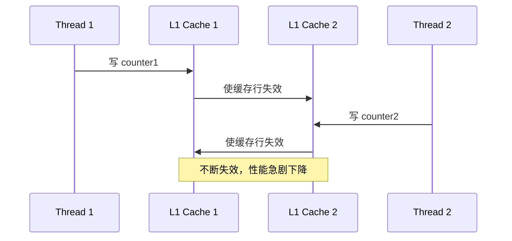
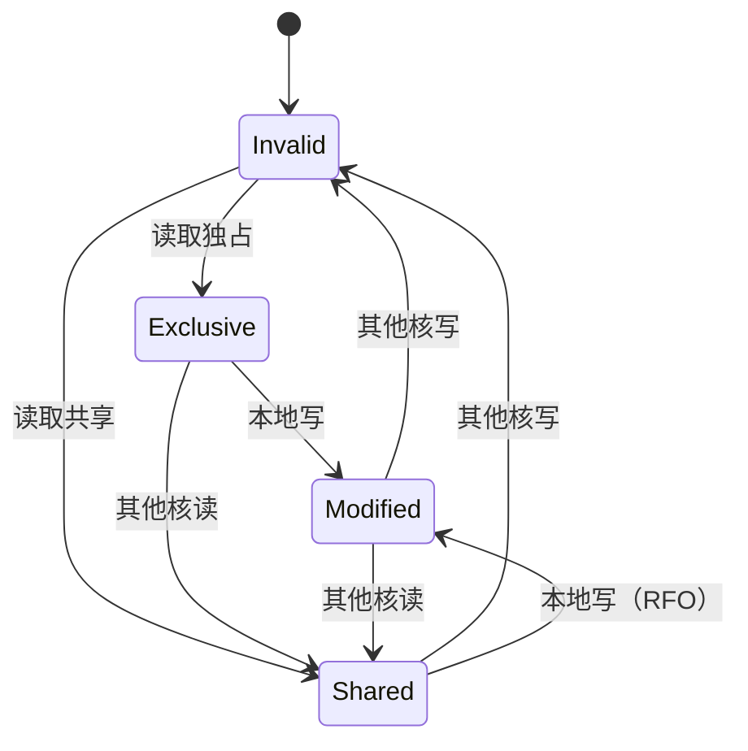

+++
title = "HFT笔试题-缓存友好编程"
date = 2026-01-31
weight = 30000
description = "HFT缓存友好编程笔试题：缓存层次、伪共享、数据布局、预取优化"
[taxonomies]
tags = ["HFT", "笔试", "缓存", "性能优化", "低延迟"]
+++

# HFT 笔试题 - 缓存友好编程

本文汇集 HFT（高频交易）缓存友好编程相关的笔试题，覆盖缓存层次、伪共享、数据布局、预取等核心概念。

**难度标注**：★☆☆ 基础 | ★★☆ 中级 | ★★★ 困难

---

## 一、选择题

### 题目 1 ★☆☆

现代 CPU 缓存行（Cache Line）的典型大小是：

A. 16 字节  
B. 32 字节  
C. 64 字节  
D. 128 字节

<details>
<summary>查看答案与解析</summary>

**答案：C**

**缓存行大小**：

| 架构 | L1/L2 缓存行 | L3 缓存行 |
|------|--------------|-----------|
| x86/x86_64 | 64 bytes | 64 bytes |
| ARM Cortex-A | 64 bytes | 64 bytes |
| Apple M1/M2 | 128 bytes | 128 bytes |

**为什么 64 字节**：
- 空间局部性利用
- 内存总线效率
- 硬件复杂度平衡

```c
// 查看缓存行大小
$ getconf LEVEL1_DCACHE_LINESIZE
64

// C 代码对齐
#define CACHE_LINE 64
struct alignas(CACHE_LINE) MyStruct {
    // ...
};
```

</details>

---

### 题目 2 ★★☆

伪共享（False Sharing）是指：

A. 多个线程共享同一变量  
B. 多个线程访问同一缓存行中的不同变量  
C. 缓存数据不一致  
D. 内存泄漏

<details>
<summary>查看答案与解析</summary>

**答案：B**

**伪共享示例**：

```c
// 错误：counter1 和 counter2 在同一缓存行
struct {
    int counter1;  // Thread 1 写
    int counter2;  // Thread 2 写
} shared;

// 缓存行抖动：
// Thread 1 写 counter1 → 使 Thread 2 的缓存行失效
// Thread 2 写 counter2 → 使 Thread 1 的缓存行失效
```



**解决方案**：

```c
// 正确：每个计数器独占一个缓存行
struct {
    alignas(64) int counter1;
    alignas(64) int counter2;
} shared;
```

</details>

---

### 题目 3 ★★☆

关于缓存预取（Prefetch），以下描述**错误**的是：

A. 软件预取使用 `__builtin_prefetch`  
B. 硬件预取能自动检测顺序访问模式  
C. 预取总是能提升性能  
D. 预取距离需要根据延迟和循环次数调整

<details>
<summary>查看答案与解析</summary>

**答案：C**

**预取可能无效或有害的情况**：

| 情况 | 原因 |
|------|------|
| 随机访问 | 预取的数据不会被使用 |
| 小数据量 | 已在缓存中 |
| 预取太早 | 被驱逐出缓存 |
| 预取太晚 | 没有隐藏延迟 |
| 带宽饱和 | 增加无效流量 |

**正确使用预取**：

```c
// 计算预取距离
// 假设：循环体 100 cycles，内存延迟 200 cycles
// 预取距离 = 200 / 100 = 2 次迭代

for (int i = 0; i < N; i++) {
    // 预取 2 次迭代后的数据
    __builtin_prefetch(&data[i + 2], 0, 3);
    
    process(data[i]);  // 100 cycles
}
```

</details>

---

### 题目 4 ★★★

AoS（Array of Structures）和 SoA（Structure of Arrays）哪种更缓存友好？

A. AoS 总是更好  
B. SoA 总是更好  
C. 取决于访问模式  
D. 两者性能相同

<details>
<summary>查看答案与解析</summary>

**答案：C**

**对比**：

```c
// AoS - Array of Structures
struct Particle {
    float x, y, z;
    float vx, vy, vz;
    float mass;
};
Particle particles[N];

// SoA - Structure of Arrays
struct Particles {
    float x[N], y[N], z[N];
    float vx[N], vy[N], vz[N];
    float mass[N];
};
```

| 访问模式 | 推荐布局 | 原因 |
|----------|----------|------|
| 所有字段 | AoS | 一次加载所有数据 |
| 单个字段 | SoA | 连续访问，SIMD 友好 |
| 部分字段 | SoA | 避免加载无用数据 |

**SoA 优势场景**：

```c
// 只更新位置：SoA 更优
for (int i = 0; i < N; i++) {
    x[i] += vx[i] * dt;  // 连续访问
    y[i] += vy[i] * dt;
    z[i] += vz[i] * dt;
}

// SIMD 优化
for (int i = 0; i < N; i += 8) {
    __m256 vx = _mm256_load_ps(&x[i]);
    __m256 va = _mm256_load_ps(&vx[i]);
    vx = _mm256_fmadd_ps(va, dt_vec, vx);
    _mm256_store_ps(&x[i], vx);
}
```

</details>

---

### 题目 5 ★★★

以下哪种矩阵遍历顺序最缓存友好（C 语言，行优先存储）？

A. 逐列遍历  
B. 逐行遍历  
C. 对角线遍历  
D. 随机遍历

<details>
<summary>查看答案与解析</summary>

**答案：B**

**C 语言矩阵内存布局**（行优先）：

```
逻辑视图：          内存布局：
[0,0] [0,1] [0,2]   [0,0] [0,1] [0,2] [1,0] [1,1] [1,2] ...
[1,0] [1,1] [1,2]   
[2,0] [2,1] [2,2]   
```

**性能对比**：

```c
// 好：逐行遍历（顺序访问）
for (int i = 0; i < N; i++) {
    for (int j = 0; j < N; j++) {
        sum += matrix[i][j];  // 连续地址
    }
}

// 差：逐列遍历（跳跃访问）
for (int j = 0; j < N; j++) {
    for (int i = 0; i < N; i++) {
        sum += matrix[i][j];  // 跨行跳跃
    }
}
```

**缓存效率**：
```
行遍历：每个缓存行使用全部 64 字节
列遍历：每个缓存行只用 4/8 字节（int/double）

假设 N=1024, int 类型：
行遍历：缓存未命中 = N × N / 16 = 65536 次
列遍历：缓存未命中 = N × N = 1048576 次
```

</details>

---

## 二、填空题

### 题目 6 ★☆☆

现代 CPU 缓存层次通常有 ______ 层，其中 ______ 最快但最小，______ 最大但最慢。

<details>
<summary>查看答案</summary>

**答案**：3 层，L1，L3

**典型缓存配置**（Intel/AMD 现代 CPU）：

| 层级 | 大小 | 延迟 | 特点 |
|------|------|------|------|
| L1 Data | 32-48 KB/核 | 4-5 cycles | 最快，分离指令/数据 |
| L1 Inst | 32-48 KB/核 | 4-5 cycles | 指令缓存 |
| L2 | 256-512 KB/核 | 10-12 cycles | 统一缓存 |
| L3 | 16-64 MB/芯片 | 30-50 cycles | 共享，包含性 |

```bash
# Linux 查看缓存配置
$ lscpu | grep cache
L1d cache:           32K
L1i cache:           32K
L2 cache:            256K
L3 cache:            8192K
```

</details>

---

### 题目 7 ★★☆

缓存一致性协议中，MESI 的四个状态分别是 ______ 、______ 、______ 、______ 。

<details>
<summary>查看答案</summary>

**答案**：Modified、Exclusive、Shared、Invalid

| 状态 | 含义 | 操作 |
|------|------|------|
| Modified | 已修改，只有本缓存有 | 可读写，回写内存 |
| Exclusive | 独占，与内存一致 | 可读写，不需回写 |
| Shared | 共享，多个缓存都有 | 只读，写需广播 |
| Invalid | 无效 | 需要重新加载 |



</details>

---

### 题目 8 ★★★

循环分块（Loop Blocking/Tiling）的目的是让工作集适合 ______ ，块大小通常选择使数据量约等于 ______ 大小。

<details>
<summary>查看答案</summary>

**答案**：缓存，L1 或 L2 缓存

**矩阵乘法示例**：

```c
// 朴素实现：工作集可能超过缓存
for (int i = 0; i < N; i++) {
    for (int j = 0; j < N; j++) {
        for (int k = 0; k < N; k++) {
            C[i][j] += A[i][k] * B[k][j];
        }
    }
}

// 分块实现：保持数据在缓存中
#define BLOCK 64  // 根据缓存大小调整

for (int ii = 0; ii < N; ii += BLOCK) {
    for (int jj = 0; jj < N; jj += BLOCK) {
        for (int kk = 0; kk < N; kk += BLOCK) {
            // 处理 BLOCK × BLOCK 的子块
            for (int i = ii; i < ii + BLOCK; i++) {
                for (int j = jj; j < jj + BLOCK; j++) {
                    float sum = C[i][j];
                    for (int k = kk; k < kk + BLOCK; k++) {
                        sum += A[i][k] * B[k][j];
                    }
                    C[i][j] = sum;
                }
            }
        }
    }
}

// BLOCK 选择：
// 3 个 BLOCK×BLOCK 矩阵 × sizeof(float) ≤ L1 大小
// 3 × 64 × 64 × 4 = 48KB ≈ 32KB L1（略大但可接受）
```

</details>

---

## 三、简答题

### 题目 9 ★★☆

如何检测和解决伪共享问题？

<details>
<summary>参考答案</summary>

**检测方法**：

```bash
# 1. perf 查看缓存一致性流量
$ perf stat -e cache-misses,LLC-store-misses ./app

# 2. perf c2c（Cache-to-Cache）
$ perf c2c record ./app
$ perf c2c report

# 3. Intel VTune
# 查看 "Contested Accesses" 指标
```

**代码层面识别**：
```c
// 可疑模式：相邻变量被不同线程访问
struct {
    int counter_thread1;  // Thread 1
    int counter_thread2;  // Thread 2
} shared;  // 同一缓存行！
```

**解决方案**：

```c
// 方案 1：缓存行对齐
struct {
    alignas(64) int counter_thread1;
    alignas(64) int counter_thread2;
} shared;

// 方案 2：填充
struct {
    int counter_thread1;
    char padding[60];  // 填充到 64 字节
    int counter_thread2;
} shared;

// 方案 3：使用标准库
#include <new>
struct alignas(std::hardware_destructive_interference_size) 
    AlignedCounter {
    int value;
};

// 方案 4：Thread-Local 存储
__thread int local_counter;

void aggregate() {
    global_counter = 0;
    for (int t = 0; t < num_threads; t++) {
        global_counter += thread_counters[t];
    }
}
```

</details>

---

### 题目 10 ★★★

解释缓存预取的策略和最佳实践。

<details>
<summary>参考答案</summary>

**预取类型**：

| 类型 | 触发方式 | 优点 | 缺点 |
|------|----------|------|------|
| 硬件预取 | 自动检测模式 | 无需代码修改 | 只支持顺序/步长 |
| 软件预取 | 手动指令 | 灵活 | 需要调优 |

**软件预取使用**：

```c
// GCC 内建函数
__builtin_prefetch(addr, rw, locality);
// addr: 预取地址
// rw: 0=读, 1=写
// locality: 0=一次性, 1=低, 2=中, 3=高（保留在缓存）

// 示例：遍历链表
for (node *p = head; p; p = p->next) {
    __builtin_prefetch(p->next, 0, 3);  // 预取下一个节点
    process(p->data);
}
```

**预取距离计算**：

```c
// 预取距离 = 内存延迟 / 循环体时间
// 假设：内存延迟 200 cycles，循环体 50 cycles
// 距离 = 200 / 50 = 4 次迭代

for (int i = 0; i < N; i++) {
    __builtin_prefetch(&data[i + 4], 0, 0);
    process(data[i]);  // 50 cycles
}
```

**最佳实践**：

```c
// 1. 测量验证
uint64_t start = rdtsc();
// 带预取的代码
uint64_t with_prefetch = rdtsc() - start;

start = rdtsc();
// 不带预取的代码
uint64_t without_prefetch = rdtsc() - start;

// 2. 避免预取已在缓存的数据
if (likely_cache_miss) {
    __builtin_prefetch(addr, 0, 0);
}

// 3. 对于复杂访问模式，考虑重组数据
```

</details>

---

## 四、计算题

### 题目 11 ★★☆

一个结构体定义如下：

```c
struct Data {
    int id;        // 4 bytes
    double value;  // 8 bytes
    char flag;     // 1 byte
    int count;     // 4 bytes
};
```

计算：
1. 该结构体的大小（考虑对齐）
2. 处理 1000000 个该结构体需要多少缓存行

<details>
<summary>参考答案</summary>

**1. 结构体大小分析**：

```c
struct Data {
    int id;        // offset 0, size 4
    // 4 bytes padding（double 需要 8 字节对齐）
    double value;  // offset 8, size 8
    char flag;     // offset 16, size 1
    // 3 bytes padding（int 需要 4 字节对齐）
    int count;     // offset 20, size 4
    // 4 bytes padding（结构体按最大对齐 8 字节）
};  // 总大小 = 24 字节

// 验证
printf("sizeof(Data) = %zu\n", sizeof(struct Data));  // 24
```

**内存布局**：
```
Offset:  0   4   8       16  20  24
        [id ][PAD][value   ][f][P][cnt][PAD]
        4    4   8         1  3  4    4
```

**2. 缓存行计算**：

```
每个缓存行 64 字节
每个缓存行可容纳 64 / 24 = 2.67，取 2 个结构体

1000000 个结构体需要：
缓存行数 = ceil(1000000 / 2) = 500000 个缓存行
总大小 = 500000 × 64 = 32,000,000 字节 ≈ 30.5 MB

实际占用 = 1000000 × 24 = 24,000,000 字节 ≈ 22.9 MB
浪费 = 32MB - 24MB = 8MB（25% 浪费）
```

**优化后**：
```c
struct DataOptimized {
    double value;  // offset 0, size 8
    int id;        // offset 8, size 4
    int count;     // offset 12, size 4
    char flag;     // offset 16, size 1
    char padding[7]; // 显式填充到 24 或压缩
};  // 可压缩到 17-24 字节

// 最紧凑版本（pragma pack）
#pragma pack(push, 1)
struct DataPacked {
    double value;  // 8
    int id;        // 4
    int count;     // 4
    char flag;     // 1
};  // 17 字节
#pragma pack(pop)
```

</details>

---

### 题目 12 ★★★

比较两种矩阵遍历的缓存效率：

矩阵大小：1024×1024，元素类型 int（4字节）

方式 A：逐行遍历  
方式 B：逐列遍历

<details>
<summary>参考答案</summary>

**分析**：

```
矩阵总大小 = 1024 × 1024 × 4 = 4 MB
每行大小 = 1024 × 4 = 4096 字节 = 64 个缓存行

假设 L1 Data Cache = 32 KB = 512 个缓存行
```

**方式 A：逐行遍历**

```c
for (int i = 0; i < 1024; i++) {
    for (int j = 0; j < 1024; j++) {
        sum += matrix[i][j];
    }
}
```

```
访问模式：matrix[0][0], matrix[0][1], ..., matrix[0][1023], matrix[1][0], ...
缓存行使用率 = 64 / 64 = 100%（每行连续访问）

缓存未命中次数：
- 每行 64 个缓存行
- 1024 行
- 总未命中 = 1024 × 64 = 65,536 次（强制未命中）
```

**方式 B：逐列遍历**

```c
for (int j = 0; j < 1024; j++) {
    for (int i = 0; i < 1024; i++) {
        sum += matrix[i][j];
    }
}
```

```
访问模式：matrix[0][0], matrix[1][0], ..., matrix[1023][0], matrix[0][1], ...
相邻访问间隔 = 1024 × 4 = 4096 字节 = 64 个缓存行

缓存行使用率 = 4 / 64 = 6.25%（只用每个缓存行的 1 个元素）

缓存未命中分析：
- L1 只有 512 个缓存行
- 遍历一列需要 1024 个缓存行
- 每次访问都未命中！
- 总未命中 = 1024 × 1024 = 1,048,576 次
```

**对比**：

| 方式 | 缓存未命中 | 相对性能 |
|------|------------|----------|
| 逐行 | 65,536 | 1x（基准） |
| 逐列 | 1,048,576 | ~16x 慢 |

**实际测量**（可能结果）：
```
Row-major: 50 ms
Col-major: 800 ms
```

</details>

---

## 五、编程题

### 题目 13 ★★☆

实现一个缓存友好的矩阵乘法（分块实现）。

<details>
<summary>参考答案</summary>

```c
#include <stdio.h>
#include <stdlib.h>
#include <string.h>
#include <time.h>

#define N 1024
#define BLOCK_SIZE 64  // 根据 L1 缓存调整

void matrix_multiply_naive(float *A, float *B, float *C) {
    for (int i = 0; i < N; i++) {
        for (int j = 0; j < N; j++) {
            float sum = 0;
            for (int k = 0; k < N; k++) {
                sum += A[i * N + k] * B[k * N + j];
            }
            C[i * N + j] = sum;
        }
    }
}

void matrix_multiply_blocked(float *A, float *B, float *C) {
    memset(C, 0, N * N * sizeof(float));
    
    for (int ii = 0; ii < N; ii += BLOCK_SIZE) {
        for (int jj = 0; jj < N; jj += BLOCK_SIZE) {
            for (int kk = 0; kk < N; kk += BLOCK_SIZE) {
                // 子块乘法
                for (int i = ii; i < ii + BLOCK_SIZE && i < N; i++) {
                    for (int j = jj; j < jj + BLOCK_SIZE && j < N; j++) {
                        float sum = C[i * N + j];
                        for (int k = kk; k < kk + BLOCK_SIZE && k < N; k++) {
                            sum += A[i * N + k] * B[k * N + j];
                        }
                        C[i * N + j] = sum;
                    }
                }
            }
        }
    }
}

// 进一步优化：预转置 B 矩阵
void matrix_multiply_optimized(float *A, float *B, float *C) {
    // 转置 B
    float *BT = malloc(N * N * sizeof(float));
    for (int i = 0; i < N; i++) {
        for (int j = 0; j < N; j++) {
            BT[j * N + i] = B[i * N + j];
        }
    }
    
    memset(C, 0, N * N * sizeof(float));
    
    for (int ii = 0; ii < N; ii += BLOCK_SIZE) {
        for (int jj = 0; jj < N; jj += BLOCK_SIZE) {
            for (int i = ii; i < ii + BLOCK_SIZE; i++) {
                for (int j = jj; j < jj + BLOCK_SIZE; j++) {
                    float sum = 0;
                    // 现在 A 和 BT 都是行访问
                    for (int k = 0; k < N; k++) {
                        sum += A[i * N + k] * BT[j * N + k];
                    }
                    C[i * N + j] = sum;
                }
            }
        }
    }
    
    free(BT);
}

double get_time() {
    struct timespec ts;
    clock_gettime(CLOCK_MONOTONIC, &ts);
    return ts.tv_sec + ts.tv_nsec * 1e-9;
}

int main() {
    float *A = aligned_alloc(64, N * N * sizeof(float));
    float *B = aligned_alloc(64, N * N * sizeof(float));
    float *C = aligned_alloc(64, N * N * sizeof(float));
    
    // 初始化
    for (int i = 0; i < N * N; i++) {
        A[i] = (float)(rand() % 100) / 100.0f;
        B[i] = (float)(rand() % 100) / 100.0f;
    }
    
    double t1, t2;
    
    // 朴素版本
    t1 = get_time();
    matrix_multiply_naive(A, B, C);
    t2 = get_time();
    printf("Naive:     %.3f seconds\n", t2 - t1);
    
    // 分块版本
    t1 = get_time();
    matrix_multiply_blocked(A, B, C);
    t2 = get_time();
    printf("Blocked:   %.3f seconds\n", t2 - t1);
    
    // 优化版本
    t1 = get_time();
    matrix_multiply_optimized(A, B, C);
    t2 = get_time();
    printf("Optimized: %.3f seconds\n", t2 - t1);
    
    free(A);
    free(B);
    free(C);
    
    return 0;
}
```

</details>

---

### 题目 14 ★★★

实现一个避免伪共享的并行计数器。

<details>
<summary>参考答案</summary>

```c
#include <stdio.h>
#include <stdlib.h>
#include <pthread.h>
#include <stdatomic.h>
#include <time.h>

#define NUM_THREADS 4
#define ITERATIONS 100000000

// 错误版本：伪共享
struct BadCounters {
    atomic_long counter[NUM_THREADS];
};

// 正确版本：缓存行对齐
struct GoodCounters {
    struct {
        atomic_long value;
        char padding[56];  // 填充到 64 字节
    } counter[NUM_THREADS];
};

// 使用 alignas（C11/C++11）
struct BestCounters {
    struct alignas(64) {
        atomic_long value;
    } counter[NUM_THREADS];
};

struct BadCounters bad_counters = {0};
struct GoodCounters good_counters = {0};
struct BestCounters best_counters = {0};

void *bad_worker(void *arg) {
    int id = *(int *)arg;
    for (long i = 0; i < ITERATIONS; i++) {
        atomic_fetch_add(&bad_counters.counter[id], 1);
    }
    return NULL;
}

void *good_worker(void *arg) {
    int id = *(int *)arg;
    for (long i = 0; i < ITERATIONS; i++) {
        atomic_fetch_add(&good_counters.counter[id].value, 1);
    }
    return NULL;
}

void *best_worker(void *arg) {
    int id = *(int *)arg;
    // 批量更新，减少原子操作
    long local = 0;
    for (long i = 0; i < ITERATIONS; i++) {
        local++;
        if (local >= 1000) {
            atomic_fetch_add(&best_counters.counter[id].value, local);
            local = 0;
        }
    }
    atomic_fetch_add(&best_counters.counter[id].value, local);
    return NULL;
}

double get_time() {
    struct timespec ts;
    clock_gettime(CLOCK_MONOTONIC, &ts);
    return ts.tv_sec + ts.tv_nsec * 1e-9;
}

void benchmark(const char *name, void *(*worker)(void *)) {
    pthread_t threads[NUM_THREADS];
    int ids[NUM_THREADS];
    
    double start = get_time();
    
    for (int i = 0; i < NUM_THREADS; i++) {
        ids[i] = i;
        pthread_create(&threads[i], NULL, worker, &ids[i]);
    }
    
    for (int i = 0; i < NUM_THREADS; i++) {
        pthread_join(threads[i], NULL);
    }
    
    double end = get_time();
    printf("%-20s %.3f seconds\n", name, end - start);
}

int main() {
    printf("Struct sizes:\n");
    printf("  BadCounters:  %zu bytes\n", sizeof(bad_counters));
    printf("  GoodCounters: %zu bytes\n", sizeof(good_counters));
    printf("  BestCounters: %zu bytes\n", sizeof(best_counters));
    printf("\n");
    
    printf("Benchmarks (%d threads, %ld iterations each):\n", 
           NUM_THREADS, (long)ITERATIONS);
    
    benchmark("Bad (false sharing)", bad_worker);
    benchmark("Good (padded)", good_worker);
    benchmark("Best (batched)", best_worker);
    
    // 验证结果
    long bad_total = 0, good_total = 0, best_total = 0;
    for (int i = 0; i < NUM_THREADS; i++) {
        bad_total += atomic_load(&bad_counters.counter[i]);
        good_total += atomic_load(&good_counters.counter[i].value);
        best_total += atomic_load(&best_counters.counter[i].value);
    }
    
    printf("\nResults:\n");
    printf("  Bad:  %ld (expected %ld)\n", bad_total, 
           (long)NUM_THREADS * ITERATIONS);
    printf("  Good: %ld\n", good_total);
    printf("  Best: %ld\n", best_total);
    
    return 0;
}
```

</details>

---

## 六、Bug 分析题

### 题目 15 ★★☆

以下代码的缓存效率有什么问题？

```c
struct Node {
    struct Node *next;
    char data[1000];
};

void traverse(struct Node *head) {
    while (head) {
        if (head->data[0] == 'x') {
            process(head);
        }
        head = head->next;
    }
}
```

<details>
<summary>查看答案与解析</summary>

**问题**：
1. next 指针和 data 在同一结构体中，但 data 很大
2. 遍历时只需要 next 和 data[0]，但加载整个节点
3. 节点可能跨多个缓存行

**分析**：
```
每个节点 ≈ 1008 字节 = 16 个缓存行
遍历时：
- 只需 next (8字节) 和 data[0] (1字节)
- 但加载 16 个缓存行
- 缓存利用率 < 1%
```

**优化**：

```c
// 方案 1：分离热数据
struct NodeHot {
    struct NodeHot *next;
    struct NodeCold *cold;  // 指向冷数据
    char first_char;        // 热数据
};

struct NodeCold {
    char data[999];
};

void traverse_v1(struct NodeHot *head) {
    while (head) {
        if (head->first_char == 'x') {
            process(head->cold);  // 只在需要时访问冷数据
        }
        head = head->next;
    }
}

// 方案 2：重排字段
struct NodeOptimized {
    struct NodeOptimized *next;
    char first_char;
    char padding[55];  // 对齐到缓存行
    char data[999];    // 冷数据在后
};
```

</details>

---

### 题目 16 ★★★

以下并行代码性能不佳，分析原因。

```c
#define N 1000000

int data[N];
int results[4];

void *worker(void *arg) {
    int id = *(int *)arg;
    int start = id * (N / 4);
    int end = start + (N / 4);
    
    for (int i = start; i < end; i++) {
        if (data[i] > 0) {
            results[id]++;  // 问题！
        }
    }
    return NULL;
}
```

<details>
<summary>查看答案与解析</summary>

**问题**：results 数组的伪共享。

```c
int results[4];  // 4 × 4 = 16 字节，在同一缓存行

四个线程同时写 results[0..3]
每次写入使其他线程的缓存行失效
导致严重的缓存抖动
```

**修复**：

```c
// 方案 1：缓存行对齐
struct alignas(64) AlignedResult {
    int value;
};
AlignedResult results[4];

void *worker_v1(void *arg) {
    int id = *(int *)arg;
    int start = id * (N / 4);
    int end = start + (N / 4);
    
    for (int i = start; i < end; i++) {
        if (data[i] > 0) {
            results[id].value++;
        }
    }
    return NULL;
}

// 方案 2：使用线程本地变量
void *worker_v2(void *arg) {
    int id = *(int *)arg;
    int start = id * (N / 4);
    int end = start + (N / 4);
    
    int local_count = 0;  // 栈上变量
    for (int i = start; i < end; i++) {
        if (data[i] > 0) {
            local_count++;
        }
    }
    
    results[id] = local_count;  // 最后一次写入
    return NULL;
}

// 方案 3：原子变量 + 批量更新
atomic_int global_count = 0;

void *worker_v3(void *arg) {
    int id = *(int *)arg;
    int start = id * (N / 4);
    int end = start + (N / 4);
    
    int local_count = 0;
    for (int i = start; i < end; i++) {
        if (data[i] > 0) {
            local_count++;
        }
    }
    
    atomic_fetch_add(&global_count, local_count);
    return NULL;
}
```

</details>

---

## 七、高频考点总结

| 考点 | 频率 | 难度 | 关键知识 |
|------|------|------|----------|
| 缓存行大小 | ★★★ | ★☆☆ | 64 字节，对齐 |
| 伪共享 | ★★★ | ★★☆ | 检测、避免 |
| 缓存层次 | ★★☆ | ★☆☆ | L1/L2/L3 |
| 预取 | ★★☆ | ★★☆ | 距离计算、适用场景 |
| AoS vs SoA | ★★★ | ★★☆ | 访问模式选择 |
| 循环分块 | ★★☆ | ★★★ | 块大小选择 |
| 矩阵遍历 | ★★☆ | ★★☆ | 行优先 |

---

## 相关文章

- [上一篇：HFT笔试题-性能分析](@/articles/hft/hft-29-HFT笔试题-性能分析.md)
- [下一篇：HFT面试题-CPU与缓存优化](@/articles/hft/hft-31-HFT面试题-CPU与缓存优化.md)
