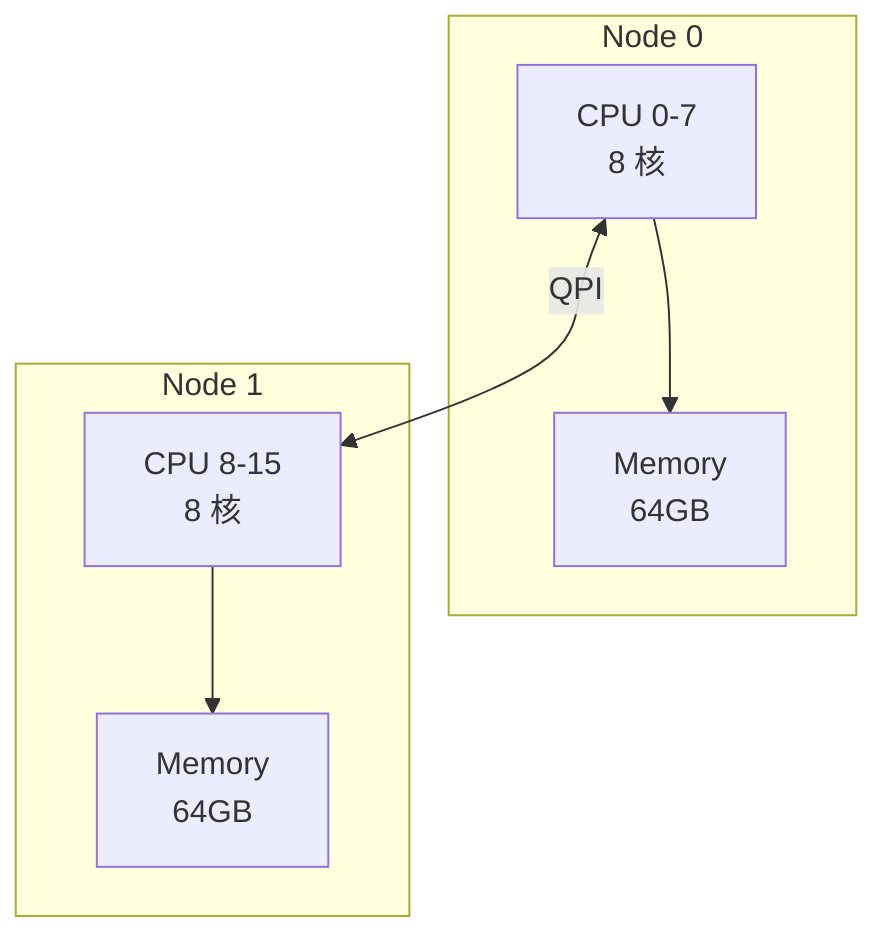

+++
title = "32. HFT面试题-内存优化"
date = 2026-01-31
weight = 32000
description = "HFT内存优化面试题：大页、预分配、对象池、内存对齐、NUMA深度解析"
[taxonomies]
tags = ["HFT", "面试", "内存", "大页", "低延迟"]
+++

# HFT 面试题 - 内存优化

本文汇集 HFT（高频交易）内存优化相关的高频面试问题，采用问答深挖形式，模拟真实面试场景。

---

## 问题 1：为什么 HFT 要使用大页（Huge Pages）？

### 标准答案

| 特性 | 4KB 普通页 | 2MB 大页 | 1GB 大页 |
|------|------------|----------|----------|
| TLB 条目覆盖 | 4KB/条目 | 2MB/条目 | 1GB/条目 |
| 页表层级 | 4 级 | 3 级 | 2 级 |
| TLB 未命中率 | 高 | 低 | 极低 |
| 缺页开销 | 每次 4KB | 每次 2MB | 每次 1GB |
| 适用场景 | 通用 | 中大型应用 | 超大内存、数据库 |

**TLB 覆盖计算**：
```
假设 64 条 L1 dTLB 条目：
- 4KB 页：64 × 4KB = 256KB 覆盖
- 2MB 页：64 × 2MB = 128MB 覆盖
- 1GB 页：64 × 1GB = 64GB 覆盖

HFT 交易系统工作集通常几十到几百 MB
使用 2MB 大页：几十个 TLB 条目即可覆盖
使用 4KB 页：需要上万个条目，TLB 频繁未命中

TLB 未命中代价：
- 4 级页表遍历：~20-50 cycles
- 可能触发 L3 或内存访问：~50-200 cycles
```

### 面试官追问

**Q1: 如何使用大页？**

```bash
# 方法 1：系统级预留大页

# 启动时预留（/etc/default/grub）
GRUB_CMDLINE_LINUX="hugepages=1024 hugepagesz=2M"

# 运行时预留
echo 1024 > /proc/sys/vm/nr_hugepages

# 查看大页状态
cat /proc/meminfo | grep Huge
HugePages_Total:    1024
HugePages_Free:     1024
HugePages_Rsvd:        0
Hugepagesize:       2048 kB

# 方法 2：挂载 hugetlbfs
mount -t hugetlbfs none /mnt/huge
```

```c
// 方法 3：mmap MAP_HUGETLB
#include <sys/mman.h>

void* alloc_huge(size_t size) {
    void *p = mmap(NULL, size, 
                   PROT_READ | PROT_WRITE,
                   MAP_PRIVATE | MAP_ANONYMOUS | MAP_HUGETLB,
                   -1, 0);
    if (p == MAP_FAILED) {
        perror("mmap huge");
        return NULL;
    }
    return p;
}

// 方法 4：通过 hugetlbfs 文件
int fd = open("/mnt/huge/myfile", O_CREAT | O_RDWR, 0755);
ftruncate(fd, size);
void *p = mmap(NULL, size, PROT_READ | PROT_WRITE, MAP_SHARED, fd, 0);

// 方法 5：libhugetlbfs
#include <hugetlbfs.h>
void *p = get_hugepage_region(size, GHR_DEFAULT);
```

**Q2: 透明大页（THP）适合 HFT 吗？**

```
THP 不推荐用于 HFT！

THP 问题：
1. khugepaged 后台合并
   - 内核线程扫描和合并页面
   - 导致不可预测的延迟抖动

2. 内存压缩（compaction）
   - 当需要连续物理内存时触发
   - 可能暂停应用数百毫秒

3. 页面拆分
   - 当部分访问时可能拆分大页
   - 不可预测的时机

4. 跨 NUMA 问题
   - 可能在不同 NUMA 节点上分配
   - 增加访问延迟

HFT 推荐配置：
# 禁用透明大页
echo never > /sys/kernel/mm/transparent_hugepage/enabled
echo never > /sys/kernel/mm/transparent_hugepage/defrag

# 使用显式 hugetlbfs
# 预分配固定数量大页
# 启动时分配，运行时不变
```

**Q3: 大页如何减少延迟抖动？**

```
延迟抖动来源及大页解决方案：

1. TLB 未命中
   普通页：频繁 TLB miss → 页表遍历 50-100ns
   大页：覆盖更大，miss 率极低

2. 缺页中断
   普通页：每 4KB 可能触发缺页
   大页：一次缺页加载 2MB，后续无中断

3. 页面换出
   普通页：可能被 swap 到磁盘
   大页 + mlock：锁定在内存，永不换出

4. 内存分配
   普通页：运行时分配可能失败或慢
   大页预分配：启动时完成，运行时零分配

最佳实践：
void* hft_alloc(size_t size) {
    // 对齐到大页大小
    size_t huge_size = ((size + (2*1024*1024) - 1) 
                        / (2*1024*1024)) * (2*1024*1024);
    
    // 分配大页
    void *p = mmap(NULL, huge_size, 
                   PROT_READ | PROT_WRITE,
                   MAP_PRIVATE | MAP_ANONYMOUS | MAP_HUGETLB | MAP_POPULATE,
                   -1, 0);
    
    // 锁定内存
    mlock(p, huge_size);
    
    return p;
}
```

---

## 问题 2：什么是内存预分配？为什么重要？

### 标准答案

**预分配**：启动时分配所有需要的内存，运行时不再进行任何内存分配。

**运行时分配的开销和问题**：

| 问题 | 延迟 | 说明 |
|------|------|------|
| malloc 锁竞争 | ~100ns-1μs | 多线程争用分配器锁 |
| 系统调用 | ~100-500ns | brk/mmap 陷入内核 |
| 缺页中断 | ~1-10μs | 首次访问触发 |
| 内存压缩 | ~1-100ms | 大块分配时可能触发 |
| THP 处理 | ~1-50ms | 透明大页合并/拆分 |
| 不确定性 | 变化大 | 延迟抖动无法预测 |

### 面试官追问

**Q1: 如何实现完整的预分配流程？**

```c
#include <sys/mman.h>
#include <string.h>
#include <stdlib.h>

struct PreallocatedMemory {
    void *base;
    size_t size;
    size_t used;
};

// 完整的预分配流程
struct PreallocatedMemory* preallocate_all(size_t size) {
    struct PreallocatedMemory *mem = malloc(sizeof(*mem));
    if (!mem) return NULL;
    
    // 步骤 1：使用大页分配对齐内存
    size_t aligned_size = ((size + (2*1024*1024) - 1) 
                           / (2*1024*1024)) * (2*1024*1024);
    
    void *buffer = mmap(NULL, aligned_size,
                        PROT_READ | PROT_WRITE,
                        MAP_PRIVATE | MAP_ANONYMOUS | MAP_HUGETLB | MAP_POPULATE,
                        -1, 0);
    
    if (buffer == MAP_FAILED) {
        // 回退到普通页
        buffer = aligned_alloc(4096, aligned_size);
        if (!buffer) {
            free(mem);
            return NULL;
        }
    }
    
    // 步骤 2：锁定内存（禁止换出）
    if (mlock(buffer, aligned_size) != 0) {
        perror("mlock");
        // 非致命错误，继续
    }
    
    // 步骤 3：预热所有页面（触发缺页，建立映射）
    memset(buffer, 0, aligned_size);
    
    // 步骤 4：预取到缓存（可选，根据访问模式）
    for (size_t i = 0; i < aligned_size; i += 64) {
        __builtin_prefetch((char*)buffer + i, 1, 3);  // 写预取，高持久性
    }
    
    // 步骤 5：设置 NUMA 策略（如果需要）
    // numa_tonode_memory(buffer, aligned_size, preferred_node);
    
    mem->base = buffer;
    mem->size = aligned_size;
    mem->used = 0;
    
    return mem;
}

// 从预分配内存中分配（无系统调用）
void* arena_alloc(struct PreallocatedMemory *mem, size_t size, size_t align) {
    // 对齐
    size_t offset = (mem->used + align - 1) & ~(align - 1);
    
    if (offset + size > mem->size) {
        return NULL;  // 预分配用尽（不应该发生）
    }
    
    void *ptr = (char*)mem->base + offset;
    mem->used = offset + size;
    return ptr;
}
```

**Q2: mlock 和 mlockall 的区别和使用？**

```c
// mlock：锁定指定区域
int mlock(const void *addr, size_t len);
// 只锁定指定的内存范围
// 需要对每个分配的内存调用

// mlockall：锁定整个地址空间
int mlockall(int flags);
// MCL_CURRENT：锁定当前所有映射
// MCL_FUTURE：锁定未来所有映射

// HFT 最佳实践：启动时调用 mlockall
int main() {
    // 首先锁定所有内存
    if (mlockall(MCL_CURRENT | MCL_FUTURE) != 0) {
        perror("mlockall");
        // 可能需要 CAP_IPC_LOCK 权限
    }
    
    // 之后的所有分配都自动锁定
    void *ptr = malloc(1024);  // 自动锁定
    
    // 确认资源限制
    struct rlimit rlim;
    getrlimit(RLIMIT_MEMLOCK, &rlim);
    printf("Memlock limit: %lu\n", rlim.rlim_cur);
    
    // 设置无限制（需要权限）
    rlim.rlim_cur = RLIM_INFINITY;
    rlim.rlim_max = RLIM_INFINITY;
    setrlimit(RLIMIT_MEMLOCK, &rlim);
    
    return 0;
}

// 或者在 /etc/security/limits.conf
// username soft memlock unlimited
// username hard memlock unlimited
```

**Q3: 如何验证内存已被锁定和预热？**

```bash
# 查看进程内存锁定状态
cat /proc/<pid>/status | grep -E "VmLck|VmRSS"
VmLck:     102400 kB  # 锁定的内存
VmRSS:     150000 kB  # 常驻内存

# 查看缺页统计
cat /proc/<pid>/stat | awk '{print "minflt:", $10, "majflt:", $12}'
# 预热后不应该有 majflt 增长

# 使用 perf 监控
perf stat -e page-faults,major-faults,minor-faults ./app
# 理想情况：运行时几乎为 0

# 程序内验证
#include <sys/resource.h>

void check_page_faults() {
    struct rusage usage;
    getrusage(RUSAGE_SELF, &usage);
    printf("Minor faults: %ld\n", usage.ru_minflt);
    printf("Major faults: %ld\n", usage.ru_majflt);
}
```

---

## 问题 3：如何实现高效的对象池？

### 标准答案

**对象池（Object Pool）**：预分配固定大小对象，运行时复用避免分配。

```c++
#include <atomic>
#include <vector>
#include <cstdlib>
#include <cstring>
#include <sys/mman.h>

#define CACHE_LINE 64

// 对齐到缓存行的订单结构
struct alignas(CACHE_LINE) Order {
    uint64_t order_id;
    uint64_t symbol_id;
    double price;
    int32_t quantity;
    int8_t side;
    int8_t status;
    char padding[64 - sizeof(uint64_t)*2 - sizeof(double) 
                 - sizeof(int32_t) - sizeof(int8_t)*2];
};

static_assert(sizeof(Order) == CACHE_LINE, "Order must be cache line sized");

// 单线程对象池（最快）
template<typename T, size_t Capacity>
class ObjectPool {
    T* pool;
    T** free_stack;
    size_t free_count;
    
public:
    ObjectPool() : free_count(Capacity) {
        // 分配并对齐
        pool = static_cast<T*>(
            aligned_alloc(CACHE_LINE, Capacity * sizeof(T)));
        free_stack = static_cast<T**>(
            aligned_alloc(CACHE_LINE, Capacity * sizeof(T*)));
        
        // 锁定内存
        mlock(pool, Capacity * sizeof(T));
        mlock(free_stack, Capacity * sizeof(T*));
        
        // 初始化空闲栈
        for (size_t i = 0; i < Capacity; i++) {
            free_stack[i] = &pool[i];
        }
        
        // 预热：触发所有缺页
        for (size_t i = 0; i < Capacity; i++) {
            memset(&pool[i], 0, sizeof(T));
        }
    }
    
    ~ObjectPool() {
        munlock(pool, Capacity * sizeof(T));
        munlock(free_stack, Capacity * sizeof(T*));
        free(pool);
        free(free_stack);
    }
    
    // O(1) 分配，无系统调用
    T* acquire() {
        if (free_count == 0) return nullptr;
        return free_stack[--free_count];
    }
    
    // O(1) 释放，无系统调用
    void release(T* obj) {
        // 可选：重置对象状态
        obj->status = 0;
        free_stack[free_count++] = obj;
    }
    
    size_t available() const { return free_count; }
    size_t capacity() const { return Capacity; }
};
```

### 面试官追问

**Q1: 对象池如何保证线程安全？**

```c++
// 方案 1：每线程一个池（推荐，无锁）
thread_local ObjectPool<Order, 10000> local_pool;

Order* get_order() {
    return local_pool.acquire();
}

void return_order(Order* order) {
    local_pool.release(order);
}

// 方案 2：无锁栈（MPMC，有 ABA 问题）
template<typename T>
class LockFreeStack {
    struct Node {
        T* data;
        Node* next;
    };
    
    std::atomic<Node*> head{nullptr};
    
public:
    void push(T* data) {
        Node* node = /* 从节点池获取 */;
        node->data = data;
        node->next = head.load(std::memory_order_relaxed);
        while (!head.compare_exchange_weak(
                node->next, node,
                std::memory_order_release,
                std::memory_order_relaxed));
    }
    
    T* pop() {
        Node* node = head.load(std::memory_order_acquire);
        while (node && !head.compare_exchange_weak(
                node, node->next,
                std::memory_order_release,
                std::memory_order_relaxed));
        if (!node) return nullptr;
        T* data = node->data;
        /* 返还节点到节点池 */
        return data;
    }
};

// 方案 3：分片池（减少竞争）
template<typename T, size_t PoolSize, size_t Shards = 16>
class ShardedPool {
    ObjectPool<T, PoolSize / Shards> pools[Shards];
    
    size_t get_shard() {
        // 使用线程 ID 哈希
        thread_local size_t shard = 
            std::hash<std::thread::id>{}(std::this_thread::get_id()) % Shards;
        return shard;
    }
    
public:
    T* acquire() {
        return pools[get_shard()].acquire();
    }
    
    void release(T* obj) {
        // 注意：需要知道对象属于哪个分片
        // 或使用其他回收策略
        pools[get_shard()].release(obj);
    }
};
```

**Q2: 对象池如何处理不同大小的对象？**

```c++
// Slab 分配器风格：多个大小类
class MultiSizePool {
    ObjectPool<SmallOrder, 100000> small_pool;   // <= 64 字节
    ObjectPool<MediumOrder, 50000> medium_pool;  // <= 256 字节
    ObjectPool<LargeOrder, 10000> large_pool;    // <= 1024 字节
    
public:
    void* alloc(size_t size) {
        if (size <= 64) return small_pool.acquire();
        if (size <= 256) return medium_pool.acquire();
        if (size <= 1024) return large_pool.acquire();
        return nullptr;  // 或 fallback 到 malloc
    }
    
    void free(void* ptr, size_t size) {
        if (size <= 64) small_pool.release(static_cast<SmallOrder*>(ptr));
        else if (size <= 256) medium_pool.release(static_cast<MediumOrder*>(ptr));
        else if (size <= 1024) large_pool.release(static_cast<LargeOrder*>(ptr));
    }
};
```

---

## 问题 4：内存对齐有什么作用？

### 标准答案

| 问题 | 未对齐 | 对齐后 |
|------|--------|--------|
| 原子操作 | 可能不原子 | 保证原子 |
| SIMD 加载 | 可能失败/性能差 | 正常性能 |
| 跨缓存行 | 2 次内存访问 | 1 次访问 |
| 伪共享 | 可能发生 | 可避免 |
| CPU 访问 | 可能多周期 | 最优性能 |

```c
// 对齐要求示例

// 1. 原子操作对齐
std::atomic<uint64_t> counter;  // 必须 8 字节对齐

// 2. SIMD 对齐
__m256 data;  // 必须 32 字节对齐

// 3. 缓存行对齐
alignas(64) struct CacheLineData {
    // ...
};
```

### 面试官追问

**Q1: 如何实现对齐分配？**

```c
// C11 标准
void *p = aligned_alloc(64, size);  // 对齐到 64 字节

// POSIX
void *p;
int ret = posix_memalign(&p, 64, size);

// C++17
void *p = std::aligned_alloc(64, size);

// C++17 new 对齐
struct alignas(64) Data { /* ... */ };
Data *p = new Data;  // 自动对齐

// 手动对齐（兼容旧代码）
void* manual_aligned_alloc(size_t size, size_t align) {
    void *raw = malloc(size + align + sizeof(void*));
    if (!raw) return nullptr;
    
    // 计算对齐地址
    void *aligned = (void*)(((uintptr_t)raw + sizeof(void*) + align - 1) 
                            & ~(align - 1));
    
    // 存储原始指针
    ((void**)aligned)[-1] = raw;
    
    return aligned;
}

void manual_aligned_free(void *p) {
    free(((void**)p)[-1]);
}
```

**Q2: 缓存行对齐如何避免伪共享？**

```c++
// 问题：两个变量在同一缓存行，被不同线程频繁修改
struct BadLayout {
    std::atomic<int> counter1;  // 线程 1 写
    std::atomic<int> counter2;  // 线程 2 写
};  // 8 字节，同一缓存行

// 当线程 1 写 counter1：
// 1. 使线程 2 的缓存行失效
// 2. 线程 2 需要重新加载整个缓存行
// 即使它们是"独立"的变量！

// 解决方案 1：使用 alignas
struct GoodLayout {
    alignas(64) std::atomic<int> counter1;
    alignas(64) std::atomic<int> counter2;
};  // 128 字节，两个缓存行

// 解决方案 2：手动填充
struct PaddedLayout {
    std::atomic<int> counter1;
    char padding1[64 - sizeof(std::atomic<int>)];
    std::atomic<int> counter2;
    char padding2[64 - sizeof(std::atomic<int>)];
};

// 解决方案 3：C++17 方式
#include <new>
struct Cpp17Layout {
    alignas(std::hardware_destructive_interference_size) 
        std::atomic<int> counter1;
    alignas(std::hardware_destructive_interference_size) 
        std::atomic<int> counter2;
};

// 测量伪共享影响
void benchmark_false_sharing() {
    // 有伪共享：可能慢 10-50 倍
    BadLayout bad;
    // 无伪共享：最佳性能
    GoodLayout good;
}
```

---

## 问题 5：NUMA 架构如何影响内存性能？

### 标准答案

**NUMA（Non-Uniform Memory Access）**：
- 多 CPU 系统中，每个 CPU 有本地内存
- 访问本地内存快，访问远程内存慢



**延迟对比**：
- 本地内存访问：~80ns
- 远程内存访问：~120-150ns（慢 1.5-2x）
- 跨节点带宽：也可能受限

### 面试官追问

**Q1: 如何优化 NUMA 架构？**

```bash
# 1. 查看 NUMA 拓扑
$ numactl --hardware
available: 2 nodes (0-1)
node 0 cpus: 0 1 2 3 8 9 10 11
node 0 size: 65536 MB
node 0 free: 32000 MB
node 1 cpus: 4 5 6 7 12 13 14 15
node 1 size: 65536 MB
node 1 free: 31000 MB
node distances:
node   0   1
  0:  10  21
  1:  21  10

# 2. 绑定进程到 NUMA 节点
$ numactl --cpunodebind=0 --membind=0 ./trading_app
# --cpunodebind: CPU 绑定
# --membind: 内存绑定

# 3. 使用本地分配策略
$ numactl --localalloc ./app

# 4. 查看 NUMA 统计
$ numastat -p <pid>
```

```c
// 编程方式设置 NUMA 策略
#include <numa.h>

int main() {
    // 检查 NUMA 可用
    if (numa_available() < 0) {
        printf("NUMA not available\n");
        return 1;
    }
    
    // 绑定到节点 0
    numa_run_on_node(0);
    
    // 在节点 0 分配内存
    void *p = numa_alloc_onnode(size, 0);
    
    // 或使用本地策略
    numa_set_localalloc();
    void *q = malloc(size);  // 将在本地节点分配
    
    // 交错分配（大块共享数据）
    numa_set_interleave_mask(numa_all_nodes_ptr);
    
    return 0;
}
```

**Q2: HFT 系统的 NUMA 最佳实践？**

```
1. 单节点运行
   - 所有交易线程在同一 NUMA 节点
   - 所有数据在同一节点的内存
   
2. 节点隔离
   - 交易系统独占一个 NUMA 节点
   - 其他服务在另一个节点
   
3. 网卡亲和性
   - 网卡队列绑定到对应 NUMA 节点的 CPU
   - 避免跨节点中断处理

4. 内存分配策略
   - 启动时在目标节点预分配
   - 使用 numa_alloc_onnode
   
5. 验证
   - numastat 检查内存分布
   - /proc/<pid>/numa_maps 查看详情
```

---

## 问题 6：热路径上绝对不能做什么？

### 标准答案

**热路径禁止操作**：

```c++
// 1. 动态内存分配 ❌
void* p = malloc(size);
Order* order = new Order();
std::vector<int> vec;  // 可能重新分配

// 2. 系统调用 ❌
open(), read(), write(), close();
clock_gettime();  // 使用 RDTSC 替代
printf(), std::cout;  // 可能分配，可能锁

// 3. 锁竞争 ❌
std::mutex.lock();  // 如果有竞争
pthread_mutex_lock();

// 4. 异常 ❌
throw std::exception();  // 栈展开代价巨大
try { ... } catch (...) { ... }  // 可能有开销

// 5. 虚函数调用（不确定性）⚠️
base_ptr->virtual_method();  // 间接调用 + 可能分支预测失败

// 6. I/O 操作 ❌
file.write(...);
socket.send(...);  // 阻塞的

// 7. 日志（除非特殊处理）❌
LOG(INFO) << "...";  // 通常涉及分配和 I/O

// 8. 容器操作（可能分配）⚠️
map.insert(...);
vector.push_back(...);  // 可能重新分配
```

**热路径可以做的**：

```c++
// 1. 预分配内存访问 ✓
Order* order = pool.acquire();
order->price = new_price;

// 2. 无锁操作 ✓
counter.fetch_add(1, std::memory_order_relaxed);

// 3. 内联小函数 ✓
inline double calc_price(double base, double delta) {
    return base + delta;
}

// 4. SIMD 计算 ✓
__m256d result = _mm256_add_pd(a, b);

// 5. 条件少/无分支代码 ✓
int max = (a > b) ? a : b;  // 可能生成 cmov

// 6. 预热的缓存数据访问 ✓
// 数据已经在 L1/L2
```

---

## 高频考点总结

| 考点 | 频率 | 深度要求 |
|------|------|----------|
| 大页 | ★★★ | 原理、使用方法、THP 问题 |
| 预分配 | ★★★ | 完整流程、mlock |
| 对象池 | ★★★ | 实现、线程安全 |
| 内存对齐 | ★★★ | 缓存行、伪共享 |
| NUMA | ★★☆ | 绑定策略 |
| 热路径禁忌 | ★★★ | 避免的操作 |

---

## 相关文章

- [上一篇：HFT面试题-CPU与缓存优化](@/articles/hft/hft-31-HFT面试题-CPU与缓存优化.md)
- [下一篇：HFT面试题-锁与无锁编程](@/articles/hft/hft-33-HFT面试题-锁与无锁编程.md)
