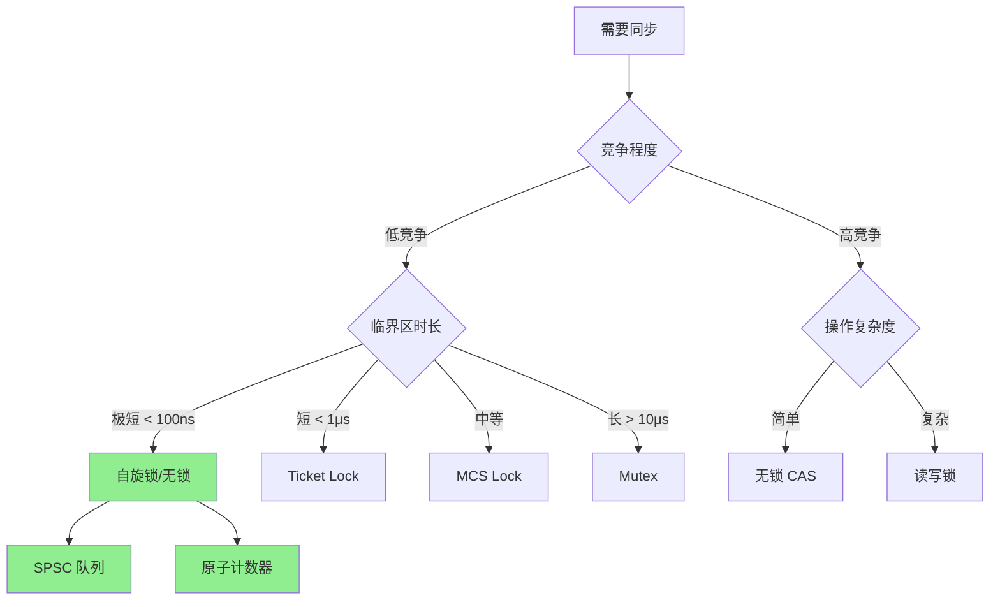
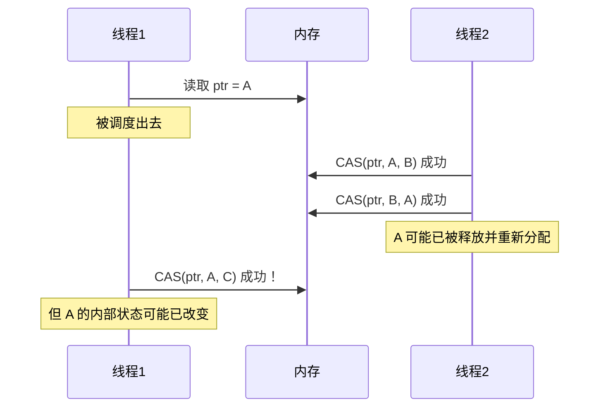
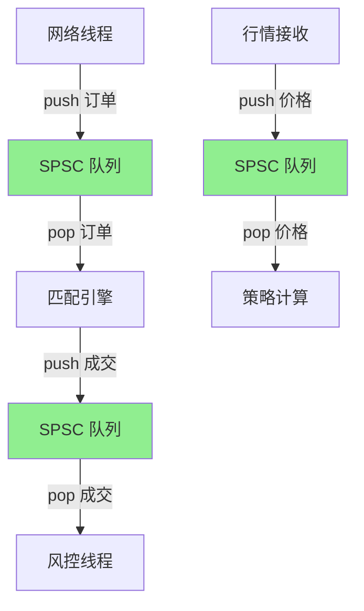
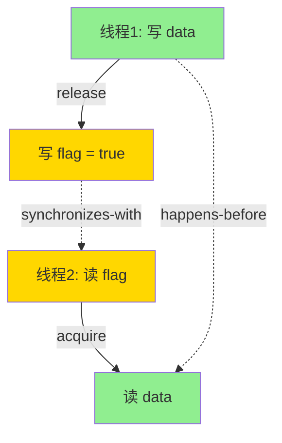
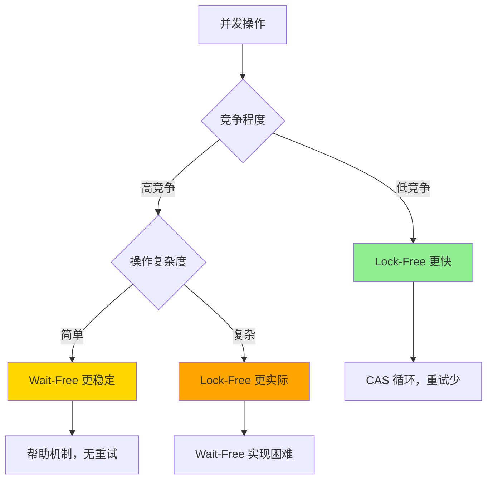
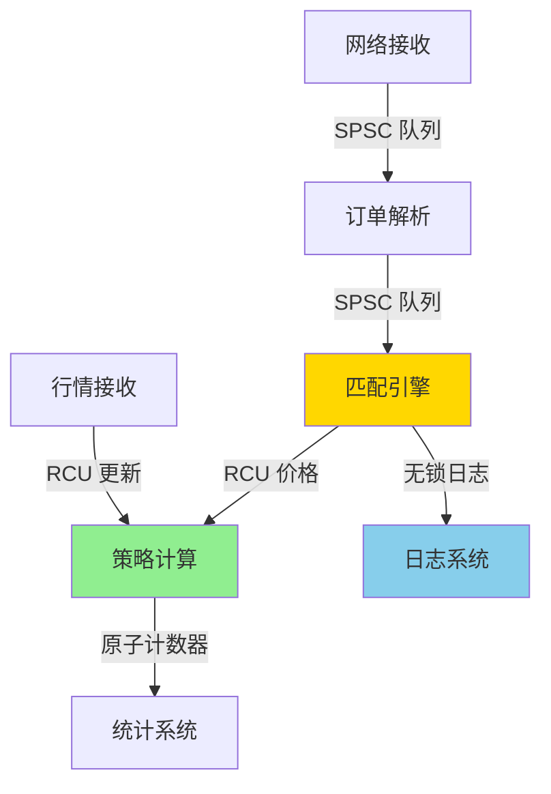

+++
title = "33.HFT面试题-锁与无锁编程"
date = 2026-01-31
description = "HFT锁与无锁编程面试题：自旋锁、CAS、SPSC队列、内存序、ABA问题深度解析"
[taxonomies]
tags = ["HFT", "面试", "无锁", "CAS", "低延迟"]
+++

# HFT 面试题 - 锁与无锁编程

本文汇集 HFT（高频交易）锁与无锁编程相关的高频面试问题，采用问答深挖形式。

---

## 问题 1：什么时候用锁，什么时候用无锁？

### 标准答案

| 场景 | 推荐方案 | 原因 |
|------|----------|------|
| 单生产者单消费者 | 无锁 SPSC | 最简单、最快 |
| 低竞争 | 无锁 CAS | 开销比锁小 |
| 高竞争 | 锁（可能） | CAS 重试开销大 |
| 临界区极短 | 自旋锁 | 避免睡眠开销 |
| 临界区较长 | Mutex | 避免浪费 CPU |
| 复杂操作 | 锁 | 无锁难实现正确 |

### 面试官追问

**Q: 自旋锁在什么情况下更好？**

```c
// 自旋锁适用条件：
// 1. 临界区极短（< 1μs）
// 2. 竞争低
// 3. CPU 充足（不怕浪费）
// 4. 中断上下文（不能睡眠）

// 简单自旋锁
class SpinLock {
    std::atomic_flag flag = ATOMIC_FLAG_INIT;
public:
    void lock() {
        while (flag.test_and_set(std::memory_order_acquire)) {
            // 自旋等待
            // 可选：加入 pause 指令减少功耗
            _mm_pause();
        }
    }
    
    void unlock() {
        flag.clear(std::memory_order_release);
    }
};
```

**Q: 自旋锁有什么问题？**

```
问题：
1. 浪费 CPU：忙等待
2. 优先级反转：高优先级等低优先级
3. 公平性：可能饥饿

改进版本：
- Ticket Lock：保证公平
- MCS Lock：本地自旋，减少缓存抖动
- 适应性自旋：先自旋后睡眠
```

**Q: Ticket Lock 如何保证公平性？**

Ticket Lock 通过"排队"机制保证先来先服务，避免饥饿：

```c++
class TicketLock {
    std::atomic<size_t> next_ticket{0};  // 下一个分配的票号
    std::atomic<size_t> serving{0};      // 当前服务的票号
    
public:
    void lock() {
        // 取号
        size_t my_ticket = next_ticket.fetch_add(1, std::memory_order_relaxed);
        
        // 等待叫号
        while (serving.load(std::memory_order_acquire) != my_ticket) {
            _mm_pause();  // CPU 提示：这是自旋循环
        }
        // acquire 保证：看到 serving == my_ticket 时，之前的所有操作已完成
    }
    
    void unlock() {
        // 叫下一个号
        serving.fetch_add(1, std::memory_order_release);
    }
};
```

**工作原理**：
- 每个线程获取一个唯一的票号（ticket）
- 只有当前 `serving == my_ticket` 的线程才能进入临界区
- 释放锁时，`serving` 递增，下一个线程被唤醒

**优点**：公平，先来先服务  
**缺点**：所有线程自旋在同一个 `serving` 变量上，造成缓存行竞争

**Q: MCS Lock 如何减少缓存抖动？**

MCS Lock（Mellor-Crummey-Scott Lock）让每个线程在自己的节点上自旋，避免全局竞争：

```c++
struct MCSNode {
    std::atomic<MCSNode*> next{nullptr};
    std::atomic<bool> locked{false};
};

class MCSLock {
    std::atomic<MCSNode*> tail{nullptr};
    
public:
    void lock(MCSNode* node) {
        // 初始化节点
        node->next = nullptr;
        node->locked = true;
        
        // 将自己加入队列尾部
        MCSNode* prev = tail.exchange(node, std::memory_order_acq_rel);
        
        if (prev != nullptr) {
            // 前面有人，等待前驱节点通知
            prev->next.store(node, std::memory_order_release);
            while (node->locked.load(std::memory_order_acquire)) {
                _mm_pause();
            }
        }
        // 否则直接获得锁
    }
    
    void unlock(MCSNode* node) {
        // 检查是否有后继者
        MCSNode* next = node->next.load(std::memory_order_acquire);
        
        if (next == nullptr) {
            // 尝试将 tail 设为 nullptr（可能没有后继者）
            MCSNode* expected = node;
            if (tail.compare_exchange_strong(expected, nullptr, 
                                            std::memory_order_release)) {
                return;  // 没有后继者，直接返回
            }
            // 有后继者正在加入，等待它设置 next
            while ((next = node->next.load(std::memory_order_acquire)) == nullptr) {
                _mm_pause();
            }
        }
        
        // 唤醒后继者
        next->locked.store(false, std::memory_order_release);
    }
};

// 使用（每个线程需要自己的节点）
thread_local MCSNode my_node;
MCSLock lock;
lock.lock(&my_node);
// 临界区
lock.unlock(&my_node);
```

**MCS Lock 的优势**：
- 每个线程在自己的 `locked` 标志上自旋，避免伪共享
- 减少缓存一致性流量
- 仍然保证公平性

**Q: 在 HFT 中如何选择锁类型？**



**HFT 场景建议**：
- **订单簿更新**：无锁 SPSC 队列（生产者：网络线程，消费者：匹配引擎）
- **统计计数器**：`relaxed` 原子操作
- **共享配置读取**：RCU（读多写少）
- **日志写入**：无锁环形缓冲区
- **价格更新**：`memory_order_release` 发布，`acquire` 读取

---

## 问题 2：CAS 操作是什么？有什么问题？

### 标准答案

**CAS（Compare-And-Swap）**：

```c
// 原子操作：比较并交换
bool CAS(int *ptr, int expected, int new_value) {
    atomically {
        if (*ptr == expected) {
            *ptr = new_value;
            return true;
        }
        return false;
    }
}

// C++ 使用
std::atomic<int> value;
int expected = 0;
int desired = 1;
bool success = value.compare_exchange_strong(expected, desired);
// 如果 value == expected：value = desired，返回 true
// 否则：expected = value，返回 false
```

**硬件实现（x86）**：
```asm
lock cmpxchg [ptr], new_value
; 如果 [ptr] == EAX：[ptr] = new_value
; 否则：EAX = [ptr]
```

### 面试官追问

**Q: 什么是 ABA 问题？**

```
ABA 问题场景：

时间线：
T1: 读取 ptr = A
    (被调度出去)
T2: ptr = B
T2: ptr = A（改回来）
T1: CAS(ptr, A, C) 成功！

问题：
虽然值还是 A，但可能：
- A 已被释放并重新分配
- A 内部状态已变化

无锁栈的 ABA：
T1: pop() 读取 head = A, A->next = B
T2: pop() A
T2: pop() B
T2: push(A)  // A 重新入栈
T1: CAS(head, A, B) 成功
    但 B 已经被 pop 了！
```

**Q: 如何解决 ABA 问题？**

```c
// 方案 1：带版本号的指针
struct TaggedPtr {
    void *ptr;
    uint64_t tag;  // 每次修改递增
};

// 使用 128 位 CAS（x86 CMPXCHG16B）
bool CAS128(TaggedPtr *target, TaggedPtr expected, TaggedPtr desired);

// 方案 2：Hazard Pointers
// 标记正在使用的指针，延迟回收

// 方案 3：RCU（Read-Copy-Update）
// 读侧无锁，写侧延迟释放

// 方案 4：epoch-based reclamation
// 基于时代的回收
```

**Q: TaggedPtr 如何防止 ABA？**

```c++
#include <atomic>
#include <cstdint>

struct TaggedPtr {
    void* ptr;
    uint64_t tag;
    
    bool operator==(const TaggedPtr& other) const {
        return ptr == other.ptr && tag == other.tag;
    }
};

// 使用 128 位 CAS（需要对齐到 16 字节）
class TaggedAtomic {
    alignas(16) std::atomic<uint64_t> data[2];  // [ptr_low, ptr_high|tag]
    
public:
    bool compare_exchange_weak(TaggedPtr& expected, TaggedPtr desired) {
        // x86-64: CMPXCHG16B 指令
        // 需要内联汇编或编译器内置函数
        // 简化示例（实际需要平台特定实现）
        uint64_t expected_val[2] = {
            reinterpret_cast<uint64_t>(expected.ptr),
            expected.tag
        };
        uint64_t desired_val[2] = {
            reinterpret_cast<uint64_t>(desired.ptr),
            desired.tag
        };
        
        // 伪代码：使用 CMPXCHG16B
        return __sync_bool_compare_and_swap_16(
            data, expected_val, desired_val);
    }
};

// 使用示例：无锁栈
class LockFreeStack {
    struct Node {
        int value;
        Node* next;
    };
    
    std::atomic<TaggedPtr> head{{nullptr, 0}};
    
public:
    void push(int value) {
        Node* new_node = new Node{value, nullptr};
        TaggedPtr old_head, new_head;
        
        do {
            old_head = head.load();
            new_node->next = static_cast<Node*>(old_head.ptr);
            new_head = {new_node, old_head.tag + 1};  // tag 递增
        } while (!head.compare_exchange_weak(old_head, new_head));
    }
    
    bool pop(int& value) {
        TaggedPtr old_head, new_head;
        
        do {
            old_head = head.load();
            if (old_head.ptr == nullptr) return false;
            
            Node* node = static_cast<Node*>(old_head.ptr);
            new_head = {node->next, old_head.tag + 1};  // tag 递增
        } while (!head.compare_exchange_weak(old_head, new_head));
        
        value = static_cast<Node*>(old_head.ptr)->value;
        delete static_cast<Node*>(old_head.ptr);
        return true;
    }
};
```

**Q: Hazard Pointers 如何工作？**

Hazard Pointers 通过标记"危险指针"来延迟内存回收：

```c++
#include <atomic>
#include <vector>
#include <thread>

template<typename T>
class HazardPointer {
    static constexpr size_t MAX_THREADS = 128;
    static constexpr size_t MAX_HAZARDS = 4;
    
    struct HazardRecord {
        std::atomic<T*> ptr{nullptr};
        std::atomic<bool> active{false};
    };
    
    static thread_local HazardRecord* hazards;
    static std::vector<T*> retired_list[MAX_THREADS];
    
public:
    // 标记危险指针
    static void acquire(T* ptr) {
        if (!hazards) {
            hazards = new HazardRecord[MAX_HAZARDS];
        }
        
        for (size_t i = 0; i < MAX_HAZARDS; ++i) {
            if (hazards[i].ptr.load() == nullptr) {
                hazards[i].ptr.store(ptr, std::memory_order_release);
                hazards[i].active.store(true, std::memory_order_release);
                return;
            }
        }
    }
    
    // 释放危险指针
    static void release(T* ptr) {
        if (!hazards) return;
        
        for (size_t i = 0; i < MAX_HAZARDS; ++i) {
            if (hazards[i].ptr.load() == ptr) {
                hazards[i].active.store(false, std::memory_order_release);
                hazards[i].ptr.store(nullptr, std::memory_order_release);
                return;
            }
        }
    }
    
    // 延迟回收
    static void retire(T* ptr) {
        retired_list[get_thread_id()].push_back(ptr);
        
        // 定期扫描并回收
        if (retired_list[get_thread_id()].size() > 100) {
            scan_and_reclaim();
        }
    }
    
private:
    static void scan_and_reclaim() {
        // 收集所有活跃的危险指针
        std::vector<T*> hazards_set;
        for (size_t t = 0; t < MAX_THREADS; ++t) {
            // 遍历该线程的所有 hazard records
            // 收集活跃的指针
        }
        
        // 回收不在危险列表中的节点
        auto& retired = retired_list[get_thread_id()];
        auto it = retired.begin();
        while (it != retired.end()) {
            if (std::find(hazards_set.begin(), hazards_set.end(), *it) 
                == hazards_set.end()) {
                delete *it;
                it = retired.erase(it);
            } else {
                ++it;
            }
        }
    }
};

// 使用示例
class LockFreeStackWithHP {
    struct Node {
        int value;
        std::atomic<Node*> next;
    };
    
    std::atomic<Node*> head{nullptr};
    
public:
    void push(int value) {
        Node* new_node = new Node{value, nullptr};
        Node* old_head;
        
        do {
            old_head = head.load();
            new_node->next.store(old_head);
        } while (!head.compare_exchange_weak(old_head, new_node));
    }
    
    bool pop(int& value) {
        Node* node;
        
        do {
            node = head.load();
            if (node == nullptr) return false;
            
            // 标记为危险指针
            HazardPointer<Node>::acquire(node);
            
            // 重新检查（可能已被其他线程 pop）
            if (head.load() != node) {
                HazardPointer<Node>::release(node);
                continue;
            }
        } while (!head.compare_exchange_weak(node, node->next.load()));
        
        value = node->value;
        HazardPointer<Node>::release(node);
        HazardPointer<Node>::retire(node);  // 延迟回收
        return true;
    }
};
```

**Q: compare_exchange_weak 和 strong 的区别？**

```c++
// weak 版本：允许"伪失败"（spurious failure）
// 即使值匹配，也可能返回 false
bool compare_exchange_weak(T& expected, T desired) {
    // 在某些架构（如 ARM）上，LL/SC 可能失败
    // 即使没有其他线程修改
    // 性能更好（避免循环中的额外检查）
}

// strong 版本：保证只在值不匹配时失败
bool compare_exchange_strong(T& expected, T desired) {
    // 内部可能用 weak + 循环实现
    // 保证语义更强，但可能稍慢
}

// 使用建议：
// 1. 循环中：用 weak（编译器可能优化）
while (!atomic.compare_exchange_weak(expected, desired)) {
    // 失败时 expected 已被更新为当前值
}

// 2. 单次尝试：用 strong
if (atomic.compare_exchange_strong(expected, desired)) {
    // 成功
} else {
    // 失败，expected 已更新
}
```

**ABA 问题时间线可视化**：



---

## 问题 3：实现一个无锁 SPSC 队列

### 标准答案

```c++
#include <atomic>
#include <optional>

template<typename T, size_t Capacity>
class SPSCQueue {
    static_assert((Capacity & (Capacity - 1)) == 0, "Capacity must be power of 2");
    
    alignas(64) T buffer[Capacity];
    alignas(64) std::atomic<size_t> head{0};  // 消费者读写
    alignas(64) std::atomic<size_t> tail{0};  // 生产者读写
    
public:
    bool push(const T& item) {
        const size_t t = tail.load(std::memory_order_relaxed);
        const size_t next = (t + 1) & (Capacity - 1);
        
        // 检查是否满
        if (next == head.load(std::memory_order_acquire)) {
            return false;
        }
        
        buffer[t] = item;
        tail.store(next, std::memory_order_release);
        return true;
    }
    
    std::optional<T> pop() {
        const size_t h = head.load(std::memory_order_relaxed);
        
        // 检查是否空
        if (h == tail.load(std::memory_order_acquire)) {
            return std::nullopt;
        }
        
        T item = buffer[h];
        head.store((h + 1) & (Capacity - 1), std::memory_order_release);
        return item;
    }
    
    size_t size() const {
        const size_t t = tail.load(std::memory_order_acquire);
        const size_t h = head.load(std::memory_order_acquire);
        return (t - h + Capacity) & (Capacity - 1);
    }
};
```

### 面试官追问

**Q: 为什么 head 和 tail 要分开缓存行？**

```
避免伪共享（False Sharing）：

没有对齐时：
[head][tail] 在同一 64 字节缓存行

生产者写 tail → 使消费者的缓存行失效
消费者写 head → 使生产者的缓存行失效

结果：频繁的缓存一致性流量

对齐后：
alignas(64) head;  // 独占缓存行
alignas(64) tail;  // 独占缓存行

生产者和消费者互不干扰
```

**Q: 为什么用 relaxed + acquire/release 而不是 seq_cst？**

```c++
// seq_cst（顺序一致）：
// - 全局顺序保证
// - 开销最大

// acquire-release：
// - 只保证成对的同步
// - 开销更小

// 在 SPSC 中：
// 生产者：
buffer[t] = item;                           // 普通写
tail.store(next, memory_order_release);     // release 屏障
// release 保证：buffer 写入对消费者可见

// 消费者：
if (h == tail.load(memory_order_acquire))   // acquire 屏障
// acquire 保证：看到新 tail 时，也能看到 buffer 内容

// relaxed 用于本地读取（无需同步）
head.load(memory_order_relaxed);  // 只有当前线程写 head
```

**Q: SPSC 队列有哪些优化技巧？**

**1. 批量操作（Batching）**：

```c++
template<typename T, size_t Capacity>
class OptimizedSPSCQueue {
    alignas(64) T buffer[Capacity];
    alignas(64) std::atomic<size_t> head{0};
    alignas(64) std::atomic<size_t> tail{0};
    
    // 本地缓存，减少原子操作
    size_t cached_head{0};
    size_t cached_tail{0};
    
public:
    bool push(const T& item) {
        const size_t t = cached_tail;
        const size_t next = (t + 1) & (Capacity - 1);
        
        // 使用缓存的 head，减少原子读取
        if (next == cached_head) {
            // 缓存失效，重新读取
            cached_head = head.load(std::memory_order_acquire);
            if (next == cached_head) {
                return false;  // 队列满
            }
        }
        
        buffer[t] = item;
        tail.store(next, std::memory_order_release);
        cached_tail = next;
        return true;
    }
    
    std::optional<T> pop() {
        const size_t h = cached_head;
        
        if (h == cached_tail) {
            // 缓存失效，重新读取
            cached_tail = tail.load(std::memory_order_acquire);
            if (h == cached_tail) {
                return std::nullopt;  // 队列空
            }
        }
        
        T item = buffer[h];
        const size_t next = (h + 1) & (Capacity - 1);
        head.store(next, std::memory_order_release);
        cached_head = next;
        return item;
    }
};
```

**2. 预取（Prefetching）**：

```c++
bool push(const T& item) {
    const size_t t = tail.load(std::memory_order_relaxed);
    const size_t next = (t + 1) & (Capacity - 1);
    
    if (next == head.load(std::memory_order_acquire)) {
        return false;
    }
    
    // 预取下一个位置，减少后续 push 的延迟
    __builtin_prefetch(&buffer[next], 1, 3);  // 写预取
    
    buffer[t] = item;
    tail.store(next, std::memory_order_release);
    return true;
}

std::optional<T> pop() {
    const size_t h = head.load(std::memory_order_relaxed);
    
    if (h == tail.load(std::memory_order_acquire)) {
        return std::nullopt;
    }
    
    // 预取下一个位置
    const size_t next = (h + 1) & (Capacity - 1);
    __builtin_prefetch(&buffer[next], 0, 3);  // 读预取
    
    T item = buffer[h];
    head.store(next, std::memory_order_release);
    return item;
}
```

**3. NUMA 优化**：

```c++
#include <numa.h>

template<typename T, size_t Capacity>
class NUMASPSCQueue {
    // 在生产者所在的 NUMA 节点分配内存
    T* buffer;
    std::atomic<size_t>* head;
    std::atomic<size_t>* tail;
    
public:
    NUMASPSCQueue() {
        int producer_node = numa_node_of_cpu(sched_getcpu());
        
        // 在指定节点分配内存
        buffer = static_cast<T*>(
            numa_alloc_onnode(sizeof(T) * Capacity, producer_node));
        head = static_cast<std::atomic<size_t>*>(
            numa_alloc_onnode(sizeof(std::atomic<size_t>), producer_node));
        tail = static_cast<std::atomic<size_t>*>(
            numa_alloc_onnode(sizeof(std::atomic<size_t>), producer_node));
        
        *head = 0;
        *tail = 0;
    }
    
    // 消费者绑定到特定 NUMA 节点
    void bind_consumer_to_node(int node) {
        numa_run_on_node(node);
    }
};
```

**4. 避免分支预测失败**：

```c++
// 使用 likely/unlikely 提示编译器
bool push(const T& item) {
    const size_t t = tail.load(std::memory_order_relaxed);
    const size_t next = (t + 1) & (Capacity - 1);
    
    // 队列通常不满，标记为 likely
    if (__builtin_expect(next == head.load(std::memory_order_acquire), 0)) {
        return false;
    }
    
    buffer[t] = item;
    tail.store(next, std::memory_order_release);
    return true;
}
```

**Q: SPSC 队列在 HFT 中的实际应用场景？**



**典型场景**：

1. **订单流水线**：
   ```c++
   // 网络线程 → 匹配引擎
   SPSCQueue<Order, 1024> order_queue;
   
   // 网络线程
   void network_thread() {
       while (true) {
           Order order = receive_order();
           while (!order_queue.push(order)) {
               // 队列满，等待或丢弃
           }
       }
   }
   
   // 匹配引擎线程
   void matching_engine() {
       while (true) {
           auto order = order_queue.pop();
           if (order) {
               match_order(*order);
           }
       }
   }
   ```

2. **价格更新广播**：
   ```c++
   // 单个生产者，多个消费者（每个消费者一个队列）
   class PriceBroadcaster {
       std::vector<SPSCQueue<Price, 256>> queues;
       
   public:
       void broadcast(const Price& price) {
           for (auto& queue : queues) {
               queue.push(price);  // 每个消费者独立队列
           }
       }
   };
   ```

3. **日志异步写入**：
   ```c++
   // 业务线程 → 日志线程
   SPSCQueue<LogEntry, 4096> log_queue;
   
   void log_async(const LogEntry& entry) {
       log_queue.push(entry);  // 无阻塞，极快
   }
   ```

**性能指标（典型值）**：
- **延迟**：< 50ns（单次 push/pop）
- **吞吐**：> 100M ops/s（单核）
- **内存占用**：固定大小，无动态分配

---

## 问题 4：解释 C++ 内存序

### 标准答案

| 内存序 | 保证 | 开销 | 用途 |
|--------|------|------|------|
| relaxed | 仅原子性 | 最低 | 计数器 |
| consume | 数据依赖顺序 | 低 | 不推荐使用 |
| acquire | 后续操作不前移 | 中 | 读锁/读标志 |
| release | 之前操作不后移 | 中 | 写锁/写标志 |
| acq_rel | acquire + release | 中 | RMW 操作 |
| seq_cst | 全局顺序一致 | 最高 | 默认，最安全 |

### 面试官追问

**Q: release-acquire 配对如何保证同步？**

```c++
std::atomic<bool> ready{false};
int data = 0;

// 线程 1（生产者）
void producer() {
    data = 42;                                    // A
    ready.store(true, std::memory_order_release); // B
    // release 保证：A 不会重排到 B 之后
}

// 线程 2（消费者）
void consumer() {
    while (!ready.load(std::memory_order_acquire)); // C
    // acquire 保证：D 不会重排到 C 之前
    assert(data == 42);                             // D
}

// 同步关系：
// B synchronizes-with C
// A happens-before D
// 所以 D 一定能看到 A 的效果
```

**Q: relaxed 什么时候可以用？**

```c++
// 1. 独立计数器（只关心最终值）
std::atomic<int> counter{0};

void increment() {
    counter.fetch_add(1, std::memory_order_relaxed);
    // 不需要和其他操作同步
}

// 2. 统计信息
std::atomic<uint64_t> total_bytes{0};
total_bytes.fetch_add(len, std::memory_order_relaxed);

// 3. 进度指示
std::atomic<int> progress{0};
while (progress.load(std::memory_order_relaxed) < 100) {
    // 检查进度
}

// 不能用 relaxed 的情况：
// - 需要保证其他数据可见性
// - 标志位同步
// - 锁实现
```

**Q: seq_cst 的开销有多大？**

```c++
// seq_cst 需要全局顺序，在所有 CPU 上都有开销
std::atomic<int> x{0}, y{0};
int r1, r2;

// 线程 1
x.store(1, std::memory_order_seq_cst);  // 需要全局屏障
r1 = y.load(std::memory_order_seq_cst);

// 线程 2
y.store(1, std::memory_order_seq_cst);  // 需要全局屏障
r2 = x.load(std::memory_order_seq_cst);

// seq_cst 保证：r1 == 1 && r2 == 0 不可能
// 但 acquire-release 可能允许这种情况（虽然实际很少见）

// 性能对比（x86-64，相对 relaxed）：
// relaxed:     1x（基准）
// acquire:     ~1x（x86 强内存模型）
// release:     ~1x
// acq_rel:     ~1x
// seq_cst:     ~2-3x（需要 MFENCE 指令）
```

**Q: 内存序在 HFT 中的实际应用？**

**场景 1：订单状态发布**：

```c++
struct Order {
    int64_t order_id;
    double price;
    int quantity;
    // ... 其他字段
};

std::atomic<Order*> current_order{nullptr};
Order* local_order = nullptr;

// 生产者线程（订单更新）
void update_order(const Order& new_order) {
    Order* new_ptr = new Order(new_order);
    Order* old = current_order.exchange(new_ptr, std::memory_order_acq_rel);
    
    // 延迟删除（使用 Hazard Pointer 或 epoch）
    retire_order(old);
}

// 消费者线程（策略计算）
void strategy_thread() {
    Order* order = current_order.load(std::memory_order_acquire);
    if (order != local_order) {
        // 看到新订单，使用它
        process_order(*order);
        local_order = order;
    }
}
```

**场景 2：多阶段初始化**：

```c++
std::atomic<int> phase{0};
double* data = nullptr;
size_t data_size = 0;

// 初始化线程
void init() {
    // 阶段 1：分配内存
    data = new double[1000000];
    data_size = 1000000;
    phase.store(1, std::memory_order_release);  // 发布阶段 1
    
    // 阶段 2：填充数据
    for (size_t i = 0; i < data_size; ++i) {
        data[i] = calculate_value(i);
    }
    phase.store(2, std::memory_order_release);  // 发布阶段 2
    
    // 阶段 3：就绪
    phase.store(3, std::memory_order_release);
}

// 使用线程
void worker() {
    // 等待初始化完成
    while (phase.load(std::memory_order_acquire) < 3) {
        std::this_thread::yield();
    }
    
    // 此时保证看到 data 和 data_size 的正确值
    for (size_t i = 0; i < data_size; ++i) {
        process(data[i]);
    }
}
```

**场景 3：无锁计数器（relaxed 的正确使用）**：

```c++
// 统计信息：只关心最终值，不关心中间状态
std::atomic<uint64_t> total_orders{0};
std::atomic<uint64_t> total_volume{0};
std::atomic<uint64_t> total_pnl{0};

void process_trade(const Trade& trade) {
    // 这些操作之间不需要同步
    total_orders.fetch_add(1, std::memory_order_relaxed);
    total_volume.fetch_add(trade.volume, std::memory_order_relaxed);
    total_pnl.fetch_add(trade.pnl, std::memory_order_relaxed);
}

// 定期报告（需要同步点）
void report_stats() {
    // 使用 acquire 确保看到所有更新
    uint64_t orders = total_orders.load(std::memory_order_acquire);
    uint64_t volume = total_volume.load(std::memory_order_acquire);
    uint64_t pnl = total_pnl.load(std::memory_order_acquire);
    
    // 此时三个值可能不是同一时刻的快照
    // 但对于统计来说可以接受
    log_stats(orders, volume, pnl);
}
```

**Q: 内存序的可视化理解？**



**内存序规则总结**：

| 操作对 | 保证 | 示例 |
|--------|------|------|
| release → acquire | 同步关系 | 生产者发布，消费者获取 |
| release → release | 顺序保证 | 多阶段初始化 |
| acquire → acquire | 顺序保证 | 多阶段检查 |
| relaxed → relaxed | 无保证 | 独立计数器 |

**Q: 如何验证内存序的正确性？**

```c++
#include <thread>
#include <atomic>
#include <cassert>

// 测试 release-acquire 同步
std::atomic<bool> ready{false};
int data = 0;

void test_release_acquire() {
    std::thread t1([&]() {
        data = 42;
        ready.store(true, std::memory_order_release);
    });
    
    std::thread t2([&]() {
        while (!ready.load(std::memory_order_acquire)) {
            std::this_thread::yield();
        }
        assert(data == 42);  // 必须为真
    });
    
    t1.join();
    t2.join();
}

// 使用工具验证：
// 1. ThreadSanitizer (TSAN)
// 2. CppMem（内存模型检查器）
// 3. 压力测试 + 断言
```

---

## 问题 5：什么是 Lock-Free 和 Wait-Free？

### 标准答案

| 级别 | 保证 | 说明 |
|------|------|------|
| Blocking | 无 | 使用锁，可能死锁 |
| Obstruction-Free | 单独运行能完成 | 最弱的无锁保证 |
| Lock-Free | 系统整体有进展 | 至少一个线程能完成 |
| Wait-Free | 每个操作有限步完成 | 最强，无饥饿 |

```c++
// Lock-Free 示例（CAS 循环）
void lock_free_push(Node* node) {
    Node* old_head;
    do {
        old_head = head.load();
        node->next = old_head;
    } while (!head.compare_exchange_weak(old_head, node));
    // 可能重试，但系统整体有进展
}

// Wait-Free 示例（更复杂）
// 通常需要帮助机制（helping）
// 每个线程帮助其他线程完成操作
```

### 面试官追问

**Q: Lock-Free 一定比 Blocking 快吗？**

```
不一定！

Lock-Free 可能更慢的情况：
1. 高竞争：CAS 频繁失败重试
2. 复杂操作：无锁实现开销大
3. 缓存抖动：频繁的原子操作

经验法则：
- 低竞争 + 简单操作：无锁更好
- 高竞争 + 复杂操作：锁可能更好
- 需要基准测试验证
```

**Q: Wait-Free 如何实现？**

Wait-Free 要求每个操作在有限步内完成，通常需要"帮助机制"（helping）：

```c++
#include <atomic>
#include <array>

// Wait-Free 栈（简化版，展示 helping 概念）
template<typename T>
class WaitFreeStack {
    struct Node {
        T value;
        std::atomic<Node*> next;
    };
    
    struct Operation {
        enum Type { PUSH, POP };
        Type type;
        Node* node;
        std::atomic<bool> done{false};
    };
    
    std::atomic<Node*> head{nullptr};
    static thread_local Operation* my_op;
    
public:
    void push(const T& value) {
        Node* new_node = new Node{value, nullptr};
        Operation op{Operation::PUSH, new_node};
        my_op = &op;
        
        // 尝试完成自己的操作
        help_complete(&op);
        
        // 如果还没完成，帮助其他线程
        while (!op.done.load()) {
            Operation* other_op = find_pending_operation();
            if (other_op) {
                help_complete(other_op);
            }
            help_complete(&op);
        }
        
        my_op = nullptr;
    }
    
    bool pop(T& value) {
        Operation op{Operation::POP, nullptr};
        my_op = &op;
        
        help_complete(&op);
        
        while (!op.done.load()) {
            Operation* other_op = find_pending_operation();
            if (other_op) {
                help_complete(other_op);
            }
            help_complete(&op);
        }
        
        if (op.node) {
            value = op.node->value;
            delete op.node;
            return true;
        }
        return false;
    }
    
private:
    void help_complete(Operation* op) {
        if (op->type == Operation::PUSH) {
            Node* old_head = head.load();
            op->node->next.store(old_head);
            if (head.compare_exchange_weak(old_head, op->node)) {
                op->done.store(true);
            }
        } else {  // POP
            Node* old_head = head.load();
            if (old_head == nullptr) {
                op->done.store(true);
                return;
            }
            if (head.compare_exchange_weak(old_head, old_head->next.load())) {
                op->node = old_head;
                op->done.store(true);
            }
        }
    }
    
    Operation* find_pending_operation() {
        // 查找其他线程的待处理操作
        // 简化实现
        return nullptr;
    }
};

// Wait-Free 读多写少场景：使用 RCU
template<typename T>
class WaitFreeRCU {
    struct Data {
        T value;
        std::atomic<int> ref_count{0};
    };
    
    std::atomic<Data*> current{nullptr};
    
public:
    // 读操作：Wait-Free
    T read() {
        Data* data = current.load(std::memory_order_acquire);
        data->ref_count.fetch_add(1, std::memory_order_relaxed);
        
        T value = data->value;  // 安全读取
        
        data->ref_count.fetch_sub(1, std::memory_order_release);
        return value;
    }
    
    // 写操作：Lock-Free（需要等待读者完成）
    void write(const T& new_value) {
        Data* new_data = new Data{new_value};
        Data* old_data = current.exchange(new_data, std::memory_order_acq_rel);
        
        // 等待所有读者完成
        while (old_data->ref_count.load() > 0) {
            std::this_thread::yield();
        }
        
        delete old_data;
    }
};
```

**Q: Lock-Free vs Wait-Free 性能对比？**



**性能特征**：

| 特性 | Lock-Free | Wait-Free |
|------|-----------|-----------|
| **延迟** | 低（无竞争时） | 稳定（有界） |
| **吞吐** | 高（低竞争） | 中等 |
| **实现复杂度** | 中等 | 高 |
| **适用场景** | 大多数无锁场景 | 实时系统、关键路径 |

**Q: HFT 中如何选择 Lock-Free vs Wait-Free？**

**场景分析**：

1. **订单匹配引擎（核心路径）**：
   ```c++
   // 需要 Wait-Free 保证
   // 每个订单必须在有限时间内处理
   class WaitFreeOrderBook {
       // 使用帮助机制或专用算法
       // 保证每个操作有界延迟
   };
   ```

2. **统计计数器（非关键路径）**：
   ```c++
   // Lock-Free 足够
   std::atomic<uint64_t> order_count{0};
   order_count.fetch_add(1, std::memory_order_relaxed);
   ```

3. **配置更新（低频写）**：
   ```c++
   // RCU 模式：读 Wait-Free，写 Lock-Free
   class ConfigManager {
       std::atomic<Config*> config{nullptr};
       
       // 读：Wait-Free
       Config* get_config() {
           return config.load(std::memory_order_acquire);
       }
       
       // 写：Lock-Free（需要等待读者）
       void update_config(Config* new_config) {
           Config* old = config.exchange(new_config);
           // 延迟删除 old
       }
   };
   ```

**实际建议**：
- **关键路径**（订单处理、价格计算）：优先考虑 Wait-Free
- **非关键路径**（日志、统计）：Lock-Free 足够
- **读多写少**：RCU 模式（读 Wait-Free）
- **写多读少**：Lock-Free CAS 循环

---

## 问题 6：无锁编程的常见陷阱

### 标准答案

```c++
// 陷阱 1：忘记内存屏障
std::atomic<bool> flag{false};
int data = 0;

// 错误
void producer() {
    data = 42;
    flag.store(true, std::memory_order_relaxed);  // 不保证顺序！
}

// 陷阱 2：ABA 问题（见上文）

// 陷阱 3：伪共享
struct BadCache {
    std::atomic<int> a;  // 同一缓存行
    std::atomic<int> b;
};

// 陷阱 4：非原子的读-改-写
counter = counter + 1;  // 错误！不是原子操作
counter.fetch_add(1);   // 正确

// 陷阱 5：依赖 volatile
volatile int flag = 0;  // 不保证原子性！
std::atomic<int> flag;  // 正确

// 陷阱 6：compare_exchange 期望值
int expected = 0;
while (!value.compare_exchange_weak(expected, 1)) {
    expected = 0;  // 必须重置！
    // 因为失败时 expected 被修改为当前值
}

// 陷阱 7：内存序不匹配
std::atomic<int> counter{0};
std::atomic<bool> ready{false};

// 错误：release 和 relaxed 不匹配
void producer() {
    counter.store(1, std::memory_order_release);  // 错误！
    ready.store(true, std::memory_order_relaxed);
}

void consumer() {
    if (ready.load(std::memory_order_acquire)) {
        int val = counter.load(std::memory_order_relaxed);  // 可能看不到更新！
    }
}

// 正确：配对使用
void producer_correct() {
    counter.store(1, std::memory_order_relaxed);
    ready.store(true, std::memory_order_release);  // release 保证前面的写入可见
}

void consumer_correct() {
    if (ready.load(std::memory_order_acquire)) {  // acquire 保证看到 release 前的写入
        int val = counter.load(std::memory_order_relaxed);  // 安全
    }
}

// 陷阱 8：ABA 问题（见上文详细讨论）

// 陷阱 9：循环依赖
struct Node {
    std::atomic<Node*> next;
    int value;
};

// 错误：可能导致循环引用
void bad_insert(Node* head, Node* new_node) {
    Node* old_next = head->next.load();
    new_node->next.store(old_next);
    // 如果此时 old_next 被其他线程修改并重新指向 head
    // 可能导致循环
    head->next.store(new_node);
}

// 陷阱 10：非幂等操作
std::atomic<int> processed_count{0};

void process_item(int item) {
    // 错误：如果重试，可能重复处理
    if (processed_count.load() < MAX_ITEMS) {
        process(item);
        processed_count.fetch_add(1);  // 不是幂等的
    }
}

// 正确：使用标志位
std::atomic<bool> processed[MAX_ITEMS]{false};

void process_item_correct(int item) {
    if (!processed[item].exchange(true)) {  // 只处理一次
        process(item);
    }
}
```

**Q: 如何调试无锁代码？**

```c++
// 1. 使用 ThreadSanitizer (TSAN)
// 编译：-fsanitize=thread
// 运行时检测数据竞争

// 2. 添加断言验证不变式
class LockFreeStack {
    std::atomic<Node*> head{nullptr};
    
    void push(Node* node) {
        Node* old_head = head.load();
        node->next = old_head;
        
        // 断言：验证不变式
        assert(node != nullptr);
        assert(node != old_head);  // 防止自引用
        
        bool success = head.compare_exchange_weak(old_head, node);
        assert(success || old_head == head.load());  // CAS 语义正确
    }
};

// 3. 压力测试
void stress_test() {
    const int NUM_THREADS = 8;
    const int OPS_PER_THREAD = 1000000;
    
    std::vector<std::thread> threads;
    for (int i = 0; i < NUM_THREADS; ++i) {
        threads.emplace_back([&]() {
            for (int j = 0; j < OPS_PER_THREAD; ++j) {
                // 随机操作
                if (rand() % 2) {
                    push(rand());
                } else {
                    pop();
                }
            }
        });
    }
    
    for (auto& t : threads) {
        t.join();
    }
    
    // 验证最终状态
    assert(validate_invariants());
}

// 4. 使用内存模型检查器（如 CppMem）
// 验证内存序的正确性
```

**Q: 无锁编程的性能调优技巧？**

```c++
// 1. 减少原子操作频率
// 错误：每次操作都 CAS
for (int i = 0; i < 1000; ++i) {
    counter.fetch_add(1);  // 1000 次原子操作
}

// 正确：批量更新
int local_count = 0;
for (int i = 0; i < 1000; ++i) {
    local_count++;
}
counter.fetch_add(local_count);  // 1 次原子操作

// 2. 使用缓存行对齐
struct alignas(64) PerThreadCounter {
    std::atomic<uint64_t> count{0};
    char padding[64 - sizeof(std::atomic<uint64_t>)];
};

// 3. 避免不必要的内存屏障
// 错误：过度使用 seq_cst
std::atomic<int> x{0};
x.store(1, std::memory_order_seq_cst);  // 不必要的全局屏障

// 正确：使用最小必要的内存序
x.store(1, std::memory_order_release);  // 如果只需要 release 语义

// 4. 预取减少缓存未命中
void process_queue() {
    Node* next = head->next.load();
    __builtin_prefetch(next, 0, 3);  // 预取下一个节点
    process(head);
    head = next;
}

// 5. 使用 thread_local 减少竞争
thread_local int local_buffer[1024];
thread_local size_t local_size = 0;

void add_item(int item) {
    local_buffer[local_size++] = item;
    if (local_size == 1024) {
        flush_to_shared();  // 批量写入共享结构
        local_size = 0;
    }
}
```

---

## 问题 7：HFT 中的无锁数据结构应用场景

### 标准答案

HFT 系统中，延迟是关键指标。无锁数据结构在以下场景中发挥重要作用：

| 场景 | 数据结构 | 原因 |
|------|----------|------|
| 订单流水线 | SPSC 队列 | 网络线程 → 匹配引擎，零拷贝 |
| 价格更新 | 原子指针 + RCU | 读多写少，读侧无锁 |
| 统计计数 | 原子计数器 | 简单、快速 |
| 订单簿 | Lock-Free 哈希表 | 高频更新，低延迟 |
| 日志系统 | 无锁环形缓冲区 | 异步写入，不阻塞业务 |

### 面试官追问

**Q: 订单簿如何用无锁实现？**

```c++
#include <atomic>
#include <unordered_map>

// 简化版无锁订单簿
class LockFreeOrderBook {
    struct PriceLevel {
        std::atomic<int> quantity{0};
        std::atomic<double> price{0.0};
    };
    
    // 使用数组而非哈希表（避免动态分配）
    static constexpr size_t MAX_PRICE_LEVELS = 10000;
    alignas(64) PriceLevel bids[MAX_PRICE_LEVELS];
    alignas(64) PriceLevel asks[MAX_PRICE_LEVELS];
    
    std::atomic<size_t> best_bid_idx{0};
    std::atomic<size_t> best_ask_idx{MAX_PRICE_LEVELS};
    
public:
    // 更新价格档位（Lock-Free）
    void update_level(bool is_bid, size_t price_idx, int qty, double price) {
        PriceLevel* level = is_bid ? &bids[price_idx] : &asks[price_idx];
        
        // CAS 循环更新
        PriceLevel old_val, new_val;
        do {
            old_val.quantity = level->quantity.load();
            old_val.price = level->price.load();
            
            new_val.quantity = qty;
            new_val.price = price;
        } while (!compare_exchange_level(level, old_val, new_val));
        
        // 更新最佳价格
        update_best_price(is_bid, price_idx);
    }
    
    // 获取最佳买卖价（Wait-Free 读）
    std::pair<double, int> get_best_bid() {
        size_t idx = best_bid_idx.load(std::memory_order_acquire);
        return {bids[idx].price.load(), bids[idx].quantity.load()};
    }
    
private:
    bool compare_exchange_level(PriceLevel* level, 
                                const PriceLevel& expected,
                                const PriceLevel& desired) {
        // 需要 128 位 CAS 或分别更新（带版本号）
        // 简化实现
        if (level->quantity.load() == expected.quantity &&
            level->price.load() == expected.price) {
            level->quantity.store(desired.quantity);
            level->price.store(desired.price);
            return true;
        }
        return false;
    }
    
    void update_best_price(bool is_bid, size_t price_idx) {
        std::atomic<size_t>* best = is_bid ? &best_bid_idx : &best_ask_idx;
        size_t current_best = best->load();
        
        // 简单的比较更新（实际需要更复杂的逻辑）
        if (is_better_price(is_bid, price_idx, current_best)) {
            best->compare_exchange_weak(current_best, price_idx);
        }
    }
    
    bool is_better_price(bool is_bid, size_t idx1, size_t idx2) {
        double price1 = is_bid ? bids[idx1].price.load() 
                                : asks[idx1].price.load();
        double price2 = is_bid ? bids[idx2].price.load() 
                                : asks[idx2].price.load();
        return is_bid ? (price1 > price2) : (price1 < price2);
    }
};
```

**Q: 价格更新如何用 RCU 实现？**

```c++
// RCU（Read-Copy-Update）模式
template<typename T>
class RCUPrice {
    struct PriceData {
        T bid_price;
        T ask_price;
        int64_t timestamp;
        std::atomic<int> ref_count{0};
    };
    
    std::atomic<PriceData*> current{nullptr};
    
public:
    // 读操作：Wait-Free，无锁
    std::pair<T, T> read() {
        PriceData* data = current.load(std::memory_order_acquire);
        
        // 增加引用计数
        data->ref_count.fetch_add(1, std::memory_order_relaxed);
        
        // 读取数据（安全，因为引用计数保护）
        T bid = data->bid_price;
        T ask = data->ask_price;
        
        // 减少引用计数
        data->ref_count.fetch_sub(1, std::memory_order_release);
        
        return {bid, ask};
    }
    
    // 写操作：Lock-Free
    void update(T bid, T ask) {
        // 创建新版本
        PriceData* new_data = new PriceData{bid, ask, get_timestamp()};
        
        // 原子替换
        PriceData* old_data = current.exchange(new_data, 
                                               std::memory_order_acq_rel);
        
        // 等待所有读者完成（grace period）
        wait_for_readers(old_data);
        
        // 延迟删除（实际系统中使用 epoch-based reclamation）
        delete old_data;
    }
    
private:
    void wait_for_readers(PriceData* data) {
        // 等待引用计数归零
        while (data->ref_count.load(std::memory_order_acquire) > 0) {
            std::this_thread::yield();
        }
    }
    
    int64_t get_timestamp() {
        // 获取当前时间戳
        return std::chrono::nanoseconds(
            std::chrono::steady_clock::now().time_since_epoch()).count();
    }
};

// 使用场景：行情数据
RCUPrice<double> market_price;

// 行情接收线程（写）
void market_data_thread() {
    while (true) {
        auto [bid, ask] = receive_market_data();
        market_price.update(bid, ask);  // 更新价格
    }
}

// 策略线程（读，高频）
void strategy_thread() {
    while (true) {
        auto [bid, ask] = market_price.read();  // 无锁读取
        calculate_strategy(bid, ask);
    }
}
```

**Q: 无锁日志系统如何实现？**

```c++
#include <atomic>
#include <array>

// 无锁环形缓冲区日志
template<size_t BufferSize>
class LockFreeLogger {
    struct LogEntry {
        int64_t timestamp;
        char message[256];
    };
    
    alignas(64) std::array<LogEntry, BufferSize> buffer;
    alignas(64) std::atomic<size_t> write_pos{0};
    alignas(64) std::atomic<size_t> read_pos{0};
    
    // 写入线程本地缓存
    thread_local static size_t cached_read_pos;
    
public:
    void log(const char* msg) {
        size_t pos = write_pos.fetch_add(1, std::memory_order_relaxed);
        size_t idx = pos % BufferSize;
        
        // 检查是否覆盖未读数据
        if (cached_read_pos == 0) {
            cached_read_pos = read_pos.load(std::memory_order_acquire);
        }
        
        // 如果缓冲区快满，等待或丢弃
        if ((pos - cached_read_pos) >= BufferSize - 1) {
            cached_read_pos = read_pos.load(std::memory_order_acquire);
            if ((pos - cached_read_pos) >= BufferSize - 1) {
                return;  // 丢弃日志
            }
        }
        
        // 写入日志
        buffer[idx].timestamp = get_timestamp();
        strncpy(buffer[idx].message, msg, sizeof(buffer[idx].message) - 1);
        
        // 发布写入（确保可见性）
        std::atomic_thread_fence(std::memory_order_release);
    }
    
    bool read(LogEntry& entry) {
        size_t rp = read_pos.load(std::memory_order_relaxed);
        size_t wp = write_pos.load(std::memory_order_acquire);
        
        if (rp >= wp) {
            return false;  // 无新日志
        }
        
        size_t idx = rp % BufferSize;
        entry = buffer[idx];
        
        read_pos.store(rp + 1, std::memory_order_release);
        return true;
    }
    
private:
    int64_t get_timestamp() {
        return std::chrono::nanoseconds(
            std::chrono::steady_clock::now().time_since_epoch()).count();
    }
};

// 使用
LockFreeLogger<1024> logger;

// 业务线程（异步日志，不阻塞）
void business_thread() {
    logger.log("Order received");  // 极快，无阻塞
    // 继续处理业务
}

// 日志写入线程
void log_writer_thread() {
    LogEntry entry;
    while (true) {
        if (logger.read(entry)) {
            write_to_disk(entry);  // 批量写入磁盘
        } else {
            std::this_thread::yield();
        }
    }
}
```

**HFT 无锁架构示例**：



**性能指标（典型 HFT 系统）**：

- **订单处理延迟**：< 1μs（端到端）
- **价格更新延迟**：< 100ns（RCU 读）
- **日志写入延迟**：< 50ns（无锁缓冲区）
- **统计更新延迟**：< 10ns（原子操作）

---

## 高频考点总结

| 考点 | 频率 | 深度要求 | 关键点 |
|------|------|----------|--------|
| CAS 原理 | ★★★ | 硬件实现、ABA 问题 | x86 CMPXCHG、TaggedPtr、Hazard Pointers |
| SPSC 队列 | ★★★ | 代码实现、优化 | 缓存行对齐、批量操作、预取 |
| 内存序 | ★★★ | release-acquire 配对 | 同步关系、happens-before、性能影响 |
| Lock-Free vs Wait-Free | ★★☆ | 概念区分、实现 | 帮助机制、RCU、适用场景 |
| 自旋锁变体 | ★★☆ | Ticket Lock、MCS Lock | 公平性、缓存优化 |
| 无锁陷阱 | ★★☆ | 常见错误、调试 | ABA、内存序不匹配、伪共享 |
| HFT 应用 | ★★☆ | 实际场景 | 订单簿、价格更新、日志系统 |

### 面试准备建议

**必须掌握**：
1. ✅ 实现无锁 SPSC 队列（含优化）
2. ✅ 解释 release-acquire 同步机制
3. ✅ 解决 ABA 问题的至少两种方法
4. ✅ 选择合适的内存序

**加分项**：
1. ⭐ Ticket Lock 和 MCS Lock 的实现细节
2. ⭐ Wait-Free 算法的帮助机制
3. ⭐ RCU 在 HFT 中的应用
4. ⭐ 无锁代码的性能调优技巧

**常见追问方向**：
- "如果高竞争怎么办？" → 讨论适应性自旋、退化为 Mutex
- "如何保证正确性？" → ThreadSanitizer、压力测试、形式化验证
- "性能如何测量？" → 延迟分布、吞吐量、缓存命中率

---

## 相关文章

- [上一篇：HFT面试题-内存优化](/articles/hft/hft-32-HFT面试题-内存优化/)
- [下一篇：HFT面试题-网络优化](/articles/hft/hft-34-HFT面试题-网络优化/)
