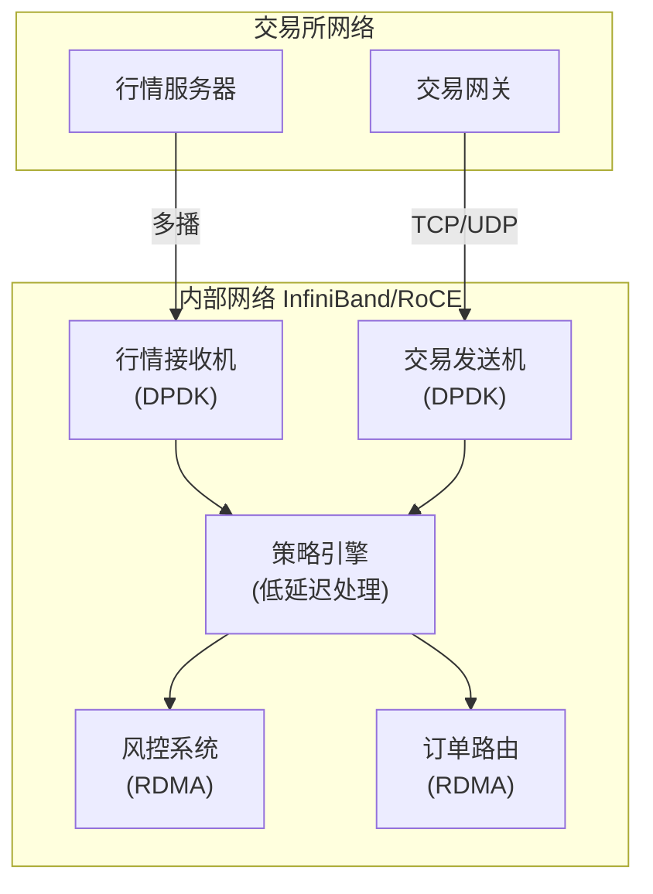

+++
title = "HFT面试题-网络优化"
date = 2026-01-31
weight = 34000
description = "HFT网络优化面试题：内核旁路、DPDK、零拷贝、网卡调优、多播深度解析"
[taxonomies]
tags = ["HFT", "面试", "网络", "DPDK", "低延迟"]
+++

# HFT 面试题 - 网络优化

本文汇集 HFT（高频交易）网络优化相关的高频面试问题，采用问答深挖形式。

---

## 问题 1：为什么 HFT 需要内核旁路？

### 标准答案

**传统网络栈延迟来源**：

| 来源 | 延迟 | 说明 |
|------|------|------|
| 系统调用 | ~100-200ns | 用户态→内核态切换 |
| 协议栈处理 | ~10-50μs | TCP/IP 栈 |
| 上下文切换 | ~1-5μs | 进程调度 |
| 中断处理 | ~2-10μs | 硬件中断 |
| 数据拷贝 | ~1-10μs | 用户态↔内核态 |

**总延迟：几十到上百微秒**

```
传统路径：
网卡 → 驱动 → 内核协议栈 → Socket → 用户态

内核旁路：
网卡 → 用户态驱动 → 应用（轮询）
```

### 面试官追问

**Q: 常见的内核旁路方案有哪些？**

| 方案 | 特点 | 适用场景 |
|------|------|----------|
| **DPDK** | Intel 开源，功能全面 | 通用低延迟 |
| **Solarflare OpenOnload** | 网卡专属，透明加速 | 兼容现有代码 |
| **Mellanox VMA** | RDMA 支持 | 高性能计算 |
| **Netmap** | BSD 许可，轻量 | 研究/简单场景 |
| **XDP/eBPF** | Linux 内核内加速 | 过滤/路由 |

**Q: DPDK 的核心技术是什么？**

```
DPDK 核心组件：

1. PMD（Poll Mode Driver）
   - 轮询代替中断
   - 用户态驱动
   - 零上下文切换

2. Huge Pages
   - 减少 TLB miss
   - 预分配 DMA 缓冲区

3. 无锁数据结构
   - rte_ring：无锁队列
   - rte_mempool：对象池

4. CPU 绑定
   - 每核独立运行
   - 无锁处理

5. NUMA 感知
   - 本地内存分配
   - 本地网卡队列
```

**Q: DPDK 轮询如何避免 CPU 浪费？**

```c
// 基本轮询
while (1) {
    nb_rx = rte_eth_rx_burst(port, queue, mbufs, BURST_SIZE);
    if (nb_rx > 0) {
        process_packets(mbufs, nb_rx);
    }
    // CPU 100% 占用，但延迟最低
}

// 混合模式（可选）
while (1) {
    nb_rx = rte_eth_rx_burst(port, queue, mbufs, BURST_SIZE);
    if (nb_rx > 0) {
        process_packets(mbufs, nb_rx);
        idle_count = 0;
    } else {
        idle_count++;
        if (idle_count > THRESHOLD) {
            // 可切换到中断模式
            // 或 CPU pause/sleep
            rte_pause();
        }
    }
}
```

**Q: DPDK 初始化流程是什么？**

```c
// 1. EAL 初始化（环境抽象层）
int ret = rte_eal_init(argc, argv);
// 参数示例：--lcores=0-3 --huge-dir=/mnt/huge --file-prefix=app

// 2. 创建内存池
struct rte_mempool *mbuf_pool = rte_pktmbuf_pool_create(
    "MBUF_POOL",
    NUM_MBUFS * 2,      // 总 mbuf 数
    MBUF_CACHE_SIZE,    // 每核缓存
    0,                   // 私有数据大小
    RTE_MBUF_DEFAULT_BUF_SIZE,  // mbuf 大小
    rte_socket_id()     // NUMA socket
);

// 3. 初始化网卡端口
struct rte_eth_conf port_conf = {
    .rxmode = {
        .mq_mode = ETH_MQ_RX_RSS,  // 多队列模式
        .max_rx_pkt_len = RTE_ETHER_MAX_LEN,
    },
    .rx_adv_conf = {
        .rss_conf = {
            .rss_key = NULL,
            .rss_hf = ETH_RSS_IP | ETH_RSS_TCP | ETH_RSS_UDP,
        },
    },
    .txmode = {
        .mq_mode = ETH_MQ_TX_NONE,
    },
};

uint16_t nb_rxd = RX_RING_SIZE;
uint16_t nb_txd = TX_RING_SIZE;
ret = rte_eth_dev_configure(portid, nb_rx_queue, nb_tx_queue, &port_conf);

// 4. 设置接收队列
for (q = 0; q < nb_rx_queue; q++) {
    ret = rte_eth_rx_queue_setup(
        portid, q, nb_rxd,
        rte_eth_dev_socket_id(portid),
        NULL, mbuf_pool
    );
}

// 5. 设置发送队列
for (q = 0; q < nb_tx_queue; q++) {
    ret = rte_eth_tx_queue_setup(
        portid, q, nb_txd,
        rte_eth_dev_socket_id(portid),
        NULL
    );
}

// 6. 启动网卡
ret = rte_eth_dev_start(portid);

// 7. 启用混杂模式（如需要）
rte_eth_promiscuous_enable(portid);
```

**Q: DPDK 如何绑定 CPU 核心？**

```c
// 1. 启动时指定 lcore
// 命令行：--lcores=0-3@4-7
// 含义：逻辑核心 0-3 映射到物理核心 4-7

// 2. 运行时绑定
unsigned lcore_id = rte_lcore_id();  // 获取当前 lcore
rte_thread_set_affinity(rte_lcore_to_socket_id(lcore_id));

// 3. 每个 lcore 独立处理
RTE_LCORE_FOREACH_WORKER(lcore_id) {
    rte_eal_remote_launch(lcore_main, NULL, lcore_id);
}

// 4. 主 lcore 处理
lcore_main(NULL);
```

**Q: DPDK 如何处理 NUMA？**

```c
// 1. 检测 NUMA 拓扑
unsigned socket_id = rte_socket_id();
unsigned lcore_id = rte_lcore_id();
unsigned socket = rte_lcore_to_socket_id(lcore_id);

// 2. 在本地 NUMA 节点分配内存
struct rte_mempool *pool = rte_pktmbuf_pool_create(
    "pool", 1024, 32, 0,
    RTE_MBUF_DEFAULT_BUF_SIZE,
    socket_id  // 使用本地 socket
);

// 3. 绑定网卡队列到本地 CPU
int port_id = 0;
int queue_id = 0;
int socket = rte_eth_dev_socket_id(port_id);
// 确保处理该队列的 lcore 在同一 socket
```

---

## 问题 2：什么是零拷贝？有哪些技术？

### 标准答案

**传统数据拷贝**：

```
发送文件到网络（传统方式）：
1. 磁盘 → 内核页缓存（DMA）
2. 内核页缓存 → 用户缓冲区（CPU）
3. 用户缓冲区 → Socket 缓冲区（CPU）
4. Socket 缓冲区 → 网卡（DMA）

共 4 次拷贝，2 次 CPU 参与
```

**零拷贝技术**：

| 技术 | 机制 | 拷贝次数 | 适用场景 |
|------|------|----------|----------|
| sendfile | 内核内传输 | 2（无 CPU） | 文件发送 |
| splice | 管道中介 | 0-2 | 转发 |
| mmap | 共享映射 | 2 | 大文件 |
| MSG_ZEROCOPY | 页面引用 | 1 | 大消息 |
| DPDK | 用户态 DMA | 0 | 最低延迟 |

### 面试官追问

**Q: sendfile 如何工作？**

```c
// 传统方式
char buf[8192];
while ((n = read(file_fd, buf, sizeof(buf))) > 0) {
    write(socket_fd, buf, n);
}

// sendfile（零拷贝）
off_t offset = 0;
sendfile(socket_fd, file_fd, &offset, file_size);

// 路径：
// 磁盘 → 页缓存 → 网卡
// （如果网卡支持 scatter-gather DMA）
```

**Q: DPDK 如何实现零拷贝？**

```c
// DPDK mbuf 直接映射到用户态

// 接收
struct rte_mbuf *mbufs[32];
nb_rx = rte_eth_rx_burst(port, queue, mbufs, 32);
// mbufs 直接包含网卡 DMA 写入的数据
// 无拷贝，直接处理

// 发送
struct rte_mbuf *mbuf = rte_pktmbuf_alloc(pool);
// 直接在 mbuf 中构造数据
rte_eth_tx_burst(port, queue, &mbuf, 1);
// 网卡直接 DMA 读取，无拷贝
```

**Q: 各种零拷贝技术的性能对比？**

| 技术 | 延迟 | 吞吐 | CPU 占用 | 适用场景 |
|------|------|------|----------|----------|
| **传统 read/write** | ~10μs | 低 | 高 | 通用 |
| **sendfile** | ~2-5μs | 中 | 低 | 文件传输 |
| **splice** | ~1-3μs | 中 | 低 | 管道转发 |
| **mmap + write** | ~3-6μs | 中 | 中 | 大文件 |
| **MSG_ZEROCOPY** | ~1-2μs | 高 | 低 | 大消息（>10KB） |
| **DPDK** | ~0.5-1μs | 最高 | 中 | HFT 场景 |

**Q: MSG_ZEROCOPY 如何使用？**

```c
// 1. 启用 MSG_ZEROCOPY（Linux 4.14+）
int val = 1;
setsockopt(sockfd, SOL_SOCKET, SO_ZEROCOPY, &val, sizeof(val));

// 2. 发送时使用 MSG_ZEROCOPY 标志
struct iovec iov = {
    .iov_base = buffer,
    .iov_len = len
};
struct msghdr msg = {
    .msg_iov = &iov,
    .msg_iovlen = 1,
};
ssize_t sent = sendmsg(sockfd, &msg, MSG_ZEROCOPY);

// 3. 等待完成通知（通过错误队列）
struct msghdr msg_err = {0};
struct cmsghdr *cmsg;
char ctrl[CMSG_SPACE(sizeof(uint32_t))];
msg_err.msg_control = ctrl;
msg_err.msg_controllen = sizeof(ctrl);

// 4. 接收完成通知
recvmsg(sockfd, &msg_err, MSG_ERRQUEUE);
cmsg = CMSG_FIRSTHDR(&msg_err);
if (cmsg && cmsg->cmsg_level == SOL_IP && 
    cmsg->cmsg_type == IP_RECVERR) {
    // 发送完成
}

// 注意：MSG_ZEROCOPY 需要大消息（>10KB）才有效
// 小消息反而可能增加延迟
```

**Q: splice 和 sendfile 的区别？**

```c
// sendfile：文件 → socket
ssize_t sendfile(int out_fd, int in_fd, off_t *offset, size_t count);
// 只能用于文件到 socket
// 内核内部直接传输

// splice：任意两个文件描述符之间
ssize_t splice(int fd_in, loff_t *off_in,
               int fd_out, loff_t *off_out,
               size_t len, unsigned int flags);
// 可以用于 socket → socket（转发）
// 使用管道作为中介

// 示例：socket 转发
int pfd[2];
pipe(pfd);

// 从源 socket 读取到管道
splice(source_sock, NULL, pfd[1], NULL, 4096, SPLICE_F_MOVE);
// 从管道写入目标 socket
splice(pfd[0], NULL, dest_sock, NULL, 4096, SPLICE_F_MOVE);
// 零拷贝转发
```

---

## 问题 3：如何调优网络延迟？

### 标准答案

**应用层调优**：

```c
// 1. 禁用 Nagle 算法
int flag = 1;
setsockopt(sock, IPPROTO_TCP, TCP_NODELAY, &flag, sizeof(flag));

// 2. 禁用延迟确认
int quickack = 1;
setsockopt(sock, IPPROTO_TCP, TCP_QUICKACK, &quickack, sizeof(quickack));

// 3. 设置缓冲区大小
int bufsize = 4096;
setsockopt(sock, SOL_SOCKET, SO_SNDBUF, &bufsize, sizeof(bufsize));
setsockopt(sock, SOL_SOCKET, SO_RCVBUF, &bufsize, sizeof(bufsize));

// 4. 开启 busy polling
int busy_poll = 50;  // 微秒
setsockopt(sock, SOL_SOCKET, SO_BUSY_POLL, &busy_poll, sizeof(busy_poll));

// 5. 非阻塞 + epoll
fcntl(sock, F_SETFL, O_NONBLOCK);
```

### 面试官追问

**Q: TCP_NODELAY 的作用？**

```
Nagle 算法：
- 小包积累后发送
- 减少网络拥塞
- 但增加延迟

问题场景：
发送 10 字节 → 等待 ACK 或更多数据 → 延迟 ~40ms

TCP_NODELAY：
- 禁用 Nagle
- 立即发送
- HFT 必须启用
```

**Q: TCP 调优参数完整列表？**

```c
// === 延迟优化参数 ===

// 1. 禁用 Nagle 算法（必须）
int nodelay = 1;
setsockopt(sock, IPPROTO_TCP, TCP_NODELAY, &nodelay, sizeof(nodelay));

// 2. 禁用延迟确认（必须）
int quickack = 1;
setsockopt(sock, IPPROTO_TCP, TCP_QUICKACK, &quickack, sizeof(quickack));

// 3. 禁用 TCP 延迟发送（Linux 3.12+）
int cork = 0;
setsockopt(sock, IPPROTO_TCP, TCP_CORK, &cork, sizeof(cork));

// 4. 设置 TCP_USER_TIMEOUT（连接超时）
unsigned int timeout_ms = 1000;  // 1秒
setsockopt(sock, IPPROTO_TCP, TCP_USER_TIMEOUT, &timeout_ms, sizeof(timeout_ms));

// === 缓冲区优化 ===

// 5. 发送缓冲区（小缓冲区降低延迟）
int sndbuf = 64 * 1024;  // 64KB
setsockopt(sock, SOL_SOCKET, SO_SNDBUF, &sndbuf, sizeof(sndbuf));

// 6. 接收缓冲区（根据带宽延迟积调整）
int rcvbuf = 256 * 1024;  // 256KB
setsockopt(sock, SOL_SOCKET, SO_RCVBUF, &rcvbuf, sizeof(rcvbuf));

// === 连接优化 ===

// 7. 地址重用（服务器）
int reuse = 1;
setsockopt(sock, SOL_SOCKET, SO_REUSEADDR, &reuse, sizeof(reuse));

// 8. 端口重用（Linux 3.9+）
int reuseport = 1;
setsockopt(sock, SOL_SOCKET, SO_REUSEPORT, &reuseport, sizeof(reuseport));

// 9. 保持连接
int keepalive = 1;
setsockopt(sock, SOL_SOCKET, SO_KEEPALIVE, &keepalive, sizeof(keepalive));
int keepidle = 60;
setsockopt(sock, IPPROTO_TCP, TCP_KEEPIDLE, &keepidle, sizeof(keepidle));
int keepintvl = 10;
setsockopt(sock, IPPROTO_TCP, TCP_KEEPINTVL, &keepintvl, sizeof(keepintvl));
int keepcnt = 3;
setsockopt(sock, IPPROTO_TCP, TCP_KEEPCNT, &keepcnt, sizeof(keepcnt));

// === 性能优化 ===

// 10. Busy polling（低延迟）
int busy_poll = 50;  // 微秒
setsockopt(sock, SOL_SOCKET, SO_BUSY_POLL, &busy_poll, sizeof(busy_poll));

// 11. 优先级（QoS）
int priority = 6;  // 高优先级
setsockopt(sock, SOL_SOCKET, SO_PRIORITY, &priority, sizeof(priority));

// 12. 时间戳（延迟测量）
int timestamp = 1;
setsockopt(sock, SOL_SOCKET, SO_TIMESTAMP, &timestamp, sizeof(timestamp));
int timestampns = 1;
setsockopt(sock, SOL_SOCKET, SO_TIMESTAMPNS, &timestampns, sizeof(timestampns));

// === TCP 拥塞控制 ===

// 13. 设置拥塞控制算法
char cc[16] = "bbr";  // 或 "cubic", "reno"
setsockopt(sock, IPPROTO_TCP, TCP_CONGESTION, cc, strlen(cc));

// 14. TCP Fast Open（减少握手延迟）
int fastopen = 1;
setsockopt(sock, IPPROTO_TCP, TCP_FASTOPEN, &fastopen, sizeof(fastopen));
```

**Q: epoll 的 LT 和 ET 模式有什么区别？**

```c
// === Level Triggered (LT) 模式 ===
// 默认模式，类似 select/poll

struct epoll_event ev;
ev.events = EPOLLIN;  // 默认 LT
ev.data.fd = sockfd;
epoll_ctl(epfd, EPOLL_CTL_ADD, sockfd, &ev);

// LT 特点：
// - 只要缓冲区有数据，epoll_wait 就会返回
// - 可以多次读取，直到缓冲区为空
// - 编程简单，不容易遗漏事件
// - 但可能多次触发，效率略低

// === Edge Triggered (ET) 模式 ===
// 边缘触发，类似信号

ev.events = EPOLLIN | EPOLLET;  // ET 模式
epoll_ctl(epfd, EPOLL_CTL_ADD, sockfd, &ev);

// ET 特点：
// - 只在状态变化时触发一次
// - 必须一次性读取完所有数据
// - 需要非阻塞 socket
// - 效率更高，适合高并发

// ET 模式使用示例：
fcntl(sockfd, F_SETFL, O_NONBLOCK);  // 必须非阻塞

while (1) {
    int nfds = epoll_wait(epfd, events, MAX_EVENTS, -1);
    for (int i = 0; i < nfds; i++) {
        if (events[i].events & EPOLLIN) {
            // 必须循环读取直到 EAGAIN
            while (1) {
                ssize_t n = read(events[i].data.fd, buf, sizeof(buf));
                if (n < 0) {
                    if (errno == EAGAIN || errno == EWOULDBLOCK) {
                        break;  // 读取完毕
                    }
                    // 错误处理
                    break;
                } else if (n == 0) {
                    // 连接关闭
                    break;
                }
                // 处理数据
                process_data(buf, n);
            }
        }
    }
}

// HFT 建议：
// - 低延迟场景：使用 ET + 非阻塞
// - 简单场景：使用 LT（更安全）
```

**Q: 系统层如何调优？**

```bash
# === 1. 中断亲和性 ===
# 查看中断号
cat /proc/interrupts | grep eth0

# 将网卡中断绑定到特定 CPU
# CPU 0: 0x1, CPU 1: 0x2, CPU 2: 0x4, CPU 3: 0x8
# CPU 0-1: 0x3, CPU 2-3: 0xC
echo 3 > /proc/irq/24/smp_affinity  # 绑定到 CPU 0-1

# 禁用 irqbalance（必须）
systemctl stop irqbalance
systemctl disable irqbalance

# === 2. 网卡队列绑定 ===
# 查看队列数
ethtool -l eth0

# 设置队列数（多队列网卡）
ethtool -L eth0 combined 8  # 8 个队列

# 设置 RSS（接收端缩放）哈希
ethtool -X eth0 equal 8  # 均匀分布
# 或自定义哈希
ethtool -X eth0 hkey <hash_key> equal 8

# 绑定队列到 CPU（通过中断亲和性）
for i in {0..7}; do
    irq=$(cat /proc/interrupts | grep "eth0-TxRx-$i" | awk '{print $1}' | sed 's/://')
    echo $((1 << i)) > /proc/irq/$irq/smp_affinity
done

# === 3. 系统网络参数 ===
# Busy polling（微秒）
sysctl -w net.core.busy_read=50
sysctl -w net.core.busy_poll=50

# 网络设备处理预算
sysctl -w net.core.netdev_budget=600
sysctl -w net.core.netdev_max_backlog=30000

# 接收/发送缓冲区
sysctl -w net.core.rmem_max=134217728  # 128MB
sysctl -w net.core.wmem_max=134217728
sysctl -w net.core.rmem_default=262144  # 256KB
sysctl -w net.core.wmem_default=262144

# TCP 缓冲区
sysctl -w net.ipv4.tcp_rmem="4096 87380 134217728"
sysctl -w net.ipv4.tcp_wmem="4096 65536 134217728"

# TCP 选项
sysctl -w net.ipv4.tcp_slow_start_after_idle=0
sysctl -w net.ipv4.tcp_tw_reuse=1
sysctl -w net.ipv4.tcp_fin_timeout=30
sysctl -w net.ipv4.tcp_syncookies=0  # 禁用（低延迟）

# === 4. 禁用网络特性（降低延迟） ===
# GRO/GSO/TSO/LRO 增加延迟，HFT 通常禁用
ethtool -K eth0 gro off    # Generic Receive Offload
ethtool -K eth0 gso off    # Generic Segmentation Offload
ethtool -K eth0 tso off    # TCP Segmentation Offload
ethtool -K eth0 lro off    # Large Receive Offload
ethtool -K eth0 rxhash off # Receive Flow Hash

# === 5. Ring Buffer 大小 ===
# 查看当前大小
ethtool -g eth0

# 设置大小（需要网卡支持）
ethtool -G eth0 rx 4096 tx 4096

# === 6. 中断合并（降低延迟） ===
# 查看当前设置
ethtool -c eth0

# 禁用中断合并（最低延迟）
ethtool -C eth0 rx-usecs 0 tx-usecs 0
ethtool -C eth0 rx-frames 0 tx-frames 0

# === 7. CPU 调优 ===
# 禁用 CPU 频率调节（固定频率）
echo performance > /sys/devices/system/cpu/cpu*/cpufreq/scaling_governor

# 禁用 CPU 空闲状态（C-states）
# 在 GRUB 中添加：processor.max_cstate=1

# === 8. 内存调优 ===
# 禁用透明大页（THP）碎片整理
echo never > /sys/kernel/mm/transparent_hugepage/defrag
echo never > /sys/kernel/mm/transparent_hugepage/enabled

# 禁用 swap（避免换页延迟）
swapoff -a
```

**Q: 网卡层如何调优？**

```bash
# === 1. 查看网卡信息 ===
ethtool eth0                    # 基本信息
ethtool -S eth0                 # 统计信息
ethtool -i eth0                 # 驱动信息
ethtool -k eth0                 # 特性开关
ethtool -l eth0                 # 队列信息
ethtool -g eth0                 # Ring buffer
ethtool -c eth0                 # 中断合并参数

# === 2. 中断合并参数（降低延迟） ===
# 查看当前设置
ethtool -c eth0

# 禁用中断合并（最低延迟）
ethtool -C eth0 rx-usecs 0      # 接收延迟 0 微秒
ethtool -C eth0 tx-usecs 0      # 发送延迟 0 微秒
ethtool -C eth0 rx-frames 0     # 接收帧数 0
ethtool -C eth0 tx-frames 0     # 发送帧数 0

# 或者设置很小的值（如 1 微秒）
ethtool -C eth0 rx-usecs 1 tx-usecs 1

# === 3. 队列配置 ===
# 查看队列数
ethtool -l eth0

# 设置队列数（需要网卡支持）
ethtool -L eth0 combined 8      # 8 个队列

# === 4. RSS（接收端缩放）配置 ===
# 查看 RSS 哈希键
ethtool -x eth0

# 设置 RSS 哈希键（均匀分布）
ethtool -X eth0 equal 8

# 自定义哈希键（5 元组哈希）
ethtool -X eth0 hkey \
  6d:5a:56:da:25:5b:0e:c2:62:94:20:3c:25:2a:94:57: \
  ea:2a:7d:3a:10:4b:1a:12:17:3d:47:18:1e:1b:1d:1c: \
  a8:d0:7a:2e:b7:19:ab:8e:16:91:70:07:0d:03:08:04

# === 5. 流量定向（Flow Director） ===
# 将特定流量定向到特定队列
# TCP 流量从 10.0.0.1:5000 到队列 0
ethtool -N eth0 flow-type tcp4 \
  src-ip 10.0.0.1 src-port 5000 \
  action 0

# UDP 多播流量到队列 1
ethtool -N eth0 flow-type udp4 \
  dst-ip 239.1.1.1 \
  action 1

# 查看规则
ethtool -n eth0

# === 6. 网卡统计和监控 ===
# 实时统计
watch -n 1 'ethtool -S eth0 | grep -E "rx|tx|drop|error"'

# 关键指标：
# - rx_packets/tx_packets: 收发包数
# - rx_dropped/tx_dropped: 丢包数
# - rx_errors/tx_errors: 错误数
# - rx_missed_errors: 接收遗漏
# - rx_no_buffer_count: 缓冲区不足

# === 7. 网卡硬件时间戳（PTP） ===
# 查看是否支持硬件时间戳
ethtool -T eth0

# 启用硬件时间戳（需要网卡支持）
# 在应用中使用 SO_TIMESTAMPING
```

**Q: 如何配置网卡硬件时间戳？**

```c
// === 硬件时间戳配置 ===

// 1. 检查网卡是否支持
// bash: ethtool -T eth0
// 输出应包含：Hardware time stamping: on

// 2. 启用硬件时间戳
int flags = SOF_TIMESTAMPING_TX_HARDWARE |
            SOF_TIMESTAMPING_RX_HARDWARE |
            SOF_TIMESTAMPING_RAW_HARDWARE;
setsockopt(sockfd, SOL_SOCKET, SO_TIMESTAMPING, &flags, sizeof(flags));

// 3. 接收时间戳
struct msghdr msg = {0};
struct iovec iov;
char buffer[1500];
char ctrl[CMSG_SPACE(sizeof(struct timespec)) * 3];

iov.iov_base = buffer;
iov.iov_len = sizeof(buffer);
msg.msg_iov = &iov;
msg.msg_iovlen = 1;
msg.msg_control = ctrl;
msg.msg_controllen = sizeof(ctrl);

ssize_t n = recvmsg(sockfd, &msg, 0);

// 4. 提取时间戳
struct timespec *ts = NULL;
for (struct cmsghdr *cmsg = CMSG_FIRSTHDR(&msg);
     cmsg != NULL;
     cmsg = CMSG_NXTHDR(&msg, cmsg)) {
    if (cmsg->cmsg_level == SOL_SOCKET &&
        cmsg->cmsg_type == SO_TIMESTAMPING) {
        ts = (struct timespec *)CMSG_DATA(cmsg);
        // ts[0]: 软件时间戳
        // ts[1]: 硬件时间戳（如果支持）
        // ts[2]: 原始硬件时间戳
        break;
    }
}

// 5. 发送时间戳（需要特殊处理）
// 使用 sendmsg + MSG_ERRQUEUE 获取发送时间戳
```

---

## 问题 4：多播在 HFT 中的作用？

### 标准答案

**多播（Multicast）应用**：
- 交易所使用多播分发行情
- 所有参与者同时收到
- 减少网络拥塞

```c
// 加入多播组
struct ip_mreq mreq;
mreq.imr_multiaddr.s_addr = inet_addr("239.1.1.1");
mreq.imr_interface.s_addr = INADDR_ANY;
setsockopt(sock, IPPROTO_IP, IP_ADD_MEMBERSHIP, &mreq, sizeof(mreq));

// 设置接收缓冲
int bufsize = 8 * 1024 * 1024;
setsockopt(sock, SOL_SOCKET, SO_RCVBUF, &bufsize, sizeof(bufsize));

// 设置多播 TTL
int ttl = 1;
setsockopt(sock, IPPROTO_IP, IP_MULTICAST_TTL, &ttl, sizeof(ttl));
```

### 面试官追问

**Q: 如何优化多播接收？**

```c
// === 1. 增加接收缓冲区 ===
int bufsize = 16 * 1024 * 1024;  // 16MB
setsockopt(sock, SOL_SOCKET, SO_RCVBUF, &bufsize, sizeof(bufsize));

// 注意：系统可能有上限，需要调整 sysctl
// sysctl -w net.core.rmem_max=33554432

// === 2. 使用 recvmmsg 批量接收 ===
#define VLEN 32
struct mmsghdr msgs[VLEN];
struct iovec iovecs[VLEN];
char buffers[VLEN][1500];

// 初始化
for (int i = 0; i < VLEN; i++) {
    iovecs[i].iov_base = buffers[i];
    iovecs[i].iov_len = sizeof(buffers[i]);
    msgs[i].msg_hdr.msg_iov = &iovecs[i];
    msgs[i].msg_hdr.msg_iovlen = 1;
}

// 批量接收
int ret = recvmmsg(sock, msgs, VLEN, 0, NULL);
if (ret > 0) {
    for (int i = 0; i < ret; i++) {
        process_packet(buffers[i], msgs[i].msg_len);
    }
}

// === 3. 使用 PACKET_MMAP（raw socket） ===
// 创建 raw socket
int sock = socket(AF_PACKET, SOCK_RAW, htons(ETH_P_IP));

// 设置环形缓冲区
struct tpacket_req req = {
    .tp_block_size = 4096,
    .tp_block_nr = 64,
    .tp_frame_size = 2048,
    .tp_frame_nr = 128,
};
setsockopt(sock, SOL_PACKET, PACKET_RX_RING, &req, sizeof(req));

// 映射到用户空间
void *ring = mmap(NULL, req.tp_block_size * req.tp_block_nr,
                  PROT_READ | PROT_WRITE, MAP_SHARED, sock, 0);

// 轮询接收（零拷贝）
struct tpacket_hdr *hdr = ring;
while (1) {
    if (hdr->tp_status & TP_STATUS_USER) {
        process_packet((char *)hdr + hdr->tp_mac, hdr->tp_len);
        hdr->tp_status = TP_STATUS_KERNEL;
    }
    hdr = (struct tpacket_hdr *)((char *)hdr + req.tp_frame_size);
}

// === 4. 专用网卡队列 ===
// 使用 ethtool 将多播流量定向到专用队列
// ethtool -N eth0 flow-type udp4 dst-ip 239.1.1.1 action 1

// 绑定该队列的中断到专用 CPU
// echo 2 > /proc/irq/<irq>/smp_affinity

// === 5. 使用 DPDK 接收多播 ===
// DPDK 自动处理多播，无需特殊配置
struct rte_mbuf *mbufs[32];
int nb_rx = rte_eth_rx_burst(port_id, queue_id, mbufs, 32);

for (int i = 0; i < nb_rx; i++) {
    struct rte_ether_hdr *eth_hdr = rte_pktmbuf_mtod(mbufs[i], struct rte_ether_hdr *);
    struct rte_ipv4_hdr *ip_hdr = (struct rte_ipv4_hdr *)(eth_hdr + 1);
    
    // 检查是否是多播
    if (RTE_IPV4_IS_MULTICAST(ip_hdr->dst_addr)) {
        process_multicast_packet(mbufs[i]);
    }
    
    rte_pktmbuf_free(mbufs[i]);
}
```

**Q: 多播接收的完整示例？**

```c
// === 完整的多播接收优化示例 ===

#include <sys/socket.h>
#include <netinet/in.h>
#include <arpa/inet.h>
#include <fcntl.h>
#include <sys/epoll.h>

#define MULTICAST_GROUP "239.1.1.1"
#define MULTICAST_PORT 5000
#define BUFFER_SIZE (16 * 1024 * 1024)

int setup_multicast_socket() {
    // 1. 创建 UDP socket
    int sock = socket(AF_INET, SOCK_DGRAM, 0);
    if (sock < 0) return -1;
    
    // 2. 设置非阻塞
    int flags = fcntl(sock, F_GETFL, 0);
    fcntl(sock, F_SETFL, flags | O_NONBLOCK);
    
    // 3. 地址重用
    int reuse = 1;
    setsockopt(sock, SOL_SOCKET, SO_REUSEADDR, &reuse, sizeof(reuse));
    
    // 4. 绑定本地地址
    struct sockaddr_in addr = {0};
    addr.sin_family = AF_INET;
    addr.sin_addr.s_addr = INADDR_ANY;
    addr.sin_port = htons(MULTICAST_PORT);
    bind(sock, (struct sockaddr *)&addr, sizeof(addr));
    
    // 5. 加入多播组
    struct ip_mreq mreq;
    mreq.imr_multiaddr.s_addr = inet_addr(MULTICAST_GROUP);
    mreq.imr_interface.s_addr = INADDR_ANY;
    setsockopt(sock, IPPROTO_IP, IP_ADD_MEMBERSHIP, &mreq, sizeof(mreq));
    
    // 6. 设置接收缓冲区（大缓冲区避免丢包）
    int bufsize = BUFFER_SIZE;
    setsockopt(sock, SOL_SOCKET, SO_RCVBUF, &bufsize, sizeof(bufsize));
    
    // 7. 设置多播 TTL
    int ttl = 1;  // 本地网络
    setsockopt(sock, IPPROTO_IP, IP_MULTICAST_TTL, &ttl, sizeof(ttl));
    
    // 8. 禁用多播回环（如不需要）
    int loop = 0;
    setsockopt(sock, IPPROTO_IP, IP_MULTICAST_LOOP, &loop, sizeof(loop));
    
    // 9. 时间戳（延迟测量）
    int timestamp = 1;
    setsockopt(sock, SOL_SOCKET, SO_TIMESTAMP, &timestamp, sizeof(timestamp));
    
    return sock;
}

// 使用 recvmmsg 批量接收
void receive_multicast_batch(int sock) {
    #define VLEN 32
    struct mmsghdr msgs[VLEN];
    struct iovec iovecs[VLEN];
    char buffers[VLEN][1500];
    struct sockaddr_in addrs[VLEN];
    struct timespec timestamps[VLEN];
    
    // 初始化
    for (int i = 0; i < VLEN; i++) {
        iovecs[i].iov_base = buffers[i];
        iovecs[i].iov_len = sizeof(buffers[i]);
        
        msgs[i].msg_hdr.msg_name = &addrs[i];
        msgs[i].msg_hdr.msg_namelen = sizeof(addrs[i]);
        msgs[i].msg_hdr.msg_iov = &iovecs[i];
        msgs[i].msg_hdr.msg_iovlen = 1;
        
        // 时间戳控制消息
        char ctrl[CMSG_SPACE(sizeof(struct timespec))];
        msgs[i].msg_hdr.msg_control = ctrl;
        msgs[i].msg_hdr.msg_controllen = sizeof(ctrl);
    }
    
    // 批量接收
    while (1) {
        int ret = recvmmsg(sock, msgs, VLEN, 0, NULL);
        if (ret < 0) {
            if (errno == EAGAIN || errno == EWOULDBLOCK) {
                continue;
            }
            break;
        }
        
        for (int i = 0; i < ret; i++) {
            // 提取时间戳
            struct timespec *ts = NULL;
            for (struct cmsghdr *cmsg = CMSG_FIRSTHDR(&msgs[i].msg_hdr);
                 cmsg != NULL;
                 cmsg = CMSG_NXTHDR(&msgs[i].msg_hdr, cmsg)) {
                if (cmsg->cmsg_level == SOL_SOCKET &&
                    cmsg->cmsg_type == SO_TIMESTAMP) {
                    ts = (struct timespec *)CMSG_DATA(cmsg);
                    break;
                }
            }
            
            // 处理数据包
            process_packet(buffers[i], msgs[i].msg_len, ts);
        }
    }
}
```

**Q: 多播丢包如何处理？**

```
检测丢包：
- 序列号检查
- 心跳超时

恢复机制：
1. Gap fill：向交易所请求重传
2. Snapshot：获取完整快照重建
3. TCP 回放：从 TCP 备用通道获取

HFT 策略：
- 丢包时快速检测
- 使用 TCP 通道作为备份
- 避免长时间重建状态
```

---

## 问题 5：RDMA 在 HFT 中的应用？

### 标准答案

**RDMA（Remote Direct Memory Access）**：
- 绕过远程主机 CPU
- 直接读写远程内存
- 极低延迟（< 1μs）

| 协议 | 网络 | 特点 |
|------|------|------|
| InfiniBand | IB 专用网络 | 最低延迟 |
| RoCE | 以太网 | 兼容性好 |
| iWARP | TCP/IP | 广泛支持 |

### 面试官追问

**Q: RDMA 操作类型有哪些？**

```c
// 1. SEND/RECV：类似传统消息传递
// 发送方
ibv_post_send(qp, &send_wr, &bad_wr);
// 接收方
ibv_post_recv(qp, &recv_wr, &bad_wr);

// 2. RDMA Write：写入远程内存
send_wr.opcode = IBV_WR_RDMA_WRITE;
send_wr.wr.rdma.remote_addr = remote_addr;
send_wr.wr.rdma.rkey = remote_key;
// 远程 CPU 不感知

// 3. RDMA Read：读取远程内存
send_wr.opcode = IBV_WR_RDMA_READ;
// 远程 CPU 不感知

// 4. Atomic：原子操作
send_wr.opcode = IBV_WR_ATOMIC_CMP_AND_SWP;
// 远程原子 CAS
```

**Q: HFT 如何使用 RDMA？**

```
应用场景：
1. 交易系统内部通信
2. 风控系统实时数据同步
3. 分布式订单簿复制

优势：
- 延迟 < 1μs
- CPU 开销低
- 高吞吐

挑战：
- 编程复杂
- 需要特殊网卡
- 网络拓扑要求
```

**Q: RDMA 完整初始化流程？**

```c
// === 1. 打开设备 ===
struct ibv_device **dev_list;
struct ibv_context *ctx;
struct ibv_pd *pd;  // Protection Domain

dev_list = ibv_get_device_list(NULL);
ctx = ibv_open_device(dev_list[0]);
pd = ibv_alloc_pd(ctx);

// === 2. 创建完成队列（CQ） ===
struct ibv_cq *cq;
cq = ibv_create_cq(ctx, 10, NULL, NULL, 0);  // 10 个条目

// === 3. 创建队列对（QP） ===
struct ibv_qp_init_attr qp_init_attr = {
    .qp_type = IBV_QPT_RC,  // Reliable Connected
    .send_cq = cq,
    .recv_cq = cq,
    .cap = {
        .max_send_wr = 10,
        .max_recv_wr = 10,
        .max_send_sge = 1,
        .max_recv_sge = 1,
    },
};
struct ibv_qp *qp = ibv_create_qp(pd, &qp_init_attr);

// === 4. 注册内存区域（MR） ===
char *buffer = malloc(4096);
struct ibv_mr *mr = ibv_reg_mr(pd, buffer, 4096,
    IBV_ACCESS_LOCAL_WRITE |
    IBV_ACCESS_REMOTE_READ |
    IBV_ACCESS_REMOTE_WRITE);

// === 5. 修改 QP 状态 ===
// RESET -> INIT -> RTR -> RTS
struct ibv_qp_attr attr = {0};

// INIT
attr.qp_state = IBV_QPS_INIT;
attr.port_num = 1;
attr.pkey_index = 0;
attr.qp_access_flags = IBV_ACCESS_LOCAL_WRITE |
                       IBV_ACCESS_REMOTE_READ |
                       IBV_ACCESS_REMOTE_WRITE;
ibv_modify_qp(qp, &attr,
    IBV_QP_STATE | IBV_QP_PKEY_INDEX |
    IBV_QP_PORT | IBV_QP_ACCESS_FLAGS);

// RTR (Ready to Receive)
attr.qp_state = IBV_QPS_RTR;
attr.path_mtu = IBV_MTU_4096;
attr.dest_qp_num = remote_qp_num;
attr.rq_psn = 0;
attr.max_dest_rd_atomic = 16;
attr.min_rnr_timer = 0x12;
ibv_modify_qp(qp, &attr,
    IBV_QP_STATE | IBV_QP_AV | IBV_QP_PATH_MTU |
    IBV_QP_DEST_QPN | IBV_QP_RQ_PSN |
    IBV_QP_MAX_DEST_RD_ATOMIC | IBV_QP_MIN_RNR_TIMER);

// RTS (Ready to Send)
attr.qp_state = IBV_QPS_RTS;
attr.timeout = 0x12;
attr.retry_cnt = 6;
attr.rnr_retry = 0;
attr.sq_psn = 0;
attr.max_rd_atomic = 16;
ibv_modify_qp(qp, &attr,
    IBV_QP_STATE | IBV_QP_TIMEOUT | IBV_QP_RETRY_CNT |
    IBV_QP_RNR_RETRY | IBV_QP_SQ_PSN | IBV_QP_MAX_QP_RD_ATOMIC);

// === 6. 发送数据（RDMA Write） ===
struct ibv_sge sge = {
    .addr = (uintptr_t)buffer,
    .length = 1024,
    .lkey = mr->lkey,
};
struct ibv_send_wr wr = {
    .sg_list = &sge,
    .num_sge = 1,
    .opcode = IBV_WR_RDMA_WRITE,
    .send_flags = IBV_SEND_SIGNALED,
    .wr.rdma.remote_addr = remote_addr,
    .wr.rdma.rkey = remote_key,
};
struct ibv_send_wr *bad_wr;
ibv_post_send(qp, &wr, &bad_wr);

// === 7. 轮询完成 ===
struct ibv_wc wc;
while (ibv_poll_cq(cq, 1, &wc) == 0) {
    // 等待完成
}
if (wc.status == IBV_WC_SUCCESS) {
    // 发送成功
}
```

**Q: RDMA vs DPDK 如何选择？**

| 特性 | RDMA | DPDK |
|------|------|------|
| **延迟** | < 1μs | ~1-2μs |
| **网络** | InfiniBand/RoCE | 以太网 |
| **编程复杂度** | 高 | 中 |
| **CPU 开销** | 极低 | 低 |
| **适用场景** | 内部通信、数据同步 | 市场数据接收、网关 |
| **成本** | 高（专用网卡） | 中（普通网卡） |

```
HFT 典型架构：
- 市场数据接收：DPDK（多播行情）
- 交易网关：DPDK（低延迟发送）
- 内部通信：RDMA（订单路由、风控）
- 数据同步：RDMA（订单簿复制）
```

---

## 问题 6：如何测量网络延迟？

### 标准答案

**延迟测量方法**：

| 方法 | 精度 | 适用场景 |
|------|------|----------|
| **Ping** | ~1ms | 粗略测量 |
| **硬件时间戳** | ~100ns | 精确测量 |
| **软件时间戳** | ~1μs | 应用层测量 |
| **专用测试工具** | ~10ns | 专业测试 |

### 面试官追问

**Q: 如何使用硬件时间戳测量延迟？**

```c
// === 1. 启用硬件时间戳 ===
int flags = SOF_TIMESTAMPING_TX_HARDWARE |
            SOF_TIMESTAMPING_RX_HARDWARE |
            SOF_TIMESTAMPING_RAW_HARDWARE |
            SOF_TIMESTAMPING_SYS_HARDWARE |
            SOF_TIMESTAMPING_OPT_ID;
setsockopt(sockfd, SOL_SOCKET, SO_TIMESTAMPING, &flags, sizeof(flags));

// === 2. 发送带 ID 的数据包 ===
struct msghdr msg = {0};
struct iovec iov;
char buffer[64];
uint32_t packet_id = get_packet_id();

// 在数据包中包含 ID
memcpy(buffer, &packet_id, sizeof(packet_id));
iov.iov_base = buffer;
iov.iov_len = sizeof(buffer);
msg.msg_iov = &iov;
msg.msg_iovlen = 1;

sendmsg(sockfd, &msg, 0);

// === 3. 接收时间戳 ===
struct msghdr recv_msg = {0};
struct iovec recv_iov;
char recv_buffer[64];
char ctrl[CMSG_SPACE(sizeof(struct scm_timestamping))];

recv_iov.iov_base = recv_buffer;
recv_iov.iov_len = sizeof(recv_buffer);
recv_msg.msg_iov = &recv_iov;
recv_msg.msg_iovlen = 1;
recv_msg.msg_control = ctrl;
recv_msg.msg_controllen = sizeof(ctrl);

ssize_t n = recvmsg(sockfd, &recv_msg, 0);

// === 4. 提取时间戳 ===
struct scm_timestamping *ts = NULL;
for (struct cmsghdr *cmsg = CMSG_FIRSTHDR(&recv_msg);
     cmsg != NULL;
     cmsg = CMSG_NXTHDR(&recv_msg, cmsg)) {
    if (cmsg->cmsg_level == SOL_SOCKET &&
        cmsg->cmsg_type == SO_TIMESTAMPING) {
        ts = (struct scm_timestamping *)CMSG_DATA(cmsg);
        break;
    }
}

if (ts) {
    // ts->ts[0]: 软件时间戳
    // ts->ts[1]: 硬件时间戳（网卡硬件）
    // ts->ts[2]: 原始硬件时间戳
    struct timespec *hw_ts = &ts->ts[1];
    // 计算延迟
    uint64_t latency_ns = timespec_to_ns(hw_ts) - send_time_ns;
}
```

**Q: 如何实现 RTT（往返时间）测量？**

```c
// === 1. 发送时间戳记录 ===
struct packet_info {
    uint32_t id;
    struct timespec send_time;
};

// 发送时记录
struct timespec send_ts;
clock_gettime(CLOCK_REALTIME, &send_ts);
// 或使用硬件时间戳
struct packet_info info = {
    .id = packet_id++,
    .send_time = send_ts,
};
send_packet(&info);

// === 2. 接收时计算 RTT ===
struct timespec recv_ts;
clock_gettime(CLOCK_REALTIME, &recv_ts);

// 计算延迟
long rtt_ns = (recv_ts.tv_sec - send_ts.tv_sec) * 1000000000L +
              (recv_ts.tv_nsec - send_ts.tv_nsec);

// === 3. 使用高精度时钟 ===
// CLOCK_MONOTONIC_RAW：不受 NTP 调整影响
struct timespec ts;
clock_gettime(CLOCK_MONOTONIC_RAW, &ts);

// === 4. 延迟统计 ===
struct latency_stats {
    uint64_t min_ns;
    uint64_t max_ns;
    uint64_t sum_ns;
    uint64_t count;
    uint64_t p50_ns, p99_ns, p999_ns;
    uint64_t histogram[100];  // 直方图
};

void update_latency_stats(struct latency_stats *stats, uint64_t latency_ns) {
    if (stats->count == 0) {
        stats->min_ns = stats->max_ns = latency_ns;
    } else {
        if (latency_ns < stats->min_ns) stats->min_ns = latency_ns;
        if (latency_ns > stats->max_ns) stats->max_ns = latency_ns;
    }
    stats->sum_ns += latency_ns;
    stats->count++;
    
    // 更新百分位数（需要排序或直方图）
    update_percentiles(stats, latency_ns);
}
```

**Q: 如何测量端到端延迟？**

```c
// === 端到端延迟测量（应用层） ===

// 1. 发送端：在数据包中嵌入时间戳
struct market_data {
    uint64_t timestamp_ns;  // 发送时间戳
    uint32_t sequence;
    // ... 其他数据
};

void send_market_data(struct market_data *data) {
    // 使用高精度时钟
    struct timespec ts;
    clock_gettime(CLOCK_REALTIME, &ts);
    data->timestamp_ns = ts.tv_sec * 1000000000ULL + ts.tv_nsec;
    data->sequence = sequence++;
    
    send(sockfd, data, sizeof(*data), 0);
}

// 2. 接收端：计算延迟
void receive_market_data() {
    struct market_data data;
    recv(sockfd, &data, sizeof(data), 0);
    
    // 获取接收时间
    struct timespec recv_ts;
    clock_gettime(CLOCK_REALTIME, &recv_ts);
    uint64_t recv_ns = recv_ts.tv_sec * 1000000000ULL + recv_ts.tv_nsec;
    
    // 计算端到端延迟
    uint64_t latency_ns = recv_ns - data.timestamp_ns;
    
    // 记录延迟
    record_latency(latency_ns);
    
    // 检查序列号（检测丢包）
    if (data.sequence != expected_sequence++) {
        handle_packet_loss();
    }
}

// === 使用专用工具 ===
// 1. hping3：精确延迟测试
// hping3 -c 1000 -i u1000 --fast 10.0.0.1

// 2. DPDK pktgen：高性能测试
// 3. MoonGen：可编程网络测试
// 4. 自定义测试工具：针对特定协议
```

---

## 问题 7：HFT 网络架构设计建议？

### 标准答案

**HFT 网络架构原则**：
1. **最短路径**：减少网络跳数
2. **专用网络**：隔离交易流量
3. **冗余设计**：多路径、多网卡
4. **监控告警**：实时延迟监控

### 面试官追问

**Q: 典型的 HFT 网络拓扑？**



**Q: 网卡配置建议？**

```bash
# === 1. 多网卡配置 ===
# 行情接收：专用网卡（多播）
# 交易发送：专用网卡（单播）
# 管理：独立网卡（SSH、监控）

# 行情网卡配置
ethtool -K eth1 gro off gso off tso off
ethtool -C eth1 rx-usecs 0 tx-usecs 0
ethtool -L eth1 combined 8
ethtool -G eth1 rx 4096 tx 4096

# 交易网卡配置（类似）
ethtool -K eth2 gro off gso off tso off
ethtool -C eth2 rx-usecs 0 tx-usecs 0

# === 2. 网络隔离 ===
# VLAN 隔离
ip link add link eth1 name eth1.100 type vlan id 100
ip addr add 10.0.1.1/24 dev eth1.100

# === 3. 路由配置 ===
# 行情流量：eth1
ip route add 239.0.0.0/8 dev eth1

# 交易流量：eth2
ip route add 192.168.1.0/24 dev eth2

# === 4. 防火墙规则 ===
# 只允许必要的端口
iptables -A INPUT -i eth1 -p udp --dport 5000 -j ACCEPT
iptables -A INPUT -i eth2 -p tcp --dport 6000 -j ACCEPT
iptables -A INPUT -j DROP
```

**Q: DPDK 应用架构设计？**

```c
// === 1. 多进程架构 ===
// 进程 1：行情接收（专用 CPU 核心）
// 进程 2：策略处理（专用 CPU 核心）
// 进程 3：交易发送（专用 CPU 核心）

// 进程间通信：共享内存 + 无锁队列
struct rte_ring *market_data_ring;
struct rte_ring *order_ring;

// === 2. 行情接收进程 ===
void market_data_receiver() {
    // 绑定到 CPU 0
    rte_thread_set_affinity(0);
    
    struct rte_mbuf *mbufs[32];
    while (1) {
        int nb_rx = rte_eth_rx_burst(port_id, 0, mbufs, 32);
        for (int i = 0; i < nb_rx; i++) {
            // 解析行情数据
            struct market_data *data = parse_market_data(mbufs[i]);
            
            // 放入无锁队列
            rte_ring_enqueue(market_data_ring, data);
            
            rte_pktmbuf_free(mbufs[i]);
        }
    }
}

// === 3. 策略处理进程 ===
void strategy_processor() {
    // 绑定到 CPU 1
    rte_thread_set_affinity(1);
    
    while (1) {
        struct market_data *data;
        if (rte_ring_dequeue(market_data_ring, (void **)&data) == 0) {
            // 处理行情
            process_market_data(data);
            
            // 生成订单
            struct order *order = generate_order(data);
            rte_ring_enqueue(order_ring, order);
        } else {
            rte_pause();  // 无数据时暂停
        }
    }
}

// === 4. 交易发送进程 ===
void order_sender() {
    // 绑定到 CPU 2
    rte_thread_set_affinity(2);
    
    while (1) {
        struct order *order;
        if (rte_ring_dequeue(order_ring, (void **)&order) == 0) {
            // 构造数据包
            struct rte_mbuf *mbuf = build_order_packet(order);
            
            // 发送
            rte_eth_tx_burst(port_id, 0, &mbuf, 1);
        } else {
            rte_pause();
        }
    }
}
```

**Q: 延迟优化检查清单？**

```
□ 1. 硬件层面
   □ 使用低延迟网卡（Solarflare、Mellanox）
   □ 网卡直连，减少交换机跳数
   □ 使用 InfiniBand 或低延迟以太网
   □ CPU 固定频率（performance 模式）
   □ 禁用 CPU C-states

□ 2. 操作系统层面
   □ 内核旁路（DPDK）
   □ 中断亲和性绑定
   □ 禁用 irqbalance
   □ Huge pages 配置
   □ 网络参数调优

□ 3. 应用层面
   □ TCP_NODELAY
   □ TCP_QUICKACK
   □ 非阻塞 I/O + epoll ET 模式
   □ 零拷贝技术
   □ CPU 核心绑定
   □ NUMA 感知

□ 4. 网络层面
   □ 专用 VLAN
   □ 最短路由路径
   □ QoS 优先级
   □ 禁用 GRO/GSO/TSO
   □ 小缓冲区（降低延迟）

□ 5. 监控层面
   □ 硬件时间戳
   □ 延迟直方图
   □ 丢包监控
   □ 序列号检查
```

---

## 高频考点总结

| 考点 | 频率 | 深度要求 |
|------|------|----------|
| 内核旁路 | ★★★ | DPDK 原理、初始化流程 |
| 零拷贝 | ★★★ | 技术对比、MSG_ZEROCOPY |
| TCP 调优 | ★★★ | TCP_NODELAY、完整参数列表 |
| epoll LT/ET | ★★☆ | 模式区别、使用场景 |
| 中断亲和性 | ★★☆ | 设置方法、队列绑定 |
| 多播优化 | ★★☆ | recvmmsg、PACKET_MMAP |
| RDMA | ★★☆ | 基本概念、初始化流程 |
| 硬件时间戳 | ★★☆ | PTP、延迟测量 |
| 网络延迟测量 | ★★☆ | RTT、端到端延迟 |
| HFT 架构设计 | ★★☆ | 网络拓扑、DPDK 架构 |

---

## 相关文章

- [上一篇：HFT面试题-锁与无锁编程](@/articles/hft/hft-33-HFT面试题-锁与无锁编程.md)
- [下一篇：HFT笔试题-网络编程](@/articles/hft/hft-35-HFT笔试题-网络编程.md)
