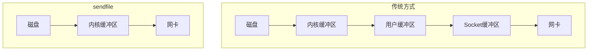
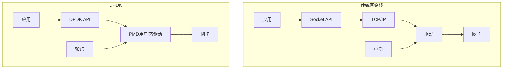
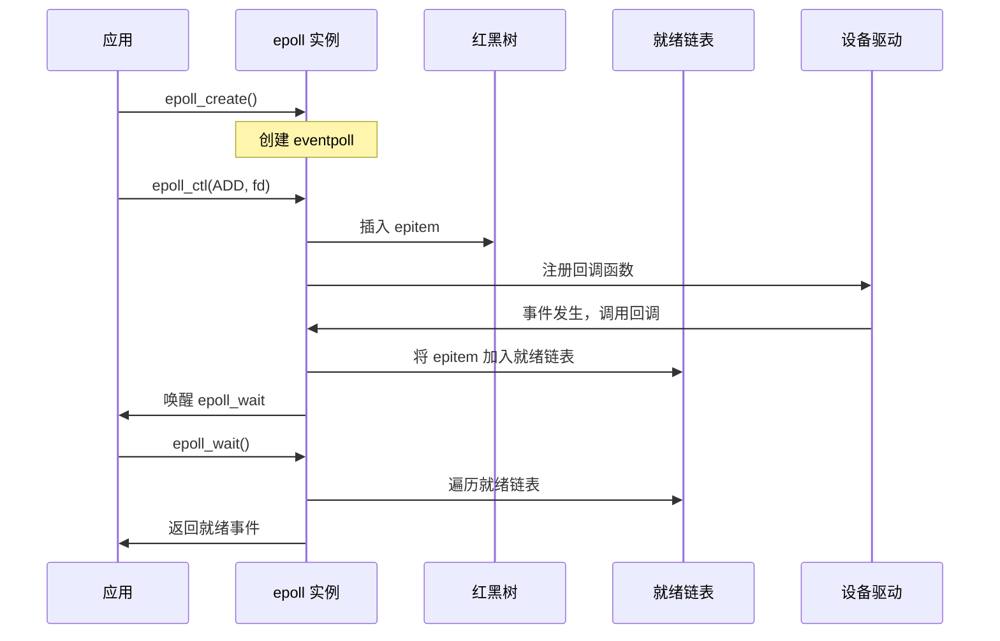
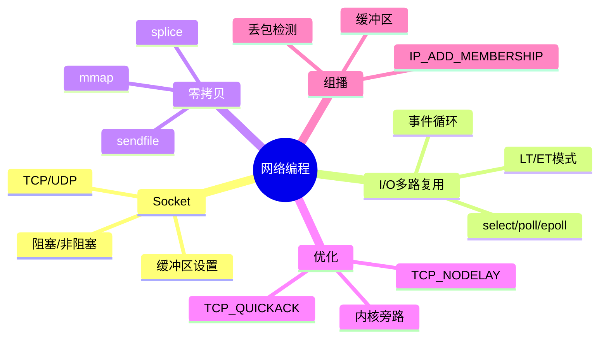

+++
title = "35. HFT笔试题-网络编程"
date = 2026-01-31
weight = 35000
description = "HFT网络编程笔试题：Socket编程、TCP/UDP优化、I/O多路复用、零拷贝、内核旁路深度解析"
[taxonomies]
tags = ["HFT", "笔试", "网络编程", "Socket", "DPDK", "零拷贝"]
+++

HFT 网络编程笔试题专题，涵盖 Socket 编程、TCP/UDP 优化、I/O 多路复用、零拷贝技术、内核旁路等高频低延迟网络技术。

<!-- more -->

## 一、选择题

### 1.1 Socket 基础 ★☆☆

**题目**：关于 TCP 和 UDP 的区别，以下说法**错误**的是：

A. TCP 是面向连接的，UDP 是无连接的  
B. TCP 保证数据顺序和可靠性，UDP 不保证  
C. UDP 的首部开销比 TCP 小  
D. TCP 的传输延迟一定比 UDP 低

<details>
<summary>查看答案与解析</summary>

**答案**：D

**解析**：
- **A 正确**：TCP 需要三次握手建立连接
- **B 正确**：TCP 有序号、确认、重传机制
- **C 正确**：UDP 首部 8 字节，TCP 首部最少 20 字节
- **D 错误**：TCP 因为重传、确认机制，延迟通常**比 UDP 高**

**HFT 场景选择**：

| 场景 | 推荐协议 | 原因 |
|------|----------|------|
| 行情接收 | UDP + 组播 | 低延迟，一对多 |
| 订单提交 | TCP | 可靠性要求高 |
| 内部通信 | UDP + 自定义可靠层 | 控制重传策略 |

</details>

---

### 1.2 epoll 机制 ★★☆

**题目**：关于 Linux epoll，以下说法**正确**的是：

A. epoll_wait 每次都需要将所有 fd 从用户态复制到内核态  
B. epoll 使用红黑树存储监控的 fd  
C. epoll 只支持水平触发（LT）模式  
D. epoll 的时间复杂度与 fd 数量成正比

<details>
<summary>查看答案与解析</summary>

**答案**：B

**解析**：
- **A 错误**：epoll 使用 `epoll_ctl` 一次性注册，不需要每次复制
- **B 正确**：内核用红黑树管理所有注册的 fd
- **C 错误**：epoll 支持 LT（水平触发）和 ET（边缘触发）两种模式
- **D 错误**：epoll 只返回就绪的 fd，时间复杂度 O(就绪数)

**epoll vs select vs poll**：

| 特性 | select | poll | epoll |
|------|--------|------|-------|
| fd 上限 | 1024 | 无限制 | 无限制 |
| fd 传递 | 每次全量 | 每次全量 | 一次注册 |
| 触发模式 | LT | LT | LT/ET |
| 时间复杂度 | O(n) | O(n) | O(就绪数) |

**epoll 核心结构**：

```c
// 创建 epoll 实例
int epfd = epoll_create1(0);

// 注册 fd（红黑树插入）
struct epoll_event ev;
ev.events = EPOLLIN | EPOLLET;  // 边缘触发
ev.data.fd = sockfd;
epoll_ctl(epfd, EPOLL_CTL_ADD, sockfd, &ev);

// 等待事件（只返回就绪的 fd）
struct epoll_event events[MAX_EVENTS];
int n = epoll_wait(epfd, events, MAX_EVENTS, timeout);
```

</details>

---

### 1.3 边缘触发与水平触发 ★★★

**题目**：使用 epoll 边缘触发（ET）模式时，以下做法**正确**的是：

A. 可以阻塞式读取数据，每次读取部分即可  
B. 必须使用非阻塞 I/O，循环读取直到 EAGAIN  
C. 每次事件到来只需读取一次  
D. 不需要处理 EAGAIN 错误

<details>
<summary>查看答案与解析</summary>

**答案**：B

**解析**：

**ET 模式特点**：
- 只在状态**变化**时触发一次
- 如果不读完数据，不会再次触发
- **必须**使用非阻塞 I/O 并循环读取

**LT vs ET**：

```
LT（水平触发）：
  数据可读 → 触发
  下次 epoll_wait 还是触发（只要还有数据）

ET（边缘触发）：
  数据从无到有 → 触发一次
  下次 epoll_wait 不触发（除非有新数据到达）
```

**ET 正确用法**：

```c
// 设置非阻塞
int flags = fcntl(fd, F_GETFL, 0);
fcntl(fd, F_SETFL, flags | O_NONBLOCK);

// ET 模式读取 - 必须循环读完
void handle_read_et(int fd) {
    char buf[4096];
    while (1) {
        ssize_t n = read(fd, buf, sizeof(buf));
        if (n == -1) {
            if (errno == EAGAIN || errno == EWOULDBLOCK) {
                // 数据读完了
                break;
            }
            // 真正的错误
            perror("read");
            break;
        } else if (n == 0) {
            // 连接关闭
            close(fd);
            break;
        }
        // 处理 n 字节数据
        process_data(buf, n);
    }
}
```

**HFT 中的选择**：
- ET 模式减少系统调用次数
- 配合非阻塞 I/O 实现高效事件循环

</details>

---

### 1.4 TCP_NODELAY ★★☆

**题目**：设置 `TCP_NODELAY` 选项的主要作用是：

A. 增加 TCP 缓冲区大小  
B. 禁用 Nagle 算法，减少小包延迟  
C. 启用 TCP 快速重传  
D. 增加 TCP 窗口大小

<details>
<summary>查看答案与解析</summary>

**答案**：B

**解析**：

**Nagle 算法**：
- 目的：减少网络中的小包数量
- 机制：等待小包累积或收到 ACK 后再发送
- 问题：增加延迟

**TCP_NODELAY**：
- 禁用 Nagle 算法
- 数据立即发送，不等待累积
- HFT 必备优化

```c
int flag = 1;
setsockopt(sockfd, IPPROTO_TCP, TCP_NODELAY, &flag, sizeof(flag));
```

**配合 TCP_QUICKACK**：

```c
// 禁用延迟确认
int quickack = 1;
setsockopt(sockfd, IPPROTO_TCP, TCP_QUICKACK, &quickack, sizeof(quickack));
```

**延迟影响**：

| 设置 | 发送延迟 | 确认延迟 |
|------|----------|----------|
| 默认 | 最多 200ms (Nagle) | 最多 40ms (Delayed ACK) |
| TCP_NODELAY | 立即 | 最多 40ms |
| 两者都设 | 立即 | 立即 |

</details>

---

### 1.5 零拷贝技术 ★★★

**题目**：以下哪个**不是**零拷贝技术？

A. sendfile()  
B. splice()  
C. mmap() + write()  
D. read() + write()

<details>
<summary>查看答案与解析</summary>

**答案**：D

**解析**：

**传统 read() + write()**：
```
磁盘 → 内核缓冲区 → 用户缓冲区 → 内核缓冲区 → 网卡
      copy1          copy2          copy3
```
4 次上下文切换，3 次数据拷贝

**零拷贝技术对比**：

| 技术 | 拷贝次数 | 上下文切换 | 场景 |
|------|----------|------------|------|
| read+write | 3 | 4 | 传统方式 |
| mmap+write | 2 | 4 | 文件映射 |
| sendfile | 1-2 | 2 | 文件→socket |
| splice | 0-1 | 2 | 管道传输 |

**sendfile 工作原理**：

```c
#include <sys/sendfile.h>

// 直接在内核态传输数据
ssize_t sendfile(int out_fd,   // 必须是 socket
                 int in_fd,    // 必须支持 mmap
                 off_t *offset,
                 size_t count);

// 示例
int file_fd = open("data.bin", O_RDONLY);
sendfile(socket_fd, file_fd, NULL, file_size);
```



</details>

---

### 1.6 DPDK 核心概念 ★★★

**题目**：关于 DPDK（Data Plane Development Kit），以下说法**错误**的是：

A. DPDK 使用用户态驱动绕过内核协议栈  
B. DPDK 使用轮询模式替代中断  
C. DPDK 需要将 CPU 核心隔离给应用独占使用  
D. DPDK 可以与内核网络栈同时使用同一网卡

<details>
<summary>查看答案与解析</summary>

**答案**：D

**解析**：
- **A 正确**：PMD（Poll Mode Driver）在用户态直接操作网卡
- **B 正确**：消除中断延迟，降低抖动
- **C 正确**：`isolcpus` 隔离 CPU，避免被调度干扰
- **D 错误**：网卡绑定到 DPDK 后，**内核不再管理该网卡**

**DPDK 核心技术**：



**DPDK 优化点**：

| 技术 | 作用 |
|------|------|
| PMD | 用户态驱动，零拷贝 |
| Huge Pages | 减少 TLB miss |
| 轮询模式 | 消除中断延迟 |
| CPU 亲和性 | 避免调度开销 |
| 无锁队列 | 多核并行 |

</details>

---

### 1.7 组播编程 ★★☆

**题目**：在 HFT 行情接收中使用 UDP 组播，以下做法**正确**的是：

A. 使用 `connect()` 建立组播连接  
B. 使用 `IP_ADD_MEMBERSHIP` 加入组播组  
C. 组播地址范围是 0.0.0.0 到 255.255.255.255  
D. 组播只能在局域网内使用

<details>
<summary>查看答案与解析</summary>

**答案**：B

**解析**：
- **A 错误**：组播使用 `setsockopt` 加入，不用 `connect`
- **B 正确**：使用 `IP_ADD_MEMBERSHIP` 告诉内核加入组播组
- **C 错误**：组播地址范围是 **224.0.0.0 - 239.255.255.255**（D类地址）
- **D 错误**：组播可以跨网络（需要路由器支持）

**组播接收示例**：

```c
#include <sys/socket.h>
#include <netinet/in.h>
#include <arpa/inet.h>

int setup_multicast_receiver(const char *group_ip, int port) {
    int sockfd = socket(AF_INET, SOCK_DGRAM, 0);
    
    // 允许地址复用
    int reuse = 1;
    setsockopt(sockfd, SOL_SOCKET, SO_REUSEADDR, &reuse, sizeof(reuse));
    
    // 绑定端口
    struct sockaddr_in addr = {0};
    addr.sin_family = AF_INET;
    addr.sin_port = htons(port);
    addr.sin_addr.s_addr = htonl(INADDR_ANY);
    bind(sockfd, (struct sockaddr*)&addr, sizeof(addr));
    
    // 加入组播组
    struct ip_mreq mreq;
    mreq.imr_multiaddr.s_addr = inet_addr(group_ip);
    mreq.imr_interface.s_addr = htonl(INADDR_ANY);
    setsockopt(sockfd, IPPROTO_IP, IP_ADD_MEMBERSHIP, &mreq, sizeof(mreq));
    
    return sockfd;
}
```

**HFT 组播优化**：

```c
// 增加接收缓冲区
int bufsize = 8 * 1024 * 1024;  // 8MB
setsockopt(sockfd, SOL_SOCKET, SO_RCVBUF, &bufsize, sizeof(bufsize));

// 设置 CPU 亲和性，固定处理核心
cpu_set_t cpuset;
CPU_ZERO(&cpuset);
CPU_SET(2, &cpuset);  // 核心 2
pthread_setaffinity_np(pthread_self(), sizeof(cpuset), &cpuset);
```

</details>

---

### 1.8 内核旁路技术 ★★★

**题目**：以下哪个**不是**内核旁路（Kernel Bypass）技术？

A. DPDK  
B. Solarflare OpenOnload  
C. io_uring  
D. Mellanox VMA

<details>
<summary>查看答案与解析</summary>

**答案**：C

**解析**：

- **DPDK**：用户态网络栈，完全旁路内核
- **Solarflare OpenOnload**：用户态 TCP/IP，部分旁路
- **io_uring**：**内核异步 I/O**，不是旁路技术
- **Mellanox VMA**：类似 OpenOnload 的用户态加速

**io_uring vs 内核旁路**：

| 技术 | 层次 | 协议栈 | 延迟 |
|------|------|--------|------|
| io_uring | 内核异步 | 内核 TCP/IP | 中等 |
| OpenOnload | 用户态 | 用户态 TCP/IP | 低 |
| DPDK | 用户态 | 自定义/无 | 最低 |

**io_uring 网络示例**（不是旁路，但高效）：

```c
#include <liburing.h>

struct io_uring ring;
io_uring_queue_init(256, &ring, 0);

// 异步接收
struct io_uring_sqe *sqe = io_uring_get_sqe(&ring);
io_uring_prep_recv(sqe, sockfd, buffer, sizeof(buffer), 0);
io_uring_sqe_set_data(sqe, (void*)RECV_OP);
io_uring_submit(&ring);

// 获取完成事件
struct io_uring_cqe *cqe;
io_uring_wait_cqe(&ring, &cqe);
```

</details>

---

## 二、填空题

### 2.1 TCP 握手延迟 ★★☆

**题目**：TCP 三次握手完成需要 _______ 个 RTT（往返时间），四次挥手完成需要 _______ 个 RTT（最少情况）。

<details>
<summary>查看答案与解析</summary>

**答案**：**1.5** 个 RTT，**2** 个 RTT

**三次握手**：
```
Client                Server
   |---- SYN ---->      (0.5 RTT)
   |<--- SYN+ACK ---    (1.0 RTT)
   |---- ACK ---->      (1.5 RTT, 握手完成)
```

**四次挥手**：
```
Client                Server
   |---- FIN ---->      (0.5 RTT)
   |<--- ACK ----       (1.0 RTT)
   |<--- FIN ----       (1.5 RTT)
   |---- ACK ---->      (2.0 RTT, 挥手完成)
```

**HFT 优化**：
- 使用长连接，避免频繁握手
- TCP Fast Open（TFO）：首次连接后可 0-RTT 建连

</details>

---

### 2.2 Socket 缓冲区 ★★☆

**题目**：Linux 默认的 TCP 发送缓冲区大小可通过 _______ 文件查看，接收缓冲区通过 _______ 文件查看。

<details>
<summary>查看答案与解析</summary>

**答案**：
- 发送缓冲区：**/proc/sys/net/ipv4/tcp_wmem**
- 接收缓冲区：**/proc/sys/net/ipv4/tcp_rmem**

**查看和设置**：

```bash
# 查看（最小值 默认值 最大值）
$ cat /proc/sys/net/ipv4/tcp_wmem
4096    16384    4194304

$ cat /proc/sys/net/ipv4/tcp_rmem
4096    87380    6291456

# 临时设置
$ echo "4096 262144 8388608" > /proc/sys/net/ipv4/tcp_rmem

# 永久设置（/etc/sysctl.conf）
net.ipv4.tcp_rmem = 4096 262144 8388608
net.ipv4.tcp_wmem = 4096 262144 8388608
```

**应用层设置**：

```c
int bufsize = 1024 * 1024;  // 1MB
setsockopt(sockfd, SOL_SOCKET, SO_RCVBUF, &bufsize, sizeof(bufsize));
setsockopt(sockfd, SOL_SOCKET, SO_SNDBUF, &bufsize, sizeof(bufsize));
```

</details>

---

### 2.3 网络延迟组成 ★★☆

**题目**：网络数据传输的总延迟 = _______ + _______ + _______ + _______。

<details>
<summary>查看答案与解析</summary>

**答案**：
**发送延迟（传输延迟）** + **传播延迟** + **排队延迟** + **处理延迟**

**各组成部分**：

| 延迟类型 | 公式/说明 | 优化方法 |
|----------|-----------|----------|
| 传输延迟 | 数据量 / 带宽 | 减少数据量，提高带宽 |
| 传播延迟 | 距离 / 光速 | 机房选址，专线 |
| 排队延迟 | 网络拥塞时 | QoS，专用通道 |
| 处理延迟 | 协议栈处理 | 内核旁路，硬件卸载 |

**HFT 场景**：
- 传播延迟：纽约-芝加哥 ~4ms，使用微波可降至 ~3.9ms
- 处理延迟：内核 ~10-50μs，DPDK ~1-5μs

</details>

---

### 2.4 文件描述符限制 ★☆☆

**题目**：Linux 单个进程默认最大打开文件数为 _______，可通过 _______ 命令查看和修改。

<details>
<summary>查看答案与解析</summary>

**答案**：**1024**，**ulimit**

```bash
# 查看当前限制
$ ulimit -n
1024

# 临时修改（当前 shell）
$ ulimit -n 65535

# 永久修改（/etc/security/limits.conf）
*    soft    nofile    65535
*    hard    nofile    65535

# 系统级别（/etc/sysctl.conf）
fs.file-max = 2097152
```

**编程中检查**：

```c
#include <sys/resource.h>

struct rlimit rlim;
getrlimit(RLIMIT_NOFILE, &rlim);
printf("soft: %lu, hard: %lu\n", rlim.rlim_cur, rlim.rlim_max);

// 设置
rlim.rlim_cur = 65535;
setrlimit(RLIMIT_NOFILE, &rlim);
```

</details>

---

## 三、简答题

### 3.1 epoll 实现原理 ★★★

**题目**：详细描述 Linux epoll 的内核实现原理，包括数据结构和事件通知机制。

<details>
<summary>查看答案与解析</summary>

**标准答案**：

**1. 核心数据结构**

```c
// epoll 实例
struct eventpoll {
    spinlock_t lock;
    struct mutex mtx;
    
    wait_queue_head_t wq;      // epoll_wait 等待队列
    wait_queue_head_t poll_wait;
    
    struct rb_root_cached rbr; // 红黑树：存储所有监控的 fd
    struct list_head rdllist;  // 就绪链表：存储就绪的 fd
    
    struct epitem *ovflist;    // 溢出链表
    struct wakeup_source *ws;
    struct user_struct *user;
    
    struct file *file;
    int visited;
    struct list_head visited_list_link;
};

// 红黑树节点
struct epitem {
    struct rb_node rbn;         // 红黑树节点
    struct list_head rdllink;   // 就绪链表节点
    struct epitem *next;
    struct epoll_filefd ffd;    // fd 信息
    int nwait;
    struct list_head pwqlist;
    struct eventpoll *ep;       // 所属 epoll
    struct list_head fllink;
    struct wakeup_source __rcu *ws;
    struct epoll_event event;   // 监控的事件
};
```

**2. 工作流程**



**3. 关键机制**

**(1) 红黑树管理 fd**
- `epoll_ctl(ADD)`：O(log n) 插入
- `epoll_ctl(DEL)`：O(log n) 删除
- `epoll_ctl(MOD)`：O(log n) 查找后修改

**(2) 回调机制**
```c
// 当 fd 有事件时，驱动调用这个回调
static int ep_poll_callback(wait_queue_entry_t *wait, 
                            unsigned mode, int sync, void *key) {
    struct epitem *epi = container_of(wait, struct epitem, wait);
    struct eventpoll *ep = epi->ep;
    
    // 将 epitem 加入就绪链表
    if (!ep_is_linked(&epi->rdllink)) {
        list_add_tail(&epi->rdllink, &ep->rdllist);
    }
    
    // 唤醒等待的进程
    if (waitqueue_active(&ep->wq)) {
        wake_up_locked(&ep->wq);
    }
    
    return 1;
}
```

**(3) 就绪链表**
- 只存储有事件的 fd
- `epoll_wait` 只需遍历就绪链表
- 时间复杂度 O(就绪数量)

**4. LT vs ET 实现差异**

```c
// epoll_wait 返回事件后
if (epi->event.events & EPOLLET) {
    // ET 模式：从就绪链表移除
    list_del_init(&epi->rdllink);
} else {
    // LT 模式：保留在就绪链表（下次还会返回）
}
```

</details>

---

### 3.2 零拷贝技术对比 ★★★

**题目**：详细比较 sendfile、splice、mmap、MSG_ZEROCOPY 等零拷贝技术的实现原理和适用场景。

<details>
<summary>查看答案与解析</summary>

**标准答案**：

**1. 传统方式分析**

```c
// 传统 read + write
char buf[8192];
read(file_fd, buf, sizeof(buf));   // 内核→用户
write(socket_fd, buf, sizeof(buf)); // 用户→内核
```

**数据流**：磁盘 → 内核缓冲 → 用户缓冲 → Socket 缓冲 → 网卡
**拷贝次数**：4 次（2 次 CPU，2 次 DMA）
**上下文切换**：4 次

---

**2. sendfile**

```c
#include <sys/sendfile.h>
sendfile(socket_fd, file_fd, &offset, count);
```

**数据流**：磁盘 → 内核缓冲 → 网卡（带 DMA gather）
**拷贝次数**：2 次（仅 DMA）
**上下文切换**：2 次

**限制**：
- 输入必须是支持 mmap 的文件
- 输出必须是 socket
- 不能修改数据

---

**3. splice**

```c
#include <fcntl.h>
int pipefd[2];
pipe(pipefd);
splice(file_fd, NULL, pipefd[1], NULL, count, SPLICE_F_MOVE);
splice(pipefd[0], NULL, socket_fd, NULL, count, SPLICE_F_MOVE);
```

**数据流**：通过管道在内核缓冲区间移动引用
**拷贝次数**：0 次（只移动页面引用）
**限制**：需要管道作为中介

---

**4. mmap + write**

```c
void *ptr = mmap(NULL, size, PROT_READ, MAP_PRIVATE, file_fd, 0);
write(socket_fd, ptr, size);
munmap(ptr, size);
```

**数据流**：磁盘 → 内核缓冲（=用户映射）→ Socket 缓冲 → 网卡
**拷贝次数**：3 次
**上下文切换**：4 次

**适用场景**：需要访问/修改数据内容

---

**5. MSG_ZEROCOPY（Linux 4.14+）**

```c
setsockopt(sockfd, SOL_SOCKET, SO_ZEROCOPY, &one, sizeof(one));
send(sockfd, buf, len, MSG_ZEROCOPY);

// 异步获取完成通知
struct sock_extended_err *serr;
recvmsg(sockfd, &msg, MSG_ERRQUEUE);
```

**特点**：
- 用户态缓冲区直接传给网卡
- 需要等待发送完成才能释放缓冲区
- 适合大数据块（>10KB）

---

**6. 对比表**

| 技术 | CPU 拷贝 | DMA 拷贝 | 场景 | 延迟 |
|------|----------|----------|------|------|
| read+write | 2 | 2 | 通用 | 高 |
| mmap+write | 1 | 2 | 需访问数据 | 中 |
| sendfile | 0 | 2 | 文件→socket | 低 |
| splice | 0 | 2 | 灵活管道 | 低 |
| MSG_ZEROCOPY | 0 | 1 | 大数据发送 | 最低 |
| DPDK | 0 | 1 | HFT | 最低 |


</details>

---

### 3.3 TCP 优化参数 ★★★

**题目**：列举 HFT 场景下需要优化的 TCP 参数及其作用。

<details>
<summary>查看答案与解析</summary>

**标准答案**：

**1. 应用层 Socket 选项**

```c
int sockfd = socket(AF_INET, SOCK_STREAM, 0);

// 1. 禁用 Nagle 算法
int nodelay = 1;
setsockopt(sockfd, IPPROTO_TCP, TCP_NODELAY, &nodelay, sizeof(nodelay));

// 2. 禁用延迟确认（需要每次 recv 后设置）
int quickack = 1;
setsockopt(sockfd, IPPROTO_TCP, TCP_QUICKACK, &quickack, sizeof(quickack));

// 3. 增加缓冲区
int bufsize = 1024 * 1024;
setsockopt(sockfd, SOL_SOCKET, SO_RCVBUF, &bufsize, sizeof(bufsize));
setsockopt(sockfd, SOL_SOCKET, SO_SNDBUF, &bufsize, sizeof(bufsize));

// 4. 启用忙轮询
int busy_poll = 50;  // 微秒
setsockopt(sockfd, SOL_SOCKET, SO_BUSY_POLL, &busy_poll, sizeof(busy_poll));

// 5. 低延迟模式
int lowat = 1;
setsockopt(sockfd, SOL_SOCKET, SO_RCVLOWAT, &lowat, sizeof(lowat));

// 6. 设置优先级
int priority = 6;
setsockopt(sockfd, SOL_SOCKET, SO_PRIORITY, &priority, sizeof(priority));
```

**2. 内核参数（sysctl）**

```bash
# /etc/sysctl.conf

# TCP 缓冲区
net.core.rmem_max = 16777216
net.core.wmem_max = 16777216
net.ipv4.tcp_rmem = 4096 87380 16777216
net.ipv4.tcp_wmem = 4096 65536 16777216

# TCP 行为
net.ipv4.tcp_low_latency = 1        # 低延迟模式
net.ipv4.tcp_timestamps = 0         # 禁用时间戳（减少头部）
net.ipv4.tcp_sack = 0               # 禁用 SACK（简化处理）

# 忙轮询
net.core.busy_read = 50
net.core.busy_poll = 50

# 连接相关
net.ipv4.tcp_fin_timeout = 15       # 加快 TIME_WAIT 回收
net.ipv4.tcp_tw_reuse = 1           # 复用 TIME_WAIT
net.core.somaxconn = 65535          # 增加连接队列
net.core.netdev_max_backlog = 65535 # 增加设备队列
```

**3. 网卡设置**

```bash
# 中断亲和性
echo 2 > /proc/irq/XX/smp_affinity

# 关闭中断合并
ethtool -C eth0 rx-usecs 0 tx-usecs 0

# 增加 Ring Buffer
ethtool -G eth0 rx 4096 tx 4096

# 启用多队列
ethtool -L eth0 combined 8

# 禁用某些卸载（调试用）
ethtool -K eth0 gro off lro off
```

**4. 参数效果对比**

| 参数 | 作用 | 延迟改善 |
|------|------|----------|
| TCP_NODELAY | 禁用 Nagle | 显著（ms→μs）|
| TCP_QUICKACK | 禁用延迟 ACK | 中等 |
| SO_BUSY_POLL | 忙轮询 | 显著 |
| 中断合并关闭 | 即时中断 | 显著 |
| 时间戳禁用 | 减少头部 | 微小 |

</details>

---

## 四、计算题

### 4.1 网络延迟计算 ★★☆

**题目**：某 HFT 系统需要从交易所获取行情并发送订单。假设：
- 交易所距离：100km（光纤）
- 光在光纤中速度：200,000 km/s
- 本地处理时间：2μs
- 交易所处理时间：5μs
- 数据包大小：100 字节
- 网络带宽：10 Gbps

计算完成一次"接收行情 → 处理 → 发送订单 → 确认"的理论最小延迟。

<details>
<summary>查看答案与解析</summary>

**答案**：

**1. 传播延迟（单程）**
```
距离 / 光速 = 100 km / 200,000 km/s = 0.5 ms = 500 μs
```

**2. 传输延迟（单个包）**
```
数据量 / 带宽 = (100 × 8 bits) / (10 × 10^9 bps)
             = 800 / 10^10 s = 0.08 μs ≈ 0.1 μs
```

**3. 完整流程**

```
行情到达：传播 500μs + 传输 0.1μs
本地处理：2μs
订单发送：传输 0.1μs + 传播 500μs
交易所处理：5μs
确认返回：传输 0.1μs + 传播 500μs

总延迟 = 500 + 0.1 + 2 + 0.1 + 500 + 5 + 0.1 + 500
       = 1507.3 μs ≈ 1.5 ms
```

**4. 延迟分解**

| 组成部分 | 延迟 | 占比 |
|----------|------|------|
| 传播延迟（3次） | 1500 μs | 99.5% |
| 传输延迟（3次） | 0.3 μs | 0.02% |
| 本地处理 | 2 μs | 0.13% |
| 交易所处理 | 5 μs | 0.33% |

**结论**：光传播延迟是主要瓶颈，这就是 HFT 公司要在交易所旁边（Colocation）的原因。

</details>

---

### 4.2 吞吐量计算 ★★☆

**题目**：使用 epoll 的网络服务器：
- 每次 `epoll_wait` 返回平均 100 个就绪 fd
- 处理每个 fd 需要 1μs
- `epoll_wait` 系统调用开销 5μs
- CPU 使用率目标 80%

计算理论最大连接处理速率（每秒处理多少个事件）。

<details>
<summary>查看答案与解析</summary>

**答案**：

**1. 单次 epoll 循环时间**
```
epoll_wait 开销 + 处理时间 = 5 + 100 × 1 = 105 μs
```

**2. 每秒循环次数**
```
1,000,000 μs / 105 μs = 9524 次/秒
```

**3. 考虑 CPU 利用率**
```
9524 × 0.8 = 7619 次/秒
```

**4. 每秒处理事件数**
```
7619 × 100 = 761,900 事件/秒 ≈ 76万 QPS
```

**优化方向**：
- 增加每次返回的就绪 fd 数（batch 处理）
- 减少 epoll_wait 调用频率
- 多线程/多核并行

</details>

---

## 五、编程题

### 5.1 高性能 TCP 服务器 ★★★

**题目**：实现一个使用 epoll ET 模式的高性能 TCP 回显服务器，支持非阻塞 I/O 和连接管理。

<details>
<summary>查看答案与解析</summary>

**参考答案**：

```c
#include <stdio.h>
#include <stdlib.h>
#include <string.h>
#include <unistd.h>
#include <fcntl.h>
#include <errno.h>
#include <sys/socket.h>
#include <sys/epoll.h>
#include <netinet/in.h>
#include <netinet/tcp.h>
#include <arpa/inet.h>

#define MAX_EVENTS 1024
#define BUFFER_SIZE 4096
#define PORT 8080

// 设置非阻塞
int set_nonblocking(int fd) {
    int flags = fcntl(fd, F_GETFL, 0);
    if (flags == -1) return -1;
    return fcntl(fd, F_SETFL, flags | O_NONBLOCK);
}

// 设置 TCP 优化选项
void set_tcp_options(int fd) {
    int opt = 1;
    
    // 禁用 Nagle
    setsockopt(fd, IPPROTO_TCP, TCP_NODELAY, &opt, sizeof(opt));
    
    // 禁用延迟 ACK
    setsockopt(fd, IPPROTO_TCP, TCP_QUICKACK, &opt, sizeof(opt));
    
    // 设置缓冲区
    int bufsize = 64 * 1024;
    setsockopt(fd, SOL_SOCKET, SO_RCVBUF, &bufsize, sizeof(bufsize));
    setsockopt(fd, SOL_SOCKET, SO_SNDBUF, &bufsize, sizeof(bufsize));
}

// 添加 fd 到 epoll
int epoll_add(int epfd, int fd, uint32_t events) {
    struct epoll_event ev;
    ev.events = events | EPOLLET;  // 边缘触发
    ev.data.fd = fd;
    return epoll_ctl(epfd, EPOLL_CTL_ADD, fd, &ev);
}

// 处理新连接
void handle_accept(int epfd, int listen_fd) {
    while (1) {
        struct sockaddr_in addr;
        socklen_t len = sizeof(addr);
        int conn_fd = accept(listen_fd, (struct sockaddr*)&addr, &len);
        
        if (conn_fd == -1) {
            if (errno == EAGAIN || errno == EWOULDBLOCK) {
                break;  // 没有更多连接
            }
            perror("accept");
            break;
        }
        
        printf("New connection: %s:%d (fd=%d)\n",
               inet_ntoa(addr.sin_addr), ntohs(addr.sin_port), conn_fd);
        
        set_nonblocking(conn_fd);
        set_tcp_options(conn_fd);
        epoll_add(epfd, conn_fd, EPOLLIN);
    }
}

// 处理客户端数据（ET 模式必须循环读完）
void handle_client(int epfd, int fd) {
    char buffer[BUFFER_SIZE];
    
    while (1) {
        ssize_t n = read(fd, buffer, sizeof(buffer));
        
        if (n == -1) {
            if (errno == EAGAIN || errno == EWOULDBLOCK) {
                break;  // 数据读完
            }
            perror("read");
            close(fd);
            return;
        }
        
        if (n == 0) {
            printf("Client disconnected (fd=%d)\n", fd);
            close(fd);
            return;
        }
        
        // 回显数据
        ssize_t sent = 0;
        while (sent < n) {
            ssize_t w = write(fd, buffer + sent, n - sent);
            if (w == -1) {
                if (errno == EAGAIN || errno == EWOULDBLOCK) {
                    // 发送缓冲区满，注册可写事件
                    struct epoll_event ev;
                    ev.events = EPOLLIN | EPOLLOUT | EPOLLET;
                    ev.data.fd = fd;
                    epoll_ctl(epfd, EPOLL_CTL_MOD, fd, &ev);
                    break;
                }
                perror("write");
                close(fd);
                return;
            }
            sent += w;
        }
        
        // 重新设置 TCP_QUICKACK（每次读后需重设）
        int opt = 1;
        setsockopt(fd, IPPROTO_TCP, TCP_QUICKACK, &opt, sizeof(opt));
    }
}

int main() {
    // 创建监听 socket
    int listen_fd = socket(AF_INET, SOCK_STREAM, 0);
    if (listen_fd == -1) {
        perror("socket");
        exit(1);
    }
    
    // 地址复用
    int opt = 1;
    setsockopt(listen_fd, SOL_SOCKET, SO_REUSEADDR, &opt, sizeof(opt));
    setsockopt(listen_fd, SOL_SOCKET, SO_REUSEPORT, &opt, sizeof(opt));
    
    // 绑定
    struct sockaddr_in addr = {0};
    addr.sin_family = AF_INET;
    addr.sin_port = htons(PORT);
    addr.sin_addr.s_addr = INADDR_ANY;
    
    if (bind(listen_fd, (struct sockaddr*)&addr, sizeof(addr)) == -1) {
        perror("bind");
        exit(1);
    }
    
    // 监听
    if (listen(listen_fd, SOMAXCONN) == -1) {
        perror("listen");
        exit(1);
    }
    
    set_nonblocking(listen_fd);
    
    // 创建 epoll
    int epfd = epoll_create1(0);
    if (epfd == -1) {
        perror("epoll_create1");
        exit(1);
    }
    
    epoll_add(epfd, listen_fd, EPOLLIN);
    
    printf("Server listening on port %d...\n", PORT);
    
    struct epoll_event events[MAX_EVENTS];
    
    while (1) {
        int n = epoll_wait(epfd, events, MAX_EVENTS, -1);
        
        for (int i = 0; i < n; i++) {
            int fd = events[i].data.fd;
            
            if (fd == listen_fd) {
                handle_accept(epfd, listen_fd);
            } else {
                if (events[i].events & (EPOLLERR | EPOLLHUP)) {
                    close(fd);
                } else if (events[i].events & EPOLLIN) {
                    handle_client(epfd, fd);
                }
            }
        }
    }
    
    close(epfd);
    close(listen_fd);
    return 0;
}
```

**编译运行**：

```bash
$ gcc -O2 -o tcp_server tcp_server.c
$ ./tcp_server

# 测试
$ nc localhost 8080
Hello
Hello
```

</details>

---

### 5.2 零拷贝文件传输 ★★★

**题目**：实现使用 sendfile 的高效文件传输服务器。

<details>
<summary>查看答案与解析</summary>

**参考答案**：

```c
#include <stdio.h>
#include <stdlib.h>
#include <string.h>
#include <unistd.h>
#include <fcntl.h>
#include <sys/socket.h>
#include <sys/sendfile.h>
#include <sys/stat.h>
#include <netinet/in.h>
#include <netinet/tcp.h>

#define PORT 8888

// 发送文件（零拷贝）
ssize_t send_file_zerocopy(int sockfd, const char *filepath) {
    int fd = open(filepath, O_RDONLY);
    if (fd == -1) {
        perror("open");
        return -1;
    }
    
    // 获取文件大小
    struct stat st;
    if (fstat(fd, &st) == -1) {
        perror("fstat");
        close(fd);
        return -1;
    }
    
    // 发送文件大小（协议头）
    uint64_t size = st.st_size;
    send(sockfd, &size, sizeof(size), 0);
    
    // 使用 sendfile 零拷贝发送
    off_t offset = 0;
    ssize_t sent = 0;
    
    while (sent < st.st_size) {
        ssize_t n = sendfile(sockfd, fd, &offset, st.st_size - sent);
        if (n == -1) {
            if (errno == EAGAIN || errno == EWOULDBLOCK) {
                continue;
            }
            perror("sendfile");
            break;
        }
        sent += n;
    }
    
    close(fd);
    printf("Sent %zd bytes using sendfile (zero-copy)\n", sent);
    return sent;
}

// 传统方式发送（对比用）
ssize_t send_file_traditional(int sockfd, const char *filepath) {
    int fd = open(filepath, O_RDONLY);
    if (fd == -1) return -1;
    
    struct stat st;
    fstat(fd, &st);
    
    uint64_t size = st.st_size;
    send(sockfd, &size, sizeof(size), 0);
    
    char buffer[65536];
    ssize_t total = 0;
    ssize_t n;
    
    while ((n = read(fd, buffer, sizeof(buffer))) > 0) {
        ssize_t sent = 0;
        while (sent < n) {
            ssize_t w = write(sockfd, buffer + sent, n - sent);
            if (w <= 0) break;
            sent += w;
        }
        total += sent;
    }
    
    close(fd);
    printf("Sent %zd bytes using read+write\n", total);
    return total;
}

// 使用 splice 的零拷贝（更灵活）
ssize_t send_file_splice(int sockfd, const char *filepath) {
    int fd = open(filepath, O_RDONLY);
    if (fd == -1) return -1;
    
    struct stat st;
    fstat(fd, &st);
    
    uint64_t size = st.st_size;
    send(sockfd, &size, sizeof(size), 0);
    
    int pipefd[2];
    pipe(pipefd);
    
    ssize_t total = 0;
    
    while (total < st.st_size) {
        // 文件 → 管道
        ssize_t n = splice(fd, NULL, pipefd[1], NULL,
                          65536, SPLICE_F_MOVE | SPLICE_F_MORE);
        if (n <= 0) break;
        
        // 管道 → socket
        ssize_t sent = splice(pipefd[0], NULL, sockfd, NULL,
                             n, SPLICE_F_MOVE | SPLICE_F_MORE);
        if (sent <= 0) break;
        
        total += sent;
    }
    
    close(pipefd[0]);
    close(pipefd[1]);
    close(fd);
    
    printf("Sent %zd bytes using splice (zero-copy)\n", total);
    return total;
}

int main(int argc, char *argv[]) {
    if (argc < 2) {
        fprintf(stderr, "Usage: %s <file>\n", argv[0]);
        exit(1);
    }
    
    int listen_fd = socket(AF_INET, SOCK_STREAM, 0);
    
    int opt = 1;
    setsockopt(listen_fd, SOL_SOCKET, SO_REUSEADDR, &opt, sizeof(opt));
    setsockopt(listen_fd, IPPROTO_TCP, TCP_NODELAY, &opt, sizeof(opt));
    
    struct sockaddr_in addr = {
        .sin_family = AF_INET,
        .sin_port = htons(PORT),
        .sin_addr.s_addr = INADDR_ANY
    };
    
    bind(listen_fd, (struct sockaddr*)&addr, sizeof(addr));
    listen(listen_fd, 5);
    
    printf("File server listening on port %d\n", PORT);
    printf("File to serve: %s\n", argv[1]);
    
    while (1) {
        int client_fd = accept(listen_fd, NULL, NULL);
        if (client_fd == -1) continue;
        
        printf("\nClient connected\n");
        
        // 使用零拷贝发送
        send_file_zerocopy(client_fd, argv[1]);
        
        close(client_fd);
    }
    
    close(listen_fd);
    return 0;
}
```

**性能对比测试**：

```c
#include <time.h>

void benchmark(const char *method, 
               ssize_t (*func)(int, const char*),
               int sockfd, const char *file) {
    struct timespec start, end;
    clock_gettime(CLOCK_MONOTONIC, &start);
    
    ssize_t sent = func(sockfd, file);
    
    clock_gettime(CLOCK_MONOTONIC, &end);
    
    double elapsed = (end.tv_sec - start.tv_sec) + 
                    (end.tv_nsec - start.tv_nsec) / 1e9;
    double throughput = sent / elapsed / (1024*1024);
    
    printf("%s: %.3f MB in %.3f ms (%.1f MB/s)\n",
           method, sent/(1024.0*1024), elapsed*1000, throughput);
}
```

</details>

---

### 5.3 UDP 组播接收器 ★★☆

**题目**：实现一个高性能的 UDP 组播行情接收器，包含丢包检测。

<details>
<summary>查看答案与解析</summary>

**参考答案**：

```c
#include <stdio.h>
#include <stdlib.h>
#include <string.h>
#include <unistd.h>
#include <sys/socket.h>
#include <netinet/in.h>
#include <arpa/inet.h>
#include <pthread.h>
#include <stdatomic.h>

#define MULTICAST_GROUP "239.1.1.1"
#define MULTICAST_PORT 5000
#define BUFFER_SIZE 1500

// 行情数据结构
typedef struct {
    uint32_t seq_num;       // 序列号
    uint64_t timestamp;     // 时间戳
    char symbol[8];         // 股票代码
    uint32_t price;         // 价格（分）
    uint32_t volume;        // 成交量
} __attribute__((packed)) MarketData;

// 统计信息
typedef struct {
    atomic_uint_fast64_t packets_received;
    atomic_uint_fast64_t packets_lost;
    atomic_uint_fast64_t bytes_received;
    uint32_t last_seq_num;
} Stats;

Stats stats = {0};

// 设置 CPU 亲和性
void set_cpu_affinity(int cpu) {
    cpu_set_t cpuset;
    CPU_ZERO(&cpuset);
    CPU_SET(cpu, &cpuset);
    pthread_setaffinity_np(pthread_self(), sizeof(cpuset), &cpuset);
}

// 初始化组播接收器
int init_multicast_receiver(const char *group, int port, const char *iface) {
    int sockfd = socket(AF_INET, SOCK_DGRAM, 0);
    if (sockfd < 0) {
        perror("socket");
        return -1;
    }
    
    // 允许地址复用
    int reuse = 1;
    setsockopt(sockfd, SOL_SOCKET, SO_REUSEADDR, &reuse, sizeof(reuse));
    
    // 增加接收缓冲区
    int bufsize = 16 * 1024 * 1024;  // 16MB
    setsockopt(sockfd, SOL_SOCKET, SO_RCVBUF, &bufsize, sizeof(bufsize));
    
    // 绑定端口
    struct sockaddr_in addr = {0};
    addr.sin_family = AF_INET;
    addr.sin_port = htons(port);
    addr.sin_addr.s_addr = htonl(INADDR_ANY);
    
    if (bind(sockfd, (struct sockaddr*)&addr, sizeof(addr)) < 0) {
        perror("bind");
        close(sockfd);
        return -1;
    }
    
    // 加入组播组
    struct ip_mreq mreq;
    mreq.imr_multiaddr.s_addr = inet_addr(group);
    mreq.imr_interface.s_addr = htonl(INADDR_ANY);
    
    if (setsockopt(sockfd, IPPROTO_IP, IP_ADD_MEMBERSHIP, 
                   &mreq, sizeof(mreq)) < 0) {
        perror("IP_ADD_MEMBERSHIP");
        close(sockfd);
        return -1;
    }
    
    printf("Joined multicast group %s:%d\n", group, port);
    return sockfd;
}

// 处理行情数据
void process_market_data(const MarketData *data) {
    // 检查序列号，检测丢包
    uint32_t expected = stats.last_seq_num + 1;
    if (data->seq_num != expected && stats.last_seq_num != 0) {
        uint32_t lost = data->seq_num - expected;
        atomic_fetch_add(&stats.packets_lost, lost);
        printf("Lost %u packets (seq %u -> %u)\n", 
               lost, stats.last_seq_num, data->seq_num);
    }
    stats.last_seq_num = data->seq_num;
    
    // 处理数据（这里只打印）
    #if 0
    printf("SEQ=%u SYMBOL=%.8s PRICE=%u.%02u VOL=%u\n",
           data->seq_num, data->symbol,
           data->price / 100, data->price % 100,
           data->volume);
    #endif
}

// 统计线程
void *stats_thread(void *arg) {
    while (1) {
        sleep(1);
        
        uint64_t recv = atomic_load(&stats.packets_received);
        uint64_t lost = atomic_load(&stats.packets_lost);
        uint64_t bytes = atomic_load(&stats.bytes_received);
        
        double loss_rate = (recv + lost) > 0 ? 
                          (double)lost / (recv + lost) * 100 : 0;
        
        printf("Stats: recv=%lu lost=%lu (%.2f%%) bytes=%lu MB/s=%.2f\n",
               recv, lost, loss_rate, bytes, bytes / 1024.0 / 1024);
        
        // 重置字节计数
        atomic_store(&stats.bytes_received, 0);
    }
    return NULL;
}

int main() {
    // 设置 CPU 亲和性
    set_cpu_affinity(2);
    
    int sockfd = init_multicast_receiver(MULTICAST_GROUP, MULTICAST_PORT, NULL);
    if (sockfd < 0) {
        exit(1);
    }
    
    // 启动统计线程
    pthread_t tid;
    pthread_create(&tid, NULL, stats_thread, NULL);
    
    char buffer[BUFFER_SIZE];
    
    printf("Waiting for multicast data...\n");
    
    while (1) {
        ssize_t n = recv(sockfd, buffer, sizeof(buffer), 0);
        
        if (n < 0) {
            perror("recv");
            continue;
        }
        
        atomic_fetch_add(&stats.packets_received, 1);
        atomic_fetch_add(&stats.bytes_received, n);
        
        if (n >= sizeof(MarketData)) {
            process_market_data((MarketData*)buffer);
        }
    }
    
    close(sockfd);
    return 0;
}
```

**编译运行**：

```bash
$ gcc -O2 -o multicast_recv multicast_recv.c -lpthread
$ ./multicast_recv
```

</details>

---

## 六、Bug 分析题

### 6.1 epoll ET 模式 Bug ★★★

**题目**：以下使用 epoll ET 模式的代码有问题，请找出并修复：

```c
void handle_read(int fd) {
    char buffer[1024];
    ssize_t n = read(fd, buffer, sizeof(buffer));
    if (n > 0) {
        process(buffer, n);
    }
}
```

<details>
<summary>查看答案与解析</summary>

**问题分析**：

1. **只读取一次**：ET 模式要求读完所有数据
2. **未使用非阻塞 I/O**：可能阻塞在 read 上
3. **未处理 EAGAIN**：不知道何时数据读完
4. **未处理连接关闭**：n == 0 时应关闭 fd

**修复代码**：

```c
#include <errno.h>
#include <fcntl.h>

// 确保 fd 是非阻塞的
int set_nonblocking(int fd) {
    int flags = fcntl(fd, F_GETFL, 0);
    return fcntl(fd, F_SETFL, flags | O_NONBLOCK);
}

void handle_read_et(int epfd, int fd) {
    char buffer[4096];
    
    while (1) {  // 循环读取直到 EAGAIN
        ssize_t n = read(fd, buffer, sizeof(buffer));
        
        if (n > 0) {
            process(buffer, n);
            continue;  // 继续读取
        }
        
        if (n == 0) {
            // 连接关闭
            printf("Connection closed (fd=%d)\n", fd);
            close(fd);
            return;
        }
        
        // n == -1
        if (errno == EAGAIN || errno == EWOULDBLOCK) {
            // 数据已读完，正常退出循环
            break;
        }
        
        // 真正的错误
        perror("read");
        close(fd);
        return;
    }
}
```

**关键修复点**：

| 问题 | 修复方法 |
|------|----------|
| 只读一次 | while 循环读取 |
| 阻塞 I/O | 设置 O_NONBLOCK |
| 未处理 EAGAIN | 检查 errno 退出循环 |
| 未处理关闭 | n == 0 时 close(fd) |

</details>

---

## 高频考点总结

### 网络编程核心知识



### 关键系统调用

| 调用 | 作用 | HFT 用途 |
|------|------|----------|
| epoll_create/ctl/wait | I/O 多路复用 | 高并发连接 |
| sendfile | 零拷贝传输 | 减少延迟 |
| setsockopt | Socket 选项 | 参数优化 |
| mmap | 内存映射 | 共享内存 IPC |

---

## 导航

- [上一篇：HFT面试题-网络优化](@/articles/hft/hft-34-HFT面试题-网络优化.md)
- [下一篇：HFT笔试题-SIMD与向量化](@/articles/hft/hft-36-HFT笔试题-SIMD与向量化.md)
