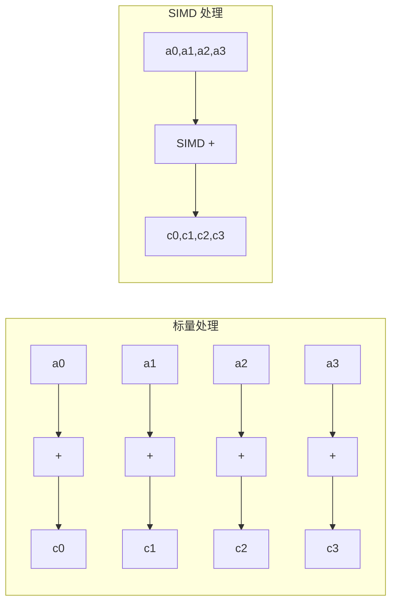
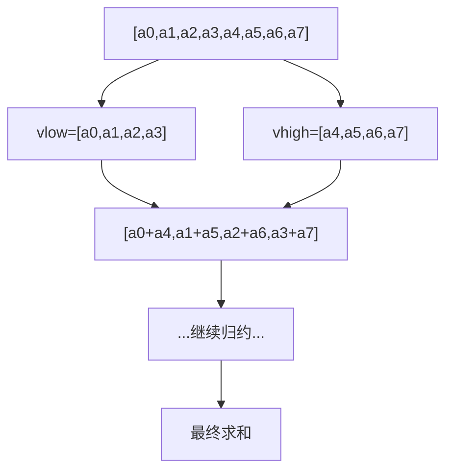
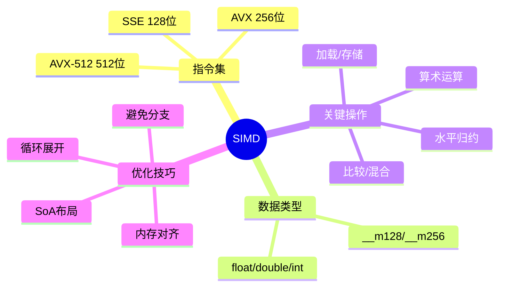

+++
title = "36.HFT笔试题-SIMD与向量化"
date = 2026-01-31
description = "HFT SIMD与向量化笔试题：SSE/AVX指令集、内存对齐、向量化计算、编译器自动向量化深度解析"
[taxonomies]
tags = ["HFT", "笔试", "SIMD", "AVX", "向量化", "性能优化"]
+++

HFT SIMD 与向量化笔试题专题，涵盖 SSE/AVX 指令集、内存对齐、向量化计算、编译器自动向量化等高性能计算技术。

<!-- more -->

## 一、选择题

### 1.1 SIMD 基础概念 ★☆☆

**题目**：SIMD 的含义是：

A. Single Instruction, Multiple Data（单指令多数据）  
B. Single Instruction, Multiple Devices  
C. Sequential Instruction, Multiple Data  
D. Shared Instruction, Multiple Data

<details>
<summary>查看答案与解析</summary>

**答案**：A

**解析**：
SIMD = **Single Instruction, Multiple Data**（单指令多数据）

**SIMD 工作原理**：

```
传统标量操作（逐个处理）：
  a[0] + b[0] → c[0]
  a[1] + b[1] → c[1]
  a[2] + b[2] → c[2]
  a[3] + b[3] → c[3]
  （4条指令）

SIMD 向量操作（并行处理）：
  [a[0], a[1], a[2], a[3]] + [b[0], b[1], b[2], b[3]]
  = [c[0], c[1], c[2], c[3]]
  （1条指令）
```



</details>

---

### 1.2 x86 SIMD 指令集 ★★☆

**题目**：关于 x86 架构的 SIMD 指令集，以下说法**正确**的是：

A. SSE 使用 256 位寄存器  
B. AVX 使用 128 位寄存器  
C. AVX-512 使用 512 位寄存器  
D. MMX 使用 256 位寄存器

<details>
<summary>查看答案与解析</summary>

**答案**：C

**解析**：

| 指令集 | 寄存器宽度 | 寄存器数量 | 单精度浮点数/次 |
|--------|------------|------------|-----------------|
| MMX | 64 位 | 8 个 (mm0-mm7) | - |
| SSE | 128 位 | 8 个 (xmm0-xmm7) | 4 个 |
| AVX | 256 位 | 16 个 (ymm0-ymm15) | 8 个 |
| AVX-512 | 512 位 | 32 个 (zmm0-zmm31) | 16 个 |

**寄存器示意**：

```
SSE (128位 xmm):
┌───────┬───────┬───────┬───────┐
│ float │ float │ float │ float │  (4 × 32位)
└───────┴───────┴───────┴───────┘

AVX (256位 ymm):
┌───────┬───────┬───────┬───────┬───────┬───────┬───────┬───────┐
│ float │ float │ float │ float │ float │ float │ float │ float │  (8 × 32位)
└───────┴───────┴───────┴───────┴───────┴───────┴───────┴───────┘

AVX-512 (512位 zmm):
┌───────────────────────────────────────────────────────────────┐
│               16 × float (32位)                               │
└───────────────────────────────────────────────────────────────┘
```

</details>

---

### 1.3 内存对齐要求 ★★☆

**题目**：使用 AVX 指令 `_mm256_load_ps` 加载数据时，内存地址必须：

A. 16 字节对齐  
B. 32 字节对齐  
C. 64 字节对齐  
D. 无对齐要求

<details>
<summary>查看答案与解析</summary>

**答案**：B

**解析**：

| 指令集 | load 对齐要求 | loadu（非对齐）|
|--------|---------------|----------------|
| SSE | 16 字节 | 可用但较慢 |
| AVX | 32 字节 | 可用但较慢 |
| AVX-512 | 64 字节 | 可用但较慢 |

**对齐加载 vs 非对齐加载**：

```c
#include <immintrin.h>

void example() {
    // 对齐加载（快，地址必须 32 字节对齐）
    alignas(32) float data[8];
    __m256 v1 = _mm256_load_ps(data);
    
    // 非对齐加载（稍慢，任意地址）
    float data2[8];
    __m256 v2 = _mm256_loadu_ps(data2);
}
```

**确保对齐的方法**：

```c
// 方法1：C11 alignas
alignas(32) float arr[1024];

// 方法2：编译器扩展
float arr[1024] __attribute__((aligned(32)));

// 方法3：动态分配
float *arr = aligned_alloc(32, 1024 * sizeof(float));
```

</details>

---

### 1.4 向量化性能 ★★☆

**题目**：使用 AVX2 对 8 个单精度浮点数进行加法运算，理论上比标量运算快：

A. 2 倍  
B. 4 倍  
C. 8 倍  
D. 16 倍

<details>
<summary>查看答案与解析</summary>

**答案**：C

**解析**：

AVX2 使用 256 位寄存器：
- 单精度浮点数：32 位
- 每次处理：256 / 32 = **8 个**

理论加速比 = 8 倍

**实际加速考虑**：
- 内存带宽限制
- 对齐开销
- 循环开销
- 数据依赖

**实际测试示例**：

```c
#include <immintrin.h>
#include <stdio.h>
#include <time.h>

#define N (1024 * 1024 * 64)

void scalar_add(float *a, float *b, float *c, int n) {
    for (int i = 0; i < n; i++) {
        c[i] = a[i] + b[i];
    }
}

void avx_add(float *a, float *b, float *c, int n) {
    for (int i = 0; i < n; i += 8) {
        __m256 va = _mm256_load_ps(&a[i]);
        __m256 vb = _mm256_load_ps(&b[i]);
        __m256 vc = _mm256_add_ps(va, vb);
        _mm256_store_ps(&c[i], vc);
    }
}

// 实际加速约 5-7 倍（受内存带宽限制）
```

</details>

---

### 1.5 编译器自动向量化 ★★☆

**题目**：以下哪个因素**不会**阻止编译器自动向量化？

A. 循环中存在数据依赖  
B. 循环次数未知  
C. 数组元素是连续访问的  
D. 循环中有函数调用

<details>
<summary>查看答案与解析</summary>

**答案**：C

**解析**：

**有利于向量化的因素**：
- ✅ 连续内存访问
- ✅ 简单循环结构
- ✅ 已知循环次数（有时可以）
- ✅ 无数据依赖

**阻止向量化的因素**：
- ❌ 数据依赖（当前迭代依赖前一迭代）
- ❌ 非连续访问（散乱访问）
- ❌ 函数调用（除非内联）
- ❌ 复杂控制流
- ❌ 指针别名

**示例**：

```c
// ✅ 可以向量化
for (int i = 0; i < n; i++) {
    c[i] = a[i] + b[i];  // 无依赖，连续访问
}

// ❌ 不能向量化（依赖前一迭代）
for (int i = 1; i < n; i++) {
    a[i] = a[i-1] + b[i];  // a[i] 依赖 a[i-1]
}

// ❌ 不能向量化（函数调用）
for (int i = 0; i < n; i++) {
    c[i] = complex_function(a[i], b[i]);
}
```

**编译器选项**：

```bash
# GCC
gcc -O3 -ffast-math -march=native -fopt-info-vec

# 查看向量化报告
gcc -O3 -fopt-info-vec-optimized   # 成功向量化的循环
gcc -O3 -fopt-info-vec-missed      # 未能向量化的循环
```

</details>

---

### 1.6 SIMD 数据类型 ★★☆

**题目**：以下 SIMD 类型中，哪个用于存储 4 个双精度浮点数？

A. `__m128`  
B. `__m256`  
C. `__m256d`  
D. `__m256i`

<details>
<summary>查看答案与解析</summary>

**答案**：C

**解析**：

| 类型 | 宽度 | 用途 |
|------|------|------|
| `__m128` | 128 位 | 4 × float |
| `__m128d` | 128 位 | 2 × double |
| `__m128i` | 128 位 | 整数（各种宽度）|
| `__m256` | 256 位 | 8 × float |
| `__m256d` | 256 位 | **4 × double** |
| `__m256i` | 256 位 | 整数（各种宽度）|
| `__m512` | 512 位 | 16 × float |
| `__m512d` | 512 位 | 8 × double |
| `__m512i` | 512 位 | 整数（各种宽度）|

**后缀说明**：
- 无后缀：单精度浮点（float）
- `d` 后缀：双精度浮点（double）
- `i` 后缀：整数

</details>

---

### 1.7 水平操作 ★★★

**题目**：计算一个 `__m256` 向量中所有 8 个 float 元素之和，以下代码的作用是：

```c
__m256 v = ...;
__m128 vlow = _mm256_castps256_ps128(v);
__m128 vhigh = _mm256_extractf128_ps(v, 1);
vlow = _mm_add_ps(vlow, vhigh);
```

A. 将高 128 位设为 0  
B. 将向量中的 8 个元素归约到 4 个  
C. 复制向量  
D. 求所有元素平均值

<details>
<summary>查看答案与解析</summary>

**答案**：B

**解析**：

这是水平归约（horizontal reduction）的第一步。

```
原始向量（8个float）：
[a0, a1, a2, a3, a4, a5, a6, a7]
     └── vlow ──┘  └── vhigh ─┘

加法后（4个float）：
[a0+a4, a1+a5, a2+a6, a3+a7]
```

**完整的求和代码**：

```c
float hsum_avx(__m256 v) {
    // 步骤1：256 → 128（高低相加）
    __m128 vlow = _mm256_castps256_ps128(v);
    __m128 vhigh = _mm256_extractf128_ps(v, 1);
    vlow = _mm_add_ps(vlow, vhigh);  // 4个元素
    
    // 步骤2：128 水平加法
    __m128 shuf = _mm_movehdup_ps(vlow);  // 复制高位
    vlow = _mm_add_ps(vlow, shuf);        // 2个元素
    shuf = _mm_movehl_ps(shuf, vlow);     // 高位移到低位
    vlow = _mm_add_ss(vlow, shuf);        // 1个元素
    
    return _mm_cvtss_f32(vlow);
}
```



</details>

---

### 1.8 向量化障碍 ★★★

**题目**：以下循环为什么无法被向量化？如何修改使其可以向量化？

```c
void compute(float *a, float *b, int n) {
    for (int i = 0; i < n; i++) {
        a[i] = a[i] + b[i];
    }
}
```

A. 可以向量化，无需修改  
B. 存在指针别名问题，需添加 `restrict`  
C. 数据类型不支持  
D. 循环次数未知

<details>
<summary>查看答案与解析</summary>

**答案**：B

**解析**：

**问题**：编译器无法确定 `a` 和 `b` 是否重叠（指针别名）

```c
// 如果调用时：a = &arr[0], b = &arr[1]
// 那么 a[1] = a[1] + b[1] = a[1] + a[2]
// 存在依赖，不能向量化
```

**修复方法**：使用 `restrict` 关键字

```c
void compute(float * restrict a, float * restrict b, int n) {
    for (int i = 0; i < n; i++) {
        a[i] = a[i] + b[i];
    }
}
```

`restrict` 告诉编译器：通过此指针访问的内存不会与其他指针重叠。

**其他帮助向量化的提示**：

```c
// 方法1：restrict 关键字
void func(float * restrict a, float * restrict b, int n);

// 方法2：编译器指令
#pragma omp simd
for (int i = 0; i < n; i++) { ... }

// 方法3：GCC ivdep（忽略向量依赖）
#pragma GCC ivdep
for (int i = 0; i < n; i++) { ... }

// 方法4：显式告知对齐
float *a = __builtin_assume_aligned(ptr, 32);
```

</details>

---

## 二、填空题

### 2.1 SIMD 寄存器 ★☆☆

**题目**：AVX 指令集使用 _______ 位宽的 YMM 寄存器，一次可以处理 _______ 个单精度浮点数或 _______ 个双精度浮点数。

<details>
<summary>查看答案与解析</summary>

**答案**：**256** 位，**8** 个单精度，**4** 个双精度

**计算**：
- 单精度 float：32 位，256 / 32 = 8 个
- 双精度 double：64 位，256 / 64 = 4 个

</details>

---

### 2.2 对齐分配 ★★☆

**题目**：在 C11 中，使用 _______ 关键字声明 32 字节对齐的数组，使用 _______ 函数动态分配对齐内存。

<details>
<summary>查看答案与解析</summary>

**答案**：**alignas(32)**，**aligned_alloc**

```c
#include <stdlib.h>
#include <stdalign.h>

// 静态对齐
alignas(32) float arr[1024];

// 动态对齐
float *ptr = aligned_alloc(32, 1024 * sizeof(float));
// 注意：size 必须是 alignment 的倍数

// 释放
free(ptr);
```

**其他方法**：

```c
// POSIX
int posix_memalign(void **memptr, size_t alignment, size_t size);

// Windows
void *_aligned_malloc(size_t size, size_t alignment);
void _aligned_free(void *memblock);

// Intel 扩展
void *_mm_malloc(size_t size, size_t alignment);
void _mm_free(void *p);
```

</details>

---

### 2.3 向量化编译选项 ★★☆

**题目**：使用 GCC 编译器启用 AVX2 指令集的选项是 _______，查看向量化成功信息的选项是 _______。

<details>
<summary>查看答案与解析</summary>

**答案**：**-mavx2**，**-fopt-info-vec-optimized**

**完整编译命令**：

```bash
# 启用 AVX2
gcc -O3 -mavx2 -o program program.c

# 自动检测 CPU 支持的最高指令集
gcc -O3 -march=native -o program program.c

# 查看向量化报告
gcc -O3 -mavx2 -fopt-info-vec-all source.c
#   -fopt-info-vec-optimized  # 成功向量化
#   -fopt-info-vec-missed     # 未能向量化
#   -fopt-info-vec-all        # 所有信息
```

**常用指令集选项**：

| 选项 | 启用指令集 |
|------|------------|
| -msse4.2 | SSE 4.2 |
| -mavx | AVX |
| -mavx2 | AVX2 |
| -mavx512f | AVX-512 Foundation |
| -march=native | 当前 CPU 所有支持 |

</details>

---

### 2.4 Intrinsic 函数 ★★☆

**题目**：`_mm256_fmadd_ps(a, b, c)` 计算的是 _______（用数学表达式表示）。

<details>
<summary>查看答案与解析</summary>

**答案**：**a × b + c**（Fused Multiply-Add）

**FMA 指令优势**：
1. 一条指令完成乘加
2. 中间结果不舍入，精度更高
3. 延迟比分开执行低

```c
#include <immintrin.h>

// FMA: result = a * b + c
__m256 fma_example(__m256 a, __m256 b, __m256 c) {
    return _mm256_fmadd_ps(a, b, c);  // a*b + c
}

// 其他 FMA 变体
// _mm256_fmsub_ps(a, b, c)  → a*b - c
// _mm256_fnmadd_ps(a, b, c) → -(a*b) + c = c - a*b
// _mm256_fnmsub_ps(a, b, c) → -(a*b) - c = -a*b - c
```

</details>

---

## 三、简答题

### 3.1 SIMD 优化策略 ★★★

**题目**：描述将标量代码转换为 SIMD 向量化代码的一般步骤和注意事项。

<details>
<summary>查看答案与解析</summary>

**标准答案**：

**1. 分析可向量化性**

```c
// 检查清单：
// □ 循环是否有数据依赖？
// □ 内存访问是否连续？
// □ 循环体是否有分支？
// □ 是否有函数调用？
// □ 数据是否对齐？
```

**2. 数据布局优化**

```c
// 不良布局（AoS - Array of Structures）
struct Particle {
    float x, y, z;
    float vx, vy, vz;
};
Particle particles[1000];

// 良好布局（SoA - Structure of Arrays）
struct Particles {
    float x[1000];
    float y[1000];
    float z[1000];
    float vx[1000];
    float vy[1000];
    float vz[1000];
};
```

**3. 内存对齐**

```c
// 确保对齐
alignas(32) float data[1024];

// 动态分配
float *data = aligned_alloc(32, n * sizeof(float));

// 处理尾部（不能整除 8 的情况）
int simd_end = (n / 8) * 8;
for (int i = 0; i < simd_end; i += 8) {
    // SIMD 处理
}
for (int i = simd_end; i < n; i++) {
    // 标量处理剩余
}
```

**4. 选择合适的指令**

```c
#include <immintrin.h>

void vector_add(const float *a, const float *b, float *c, int n) {
    int i = 0;
    
    // AVX 主循环（8 个一组）
    for (; i + 7 < n; i += 8) {
        __m256 va = _mm256_load_ps(&a[i]);
        __m256 vb = _mm256_load_ps(&b[i]);
        __m256 vc = _mm256_add_ps(va, vb);
        _mm256_store_ps(&c[i], vc);
    }
    
    // 标量处理剩余
    for (; i < n; i++) {
        c[i] = a[i] + b[i];
    }
}
```

**5. 优化水平操作**

```c
// 避免频繁水平操作
// 不好：每次迭代都求和
for (int i = 0; i < n; i++) {
    sum += hsum(compute(data[i]));  // 每次水平求和
}

// 好：先向量累加，最后求和
__m256 vsum = _mm256_setzero_ps();
for (int i = 0; i < n; i += 8) {
    vsum = _mm256_add_ps(vsum, compute(&data[i]));
}
float sum = hsum(vsum);  // 只在最后求和
```

**6. 注意事项总结**

| 方面 | 建议 |
|------|------|
| 数据布局 | SoA 优于 AoS |
| 内存对齐 | 32/64 字节对齐 |
| 循环结构 | 简单，无分支 |
| 尾部处理 | 标量处理剩余 |
| 水平操作 | 尽量避免或延迟 |
| 测试验证 | 与标量版本对比 |

</details>

---

### 3.2 AoS vs SoA ★★★

**题目**：解释 AoS（Array of Structures）和 SoA（Structure of Arrays）数据布局的区别，以及在 SIMD 编程中为什么 SoA 更优。

<details>
<summary>查看答案与解析</summary>

**标准答案**：

**1. 布局对比**

```c
// AoS (Array of Structures)
struct ParticleAoS {
    float x, y, z;
    float vx, vy, vz;
};
ParticleAoS particles[N];  // [x0,y0,z0,vx0,vy0,vz0, x1,y1,z1,vx1,vy1,vz1, ...]

// SoA (Structure of Arrays)
struct ParticlesSoA {
    float x[N];
    float y[N];
    float z[N];
    float vx[N];
    float vy[N];
    float vz[N];
};
ParticlesSoA particles;  // [x0,x1,x2,...], [y0,y1,y2,...], ...
```

**2. 内存布局可视化**

```
AoS 内存布局：
┌────┬────┬────┬────┬────┬────┐┌────┬────┬────┬────┬────┬────┐
│ x0 │ y0 │ z0 │vx0 │vy0 │vz0 ││ x1 │ y1 │ z1 │vx1 │vy1 │vz1 │...
└────┴────┴────┴────┴────┴────┘└────┴────┴────┴────┴────┴────┘
         粒子 0                          粒子 1

SoA 内存布局：
x:  ┌────┬────┬────┬────┬────┬────┬────┬────┐
    │ x0 │ x1 │ x2 │ x3 │ x4 │ x5 │ x6 │ x7 │...
    └────┴────┴────┴────┴────┴────┴────┴────┘
y:  ┌────┬────┬────┬────┬────┬────┬────┬────┐
    │ y0 │ y1 │ y2 │ y3 │ y4 │ y5 │ y6 │ y7 │...
    └────┴────┴────┴────┴────┴────┴────┴────┘
```

**3. SIMD 加载对比**

```c
// 更新所有粒子的 x 坐标：x += vx * dt

// AoS：需要 gather 操作（散乱加载）
// 加载 x0, x1, x2, x3, x4, x5, x6, x7 需要跳跃访问
// 步长 = sizeof(ParticleAoS) = 24 bytes
// 非连续，效率低

// SoA：连续加载
__m256 vx = _mm256_load_ps(&particles.x[i]);    // 连续 8 个 x
__m256 vvx = _mm256_load_ps(&particles.vx[i]);  // 连续 8 个 vx
__m256 vdt = _mm256_set1_ps(dt);
vx = _mm256_fmadd_ps(vvx, vdt, vx);             // x = vx * dt + x
_mm256_store_ps(&particles.x[i], vx);
```

**4. 性能对比**

| 方面 | AoS | SoA |
|------|-----|-----|
| SIMD 加载 | 需要 gather（慢） | 连续 load（快） |
| 缓存利用 | 可能浪费（加载不需要的字段） | 高效（只加载需要的） |
| 代码复杂度 | 简单 | 稍复杂 |
| 单对象访问 | 快（局部性好） | 慢（多次内存访问） |

**5. 代码示例**

```c
#include <immintrin.h>

// SoA 结构
typedef struct {
    alignas(32) float x[1024];
    alignas(32) float y[1024];
    alignas(32) float z[1024];
    alignas(32) float vx[1024];
    alignas(32) float vy[1024];
    alignas(32) float vz[1024];
} Particles;

// SIMD 更新位置
void update_positions_simd(Particles *p, float dt, int n) {
    __m256 vdt = _mm256_set1_ps(dt);
    
    for (int i = 0; i < n; i += 8) {
        // 加载（连续，高效）
        __m256 vx = _mm256_load_ps(&p->x[i]);
        __m256 vy = _mm256_load_ps(&p->y[i]);
        __m256 vz = _mm256_load_ps(&p->z[i]);
        __m256 vvx = _mm256_load_ps(&p->vx[i]);
        __m256 vvy = _mm256_load_ps(&p->vy[i]);
        __m256 vvz = _mm256_load_ps(&p->vz[i]);
        
        // 计算 x += vx * dt
        vx = _mm256_fmadd_ps(vvx, vdt, vx);
        vy = _mm256_fmadd_ps(vvy, vdt, vy);
        vz = _mm256_fmadd_ps(vvz, vdt, vz);
        
        // 存储
        _mm256_store_ps(&p->x[i], vx);
        _mm256_store_ps(&p->y[i], vy);
        _mm256_store_ps(&p->z[i], vz);
    }
}
```

**6. 何时使用 AoS**

- 频繁访问单个对象的多个字段
- 对象之间操作独立
- SIMD 不适用的场景

</details>

---

### 3.3 编译器向量化报告 ★★☆

**题目**：如何使用编译器向量化报告来诊断和优化代码？

<details>
<summary>查看答案与解析</summary>

**标准答案**：

**1. GCC 向量化报告**

```bash
# 编译选项
gcc -O3 -march=native -fopt-info-vec-all source.c 2>&1 | tee vec_report.txt

# 选项说明
# -fopt-info-vec-optimized  成功向量化的循环
# -fopt-info-vec-missed     未能向量化的循环（含原因）
# -fopt-info-vec-note       额外注释
# -fopt-info-vec-all        所有信息
```

**2. 常见报告信息**

```
# 成功向量化
source.c:10:3: optimized: loop vectorized using 32 byte vectors

# 未能向量化 - 数据依赖
source.c:20:3: missed: couldn't vectorize loop
source.c:20:3: missed: not vectorized: data ref analysis failed

# 未能向量化 - 指针别名
source.c:30:3: missed: possible alias between data-refs

# 未能向量化 - 无法确定循环次数
source.c:40:3: missed: not vectorized: number of iterations cannot be computed
```

**3. 解决常见问题**

```c
// 问题：指针别名
void add(float *a, float *b, float *c, int n);

// 解决：添加 restrict
void add(float * restrict a, float * restrict b, 
         float * restrict c, int n);

// 问题：循环次数未知
for (int i = 0; i < n; i++) { ... }

// 解决：使用 #pragma
#pragma GCC ivdep  // 告诉编译器忽略依赖
for (int i = 0; i < n; i++) { ... }

// 问题：不对齐
void process(float *data);

// 解决：告知对齐
void process(float *data) {
    data = __builtin_assume_aligned(data, 32);
    ...
}
```

**4. Clang 向量化报告**

```bash
clang -O3 -Rpass=loop-vectorize \
      -Rpass-missed=loop-vectorize \
      -Rpass-analysis=loop-vectorize \
      source.c
```

**5. Intel ICC 报告**

```bash
icc -O3 -qopt-report=5 -qopt-report-phase=vec source.c
# 生成 source.optrpt 文件
```

**6. 报告分析示例**

```c
// 源代码
void compute(float *a, float *b, int n) {
    for (int i = 0; i < n; i++) {  // 第10行
        a[i] = a[i] * b[i];
    }
}

// 编译报告
$ gcc -O3 -fopt-info-vec-missed compute.c
compute.c:10:5: missed: couldn't vectorize loop
compute.c:10:5: missed: not vectorized: possible alias

// 修复
void compute(float * restrict a, float * restrict b, int n) {
    for (int i = 0; i < n; i++) {
        a[i] = a[i] * b[i];
    }
}

// 再次编译
$ gcc -O3 -fopt-info-vec-optimized compute.c
compute.c:10:5: optimized: loop vectorized using 32 byte vectors
```

</details>

---

## 四、计算题

### 4.1 向量化加速比 ★★☆

**题目**：一个 for 循环处理 N = 10000 个浮点数：
- 标量版本：每次迭代需要 10 个时钟周期
- AVX2 向量化版本：每次迭代处理 8 个数据，需要 15 个时钟周期

计算：
1. 理论加速比
2. 实际加速比
3. 向量化效率

<details>
<summary>查看答案与解析</summary>

**答案**：

**1. 标量版本总周期**
```
10000 × 10 = 100,000 周期
```

**2. 向量化版本总周期**
```
迭代次数 = ceil(10000 / 8) = 1250 次
总周期 = 1250 × 15 = 18,750 周期
```

**3. 理论加速比**（假设完美向量化）
```
理论加速 = 8 倍（AVX2 处理 8 个数据）
```

**4. 实际加速比**
```
实际加速 = 100,000 / 18,750 = 5.33 倍
```

**5. 向量化效率**
```
效率 = 实际加速比 / 理论加速比 = 5.33 / 8 = 66.6%
```

**分析**：
- 向量化版本每次迭代耗时增加（15 vs 10）
- 但处理的数据量增加 8 倍
- 效率损失可能来自：内存访问、指令开销、尾部处理

</details>

---

### 4.2 内存带宽计算 ★★★

**题目**：使用 AVX2 进行向量加法 c[i] = a[i] + b[i]：
- 数据量：N = 100 万个 float
- CPU 频率：3 GHz
- 内存带宽：50 GB/s
- 每次迭代读取 2 个向量（64 字节），写入 1 个向量（32 字节）
- AVX2 加法延迟：4 周期，吞吐量：1/周期

问：性能瓶颈是计算还是内存带宽？理论最大性能是多少？

<details>
<summary>查看答案与解析</summary>

**答案**：

**1. 计算能力分析**

```
每周期处理：8 个 float（AVX2）
每秒处理：3 GHz × 8 = 24 G float/s
处理 100 万 float：10^6 / (24 × 10^9) = 0.042 ms
```

**2. 内存带宽分析**

```
每次迭代数据量：读 64B + 写 32B = 96 字节
迭代次数：10^6 / 8 = 125,000 次
总数据量：125,000 × 96 = 12 MB

传输时间：12 MB / 50 GB/s = 12 / 50,000 s = 0.24 ms
```

**3. 瓶颈判断**

```
计算时间：0.042 ms
内存时间：0.24 ms

内存时间 >> 计算时间
瓶颈是 **内存带宽**
```

**4. 理论最大性能**

```
受内存限制：50 GB/s

每个 float 需要：读 4B × 2 + 写 4B = 12 字节
吞吐量：50 GB/s / 12 B = 4.17 G float/s

处理 100 万：10^6 / (4.17 × 10^9) = 0.24 ms
```

**5. 计算强度（Arithmetic Intensity）**

```
计算强度 = FLOPs / Bytes = 1 / 12 = 0.083 FLOPs/Byte

这是典型的内存密集型操作（计算强度低）
```

**6. Roofline 模型分析**

```
            ┌─────────────────────────
            │              平台峰值
性能        │     /
(GFLOPS)    │    /
            │   /
            │  /  <- 当前操作点
            │ /
            └────────────────────────
                   计算强度 (FLOP/Byte)
```

</details>

---

## 五、编程题

### 5.1 向量化点积 ★★★

**题目**：使用 AVX2 实现高效的点积计算，并与标量版本对比性能。

<details>
<summary>查看答案与解析</summary>

**参考答案**：

```c
#include <stdio.h>
#include <stdlib.h>
#include <immintrin.h>
#include <time.h>
#include <math.h>

#define N (1024 * 1024)

// 标量版本
float dot_scalar(const float *a, const float *b, int n) {
    float sum = 0.0f;
    for (int i = 0; i < n; i++) {
        sum += a[i] * b[i];
    }
    return sum;
}

// AVX2 水平求和辅助函数
static inline float hsum256(__m256 v) {
    __m128 vlow = _mm256_castps256_ps128(v);
    __m128 vhigh = _mm256_extractf128_ps(v, 1);
    vlow = _mm_add_ps(vlow, vhigh);
    
    __m128 shuf = _mm_movehdup_ps(vlow);
    __m128 sums = _mm_add_ps(vlow, shuf);
    shuf = _mm_movehl_ps(shuf, sums);
    sums = _mm_add_ss(sums, shuf);
    
    return _mm_cvtss_f32(sums);
}

// AVX2 版本
float dot_avx2(const float *a, const float *b, int n) {
    __m256 vsum = _mm256_setzero_ps();
    
    int i = 0;
    // 主循环：每次处理 8 个元素
    for (; i + 7 < n; i += 8) {
        __m256 va = _mm256_load_ps(&a[i]);
        __m256 vb = _mm256_load_ps(&b[i]);
        vsum = _mm256_fmadd_ps(va, vb, vsum);  // vsum += va * vb
    }
    
    // 水平求和
    float sum = hsum256(vsum);
    
    // 处理剩余元素
    for (; i < n; i++) {
        sum += a[i] * b[i];
    }
    
    return sum;
}

// AVX2 展开版本（更高性能）
float dot_avx2_unroll(const float *a, const float *b, int n) {
    __m256 vsum0 = _mm256_setzero_ps();
    __m256 vsum1 = _mm256_setzero_ps();
    __m256 vsum2 = _mm256_setzero_ps();
    __m256 vsum3 = _mm256_setzero_ps();
    
    int i = 0;
    // 4 路展开，每次处理 32 个元素
    for (; i + 31 < n; i += 32) {
        __m256 va0 = _mm256_load_ps(&a[i]);
        __m256 vb0 = _mm256_load_ps(&b[i]);
        vsum0 = _mm256_fmadd_ps(va0, vb0, vsum0);
        
        __m256 va1 = _mm256_load_ps(&a[i + 8]);
        __m256 vb1 = _mm256_load_ps(&b[i + 8]);
        vsum1 = _mm256_fmadd_ps(va1, vb1, vsum1);
        
        __m256 va2 = _mm256_load_ps(&a[i + 16]);
        __m256 vb2 = _mm256_load_ps(&b[i + 16]);
        vsum2 = _mm256_fmadd_ps(va2, vb2, vsum2);
        
        __m256 va3 = _mm256_load_ps(&a[i + 24]);
        __m256 vb3 = _mm256_load_ps(&b[i + 24]);
        vsum3 = _mm256_fmadd_ps(va3, vb3, vsum3);
    }
    
    // 合并累加器
    vsum0 = _mm256_add_ps(vsum0, vsum1);
    vsum2 = _mm256_add_ps(vsum2, vsum3);
    vsum0 = _mm256_add_ps(vsum0, vsum2);
    
    // 处理剩余 8 个一组
    for (; i + 7 < n; i += 8) {
        __m256 va = _mm256_load_ps(&a[i]);
        __m256 vb = _mm256_load_ps(&b[i]);
        vsum0 = _mm256_fmadd_ps(va, vb, vsum0);
    }
    
    float sum = hsum256(vsum0);
    
    // 处理剩余
    for (; i < n; i++) {
        sum += a[i] * b[i];
    }
    
    return sum;
}

// 计时函数
double get_time_ms() {
    struct timespec ts;
    clock_gettime(CLOCK_MONOTONIC, &ts);
    return ts.tv_sec * 1000.0 + ts.tv_nsec / 1e6;
}

int main() {
    // 分配对齐内存
    float *a = aligned_alloc(32, N * sizeof(float));
    float *b = aligned_alloc(32, N * sizeof(float));
    
    // 初始化
    for (int i = 0; i < N; i++) {
        a[i] = 1.0f / (i + 1);
        b[i] = 1.0f / (i + 2);
    }
    
    // 预热
    volatile float warmup = dot_scalar(a, b, N);
    (void)warmup;
    
    // 测试标量版本
    double t1 = get_time_ms();
    float result_scalar = dot_scalar(a, b, N);
    double t2 = get_time_ms();
    printf("Scalar:      result=%f, time=%.3f ms\n", 
           result_scalar, t2 - t1);
    
    // 测试 AVX2 版本
    t1 = get_time_ms();
    float result_avx2 = dot_avx2(a, b, N);
    t2 = get_time_ms();
    printf("AVX2:        result=%f, time=%.3f ms\n", 
           result_avx2, t2 - t1);
    
    // 测试 AVX2 展开版本
    t1 = get_time_ms();
    float result_avx2_unroll = dot_avx2_unroll(a, b, N);
    t2 = get_time_ms();
    printf("AVX2 Unroll: result=%f, time=%.3f ms\n", 
           result_avx2_unroll, t2 - t1);
    
    // 验证正确性
    float diff = fabsf(result_scalar - result_avx2);
    printf("\nDifference: %e (expected ~0 or small due to FP rounding)\n", diff);
    
    free(a);
    free(b);
    return 0;
}
```

**编译运行**：

```bash
$ gcc -O3 -mavx2 -mfma -o dot_product dot_product.c -lm
$ ./dot_product
Scalar:      result=1.716674, time=2.341 ms
AVX2:        result=1.716674, time=0.487 ms
AVX2 Unroll: result=1.716674, time=0.312 ms

Speedup: ~7.5x
```

</details>

---

### 5.2 向量化矩阵乘法 ★★★

**题目**：使用 AVX2 实现 4×4 矩阵乘法优化。

<details>
<summary>查看答案与解析</summary>

**参考答案**：

```c
#include <immintrin.h>
#include <stdio.h>
#include <string.h>

// 4x4 矩阵乘法 C = A * B
// A, B, C 都是行主序存储

// 标量版本
void matmul_scalar(const float A[4][4], const float B[4][4], float C[4][4]) {
    for (int i = 0; i < 4; i++) {
        for (int j = 0; j < 4; j++) {
            float sum = 0;
            for (int k = 0; k < 4; k++) {
                sum += A[i][k] * B[k][j];
            }
            C[i][j] = sum;
        }
    }
}

// AVX 版本（4x4 矩阵刚好用 4 个 128 位向量）
void matmul_avx(const float A[4][4], const float B[4][4], float C[4][4]) {
    // 加载 B 的每一列（转置后的每一行）
    // 由于 B 是行主序，我们需要每行的元素
    
    // 对于每行 A[i]，计算 C[i] = A[i] * B
    for (int i = 0; i < 4; i++) {
        // 广播 A[i][k] 到向量
        __m128 a0 = _mm_set1_ps(A[i][0]);  // [A[i][0], A[i][0], A[i][0], A[i][0]]
        __m128 a1 = _mm_set1_ps(A[i][1]);
        __m128 a2 = _mm_set1_ps(A[i][2]);
        __m128 a3 = _mm_set1_ps(A[i][3]);
        
        // 加载 B 的每一行
        __m128 b0 = _mm_loadu_ps(B[0]);  // B[0][0..3]
        __m128 b1 = _mm_loadu_ps(B[1]);  // B[1][0..3]
        __m128 b2 = _mm_loadu_ps(B[2]);  // B[2][0..3]
        __m128 b3 = _mm_loadu_ps(B[3]);  // B[3][0..3]
        
        // C[i] = A[i][0]*B[0] + A[i][1]*B[1] + A[i][2]*B[2] + A[i][3]*B[3]
        __m128 c = _mm_mul_ps(a0, b0);
        c = _mm_fmadd_ps(a1, b1, c);
        c = _mm_fmadd_ps(a2, b2, c);
        c = _mm_fmadd_ps(a3, b3, c);
        
        _mm_storeu_ps(C[i], c);
    }
}

// 打印矩阵
void print_matrix(const char *name, const float M[4][4]) {
    printf("%s:\n", name);
    for (int i = 0; i < 4; i++) {
        printf("  [%7.3f %7.3f %7.3f %7.3f]\n", 
               M[i][0], M[i][1], M[i][2], M[i][3]);
    }
}

// 比较两个矩阵
int compare_matrix(const float A[4][4], const float B[4][4], float eps) {
    for (int i = 0; i < 4; i++) {
        for (int j = 0; j < 4; j++) {
            if (fabsf(A[i][j] - B[i][j]) > eps) {
                return 0;
            }
        }
    }
    return 1;
}

int main() {
    alignas(16) float A[4][4] = {
        {1, 2, 3, 4},
        {5, 6, 7, 8},
        {9, 10, 11, 12},
        {13, 14, 15, 16}
    };
    
    alignas(16) float B[4][4] = {
        {1, 0, 0, 0},
        {0, 1, 0, 0},
        {0, 0, 1, 0},
        {0, 0, 0, 1}
    };
    
    alignas(16) float C_scalar[4][4];
    alignas(16) float C_avx[4][4];
    
    // 标量版本
    matmul_scalar(A, B, C_scalar);
    
    // AVX 版本
    matmul_avx(A, B, C_avx);
    
    print_matrix("A", A);
    print_matrix("B (Identity)", B);
    print_matrix("C (Scalar)", C_scalar);
    print_matrix("C (AVX)", C_avx);
    
    if (compare_matrix(C_scalar, C_avx, 1e-6)) {
        printf("\nResults match!\n");
    } else {
        printf("\nResults DIFFER!\n");
    }
    
    // 测试非单位矩阵
    float B2[4][4] = {
        {2, 0, 1, 0},
        {0, 2, 0, 1},
        {1, 0, 2, 0},
        {0, 1, 0, 2}
    };
    
    matmul_scalar(A, B2, C_scalar);
    matmul_avx(A, B2, C_avx);
    
    printf("\n");
    print_matrix("B2", B2);
    print_matrix("A * B2 (Scalar)", C_scalar);
    print_matrix("A * B2 (AVX)", C_avx);
    
    return 0;
}
```

**编译运行**：

```bash
$ gcc -O3 -mavx2 -mfma -o matmul matmul.c -lm
$ ./matmul
```

</details>

---

### 5.3 条件向量化 ★★★

**题目**：使用 AVX2 实现带条件的向量操作：对于每个元素，如果 a[i] > threshold，则 c[i] = a[i] * scale，否则 c[i] = a[i]。

<details>
<summary>查看答案与解析</summary>

**参考答案**：

```c
#include <immintrin.h>
#include <stdio.h>
#include <stdlib.h>

// 标量版本
void conditional_scale_scalar(const float *a, float *c, int n, 
                               float threshold, float scale) {
    for (int i = 0; i < n; i++) {
        if (a[i] > threshold) {
            c[i] = a[i] * scale;
        } else {
            c[i] = a[i];
        }
    }
}

// AVX2 版本（使用掩码）
void conditional_scale_avx2(const float *a, float *c, int n,
                            float threshold, float scale) {
    __m256 vthreshold = _mm256_set1_ps(threshold);
    __m256 vscale = _mm256_set1_ps(scale);
    
    int i = 0;
    for (; i + 7 < n; i += 8) {
        __m256 va = _mm256_load_ps(&a[i]);
        
        // 比较：a > threshold ? 0xFFFFFFFF : 0
        __m256 mask = _mm256_cmp_ps(va, vthreshold, _CMP_GT_OQ);
        
        // 计算 a * scale
        __m256 scaled = _mm256_mul_ps(va, vscale);
        
        // 混合：mask ? scaled : a
        __m256 result = _mm256_blendv_ps(va, scaled, mask);
        
        _mm256_store_ps(&c[i], result);
    }
    
    // 处理剩余
    for (; i < n; i++) {
        c[i] = (a[i] > threshold) ? a[i] * scale : a[i];
    }
}

// 使用 FMA 的优化版本
void conditional_scale_avx2_v2(const float *a, float *c, int n,
                               float threshold, float scale) {
    __m256 vthreshold = _mm256_set1_ps(threshold);
    __m256 vscale = _mm256_set1_ps(scale);
    __m256 vone = _mm256_set1_ps(1.0f);
    
    int i = 0;
    for (; i + 7 < n; i += 8) {
        __m256 va = _mm256_load_ps(&a[i]);
        
        // 比较产生掩码
        __m256 mask = _mm256_cmp_ps(va, vthreshold, _CMP_GT_OQ);
        
        // 选择乘数：mask ? scale : 1.0
        __m256 multiplier = _mm256_blendv_ps(vone, vscale, mask);
        
        // 计算结果
        __m256 result = _mm256_mul_ps(va, multiplier);
        
        _mm256_store_ps(&c[i], result);
    }
    
    for (; i < n; i++) {
        c[i] = (a[i] > threshold) ? a[i] * scale : a[i];
    }
}

int main() {
    const int N = 16;
    alignas(32) float a[N], c_scalar[N], c_avx[N];
    
    // 初始化
    for (int i = 0; i < N; i++) {
        a[i] = (float)i - 7.5f;  // [-7.5, -6.5, ..., 7.5]
    }
    
    float threshold = 0.0f;
    float scale = 2.0f;
    
    conditional_scale_scalar(a, c_scalar, N, threshold, scale);
    conditional_scale_avx2(a, c_avx, N, threshold, scale);
    
    printf("Input:  ");
    for (int i = 0; i < N; i++) printf("%6.2f ", a[i]);
    printf("\n");
    
    printf("Scalar: ");
    for (int i = 0; i < N; i++) printf("%6.2f ", c_scalar[i]);
    printf("\n");
    
    printf("AVX2:   ");
    for (int i = 0; i < N; i++) printf("%6.2f ", c_avx[i]);
    printf("\n");
    
    return 0;
}
```

**输出**：

```
Input:   -7.50  -6.50  -5.50  -4.50  -3.50  -2.50  -1.50  -0.50   0.50   1.50   2.50   3.50   4.50   5.50   6.50   7.50 
Scalar:  -7.50  -6.50  -5.50  -4.50  -3.50  -2.50  -1.50  -0.50   1.00   3.00   5.00   7.00   9.00  11.00  13.00  15.00 
AVX2:    -7.50  -6.50  -5.50  -4.50  -3.50  -2.50  -1.50  -0.50   1.00   3.00   5.00   7.00   9.00  11.00  13.00  15.00 
```

**关键技术**：
- `_mm256_cmp_ps`：向量比较，生成掩码
- `_mm256_blendv_ps`：根据掩码混合两个向量
- 避免分支，使用无分支代码

</details>

---

## 六、Bug 分析题

### 6.1 对齐问题 ★★☆

**题目**：以下代码在某些情况下会崩溃，找出原因并修复：

```c
#include <immintrin.h>

void process(float *data, int n) {
    for (int i = 0; i < n; i += 8) {
        __m256 v = _mm256_load_ps(&data[i]);
        v = _mm256_mul_ps(v, v);
        _mm256_store_ps(&data[i], v);
    }
}
```

<details>
<summary>查看答案与解析</summary>

**问题分析**：

1. **对齐问题**：`_mm256_load_ps` 要求 32 字节对齐
2. **边界问题**：如果 n 不是 8 的倍数，最后一次迭代会越界

**修复代码**：

```c
#include <immintrin.h>

void process(float *data, int n) {
    int i = 0;
    
    // 检查对齐
    uintptr_t addr = (uintptr_t)data;
    if (addr % 32 != 0) {
        // 使用非对齐加载
        for (; i + 7 < n; i += 8) {
            __m256 v = _mm256_loadu_ps(&data[i]);  // 非对齐
            v = _mm256_mul_ps(v, v);
            _mm256_storeu_ps(&data[i], v);          // 非对齐
        }
    } else {
        // 使用对齐加载
        for (; i + 7 < n; i += 8) {
            __m256 v = _mm256_load_ps(&data[i]);   // 对齐
            v = _mm256_mul_ps(v, v);
            _mm256_store_ps(&data[i], v);           // 对齐
        }
    }
    
    // 处理剩余元素
    for (; i < n; i++) {
        data[i] = data[i] * data[i];
    }
}

// 更好的方式：确保分配时对齐
float *data = aligned_alloc(32, n * sizeof(float));
```

**关键修复点**：

| 问题 | 修复 |
|------|------|
| 地址不对齐 | 使用 `loadu/storeu` 或确保对齐分配 |
| 边界越界 | `i + 7 < n` 而非 `i < n` |
| 尾部未处理 | 添加标量循环处理剩余 |

</details>

---

## 高频考点总结

### SIMD 知识体系



### 常用 Intrinsic 函数

| 函数 | 作用 |
|------|------|
| `_mm256_load_ps` | 对齐加载 8 个 float |
| `_mm256_loadu_ps` | 非对齐加载 |
| `_mm256_store_ps` | 对齐存储 |
| `_mm256_add_ps` | 向量加法 |
| `_mm256_mul_ps` | 向量乘法 |
| `_mm256_fmadd_ps` | 融合乘加 |
| `_mm256_cmp_ps` | 向量比较 |
| `_mm256_blendv_ps` | 条件混合 |
| `_mm256_set1_ps` | 广播标量 |
| `_mm256_setzero_ps` | 零向量 |

---

## 导航

- [上一篇：HFT笔试题-网络编程](/articles/hft/hft-35-HFT笔试题-网络编程/)
- [下一篇：HFT面试题-系统架构](/articles/hft/hft-37-HFT面试题-系统架构/)
