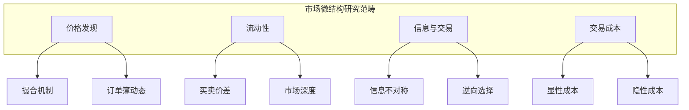
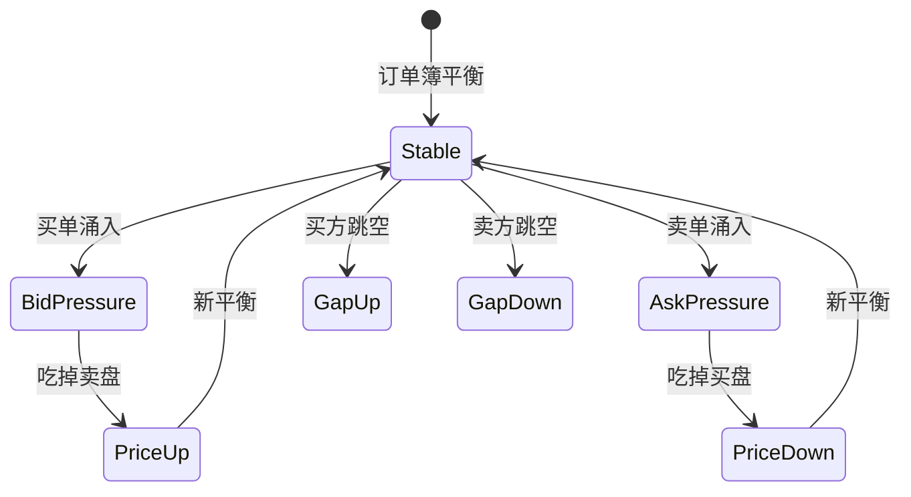
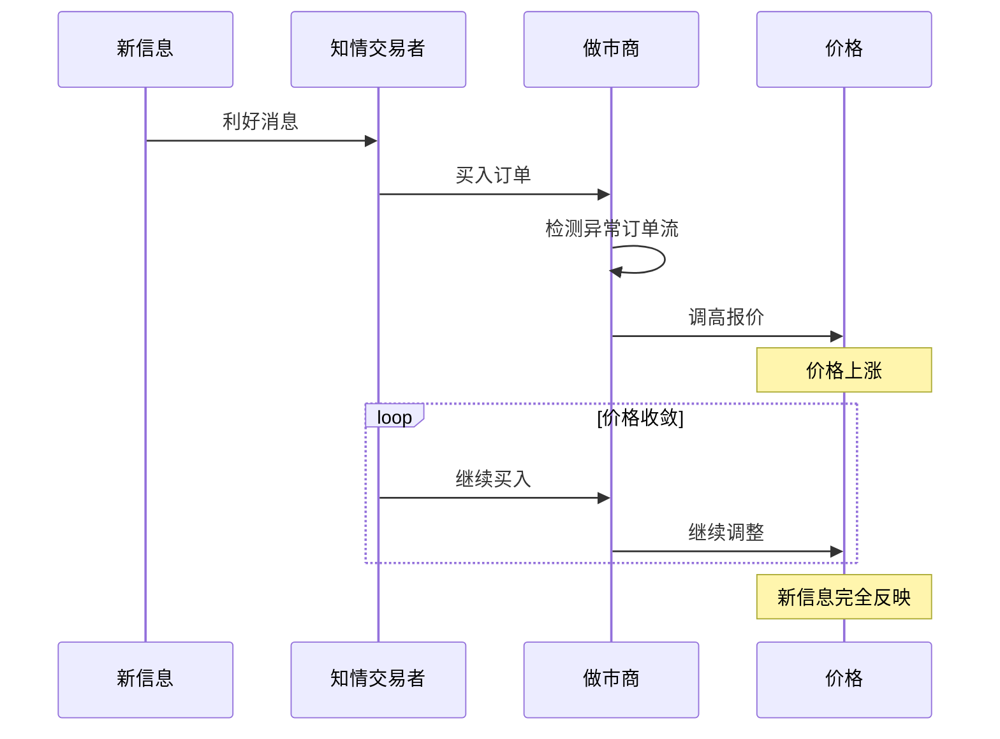
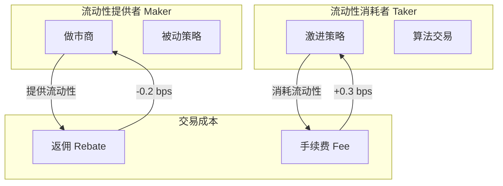
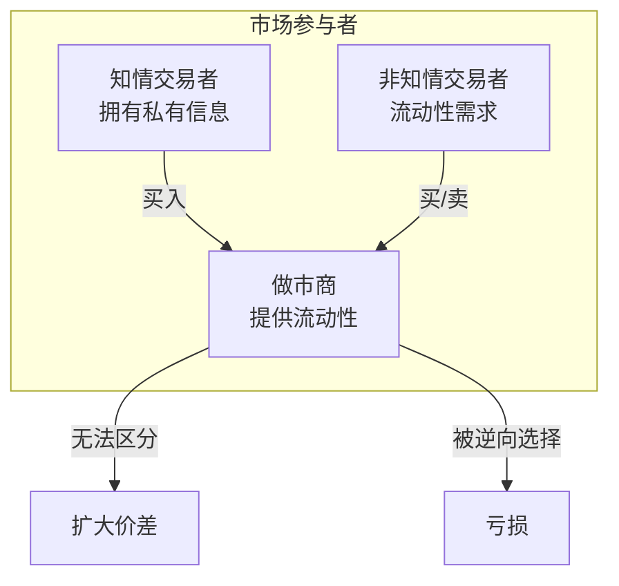

+++
title = "市场微结构深度解析"
date = 2026-02-02
weight = 38000
description = "市场微结构：订单流分析、价格发现、流动性、市场冲击、订单簿动态"
[taxonomies]
tags = ["HFT", "市场微结构", "订单流", "流动性", "价格发现"]
+++

# 市场微结构深度解析

本文深入剖析市场微结构（Market Microstructure）的核心概念，包括订单流分析、价格发现机制、流动性度量、市场冲击模型等，这是 HFT 从业者必须掌握的理论基础。

---

## 一、市场微结构概述

### 1.1 什么是市场微结构

市场微结构研究：**交易如何实际发生**，关注：

- 价格如何形成（Price Discovery）
- 交易成本来源（Transaction Costs）
- 信息如何反映到价格（Information Incorporation）
- 市场参与者的行为（Participant Behavior）



### 1.2 市场类型

| 市场类型 | 特点 | 代表 |
|----------|------|------|
| **订单驱动（Order-driven）** | 买卖订单直接匹配 | 大多数交易所 |
| **报价驱动（Quote-driven）** | 做市商提供报价 | 外汇、债券 |
| **混合市场** | 两者结合 | NYSE |

### 1.3 订单类型

| 订单类型 | 描述 | HFT 使用场景 |
|----------|------|--------------|
| **Market Order** | 立即以最优价成交 | 激进执行 |
| **Limit Order** | 指定价格或更优 | 挂单等待 |
| **IOC (Immediate or Cancel)** | 立即成交否则撤销 | 探测流动性 |
| **FOK (Fill or Kill)** | 全部成交否则撤销 | 大单保护 |
| **Hidden/Iceberg** | 隐藏部分数量 | 隐藏意图 |
| **Peg Order** | 跟随价格移动 | 被动跟踪 |

---

## 二、订单簿（Order Book）

### 2.1 订单簿结构

**Order Book - AAPL**

| BID (买盘) |  | ASK (卖盘) |  |
|------------|----------|------------|------|
| **Qty** | **Price** | **Price** | **Qty** |
| | | 150.02 | 500 ← Best Ask (最优卖价) |
| | | 150.03 | 800 |
| | | 150.04 | 1200 |
| | | 150.05 | 2000 |
| 600 ← Best Bid (最优买价) | 150.01 | | |
| 900 | 150.00 | | |
| 1500 | 149.99 | | |
| 2500 | 149.98 | | |

> **Mid Price: 150.015 | Spread: 0.01 (0.67 bps)**

### 2.2 关键指标

```cpp
struct OrderBookMetrics {
    // 价格指标
    double best_bid;      // 最优买价
    double best_ask;      // 最优卖价
    double mid_price;     // 中间价 = (bid + ask) / 2
    double spread;        // 价差 = ask - bid
    double spread_bps;    // 基点价差 = spread / mid * 10000
    
    // 深度指标
    int64_t bid_size_l1;  // 一档买量
    int64_t ask_size_l1;  // 一档卖量
    int64_t total_bid_qty; // 总买量（N档）
    int64_t total_ask_qty; // 总卖量（N档）
    
    // 不平衡指标
    double imbalance;     // (bid_qty - ask_qty) / (bid_qty + ask_qty)
    double vwap_bid;      // 买方加权平均价
    double vwap_ask;      // 卖方加权平均价
};

double calculate_imbalance(const OrderBook& book, int levels = 5) {
    int64_t bid_qty = 0, ask_qty = 0;
    
    for (int i = 0; i < levels; ++i) {
        bid_qty += book.bid_levels[i].quantity;
        ask_qty += book.ask_levels[i].quantity;
    }
    
    return (double)(bid_qty - ask_qty) / (bid_qty + ask_qty);
}
```

### 2.3 订单簿动态



### 2.4 订单流不平衡（Order Flow Imbalance）

订单流不平衡是预测短期价格变动的关键信号：

```cpp
// 订单流不平衡计算
struct OrderFlowImbalance {
    double bid_volume;    // 买方成交量
    double ask_volume;    // 卖方成交量
    double ofi;          // Order Flow Imbalance
    double vpin;         // Volume-Synchronized PIN
    
    void update(const Trade& trade) {
        if (trade.side == Side::Buy) {
            bid_volume += trade.quantity;
        } else {
            ask_volume += trade.quantity;
        }
        
        double total = bid_volume + ask_volume;
        if (total > 0) {
            ofi = (bid_volume - ask_volume) / total;
        }
    }
};

// 成交方向判断（Lee-Ready Algorithm）
Side classify_trade(double trade_price, double bid, double ask) {
    double mid = (bid + ask) / 2.0;
    
    if (trade_price > mid) return Side::Buy;   // 买方主动
    if (trade_price < mid) return Side::Sell;  // 卖方主动
    
    // 价格在中间时，使用 tick test
    return last_trade_direction;
}
```

---

## 三、价格发现（Price Discovery）

### 3.1 价格发现过程



### 3.2 有效价差（Effective Spread）

衡量实际交易成本：

```cpp
// 有效价差计算
struct EffectiveSpread {
    // 报价价差
    double quoted_spread(double bid, double ask) {
        return ask - bid;
    }
    
    // 有效价差 = 2 * |trade_price - mid_price|
    double effective_spread(double trade_price, double mid) {
        return 2.0 * std::abs(trade_price - mid);
    }
    
    // 实现价差（考虑价格影响）
    // = 2 * (trade_price - mid_at_execution)
    double realized_spread(double trade_price, double mid_exec, 
                          double mid_future, int seconds = 5) {
        // 正值 = 做市商盈利
        // 负值 = 逆向选择损失
        return 2.0 * (trade_price - mid_future) * 
               (trade_price > mid_exec ? 1 : -1);
    }
};
```

### 3.3 价格影响模型

**线性模型（Almgren-Chriss）**：

$$
\Delta P = \gamma \cdot \sigma \cdot \sqrt{\frac{V}{ADV}} + \eta \cdot \frac{V}{ADV}
$$

其中：
- $\gamma$: 临时影响系数
- $\eta$: 永久影响系数
- $V$: 交易量
- $ADV$: 日均成交量
- $\sigma$: 波动率

```cpp
class PriceImpactModel {
public:
    // Almgren-Chriss 临时影响
    double temporary_impact(double volume, double adv, double volatility) {
        double participation = volume / adv;
        return gamma_ * volatility * std::sqrt(participation);
    }
    
    // 永久影响
    double permanent_impact(double volume, double adv) {
        return eta_ * (volume / adv);
    }
    
    // 总影响
    double total_impact(double volume, double adv, double volatility) {
        return temporary_impact(volume, adv, volatility) + 
               permanent_impact(volume, adv);
    }
    
private:
    double gamma_ = 0.314;  // 临时影响系数
    double eta_ = 0.142;    // 永久影响系数
};
```

**平方根模型**：

$$
\Delta P = k \cdot \sigma \cdot \sqrt{\frac{V}{ADV}}
$$

```cpp
double sqrt_impact(double volume, double adv, double volatility, double k = 0.5) {
    return k * volatility * std::sqrt(volume / adv);
}
```

---

## 四、流动性（Liquidity）

### 4.1 流动性维度

| 维度 | 描述 | 指标 |
|------|------|------|
| **紧度（Tightness）** | 交易成本 | Bid-Ask Spread |
| **深度（Depth）** | 大单吸收能力 | Order Book Depth |
| **弹性（Resiliency）** | 价格恢复速度 | Recovery Time |
| **即时性（Immediacy）** | 成交速度 | Execution Time |

### 4.2 流动性度量

```cpp
struct LiquidityMetrics {
    // 1. 买卖价差
    double spread;
    double spread_bps;
    
    // 2. 深度（成交一定金额的价格影响）
    double depth_10k;   // 成交 1 万美元的价格影响
    double depth_100k;  // 成交 10 万美元的价格影响
    
    // 3. Kyle's Lambda（价格影响系数）
    // ΔP = λ * ΔQ
    double kyle_lambda;
    
    // 4. Amihud 非流动性指标
    // ILLIQ = |return| / volume
    double amihud_illiq;
    
    // 5. 订单簿斜率
    double book_slope;
};

// 计算成交一定金额的价格影响
double calculate_depth(const OrderBook& book, double amount, Side side) {
    double remaining = amount;
    double total_cost = 0;
    double total_qty = 0;
    
    const auto& levels = (side == Side::Buy) ? book.asks : book.bids;
    
    for (const auto& level : levels) {
        double level_value = level.price * level.quantity;
        
        if (level_value >= remaining) {
            double qty = remaining / level.price;
            total_cost += remaining;
            total_qty += qty;
            break;
        }
        
        total_cost += level_value;
        total_qty += level.quantity;
        remaining -= level_value;
    }
    
    double avg_price = total_cost / total_qty;
    double mid = book.mid_price();
    
    return (avg_price - mid) / mid * 10000;  // bps
}

// Kyle's Lambda 估计
double estimate_kyle_lambda(const std::vector<Trade>& trades,
                           const std::vector<double>& mid_prices) {
    // 回归：ΔP = λ * signed_volume + ε
    double sum_xy = 0, sum_xx = 0;
    
    for (size_t i = 1; i < trades.size(); ++i) {
        double delta_p = mid_prices[i] - mid_prices[i-1];
        double signed_vol = (trades[i].side == Side::Buy ? 1 : -1) * 
                           trades[i].quantity;
        
        sum_xy += delta_p * signed_vol;
        sum_xx += signed_vol * signed_vol;
    }
    
    return sum_xy / sum_xx;
}
```

### 4.3 流动性提供者 vs 流动性消耗者



---

## 五、逆向选择（Adverse Selection）

### 5.1 信息不对称



### 5.2 逆向选择成本

做市商价差构成：

$$
Spread = \underbrace{Order Processing}_\text{订单处理} + \underbrace{Inventory}_\text{库存风险} + \underbrace{Adverse Selection}_\text{逆向选择}
$$

```cpp
// 逆向选择成本估计
struct AdverseSelectionAnalysis {
    // PIN (Probability of Informed Trading)
    // 知情交易概率
    double calculate_pin(int buy_orders, int sell_orders,
                        double alpha,   // 信息事件概率
                        double delta,   // 坏消息概率
                        double mu,      // 知情交易者到达率
                        double epsilon) // 非知情交易者到达率
    {
        // PIN = α * μ / (α * μ + 2 * ε)
        return (alpha * mu) / (alpha * mu + 2 * epsilon);
    }
    
    // VPIN (Volume-Synchronized PIN)
    // 成交量同步的知情交易概率
    double calculate_vpin(const std::vector<Trade>& trades, int bucket_size) {
        double total_imbalance = 0;
        int buckets = 0;
        
        double buy_vol = 0, sell_vol = 0;
        double bucket_vol = 0;
        
        for (const auto& trade : trades) {
            if (trade.side == Side::Buy) {
                buy_vol += trade.quantity;
            } else {
                sell_vol += trade.quantity;
            }
            bucket_vol += trade.quantity;
            
            if (bucket_vol >= bucket_size) {
                total_imbalance += std::abs(buy_vol - sell_vol);
                buckets++;
                buy_vol = sell_vol = bucket_vol = 0;
            }
        }
        
        double total_volume = trades.size() * bucket_size;
        return total_imbalance / total_volume;
    }
};
```

### 5.3 做市商对策

```cpp
class MarketMaker {
public:
    Quote adjust_for_adverse_selection(const OrderBook& book,
                                      double current_imbalance,
                                      double vpin) {
        Quote quote;
        double mid = book.mid_price();
        double base_spread = min_spread_;
        
        // 1. 根据订单流不平衡调整
        double skew = imbalance_sensitivity_ * current_imbalance;
        
        // 2. 根据 VPIN 扩大价差
        double spread_multiplier = 1.0 + vpin_sensitivity_ * vpin;
        double spread = base_spread * spread_multiplier;
        
        // 3. 偏移报价（信息反映）
        quote.bid = mid - spread / 2 - skew;
        quote.ask = mid + spread / 2 - skew;
        
        // 4. 根据库存调整
        double inventory_skew = inventory_sensitivity_ * inventory_;
        quote.bid -= inventory_skew;
        quote.ask -= inventory_skew;
        
        // 5. 调整挂单量
        if (vpin > high_vpin_threshold_) {
            quote.bid_size *= 0.5;  // 减少暴露
            quote.ask_size *= 0.5;
        }
        
        return quote;
    }
    
private:
    double min_spread_ = 0.01;
    double imbalance_sensitivity_ = 0.001;
    double vpin_sensitivity_ = 0.5;
    double inventory_sensitivity_ = 0.0001;
    double high_vpin_threshold_ = 0.5;
    double inventory_ = 0;
};
```

---

## 六、交易成本分析（TCA）

### 6.1 交易成本构成

| 类型 | 成本项 | 描述 |
|------|--------|------|
| **显性成本** | 佣金 | 券商/交易所费用 |
| | 税费 | 印花税、交易税 |
| **隐性成本** | 价差成本 | 买卖价差的一半 |
| | 市场冲击 | 大单对价格的影响 |
| | 时机成本 | 延迟执行的价格变动 |
| | 机会成本 | 未执行的机会损失 |

### 6.2 实施差额（Implementation Shortfall）

```cpp
struct ImplementationShortfall {
    double decision_price;    // 决策价格
    double arrival_price;     // 到达价格
    double execution_price;   // 平均成交价
    double final_price;       // 结束价格
    double target_quantity;   // 目标数量
    double executed_quantity; // 实际成交数量
    
    // 总实施差额
    double total_is() const {
        return paper_return() - actual_return();
    }
    
    // 纸面收益（如果瞬间成交）
    double paper_return() const {
        return (final_price - decision_price) * target_quantity;
    }
    
    // 实际收益
    double actual_return() const {
        double executed_pnl = (final_price - execution_price) * executed_quantity;
        double missed_pnl = (final_price - final_price) * 
                           (target_quantity - executed_quantity);
        return executed_pnl + missed_pnl;
    }
    
    // 分解
    double delay_cost() const {
        return (arrival_price - decision_price) * target_quantity;
    }
    
    double market_impact() const {
        return (execution_price - arrival_price) * executed_quantity;
    }
    
    double opportunity_cost() const {
        return (final_price - arrival_price) * 
               (target_quantity - executed_quantity);
    }
};
```

### 6.3 TCA 报告

```cpp
struct TCAReport {
    // 基准对比
    double vs_arrival;    // vs 到达价格
    double vs_vwap;       // vs VWAP
    double vs_twap;       // vs TWAP
    double vs_close;      // vs 收盘价
    
    // 成本分解
    double spread_cost;
    double impact_cost;
    double timing_cost;
    double commission;
    
    // 统计
    double participation_rate;  // 参与率
    double fill_rate;          // 完成率
    double avg_execution_time; // 平均执行时间
    
    void print() const {
        printf("=== TCA Report ===\n");
        printf("vs Arrival: %.2f bps\n", vs_arrival * 10000);
        printf("vs VWAP:    %.2f bps\n", vs_vwap * 10000);
        printf("\nCost Breakdown:\n");
        printf("  Spread:     %.2f bps\n", spread_cost * 10000);
        printf("  Impact:     %.2f bps\n", impact_cost * 10000);
        printf("  Timing:     %.2f bps\n", timing_cost * 10000);
        printf("  Commission: %.2f bps\n", commission * 10000);
        printf("\nExecution:\n");
        printf("  Participation: %.1f%%\n", participation_rate * 100);
        printf("  Fill Rate:     %.1f%%\n", fill_rate * 100);
    }
};
```

---

## 七、市场微结构与 HFT

### 7.1 HFT 利用的微结构特征

| 特征 | HFT 策略 | 优势来源 |
|------|----------|----------|
| 订单流不平衡 | 短期预测 | 速度 + 分析 |
| 价差变化 | 做市 | 速度 |
| 跨市场价差 | 套利 | 速度 |
| 信息不对称 | 事件驱动 | 数据 + 速度 |
| 流动性分布 | 执行算法 | 分析 |

### 7.2 微结构信号

```cpp
struct MicrostructureSignals {
    // 1. 订单簿不平衡
    double book_imbalance;
    
    // 2. 成交不平衡
    double trade_imbalance;
    
    // 3. 价差变化
    double spread_change;
    
    // 4. 深度变化
    double depth_change;
    
    // 5. 到达率变化
    double arrival_rate;
    
    // 6. 取消率
    double cancel_rate;
    
    // 组合信号
    double composite_signal() const {
        return 0.3 * book_imbalance +
               0.3 * trade_imbalance +
               0.2 * spread_change +
               0.1 * depth_change +
               0.1 * arrival_rate;
    }
};

// 信号更新
void update_signals(MicrostructureSignals& signals,
                   const OrderBook& book,
                   const std::vector<Trade>& recent_trades) {
    // 订单簿不平衡
    signals.book_imbalance = calculate_imbalance(book, 5);
    
    // 成交不平衡
    double buy_vol = 0, sell_vol = 0;
    for (const auto& t : recent_trades) {
        if (t.side == Side::Buy) buy_vol += t.quantity;
        else sell_vol += t.quantity;
    }
    signals.trade_imbalance = (buy_vol - sell_vol) / (buy_vol + sell_vol + 1);
    
    // 其他信号...
}
```

---

## 八、常见面试问题

### 8.1 基础概念

**Q: 什么是 Bid-Ask Spread？它由什么决定？**

A: Bid-Ask Spread 是最优买价和卖价之间的差额。由以下因素决定：
1. **订单处理成本**：交易所费用、技术成本
2. **库存风险**：做市商持仓的价格波动风险
3. **逆向选择成本**：与知情交易者交易的亏损风险
4. **竞争程度**：做市商越多，价差越窄

**Q: 什么是流动性提供者和流动性消耗者？**

| 角色 | 订单类型 | 对价差影响 | 费用 |
|------|----------|------------|------|
| Maker (提供者) | 限价单挂在订单簿 | 缩窄价差 | 获得返佣 |
| Taker (消耗者) | 市价单吃掉订单 | 无直接影响 | 支付费用 |

### 8.2 进阶问题

**Q: 如何判断一笔成交是买方还是卖方发起的？**

A: 使用 **Lee-Ready 算法**：
1. **Quote Rule**：成交价 > 中间价 → 买方；< 中间价 → 卖方
2. **Tick Rule**：与上一笔成交比较方向
3. **组合**：Quote Rule 优先，失败时用 Tick Rule

**Q: 什么是 Kyle's Lambda？如何使用？**

A: Kyle's Lambda (λ) 衡量订单流对价格的影响程度：

$$
\Delta P = \lambda \cdot \Delta Q
$$

- λ 越大，流动性越差
- λ 可用于：估算交易成本、优化执行策略、检测信息交易

**Q: 如何检测知情交易？**

A: 
1. **PIN 模型**：估计知情交易概率
2. **VPIN**：实时监测订单流不平衡
3. **异常检测**：订单到达率突变、价差异常扩大

---

## 相关文章

- [上一篇：HFT面试题-系统架构](@/articles/hft/hft-37-HFT面试题-系统架构.md)
- [下一篇：HFT策略类型全景](@/articles/hft/hft-39-HFT策略类型全景.md)
- [Order Book实现详解](@/articles/hft/hft-13-OrderBook实现详解.md)
- [Market Making策略原理](@/articles/hft/hft-14-MarketMaking策略原理.md)
