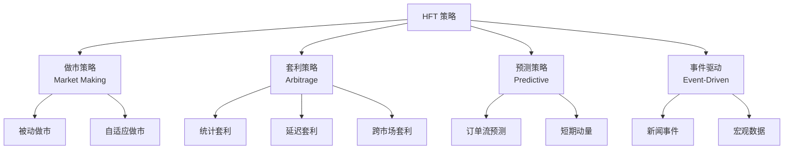
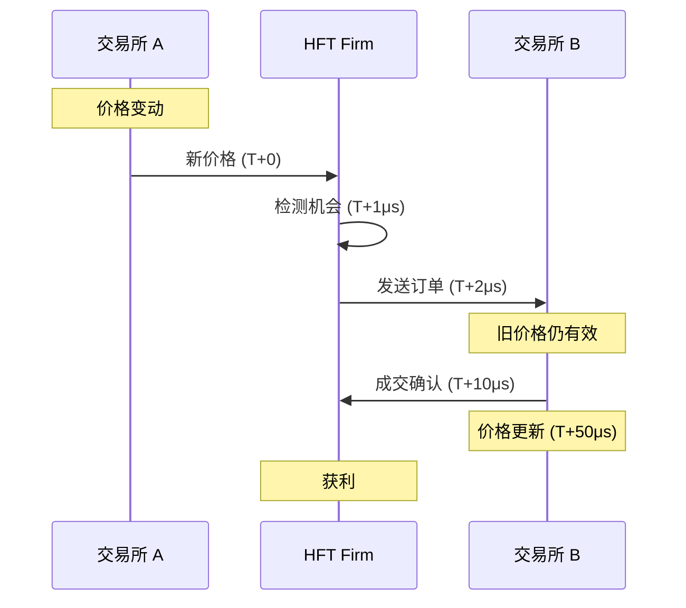

+++
title = "39. HFT策略类型全景"
date = 2026-02-02
weight = 39000
description = "HFT策略类型：做市、统计套利、事件驱动、延迟套利、订单流预测"
[taxonomies]
tags = ["HFT", "策略", "做市", "套利", "量化"]
+++

# HFT 策略类型全景

本文全面介绍高频交易的主要策略类型，包括做市策略、统计套利、事件驱动、延迟套利等，分析各策略的原理、风险和实现要点。

---

## 一、HFT 策略分类

### 1.1 策略图谱



### 1.2 策略特征对比

| 策略类型 | 持仓时间 | 收益来源 | 技术要求 | 资金需求 |
|----------|----------|----------|----------|----------|
| 做市 | 秒-分钟 | Spread + Rebate | 高 | 中 |
| 统计套利 | 分钟-小时 | 均值回归 | 高 | 高 |
| 延迟套利 | 微秒 | 价格差异 | 极高 | 低 |
| 订单流预测 | 秒-分钟 | 方向预测 | 高 | 中 |
| 事件驱动 | 毫秒-秒 | 信息优势 | 高 | 中 |

---

## 二、做市策略（Market Making）

### 2.1 基本原理

做市商同时报出买卖价格，赚取价差收益：

```cpp
struct Quote {
    double bid_price;
    double ask_price;
    int bid_size;
    int ask_size;
};

class SimpleMarketMaker {
public:
    Quote generate_quote(double mid_price, double volatility) {
        Quote q;
        
        // 基于波动率确定价差
        double half_spread = base_spread_ + volatility_factor_ * volatility;
        
        q.bid_price = mid_price - half_spread;
        q.ask_price = mid_price + half_spread;
        q.bid_size = default_size_;
        q.ask_size = default_size_;
        
        // 库存偏移
        double skew = inventory_ * inventory_coef_;
        q.bid_price -= skew;
        q.ask_price -= skew;
        
        return q;
    }
    
    void on_fill(Side side, int qty, double price) {
        if (side == Side::Buy) {
            inventory_ += qty;
        } else {
            inventory_ -= qty;
        }
        realized_pnl_ += (side == Side::Sell ? 1 : -1) * qty * price;
    }
    
private:
    double base_spread_ = 0.01;
    double volatility_factor_ = 2.0;
    double inventory_coef_ = 0.0001;
    int default_size_ = 100;
    int inventory_ = 0;
    double realized_pnl_ = 0;
};
```

### 2.2 Avellaneda-Stoikov 模型

经典的最优做市模型：

$$
\delta^{bid} = \frac{1}{\gamma} \ln\left(1 + \frac{\gamma}{\kappa}\right) + \frac{2q + 1}{2} \gamma \sigma^2 (T - t)
$$

$$
\delta^{ask} = \frac{1}{\gamma} \ln\left(1 + \frac{\gamma}{\kappa}\right) - \frac{2q + 1}{2} \gamma \sigma^2 (T - t)
$$

其中：
- $\gamma$: 风险厌恶系数
- $\kappa$: 订单到达率参数
- $q$: 当前库存
- $\sigma$: 波动率
- $T - t$: 剩余时间

```cpp
class AvellanedaStoikov {
public:
    Quote optimal_quote(double mid, double inventory, double vol, 
                       double time_remaining) {
        Quote q;
        
        // 无差异价格（考虑库存）
        double reservation_price = mid - inventory * gamma_ * vol * vol * time_remaining;
        
        // 最优价差
        double spread = (2.0 / gamma_) * std::log(1 + gamma_ / kappa_) +
                       std::sqrt(vol * vol * gamma_ * time_remaining / kappa_ * 
                                std::log(1 + gamma_ / kappa_));
        
        q.bid_price = reservation_price - spread / 2;
        q.ask_price = reservation_price + spread / 2;
        
        return q;
    }
    
private:
    double gamma_ = 0.1;   // 风险厌恶
    double kappa_ = 1.5;   // 订单到达参数
};
```

### 2.3 库存管理

```cpp
class InventoryManager {
public:
    struct Limits {
        int max_position;      // 最大持仓
        int soft_limit;        // 软限制
        double max_notional;   // 最大名义金额
    };
    
    // 根据库存调整报价大小
    std::pair<int, int> adjust_sizes(int base_size, int inventory) {
        int bid_size = base_size;
        int ask_size = base_size;
        
        // 倾斜报价大小以回归库存
        if (inventory > 0) {
            // 多头，想卖出更多
            bid_size = std::max(1, base_size - inventory / 2);
            ask_size = base_size + inventory / 2;
        } else if (inventory < 0) {
            // 空头，想买入更多
            bid_size = base_size - inventory / 2;
            ask_size = std::max(1, base_size + inventory / 2);
        }
        
        return {bid_size, ask_size};
    }
    
    // 检查是否需要强制平仓
    bool need_hedge(int inventory, Limits limits) {
        return std::abs(inventory) > limits.soft_limit;
    }
};
```

### 2.4 做市风险

| 风险类型 | 描述 | 应对措施 |
|----------|------|----------|
| 逆向选择 | 与知情交易者成交 | 监测 VPIN，动态调整价差 |
| 库存风险 | 持仓累积的价格波动 | 库存限制，倾斜报价 |
| 市场波动 | 剧烈行情下的亏损 | 波动检测，暂停报价 |
| 技术风险 | 系统故障 | 心跳监控，断路器 |

---

## 三、统计套利（Statistical Arbitrage）

### 3.1 配对交易

寻找相关资产，交易价差的均值回归：

```cpp
class PairsTrading {
public:
    struct PairSignal {
        double spread;
        double z_score;
        double half_life;
        bool long_spread;   // 买 A 卖 B
        bool short_spread;  // 卖 A 买 B
    };
    
    PairSignal analyze(const std::vector<double>& prices_a,
                       const std::vector<double>& prices_b) {
        PairSignal signal;
        
        // 计算对冲比率（回归）
        double beta = calculate_hedge_ratio(prices_a, prices_b);
        
        // 计算价差
        std::vector<double> spread;
        for (size_t i = 0; i < prices_a.size(); ++i) {
            spread.push_back(prices_a[i] - beta * prices_b[i]);
        }
        
        // 计算统计量
        double mean = calculate_mean(spread);
        double std = calculate_std(spread);
        signal.spread = spread.back();
        signal.z_score = (signal.spread - mean) / std;
        
        // 半衰期（均值回归速度）
        signal.half_life = calculate_half_life(spread);
        
        // 生成信号
        signal.long_spread = signal.z_score < -entry_threshold_;
        signal.short_spread = signal.z_score > entry_threshold_;
        
        return signal;
    }
    
private:
    double entry_threshold_ = 2.0;
    double exit_threshold_ = 0.5;
    
    double calculate_hedge_ratio(const std::vector<double>& a,
                                 const std::vector<double>& b) {
        // OLS 回归: a = alpha + beta * b
        // 返回 beta
        double sum_ab = 0, sum_bb = 0;
        double mean_a = calculate_mean(a);
        double mean_b = calculate_mean(b);
        
        for (size_t i = 0; i < a.size(); ++i) {
            sum_ab += (a[i] - mean_a) * (b[i] - mean_b);
            sum_bb += (b[i] - mean_b) * (b[i] - mean_b);
        }
        
        return sum_ab / sum_bb;
    }
    
    double calculate_half_life(const std::vector<double>& spread) {
        // AR(1) 模型估计均值回归速度
        // spread_t = phi * spread_{t-1} + epsilon
        // half_life = -log(2) / log(phi)
        
        std::vector<double> y, x;
        for (size_t i = 1; i < spread.size(); ++i) {
            y.push_back(spread[i] - spread[i-1]);
            x.push_back(spread[i-1]);
        }
        
        double phi = calculate_regression_coef(y, x) + 1;
        return -std::log(2) / std::log(std::abs(phi));
    }
};
```

### 3.2 跨品种套利

```cpp
class CrossAssetArbitrage {
public:
    // ETF 与成分股套利
    struct ETFArbitrage {
        double etf_price;
        double nav;           // 净值
        double premium;       // 溢价率
        bool create;          // 申购套利
        bool redeem;          // 赎回套利
    };
    
    ETFArbitrage analyze_etf(double etf_price, 
                            const std::vector<double>& component_prices,
                            const std::vector<double>& weights) {
        ETFArbitrage arb;
        arb.etf_price = etf_price;
        
        // 计算 NAV
        arb.nav = 0;
        for (size_t i = 0; i < component_prices.size(); ++i) {
            arb.nav += component_prices[i] * weights[i];
        }
        
        // 溢价率
        arb.premium = (etf_price - arb.nav) / arb.nav;
        
        // 套利信号
        arb.create = arb.premium < -creation_threshold_;  // 折价时申购
        arb.redeem = arb.premium > redemption_threshold_; // 溢价时赎回
        
        return arb;
    }
    
    // 期现套利
    struct FuturesArbitrage {
        double spot_price;
        double futures_price;
        double basis;
        double fair_basis;
        double mispricing;
    };
    
    FuturesArbitrage analyze_futures(double spot, double futures,
                                     double rate, double days_to_expiry,
                                     double dividend_yield = 0) {
        FuturesArbitrage arb;
        arb.spot_price = spot;
        arb.futures_price = futures;
        arb.basis = futures - spot;
        
        // 理论基差 (Cost of Carry)
        double years = days_to_expiry / 365.0;
        arb.fair_basis = spot * (rate - dividend_yield) * years;
        
        // 定价偏差
        arb.mispricing = arb.basis - arb.fair_basis;
        
        return arb;
    }
    
private:
    double creation_threshold_ = 0.003;   // 0.3%
    double redemption_threshold_ = 0.003;
};
```

### 3.3 三角套利

```cpp
class TriangularArbitrage {
public:
    struct Opportunity {
        double profit_bps;
        std::string path;     // "USD->EUR->GBP->USD"
        bool valid;
    };
    
    Opportunity find_opportunity(
        double usd_eur,  // USD/EUR
        double eur_gbp,  // EUR/GBP
        double gbp_usd   // GBP/USD
    ) {
        Opportunity opp;
        
        // 路径 1: USD -> EUR -> GBP -> USD
        double rate1 = usd_eur * eur_gbp * gbp_usd;
        
        // 路径 2: USD -> GBP -> EUR -> USD
        double rate2 = (1.0 / gbp_usd) * (1.0 / eur_gbp) * (1.0 / usd_eur);
        
        if (rate1 > 1.0 + min_profit_) {
            opp.profit_bps = (rate1 - 1.0) * 10000;
            opp.path = "USD->EUR->GBP->USD";
            opp.valid = true;
        } else if (rate2 > 1.0 + min_profit_) {
            opp.profit_bps = (rate2 - 1.0) * 10000;
            opp.path = "USD->GBP->EUR->USD";
            opp.valid = true;
        } else {
            opp.valid = false;
        }
        
        return opp;
    }
    
private:
    double min_profit_ = 0.0001;  // 最小利润 1 bps
};
```

---

## 四、延迟套利（Latency Arbitrage）

### 4.1 基本原理

利用市场间信息传播延迟获利：



### 4.2 跨交易所套利

```cpp
class CrossExchangeArbitrage {
public:
    struct Opportunity {
        Exchange buy_exchange;
        Exchange sell_exchange;
        double buy_price;
        double sell_price;
        double profit_bps;
        int size;
    };
    
    std::optional<Opportunity> check_opportunity(
        const OrderBook& book_a,
        const OrderBook& book_b,
        double latency_a_us,    // 到交易所 A 的延迟
        double latency_b_us     // 到交易所 B 的延迟
    ) {
        // 考虑延迟后的有效价格
        double effective_ask_a = book_a.best_ask() * (1 + price_move_estimate_ * latency_a_us);
        double effective_bid_b = book_b.best_bid() * (1 - price_move_estimate_ * latency_b_us);
        
        // 买 A 卖 B
        double profit_ab = effective_bid_b - effective_ask_a;
        if (profit_ab > min_profit_threshold_) {
            Opportunity opp;
            opp.buy_exchange = Exchange::A;
            opp.sell_exchange = Exchange::B;
            opp.buy_price = book_a.best_ask();
            opp.sell_price = book_b.best_bid();
            opp.profit_bps = profit_ab / book_a.mid_price() * 10000;
            opp.size = std::min(book_a.ask_size(0), book_b.bid_size(0));
            return opp;
        }
        
        // 买 B 卖 A
        double effective_ask_b = book_b.best_ask() * (1 + price_move_estimate_ * latency_b_us);
        double effective_bid_a = book_a.best_bid() * (1 - price_move_estimate_ * latency_a_us);
        
        double profit_ba = effective_bid_a - effective_ask_b;
        if (profit_ba > min_profit_threshold_) {
            Opportunity opp;
            opp.buy_exchange = Exchange::B;
            opp.sell_exchange = Exchange::A;
            opp.buy_price = book_b.best_ask();
            opp.sell_price = book_a.best_bid();
            opp.profit_bps = profit_ba / book_b.mid_price() * 10000;
            opp.size = std::min(book_b.ask_size(0), book_a.bid_size(0));
            return opp;
        }
        
        return std::nullopt;
    }
    
private:
    double min_profit_threshold_ = 0.0001;
    double price_move_estimate_ = 0.00001;  // 每微秒的价格变动估计
};
```

### 4.3 延迟优化

| 优化方向 | 技术 | 延迟改善 |
|----------|------|----------|
| 物理距离 | Co-location | ms → μs |
| 网络 | Kernel Bypass, DPDK | 100μs → 10μs |
| 硬件 | FPGA | 10μs → 1μs |
| 软件 | Lock-free, Cache-friendly | 1μs → 100ns |

---

## 五、订单流预测（Order Flow Prediction）

### 5.1 预测信号

```cpp
class OrderFlowPredictor {
public:
    struct Features {
        // 订单簿特征
        double imbalance_l1;      // 一档不平衡
        double imbalance_l5;      // 五档不平衡
        double spread;
        double spread_change;
        
        // 成交特征
        double trade_imbalance;   // 成交方向不平衡
        double arrival_rate;      // 订单到达率
        double cancel_rate;       // 撤单率
        
        // 价格特征
        double momentum_1s;       // 1秒动量
        double momentum_5s;       // 5秒动量
        double volatility;
    };
    
    double predict(const Features& f) {
        // 线性模型（实际可用 ML）
        return 
            0.3 * f.imbalance_l1 +
            0.2 * f.imbalance_l5 +
            0.2 * f.trade_imbalance +
            0.1 * f.momentum_1s +
            0.1 * f.momentum_5s +
            0.05 * f.spread_change +
            0.05 * (f.arrival_rate - baseline_arrival_);
    }
    
    Side signal_to_action(double prediction) {
        if (prediction > entry_threshold_) return Side::Buy;
        if (prediction < -entry_threshold_) return Side::Sell;
        return Side::None;
    }
    
private:
    double entry_threshold_ = 0.5;
    double baseline_arrival_ = 100;  // 基准订单到达率
};
```

### 5.2 机器学习方法

```python
# 订单流预测 - Python 示例
import numpy as np
from sklearn.ensemble import GradientBoostingClassifier
from sklearn.preprocessing import StandardScaler

class MLOrderFlowPredictor:
    def __init__(self):
        self.model = GradientBoostingClassifier(
            n_estimators=100,
            max_depth=5,
            learning_rate=0.1
        )
        self.scaler = StandardScaler()
        
    def prepare_features(self, book_data, trade_data):
        features = []
        for i in range(len(book_data)):
            f = [
                book_data[i]['imbalance_l1'],
                book_data[i]['imbalance_l5'],
                book_data[i]['spread'],
                book_data[i]['depth_ratio'],
                trade_data[i]['buy_volume'] / (trade_data[i]['total_volume'] + 1),
                trade_data[i]['trade_count'],
                book_data[i]['mid_price_change_1s'],
                book_data[i]['mid_price_change_5s'],
            ]
            features.append(f)
        return np.array(features)
    
    def prepare_labels(self, book_data, horizon_ms=100):
        # 标签：未来 horizon_ms 内价格上涨=1，下跌=-1，不变=0
        labels = []
        for i in range(len(book_data) - horizon_ms):
            future_mid = book_data[i + horizon_ms]['mid_price']
            current_mid = book_data[i]['mid_price']
            change = future_mid - current_mid
            
            if change > threshold:
                labels.append(1)
            elif change < -threshold:
                labels.append(-1)
            else:
                labels.append(0)
        return np.array(labels)
    
    def train(self, X, y):
        X_scaled = self.scaler.fit_transform(X)
        self.model.fit(X_scaled, y)
        
    def predict(self, X):
        X_scaled = self.scaler.transform(X)
        return self.model.predict(X_scaled)
```

---

## 六、事件驱动策略

### 6.1 新闻交易

```cpp
class NewsTrader {
public:
    struct NewsEvent {
        std::string headline;
        double sentiment;     // -1 to 1
        double relevance;     // 0 to 1
        std::string symbol;
        int64_t timestamp_us;
    };
    
    struct TradeSignal {
        std::string symbol;
        Side side;
        int size;
        double urgency;       // 0 to 1
    };
    
    std::optional<TradeSignal> process_news(const NewsEvent& event) {
        // 过滤无关新闻
        if (event.relevance < min_relevance_) {
            return std::nullopt;
        }
        
        // 检查是否是我们关注的股票
        if (watched_symbols_.find(event.symbol) == watched_symbols_.end()) {
            return std::nullopt;
        }
        
        TradeSignal signal;
        signal.symbol = event.symbol;
        
        // 根据情感确定方向
        if (event.sentiment > sentiment_threshold_) {
            signal.side = Side::Buy;
        } else if (event.sentiment < -sentiment_threshold_) {
            signal.side = Side::Sell;
        } else {
            return std::nullopt;
        }
        
        // 根据情感强度确定大小和紧迫性
        signal.urgency = std::abs(event.sentiment);
        signal.size = base_size_ * (1 + signal.urgency);
        
        return signal;
    }
    
private:
    double min_relevance_ = 0.7;
    double sentiment_threshold_ = 0.3;
    int base_size_ = 100;
    std::set<std::string> watched_symbols_;
};
```

### 6.2 宏观数据交易

```cpp
class MacroDataTrader {
public:
    struct EconomicRelease {
        std::string indicator;    // "NFP", "CPI", "FOMC"
        double actual;
        double consensus;
        double previous;
        int64_t release_time_us;
    };
    
    struct MultiAssetSignal {
        std::map<std::string, Side> signals;
        double confidence;
    };
    
    MultiAssetSignal process_release(const EconomicRelease& release) {
        MultiAssetSignal result;
        
        double surprise = (release.actual - release.consensus) / 
                         std::abs(release.consensus + 0.001);
        
        if (release.indicator == "NFP") {
            // 非农就业数据
            if (surprise > 0.1) {
                // 强于预期 -> 美元涨，股票涨，债券跌
                result.signals["DXY"] = Side::Buy;
                result.signals["ES"] = Side::Buy;
                result.signals["ZN"] = Side::Sell;
            } else if (surprise < -0.1) {
                result.signals["DXY"] = Side::Sell;
                result.signals["ES"] = Side::Sell;
                result.signals["ZN"] = Side::Buy;
            }
            result.confidence = std::min(1.0, std::abs(surprise) * 5);
        }
        else if (release.indicator == "CPI") {
            // 通胀数据
            if (surprise > 0.05) {
                // 通胀高于预期 -> 债券跌，黄金涨
                result.signals["ZN"] = Side::Sell;
                result.signals["GC"] = Side::Buy;
            }
            result.confidence = std::min(1.0, std::abs(surprise) * 10);
        }
        
        return result;
    }
};
```

---

## 七、策略风险管理

### 7.1 通用风控框架

```cpp
class StrategyRiskManager {
public:
    struct RiskLimits {
        int max_position;
        double max_notional;
        double max_loss_daily;
        double max_drawdown;
        int max_orders_per_second;
        double max_order_size;
    };
    
    struct RiskState {
        int current_position;
        double current_notional;
        double daily_pnl;
        double peak_pnl;
        int orders_this_second;
        bool circuit_breaker_triggered;
    };
    
    bool check_order(const Order& order, const RiskLimits& limits,
                    RiskState& state) {
        // 1. 订单大小检查
        if (order.quantity > limits.max_order_size) {
            return false;
        }
        
        // 2. 持仓限制
        int new_position = state.current_position + 
            (order.side == Side::Buy ? 1 : -1) * order.quantity;
        if (std::abs(new_position) > limits.max_position) {
            return false;
        }
        
        // 3. 日亏损限制
        if (state.daily_pnl < -limits.max_loss_daily) {
            state.circuit_breaker_triggered = true;
            return false;
        }
        
        // 4. 回撤限制
        double drawdown = state.peak_pnl - state.daily_pnl;
        if (drawdown > limits.max_drawdown) {
            return false;
        }
        
        // 5. 订单频率限制
        if (state.orders_this_second >= limits.max_orders_per_second) {
            return false;
        }
        
        return true;
    }
};
```

### 7.2 策略特定风险

| 策略 | 主要风险 | 对策 |
|------|----------|------|
| 做市 | 逆向选择、库存 | VPIN 监控、库存限制 |
| 统计套利 | 相关性破裂 | 止损、动态对冲比 |
| 延迟套利 | 技术落后、监管 | 持续投资、合规 |
| 事件驱动 | 假新闻、解读错误 | 多源验证、人工审核 |

---

## 八、常见面试问题

### 8.1 策略设计

**Q: 描述一个做市策略的核心组件？**

A: 
1. **报价引擎**：生成买卖价格
2. **库存管理**：监控和调整持仓
3. **风险控制**：限制损失和暴露
4. **信号输入**：订单簿、成交、波动率
5. **执行模块**：发送和管理订单

**Q: 如何处理做市中的逆向选择？**

A: 
1. **监测指标**：VPIN、订单流不平衡
2. **动态价差**：高风险时扩大价差
3. **减少暴露**：减小挂单量
4. **快速撤单**：检测到风险立即撤单
5. **选择性报价**：对某些交易对手不报价

### 8.2 策略评估

**Q: 如何评估一个 HFT 策略的表现？**

| 指标 | 计算方式 | 意义 |
|------|----------|------|
| Sharpe | 收益/标准差 | 风险调整收益 |
| Sortino | 收益/下行标准差 | 下行风险 |
| 最大回撤 | 峰值到谷值的最大跌幅 | 极端损失 |
| 胜率 | 盈利交易/总交易 | 一致性 |
| 盈亏比 | 平均盈利/平均亏损 | 收益质量 |
| 换手率 | 交易量/持仓 | 策略活跃度 |

**Q: 统计套利策略的风险是什么？**

A:
1. **相关性破裂**：配对关系不再成立
2. **均值回归失败**：价差持续扩大
3. **流动性风险**：无法同时成交两腿
4. **模型风险**：参数估计错误
5. **执行滑点**：实际成交偏离预期

---

## 相关文章

- [上一篇：市场微结构深度解析](@/articles/hft/hft-38-市场微结构深度解析.md)
- [下一篇：HFT合规与监管要求](@/articles/hft/hft-40-HFT合规与监管要求.md)
- [Market Making策略原理](@/articles/hft/hft-14-MarketMaking策略原理.md)
- [Order Book实现详解](@/articles/hft/hft-13-OrderBook实现详解.md)
