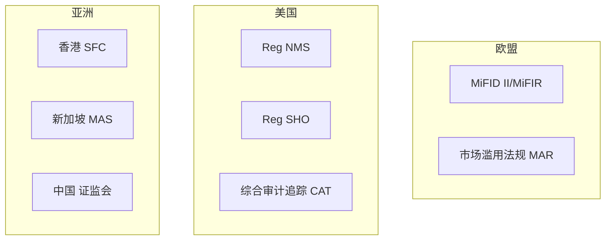

+++
title = "40.HFT合规与监管要求"
date = 2026-02-02
description = "HFT合规：MiFID II、Reg NMS、市场滥用、交易报告、最佳执行"
[taxonomies]
tags = ["HFT", "合规", "监管", "MiFID", "风控"]
+++

# HFT 合规与监管要求

本文介绍高频交易面临的主要监管框架，包括欧盟 MiFID II、美国 Reg NMS、市场滥用防范、交易报告要求等内容。

---

## 一、HFT 监管概述

### 1.1 监管背景

高频交易受到严格监管，主要原因：

| 事件 | 时间 | 影响 |
|------|------|------|
| 闪电崩盘 (Flash Crash) | 2010 | 道指暴跌 1000 点 |
| Knight Capital 事故 | 2012 | 45 分钟亏损 4.4 亿美元 |
| 伦敦鲸 (London Whale) | 2012 | 62 亿美元交易损失 |

### 1.2 主要监管框架



---

## 二、欧盟 MiFID II

### 2.1 核心要求

**MiFID II**（Markets in Financial Instruments Directive II）2018 年生效：

| 要求 | 描述 |
|------|------|
| **算法交易注册** | 使用算法交易须向监管机构注册 |
| **系统弹性测试** | 定期进行压力测试 |
| **订单记录** | 保存所有订单详情至少 5 年 |
| **市场做市义务** | 做市商需在一定时间内提供报价 |
| **限速机制** | 交易所需实施流量控制 |

### 2.2 算法交易定义

```
MiFID II 第4条第39款：
"算法交易" 指使用计算机算法自动确定订单参数
（如是否发起、时间、价格、数量或执行方式）
而人工干预极少或完全没有的交易方式。
```

### 2.3 高频交易定义

MiFID II 将 HFT 定义为满足以下条件的算法交易：

1. **基础设施最小化延迟**：Co-location、专线等
2. **系统决定订单**：无人工干预的启动、生成、路由、执行
3. **高日内消息率**：大量订单、报价或撤单

### 2.4 合规要求

```cpp
struct MiFIDIICompliance {
    // 1. 订单记录
    struct OrderRecord {
        int64_t order_id;
        int64_t timestamp_ns;      // 纳秒精度
        std::string instrument_id;
        OrderType type;
        Side side;
        double price;
        int quantity;
        int64_t client_id;
        int64_t algo_id;           // 算法标识
        std::string decision_maker; // 交易决策者
    };
    
    // 2. 交易报告
    struct TransactionReport {
        int64_t execution_id;
        int64_t trade_timestamp;
        std::string venue;
        std::string instrument_isin;
        double price;
        int quantity;
        std::string buyer_lei;     // Legal Entity Identifier
        std::string seller_lei;
        bool short_sale;
        std::string trader_id;
    };
    
    // 3. 时钟同步
    static constexpr int64_t MAX_CLOCK_DRIFT_US = 100;  // 100 微秒
    
    void ensure_clock_sync() {
        // 使用 PTP 同步到 UTC
        // 记录同步状态
    }
};
```

### 2.5 做市商义务

```cpp
class MiFIDMarketMaker {
public:
    struct QuotingObligation {
        double min_presence_ratio;  // 最小报价时间比例
        double max_spread_bps;      // 最大价差
        int min_size;               // 最小报价量
        int hours_per_day;          // 每天报价小时数
    };
    
    bool check_compliance(const QuotingStats& stats, 
                         const QuotingObligation& obligation) {
        // 检查报价时间
        if (stats.presence_ratio < obligation.min_presence_ratio) {
            log_compliance_breach("Insufficient quoting presence");
            return false;
        }
        
        // 检查价差
        if (stats.avg_spread_bps > obligation.max_spread_bps) {
            log_compliance_breach("Spread too wide");
            return false;
        }
        
        return true;
    }
    
private:
    // 典型义务：50% 时间在场，价差不超过 2 倍正常水平
    QuotingObligation default_obligation = {0.5, 20, 100, 5};
};
```

---

## 三、美国 Reg NMS

### 3.1 核心规则

**Reg NMS**（Regulation National Market System）2007 年生效：

| 规则 | 描述 |
|------|------|
| **Order Protection Rule** | 禁止交易穿透（trade-through）更优价格 |
| **Access Rule** | 确保跨市场公平接入 |
| **Sub-Penny Rule** | 禁止次便士报价（股价 > $1 时） |
| **Market Data Rules** | 规范市场数据分发 |

### 3.2 Order Protection Rule

```cpp
class OrderProtectionChecker {
public:
    // 检查是否违反 Order Protection Rule
    bool check_trade_through(const Order& order, 
                            const std::map<std::string, Quote>& nbbo) {
        double our_price = order.price;
        
        if (order.side == Side::Buy) {
            // 买入时，检查是否有更低的卖价
            for (const auto& [venue, quote] : nbbo) {
                if (quote.ask < our_price && venue != order.venue) {
                    log_potential_violation(order, venue, quote.ask);
                    return false;  // Trade-through!
                }
            }
        } else {
            // 卖出时，检查是否有更高的买价
            for (const auto& [venue, quote] : nbbo) {
                if (quote.bid > our_price && venue != order.venue) {
                    log_potential_violation(order, venue, quote.bid);
                    return false;  // Trade-through!
                }
            }
        }
        
        return true;
    }
    
    // NBBO (National Best Bid and Offer) 计算
    Quote calculate_nbbo(const std::map<std::string, Quote>& quotes) {
        Quote nbbo;
        nbbo.bid = 0;
        nbbo.ask = std::numeric_limits<double>::max();
        
        for (const auto& [venue, quote] : quotes) {
            if (quote.bid > nbbo.bid) {
                nbbo.bid = quote.bid;
                nbbo.bid_venue = venue;
            }
            if (quote.ask < nbbo.ask) {
                nbbo.ask = quote.ask;
                nbbo.ask_venue = venue;
            }
        }
        
        return nbbo;
    }
};
```

### 3.3 Reg SHO（卖空规则）

```cpp
class RegSHOCompliance {
public:
    // 卖空限制检查
    bool can_short_sell(const std::string& symbol, 
                       double price,
                       double reference_price) {
        // 检查是否在限制列表
        if (is_on_threshold_list(symbol)) {
            // 需要先借到股票
            if (!has_locate(symbol)) {
                return false;
            }
        }
        
        // Circuit Breaker Rule (SSR)
        // 如果股价下跌超过 10%，只能在上涨时卖空
        if (is_ssr_triggered(symbol)) {
            if (price <= current_nbbo_bid(symbol)) {
                return false;  // 只能 bid + tick 以上
            }
        }
        
        return true;
    }
    
    // 定位要求 (Locate Requirement)
    bool has_locate(const std::string& symbol) {
        return locate_map_.count(symbol) > 0 &&
               locate_map_[symbol].expiry > now();
    }
    
private:
    std::map<std::string, Locate> locate_map_;
};
```

---

## 四、市场滥用防范

### 4.1 禁止行为

| 行为 | 描述 | 检测方法 |
|------|------|----------|
| **Spoofing** | 虚假报价欺骗市场 | 订单撤销率、成交率 |
| **Layering** | 多层虚假订单 | 订单分布分析 |
| **Quote Stuffing** | 大量报价干扰市场 | 消息率监控 |
| **Front Running** | 提前交易客户订单 | 时间序列分析 |
| **Wash Trading** | 自我成交制造假交易 | 账户关联分析 |

### 4.2 Spoofing 检测

```cpp
class SpoofingDetector {
public:
    struct OrderPattern {
        int64_t order_id;
        int64_t submit_time;
        int64_t cancel_time;    // 0 if not cancelled
        bool filled;
        double price;
        int quantity;
    };
    
    bool detect_spoofing(const std::vector<OrderPattern>& patterns,
                        const std::string& account) {
        int total_orders = patterns.size();
        int cancelled = 0;
        int filled = 0;
        int64_t total_cancel_latency = 0;
        
        for (const auto& p : patterns) {
            if (p.cancel_time > 0) {
                cancelled++;
                total_cancel_latency += (p.cancel_time - p.submit_time);
            }
            if (p.filled) {
                filled++;
            }
        }
        
        double cancel_rate = (double)cancelled / total_orders;
        double fill_rate = (double)filled / total_orders;
        double avg_cancel_latency = (double)total_cancel_latency / cancelled;
        
        // 高取消率 + 低成交率 + 快速取消 = 可疑
        if (cancel_rate > 0.9 && 
            fill_rate < 0.01 && 
            avg_cancel_latency < 100000) {  // < 100ms
            
            log_suspicious_activity(account, "Potential Spoofing");
            return true;
        }
        
        return false;
    }
};
```

### 4.3 合规监控系统

```cpp
class MarketAbuseMonitor {
public:
    void process_order(const Order& order) {
        // 1. 更新统计
        update_statistics(order);
        
        // 2. 实时检测
        check_spoofing(order.account);
        check_layering(order.account, order.symbol);
        check_quote_stuffing(order.account);
        
        // 3. 生成警报
        if (has_alerts()) {
            notify_compliance_team();
        }
    }
    
    void daily_review() {
        // 日终分析
        for (const auto& account : all_accounts_) {
            analyze_trading_patterns(account);
            check_wash_trading(account);
            generate_compliance_report(account);
        }
    }
    
private:
    void check_layering(const std::string& account, 
                       const std::string& symbol) {
        auto orders = get_open_orders(account, symbol);
        
        // 检查是否有多层虚假订单
        std::map<double, int> bid_layers, ask_layers;
        
        for (const auto& o : orders) {
            if (o.side == Side::Buy) {
                bid_layers[o.price]++;
            } else {
                ask_layers[o.price]++;
            }
        }
        
        // 单边多层 + 另一边无订单 = 可疑
        if (bid_layers.size() > 5 && ask_layers.empty()) {
            flag_for_review(account, symbol, "Potential Layering - Buy");
        }
        if (ask_layers.size() > 5 && bid_layers.empty()) {
            flag_for_review(account, symbol, "Potential Layering - Sell");
        }
    }
};
```

---

## 五、交易报告

### 5.1 报告要求

| 地区 | 报告系统 | 要求 |
|------|----------|------|
| 欧盟 | EMIR, SFTR | T+1 交易报告 |
| 美国 | CAT, OATS | 实时/日终报告 |
| 英国 | FCA 交易报告 | T+1 |

### 5.2 报告内容

```cpp
struct RegulatoryReport {
    // 交易识别
    std::string report_id;
    std::string transaction_id;
    int64_t execution_timestamp;
    
    // 工具识别
    std::string isin;
    std::string cfi_code;
    std::string venue_mic;
    
    // 交易详情
    Side side;
    double price;
    int quantity;
    std::string currency;
    
    // 参与方识别
    std::string buyer_lei;
    std::string seller_lei;
    std::string executing_entity_lei;
    
    // 交易者信息
    std::string decision_maker_id;
    std::string algo_id;
    
    // 标志
    bool short_sale;
    bool waiver_indicator;
    std::string trading_capacity;  // DEAL, MTCH, AOTC
    
    // 序列化为监管格式
    std::string to_xml() const;
    std::string to_json() const;
};
```

### 5.3 审计追踪

```cpp
class AuditTrail {
public:
    struct Event {
        int64_t timestamp_ns;
        EventType type;
        std::string details;
    };
    
    void log_order_received(const Order& order) {
        events_.push_back({
            now_ns(),
            EventType::ORDER_RECEIVED,
            order.to_string()
        });
    }
    
    void log_order_routed(const Order& order, const std::string& venue) {
        events_.push_back({
            now_ns(),
            EventType::ORDER_ROUTED,
            order.order_id + " -> " + venue
        });
    }
    
    void log_execution(const Execution& exec) {
        events_.push_back({
            now_ns(),
            EventType::EXECUTION,
            exec.to_string()
        });
    }
    
    // 保存至少 5 年
    void archive(const std::string& date) {
        std::string filename = "audit_" + date + ".log";
        save_to_file(filename);
        upload_to_archive(filename);
    }
    
private:
    std::vector<Event> events_;
};
```

---

## 六、最佳执行

### 6.1 最佳执行义务

```cpp
class BestExecutionPolicy {
public:
    struct ExecutionFactors {
        double price;
        double speed;        // 执行速度权重
        double likelihood;   // 成交概率
        double cost;         // 交易成本
        double size;         // 可执行规模
    };
    
    std::string select_venue(const Order& order,
                            const std::map<std::string, Quote>& quotes,
                            const std::map<std::string, VenueStats>& stats) {
        double best_score = -1;
        std::string best_venue;
        
        for (const auto& [venue, quote] : quotes) {
            double score = calculate_score(order, quote, stats.at(venue));
            
            if (score > best_score) {
                best_score = score;
                best_venue = venue;
            }
        }
        
        // 记录决策
        log_venue_selection(order, best_venue, best_score);
        
        return best_venue;
    }
    
private:
    double calculate_score(const Order& order,
                          const Quote& quote,
                          const VenueStats& stats) {
        double price_score = (order.side == Side::Buy) ?
            (1.0 / quote.ask) : quote.bid;
        
        double speed_score = 1.0 / stats.avg_latency_us;
        double fill_score = stats.fill_rate;
        double cost_score = 1.0 / (stats.fee_bps + 1);
        
        return weights_.price * price_score +
               weights_.speed * speed_score +
               weights_.likelihood * fill_score +
               weights_.cost * cost_score;
    }
    
    ExecutionFactors weights_ = {0.5, 0.2, 0.2, 0.1, 0.0};
};
```

### 6.2 执行质量报告

```cpp
struct ExecutionQualityReport {
    std::string venue;
    
    // 价格质量
    double price_improvement_bps;
    double effective_spread_bps;
    double realized_spread_bps;
    
    // 速度质量
    double avg_execution_time_ms;
    double p99_execution_time_ms;
    
    // 成交质量
    double fill_rate;
    double partial_fill_rate;
    
    // 成本
    double total_cost_bps;
    
    void print() const {
        printf("=== Execution Quality Report: %s ===\n", venue.c_str());
        printf("Price Improvement: %.2f bps\n", price_improvement_bps);
        printf("Effective Spread:  %.2f bps\n", effective_spread_bps);
        printf("Avg Execution Time: %.2f ms\n", avg_execution_time_ms);
        printf("Fill Rate:         %.1f%%\n", fill_rate * 100);
        printf("Total Cost:        %.2f bps\n", total_cost_bps);
    }
};
```

---

## 七、风险控制要求

### 7.1 监管要求的风控

```cpp
class RegulatoryRiskControls {
public:
    struct Limits {
        // 订单限制
        double max_order_value;
        int max_order_quantity;
        int max_orders_per_second;
        
        // 持仓限制
        double max_notional_position;
        int max_net_position;
        
        // 损失限制
        double max_daily_loss;
        double kill_switch_threshold;
    };
    
    bool pre_trade_check(const Order& order, const Limits& limits) {
        // 1. 订单大小检查
        if (order.quantity > limits.max_order_quantity) {
            reject(order, "Exceeds max quantity");
            return false;
        }
        
        double order_value = order.price * order.quantity;
        if (order_value > limits.max_order_value) {
            reject(order, "Exceeds max value");
            return false;
        }
        
        // 2. 频率检查
        if (orders_this_second_ >= limits.max_orders_per_second) {
            reject(order, "Rate limit exceeded");
            return false;
        }
        
        // 3. 持仓检查
        double projected_position = current_position_ + 
            (order.side == Side::Buy ? 1 : -1) * order.quantity * order.price;
        
        if (std::abs(projected_position) > limits.max_notional_position) {
            reject(order, "Would exceed position limit");
            return false;
        }
        
        return true;
    }
    
    void check_kill_switch(double current_pnl, double threshold) {
        if (current_pnl < -threshold) {
            trigger_kill_switch("Loss limit breached");
        }
    }
    
private:
    void trigger_kill_switch(const std::string& reason) {
        // 1. 取消所有挂单
        cancel_all_orders();
        
        // 2. 阻止新订单
        block_new_orders_ = true;
        
        // 3. 通知合规和风控
        notify_compliance(reason);
        
        // 4. 记录事件
        log_kill_switch_event(reason);
    }
};
```

---

## 八、常见面试问题

**Q: HFT 公司需要遵守哪些主要法规？**

| 地区 | 主要法规 |
|------|----------|
| 美国 | Reg NMS, Reg SHO, CAT |
| 欧盟 | MiFID II/MiFIR, MAR, EMIR |
| 英国 | FCA 规则 |
| 亚洲 | 各地证监会规则 |

**Q: 什么是 Spoofing？如何防范？**

A: Spoofing 是下假单欺骗市场后快速撤销的行为。
- **特征**：高撤单率、低成交率、快速撤销
- **防范**：订单比例监控、行为模式分析、合规培训

**Q: 最佳执行义务的核心是什么？**

A: 在执行客户订单时，综合考虑价格、成本、速度、成交可能性等因素，为客户获得最优结果。需要：
1. 建立最佳执行政策
2. 监控执行质量
3. 定期评估和报告

---

## 相关文章

- [上一篇：HFT策略类型全景](/articles/hft/hft-39-HFT策略类型全景/)
- [HFT风控系统设计](/articles/hft/hft-15-HFT风控系统设计/)
- [交易系统容错与恢复](/articles/hft/hft-21-交易系统容错与恢复/)
