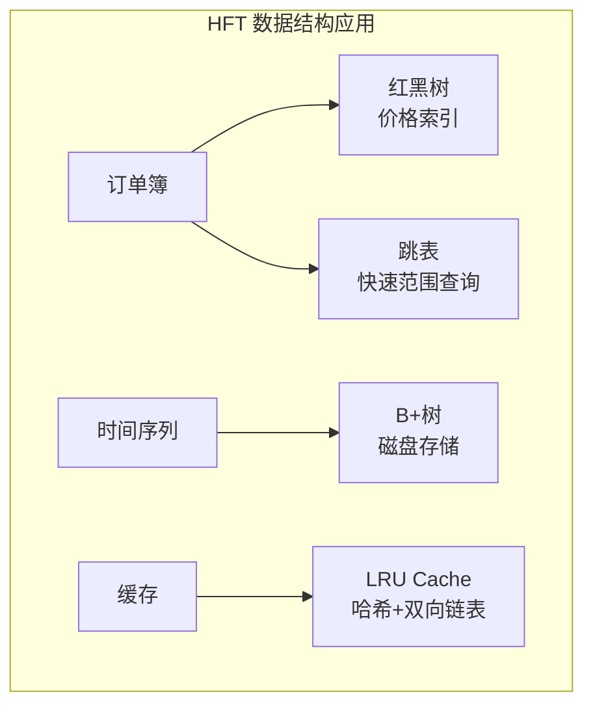
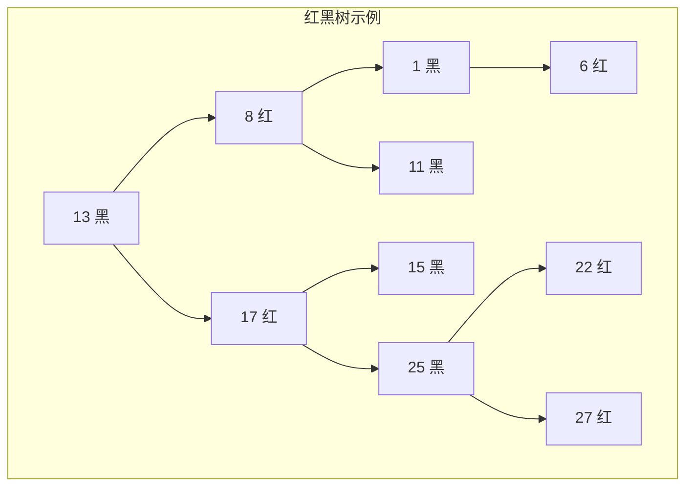

+++
title = "数据结构-红黑树与跳表"
date = 2026-02-02
weight = 46000
description = "高性能数据结构：红黑树、跳表、AVL树原理与实现"
[taxonomies]
tags = ["HFT", "数据结构", "红黑树", "跳表", "算法"]
+++

# 数据结构 - 红黑树与跳表

本文深入讲解 HFT 系统中常用的高性能数据结构：红黑树、跳表、AVL 树的原理、实现和应用场景。

---

## 一、平衡二叉搜索树概述

### 1.1 为什么需要平衡树

普通 BST 在最坏情况下退化为链表，时间复杂度 O(n)。

| 数据结构 | 查找 | 插入 | 删除 | 平衡性 |
|----------|------|------|------|--------|
| BST（最坏） | O(n) | O(n) | O(n) | 无保证 |
| AVL 树 | O(log n) | O(log n) | O(log n) | 严格平衡 |
| 红黑树 | O(log n) | O(log n) | O(log n) | 近似平衡 |
| 跳表 | O(log n) | O(log n) | O(log n) | 概率平衡 |

### 1.2 HFT 中的应用



---

## 二、红黑树

### 2.1 红黑树性质

红黑树是一种自平衡二叉搜索树，满足以下性质：

1. **节点颜色**：每个节点是红色或黑色
2. **根节点**：根节点是黑色
3. **叶节点**：所有叶节点（NIL）是黑色
4. **红色节点**：红色节点的子节点必须是黑色（无连续红节点）
5. **黑高**：从任一节点到其所有后代叶节点的路径上，黑色节点数相同



### 2.2 红黑树实现

```cpp
#include <functional>
#include <memory>

template<typename K, typename V, typename Compare = std::less<K>>
class RedBlackTree {
public:
    enum Color { RED, BLACK };
    
    struct Node {
        K key;
        V value;
        Color color;
        Node* left;
        Node* right;
        Node* parent;
        
        Node(const K& k, const V& v, Color c = RED)
            : key(k), value(v), color(c),
              left(nullptr), right(nullptr), parent(nullptr) {}
    };
    
    RedBlackTree() : root_(nullptr), size_(0) {}
    
    ~RedBlackTree() {
        destroy(root_);
    }
    
    // 插入
    void insert(const K& key, const V& value) {
        Node* node = new Node(key, value, RED);
        
        if (root_ == nullptr) {
            root_ = node;
            root_->color = BLACK;
            size_++;
            return;
        }
        
        // BST 插入
        Node* parent = nullptr;
        Node* current = root_;
        
        while (current != nullptr) {
            parent = current;
            if (compare_(key, current->key)) {
                current = current->left;
            } else if (compare_(current->key, key)) {
                current = current->right;
            } else {
                // 键已存在，更新值
                current->value = value;
                delete node;
                return;
            }
        }
        
        node->parent = parent;
        if (compare_(key, parent->key)) {
            parent->left = node;
        } else {
            parent->right = node;
        }
        
        size_++;
        insert_fixup(node);
    }
    
    // 查找
    V* find(const K& key) {
        Node* node = find_node(key);
        return node ? &node->value : nullptr;
    }
    
    // 删除
    bool remove(const K& key) {
        Node* node = find_node(key);
        if (node == nullptr) return false;
        
        remove_node(node);
        size_--;
        return true;
    }
    
    // 最小值
    std::pair<K, V>* minimum() {
        if (root_ == nullptr) return nullptr;
        Node* node = minimum(root_);
        return new std::pair<K, V>(node->key, node->value);
    }
    
    // 最大值
    std::pair<K, V>* maximum() {
        if (root_ == nullptr) return nullptr;
        Node* node = maximum(root_);
        return new std::pair<K, V>(node->key, node->value);
    }
    
    // 中序遍历
    template<typename Func>
    void inorder(Func&& func) {
        inorder_impl(root_, std::forward<Func>(func));
    }
    
    size_t size() const { return size_; }
    bool empty() const { return size_ == 0; }
    
private:
    Node* root_;
    size_t size_;
    Compare compare_;
    
    // 左旋
    void rotate_left(Node* x) {
        Node* y = x->right;
        x->right = y->left;
        
        if (y->left != nullptr) {
            y->left->parent = x;
        }
        
        y->parent = x->parent;
        
        if (x->parent == nullptr) {
            root_ = y;
        } else if (x == x->parent->left) {
            x->parent->left = y;
        } else {
            x->parent->right = y;
        }
        
        y->left = x;
        x->parent = y;
    }
    
    // 右旋
    void rotate_right(Node* y) {
        Node* x = y->left;
        y->left = x->right;
        
        if (x->right != nullptr) {
            x->right->parent = y;
        }
        
        x->parent = y->parent;
        
        if (y->parent == nullptr) {
            root_ = x;
        } else if (y == y->parent->left) {
            y->parent->left = x;
        } else {
            y->parent->right = x;
        }
        
        x->right = y;
        y->parent = x;
    }
    
    // 插入修复
    void insert_fixup(Node* z) {
        while (z->parent != nullptr && z->parent->color == RED) {
            if (z->parent == z->parent->parent->left) {
                Node* y = z->parent->parent->right;  // 叔节点
                
                if (y != nullptr && y->color == RED) {
                    // Case 1: 叔节点是红色
                    z->parent->color = BLACK;
                    y->color = BLACK;
                    z->parent->parent->color = RED;
                    z = z->parent->parent;
                } else {
                    if (z == z->parent->right) {
                        // Case 2: 叔节点黑色，z 是右孩子
                        z = z->parent;
                        rotate_left(z);
                    }
                    // Case 3: 叔节点黑色，z 是左孩子
                    z->parent->color = BLACK;
                    z->parent->parent->color = RED;
                    rotate_right(z->parent->parent);
                }
            } else {
                // 对称情况
                Node* y = z->parent->parent->left;
                
                if (y != nullptr && y->color == RED) {
                    z->parent->color = BLACK;
                    y->color = BLACK;
                    z->parent->parent->color = RED;
                    z = z->parent->parent;
                } else {
                    if (z == z->parent->left) {
                        z = z->parent;
                        rotate_right(z);
                    }
                    z->parent->color = BLACK;
                    z->parent->parent->color = RED;
                    rotate_left(z->parent->parent);
                }
            }
        }
        root_->color = BLACK;
    }
    
    // 删除节点
    void remove_node(Node* z) {
        Node* y = z;
        Node* x;
        Color y_original_color = y->color;
        
        if (z->left == nullptr) {
            x = z->right;
            transplant(z, z->right);
        } else if (z->right == nullptr) {
            x = z->left;
            transplant(z, z->left);
        } else {
            y = minimum(z->right);
            y_original_color = y->color;
            x = y->right;
            
            if (y->parent == z) {
                if (x) x->parent = y;
            } else {
                transplant(y, y->right);
                y->right = z->right;
                y->right->parent = y;
            }
            
            transplant(z, y);
            y->left = z->left;
            y->left->parent = y;
            y->color = z->color;
        }
        
        delete z;
        
        if (y_original_color == BLACK && x != nullptr) {
            delete_fixup(x);
        }
    }
    
    void transplant(Node* u, Node* v) {
        if (u->parent == nullptr) {
            root_ = v;
        } else if (u == u->parent->left) {
            u->parent->left = v;
        } else {
            u->parent->right = v;
        }
        if (v != nullptr) {
            v->parent = u->parent;
        }
    }
    
    void delete_fixup(Node* x) {
        while (x != root_ && x->color == BLACK) {
            if (x == x->parent->left) {
                Node* w = x->parent->right;
                
                if (w->color == RED) {
                    w->color = BLACK;
                    x->parent->color = RED;
                    rotate_left(x->parent);
                    w = x->parent->right;
                }
                
                if ((w->left == nullptr || w->left->color == BLACK) &&
                    (w->right == nullptr || w->right->color == BLACK)) {
                    w->color = RED;
                    x = x->parent;
                } else {
                    if (w->right == nullptr || w->right->color == BLACK) {
                        if (w->left) w->left->color = BLACK;
                        w->color = RED;
                        rotate_right(w);
                        w = x->parent->right;
                    }
                    w->color = x->parent->color;
                    x->parent->color = BLACK;
                    if (w->right) w->right->color = BLACK;
                    rotate_left(x->parent);
                    x = root_;
                }
            } else {
                // 对称情况
                Node* w = x->parent->left;
                
                if (w->color == RED) {
                    w->color = BLACK;
                    x->parent->color = RED;
                    rotate_right(x->parent);
                    w = x->parent->left;
                }
                
                if ((w->right == nullptr || w->right->color == BLACK) &&
                    (w->left == nullptr || w->left->color == BLACK)) {
                    w->color = RED;
                    x = x->parent;
                } else {
                    if (w->left == nullptr || w->left->color == BLACK) {
                        if (w->right) w->right->color = BLACK;
                        w->color = RED;
                        rotate_left(w);
                        w = x->parent->left;
                    }
                    w->color = x->parent->color;
                    x->parent->color = BLACK;
                    if (w->left) w->left->color = BLACK;
                    rotate_right(x->parent);
                    x = root_;
                }
            }
        }
        x->color = BLACK;
    }
    
    Node* find_node(const K& key) {
        Node* current = root_;
        while (current != nullptr) {
            if (compare_(key, current->key)) {
                current = current->left;
            } else if (compare_(current->key, key)) {
                current = current->right;
            } else {
                return current;
            }
        }
        return nullptr;
    }
    
    Node* minimum(Node* node) {
        while (node->left != nullptr) {
            node = node->left;
        }
        return node;
    }
    
    Node* maximum(Node* node) {
        while (node->right != nullptr) {
            node = node->right;
        }
        return node;
    }
    
    template<typename Func>
    void inorder_impl(Node* node, Func&& func) {
        if (node == nullptr) return;
        inorder_impl(node->left, func);
        func(node->key, node->value);
        inorder_impl(node->right, func);
    }
    
    void destroy(Node* node) {
        if (node == nullptr) return;
        destroy(node->left);
        destroy(node->right);
        delete node;
    }
};
```

### 2.3 红黑树在订单簿中的应用

```cpp
// 使用红黑树实现价格层级索引
class PriceLevelIndex {
public:
    using Price = int64_t;  // 定点数价格
    
    struct PriceLevel {
        Price price;
        int64_t total_quantity;
        int order_count;
    };
    
    // 买盘：价格降序
    void add_bid(Price price, int64_t quantity) {
        auto* level = bids_.find(price);
        if (level) {
            level->total_quantity += quantity;
            level->order_count++;
        } else {
            bids_.insert(price, {price, quantity, 1});
        }
    }
    
    // 卖盘：价格升序
    void add_ask(Price price, int64_t quantity) {
        auto* level = asks_.find(price);
        if (level) {
            level->total_quantity += quantity;
            level->order_count++;
        } else {
            asks_.insert(price, {price, quantity, 1});
        }
    }
    
    Price best_bid() const {
        auto* max = bids_.maximum();
        return max ? max->first : 0;
    }
    
    Price best_ask() const {
        auto* min = asks_.minimum();
        return min ? min->first : INT64_MAX;
    }
    
private:
    RedBlackTree<Price, PriceLevel, std::greater<Price>> bids_;
    RedBlackTree<Price, PriceLevel, std::less<Price>> asks_;
};
```

---

## 三、跳表（Skip List）

### 3.1 跳表原理

跳表是一种概率性数据结构，通过多层链表实现 O(log n) 的查找。

```
Level 3:  1 ─────────────────────────────> 9 ─────────> NIL
Level 2:  1 ────────> 4 ─────────────────> 9 ─────────> NIL
Level 1:  1 ──> 3 ──> 4 ──> 5 ──────────> 9 ─────────> NIL
Level 0:  1 ──> 2 ──> 3 ──> 4 ──> 5 ──> 7 ──> 8 ──> 9 ──> NIL
```

### 3.2 跳表实现

```cpp
#include <random>
#include <vector>
#include <limits>

template<typename K, typename V, typename Compare = std::less<K>>
class SkipList {
public:
    static constexpr int MAX_LEVEL = 16;
    static constexpr double P = 0.5;
    
    struct Node {
        K key;
        V value;
        std::vector<Node*> forward;
        
        Node(const K& k, const V& v, int level)
            : key(k), value(v), forward(level + 1, nullptr) {}
        
        Node(int level)
            : forward(level + 1, nullptr) {}
    };
    
    SkipList() 
        : level_(0), 
          size_(0),
          head_(new Node(MAX_LEVEL)),
          rng_(std::random_device{}()) {}
    
    ~SkipList() {
        Node* current = head_;
        while (current != nullptr) {
            Node* next = current->forward[0];
            delete current;
            current = next;
        }
    }
    
    // 查找
    V* find(const K& key) {
        Node* current = head_;
        
        for (int i = level_; i >= 0; i--) {
            while (current->forward[i] != nullptr &&
                   compare_(current->forward[i]->key, key)) {
                current = current->forward[i];
            }
        }
        
        current = current->forward[0];
        
        if (current != nullptr && !compare_(key, current->key) && 
            !compare_(current->key, key)) {
            return &current->value;
        }
        
        return nullptr;
    }
    
    // 插入
    void insert(const K& key, const V& value) {
        std::vector<Node*> update(MAX_LEVEL + 1);
        Node* current = head_;
        
        // 找到每层的前驱节点
        for (int i = level_; i >= 0; i--) {
            while (current->forward[i] != nullptr &&
                   compare_(current->forward[i]->key, key)) {
                current = current->forward[i];
            }
            update[i] = current;
        }
        
        current = current->forward[0];
        
        // 键已存在，更新值
        if (current != nullptr && !compare_(key, current->key) &&
            !compare_(current->key, key)) {
            current->value = value;
            return;
        }
        
        // 随机生成层级
        int new_level = random_level();
        
        if (new_level > level_) {
            for (int i = level_ + 1; i <= new_level; i++) {
                update[i] = head_;
            }
            level_ = new_level;
        }
        
        // 创建新节点
        Node* new_node = new Node(key, value, new_level);
        
        // 插入到每层
        for (int i = 0; i <= new_level; i++) {
            new_node->forward[i] = update[i]->forward[i];
            update[i]->forward[i] = new_node;
        }
        
        size_++;
    }
    
    // 删除
    bool remove(const K& key) {
        std::vector<Node*> update(MAX_LEVEL + 1);
        Node* current = head_;
        
        for (int i = level_; i >= 0; i--) {
            while (current->forward[i] != nullptr &&
                   compare_(current->forward[i]->key, key)) {
                current = current->forward[i];
            }
            update[i] = current;
        }
        
        current = current->forward[0];
        
        if (current == nullptr || compare_(key, current->key) ||
            compare_(current->key, key)) {
            return false;
        }
        
        // 从每层删除
        for (int i = 0; i <= level_; i++) {
            if (update[i]->forward[i] != current) break;
            update[i]->forward[i] = current->forward[i];
        }
        
        delete current;
        
        // 调整层级
        while (level_ > 0 && head_->forward[level_] == nullptr) {
            level_--;
        }
        
        size_--;
        return true;
    }
    
    // 范围查询
    template<typename Func>
    void range_query(const K& start, const K& end, Func&& func) {
        Node* current = head_;
        
        // 找到起始位置
        for (int i = level_; i >= 0; i--) {
            while (current->forward[i] != nullptr &&
                   compare_(current->forward[i]->key, start)) {
                current = current->forward[i];
            }
        }
        
        current = current->forward[0];
        
        // 遍历范围内的元素
        while (current != nullptr && !compare_(end, current->key)) {
            func(current->key, current->value);
            current = current->forward[0];
        }
    }
    
    // 获取排名（第 k 小的元素）
    std::pair<K, V>* get_by_rank(size_t rank) {
        if (rank >= size_) return nullptr;
        
        Node* current = head_->forward[0];
        for (size_t i = 0; i < rank && current != nullptr; i++) {
            current = current->forward[0];
        }
        
        if (current == nullptr) return nullptr;
        return new std::pair<K, V>(current->key, current->value);
    }
    
    size_t size() const { return size_; }
    bool empty() const { return size_ == 0; }
    
private:
    int random_level() {
        int level = 0;
        std::uniform_real_distribution<double> dist(0, 1);
        
        while (dist(rng_) < P && level < MAX_LEVEL) {
            level++;
        }
        
        return level;
    }
    
    int level_;
    size_t size_;
    Node* head_;
    Compare compare_;
    std::mt19937 rng_;
};
```

### 3.3 跳表的优化版本

```cpp
// 缓存友好的跳表
template<typename K, typename V>
class CacheFriendlySkipList {
public:
    static constexpr int MAX_LEVEL = 16;
    
    // 节点内存连续分配
    struct alignas(64) Node {
        K key;
        V value;
        int level;
        Node* forward[MAX_LEVEL + 1];
        
        Node(const K& k, const V& v, int lvl)
            : key(k), value(v), level(lvl) {
            std::fill(forward, forward + lvl + 1, nullptr);
        }
    };
    
    // 内存池分配
    Node* allocate_node(const K& key, const V& value, int level) {
        if (free_list_) {
            Node* node = free_list_;
            free_list_ = free_list_->forward[0];
            new (node) Node(key, value, level);
            return node;
        }
        return new Node(key, value, level);
    }
    
    void deallocate_node(Node* node) {
        node->~Node();
        node->forward[0] = free_list_;
        free_list_ = node;
    }
    
private:
    Node* free_list_ = nullptr;
};
```

---

## 四、AVL 树

### 4.1 AVL 树性质

AVL 树是严格平衡的二叉搜索树，任意节点的左右子树高度差不超过 1。

### 4.2 AVL 树实现

```cpp
template<typename K, typename V>
class AVLTree {
public:
    struct Node {
        K key;
        V value;
        int height;
        Node* left;
        Node* right;
        
        Node(const K& k, const V& v)
            : key(k), value(v), height(1), left(nullptr), right(nullptr) {}
    };
    
    void insert(const K& key, const V& value) {
        root_ = insert_impl(root_, key, value);
    }
    
    void remove(const K& key) {
        root_ = remove_impl(root_, key);
    }
    
    V* find(const K& key) {
        Node* node = root_;
        while (node != nullptr) {
            if (key < node->key) {
                node = node->left;
            } else if (key > node->key) {
                node = node->right;
            } else {
                return &node->value;
            }
        }
        return nullptr;
    }
    
private:
    Node* root_ = nullptr;
    
    int height(Node* node) {
        return node ? node->height : 0;
    }
    
    int balance_factor(Node* node) {
        return node ? height(node->left) - height(node->right) : 0;
    }
    
    void update_height(Node* node) {
        node->height = 1 + std::max(height(node->left), height(node->right));
    }
    
    Node* rotate_right(Node* y) {
        Node* x = y->left;
        Node* T2 = x->right;
        
        x->right = y;
        y->left = T2;
        
        update_height(y);
        update_height(x);
        
        return x;
    }
    
    Node* rotate_left(Node* x) {
        Node* y = x->right;
        Node* T2 = y->left;
        
        y->left = x;
        x->right = T2;
        
        update_height(x);
        update_height(y);
        
        return y;
    }
    
    Node* rebalance(Node* node) {
        update_height(node);
        int bf = balance_factor(node);
        
        // 左左情况
        if (bf > 1 && balance_factor(node->left) >= 0) {
            return rotate_right(node);
        }
        
        // 左右情况
        if (bf > 1 && balance_factor(node->left) < 0) {
            node->left = rotate_left(node->left);
            return rotate_right(node);
        }
        
        // 右右情况
        if (bf < -1 && balance_factor(node->right) <= 0) {
            return rotate_left(node);
        }
        
        // 右左情况
        if (bf < -1 && balance_factor(node->right) > 0) {
            node->right = rotate_right(node->right);
            return rotate_left(node);
        }
        
        return node;
    }
    
    Node* insert_impl(Node* node, const K& key, const V& value) {
        if (node == nullptr) {
            return new Node(key, value);
        }
        
        if (key < node->key) {
            node->left = insert_impl(node->left, key, value);
        } else if (key > node->key) {
            node->right = insert_impl(node->right, key, value);
        } else {
            node->value = value;
            return node;
        }
        
        return rebalance(node);
    }
    
    Node* min_node(Node* node) {
        while (node->left != nullptr) {
            node = node->left;
        }
        return node;
    }
    
    Node* remove_impl(Node* node, const K& key) {
        if (node == nullptr) return nullptr;
        
        if (key < node->key) {
            node->left = remove_impl(node->left, key);
        } else if (key > node->key) {
            node->right = remove_impl(node->right, key);
        } else {
            if (node->left == nullptr || node->right == nullptr) {
                Node* temp = node->left ? node->left : node->right;
                delete node;
                return temp;
            }
            
            Node* temp = min_node(node->right);
            node->key = temp->key;
            node->value = temp->value;
            node->right = remove_impl(node->right, temp->key);
        }
        
        return rebalance(node);
    }
};
```

---

## 五、性能对比

### 5.1 理论复杂度

| 操作 | 红黑树 | AVL 树 | 跳表 |
|------|--------|--------|------|
| 查找 | O(log n) | O(log n) | O(log n) 期望 |
| 插入 | O(log n) | O(log n) | O(log n) 期望 |
| 删除 | O(log n) | O(log n) | O(log n) 期望 |
| 范围查询 | O(log n + k) | O(log n + k) | O(log n + k) |
| 空间 | O(n) | O(n) | O(n log n) 期望 |

### 5.2 实际性能测试

```cpp
#include <chrono>
#include <map>

void benchmark() {
    const int N = 1000000;
    std::vector<int> keys(N);
    std::iota(keys.begin(), keys.end(), 0);
    std::shuffle(keys.begin(), keys.end(), std::mt19937{42});
    
    // std::map (红黑树)
    {
        std::map<int, int> m;
        auto start = std::chrono::high_resolution_clock::now();
        
        for (int k : keys) {
            m[k] = k;
        }
        
        auto end = std::chrono::high_resolution_clock::now();
        auto duration = std::chrono::duration_cast<std::chrono::milliseconds>(end - start);
        std::cout << "std::map insert: " << duration.count() << " ms\n";
    }
    
    // 跳表
    {
        SkipList<int, int> sl;
        auto start = std::chrono::high_resolution_clock::now();
        
        for (int k : keys) {
            sl.insert(k, k);
        }
        
        auto end = std::chrono::high_resolution_clock::now();
        auto duration = std::chrono::duration_cast<std::chrono::milliseconds>(end - start);
        std::cout << "SkipList insert: " << duration.count() << " ms\n";
    }
}
```

---

## 六、面试常见问题

**Q: 红黑树和 AVL 树的区别？何时选择哪个？**

| 特性 | 红黑树 | AVL 树 |
|------|--------|--------|
| 平衡程度 | 近似平衡 | 严格平衡 |
| 查找性能 | 略慢 | 更快 |
| 插入/删除 | 更快（旋转少） | 较慢（可能多次旋转） |
| 适用场景 | 插入/删除频繁 | 查找频繁 |

**Q: 为什么 Linux 内核和 std::map 使用红黑树？**

A: 红黑树在插入和删除时平均只需要 O(1) 次旋转（最坏 O(log n)），而 AVL 可能需要 O(log n) 次旋转。对于频繁修改的场景，红黑树性能更好。

**Q: 跳表相比红黑树有什么优势？**

A:
1. 实现简单，代码量少
2. 支持高效的范围查询
3. 并发友好（可以实现无锁版本）
4. 缓存友好（顺序访问）

---

## 相关文章

- [HFT面试题-算法与数据结构](@/articles/hft/hft-23-HFT面试题-算法与数据结构.md)
- [HFT笔试题-订单簿与撮合](@/articles/hft/hft-41-HFT笔试题-订单簿与撮合.md)
- [OrderBook实现详解](@/articles/hft/hft-13-OrderBook实现详解.md)
