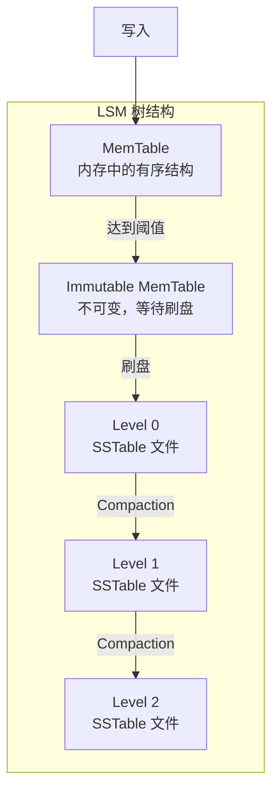

+++
title = "47. 数据结构-B+树与LSM树"
date = 2026-02-02
weight = 47000
description = "存储数据结构：B+树、LSM树、时间序列存储、磁盘优化"
[taxonomies]
tags = ["HFT", "数据结构", "B+树", "LSM", "存储"]
+++

# 数据结构 - B+树与LSM树

本文深入讲解存储系统中的核心数据结构：B+树、LSM树，以及在时间序列数据存储中的应用。

---

## 一、B+树

### 1.1 B+树概述

B+树是为磁盘存储优化的多路平衡搜索树，广泛用于数据库索引。

**特点**：
- 所有数据存储在叶子节点
- 叶子节点通过链表连接
- 内部节点只存储键（索引）
- 高扇出，树高度低

```mermaid
graph TD
    subgraph "B+树结构"
        ROOT[30 | 60]
        
        N1[10 | 20]
        N2[40 | 50]
        N3[70 | 80]
        
        L1[5,10]
        L2[15,20]
        L3[25,30]
        L4[35,40]
        L5[45,50]
        L6[55,60]
        L7[65,70]
        L8[75,80]
        L9[85,90]
    end
    
    ROOT --> N1
    ROOT --> N2
    ROOT --> N3
    
    N1 --> L1
    N1 --> L2
    N1 --> L3
    
    N2 --> L4
    N2 --> L5
    N2 --> L6
    
    N3 --> L7
    N3 --> L8
    N3 --> L9
    
    L1 -.-> L2
    L2 -.-> L3
    L3 -.-> L4
    L4 -.-> L5
    L5 -.-> L6
    L6 -.-> L7
    L7 -.-> L8
    L8 -.-> L9
```

### 1.2 B+树实现

```cpp
#include <vector>
#include <algorithm>

template<typename K, typename V, int ORDER = 4>
class BPlusTree {
public:
    static constexpr int MIN_KEYS = (ORDER + 1) / 2 - 1;
    static constexpr int MAX_KEYS = ORDER - 1;
    
    struct Node {
        bool is_leaf;
        std::vector<K> keys;
        Node* parent;
        
        virtual ~Node() = default;
        
        Node(bool leaf) : is_leaf(leaf), parent(nullptr) {}
    };
    
    struct InternalNode : Node {
        std::vector<Node*> children;
        
        InternalNode() : Node(false) {}
    };
    
    struct LeafNode : Node {
        std::vector<V> values;
        LeafNode* next;
        LeafNode* prev;
        
        LeafNode() : Node(true), next(nullptr), prev(nullptr) {}
    };
    
    BPlusTree() : root_(new LeafNode()) {}
    
    // 查找
    V* find(const K& key) {
        LeafNode* leaf = find_leaf(key);
        
        for (size_t i = 0; i < leaf->keys.size(); i++) {
            if (leaf->keys[i] == key) {
                return &leaf->values[i];
            }
        }
        
        return nullptr;
    }
    
    // 插入
    void insert(const K& key, const V& value) {
        LeafNode* leaf = find_leaf(key);
        
        // 检查是否已存在
        for (size_t i = 0; i < leaf->keys.size(); i++) {
            if (leaf->keys[i] == key) {
                leaf->values[i] = value;
                return;
            }
        }
        
        // 找到插入位置
        auto pos = std::lower_bound(leaf->keys.begin(), leaf->keys.end(), key);
        size_t idx = pos - leaf->keys.begin();
        
        leaf->keys.insert(pos, key);
        leaf->values.insert(leaf->values.begin() + idx, value);
        
        // 检查是否需要分裂
        if (leaf->keys.size() > MAX_KEYS) {
            split_leaf(leaf);
        }
    }
    
    // 范围查询
    template<typename Func>
    void range_query(const K& start, const K& end, Func&& func) {
        LeafNode* leaf = find_leaf(start);
        
        while (leaf != nullptr) {
            for (size_t i = 0; i < leaf->keys.size(); i++) {
                if (leaf->keys[i] > end) return;
                if (leaf->keys[i] >= start) {
                    func(leaf->keys[i], leaf->values[i]);
                }
            }
            leaf = leaf->next;
        }
    }
    
    // 删除
    bool remove(const K& key) {
        LeafNode* leaf = find_leaf(key);
        
        auto it = std::find(leaf->keys.begin(), leaf->keys.end(), key);
        if (it == leaf->keys.end()) {
            return false;
        }
        
        size_t idx = it - leaf->keys.begin();
        leaf->keys.erase(it);
        leaf->values.erase(leaf->values.begin() + idx);
        
        // 检查是否需要合并或借用
        if (leaf != root_ && leaf->keys.size() < MIN_KEYS) {
            rebalance_leaf(leaf);
        }
        
        return true;
    }
    
private:
    Node* root_;
    
    LeafNode* find_leaf(const K& key) {
        Node* node = root_;
        
        while (!node->is_leaf) {
            InternalNode* internal = static_cast<InternalNode*>(node);
            
            size_t i = 0;
            while (i < internal->keys.size() && key >= internal->keys[i]) {
                i++;
            }
            
            node = internal->children[i];
        }
        
        return static_cast<LeafNode*>(node);
    }
    
    void split_leaf(LeafNode* leaf) {
        LeafNode* new_leaf = new LeafNode();
        
        // 分裂点
        size_t mid = leaf->keys.size() / 2;
        
        // 移动后半部分到新节点
        new_leaf->keys.assign(leaf->keys.begin() + mid, leaf->keys.end());
        new_leaf->values.assign(leaf->values.begin() + mid, leaf->values.end());
        
        leaf->keys.resize(mid);
        leaf->values.resize(mid);
        
        // 更新链表指针
        new_leaf->next = leaf->next;
        new_leaf->prev = leaf;
        if (leaf->next) leaf->next->prev = new_leaf;
        leaf->next = new_leaf;
        
        // 上推键到父节点
        K push_up_key = new_leaf->keys[0];
        insert_into_parent(leaf, push_up_key, new_leaf);
    }
    
    void insert_into_parent(Node* left, const K& key, Node* right) {
        if (left == root_) {
            // 创建新根
            InternalNode* new_root = new InternalNode();
            new_root->keys.push_back(key);
            new_root->children.push_back(left);
            new_root->children.push_back(right);
            
            left->parent = new_root;
            right->parent = new_root;
            root_ = new_root;
            return;
        }
        
        InternalNode* parent = static_cast<InternalNode*>(left->parent);
        
        // 找到插入位置
        auto pos = std::lower_bound(parent->keys.begin(), parent->keys.end(), key);
        size_t idx = pos - parent->keys.begin();
        
        parent->keys.insert(pos, key);
        parent->children.insert(parent->children.begin() + idx + 1, right);
        right->parent = parent;
        
        // 检查是否需要分裂
        if (parent->keys.size() > MAX_KEYS) {
            split_internal(parent);
        }
    }
    
    void split_internal(InternalNode* node) {
        InternalNode* new_node = new InternalNode();
        
        size_t mid = node->keys.size() / 2;
        K push_up_key = node->keys[mid];
        
        // 移动后半部分
        new_node->keys.assign(node->keys.begin() + mid + 1, node->keys.end());
        new_node->children.assign(node->children.begin() + mid + 1, node->children.end());
        
        node->keys.resize(mid);
        node->children.resize(mid + 1);
        
        // 更新子节点的父指针
        for (Node* child : new_node->children) {
            child->parent = new_node;
        }
        
        insert_into_parent(node, push_up_key, new_node);
    }
    
    void rebalance_leaf(LeafNode* leaf) {
        // 尝试从兄弟节点借用或合并
        InternalNode* parent = static_cast<InternalNode*>(leaf->parent);
        
        size_t idx = 0;
        for (; idx < parent->children.size(); idx++) {
            if (parent->children[idx] == leaf) break;
        }
        
        // 尝试从左兄弟借用
        if (idx > 0) {
            LeafNode* left_sibling = static_cast<LeafNode*>(parent->children[idx - 1]);
            if (left_sibling->keys.size() > MIN_KEYS) {
                // 借用最后一个元素
                leaf->keys.insert(leaf->keys.begin(), left_sibling->keys.back());
                leaf->values.insert(leaf->values.begin(), left_sibling->values.back());
                left_sibling->keys.pop_back();
                left_sibling->values.pop_back();
                
                parent->keys[idx - 1] = leaf->keys[0];
                return;
            }
        }
        
        // 尝试从右兄弟借用
        if (idx < parent->children.size() - 1) {
            LeafNode* right_sibling = static_cast<LeafNode*>(parent->children[idx + 1]);
            if (right_sibling->keys.size() > MIN_KEYS) {
                // 借用第一个元素
                leaf->keys.push_back(right_sibling->keys[0]);
                leaf->values.push_back(right_sibling->values[0]);
                right_sibling->keys.erase(right_sibling->keys.begin());
                right_sibling->values.erase(right_sibling->values.begin());
                
                parent->keys[idx] = right_sibling->keys[0];
                return;
            }
        }
        
        // 需要合并
        merge_leaves(leaf, idx);
    }
    
    void merge_leaves(LeafNode* leaf, size_t idx);
};
```

### 1.3 磁盘优化的 B+树

```cpp
// 磁盘页面大小
constexpr size_t PAGE_SIZE = 4096;

template<typename K, typename V>
class DiskBPlusTree {
public:
    // 计算每个节点能容纳的键数
    static constexpr size_t KEYS_PER_NODE = 
        (PAGE_SIZE - sizeof(bool) - sizeof(uint32_t) * 2) / 
        (sizeof(K) + sizeof(uint32_t));
    
    struct DiskNode {
        bool is_leaf;
        uint32_t num_keys;
        uint32_t next_page;  // 用于叶子节点链表
        K keys[KEYS_PER_NODE];
        union {
            uint32_t children[KEYS_PER_NODE + 1];  // 内部节点
            V values[KEYS_PER_NODE];               // 叶子节点
        };
    };
    
    static_assert(sizeof(DiskNode) <= PAGE_SIZE, "Node too large");
    
    // 页面缓存
    class PageCache {
    public:
        DiskNode* get_page(uint32_t page_id) {
            auto it = cache_.find(page_id);
            if (it != cache_.end()) {
                return &it->second;
            }
            
            // 从磁盘读取
            DiskNode node;
            read_page(page_id, &node);
            cache_[page_id] = node;
            return &cache_[page_id];
        }
        
        void flush_page(uint32_t page_id) {
            auto it = cache_.find(page_id);
            if (it != cache_.end()) {
                write_page(page_id, &it->second);
            }
        }
        
    private:
        std::unordered_map<uint32_t, DiskNode> cache_;
        
        void read_page(uint32_t page_id, DiskNode* node);
        void write_page(uint32_t page_id, const DiskNode* node);
    };
};
```

---

## 二、LSM树

### 2.1 LSM树概述

**LSM树（Log-Structured Merge Tree）**是为写密集型负载优化的数据结构。



**特点**：
- 写入先进 MemTable（内存）
- 批量刷盘为 SSTable（磁盘）
- 后台合并压缩
- 牺牲读性能换取写性能

### 2.2 LSM树实现

```cpp
#include <map>
#include <set>
#include <fstream>
#include <mutex>

template<typename K, typename V>
class LSMTree {
public:
    static constexpr size_t MEMTABLE_SIZE_LIMIT = 4 * 1024 * 1024;  // 4MB
    static constexpr int MAX_LEVEL = 7;
    static constexpr int LEVEL_SIZE_RATIO = 10;
    
    struct Entry {
        K key;
        V value;
        bool deleted;
        uint64_t sequence;
    };
    
    // MemTable - 使用跳表或红黑树
    class MemTable {
    public:
        void put(const K& key, const V& value, uint64_t seq) {
            entries_[key] = {key, value, false, seq};
            size_ += sizeof(K) + sizeof(V);
        }
        
        void remove(const K& key, uint64_t seq) {
            entries_[key] = {key, V{}, true, seq};
            size_ += sizeof(K);
        }
        
        std::optional<Entry> get(const K& key) const {
            auto it = entries_.find(key);
            if (it != entries_.end()) {
                return it->second;
            }
            return std::nullopt;
        }
        
        size_t size() const { return size_; }
        
        const std::map<K, Entry>& entries() const { return entries_; }
        
    private:
        std::map<K, Entry> entries_;
        size_t size_ = 0;
    };
    
    // SSTable - 磁盘上的有序文件
    class SSTable {
    public:
        struct Footer {
            uint64_t index_offset;
            uint64_t bloom_offset;
            uint64_t num_entries;
        };
        
        static SSTable* create(const std::string& path, 
                               const std::vector<Entry>& entries) {
            SSTable* sst = new SSTable(path);
            
            std::ofstream file(path, std::ios::binary);
            
            // 写入数据块
            std::vector<std::pair<K, uint64_t>> index;
            uint64_t offset = 0;
            
            for (const auto& entry : entries) {
                index.push_back({entry.key, offset});
                
                // 序列化 entry
                file.write(reinterpret_cast<const char*>(&entry), sizeof(entry));
                offset += sizeof(entry);
            }
            
            // 写入索引
            Footer footer;
            footer.index_offset = offset;
            footer.num_entries = entries.size();
            
            for (const auto& [key, off] : index) {
                file.write(reinterpret_cast<const char*>(&key), sizeof(key));
                file.write(reinterpret_cast<const char*>(&off), sizeof(off));
            }
            
            footer.bloom_offset = file.tellp();
            
            // 写入布隆过滤器
            sst->build_bloom_filter(entries);
            file.write(reinterpret_cast<const char*>(sst->bloom_.data()),
                      sst->bloom_.size());
            
            // 写入 footer
            file.write(reinterpret_cast<const char*>(&footer), sizeof(footer));
            
            sst->footer_ = footer;
            sst->index_ = std::move(index);
            
            return sst;
        }
        
        std::optional<Entry> get(const K& key) {
            // 先检查布隆过滤器
            if (!may_contain(key)) {
                return std::nullopt;
            }
            
            // 二分查找索引
            auto it = std::lower_bound(index_.begin(), index_.end(), key,
                [](const auto& p, const K& k) { return p.first < k; });
            
            if (it == index_.end() || it->first != key) {
                return std::nullopt;
            }
            
            // 读取数据
            std::ifstream file(path_, std::ios::binary);
            file.seekg(it->second);
            
            Entry entry;
            file.read(reinterpret_cast<char*>(&entry), sizeof(entry));
            
            return entry;
        }
        
        K min_key() const { return index_.front().first; }
        K max_key() const { return index_.back().first; }
        
    private:
        SSTable(const std::string& path) : path_(path) {}
        
        void build_bloom_filter(const std::vector<Entry>& entries);
        bool may_contain(const K& key) const;
        
        std::string path_;
        Footer footer_;
        std::vector<std::pair<K, uint64_t>> index_;
        std::vector<uint8_t> bloom_;
    };
    
    // 主要接口
    void put(const K& key, const V& value) {
        std::lock_guard<std::mutex> lock(mutex_);
        
        memtable_.put(key, value, sequence_++);
        
        if (memtable_.size() >= MEMTABLE_SIZE_LIMIT) {
            flush_memtable();
        }
    }
    
    void remove(const K& key) {
        std::lock_guard<std::mutex> lock(mutex_);
        memtable_.remove(key, sequence_++);
    }
    
    std::optional<V> get(const K& key) {
        std::lock_guard<std::mutex> lock(mutex_);
        
        // 1. 检查 MemTable
        if (auto entry = memtable_.get(key)) {
            if (entry->deleted) return std::nullopt;
            return entry->value;
        }
        
        // 2. 检查 Immutable MemTable
        if (immutable_memtable_) {
            if (auto entry = immutable_memtable_->get(key)) {
                if (entry->deleted) return std::nullopt;
                return entry->value;
            }
        }
        
        // 3. 从 Level 0 开始搜索 SSTable
        for (int level = 0; level < MAX_LEVEL; level++) {
            for (auto& sst : levels_[level]) {
                if (key >= sst->min_key() && key <= sst->max_key()) {
                    if (auto entry = sst->get(key)) {
                        if (entry->deleted) return std::nullopt;
                        return entry->value;
                    }
                }
            }
        }
        
        return std::nullopt;
    }
    
private:
    void flush_memtable() {
        // 将当前 MemTable 设为不可变
        immutable_memtable_ = std::make_unique<MemTable>(std::move(memtable_));
        memtable_ = MemTable();
        
        // 异步刷盘
        std::thread([this]() {
            std::vector<Entry> entries;
            for (const auto& [k, e] : immutable_memtable_->entries()) {
                entries.push_back(e);
            }
            
            std::string path = generate_sst_path(0);
            auto* sst = SSTable::create(path, entries);
            
            {
                std::lock_guard<std::mutex> lock(mutex_);
                levels_[0].push_back(std::unique_ptr<SSTable>(sst));
                immutable_memtable_.reset();
            }
            
            maybe_compact();
        }).detach();
    }
    
    void maybe_compact() {
        for (int level = 0; level < MAX_LEVEL - 1; level++) {
            size_t max_size = level_max_size(level);
            
            if (level_size(level) > max_size) {
                compact(level);
            }
        }
    }
    
    void compact(int level);
    size_t level_size(int level) const;
    size_t level_max_size(int level) const;
    std::string generate_sst_path(int level);
    
    MemTable memtable_;
    std::unique_ptr<MemTable> immutable_memtable_;
    std::vector<std::unique_ptr<SSTable>> levels_[MAX_LEVEL];
    uint64_t sequence_ = 0;
    std::mutex mutex_;
};
```

### 2.3 布隆过滤器

```cpp
class BloomFilter {
public:
    BloomFilter(size_t num_bits, int num_hashes)
        : bits_(num_bits, false), num_hashes_(num_hashes) {}
    
    template<typename K>
    void add(const K& key) {
        for (int i = 0; i < num_hashes_; i++) {
            size_t hash = hash_func(key, i) % bits_.size();
            bits_[hash] = true;
        }
    }
    
    template<typename K>
    bool may_contain(const K& key) const {
        for (int i = 0; i < num_hashes_; i++) {
            size_t hash = hash_func(key, i) % bits_.size();
            if (!bits_[hash]) return false;
        }
        return true;
    }
    
    // 计算最优参数
    static std::pair<size_t, int> optimal_params(size_t n, double fp_rate) {
        // m = -n * ln(p) / (ln(2))^2
        size_t m = static_cast<size_t>(-n * std::log(fp_rate) / 
                                       (std::log(2) * std::log(2)));
        // k = m/n * ln(2)
        int k = static_cast<int>(static_cast<double>(m) / n * std::log(2));
        return {m, std::max(1, k)};
    }
    
private:
    template<typename K>
    size_t hash_func(const K& key, int i) const {
        std::hash<K> hasher;
        size_t h1 = hasher(key);
        size_t h2 = hasher(key) * 31 + 17;
        return h1 + i * h2;
    }
    
    std::vector<bool> bits_;
    int num_hashes_;
};
```

---

## 三、时间序列存储

### 3.1 时间序列数据结构

```cpp
// 时间序列专用存储
class TimeSeriesStore {
public:
    struct DataPoint {
        uint64_t timestamp;
        double value;
    };
    
    // 按时间分块存储
    struct TimeBlock {
        uint64_t start_time;
        uint64_t end_time;
        std::vector<DataPoint> points;
        
        // Delta-of-Delta 压缩
        std::vector<uint8_t> compress() const {
            std::vector<uint8_t> compressed;
            
            if (points.empty()) return compressed;
            
            // 第一个时间戳完整存储
            encode_varint(compressed, points[0].timestamp);
            encode_double(compressed, points[0].value);
            
            if (points.size() == 1) return compressed;
            
            // 第二个存储 delta
            int64_t prev_delta = points[1].timestamp - points[0].timestamp;
            encode_varint(compressed, prev_delta);
            encode_xor_double(compressed, points[0].value, points[1].value);
            
            // 后续存储 delta-of-delta
            for (size_t i = 2; i < points.size(); i++) {
                int64_t delta = points[i].timestamp - points[i-1].timestamp;
                int64_t dod = delta - prev_delta;
                
                encode_zigzag(compressed, dod);
                encode_xor_double(compressed, points[i-1].value, points[i].value);
                
                prev_delta = delta;
            }
            
            return compressed;
        }
    };
    
    void insert(const std::string& metric, uint64_t timestamp, double value) {
        auto& series = series_[metric];
        
        // 检查是否需要新块
        if (series.empty() || 
            timestamp >= series.back().end_time) {
            series.push_back(create_new_block(timestamp));
        }
        
        series.back().points.push_back({timestamp, value});
        series.back().end_time = timestamp + BLOCK_DURATION;
    }
    
    std::vector<DataPoint> query(const std::string& metric,
                                  uint64_t start, uint64_t end) {
        std::vector<DataPoint> result;
        
        auto it = series_.find(metric);
        if (it == series_.end()) return result;
        
        for (const auto& block : it->second) {
            if (block.end_time < start) continue;
            if (block.start_time > end) break;
            
            for (const auto& point : block.points) {
                if (point.timestamp >= start && point.timestamp <= end) {
                    result.push_back(point);
                }
            }
        }
        
        return result;
    }
    
private:
    static constexpr uint64_t BLOCK_DURATION = 2 * 3600 * 1000;  // 2 小时
    
    TimeBlock create_new_block(uint64_t timestamp) {
        TimeBlock block;
        block.start_time = timestamp - (timestamp % BLOCK_DURATION);
        block.end_time = block.start_time + BLOCK_DURATION;
        return block;
    }
    
    void encode_varint(std::vector<uint8_t>& buf, uint64_t value);
    void encode_double(std::vector<uint8_t>& buf, double value);
    void encode_zigzag(std::vector<uint8_t>& buf, int64_t value);
    void encode_xor_double(std::vector<uint8_t>& buf, double prev, double curr);
    
    std::unordered_map<std::string, std::vector<TimeBlock>> series_;
};
```

---

## 四、性能对比

| 特性 | B+树 | LSM树 |
|------|------|-------|
| 写入性能 | 中等（随机 I/O） | 高（顺序 I/O） |
| 读取性能 | 高 | 中等（可能多次查找） |
| 空间放大 | 低 | 中等（多版本） |
| 写放大 | 低 | 高（Compaction） |
| 适用场景 | 读多写少 | 写多读少 |
| 代表系统 | MySQL, PostgreSQL | LevelDB, RocksDB |

---

## 五、面试常见问题

**Q: B+树为什么比 B 树更适合数据库？**

A:
1. 所有数据在叶子节点，范围查询高效
2. 叶子节点链表支持顺序遍历
3. 内部节点更小，扇出更高，树更矮

**Q: LSM 树的写放大问题如何解决？**

A:
1. 调整 Compaction 策略（Leveled vs Tiered）
2. 增大 MemTable 大小减少刷盘频率
3. 使用 SSD 减轻随机写惩罚

---

## 相关文章

- [数据结构-红黑树与跳表](@/articles/hft/hft-46-数据结构-红黑树与跳表.md)
- [高性能序列化技术](@/articles/hft/hft-20-高性能序列化技术.md)
- [HFT笔试题-订单簿与撮合](@/articles/hft/hft-41-HFT笔试题-订单簿与撮合.md)
