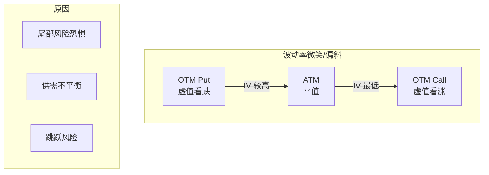

+++
title = "53.波动率建模与曲面"
date = 2026-02-02
description = "波动率建模：波动率微笑、曲面、局部波动率、随机波动率模型"
[taxonomies]
tags = ["HFT", "波动率", "期权", "SABR", "Heston"]
+++

# 波动率建模与曲面

本文深入讲解波动率建模技术，包括波动率微笑、曲面构建、局部波动率和随机波动率模型。

---

## 一、波动率基础

### 1.1 波动率类型

| 类型 | 描述 | 计算方式 |
|------|------|----------|
| 历史波动率 | 过去价格的实际波动 | 收益率标准差 |
| 隐含波动率 | 市场期权价格反推 | 期权定价公式反解 |
| 实现波动率 | 未来实际波动 | 事后计算 |
| 预测波动率 | 模型预测 | GARCH 等模型 |

### 1.2 波动率微笑

Black-Scholes 模型假设波动率恒定，但实际市场观察到：



---

## 二、波动率曲面

### 2.1 曲面构建

```cpp
#include <vector>
#include <map>
#include <cmath>

class VolatilitySurface {
public:
    struct Quote {
        double strike;
        double expiry;
        double iv;
        double bid_iv;
        double ask_iv;
    };
    
    // 添加市场报价
    void add_quote(double K, double T, double iv, 
                   double bid_iv = 0, double ask_iv = 0) {
        quotes_.push_back({K, T, iv, bid_iv, ask_iv});
    }
    
    // 双线性插值
    double interpolate_bilinear(double K, double T) const {
        // 找到包围的四个点
        auto [K_lo, K_hi] = find_bracket_strike(K);
        auto [T_lo, T_hi] = find_bracket_expiry(T);
        
        double iv_ll = get_iv(K_lo, T_lo);
        double iv_lh = get_iv(K_lo, T_hi);
        double iv_hl = get_iv(K_hi, T_lo);
        double iv_hh = get_iv(K_hi, T_hi);
        
        // 双线性插值
        double t = (T - T_lo) / (T_hi - T_lo);
        double k = (K - K_lo) / (K_hi - K_lo);
        
        double iv_l = iv_ll * (1 - t) + iv_lh * t;
        double iv_h = iv_hl * (1 - t) + iv_hh * t;
        
        return iv_l * (1 - k) + iv_h * k;
    }
    
    // 方差插值（更平滑）
    double interpolate_variance(double K, double T) const {
        auto [K_lo, K_hi] = find_bracket_strike(K);
        auto [T_lo, T_hi] = find_bracket_expiry(T);
        
        // 使用总方差插值
        double var_ll = get_iv(K_lo, T_lo) * get_iv(K_lo, T_lo) * T_lo;
        double var_lh = get_iv(K_lo, T_hi) * get_iv(K_lo, T_hi) * T_hi;
        double var_hl = get_iv(K_hi, T_lo) * get_iv(K_hi, T_lo) * T_lo;
        double var_hh = get_iv(K_hi, T_hi) * get_iv(K_hi, T_hi) * T_hi;
        
        double t = (T - T_lo) / (T_hi - T_lo);
        double k = (K - K_lo) / (K_hi - K_lo);
        
        double var_l = var_ll * (1 - t) + var_lh * t;
        double var_h = var_hl * (1 - t) + var_hh * t;
        double var = var_l * (1 - k) + var_h * k;
        
        return std::sqrt(var / T);
    }
    
private:
    std::vector<Quote> quotes_;
    
    std::pair<double, double> find_bracket_strike(double K) const;
    std::pair<double, double> find_bracket_expiry(double T) const;
    double get_iv(double K, double T) const;
};
```

### 2.2 SVI 参数化

SVI（Stochastic Volatility Inspired）模型：

$$
w(k) = a + b \left( \rho (k - m) + \sqrt{(k - m)^2 + \sigma^2} \right)
$$

其中 $w = \sigma^2 T$ 是总方差，$k = \ln(K/F)$ 是对数执行价。

```cpp
class SVI {
public:
    struct Params {
        double a;      // 水平位置
        double b;      // 斜率
        double rho;    // 偏斜
        double m;      // 中心点
        double sigma;  // 曲率
    };
    
    // 计算总方差
    static double total_variance(const Params& p, double k) {
        return p.a + p.b * (p.rho * (k - p.m) + 
               std::sqrt((k - p.m) * (k - p.m) + p.sigma * p.sigma));
    }
    
    // 计算隐含波动率
    static double implied_vol(const Params& p, double k, double T) {
        double w = total_variance(p, k);
        return std::sqrt(w / T);
    }
    
    // 校准 SVI 参数
    static Params calibrate(const std::vector<double>& strikes,
                           const std::vector<double>& ivs,
                           double F, double T) {
        // 转换为对数执行价
        std::vector<double> k(strikes.size());
        std::vector<double> w(strikes.size());
        
        for (size_t i = 0; i < strikes.size(); i++) {
            k[i] = std::log(strikes[i] / F);
            w[i] = ivs[i] * ivs[i] * T;
        }
        
        // 使用优化算法（如 Levenberg-Marquardt）
        Params p = initial_guess(k, w);
        
        // 迭代优化
        for (int iter = 0; iter < 100; iter++) {
            auto grad = compute_gradient(p, k, w);
            auto hess = compute_hessian(p, k, w);
            
            // 更新参数
            p = update_params(p, grad, hess);
            
            // 检查收敛
            if (compute_error(p, k, w) < 1e-8)
                break;
        }
        
        return p;
    }
    
    // 无套利约束检查
    static bool check_arbitrage_free(const Params& p) {
        // 1. 总方差非负
        if (p.a + p.b * p.sigma * std::sqrt(1 - p.rho * p.rho) < 0)
            return false;
        
        // 2. 凸性条件
        if (p.b < 0)
            return false;
        
        // 3. 斜率约束
        if (std::abs(p.rho) >= 1)
            return false;
        
        return true;
    }
    
private:
    static Params initial_guess(const std::vector<double>& k,
                               const std::vector<double>& w);
    static std::vector<double> compute_gradient(const Params& p,
                                                const std::vector<double>& k,
                                                const std::vector<double>& w);
    static std::vector<std::vector<double>> compute_hessian(const Params& p,
                                                            const std::vector<double>& k,
                                                            const std::vector<double>& w);
    static Params update_params(const Params& p,
                               const std::vector<double>& grad,
                               const std::vector<std::vector<double>>& hess);
    static double compute_error(const Params& p,
                               const std::vector<double>& k,
                               const std::vector<double>& w);
};
```

---

## 三、局部波动率

### 3.1 Dupire 公式

局部波动率 $\sigma_{loc}(K, T)$ 满足：

$$
\sigma_{loc}^2(K, T) = \frac{\frac{\partial C}{\partial T} + (r-q)K\frac{\partial C}{\partial K} + qC}{\frac{1}{2}K^2\frac{\partial^2 C}{\partial K^2}}
$$

```cpp
class LocalVolatility {
public:
    // 从期权价格曲面计算局部波动率
    static double dupire(
        std::function<double(double, double)> call_price,  // C(K, T)
        double K, double T, double r, double q,
        double dK = 0.01, double dT = 0.01) {
        
        double C = call_price(K, T);
        
        // 时间偏导
        double C_T_plus = call_price(K, T + dT);
        double dC_dT = (C_T_plus - C) / dT;
        
        // 一阶 K 偏导
        double C_K_plus = call_price(K + dK, T);
        double C_K_minus = call_price(K - dK, T);
        double dC_dK = (C_K_plus - C_K_minus) / (2 * dK);
        
        // 二阶 K 偏导
        double d2C_dK2 = (C_K_plus - 2 * C + C_K_minus) / (dK * dK);
        
        if (d2C_dK2 <= 0) {
            return 0;  // 套利
        }
        
        double numerator = dC_dT + (r - q) * K * dC_dK + q * C;
        double denominator = 0.5 * K * K * d2C_dK2;
        
        return std::sqrt(numerator / denominator);
    }
    
    // 从隐含波动率曲面计算局部波动率
    static double from_iv_surface(
        std::function<double(double, double)> iv,  // σ(K, T)
        double K, double T, double S, double r, double q,
        double dK = 0.01, double dT = 0.01) {
        
        double sigma = iv(K, T);
        double sqrt_T = std::sqrt(T);
        
        double d1 = (std::log(S / K) + (r - q + 0.5 * sigma * sigma) * T) /
                   (sigma * sqrt_T);
        
        // 偏导数
        double sigma_K_plus = iv(K + dK, T);
        double sigma_K_minus = iv(K - dK, T);
        double dsigma_dK = (sigma_K_plus - sigma_K_minus) / (2 * dK);
        
        double sigma_T_plus = iv(K, T + dT);
        double dsigma_dT = (sigma_T_plus - sigma) / dT;
        
        double d2sigma_dK2 = (sigma_K_plus - 2 * sigma + sigma_K_minus) / (dK * dK);
        
        // 局部波动率公式
        double w = sigma * sigma * T;
        double dw_dT = 2 * sigma * dsigma_dT * T + sigma * sigma;
        double dw_dK = 2 * sigma * dsigma_dK * T;
        double d2w_dK2 = 2 * (dsigma_dK * dsigma_dK + sigma * d2sigma_dK2) * T;
        
        double y = std::log(K / S);
        
        double numerator = dw_dT;
        double denominator = 1 - y / w * dw_dK + 
                            0.25 * (-0.25 - 1/w + y*y/(w*w)) * dw_dK * dw_dK +
                            0.5 * d2w_dK2;
        
        return std::sqrt(numerator / denominator);
    }
};
```

---

## 四、随机波动率模型

### 4.1 Heston 模型

$$
dS_t = \mu S_t dt + \sqrt{v_t} S_t dW_t^S
$$

$$
dv_t = \kappa(\theta - v_t) dt + \xi \sqrt{v_t} dW_t^v
$$

其中 $\text{Corr}(dW_t^S, dW_t^v) = \rho$。

```cpp
class HestonModel {
public:
    struct Params {
        double v0;      // 初始方差
        double kappa;   // 均值回复速度
        double theta;   // 长期方差
        double xi;      // 波动率的波动率
        double rho;     // 相关系数
    };
    
    // 特征函数
    static std::complex<double> characteristic_function(
        const Params& p, double S, double r, double q, double T,
        std::complex<double> u) {
        
        std::complex<double> i(0, 1);
        
        double a = p.kappa * p.theta;
        std::complex<double> b = p.kappa - p.rho * p.xi * i * u;
        std::complex<double> c = 0.5 * p.xi * p.xi;
        
        std::complex<double> d = std::sqrt(b * b + c * (u * u + i * u));
        
        std::complex<double> g = (b - d) / (b + d);
        
        std::complex<double> C = (r - q) * i * u * T + 
            a / c * ((b - d) * T - 2.0 * std::log((1.0 - g * std::exp(-d * T)) / (1.0 - g)));
        
        std::complex<double> D = (b - d) / c * 
            (1.0 - std::exp(-d * T)) / (1.0 - g * std::exp(-d * T));
        
        return std::exp(C + D * p.v0 + i * u * std::log(S));
    }
    
    // 欧式期权价格（傅里叶变换法）
    static double call_price(const Params& p, double S, double K,
                            double r, double q, double T, int num_points = 1024) {
        double log_K = std::log(K);
        double log_S = std::log(S);
        
        // 数值积分参数
        double alpha = 1.5;  // 阻尼因子
        double eta = 0.25;   // 积分步长
        double lambda = 2 * M_PI / (num_points * eta);
        double b = lambda * num_points / 2;
        
        std::vector<std::complex<double>> x(num_points);
        
        for (int j = 0; j < num_points; j++) {
            double v = j * eta;
            std::complex<double> u(v, -(alpha + 1));
            
            auto phi = characteristic_function(p, S, r, q, T, u);
            
            std::complex<double> psi = std::exp(-r * T) * phi /
                (alpha * alpha + alpha - v * v + std::complex<double>(0, (2 * alpha + 1) * v));
            
            double w = (j == 0) ? 0.5 : 1.0;  // Simpson 权重
            x[j] = std::exp(std::complex<double>(0, v * (b - log_K))) * psi * w * eta;
        }
        
        // FFT
        std::vector<std::complex<double>> y = fft(x);
        
        // 提取结果
        int index = static_cast<int>((log_K + b) / lambda);
        if (index < 0 || index >= num_points) return 0;
        
        double call = std::exp(-alpha * log_K) / M_PI * std::real(y[index]);
        return std::max(call, 0.0);
    }
    
    // 校准
    static Params calibrate(const std::vector<double>& strikes,
                           const std::vector<double>& expiries,
                           const std::vector<double>& market_prices,
                           double S, double r, double q) {
        // 初始猜测
        Params p = {0.04, 2.0, 0.04, 0.3, -0.7};
        
        // Levenberg-Marquardt 优化
        for (int iter = 0; iter < 100; iter++) {
            std::vector<double> residuals;
            std::vector<std::vector<double>> jacobian;
            
            for (size_t i = 0; i < strikes.size(); i++) {
                double model_price = call_price(p, S, strikes[i], r, q, expiries[i]);
                residuals.push_back(model_price - market_prices[i]);
                
                // 数值雅可比
                jacobian.push_back(compute_jacobian(p, S, strikes[i], r, q, expiries[i]));
            }
            
            // 更新参数
            p = update_params_lm(p, residuals, jacobian);
            
            // 检查收敛
            double error = 0;
            for (double r : residuals) error += r * r;
            if (error < 1e-10) break;
        }
        
        return p;
    }
    
private:
    static std::vector<std::complex<double>> fft(const std::vector<std::complex<double>>& x);
    static std::vector<double> compute_jacobian(const Params& p, double S, double K,
                                                double r, double q, double T);
    static Params update_params_lm(const Params& p,
                                   const std::vector<double>& residuals,
                                   const std::vector<std::vector<double>>& jacobian);
};
```

### 4.2 SABR 模型

$$
dF_t = \sigma_t F_t^\beta dW_t^F
$$

$$
d\sigma_t = \alpha \sigma_t dW_t^\sigma
$$

其中 $\text{Corr}(dW_t^F, dW_t^\sigma) = \rho$。

```cpp
class SABRModel {
public:
    struct Params {
        double alpha;   // 初始波动率
        double beta;    // CEV 参数
        double rho;     // 相关系数
        double nu;      // 波动率的波动率
    };
    
    // Hagan 近似公式
    static double implied_vol(const Params& p, double F, double K, double T) {
        if (std::abs(F - K) < 1e-10) {
            // ATM 公式
            double FK_beta = std::pow(F, 1 - p.beta);
            return p.alpha / FK_beta * 
                (1 + ((1 - p.beta) * (1 - p.beta) / 24 * p.alpha * p.alpha / (FK_beta * FK_beta) +
                      0.25 * p.rho * p.beta * p.nu * p.alpha / FK_beta +
                      (2 - 3 * p.rho * p.rho) / 24 * p.nu * p.nu) * T);
        }
        
        double log_FK = std::log(F / K);
        double FK_mid = std::sqrt(F * K);
        double FK_beta_mid = std::pow(FK_mid, 1 - p.beta);
        
        double z = p.nu / p.alpha * FK_beta_mid * log_FK;
        double x_z = std::log((std::sqrt(1 - 2 * p.rho * z + z * z) + z - p.rho) / (1 - p.rho));
        
        double prefix = p.alpha / (FK_beta_mid * 
            (1 + (1 - p.beta) * (1 - p.beta) / 24 * log_FK * log_FK +
             std::pow(1 - p.beta, 4) / 1920 * std::pow(log_FK, 4)));
        
        double multiplier = z / x_z;
        
        double correction = 1 + 
            ((1 - p.beta) * (1 - p.beta) / 24 * p.alpha * p.alpha / (FK_beta_mid * FK_beta_mid) +
             0.25 * p.rho * p.beta * p.nu * p.alpha / FK_beta_mid +
             (2 - 3 * p.rho * p.rho) / 24 * p.nu * p.nu) * T;
        
        return prefix * multiplier * correction;
    }
    
    // 校准 SABR 参数
    static Params calibrate(const std::vector<double>& strikes,
                           const std::vector<double>& market_ivs,
                           double F, double T, double beta = 0.5) {
        Params p = {0.2, beta, -0.3, 0.3};
        
        // 固定 beta，优化 alpha, rho, nu
        for (int iter = 0; iter < 100; iter++) {
            double total_error = 0;
            std::vector<double> grad(3, 0);
            
            for (size_t i = 0; i < strikes.size(); i++) {
                double model_iv = implied_vol(p, F, strikes[i], T);
                double error = model_iv - market_ivs[i];
                total_error += error * error;
                
                // 数值梯度
                double eps = 1e-6;
                
                Params p_alpha = p; p_alpha.alpha += eps;
                grad[0] += 2 * error * (implied_vol(p_alpha, F, strikes[i], T) - model_iv) / eps;
                
                Params p_rho = p; p_rho.rho += eps;
                grad[1] += 2 * error * (implied_vol(p_rho, F, strikes[i], T) - model_iv) / eps;
                
                Params p_nu = p; p_nu.nu += eps;
                grad[2] += 2 * error * (implied_vol(p_nu, F, strikes[i], T) - model_iv) / eps;
            }
            
            // 梯度下降
            double lr = 0.01;
            p.alpha -= lr * grad[0];
            p.rho -= lr * grad[1];
            p.nu -= lr * grad[2];
            
            // 约束
            p.alpha = std::max(0.001, p.alpha);
            p.rho = std::max(-0.999, std::min(0.999, p.rho));
            p.nu = std::max(0.001, p.nu);
            
            if (total_error < 1e-10) break;
        }
        
        return p;
    }
    
    // SABR Greeks
    static double delta(const Params& p, double F, double K, double T,
                       double S, double r, double q) {
        double sigma = implied_vol(p, F, K, T);
        auto greeks = GreeksCalculator::calculate(S, K, r, q, sigma, T, true);
        
        // 调整 IV 对 S 的依赖
        double dSigma_dF = (implied_vol(p, F * 1.001, K, T) - sigma) / (F * 0.001);
        double vega_adj = greeks.vega * dSigma_dF * std::exp((r - q) * T);
        
        return greeks.delta + vega_adj;
    }
};
```

---

## 五、波动率交易策略

### 5.1 波动率套利

```cpp
class VolatilityTrading {
public:
    // 方差互换复制
    static double variance_swap_fair_strike(
        const std::vector<double>& strikes,
        const std::vector<double>& ivs,
        double F, double T, double r) {
        
        // 使用 OTM 期权复制
        double var_strike = 0;
        
        for (size_t i = 0; i < strikes.size() - 1; i++) {
            double K = strikes[i];
            double dK = strikes[i + 1] - K;
            double iv = ivs[i];
            
            double price = K < F ?
                BlackScholes::put_price(F, K, r, 0, iv, T) :
                BlackScholes::call_price(F, K, r, 0, iv, T);
            
            var_strike += 2 * std::exp(r * T) / (K * K) * price * dK;
        }
        
        return var_strike * 100;  // 百分比
    }
    
    // 波动率价差交易
    struct VolSpread {
        double strike_1;
        double strike_2;
        double iv_1;
        double iv_2;
        double pnl_vol_up;
        double pnl_vol_down;
    };
    
    static VolSpread analyze_spread(double S, double K1, double K2,
                                    double iv1, double iv2, double r, double T) {
        VolSpread spread;
        spread.strike_1 = K1;
        spread.strike_2 = K2;
        spread.iv_1 = iv1;
        spread.iv_2 = iv2;
        
        // 买入 IV 低的，卖出 IV 高的
        double price1 = BlackScholes::call_price(S, K1, r, 0, iv1, T);
        double price2 = BlackScholes::call_price(S, K2, r, 0, iv2, T);
        
        // 波动率上升场景
        double iv1_up = iv1 * 1.1;
        double iv2_up = iv2 * 1.1;
        double price1_up = BlackScholes::call_price(S, K1, r, 0, iv1_up, T);
        double price2_up = BlackScholes::call_price(S, K2, r, 0, iv2_up, T);
        
        spread.pnl_vol_up = (price1_up - price1) - (price2_up - price2);
        
        // 波动率下降场景
        double iv1_down = iv1 * 0.9;
        double iv2_down = iv2 * 0.9;
        double price1_down = BlackScholes::call_price(S, K1, r, 0, iv1_down, T);
        double price2_down = BlackScholes::call_price(S, K2, r, 0, iv2_down, T);
        
        spread.pnl_vol_down = (price1_down - price1) - (price2_down - price2);
        
        return spread;
    }
};
```

---

## 六、面试常见问题

**Q: 波动率微笑的成因？**

| 原因 | 解释 |
|------|------|
| 跳跃风险 | 极端事件导致 OTM 期权溢价 |
| 杠杆效应 | 股价下跌时波动率上升 |
| 供需失衡 | 对冲需求推高 OTM Put 价格 |
| 风险厌恶 | 投资者愿意为尾部保护付费 |

**Q: SABR 模型的局限性？**

1. **动态不一致**：瞬时波动率不遵循 SABR
2. **负利率问题**：标准 SABR 不支持负利率
3. **极端执行价**：远离 ATM 时近似误差大
4. **期限结构**：每个期限需单独校准

**Q: 如何检验波动率曲面的无套利性？**

1. **日历价差**：远期方差非负
2. **蝶式价差**：d²C/dK² ≥ 0
3. **静态复制**：任意 payoff 可被复制

---

## 相关文章

- [期权定价与Greeks详解](/articles/hft/hft-52-期权定价与Greeks详解/)
- [量化数学-随机过程与时间序列](/articles/hft/hft-49-量化数学-随机过程与时间序列/)
- [市场微结构深度解析](/articles/hft/hft-38-市场微结构深度解析/)
