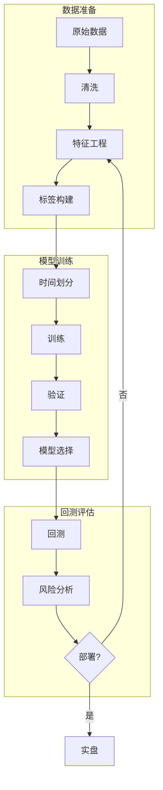

+++
title = "量化机器学习基础"
date = 2026-02-02
weight = 54000
description = "量化ML：监督学习、时间序列预测、过拟合防范、回测陷阱"
[taxonomies]
tags = ["HFT", "机器学习", "量化", "预测", "回测"]
+++

# 量化机器学习基础

本文介绍机器学习在量化交易中的应用，包括监督学习、时间序列预测、过拟合防范和回测陷阱。

---

## 一、量化 ML 概述

### 1.1 量化 ML 与传统 ML 的区别

| 方面 | 传统 ML | 量化 ML |
|------|---------|---------|
| 数据特性 | 静态、IID | 时序、非平稳 |
| 信噪比 | 高 | 极低 |
| 标签 | 明确 | 模糊、延迟 |
| 评估 | 准确率 | 风险调整收益 |
| 过拟合风险 | 中等 | 极高 |
| 交叉验证 | 随机划分 | 时间顺序 |

### 1.2 量化 ML 流程



---

## 二、监督学习

### 2.1 回归模型

```cpp
#include <vector>
#include <cmath>
#include <Eigen/Dense>

using namespace Eigen;

class LinearRegression {
public:
    // 普通最小二乘法
    static VectorXd fit_ols(const MatrixXd& X, const VectorXd& y) {
        // β = (X'X)^(-1) X'y
        return (X.transpose() * X).ldlt().solve(X.transpose() * y);
    }
    
    // 岭回归
    static VectorXd fit_ridge(const MatrixXd& X, const VectorXd& y, double lambda) {
        int p = X.cols();
        MatrixXd I = MatrixXd::Identity(p, p);
        return (X.transpose() * X + lambda * I).ldlt().solve(X.transpose() * y);
    }
    
    // LASSO（坐标下降法）
    static VectorXd fit_lasso(const MatrixXd& X, const VectorXd& y,
                              double lambda, int max_iter = 1000, double tol = 1e-6) {
        int n = X.rows();
        int p = X.cols();
        
        VectorXd beta = VectorXd::Zero(p);
        VectorXd residual = y;
        
        // 预计算
        VectorXd X_norm_sq(p);
        for (int j = 0; j < p; j++) {
            X_norm_sq(j) = X.col(j).squaredNorm();
        }
        
        for (int iter = 0; iter < max_iter; iter++) {
            VectorXd beta_old = beta;
            
            for (int j = 0; j < p; j++) {
                // 更新残差
                residual += X.col(j) * beta(j);
                
                // 计算 soft threshold
                double rho = X.col(j).dot(residual);
                beta(j) = soft_threshold(rho, lambda * n) / X_norm_sq(j);
                
                residual -= X.col(j) * beta(j);
            }
            
            if ((beta - beta_old).norm() < tol) break;
        }
        
        return beta;
    }
    
    // 弹性网络
    static VectorXd fit_elastic_net(const MatrixXd& X, const VectorXd& y,
                                    double lambda, double alpha,
                                    int max_iter = 1000) {
        int n = X.rows();
        int p = X.cols();
        
        VectorXd beta = VectorXd::Zero(p);
        VectorXd residual = y;
        
        VectorXd X_norm_sq(p);
        for (int j = 0; j < p; j++) {
            X_norm_sq(j) = X.col(j).squaredNorm() + lambda * (1 - alpha) * n;
        }
        
        for (int iter = 0; iter < max_iter; iter++) {
            VectorXd beta_old = beta;
            
            for (int j = 0; j < p; j++) {
                residual += X.col(j) * beta(j);
                double rho = X.col(j).dot(residual);
                beta(j) = soft_threshold(rho, lambda * alpha * n) / X_norm_sq(j);
                residual -= X.col(j) * beta(j);
            }
            
            if ((beta - beta_old).norm() < 1e-6) break;
        }
        
        return beta;
    }
    
private:
    static double soft_threshold(double x, double lambda) {
        if (x > lambda) return x - lambda;
        if (x < -lambda) return x + lambda;
        return 0;
    }
};
```

### 2.2 分类模型

```cpp
class LogisticRegression {
public:
    // 逻辑回归（梯度下降）
    static VectorXd fit(const MatrixXd& X, const VectorXd& y,
                       double lr = 0.01, int max_iter = 1000,
                       double lambda = 0.01) {
        int n = X.rows();
        int p = X.cols();
        
        VectorXd beta = VectorXd::Zero(p);
        
        for (int iter = 0; iter < max_iter; iter++) {
            // 预测概率
            VectorXd z = X * beta;
            VectorXd prob = sigmoid(z);
            
            // 梯度
            VectorXd grad = X.transpose() * (prob - y) / n + lambda * beta;
            
            // 更新
            beta -= lr * grad;
        }
        
        return beta;
    }
    
    static VectorXd predict_proba(const MatrixXd& X, const VectorXd& beta) {
        return sigmoid(X * beta);
    }
    
    static VectorXd predict(const MatrixXd& X, const VectorXd& beta,
                           double threshold = 0.5) {
        VectorXd prob = predict_proba(X, beta);
        VectorXd pred(prob.size());
        for (int i = 0; i < prob.size(); i++) {
            pred(i) = prob(i) >= threshold ? 1 : 0;
        }
        return pred;
    }
    
private:
    static VectorXd sigmoid(const VectorXd& z) {
        return 1.0 / (1.0 + (-z.array()).exp());
    }
};
```

### 2.3 树模型

```cpp
class DecisionTree {
public:
    struct Node {
        int feature_index = -1;
        double threshold = 0;
        double value = 0;  // 叶节点预测值
        Node* left = nullptr;
        Node* right = nullptr;
        bool is_leaf = false;
    };
    
    Node* fit(const MatrixXd& X, const VectorXd& y, int max_depth = 5,
              int min_samples = 5) {
        return build_tree(X, y, 0, max_depth, min_samples);
    }
    
    double predict(Node* node, const VectorXd& x) {
        if (node->is_leaf) {
            return node->value;
        }
        
        if (x(node->feature_index) <= node->threshold) {
            return predict(node->left, x);
        } else {
            return predict(node->right, x);
        }
    }
    
private:
    Node* build_tree(const MatrixXd& X, const VectorXd& y,
                     int depth, int max_depth, int min_samples) {
        Node* node = new Node();
        
        // 停止条件
        if (depth >= max_depth || X.rows() < min_samples) {
            node->is_leaf = true;
            node->value = y.mean();
            return node;
        }
        
        // 找最佳分裂
        auto [best_feature, best_threshold, best_gain] = find_best_split(X, y);
        
        if (best_gain <= 0) {
            node->is_leaf = true;
            node->value = y.mean();
            return node;
        }
        
        node->feature_index = best_feature;
        node->threshold = best_threshold;
        
        // 分裂数据
        std::vector<int> left_idx, right_idx;
        for (int i = 0; i < X.rows(); i++) {
            if (X(i, best_feature) <= best_threshold) {
                left_idx.push_back(i);
            } else {
                right_idx.push_back(i);
            }
        }
        
        MatrixXd X_left = select_rows(X, left_idx);
        VectorXd y_left = select_rows(y, left_idx);
        MatrixXd X_right = select_rows(X, right_idx);
        VectorXd y_right = select_rows(y, right_idx);
        
        node->left = build_tree(X_left, y_left, depth + 1, max_depth, min_samples);
        node->right = build_tree(X_right, y_right, depth + 1, max_depth, min_samples);
        
        return node;
    }
    
    std::tuple<int, double, double> find_best_split(const MatrixXd& X, const VectorXd& y) {
        int best_feature = -1;
        double best_threshold = 0;
        double best_gain = -1e9;
        
        double parent_var = variance(y);
        
        for (int j = 0; j < X.cols(); j++) {
            // 获取唯一值作为候选阈值
            std::vector<double> values;
            for (int i = 0; i < X.rows(); i++) {
                values.push_back(X(i, j));
            }
            std::sort(values.begin(), values.end());
            values.erase(std::unique(values.begin(), values.end()), values.end());
            
            for (size_t t = 0; t < values.size() - 1; t++) {
                double threshold = (values[t] + values[t + 1]) / 2;
                
                std::vector<double> left_y, right_y;
                for (int i = 0; i < X.rows(); i++) {
                    if (X(i, j) <= threshold) {
                        left_y.push_back(y(i));
                    } else {
                        right_y.push_back(y(i));
                    }
                }
                
                if (left_y.empty() || right_y.empty()) continue;
                
                double left_var = variance(left_y);
                double right_var = variance(right_y);
                
                double weighted_var = (left_y.size() * left_var + right_y.size() * right_var) /
                                     X.rows();
                double gain = parent_var - weighted_var;
                
                if (gain > best_gain) {
                    best_gain = gain;
                    best_feature = j;
                    best_threshold = threshold;
                }
            }
        }
        
        return {best_feature, best_threshold, best_gain};
    }
    
    double variance(const VectorXd& v) {
        double mean = v.mean();
        return (v.array() - mean).square().mean();
    }
    
    double variance(const std::vector<double>& v) {
        double mean = std::accumulate(v.begin(), v.end(), 0.0) / v.size();
        double var = 0;
        for (double x : v) var += (x - mean) * (x - mean);
        return var / v.size();
    }
    
    MatrixXd select_rows(const MatrixXd& X, const std::vector<int>& idx);
    VectorXd select_rows(const VectorXd& y, const std::vector<int>& idx);
};
```

---

## 三、时间序列特征

### 3.1 技术指标

```cpp
class TechnicalIndicators {
public:
    // 移动平均
    static std::vector<double> sma(const std::vector<double>& prices, int window) {
        std::vector<double> result(prices.size(), NAN);
        
        for (size_t i = window - 1; i < prices.size(); i++) {
            double sum = 0;
            for (int j = 0; j < window; j++) {
                sum += prices[i - j];
            }
            result[i] = sum / window;
        }
        
        return result;
    }
    
    // 指数移动平均
    static std::vector<double> ema(const std::vector<double>& prices, int window) {
        std::vector<double> result(prices.size());
        double alpha = 2.0 / (window + 1);
        
        result[0] = prices[0];
        for (size_t i = 1; i < prices.size(); i++) {
            result[i] = alpha * prices[i] + (1 - alpha) * result[i - 1];
        }
        
        return result;
    }
    
    // RSI（相对强弱指标）
    static std::vector<double> rsi(const std::vector<double>& prices, int window = 14) {
        std::vector<double> result(prices.size(), NAN);
        
        std::vector<double> gains(prices.size(), 0);
        std::vector<double> losses(prices.size(), 0);
        
        for (size_t i = 1; i < prices.size(); i++) {
            double change = prices[i] - prices[i - 1];
            gains[i] = std::max(change, 0.0);
            losses[i] = std::max(-change, 0.0);
        }
        
        auto avg_gain = ema(gains, window);
        auto avg_loss = ema(losses, window);
        
        for (size_t i = window; i < prices.size(); i++) {
            if (avg_loss[i] == 0) {
                result[i] = 100;
            } else {
                double rs = avg_gain[i] / avg_loss[i];
                result[i] = 100 - 100 / (1 + rs);
            }
        }
        
        return result;
    }
    
    // MACD
    struct MACD {
        std::vector<double> macd_line;
        std::vector<double> signal_line;
        std::vector<double> histogram;
    };
    
    static MACD macd(const std::vector<double>& prices,
                     int fast = 12, int slow = 26, int signal = 9) {
        auto ema_fast = ema(prices, fast);
        auto ema_slow = ema(prices, slow);
        
        std::vector<double> macd_line(prices.size());
        for (size_t i = 0; i < prices.size(); i++) {
            macd_line[i] = ema_fast[i] - ema_slow[i];
        }
        
        auto signal_line = ema(macd_line, signal);
        
        std::vector<double> histogram(prices.size());
        for (size_t i = 0; i < prices.size(); i++) {
            histogram[i] = macd_line[i] - signal_line[i];
        }
        
        return {macd_line, signal_line, histogram};
    }
    
    // 布林带
    struct BollingerBands {
        std::vector<double> middle;
        std::vector<double> upper;
        std::vector<double> lower;
    };
    
    static BollingerBands bollinger(const std::vector<double>& prices,
                                    int window = 20, double num_std = 2.0) {
        auto middle = sma(prices, window);
        std::vector<double> upper(prices.size(), NAN);
        std::vector<double> lower(prices.size(), NAN);
        
        for (size_t i = window - 1; i < prices.size(); i++) {
            double sum_sq = 0;
            for (int j = 0; j < window; j++) {
                double diff = prices[i - j] - middle[i];
                sum_sq += diff * diff;
            }
            double std = std::sqrt(sum_sq / window);
            upper[i] = middle[i] + num_std * std;
            lower[i] = middle[i] - num_std * std;
        }
        
        return {middle, upper, lower};
    }
    
    // ATR（平均真实范围）
    static std::vector<double> atr(const std::vector<double>& high,
                                   const std::vector<double>& low,
                                   const std::vector<double>& close,
                                   int window = 14) {
        std::vector<double> tr(close.size());
        
        tr[0] = high[0] - low[0];
        for (size_t i = 1; i < close.size(); i++) {
            double hl = high[i] - low[i];
            double hc = std::abs(high[i] - close[i - 1]);
            double lc = std::abs(low[i] - close[i - 1]);
            tr[i] = std::max({hl, hc, lc});
        }
        
        return ema(tr, window);
    }
};
```

### 3.2 微观结构特征

```cpp
class MicrostructureFeatures {
public:
    // 订单流不平衡
    static double order_imbalance(const std::vector<Trade>& trades) {
        double buy_volume = 0, sell_volume = 0;
        
        for (const auto& trade : trades) {
            if (trade.side == Side::Buy) {
                buy_volume += trade.quantity;
            } else {
                sell_volume += trade.quantity;
            }
        }
        
        double total = buy_volume + sell_volume;
        if (total == 0) return 0;
        
        return (buy_volume - sell_volume) / total;
    }
    
    // 成交量加权价格
    static double vwap(const std::vector<Trade>& trades) {
        double sum_pv = 0, sum_v = 0;
        
        for (const auto& trade : trades) {
            sum_pv += trade.price * trade.quantity;
            sum_v += trade.quantity;
        }
        
        return sum_v > 0 ? sum_pv / sum_v : 0;
    }
    
    // 买卖价差
    static double spread(double bid, double ask) {
        return (ask - bid) / ((ask + bid) / 2);
    }
    
    // 深度不平衡
    static double depth_imbalance(const OrderBook& book, int levels = 5) {
        double bid_depth = 0, ask_depth = 0;
        
        for (int i = 0; i < levels && i < book.bids.size(); i++) {
            bid_depth += book.bids[i].quantity;
        }
        for (int i = 0; i < levels && i < book.asks.size(); i++) {
            ask_depth += book.asks[i].quantity;
        }
        
        double total = bid_depth + ask_depth;
        if (total == 0) return 0;
        
        return (bid_depth - ask_depth) / total;
    }
    
    // 价格冲击
    static double price_impact(const std::vector<Trade>& trades,
                              double initial_mid) {
        if (trades.empty()) return 0;
        
        double final_price = trades.back().price;
        return (final_price - initial_mid) / initial_mid;
    }
    
    // Kyle's Lambda（价格冲击系数）
    static double kyle_lambda(const std::vector<Trade>& trades,
                             const std::vector<double>& mid_prices) {
        // 回归 ΔP = λ * SignedVolume + ε
        std::vector<double> delta_p, signed_vol;
        
        for (size_t i = 1; i < trades.size(); i++) {
            delta_p.push_back(mid_prices[i] - mid_prices[i-1]);
            double sign = trades[i].side == Side::Buy ? 1 : -1;
            signed_vol.push_back(sign * std::sqrt(trades[i].quantity));
        }
        
        // 简单线性回归
        double mean_dp = std::accumulate(delta_p.begin(), delta_p.end(), 0.0) / delta_p.size();
        double mean_sv = std::accumulate(signed_vol.begin(), signed_vol.end(), 0.0) / signed_vol.size();
        
        double num = 0, den = 0;
        for (size_t i = 0; i < delta_p.size(); i++) {
            num += (signed_vol[i] - mean_sv) * (delta_p[i] - mean_dp);
            den += (signed_vol[i] - mean_sv) * (signed_vol[i] - mean_sv);
        }
        
        return den > 0 ? num / den : 0;
    }
};
```

---

## 四、过拟合防范

### 4.1 时间序列交叉验证

```cpp
class TimeSeriesCV {
public:
    struct Fold {
        std::vector<int> train_idx;
        std::vector<int> test_idx;
    };
    
    // 滑动窗口验证
    static std::vector<Fold> sliding_window(int n_samples, int train_size,
                                            int test_size, int step = 1) {
        std::vector<Fold> folds;
        
        for (int start = 0; start + train_size + test_size <= n_samples; start += step) {
            Fold fold;
            
            for (int i = start; i < start + train_size; i++) {
                fold.train_idx.push_back(i);
            }
            
            for (int i = start + train_size; i < start + train_size + test_size; i++) {
                fold.test_idx.push_back(i);
            }
            
            folds.push_back(fold);
        }
        
        return folds;
    }
    
    // 扩展窗口验证
    static std::vector<Fold> expanding_window(int n_samples, int min_train_size,
                                              int test_size) {
        std::vector<Fold> folds;
        
        for (int end = min_train_size; end + test_size <= n_samples; end += test_size) {
            Fold fold;
            
            for (int i = 0; i < end; i++) {
                fold.train_idx.push_back(i);
            }
            
            for (int i = end; i < end + test_size; i++) {
                fold.test_idx.push_back(i);
            }
            
            folds.push_back(fold);
        }
        
        return folds;
    }
    
    // 带 Gap 的验证（防止数据泄露）
    static std::vector<Fold> purged_cv(int n_samples, int train_size,
                                       int test_size, int gap) {
        std::vector<Fold> folds;
        
        for (int start = 0; start + train_size + gap + test_size <= n_samples;
             start += test_size) {
            Fold fold;
            
            for (int i = start; i < start + train_size; i++) {
                fold.train_idx.push_back(i);
            }
            
            for (int i = start + train_size + gap;
                 i < start + train_size + gap + test_size; i++) {
                fold.test_idx.push_back(i);
            }
            
            folds.push_back(fold);
        }
        
        return folds;
    }
};
```

### 4.2 多重假设检验校正

```cpp
class MultipleTestingCorrection {
public:
    // Bonferroni 校正
    static double bonferroni(double alpha, int n_tests) {
        return alpha / n_tests;
    }
    
    // Benjamini-Hochberg FDR 校正
    static std::vector<bool> benjamini_hochberg(const std::vector<double>& p_values,
                                                double alpha) {
        int n = p_values.size();
        std::vector<std::pair<double, int>> sorted_p;
        
        for (int i = 0; i < n; i++) {
            sorted_p.push_back({p_values[i], i});
        }
        std::sort(sorted_p.begin(), sorted_p.end());
        
        std::vector<bool> rejected(n, false);
        
        // 找到最大的 k 使得 p_(k) <= k/n * alpha
        int max_k = -1;
        for (int k = 0; k < n; k++) {
            double threshold = (k + 1.0) / n * alpha;
            if (sorted_p[k].first <= threshold) {
                max_k = k;
            }
        }
        
        // 拒绝 p_(1) 到 p_(max_k)
        for (int k = 0; k <= max_k; k++) {
            rejected[sorted_p[k].second] = true;
        }
        
        return rejected;
    }
    
    // 样本外 Deflated Sharpe Ratio
    static double deflated_sharpe_ratio(double sharpe_observed,
                                        int n_trials,
                                        double sharpe_std,
                                        double skewness = 0,
                                        double kurtosis = 3) {
        // E[max(SR)] 近似
        double gamma = 0.5772156649;  // Euler-Mascheroni 常数
        double expected_max = sharpe_std * 
            ((1 - gamma) * std::sqrt(2 * std::log(n_trials)) +
             gamma * std::sqrt(2 * std::log(n_trials)));
        
        // 调整后的 z-score
        double z = (sharpe_observed - expected_max) / sharpe_std;
        
        // 非正态性校正
        z = z * (1 + (skewness / 6) * z + (kurtosis - 3) / 24 * (z * z - 3));
        
        // 返回 p-value
        return 1 - 0.5 * (1 + std::erf(z / std::sqrt(2)));
    }
};
```

---

## 五、模型评估

### 5.1 金融指标

```cpp
class FinancialMetrics {
public:
    // 信息系数（IC）
    static double information_coefficient(const std::vector<double>& predictions,
                                          const std::vector<double>& returns) {
        // Spearman 秩相关
        auto pred_ranks = rank(predictions);
        auto ret_ranks = rank(returns);
        
        int n = predictions.size();
        double sum_d2 = 0;
        for (int i = 0; i < n; i++) {
            double d = pred_ranks[i] - ret_ranks[i];
            sum_d2 += d * d;
        }
        
        return 1 - 6 * sum_d2 / (n * (n * n - 1));
    }
    
    // 信息比率（IR）
    static double information_ratio(const std::vector<double>& ic_series) {
        double mean_ic = std::accumulate(ic_series.begin(), ic_series.end(), 0.0) /
                        ic_series.size();
        
        double sum_sq = 0;
        for (double ic : ic_series) {
            sum_sq += (ic - mean_ic) * (ic - mean_ic);
        }
        double std_ic = std::sqrt(sum_sq / ic_series.size());
        
        return std_ic > 0 ? mean_ic / std_ic : 0;
    }
    
    // 分位数收益（Quantile Returns）
    static std::vector<double> quantile_returns(const std::vector<double>& predictions,
                                                const std::vector<double>& returns,
                                                int n_quantiles = 5) {
        // 按预测值分组
        std::vector<std::pair<double, double>> pairs;
        for (size_t i = 0; i < predictions.size(); i++) {
            pairs.push_back({predictions[i], returns[i]});
        }
        std::sort(pairs.begin(), pairs.end());
        
        int group_size = pairs.size() / n_quantiles;
        std::vector<double> quantile_ret(n_quantiles);
        
        for (int q = 0; q < n_quantiles; q++) {
            double sum = 0;
            int start = q * group_size;
            int end = (q == n_quantiles - 1) ? pairs.size() : (q + 1) * group_size;
            
            for (int i = start; i < end; i++) {
                sum += pairs[i].second;
            }
            quantile_ret[q] = sum / (end - start);
        }
        
        return quantile_ret;
    }
    
    // 换手率调整收益
    static double turnover_adjusted_return(const std::vector<double>& returns,
                                           const std::vector<double>& turnover,
                                           double cost_per_turnover = 0.001) {
        double total_return = 0;
        double total_cost = 0;
        
        for (size_t i = 0; i < returns.size(); i++) {
            total_return += returns[i];
            total_cost += turnover[i] * cost_per_turnover;
        }
        
        return total_return - total_cost;
    }
    
private:
    static std::vector<double> rank(const std::vector<double>& v) {
        std::vector<std::pair<double, int>> pairs;
        for (size_t i = 0; i < v.size(); i++) {
            pairs.push_back({v[i], i});
        }
        std::sort(pairs.begin(), pairs.end());
        
        std::vector<double> ranks(v.size());
        for (size_t i = 0; i < pairs.size(); i++) {
            ranks[pairs[i].second] = i + 1;
        }
        return ranks;
    }
};
```

---

## 六、常见陷阱

### 6.1 回测陷阱清单

| 陷阱 | 描述 | 解决方法 |
|------|------|----------|
| 前视偏差 | 使用未来信息 | 严格时间顺序 |
| 幸存者偏差 | 只用当前存在的股票 | 使用点时数据库 |
| 过拟合 | 参数过多 | 正则化、交叉验证 |
| 数据窥探 | 多次测试同一数据 | Deflated Sharpe |
| 交易成本 | 忽略滑点、手续费 | 保守估计成本 |
| 流动性 | 假设无限流动性 | 加入市场冲击 |
| 信号衰减 | 信号过于滞后 | 使用高频数据 |

### 6.2 验证检查清单

```cpp
class BacktestValidator {
public:
    struct ValidationResult {
        bool passed;
        std::string issue;
    };
    
    // 检查数据泄露
    static ValidationResult check_data_leakage(
        const std::vector<int64_t>& feature_timestamps,
        const std::vector<int64_t>& label_timestamps) {
        
        for (size_t i = 0; i < feature_timestamps.size(); i++) {
            if (feature_timestamps[i] >= label_timestamps[i]) {
                return {false, "Feature timestamp >= label timestamp"};
            }
        }
        return {true, ""};
    }
    
    // 检查样本外表现
    static ValidationResult check_oos_performance(
        double is_sharpe, double oos_sharpe, double threshold = 0.5) {
        
        if (oos_sharpe < is_sharpe * threshold) {
            return {false, "OOS Sharpe < 50% of IS Sharpe"};
        }
        return {true, ""};
    }
    
    // 检查收益分布
    static ValidationResult check_return_distribution(
        const std::vector<double>& returns) {
        
        double mean = std::accumulate(returns.begin(), returns.end(), 0.0) / returns.size();
        double sum_sq = 0;
        for (double r : returns) sum_sq += (r - mean) * (r - mean);
        double std = std::sqrt(sum_sq / returns.size());
        
        // 检查极端值
        int outliers = 0;
        for (double r : returns) {
            if (std::abs(r - mean) > 5 * std) outliers++;
        }
        
        if (outliers > returns.size() * 0.01) {
            return {false, "Too many outliers (>1%)"};
        }
        return {true, ""};
    }
};
```

---

## 七、面试常见问题

**Q: 如何防止时间序列中的过拟合？**

1. **时间顺序划分**：不使用随机划分
2. **Purged CV**：训练集和测试集之间留 gap
3. **正则化**：L1/L2 惩罚项
4. **特征选择**：减少无关特征
5. **多重假设校正**：Deflated Sharpe Ratio

**Q: IC 和 Sharpe Ratio 的关系？**

$$
IR \approx IC \times \sqrt{BR}
$$

其中 BR（Breadth）是独立预测次数。高 IC 或高交易频率都可以提高 IR。

**Q: 为什么需要 Purged Cross-Validation？**

时间序列数据具有自相关性，标准 CV 可能导致：
1. 训练集包含与测试集相邻的样本
2. 标签信息泄露到训练集
3. 高估样本外表现

---

## 相关文章

- [量化因子模型与特征工程](@/articles/hft/hft-55-量化因子模型与特征工程.md)
- [量化数学-概率统计基础](@/articles/hft/hft-48-量化数学-概率统计基础.md)
- [HFT笔试题-策略回测](@/articles/hft/hft-45-HFT笔试题-策略回测.md)
