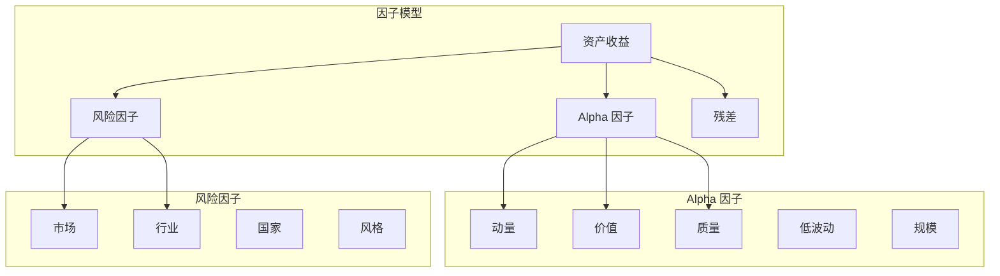

+++
title = "55. 量化因子模型与特征工程"
date = 2026-02-02
weight = 55000
description = "因子模型：Alpha因子、风险因子、因子构建、组合优化"
[taxonomies]
tags = ["HFT", "因子", "Alpha", "风险模型", "特征工程"]
+++

# 量化因子模型与特征工程

本文深入讲解量化交易中的因子模型和特征工程，包括 Alpha 因子构建、风险因子、因子组合和优化方法。

---

## 一、因子投资概述

### 1.1 因子模型框架



### 1.2 因子类型

| 类型 | 描述 | 示例 |
|------|------|------|
| **Alpha 因子** | 预测超额收益 | 动量、反转、质量 |
| **风险因子** | 解释收益变化来源 | 市场、行业、规模 |
| **风格因子** | 投资风格暴露 | 价值、成长 |

---

## 二、Alpha 因子构建

### 2.1 经典因子

```cpp
#include <vector>
#include <algorithm>
#include <cmath>

class AlphaFactors {
public:
    // 动量因子
    static std::vector<double> momentum(const std::vector<std::vector<double>>& prices,
                                        int lookback = 252, int skip = 21) {
        // 过去 lookback 天收益（跳过最近 skip 天）
        int n_assets = prices.size();
        std::vector<double> factor(n_assets);
        
        for (int i = 0; i < n_assets; i++) {
            const auto& p = prices[i];
            int T = p.size();
            
            if (T < lookback + skip) {
                factor[i] = NAN;
                continue;
            }
            
            double ret = (p[T - skip - 1] - p[T - lookback - skip]) / p[T - lookback - skip];
            factor[i] = ret;
        }
        
        return factor;
    }
    
    // 短期反转
    static std::vector<double> short_term_reversal(
        const std::vector<std::vector<double>>& prices, int lookback = 5) {
        
        int n_assets = prices.size();
        std::vector<double> factor(n_assets);
        
        for (int i = 0; i < n_assets; i++) {
            const auto& p = prices[i];
            int T = p.size();
            
            if (T < lookback) {
                factor[i] = NAN;
                continue;
            }
            
            double ret = (p[T - 1] - p[T - lookback]) / p[T - lookback];
            factor[i] = -ret;  // 反转
        }
        
        return factor;
    }
    
    // 波动率因子
    static std::vector<double> volatility(
        const std::vector<std::vector<double>>& returns, int lookback = 60) {
        
        int n_assets = returns.size();
        std::vector<double> factor(n_assets);
        
        for (int i = 0; i < n_assets; i++) {
            const auto& r = returns[i];
            int T = r.size();
            
            if (T < lookback) {
                factor[i] = NAN;
                continue;
            }
            
            double mean = 0;
            for (int t = T - lookback; t < T; t++) {
                mean += r[t];
            }
            mean /= lookback;
            
            double var = 0;
            for (int t = T - lookback; t < T; t++) {
                var += (r[t] - mean) * (r[t] - mean);
            }
            
            factor[i] = -std::sqrt(var / lookback);  // 低波动
        }
        
        return factor;
    }
    
    // 流动性因子（Amihud）
    static std::vector<double> illiquidity(
        const std::vector<std::vector<double>>& returns,
        const std::vector<std::vector<double>>& volumes,
        int lookback = 21) {
        
        int n_assets = returns.size();
        std::vector<double> factor(n_assets);
        
        for (int i = 0; i < n_assets; i++) {
            const auto& r = returns[i];
            const auto& v = volumes[i];
            int T = r.size();
            
            if (T < lookback) {
                factor[i] = NAN;
                continue;
            }
            
            double sum_illiq = 0;
            int count = 0;
            
            for (int t = T - lookback; t < T; t++) {
                if (v[t] > 0) {
                    sum_illiq += std::abs(r[t]) / v[t];
                    count++;
                }
            }
            
            factor[i] = count > 0 ? -sum_illiq / count : NAN;  // 高流动性
        }
        
        return factor;
    }
    
    // 特异波动率
    static std::vector<double> idiosyncratic_volatility(
        const std::vector<std::vector<double>>& returns,
        const std::vector<double>& market_returns,
        int lookback = 60) {
        
        int n_assets = returns.size();
        std::vector<double> factor(n_assets);
        
        for (int i = 0; i < n_assets; i++) {
            const auto& r = returns[i];
            int T = r.size();
            
            if (T < lookback) {
                factor[i] = NAN;
                continue;
            }
            
            // 回归 r = alpha + beta * market + epsilon
            double sum_r = 0, sum_m = 0, sum_rm = 0, sum_mm = 0;
            
            for (int t = T - lookback; t < T; t++) {
                sum_r += r[t];
                sum_m += market_returns[t];
                sum_rm += r[t] * market_returns[t];
                sum_mm += market_returns[t] * market_returns[t];
            }
            
            double mean_r = sum_r / lookback;
            double mean_m = sum_m / lookback;
            
            double beta = (sum_rm / lookback - mean_r * mean_m) /
                         (sum_mm / lookback - mean_m * mean_m);
            double alpha = mean_r - beta * mean_m;
            
            // 计算残差波动率
            double sum_resid_sq = 0;
            for (int t = T - lookback; t < T; t++) {
                double resid = r[t] - alpha - beta * market_returns[t];
                sum_resid_sq += resid * resid;
            }
            
            factor[i] = -std::sqrt(sum_resid_sq / lookback);  // 低特异波动
        }
        
        return factor;
    }
};
```

### 2.2 基本面因子

```cpp
class FundamentalFactors {
public:
    // 市盈率倒数（EP）
    static std::vector<double> earnings_yield(
        const std::vector<double>& earnings,
        const std::vector<double>& market_cap) {
        
        std::vector<double> factor(earnings.size());
        
        for (size_t i = 0; i < earnings.size(); i++) {
            if (market_cap[i] > 0 && earnings[i] > 0) {
                factor[i] = earnings[i] / market_cap[i];
            } else {
                factor[i] = NAN;
            }
        }
        
        return factor;
    }
    
    // 市净率倒数（BP）
    static std::vector<double> book_to_price(
        const std::vector<double>& book_value,
        const std::vector<double>& market_cap) {
        
        std::vector<double> factor(book_value.size());
        
        for (size_t i = 0; i < book_value.size(); i++) {
            if (market_cap[i] > 0 && book_value[i] > 0) {
                factor[i] = book_value[i] / market_cap[i];
            } else {
                factor[i] = NAN;
            }
        }
        
        return factor;
    }
    
    // ROE
    static std::vector<double> return_on_equity(
        const std::vector<double>& net_income,
        const std::vector<double>& equity) {
        
        std::vector<double> factor(net_income.size());
        
        for (size_t i = 0; i < net_income.size(); i++) {
            if (equity[i] > 0) {
                factor[i] = net_income[i] / equity[i];
            } else {
                factor[i] = NAN;
            }
        }
        
        return factor;
    }
    
    // 资产增长
    static std::vector<double> asset_growth(
        const std::vector<double>& assets_current,
        const std::vector<double>& assets_prev) {
        
        std::vector<double> factor(assets_current.size());
        
        for (size_t i = 0; i < assets_current.size(); i++) {
            if (assets_prev[i] > 0) {
                factor[i] = -(assets_current[i] - assets_prev[i]) / assets_prev[i];
            } else {
                factor[i] = NAN;
            }
        }
        
        return factor;
    }
    
    // 应计项目
    static std::vector<double> accruals(
        const std::vector<double>& net_income,
        const std::vector<double>& operating_cash_flow,
        const std::vector<double>& total_assets) {
        
        std::vector<double> factor(net_income.size());
        
        for (size_t i = 0; i < net_income.size(); i++) {
            if (total_assets[i] > 0) {
                factor[i] = -(net_income[i] - operating_cash_flow[i]) / total_assets[i];
            } else {
                factor[i] = NAN;
            }
        }
        
        return factor;
    }
};
```

### 2.3 高频因子

```cpp
class HighFrequencyFactors {
public:
    // 订单流不平衡
    static std::vector<double> order_flow_imbalance(
        const std::vector<std::vector<Trade>>& trades_by_asset,
        int lookback_seconds = 300) {
        
        std::vector<double> factor(trades_by_asset.size());
        
        for (size_t i = 0; i < trades_by_asset.size(); i++) {
            const auto& trades = trades_by_asset[i];
            
            double buy_vol = 0, sell_vol = 0;
            
            for (const auto& t : trades) {
                if (t.side == Side::Buy) {
                    buy_vol += t.quantity;
                } else {
                    sell_vol += t.quantity;
                }
            }
            
            double total = buy_vol + sell_vol;
            factor[i] = total > 0 ? (buy_vol - sell_vol) / total : 0;
        }
        
        return factor;
    }
    
    // 价格冲击不对称
    static std::vector<double> price_impact_asymmetry(
        const std::vector<std::vector<Trade>>& trades_by_asset,
        const std::vector<std::vector<double>>& mid_prices) {
        
        std::vector<double> factor(trades_by_asset.size());
        
        for (size_t i = 0; i < trades_by_asset.size(); i++) {
            double buy_impact = 0, sell_impact = 0;
            int buy_count = 0, sell_count = 0;
            
            const auto& trades = trades_by_asset[i];
            const auto& mids = mid_prices[i];
            
            for (size_t t = 1; t < trades.size(); t++) {
                double impact = (mids[t] - mids[t-1]) / mids[t-1];
                
                if (trades[t].side == Side::Buy) {
                    buy_impact += impact;
                    buy_count++;
                } else {
                    sell_impact += std::abs(impact);
                    sell_count++;
                }
            }
            
            double avg_buy = buy_count > 0 ? buy_impact / buy_count : 0;
            double avg_sell = sell_count > 0 ? sell_impact / sell_count : 0;
            
            factor[i] = avg_buy - avg_sell;  // 正值表示买入冲击大
        }
        
        return factor;
    }
    
    // 报价深度不平衡
    static std::vector<double> quote_imbalance(
        const std::vector<OrderBook>& books) {
        
        std::vector<double> factor(books.size());
        
        for (size_t i = 0; i < books.size(); i++) {
            const auto& book = books[i];
            
            double bid_depth = 0, ask_depth = 0;
            int levels = std::min(5, (int)std::min(book.bids.size(), book.asks.size()));
            
            for (int l = 0; l < levels; l++) {
                bid_depth += book.bids[l].quantity;
                ask_depth += book.asks[l].quantity;
            }
            
            double total = bid_depth + ask_depth;
            factor[i] = total > 0 ? (bid_depth - ask_depth) / total : 0;
        }
        
        return factor;
    }
};
```

---

## 三、因子处理

### 3.1 因子标准化

```cpp
class FactorPreprocessing {
public:
    // 标准化（Z-Score）
    static std::vector<double> standardize(const std::vector<double>& factor) {
        std::vector<double> valid;
        for (double f : factor) {
            if (!std::isnan(f)) valid.push_back(f);
        }
        
        if (valid.empty()) return factor;
        
        double mean = std::accumulate(valid.begin(), valid.end(), 0.0) / valid.size();
        double sum_sq = 0;
        for (double f : valid) sum_sq += (f - mean) * (f - mean);
        double std = std::sqrt(sum_sq / valid.size());
        
        std::vector<double> result(factor.size());
        for (size_t i = 0; i < factor.size(); i++) {
            if (std::isnan(factor[i])) {
                result[i] = NAN;
            } else {
                result[i] = std > 0 ? (factor[i] - mean) / std : 0;
            }
        }
        
        return result;
    }
    
    // 分位数标准化（Rank Normalization）
    static std::vector<double> rank_normalize(const std::vector<double>& factor) {
        std::vector<std::pair<double, int>> pairs;
        
        for (size_t i = 0; i < factor.size(); i++) {
            if (!std::isnan(factor[i])) {
                pairs.push_back({factor[i], i});
            }
        }
        
        std::sort(pairs.begin(), pairs.end());
        
        std::vector<double> result(factor.size(), NAN);
        int n = pairs.size();
        
        for (int i = 0; i < n; i++) {
            // 转换为 [-1, 1]
            result[pairs[i].second] = 2.0 * i / (n - 1) - 1;
        }
        
        return result;
    }
    
    // Winsorize（缩尾处理）
    static std::vector<double> winsorize(const std::vector<double>& factor,
                                         double lower_pct = 0.01,
                                         double upper_pct = 0.99) {
        std::vector<double> valid;
        for (double f : factor) {
            if (!std::isnan(f)) valid.push_back(f);
        }
        
        if (valid.empty()) return factor;
        
        std::sort(valid.begin(), valid.end());
        
        int n = valid.size();
        double lower_bound = valid[(int)(lower_pct * n)];
        double upper_bound = valid[(int)(upper_pct * n)];
        
        std::vector<double> result(factor.size());
        for (size_t i = 0; i < factor.size(); i++) {
            if (std::isnan(factor[i])) {
                result[i] = NAN;
            } else {
                result[i] = std::max(lower_bound, std::min(factor[i], upper_bound));
            }
        }
        
        return result;
    }
    
    // 行业中性化
    static std::vector<double> neutralize_industry(
        const std::vector<double>& factor,
        const std::vector<int>& industry_codes) {
        
        // 计算每个行业的均值
        std::map<int, std::vector<double>> industry_values;
        
        for (size_t i = 0; i < factor.size(); i++) {
            if (!std::isnan(factor[i])) {
                industry_values[industry_codes[i]].push_back(factor[i]);
            }
        }
        
        std::map<int, double> industry_means;
        for (const auto& [code, values] : industry_values) {
            industry_means[code] = std::accumulate(values.begin(), values.end(), 0.0) /
                                  values.size();
        }
        
        // 减去行业均值
        std::vector<double> result(factor.size());
        for (size_t i = 0; i < factor.size(); i++) {
            if (std::isnan(factor[i])) {
                result[i] = NAN;
            } else {
                result[i] = factor[i] - industry_means[industry_codes[i]];
            }
        }
        
        return result;
    }
    
    // 市值中性化
    static std::vector<double> neutralize_size(
        const std::vector<double>& factor,
        const std::vector<double>& log_market_cap) {
        
        // 回归 factor = alpha + beta * log(mcap) + residual
        std::vector<double> valid_factor, valid_mcap;
        std::vector<int> valid_idx;
        
        for (size_t i = 0; i < factor.size(); i++) {
            if (!std::isnan(factor[i]) && !std::isnan(log_market_cap[i])) {
                valid_factor.push_back(factor[i]);
                valid_mcap.push_back(log_market_cap[i]);
                valid_idx.push_back(i);
            }
        }
        
        int n = valid_factor.size();
        double sum_f = 0, sum_m = 0, sum_fm = 0, sum_mm = 0;
        
        for (int i = 0; i < n; i++) {
            sum_f += valid_factor[i];
            sum_m += valid_mcap[i];
            sum_fm += valid_factor[i] * valid_mcap[i];
            sum_mm += valid_mcap[i] * valid_mcap[i];
        }
        
        double mean_f = sum_f / n;
        double mean_m = sum_m / n;
        
        double beta = (sum_fm / n - mean_f * mean_m) / (sum_mm / n - mean_m * mean_m);
        double alpha = mean_f - beta * mean_m;
        
        std::vector<double> result(factor.size(), NAN);
        for (size_t i = 0; i < valid_idx.size(); i++) {
            result[valid_idx[i]] = valid_factor[i] - alpha - beta * valid_mcap[i];
        }
        
        return result;
    }
};
```

---

## 四、风险模型

### 4.1 多因子风险模型

```cpp
class RiskModel {
public:
    struct RiskDecomposition {
        double total_risk;
        double systematic_risk;
        double specific_risk;
        std::vector<double> factor_contributions;
    };
    
    // 因子协方差矩阵估计
    static Eigen::MatrixXd estimate_factor_covariance(
        const Eigen::MatrixXd& factor_returns,
        int halflife = 60) {
        
        int T = factor_returns.rows();
        int K = factor_returns.cols();
        
        // 指数加权
        Eigen::VectorXd weights(T);
        double decay = std::log(2) / halflife;
        
        for (int t = 0; t < T; t++) {
            weights(t) = std::exp(-decay * (T - 1 - t));
        }
        weights /= weights.sum();
        
        // 加权均值
        Eigen::VectorXd mean = Eigen::VectorXd::Zero(K);
        for (int t = 0; t < T; t++) {
            mean += weights(t) * factor_returns.row(t).transpose();
        }
        
        // 加权协方差
        Eigen::MatrixXd cov = Eigen::MatrixXd::Zero(K, K);
        for (int t = 0; t < T; t++) {
            Eigen::VectorXd centered = factor_returns.row(t).transpose() - mean;
            cov += weights(t) * centered * centered.transpose();
        }
        
        // Newey-West 调整（处理自相关）
        int max_lag = 5;
        for (int lag = 1; lag <= max_lag; lag++) {
            double w = 1 - lag / (max_lag + 1.0);
            
            Eigen::MatrixXd gamma = Eigen::MatrixXd::Zero(K, K);
            for (int t = lag; t < T; t++) {
                Eigen::VectorXd x_t = factor_returns.row(t).transpose() - mean;
                Eigen::VectorXd x_lag = factor_returns.row(t - lag).transpose() - mean;
                gamma += weights(t) * x_t * x_lag.transpose();
            }
            
            cov += w * (gamma + gamma.transpose());
        }
        
        return cov;
    }
    
    // 特质风险估计
    static Eigen::VectorXd estimate_specific_risk(
        const Eigen::MatrixXd& returns,
        const Eigen::MatrixXd& factor_loadings,
        const Eigen::MatrixXd& factor_returns) {
        
        int T = returns.rows();
        int N = returns.cols();
        
        Eigen::VectorXd specific_var(N);
        
        for (int i = 0; i < N; i++) {
            // 计算残差
            Eigen::VectorXd residuals(T);
            for (int t = 0; t < T; t++) {
                double predicted = factor_loadings.row(i).dot(factor_returns.row(t).transpose());
                residuals(t) = returns(t, i) - predicted;
            }
            
            specific_var(i) = residuals.squaredNorm() / T;
        }
        
        return specific_var.array().sqrt();
    }
    
    // 组合风险分解
    static RiskDecomposition decompose_risk(
        const Eigen::VectorXd& weights,
        const Eigen::MatrixXd& factor_loadings,
        const Eigen::MatrixXd& factor_cov,
        const Eigen::VectorXd& specific_risk) {
        
        RiskDecomposition result;
        
        // 组合因子暴露
        Eigen::VectorXd portfolio_exposure = factor_loadings.transpose() * weights;
        
        // 系统性风险
        double systematic_var = portfolio_exposure.transpose() * factor_cov * portfolio_exposure;
        result.systematic_risk = std::sqrt(systematic_var);
        
        // 特质风险
        Eigen::VectorXd specific_var = specific_risk.array().square();
        double specific_portfolio_var = (weights.array().square() * specific_var.array()).sum();
        result.specific_risk = std::sqrt(specific_portfolio_var);
        
        // 总风险
        result.total_risk = std::sqrt(systematic_var + specific_portfolio_var);
        
        // 因子贡献
        int K = factor_cov.rows();
        result.factor_contributions.resize(K);
        
        for (int k = 0; k < K; k++) {
            double marginal = 0;
            for (int j = 0; j < K; j++) {
                marginal += portfolio_exposure(j) * factor_cov(k, j);
            }
            result.factor_contributions[k] = portfolio_exposure(k) * marginal / systematic_var;
        }
        
        return result;
    }
};
```

### 4.2 Barra 风险因子

```cpp
class BarraFactors {
public:
    // 市值因子（Size）
    static std::vector<double> size_factor(const std::vector<double>& market_cap) {
        std::vector<double> log_cap(market_cap.size());
        for (size_t i = 0; i < market_cap.size(); i++) {
            log_cap[i] = std::log(market_cap[i]);
        }
        return FactorPreprocessing::standardize(log_cap);
    }
    
    // Beta 因子
    static std::vector<double> beta_factor(
        const std::vector<std::vector<double>>& returns,
        const std::vector<double>& market_returns,
        int lookback = 252) {
        
        std::vector<double> betas(returns.size());
        
        for (size_t i = 0; i < returns.size(); i++) {
            const auto& r = returns[i];
            int T = r.size();
            
            if (T < lookback) {
                betas[i] = NAN;
                continue;
            }
            
            double sum_r = 0, sum_m = 0, sum_rm = 0, sum_mm = 0;
            
            for (int t = T - lookback; t < T; t++) {
                sum_r += r[t];
                sum_m += market_returns[t];
                sum_rm += r[t] * market_returns[t];
                sum_mm += market_returns[t] * market_returns[t];
            }
            
            double mean_r = sum_r / lookback;
            double mean_m = sum_m / lookback;
            
            betas[i] = (sum_rm / lookback - mean_r * mean_m) /
                      (sum_mm / lookback - mean_m * mean_m);
        }
        
        return FactorPreprocessing::standardize(betas);
    }
    
    // 动量因子（Momentum）
    static std::vector<double> momentum_factor(
        const std::vector<std::vector<double>>& prices) {
        return FactorPreprocessing::standardize(
            AlphaFactors::momentum(prices, 252, 21));
    }
    
    // 波动率因子（Volatility）
    static std::vector<double> volatility_factor(
        const std::vector<std::vector<double>>& returns) {
        return FactorPreprocessing::standardize(
            AlphaFactors::volatility(returns, 60));
    }
    
    // 价值因子（Value）
    static std::vector<double> value_factor(
        const std::vector<double>& book_value,
        const std::vector<double>& market_cap) {
        return FactorPreprocessing::standardize(
            FundamentalFactors::book_to_price(book_value, market_cap));
    }
    
    // 盈利因子（Profitability）
    static std::vector<double> profitability_factor(
        const std::vector<double>& net_income,
        const std::vector<double>& equity) {
        return FactorPreprocessing::standardize(
            FundamentalFactors::return_on_equity(net_income, equity));
    }
};
```

---

## 五、组合优化

### 5.1 均值-方差优化

```cpp
class PortfolioOptimization {
public:
    // 最大化 Sharpe Ratio
    static Eigen::VectorXd max_sharpe(
        const Eigen::VectorXd& expected_returns,
        const Eigen::MatrixXd& cov_matrix,
        double risk_free_rate = 0) {
        
        int n = expected_returns.size();
        Eigen::VectorXd excess_returns = expected_returns.array() - risk_free_rate;
        
        // 最优权重 w* = Σ^(-1) * μ / (1' * Σ^(-1) * μ)
        Eigen::VectorXd w = cov_matrix.ldlt().solve(excess_returns);
        w /= w.sum();
        
        return w;
    }
    
    // 最小方差组合
    static Eigen::VectorXd min_variance(const Eigen::MatrixXd& cov_matrix) {
        int n = cov_matrix.rows();
        Eigen::VectorXd ones = Eigen::VectorXd::Ones(n);
        
        Eigen::VectorXd w = cov_matrix.ldlt().solve(ones);
        w /= w.sum();
        
        return w;
    }
    
    // 风险平价
    static Eigen::VectorXd risk_parity(
        const Eigen::MatrixXd& cov_matrix,
        int max_iter = 100, double tol = 1e-8) {
        
        int n = cov_matrix.rows();
        Eigen::VectorXd w = Eigen::VectorXd::Ones(n) / n;
        
        for (int iter = 0; iter < max_iter; iter++) {
            // 计算边际风险贡献
            Eigen::VectorXd sigma_w = cov_matrix * w;
            double port_vol = std::sqrt(w.transpose() * sigma_w);
            
            Eigen::VectorXd mrc = sigma_w / port_vol;
            Eigen::VectorXd rc = w.array() * mrc.array();
            
            // 目标：所有风险贡献相等
            double target_rc = port_vol / n;
            
            // 检查收敛
            if ((rc.array() - target_rc).abs().maxCoeff() < tol)
                break;
            
            // 更新权重
            w = w.array() * (target_rc / rc.array());
            w /= w.sum();
        }
        
        return w;
    }
    
    // 带约束的优化
    struct Constraints {
        double max_weight = 0.1;        // 单个资产最大权重
        double min_weight = 0.0;        // 单个资产最小权重
        double max_turnover = 0.2;      // 最大换手率
        std::vector<double> factor_limits;  // 因子暴露限制
    };
    
    static Eigen::VectorXd optimize_with_constraints(
        const Eigen::VectorXd& alpha,
        const Eigen::MatrixXd& cov_matrix,
        const Eigen::VectorXd& current_weights,
        const Constraints& constraints,
        double risk_aversion = 1.0) {
        
        int n = alpha.size();
        
        // 使用迭代方法求解
        Eigen::VectorXd w = current_weights;
        
        for (int iter = 0; iter < 100; iter++) {
            // 计算梯度
            Eigen::VectorXd grad = alpha - risk_aversion * cov_matrix * w;
            
            // 投影到约束集
            for (int i = 0; i < n; i++) {
                w(i) += 0.01 * grad(i);
                w(i) = std::max(constraints.min_weight, 
                               std::min(w(i), constraints.max_weight));
            }
            
            // 换手率约束
            double turnover = (w - current_weights).lpNorm<1>() / 2;
            if (turnover > constraints.max_turnover) {
                double scale = constraints.max_turnover / turnover;
                w = current_weights + scale * (w - current_weights);
            }
            
            // 归一化
            w /= w.sum();
        }
        
        return w;
    }
};
```

---

## 六、因子评估

```cpp
class FactorEvaluation {
public:
    struct FactorStats {
        double ic;              // 信息系数
        double icir;            // 信息比率
        double t_stat;          // t 统计量
        double turnover;        // 换手率
        std::vector<double> quantile_returns;  // 分位数收益
        double long_short_return;  // 多空收益
    };
    
    static FactorStats evaluate(
        const std::vector<std::vector<double>>& factor_history,
        const std::vector<std::vector<double>>& return_history) {
        
        FactorStats stats;
        
        std::vector<double> ic_series;
        std::vector<double> turnover_series;
        
        int T = factor_history.size();
        
        for (int t = 0; t < T - 1; t++) {
            // 计算 IC
            double ic = FinancialMetrics::information_coefficient(
                factor_history[t], return_history[t + 1]);
            ic_series.push_back(ic);
            
            // 计算换手率
            if (t > 0) {
                auto ranks_prev = rank(factor_history[t - 1]);
                auto ranks_curr = rank(factor_history[t]);
                
                double turnover = 0;
                for (size_t i = 0; i < ranks_prev.size(); i++) {
                    turnover += std::abs(ranks_curr[i] - ranks_prev[i]);
                }
                turnover /= ranks_prev.size();
                turnover_series.push_back(turnover);
            }
        }
        
        // IC 统计
        stats.ic = std::accumulate(ic_series.begin(), ic_series.end(), 0.0) /
                  ic_series.size();
        
        double ic_std = 0;
        for (double ic : ic_series) {
            ic_std += (ic - stats.ic) * (ic - stats.ic);
        }
        ic_std = std::sqrt(ic_std / ic_series.size());
        
        stats.icir = ic_std > 0 ? stats.ic / ic_std : 0;
        stats.t_stat = stats.ic * std::sqrt(ic_series.size()) / ic_std;
        
        // 换手率
        if (!turnover_series.empty()) {
            stats.turnover = std::accumulate(turnover_series.begin(),
                                             turnover_series.end(), 0.0) /
                            turnover_series.size();
        }
        
        // 分位数收益
        stats.quantile_returns = FinancialMetrics::quantile_returns(
            factor_history.back(), return_history.back(), 5);
        
        // 多空收益
        stats.long_short_return = stats.quantile_returns.back() -
                                 stats.quantile_returns.front();
        
        return stats;
    }
    
private:
    static std::vector<double> rank(const std::vector<double>& v);
};
```

---

## 七、面试常见问题

**Q: 如何构建一个新的 Alpha 因子？**

1. **理论假设**：明确因子背后的经济逻辑
2. **数据准备**：获取、清洗相关数据
3. **因子计算**：实现因子公式
4. **预处理**：标准化、中性化
5. **回测评估**：IC、分位数收益、换手率
6. **多重检验**：Deflated Sharpe 校正

**Q: 因子衰减如何处理？**

| 方法 | 描述 |
|------|------|
| 动态权重 | 根据近期表现调整因子权重 |
| 复合因子 | 结合多个相关因子 |
| 机器学习 | 非线性组合、特征选择 |
| 高频化 | 使用更高频的数据源 |

**Q: 风险模型和 Alpha 模型的关系？**

- **Alpha 模型**：预测收益，决定买什么
- **风险模型**：控制风险，决定买多少
- **组合优化**：结合两者，最大化风险调整收益

---

## 相关文章

- [量化机器学习基础](@/articles/hft/hft-54-量化机器学习基础.md)
- [HFT笔试题-策略回测](@/articles/hft/hft-45-HFT笔试题-策略回测.md)
- [市场微结构深度解析](@/articles/hft/hft-38-市场微结构深度解析.md)
