+++
title = "01 - HPC 概述与发展史"
description = "高性能计算的概念、发展历程与 AI 时代的融合"
date = 2025-02-06
updated = 2025-02-06
draft = false
[taxonomies]
tags = ["HPC", "高性能计算", "超算", "GPU集群"]
[extra]
toc = true
comments = true
+++

## 一、什么是 HPC

### 1.1 定义

**HPC（High Performance Computing）= 高性能计算**

使用超级计算机或计算集群解决复杂计算问题的技术领域。

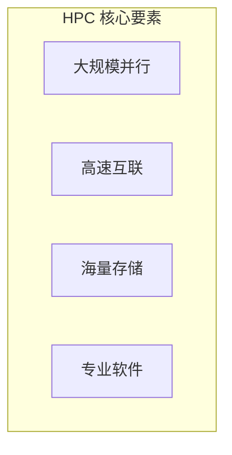

### 1.2 典型应用

| 领域 | 应用 |
|------|------|
| 天气预报 | 大气模拟 |
| 药物研发 | 分子动力学 |
| 航空航天 | 流体力学 |
| 金融 | 风险计算 |
| 能源 | 油藏模拟 |
| **AI** | 大模型训练 |

### 1.3 性能度量

| 指标 | 含义 |
|------|------|
| FLOPS | 每秒浮点运算次数 |
| PFLOPS | 10^15 FLOPS |
| EFLOPS | 10^18 FLOPS |

---

## 二、HPC 发展历程

### 2.1 发展阶段

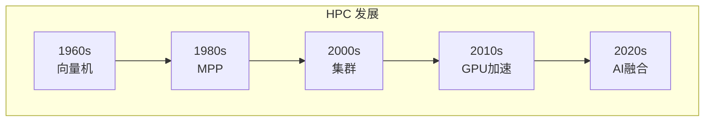

### 2.2 各阶段特点

| 阶段 | 代表 | 特点 |
|------|------|------|
| 向量机时代 | Cray-1 | 单机向量处理 |
| MPP 时代 | CM-5 | 大规模并行处理器 |
| 集群时代 | 天河、曙光 | 商用服务器集群 |
| GPU 加速 | Summit、Frontier | 异构计算 |
| AI 融合 | 各大 AI 集群 | GPU 为主力 |

### 2.3 超算排名

**TOP500**：全球超算性能排名

| 排名 | 系统 | 国家 | 性能 |
|------|------|------|------|
| 1 | Frontier | 美国 | 1.2 EFLOPS |
| 2 | Aurora | 美国 | 1.0 EFLOPS |
| 3 | Eagle | 美国 | 0.56 EFLOPS |

---

## 三、HPC 系统架构

### 3.1 硬件架构

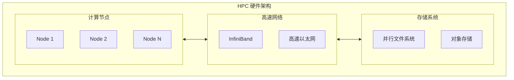

### 3.2 计算节点

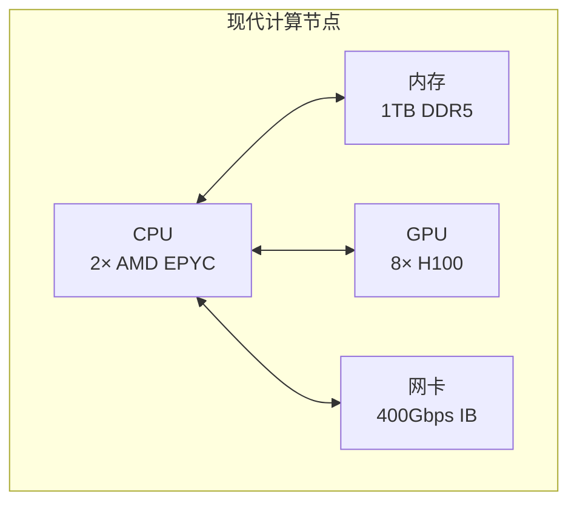

### 3.3 网络拓扑

| 拓扑 | 特点 |
|------|------|
| 胖树 | 成本高，带宽均衡 |
| 蜻蜓 | 低直径，高带宽 |
| Torus | 规则，适合特定应用 |

---

## 四、HPC 软件栈

### 4.1 软件层次

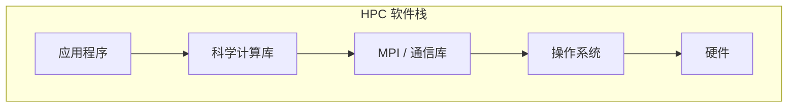

### 4.2 关键组件

| 组件 | 例子 |
|------|------|
| 作业调度 | Slurm、PBS |
| MPI 实现 | OpenMPI、MPICH |
| 数学库 | BLAS、LAPACK、cuBLAS |
| 并行文件系统 | Lustre、GPFS |
| 容器 | Singularity |

---

## 五、GPU 与 HPC

### 5.1 GPU 加速的兴起

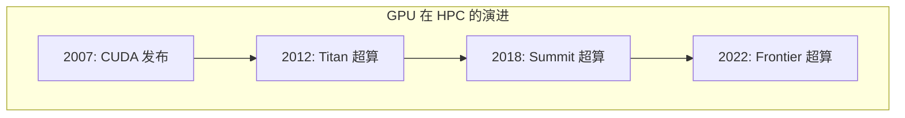

### 5.2 异构计算

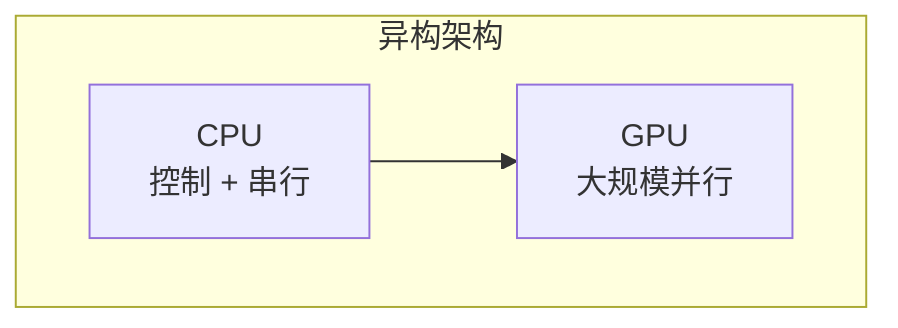

### 5.3 GPU 集群特点

| 特点 | 描述 |
|------|------|
| 高算力密度 | 单节点 ~20 PFLOPS |
| 高功耗 | 单节点 ~10kW |
| 高带宽需求 | GPU 间通信 |
| 编程复杂 | 异构编程 |

---

## 六、AI 与 HPC 融合

### 6.1 融合背景

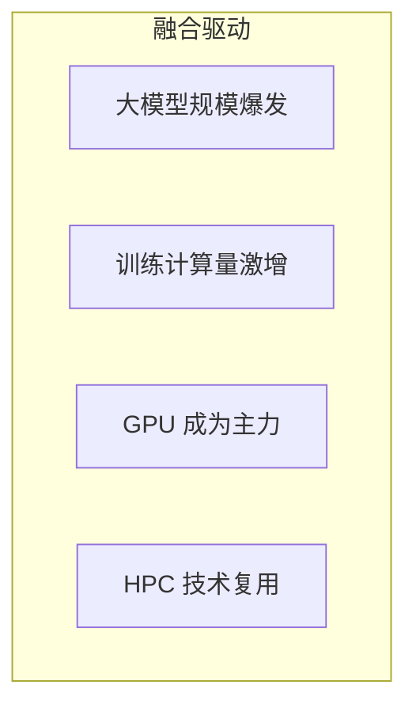

### 6.2 技术复用

| HPC 技术 | AI 应用 |
|----------|---------|
| MPI | 分布式训练通信 |
| 并行文件系统 | 训练数据存储 |
| 作业调度 | GPU 资源管理 |
| 高速网络 | 梯度同步 |

### 6.3 AI 超算

| 系统 | 规模 | 用途 |
|------|------|------|
| NVIDIA DGX Cloud | 万卡级 | AI 训练 |
| 字节跳动 | 10万+ GPU | 大模型 |
| Meta | 24000+ H100 | LLaMA |

---

## 七、HPC 技能体系

### 7.1 核心技能

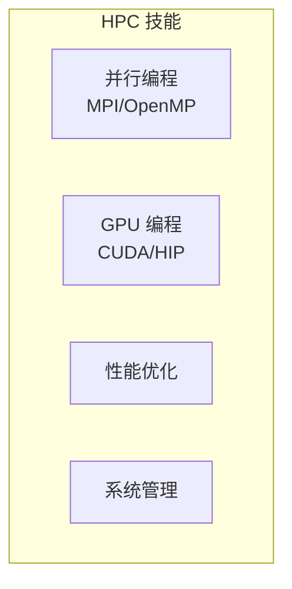

### 7.2 学习路径

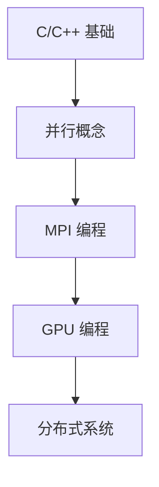

---

## 八、HPC 与 AI Infra 的关系

### 8.1 技术交叉

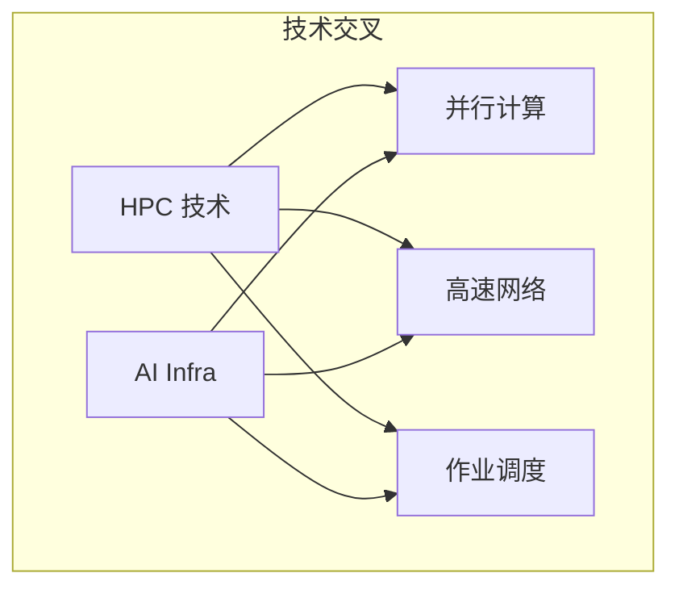

### 8.2 职业关联

| 岗位 | HPC 技能需求 |
|------|-------------|
| 分布式训练工程师 | 高 |
| 推理系统工程师 | 中 |
| AI Infra 工程师 | 中高 |
| 算子工程师 | 中 |

---

## 九、未来展望

### 9.1 技术趋势

| 趋势 | 描述 |
|------|------|
| 百亿亿级 | E 级超算普及 |
| AI 原生 | 专为 AI 设计 |
| 量子混合 | 量子 + 经典 |
| 绿色计算 | 能效优化 |

### 9.2 对 AI 的影响

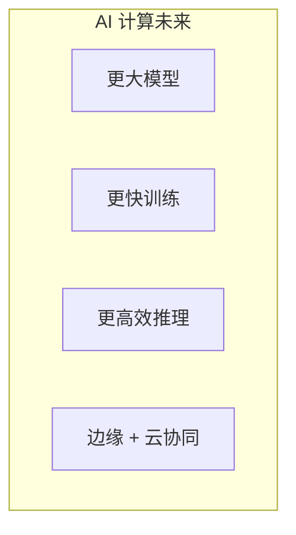

---

## 十、总结

### 10.1 核心认知

1. **HPC 是计算密集问题的解决方案**
   - 并行 + 互联 + 存储

2. **GPU 改变了 HPC**
   - 异构计算成为主流

3. **AI 与 HPC 深度融合**
   - 技术栈高度重叠

4. **HPC 技能对 AI 很重要**
   - 分布式训练必备

### 10.2 学习建议

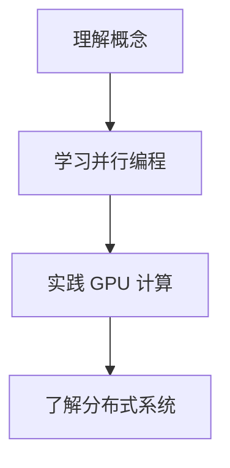

---

## 相关文章

- [下一篇：02 - 并行计算基础](/articles/hpc/hpc-02-并行计算基础/)
- [14 - 分布式训练优化详解](/articles/ai/ai-14-分布式训练优化详解/)
- [21 - CUDA 入门与 GPU 编程基础](/articles/ai/ai-21-CUDA入门与GPU编程基础/)
