+++
title = "02. 并行计算基础"
description = "并行计算的核心概念、模型与性能分析"
date = 2025-02-06
weight = 2000
updated = 2025-02-06
draft = false
[taxonomies]
tags = ["并行计算", "HPC", "Amdahl定律", "并行模型"]
[extra]
toc = true
comments = true
+++

## 一、为什么需要并行计算

### 1.1 串行的极限

| 限制 | 描述 |
|------|------|
| 时钟频率 | 功耗墙限制 ~5GHz |
| 单核性能 | ILP 开发接近极限 |
| 内存带宽 | 内存墙 |

### 1.2 并行的必然

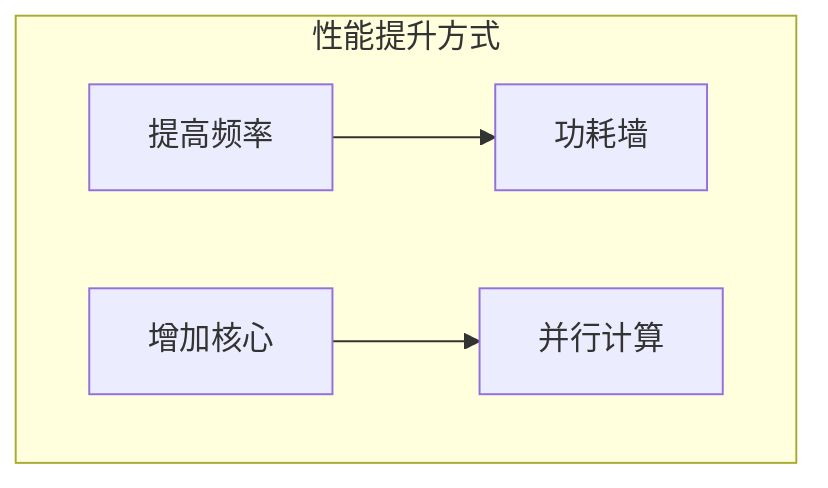

---

## 二、并行计算分类

### 2.1 Flynn 分类法

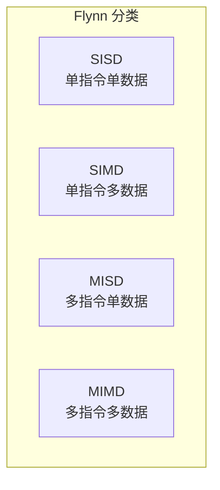

| 类型 | 例子 |
|------|------|
| SISD | 传统单核 CPU |
| SIMD | GPU、向量处理器 |
| MIMD | 多核 CPU、集群 |

### 2.2 并行层次

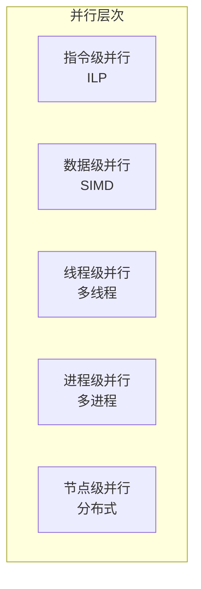

---

## 三、并行编程模型

### 3.1 共享内存模型

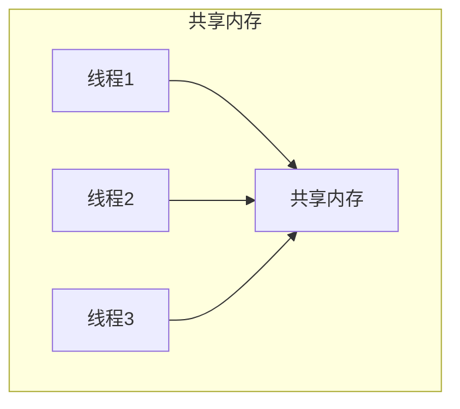

**特点**：
- 线程间共享地址空间
- 通过内存通信
- 需要同步机制

**实现**：OpenMP、Pthreads

### 3.2 分布式内存模型

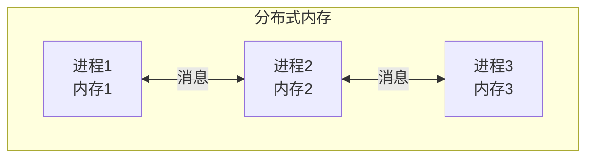

**特点**：
- 进程独立地址空间
- 通过消息传递通信
- 显式数据移动

**实现**：MPI

### 3.3 混合模型

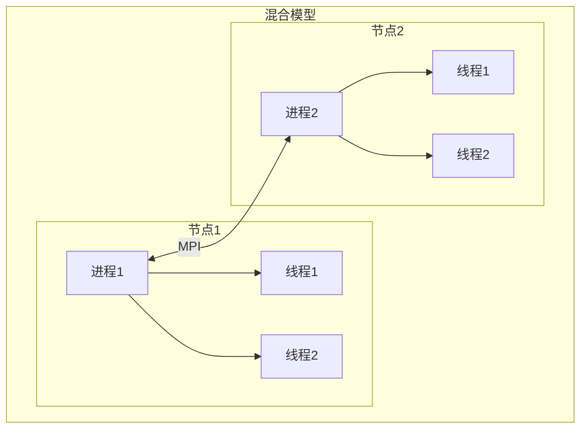

**实现**：MPI + OpenMP

---

## 四、并行算法设计

### 4.1 设计步骤

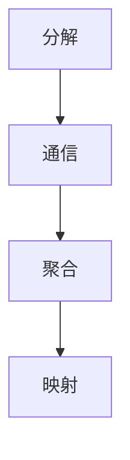

| 步骤 | 内容 |
|------|------|
| 分解 | 划分任务/数据 |
| 通信 | 确定依赖关系 |
| 聚合 | 合并小任务 |
| 映射 | 分配到处理器 |

### 4.2 分解策略

**数据并行**：

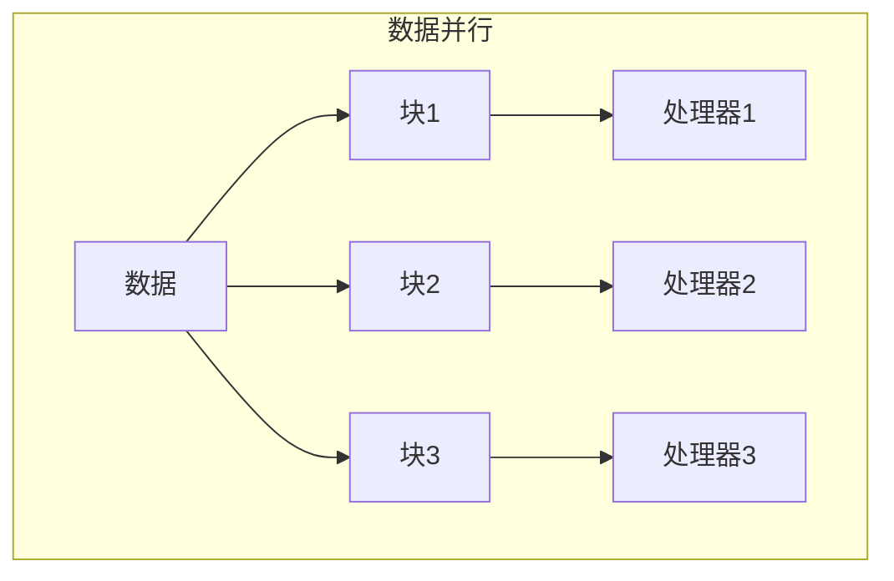

**任务并行**：

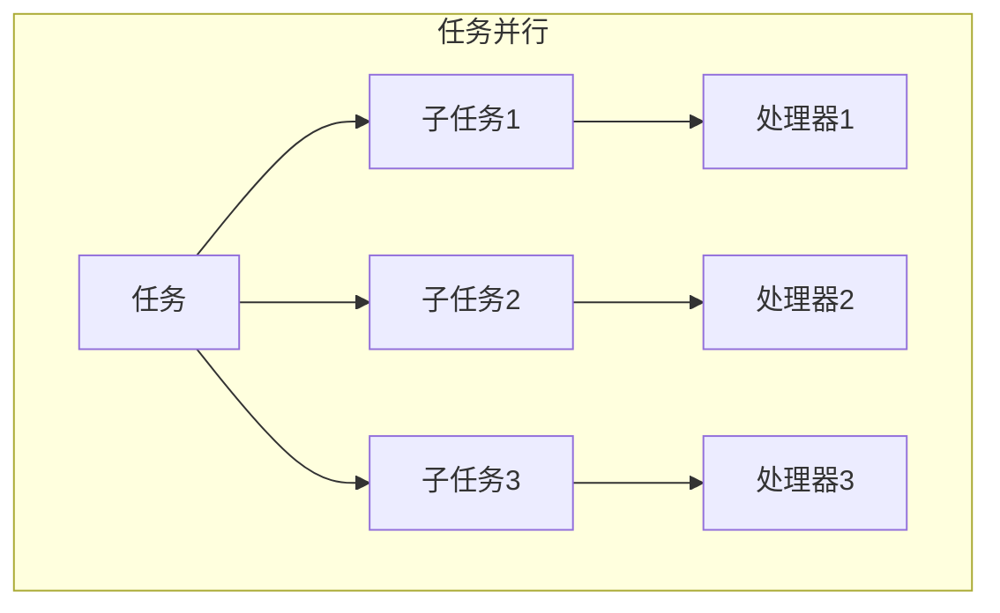

---

## 五、性能分析

### 5.1 Amdahl 定律

**加速比公式**：

```
S(n) = 1 / (f + (1-f)/n)

其中：
- S(n): n 个处理器的加速比
- f: 串行部分比例
- n: 处理器数量
```

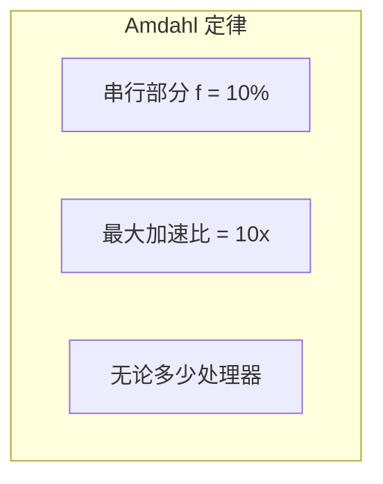

### 5.2 Gustafson 定律

**弱扩展性**：

```
S(n) = n - f × (n - 1)

问题规模随处理器增加
```

### 5.3 效率

```
效率 E = S(n) / n

理想效率 = 1（100%）
```

### 5.4 扩展性

| 类型 | 定义 |
|------|------|
| 强扩展 | 问题固定，增加处理器 |
| 弱扩展 | 每处理器工作量固定 |

---

## 六、同步与通信

### 6.1 同步原语

| 原语 | 作用 |
|------|------|
| Barrier | 等待所有线程到达 |
| Lock/Mutex | 互斥访问 |
| Semaphore | 计数信号量 |
| Condition | 条件变量 |

### 6.2 通信模式

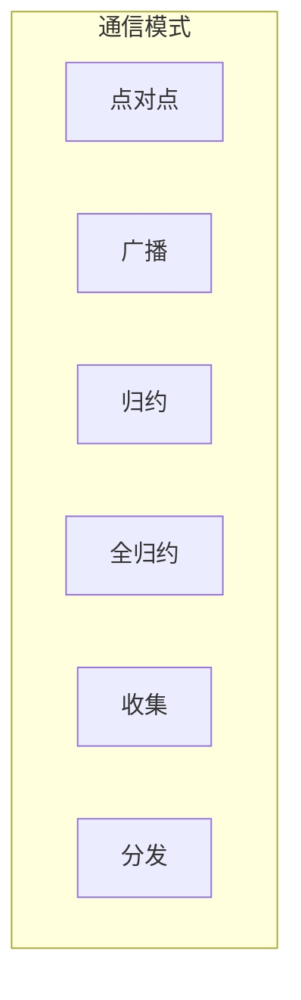

### 6.3 通信开销

```
通信时间 = 延迟 + 数据量/带宽

T = α + n/β
```

---

## 七、常见并行模式

### 7.1 MapReduce

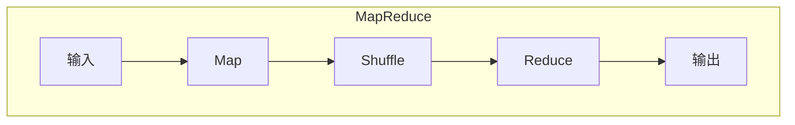

### 7.2 流水线

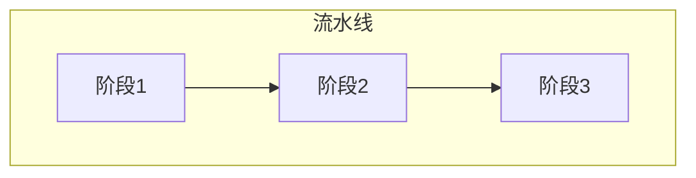

### 7.3 分治

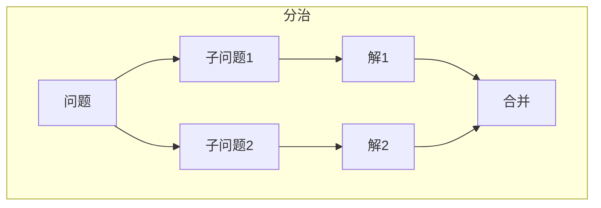

---

## 八、AI 中的并行

### 8.1 数据并行

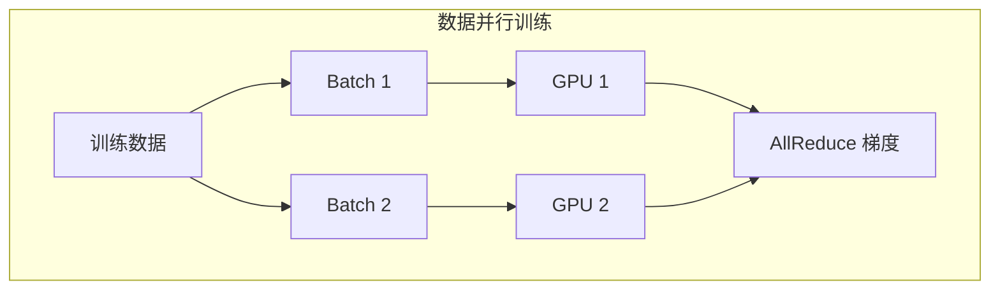

### 8.2 模型并行

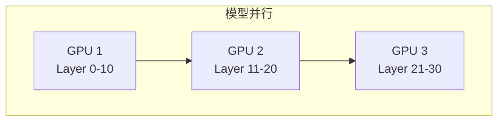

### 8.3 张量并行

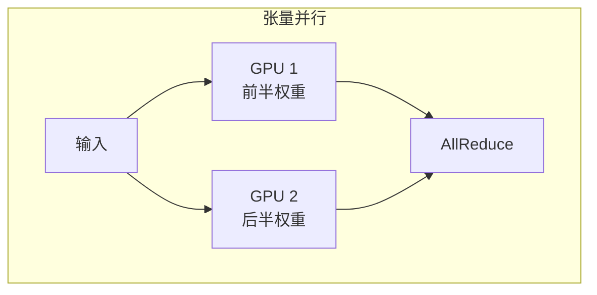

---

## 九、并行计算挑战

### 9.1 常见问题

| 问题 | 描述 |
|------|------|
| 负载不均 | 处理器工作量不均 |
| 通信开销 | 通信占比过高 |
| 同步开销 | 等待时间长 |
| 竞争条件 | 并发访问问题 |
| 死锁 | 循环等待 |

### 9.2 调优方向

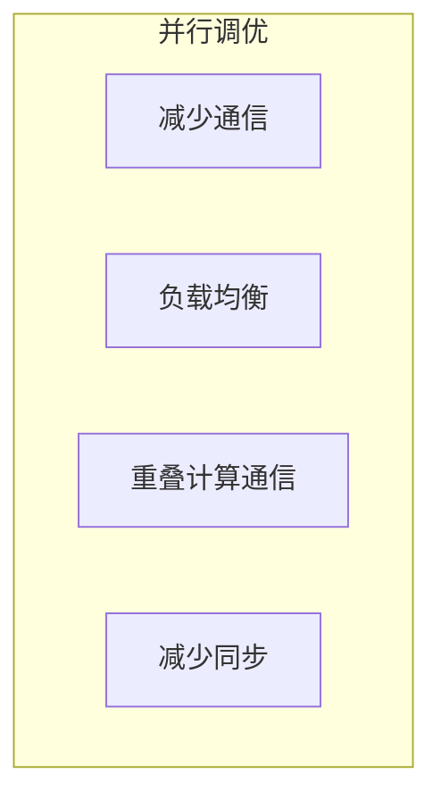

---

## 十、总结

### 10.1 核心认知

1. **并行是必然趋势**
   - 串行性能增长放缓

2. **多种并行模型**
   - 共享内存、分布式、混合

3. **性能有理论上限**
   - Amdahl 定律

4. **AI 大量使用并行**
   - 数据并行、模型并行

### 10.2 学习建议

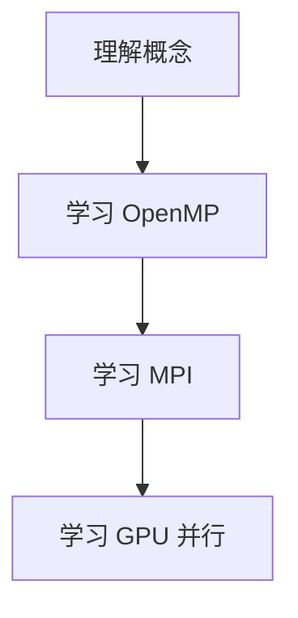

---

## 相关文章

- [上一篇：01 - HPC 概述与发展史](@/articles/hpc/hpc-01-HPC概述与发展史.md)
- [下一篇：03 - MPI 分布式编程](@/articles/hpc/hpc-03-MPI分布式编程.md)
- [21 - CUDA 入门与 GPU 编程基础](@/articles/ai/ai-21-CUDA入门与GPU编程基础.md)
