+++
title = "03 - MPI 分布式编程"
description = "深入理解 MPI 编程模型与分布式计算实践"
date = 2025-02-06
updated = 2025-02-06
draft = false
[taxonomies]
tags = ["MPI", "分布式计算", "HPC", "并行编程"]
[extra]
toc = true
comments = true
+++

## 一、MPI 概述

### 1.1 什么是 MPI

**MPI = Message Passing Interface**

分布式内存并行编程的标准接口。

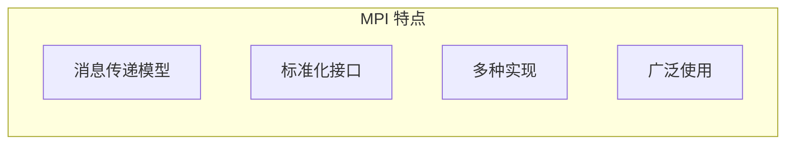

### 1.2 MPI 实现

| 实现 | 特点 |
|------|------|
| OpenMPI | 开源，功能丰富 |
| MPICH | 参考实现 |
| Intel MPI | Intel 优化 |
| MVAPICH | InfiniBand 优化 |

### 1.3 MPI 程序模型

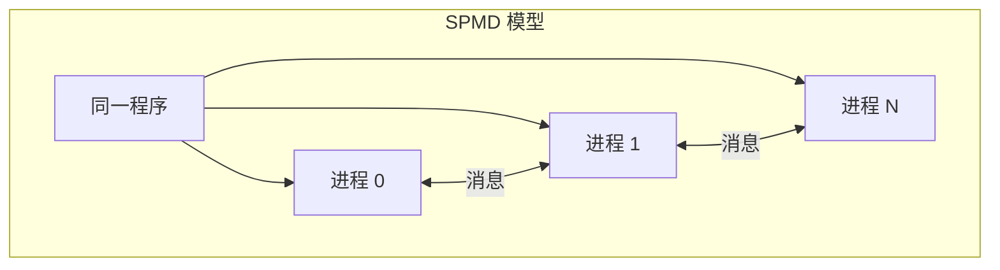

---

## 二、MPI 基础

### 2.1 核心概念

| 概念 | 含义 |
|------|------|
| Communicator | 进程组通信域 |
| Rank | 进程在组中的编号 |
| Size | 进程组大小 |
| Tag | 消息标签 |

### 2.2 程序结构

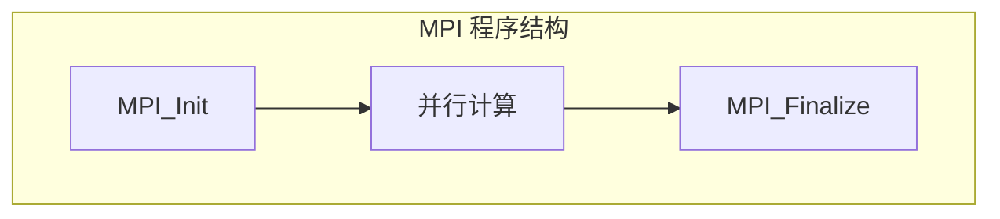

### 2.3 基本函数

| 函数 | 作用 |
|------|------|
| MPI_Init | 初始化 |
| MPI_Finalize | 结束 |
| MPI_Comm_rank | 获取 rank |
| MPI_Comm_size | 获取进程数 |

---

## 三、点对点通信

### 3.1 发送与接收

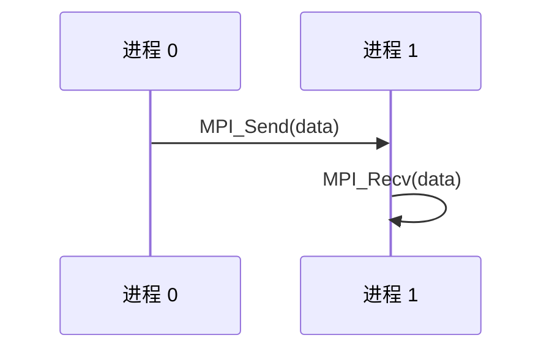

### 3.2 通信模式

| 模式 | 特点 |
|------|------|
| 阻塞发送 | 发送完成才返回 |
| 非阻塞发送 | 立即返回 |
| 同步发送 | 等待接收方确认 |
| 缓冲发送 | 拷贝到缓冲区 |

### 3.3 非阻塞通信

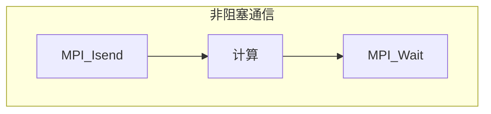

---

## 四、集合通信

### 4.1 常用集合操作

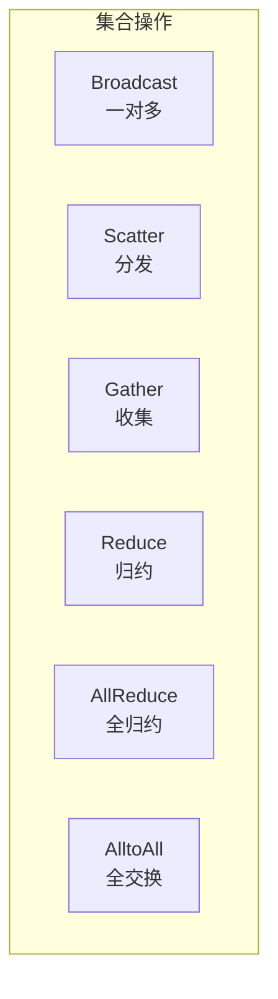

### 4.2 Broadcast

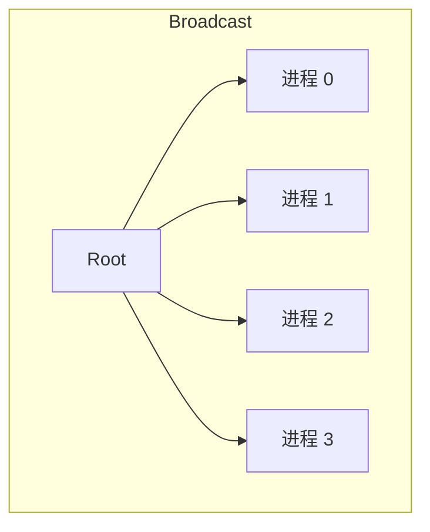

### 4.3 Reduce

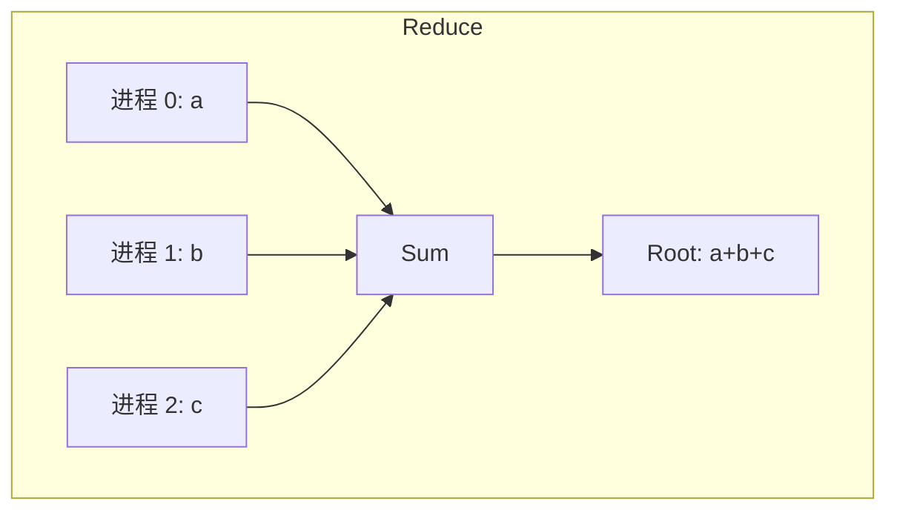

### 4.4 AllReduce

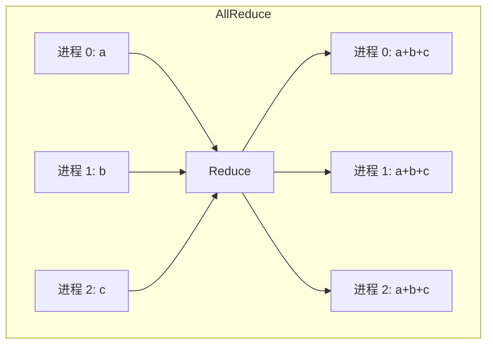

---

## 五、高级特性

### 5.1 派生数据类型

| 用途 | 场景 |
|------|------|
| 非连续数据 | 矩阵列 |
| 结构体 | 复杂数据 |
| 自定义布局 | 灵活需求 |

### 5.2 通信子拓扑

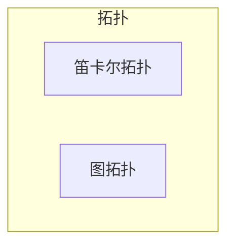

### 5.3 单边通信（RMA）

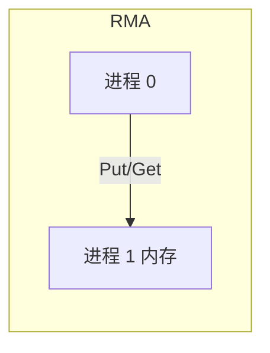

---

## 六、MPI 性能优化

### 6.1 优化原则

| 原则 | 方法 |
|------|------|
| 减少通信 | 本地化计算 |
| 重叠通信计算 | 非阻塞通信 |
| 使用集合通信 | 替代点对点 |
| 避免小消息 | 打包发送 |

### 6.2 通信模式选择

| 场景 | 推荐 |
|------|------|
| 小数据同步 | 阻塞通信 |
| 大数据传输 | 非阻塞通信 |
| 全局同步 | 集合通信 |

### 6.3 负载均衡

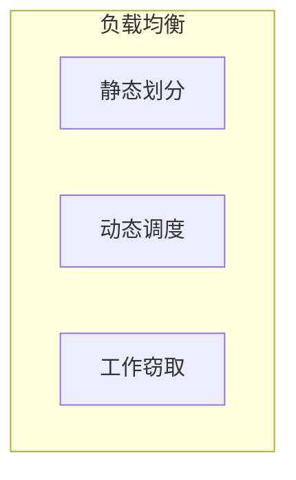

---

## 七、MPI 与 AI

### 7.1 分布式训练中的 MPI

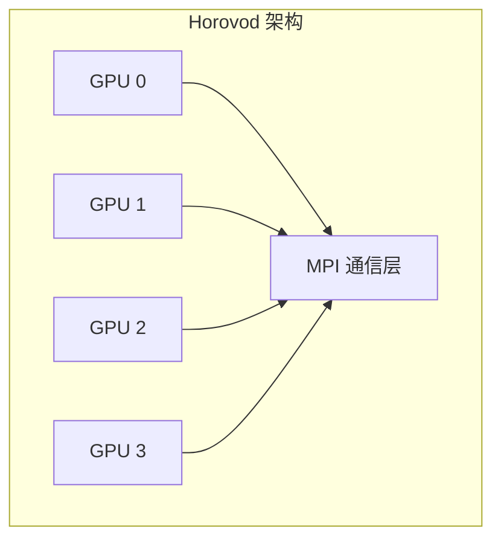

### 7.2 AllReduce 在训练中

| 操作 | 作用 |
|------|------|
| 梯度 AllReduce | 同步梯度 |
| Ring AllReduce | 带宽优化 |
| 分层 AllReduce | 大规模优化 |

### 7.3 NCCL 与 MPI

| 库 | 特点 |
|---|------|
| MPI | 通用，CPU 优化 |
| NCCL | GPU 专用，NVLink 优化 |
| 实践 | 常结合使用 |

---

## 八、实战示例

### 8.1 并行向量加法

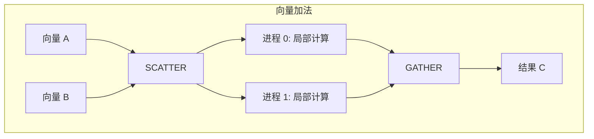

### 8.2 矩阵乘法

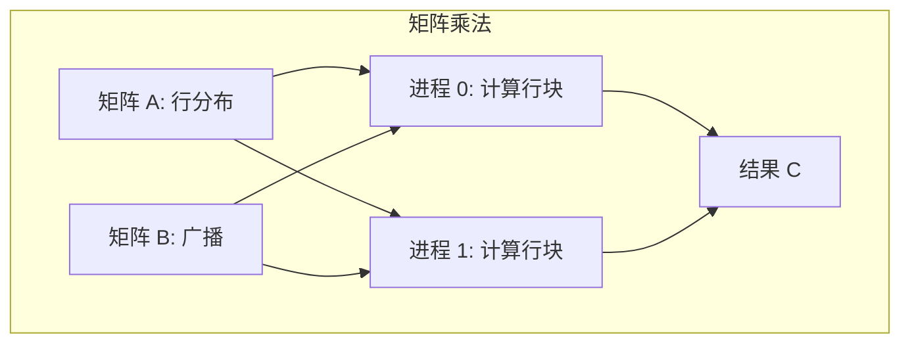

---

## 九、调试与分析

### 9.1 调试工具

| 工具 | 用途 |
|------|------|
| gdb | 单进程调试 |
| TotalView | 并行调试器 |
| DDT | 并行调试器 |

### 9.2 性能分析

| 工具 | 用途 |
|------|------|
| Vampir | MPI 可视化 |
| Score-P | 性能测量 |
| TAU | 性能分析 |

---

## 十、总结

### 10.1 核心认知

1. **MPI 是分布式并行标准**
   - 消息传递模型
   - 广泛使用

2. **点对点 + 集合通信**
   - 灵活组合

3. **AI 训练大量使用**
   - AllReduce 同步梯度

4. **性能优化很重要**
   - 通信是瓶颈

### 10.2 学习建议

---

## 相关文章

- [上一篇：02 - 并行计算基础](/articles/hpc/hpc-02-并行计算基础/)
- [下一篇：04 - GPU 集群通信技术](/articles/hpc/hpc-04-GPU集群通信技术/)
- [14 - 分布式训练优化详解](/articles/ai/ai-14-分布式训练优化详解/)
