+++
title = "04 - GPU 集群通信技术"
description = "深入理解 GPU 集群的通信架构与优化技术"
date = 2025-02-06
updated = 2025-02-06
draft = false
[taxonomies]
tags = ["NCCL", "NVLink", "InfiniBand", "GPU集群"]
[extra]
toc = true
comments = true
+++

## 一、GPU 集群通信概述

### 1.1 为什么通信重要

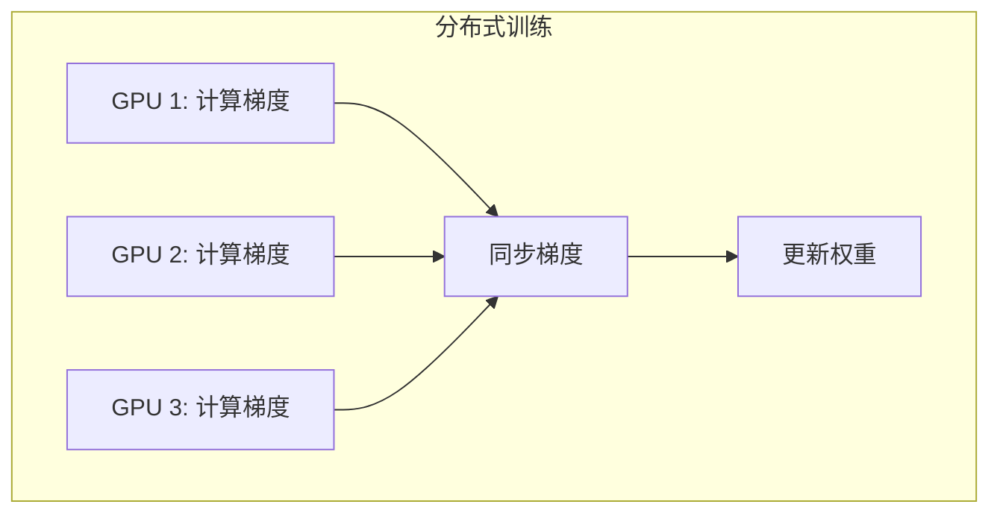

**通信是分布式训练的关键瓶颈**

### 1.2 通信层次

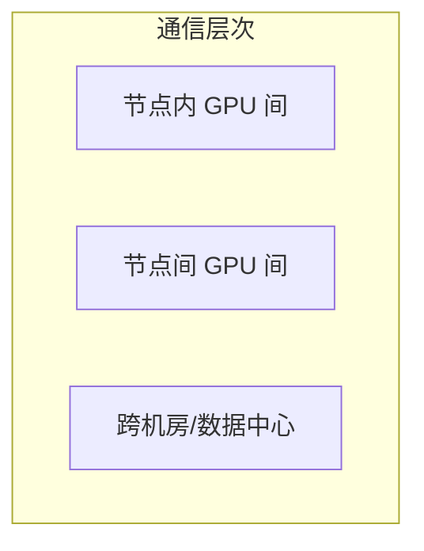

| 层次 | 带宽 | 延迟 |
|------|------|------|
| 节点内 | 600+ GB/s | 极低 |
| 节点间 | 400 Gb/s | 低 |
| 跨机房 | 变化大 | 高 |

---

## 二、硬件互联技术

### 2.1 NVLink

**NVIDIA GPU 间高速互联**

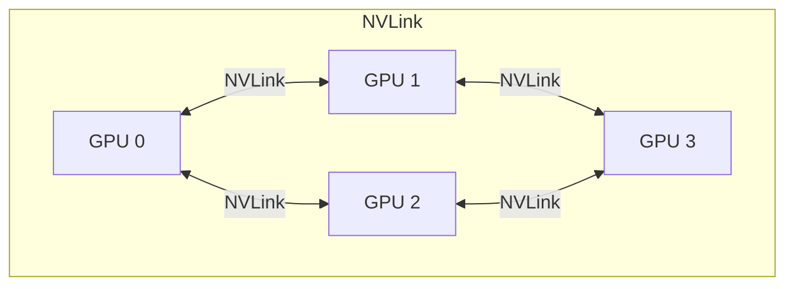

| 版本 | 带宽 |
|------|------|
| NVLink 3 (A100) | 600 GB/s |
| NVLink 4 (H100) | 900 GB/s |
| NVLink 5 (B200) | 1.8 TB/s |

### 2.2 NVSwitch

**全连接 NVLink 交换机**

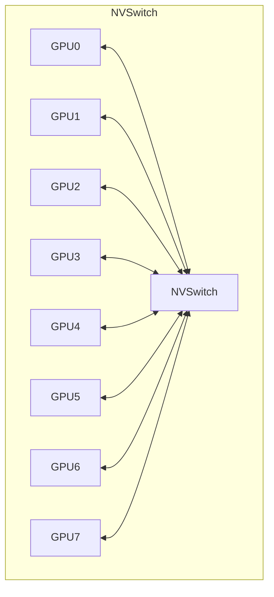

### 2.3 InfiniBand

**节点间高速网络**

| 版本 | 带宽 |
|------|------|
| HDR | 200 Gb/s |
| NDR | 400 Gb/s |
| XDR | 800 Gb/s |

### 2.4 GPUDirect

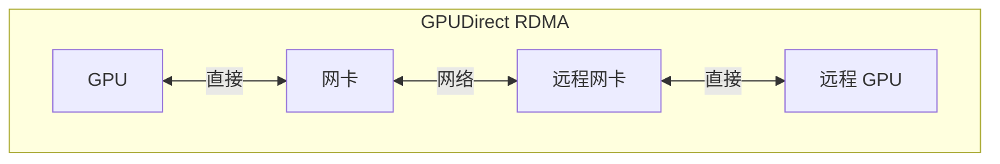

**跳过 CPU，GPU 直接访问网络**

---

## 三、NCCL

### 3.1 什么是 NCCL

**NCCL = NVIDIA Collective Communications Library**

GPU 集合通信优化库

### 3.2 支持的操作

| 操作 | 作用 |
|------|------|
| AllReduce | 全归约（最常用） |
| Broadcast | 广播 |
| Reduce | 归约 |
| AllGather | 全收集 |
| ReduceScatter | 归约分发 |

### 3.3 Ring AllReduce

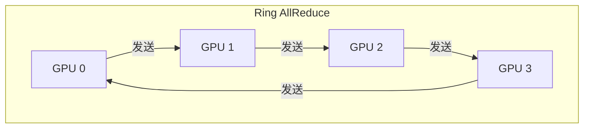

**通信时间与 GPU 数无关**

### 3.4 分层通信

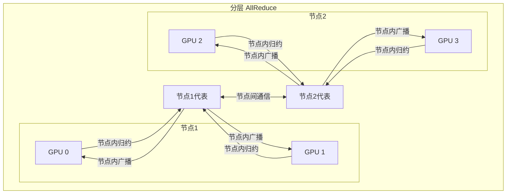

---

## 四、通信拓扑

### 4.1 DGX 拓扑

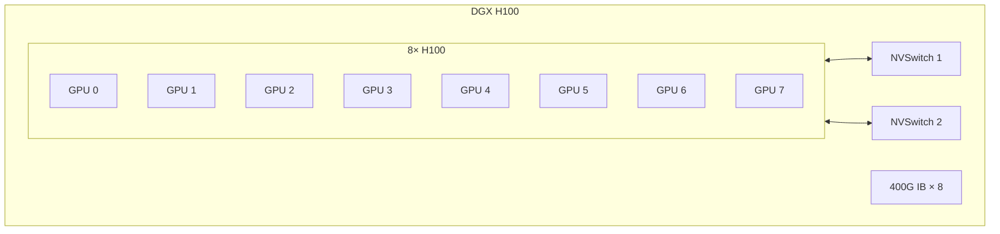

### 4.2 集群拓扑

---

## 五、通信优化

### 5.1 计算通信重叠

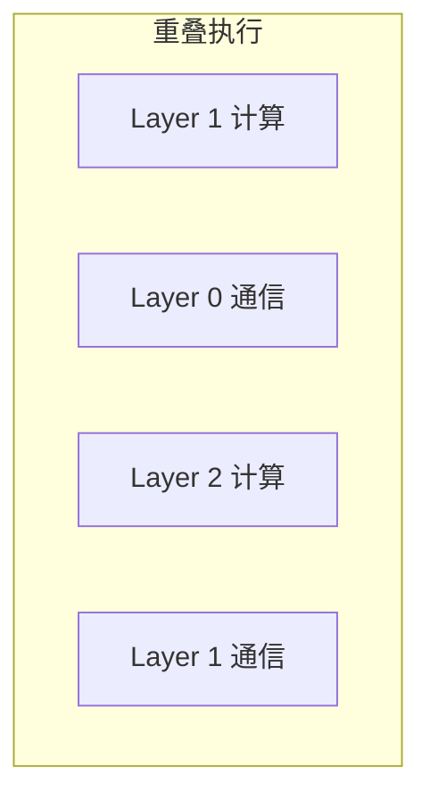

### 5.2 梯度累积

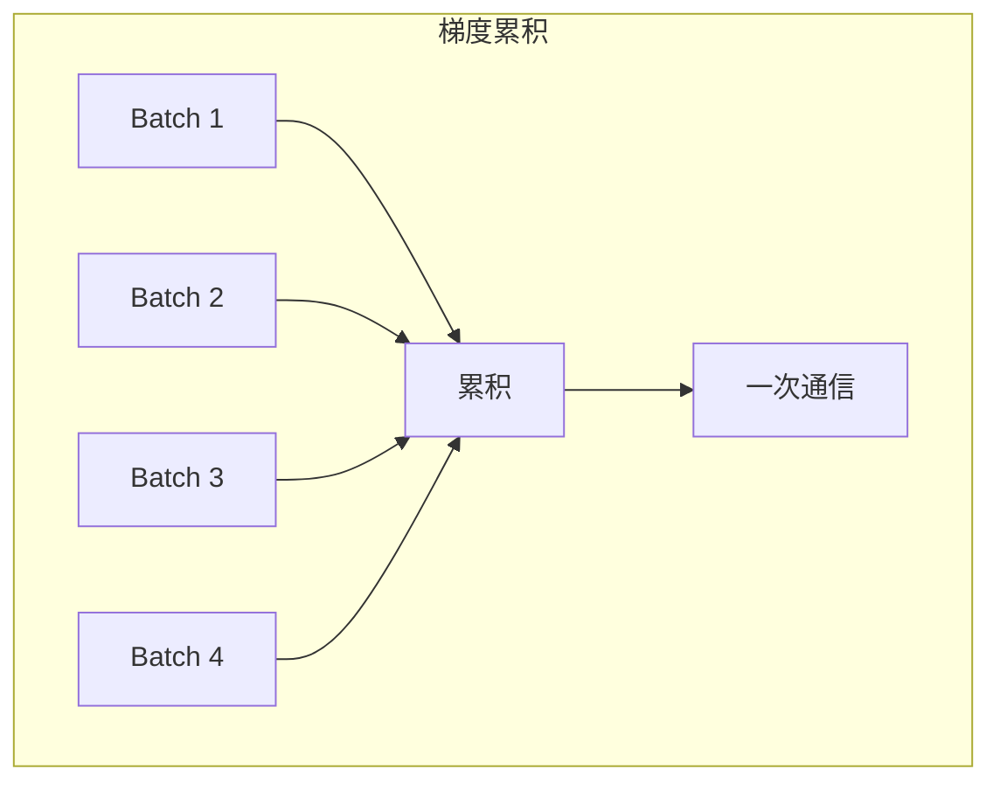

### 5.3 压缩通信

| 方法 | 压缩比 |
|------|--------|
| FP16 | 2x |
| INT8 | 4x |
| 稀疏化 | 变化 |
| 量化 | 变化 |

---

## 六、RCCL 与其他

### 6.1 RCCL

**AMD GPU 的集合通信库**

| 对比 | NCCL | RCCL |
|------|------|------|
| 厂商 | NVIDIA | AMD |
| GPU | CUDA | ROCm |
| 互联 | NVLink | Infinity Fabric |

### 6.2 Gloo

**CPU/GPU 通用集合通信**

| 特点 | 描述 |
|------|------|
| 跨平台 | CPU + GPU |
| PyTorch | 默认后端之一 |

---

## 七、分布式训练通信

### 7.1 数据并行通信

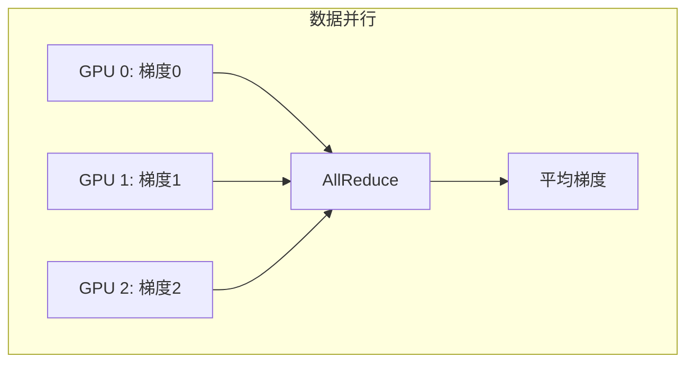

### 7.2 模型并行通信

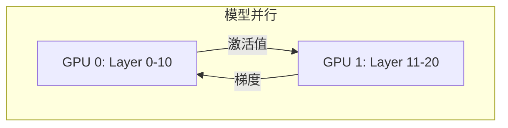

### 7.3 张量并行通信

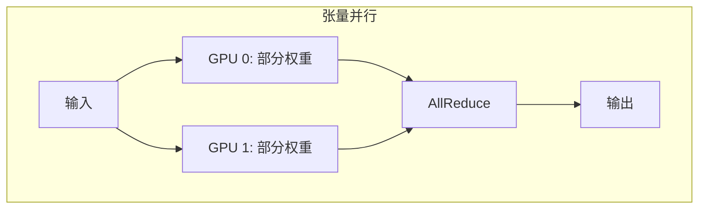

---

## 八、通信调试与分析

### 8.1 NCCL 调试

| 环境变量 | 作用 |
|----------|------|
| NCCL_DEBUG=INFO | 调试信息 |
| NCCL_DEBUG_SUBSYS | 子系统调试 |
| NCCL_GRAPH_DUMP_FILE | 拓扑导出 |

### 8.2 性能分析

| 工具 | 用途 |
|------|------|
| Nsight Systems | 通信时序 |
| NCCL 内置统计 | 通信性能 |
| nvidia-smi | NVLink 使用 |

---

## 九、常见问题

### 9.1 性能问题

| 问题 | 可能原因 |
|------|----------|
| 带宽低 | 未使用 NVLink |
| 延迟高 | 跨节点通信 |
| 利用率低 | 未重叠计算 |

### 9.2 配置问题

| 问题 | 解决 |
|------|------|
| NCCL 超时 | 增大超时时间 |
| 初始化失败 | 检查网络配置 |
| 性能不稳定 | 固定 GPU 亲和性 |

---

## 十、总结

### 10.1 核心认知

1. **通信是分布式关键**
   - 决定扩展效率

2. **硬件决定上限**
   - NVLink、InfiniBand

3. **NCCL 是标准库**
   - GPU 集合通信首选

4. **优化很重要**
   - 重叠、压缩、分层

### 10.2 学习建议

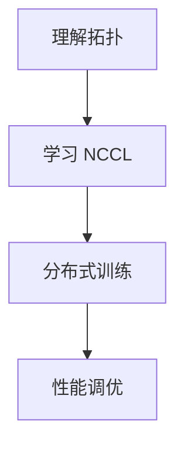

---

## 相关文章

- [上一篇：03 - MPI 分布式编程](/articles/hpc/hpc-03-MPI分布式编程/)
- [下一篇：05 - 分布式训练技术详解](/articles/hpc/hpc-05-分布式训练技术详解/)
- [14 - 分布式训练优化详解](/articles/ai/ai-14-分布式训练优化详解/)
- [07 - UCX 统一通信框架详解](/articles/hpc/hpc-07-UCX统一通信框架详解/)
- [net-27 - 网内计算技术详解](/articles/networking/net-27-网内计算技术详解/)
