+++
title = "分布式训练技术详解"
description = "深入理解大模型分布式训练的各种并行策略与优化技术"
date = 2025-02-06
weight = 5000
updated = 2025-02-06
draft = false
[taxonomies]
tags = ["分布式训练", "数据并行", "模型并行", "3D并行"]
[extra]
toc = true
comments = true
+++

## 一、为什么需要分布式训练

### 1.1 大模型的挑战

| 挑战 | 数据 |
|------|------|
| GPT-3 参数 | 175B |
| 单卡显存 | 80GB (H100) |
| GPT-3 显存需求 | ~700GB (FP16) |
| 训练数据 | 数百 TB |

### 1.2 分布式的目标

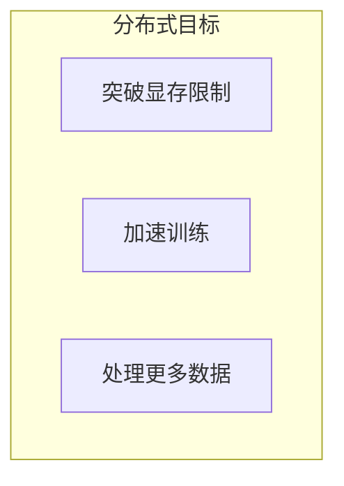

---

## 二、数据并行

### 2.1 原理

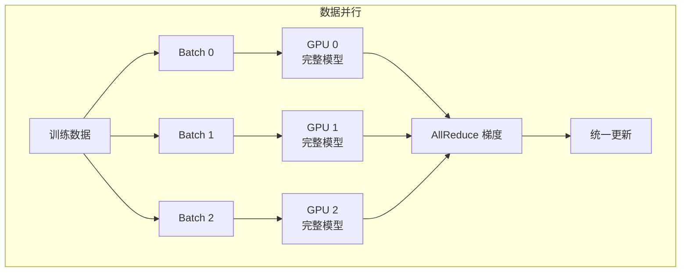

### 2.2 特点

| 优点 | 缺点 |
|------|------|
| 实现简单 | 每卡存完整模型 |
| 线性扩展 | 通信开销随 GPU 增加 |
| 广泛支持 | 大模型放不下 |

### 2.3 实现

| 框架 | 实现 |
|------|------|
| PyTorch | DistributedDataParallel (DDP) |
| Horovod | hvd.DistributedOptimizer |
| DeepSpeed | ZeRO Stage 0 |

---

## 三、模型并行

### 3.1 流水线并行

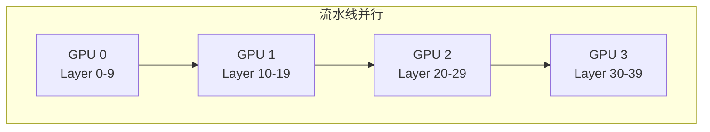

**气泡问题**：

```
时间 →
GPU 0: [B0][B1][B2][B3][ ][ ][ ][ ]...
GPU 1: [ ][B0][B1][B2][B3][ ][ ][ ]...
GPU 2: [ ][ ][B0][B1][B2][B3][ ][ ]...
GPU 3: [ ][ ][ ][B0][B1][B2][B3][ ]...

气泡 = 空闲时间
```

**优化**：微批次、交错调度

### 3.2 张量并行

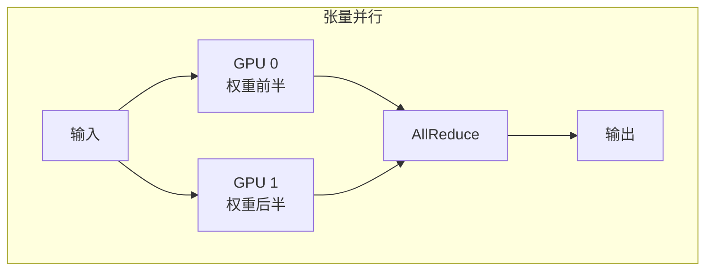

**特点**：
- 每层内切分
- 通信频繁
- 适合节点内

### 3.3 序列并行

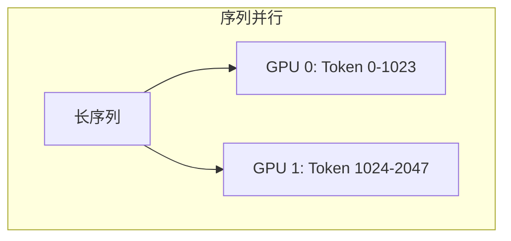

---

## 四、ZeRO 优化

### 4.1 ZeRO 思想

**零冗余优化器**：切分优化器状态、梯度、参数

### 4.2 ZeRO 阶段

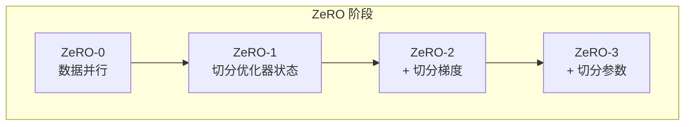

| 阶段 | 显存节省 |
|------|----------|
| ZeRO-1 | 4x |
| ZeRO-2 | 8x |
| ZeRO-3 | N x (N=GPU数) |

### 4.3 ZeRO-Offload

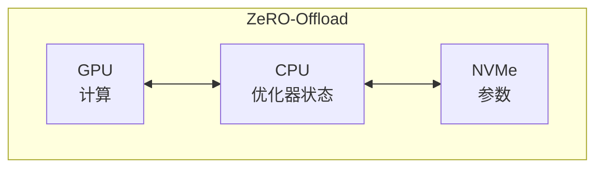

---

## 五、3D 并行

### 5.1 组合策略

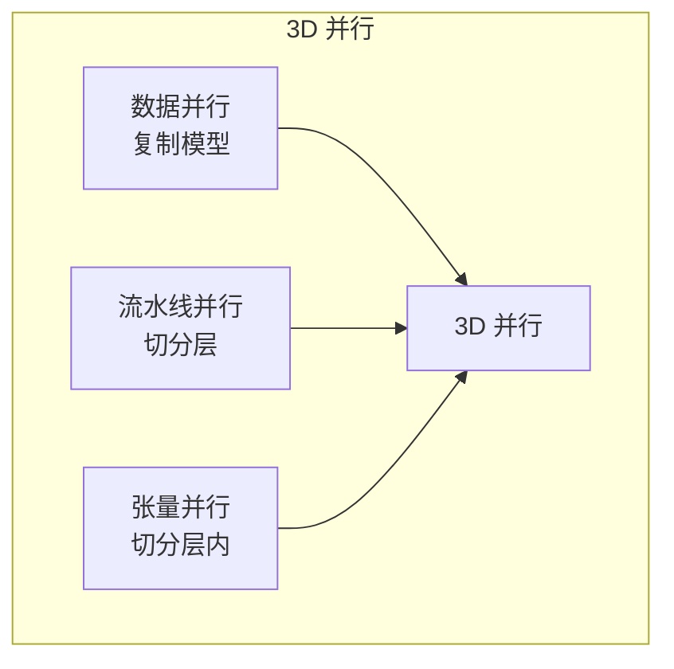

### 5.2 配置示例

| 配置 | 描述 |
|------|------|
| DP=8, TP=1, PP=1 | 纯数据并行 |
| DP=1, TP=8, PP=1 | 纯张量并行 |
| DP=4, TP=2, PP=4 | 3D 并行 |

### 5.3 Megatron-LM

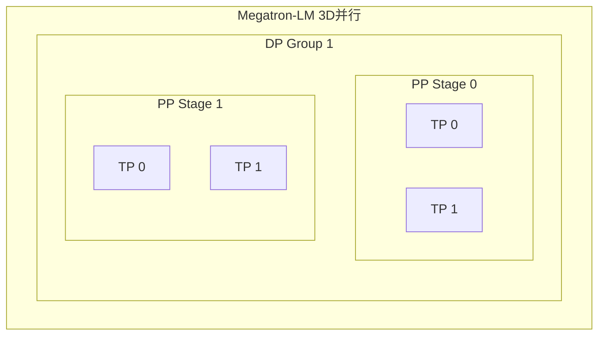

---

## 六、通信优化

### 6.1 梯度压缩

| 方法 | 描述 |
|------|------|
| FP16 | 半精度梯度 |
| 量化 | INT8 梯度 |
| 稀疏化 | 只传大梯度 |

### 6.2 计算通信重叠

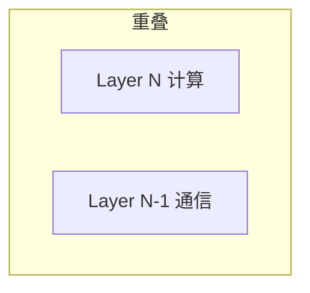

### 6.3 分层 AllReduce

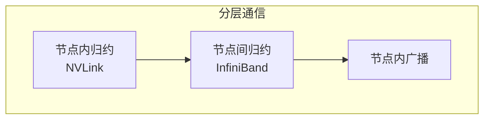

---

## 七、框架对比

### 7.1 主流框架

| 框架 | 特点 |
|------|------|
| PyTorch FSDP | 官方 ZeRO 实现 |
| DeepSpeed | 微软，功能丰富 |
| Megatron-LM | NVIDIA，3D 并行 |
| ColossalAI | 易用，多种并行 |

### 7.2 选择建议

| 场景 | 推荐 |
|------|------|
| 快速上手 | FSDP |
| 大规模训练 | Megatron + DeepSpeed |
| 显存极限 | DeepSpeed ZeRO-3 |

---

## 八、实践建议

### 8.1 配置选择

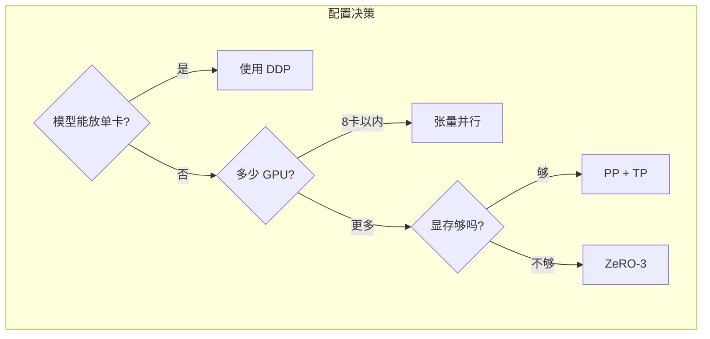

### 8.2 调优步骤

1. 先跑通单卡
2. 加入数据并行
3. 根据显存加并行
4. 调优通信
5. 调整批大小

---

## 九、常见问题

### 9.1 性能问题

| 问题 | 可能原因 |
|------|----------|
| 扩展效率低 | 通信瓶颈 |
| 显存不足 | 需要更多并行 |
| 训练不稳定 | 学习率需调整 |

### 9.2 调试技巧

| 技巧 | 方法 |
|------|------|
| 单 GPU 验证 | 先确保正确 |
| 小规模测试 | 2-4 GPU 调通 |
| 逐步扩展 | 逐渐增加规模 |

---

## 十、总结

### 10.1 核心认知

1. **多种并行策略**
   - 数据、模型、张量、流水线

2. **ZeRO 突破显存**
   - 切分一切

3. **3D 并行是大规模标配**
   - 组合使用

4. **通信是关键**
   - 决定扩展效率

### 10.2 学习建议

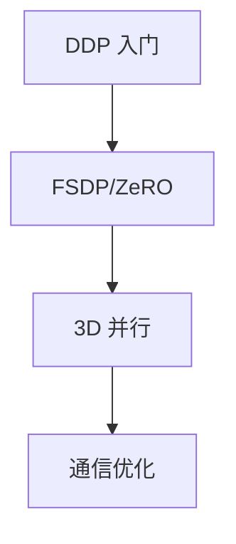

---

## 相关文章

- [上一篇：04 - GPU 集群通信技术](@/articles/hpc/hpc-04-GPU集群通信技术.md)
- [下一篇：06 - 集群作业调度系统](@/articles/hpc/hpc-06-集群作业调度系统.md)
- [14 - 分布式训练优化详解](@/articles/ai/ai-14-分布式训练优化详解.md)
