+++
title = "06 - 集群作业调度系统"
description = "理解 GPU 集群的作业调度与资源管理"
date = 2025-02-06
updated = 2025-02-06
draft = false
[taxonomies]
tags = ["Slurm", "Kubernetes", "作业调度", "GPU集群"]
[extra]
toc = true
comments = true
+++

## 一、为什么需要作业调度

### 1.1 资源共享问题

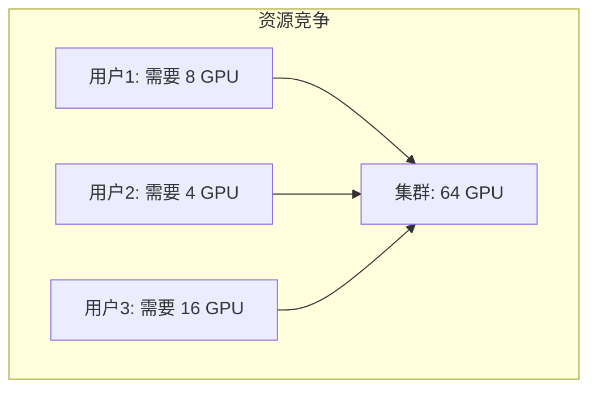

### 1.2 调度目标

| 目标 | 描述 |
|------|------|
| 公平性 | 用户公平分享资源 |
| 利用率 | 最大化资源使用 |
| 吞吐量 | 完成更多作业 |
| 响应性 | 减少等待时间 |

---

## 二、Slurm

### 2.1 什么是 Slurm

**Slurm = Simple Linux Utility for Resource Management**

最流行的 HPC 作业调度器

### 2.2 架构

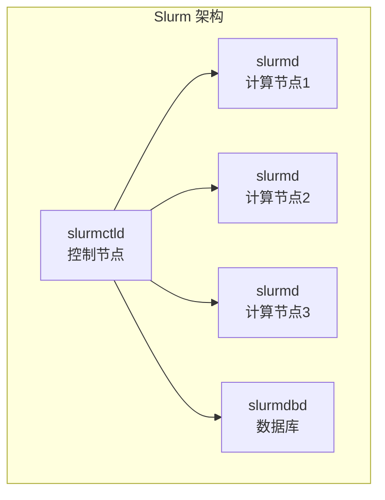

### 2.3 核心概念

| 概念 | 含义 |
|------|------|
| 分区（Partition） | 节点分组 |
| 作业（Job） | 用户提交的任务 |
| 步骤（Step） | 作业内的步骤 |
| 任务（Task） | 并行任务单元 |

### 2.4 常用命令

| 命令 | 作用 |
|------|------|
| sinfo | 查看集群状态 |
| squeue | 查看队列 |
| sbatch | 提交批处理作业 |
| srun | 运行交互任务 |
| scancel | 取消作业 |
| sacct | 查看历史 |

### 2.5 GPU 支持

```bash
#SBATCH --gres=gpu:8
#SBATCH --nodes=2
#SBATCH --ntasks-per-node=8
```

---

## 三、Kubernetes + GPU

### 3.1 架构

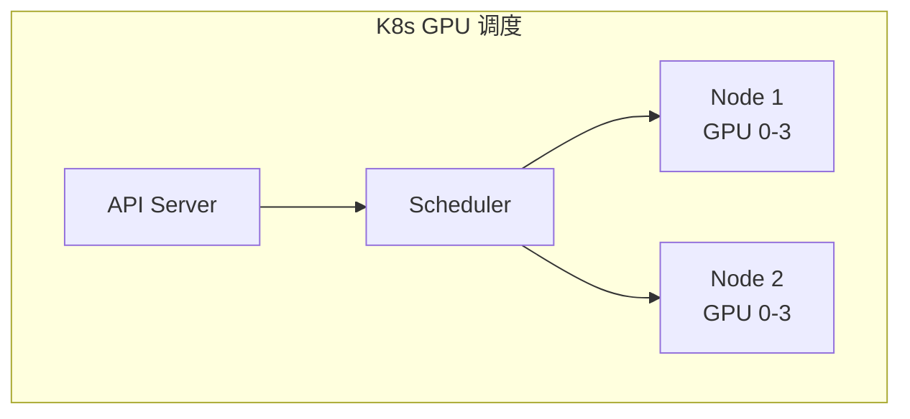

### 3.2 GPU 资源

```yaml
resources:
  limits:
    nvidia.com/gpu: 4
```

### 3.3 Device Plugin

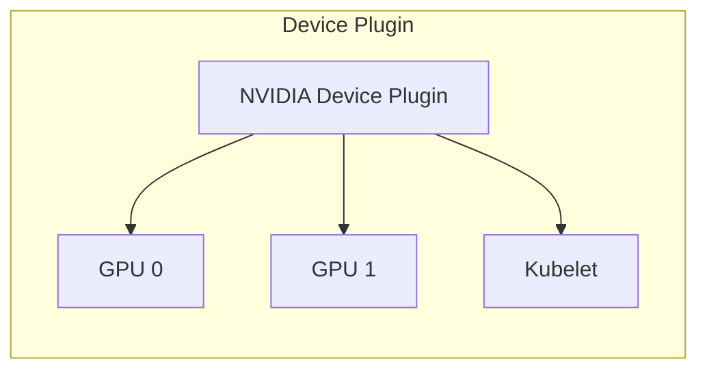

### 3.4 调度扩展

| 组件 | 作用 |
|------|------|
| GPU Feature Discovery | GPU 特性发现 |
| GPU Operator | 自动化部署 |
| 调度器扩展 | 拓扑感知调度 |

---

## 四、调度策略

### 4.1 基础策略

| 策略 | 描述 |
|------|------|
| FIFO | 先来先服务 |
| Backfill | 回填调度 |
| Fair Share | 公平共享 |
| Priority | 优先级调度 |

### 4.2 回填调度

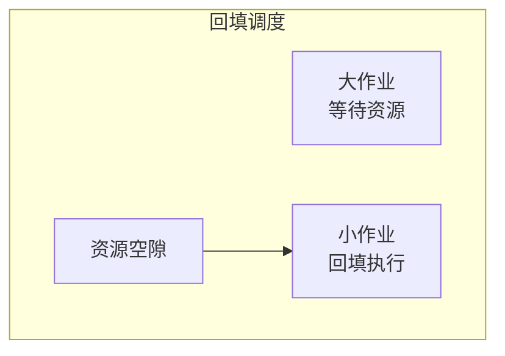

### 4.3 公平共享

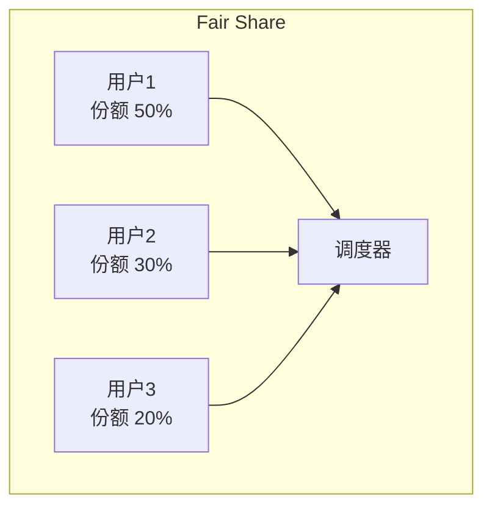

---

## 五、GPU 调度特殊考虑

### 5.1 拓扑感知

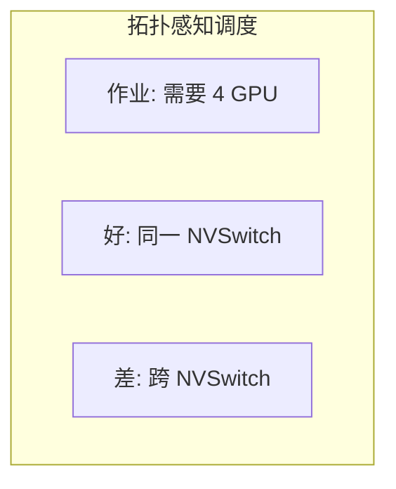

### 5.2 独占 vs 共享

| 模式 | 特点 |
|------|------|
| 独占 | 作业独占 GPU |
| MIG | GPU 分区 |
| 时分复用 | 多作业共享 |

### 5.3 MIG（Multi-Instance GPU）

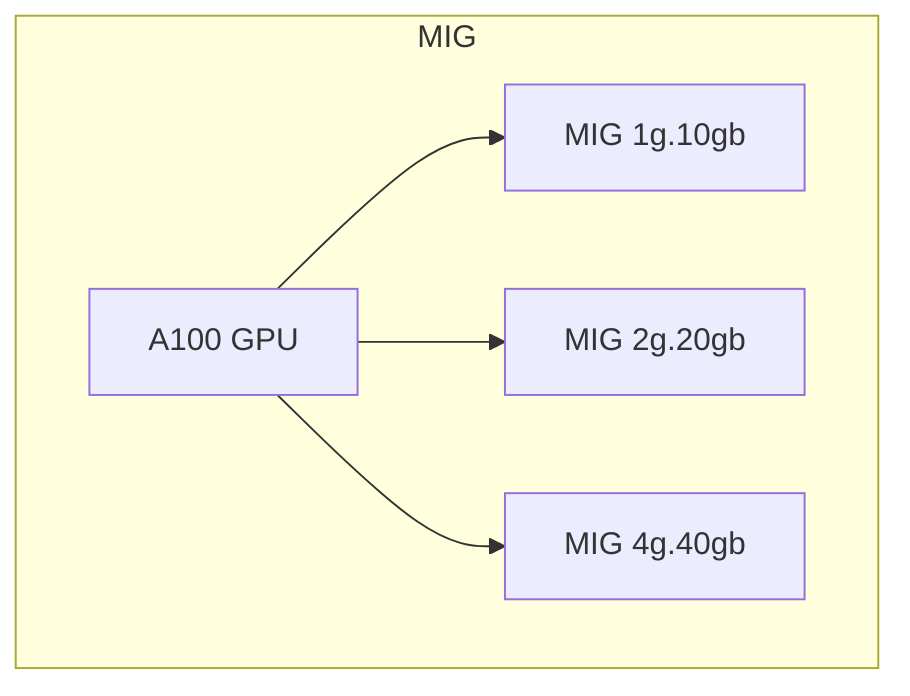

---

## 六、AI 训练调度

### 6.1 特殊需求

| 需求 | 原因 |
|------|------|
| 多 GPU | 模型大 |
| 长时间 | 训练久 |
| 弹性 | 节点故障 |
| 抢占恢复 | 优先级变化 |

### 6.2 Checkpoint

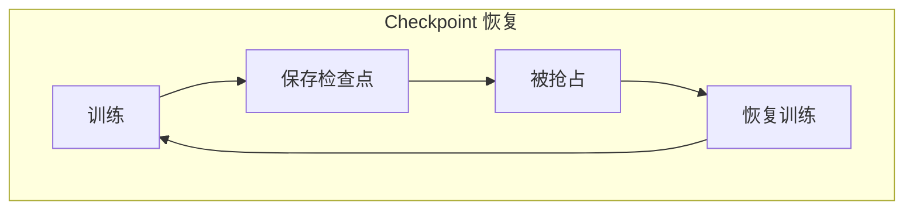

### 6.3 弹性训练

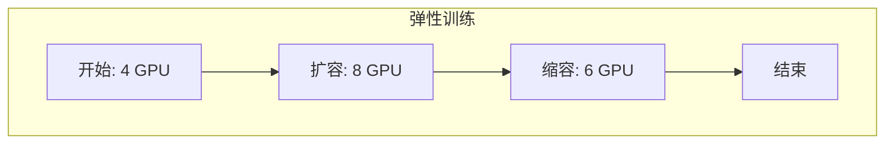

---

## 七、监控与运维

### 7.1 监控指标

| 指标 | 含义 |
|------|------|
| GPU 利用率 | 计算使用 |
| 显存使用 | 内存占用 |
| 队列等待 | 作业积压 |
| 完成率 | 成功比例 |

### 7.2 告警

| 告警 | 条件 |
|------|------|
| GPU 故障 | Xid 错误 |
| 长时间排队 | > 阈值 |
| 利用率低 | < 50% |

---

## 八、云上 GPU 调度

### 8.1 云服务

| 服务 | 特点 |
|------|------|
| AWS SageMaker | 托管训练 |
| Azure ML | 微软云 |
| GCP Vertex AI | Google 云 |
| 阿里 PAI | 阿里云 |

### 8.2 混合调度

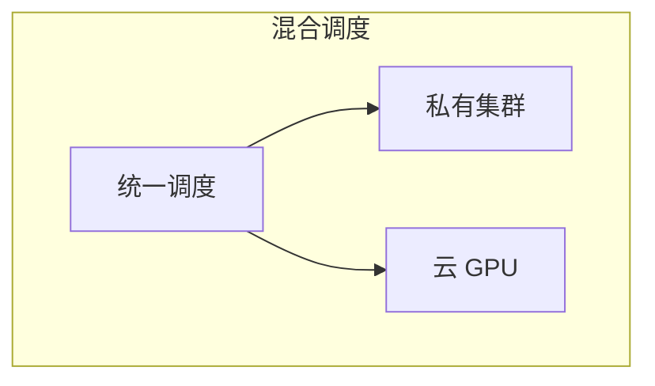

---

## 九、最佳实践

### 9.1 作业设计

| 实践 | 建议 |
|------|------|
| 检查点 | 定期保存 |
| 资源请求 | 准确估计 |
| 日志 | 输出到文件 |
| 超时 | 设置合理时限 |

### 9.2 资源管理

| 实践 | 建议 |
|------|------|
| 配额 | 限制用户资源 |
| 优先级 | 区分紧急程度 |
| 预留 | 关键任务预留 |

---

## 十、总结

### 10.1 核心认知

1. **调度器管理共享资源**
   - 公平、高效

2. **Slurm 是 HPC 主流**
   - 功能丰富

3. **K8s + GPU 是云原生方向**
   - 弹性伸缩

4. **AI 训练有特殊需求**
   - 长时间、多 GPU、弹性

### 10.2 学习建议

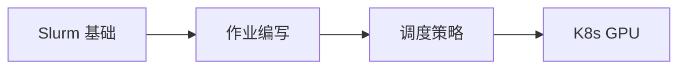

---

## 相关文章

- [上一篇：05 - 分布式训练技术详解](/articles/hpc/hpc-05-分布式训练技术详解/)
- [下一篇：07 - UCX 统一通信框架详解](/articles/hpc/hpc-07-UCX统一通信框架详解/)
- [14 - 分布式训练优化详解](/articles/ai/ai-14-分布式训练优化详解/)
- [01 - HPC 概述与发展史](/articles/hpc/hpc-01-HPC概述与发展史/)
