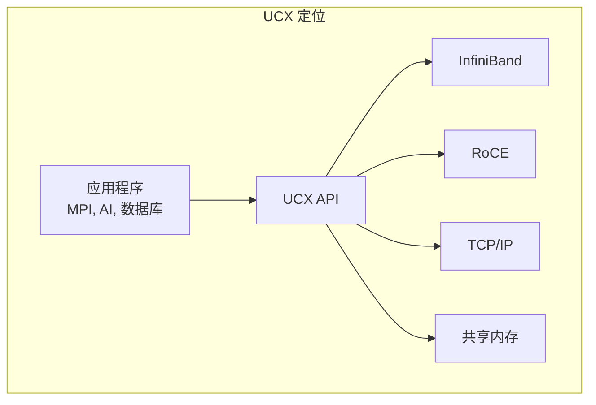
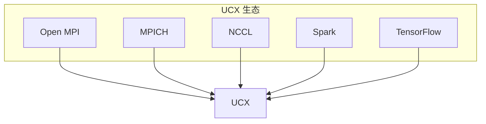
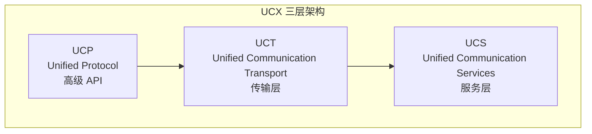
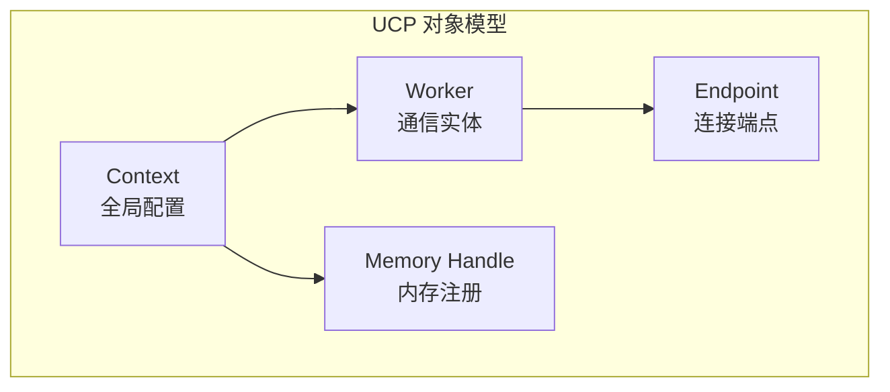
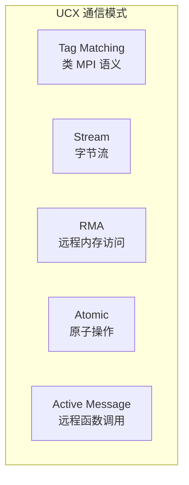
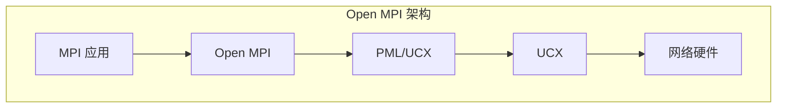
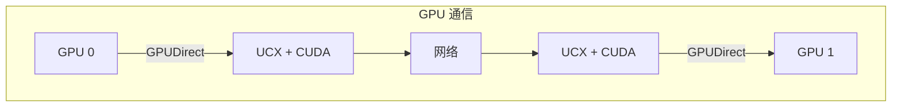

+++
title = "07 - UCX 统一通信框架详解"
description = "Unified Communication X 架构、编程接口与高性能应用开发"
date = 2025-02-07
updated = 2025-02-07
draft = false
[taxonomies]
tags = ["UCX", "HPC", "通信", "RDMA", "MPI", "高性能"]
[extra]
toc = true
comments = true
+++

## 一、UCX 概述

### 1.1 什么是 UCX

UCX（Unified Communication X）是一个高性能通信框架，提供统一的 API 来支持多种网络传输技术，包括 InfiniBand、RoCE、TCP/IP、共享内存等。



### 1.2 设计目标

| 目标 | 说明 |
|------|------|
| **高性能** | 接近原生硬件性能 |
| **可移植** | 统一 API，多传输支持 |
| **可扩展** | 支持百万节点 |
| **灵活** | 按需选择传输方式 |

### 1.3 使用者



---

## 二、UCX 架构

### 2.1 分层架构



### 2.2 UCP 层

- 提供高级通信原语
- 自动选择最优传输
- 支持 Tag Matching、RMA、Atomic
- 隐藏底层复杂性

### 2.3 UCT 层

| 传输类型 | 实现 |
|----------|------|
| **InfiniBand** | RC, UD, DC |
| **RoCE** | RC over Ethernet |
| **TCP** | TCP sockets |
| **共享内存** | POSIX, CMA, KNEM |
| **GPU** | CUDA, ROCm |

### 2.4 UCS 层

- 内存管理
- 数据结构
- 配置管理
- 调试和统计

---

## 三、核心概念

### 3.1 主要对象



| 对象 | 职责 |
|------|------|
| **Context** | 全局资源管理，配置 |
| **Worker** | 进度引擎，事件处理 |
| **Endpoint** | 点对点连接 |
| **Memory** | 内存注册和远程访问 |

### 3.2 通信模式



---

## 四、编程接口

### 4.1 初始化

```c
#include <ucp/api/ucp.h>

// 1. 创建 Context
ucp_params_t params = {
    .field_mask = UCP_PARAM_FIELD_FEATURES,
    .features = UCP_FEATURE_TAG | UCP_FEATURE_RMA,
};

ucp_context_h context;
ucp_init(&params, NULL, &context);

// 2. 创建 Worker
ucp_worker_params_t worker_params = {
    .field_mask = UCP_WORKER_PARAM_FIELD_THREAD_MODE,
    .thread_mode = UCS_THREAD_MODE_SINGLE,
};

ucp_worker_h worker;
ucp_worker_create(context, &worker_params, &worker);

// 3. 获取 Worker 地址（用于连接建立）
ucp_address_t *address;
size_t address_length;
ucp_worker_get_address(worker, &address, &address_length);
```

### 4.2 建立连接

```c
// 发送端创建 Endpoint
ucp_ep_params_t ep_params = {
    .field_mask = UCP_EP_PARAM_FIELD_REMOTE_ADDRESS,
    .address = remote_address,
};

ucp_ep_h ep;
ucp_ep_create(worker, &ep_params, &ep);
```

### 4.3 Tag 通信

```c
// 发送
ucp_request_param_t send_params = {
    .op_attr_mask = UCP_OP_ATTR_FIELD_CALLBACK,
    .cb.send = send_callback,
};

ucs_status_ptr_t request = ucp_tag_send_nbx(
    ep,                  // endpoint
    buffer,              // 数据
    length,              // 长度
    tag,                 // 消息标签
    &send_params
);

// 接收
ucp_request_param_t recv_params = {
    .op_attr_mask = UCP_OP_ATTR_FIELD_CALLBACK,
    .cb.recv = recv_callback,
};

request = ucp_tag_recv_nbx(
    worker,
    buffer,
    length,
    tag,                 // 匹配标签
    tag_mask,            // 标签掩码
    &recv_params
);
```

### 4.4 RMA 操作

```c
// 注册内存
ucp_mem_map_params_t mem_params = {
    .field_mask = UCP_MEM_MAP_PARAM_FIELD_ADDRESS |
                  UCP_MEM_MAP_PARAM_FIELD_LENGTH,
    .address = buffer,
    .length = size,
};

ucp_mem_h memh;
ucp_mem_map(context, &mem_params, &memh);

// 获取远程访问密钥
void *rkey_buffer;
size_t rkey_size;
ucp_rkey_pack(context, memh, &rkey_buffer, &rkey_size);

// 远程写入
ucp_put_nbx(ep, local_buffer, length, remote_addr, rkey, &params);

// 远程读取
ucp_get_nbx(ep, local_buffer, length, remote_addr, rkey, &params);
```

### 4.5 原子操作

```c
// 原子加
ucp_atomic_op_nbx(ep, UCP_ATOMIC_OP_ADD, 
                   &value, 1, remote_addr, rkey, &params);

// 原子 CAS
ucp_atomic_op_nbx(ep, UCP_ATOMIC_OP_CSWAP,
                   &compare_value, 1, remote_addr, rkey, &params);
```

### 4.6 进度处理

```c
// 方式 1：轮询
while (!completed) {
    ucp_worker_progress(worker);
}

// 方式 2：事件驱动
int fd;
ucp_worker_get_efd(worker, &fd);

struct epoll_event ev;
epoll_ctl(epfd, EPOLL_CTL_ADD, fd, &ev);

while (1) {
    epoll_wait(epfd, events, max_events, timeout);
    ucp_worker_progress(worker);
}
```

---

## 五、完整示例

### 5.1 Hello World

```c
#include <ucp/api/ucp.h>
#include <stdio.h>
#include <string.h>

void send_callback(void *request, ucs_status_t status, void *user_data) {
    printf("Send completed: %s\n", ucs_status_string(status));
}

void recv_callback(void *request, ucs_status_t status,
                   const ucp_tag_recv_info_t *info, void *user_data) {
    printf("Recv completed: %s, length=%zu\n", 
           ucs_status_string(status), info->length);
}

int main(int argc, char **argv) {
    ucp_context_h context;
    ucp_worker_h worker;
    ucp_ep_h ep;
    
    // 初始化
    ucp_params_t params = {
        .field_mask = UCP_PARAM_FIELD_FEATURES,
        .features = UCP_FEATURE_TAG,
    };
    ucp_init(&params, NULL, &context);
    
    ucp_worker_params_t worker_params = {0};
    ucp_worker_create(context, &worker_params, &worker);
    
    // 获取地址
    ucp_address_t *address;
    size_t address_length;
    ucp_worker_get_address(worker, &address, &address_length);
    
    // ... 交换地址（通过 TCP 或其他方式）
    
    if (is_sender) {
        // 创建连接
        ucp_ep_params_t ep_params = {
            .field_mask = UCP_EP_PARAM_FIELD_REMOTE_ADDRESS,
            .address = remote_address,
        };
        ucp_ep_create(worker, &ep_params, &ep);
        
        // 发送
        char msg[] = "Hello UCX!";
        ucp_request_param_t send_params = {
            .op_attr_mask = UCP_OP_ATTR_FIELD_CALLBACK,
            .cb.send = send_callback,
        };
        
        ucs_status_ptr_t req = ucp_tag_send_nbx(
            ep, msg, strlen(msg) + 1, 0x1234, &send_params);
        
        while (ucs_get_status(req) == UCS_INPROGRESS) {
            ucp_worker_progress(worker);
        }
        
        ucp_request_free(req);
    } else {
        // 接收
        char buffer[64];
        ucp_request_param_t recv_params = {
            .op_attr_mask = UCP_OP_ATTR_FIELD_CALLBACK,
            .cb.recv = recv_callback,
        };
        
        ucs_status_ptr_t req = ucp_tag_recv_nbx(
            worker, buffer, sizeof(buffer), 0x1234, 0xFFFF, &recv_params);
        
        while (ucs_get_status(req) == UCS_INPROGRESS) {
            ucp_worker_progress(worker);
        }
        
        printf("Received: %s\n", buffer);
        ucp_request_free(req);
    }
    
    // 清理
    ucp_worker_release_address(worker, address);
    ucp_worker_destroy(worker);
    ucp_cleanup(context);
    
    return 0;
}
```

### 5.2 编译和运行

```bash
# 编译
gcc -o hello_ucx hello_ucx.c -lucp -lucs

# 运行（需要两个终端）
./hello_ucx server
./hello_ucx client <server_address>
```

---

## 六、性能优化

### 6.1 传输选择

```bash
# 查看可用传输
ucx_info -d

# 强制使用特定传输
export UCX_TLS=rc,sm
export UCX_NET_DEVICES=mlx5_0:1
```

### 6.2 内存注册优化

```c
// 使用内存池减少注册开销
ucp_mem_map_params_t params = {
    .field_mask = UCP_MEM_MAP_PARAM_FIELD_FLAGS |
                  UCP_MEM_MAP_PARAM_FIELD_LENGTH,
    .flags = UCP_MEM_MAP_NONBLOCK,  // 异步注册
    .length = pool_size,
};
```

### 6.3 零拷贝

```c
// 使用 IOV 避免拷贝
ucp_dt_iov_t iov[2] = {
    { .buffer = header, .length = header_len },
    { .buffer = payload, .length = payload_len },
};

ucp_tag_send_nbx(ep, iov, 2, tag, &params);
```

### 6.4 配置参数

| 环境变量 | 说明 | 建议值 |
|----------|------|--------|
| `UCX_TLS` | 传输层选择 | `rc,sm` |
| `UCX_NET_DEVICES` | 网络设备 | `mlx5_0:1` |
| `UCX_RNDV_THRESH` | Rendezvous 阈值 | `8192` |
| `UCX_ZCOPY_THRESH` | 零拷贝阈值 | `1024` |
| `UCX_MAX_RNDV_RAILS` | 并行路径数 | `2` |

---

## 七、与 MPI 集成

### 7.1 Open MPI + UCX



### 7.2 配置

```bash
# 使用 UCX 作为 PML
mpirun -np 4 --mca pml ucx ./my_app

# 详细配置
mpirun -np 4 \
    --mca pml ucx \
    --mca btl ^vader,tcp,openib \
    -x UCX_TLS=rc,sm \
    ./my_app
```

### 7.3 性能对比

| 消息大小 | 传统 BTL | UCX |
|----------|----------|-----|
| 4 B | ~2μs | ~1.5μs |
| 4 KB | ~4μs | ~3μs |
| 1 MB | ~200μs | ~150μs |

---

## 八、GPU 支持

### 8.1 CUDA 集成



### 8.2 配置

```bash
# 启用 CUDA 支持
export UCX_TLS=rc,cuda_copy,gdr_copy

# 使用 GPU 内存
cudaMalloc(&gpu_buffer, size);
ucp_mem_map(context, &params, &memh);  # 自动检测 GPU 内存
```

### 8.3 NCCL + UCX

```bash
# NCCL 使用 UCX
export NCCL_NET=UCX
export UCX_TLS=rc,cuda_copy

# 运行分布式训练
python -m torch.distributed.launch --nproc_per_node=8 train.py
```

---

## 九、调试与监控

### 9.1 诊断工具

```bash
# 查看 UCX 信息
ucx_info -v

# 查看支持的传输
ucx_info -d

# 性能测试
ucx_perftest -t tag_bw server
ucx_perftest -t tag_bw client <server_ip>
```

### 9.2 日志配置

```bash
# 启用日志
export UCX_LOG_LEVEL=debug
export UCX_LOG_FILE=/tmp/ucx.log

# 查看统计
export UCX_STATS_DEST=file:/tmp/ucx_stats.txt
export UCX_STATS_TRIGGER=timer:1s
```

### 9.3 常见问题

| 问题 | 解决方案 |
|------|----------|
| 连接失败 | 检查防火墙，确认端口开放 |
| 性能低 | 检查 UCX_TLS 配置 |
| GPU 内存问题 | 确认 GDR 支持 |
| 内存注册失败 | 增加 locked memory 限制 |

---

## 十、最佳实践

### 10.1 设计建议

| 场景 | 建议 |
|------|------|
| 小消息 | 使用 Eager 协议 |
| 大消息 | 使用 Rendezvous |
| 多线程 | 每线程一个 Worker |
| 高并发 | 使用多 Endpoint |

### 10.2 生产配置

```bash
# 典型 HPC 配置
export UCX_TLS=rc,sm
export UCX_NET_DEVICES=mlx5_0:1
export UCX_RNDV_THRESH=8192
export UCX_MEMTYPE_CACHE=y

# 典型 AI 配置
export UCX_TLS=rc,cuda_copy,gdr_copy
export UCX_RNDV_SCHEME=put_zcopy
export UCX_MAX_RNDV_RAILS=2
```

---

## 相关文章

- [03 - MPI 分布式编程](/articles/hpc/hpc-03-MPI分布式编程/)
- [04 - GPU 集群通信技术](/articles/hpc/hpc-04-GPU集群通信技术/)
- [05 - 分布式训练技术详解](/articles/hpc/hpc-05-分布式训练技术详解/)
- [net-21 - RDMA 与 InfiniBand 详解](/articles/networking/net-21-RDMA与InfiniBand详解/)
