+++
title = "12.如何设计一个类似Kafka的消息队列"
slug = "interview-如何设计一个类似Kafka的消息队列"
+++

# 如何设计一个类似 Kafka 的分布式消息队列

> 本文从系统设计面试角度，深入剖析分布式消息队列的完整架构设计，涵盖存储引擎、网络模型、分区复制、高性能、高可用、自动伸缩等核心主题。

---

## 一、消息队列概述

### 1.1 消息队列的核心价值

| 能力 | 描述 | 典型场景 |
| :--- | :--- | :--- |
| **解耦** | 生产者与消费者独立演进 | 微服务间通信 |
| **削峰** | 缓冲突发流量，保护下游 | 秒杀、大促 |
| **异步** | 非阻塞处理，提升响应速度 | 订单后处理 |
| **可靠投递** | 消息持久化，确保不丢失 | 支付通知 |
| **广播** | 一条消息多个消费者 | 数据同步、事件通知 |

### 1.2 业界主流消息队列对比

| 特性 | Kafka | RocketMQ | Pulsar | RabbitMQ |
| :--- | :--- | :--- | :--- | :--- |
| **定位** | 流处理平台 | 金融级消息 | 云原生消息流 | 传统消息中间件 |
| **吞吐量** | 百万级/s | 十万级/s | 百万级/s | 万级/s |
| **延迟** | ms级 | ms级 | ms级 | μs~ms级 |
| **存储** | 分段日志 | CommitLog | BookKeeper | 内存+磁盘 |
| **协议** | 自定义二进制 | 自定义 | 自定义 | AMQP |
| **消费模型** | Pull | Pull/Push | Pull | Push |
| **事务消息** | 有限支持 | 完整支持 | 支持 | 支持 |
| **延迟消息** | 不原生支持 | 支持 | 支持 | 插件支持 |

### 1.3 设计目标与约束

| 维度 | 目标 | 量化指标 |
| :--- | :--- | :--- |
| **吞吐量** | 支撑海量消息 | 单集群 100万+ msg/s |
| **延迟** | 低延迟写入读取 | P99 < 10ms |
| **可用性** | 核心链路高可用 | 99.99% |
| **持久性** | 消息不丢失 | 多副本持久化 |
| **扩展性** | 水平扩展 | 线性扩展能力 |
| **顺序性** | 分区内有序 | 严格顺序保证 |

---

## 二、整体架构设计

### 2.1 核心组件

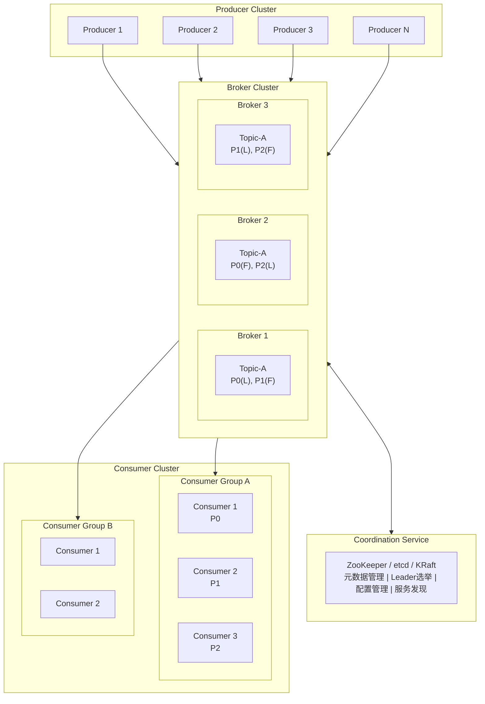

**说明**: L = Leader, F = Follower, P = Partition

### 2.2 核心概念

| 概念 | 描述 |
| :--- | :--- |
| **Topic** | 消息的逻辑分类，类似数据库的表 |
| **Partition** | Topic 的物理分片，实现并行处理和水平扩展 |
| **Broker** | 消息服务节点，负责存储和转发消息 |
| **Producer** | 消息生产者，向 Broker 发送消息 |
| **Consumer** | 消息消费者，从 Broker 拉取消息 |
| **Consumer Group** | 消费者组，组内消费者分摊分区，实现负载均衡 |
| **Offset** | 消息在分区内的唯一位置标识 |
| **Replica** | 分区副本，实现数据冗余和高可用 |
| **Leader/Follower** | 副本角色，Leader 处理读写，Follower 同步数据 |

### 2.3 数据流向

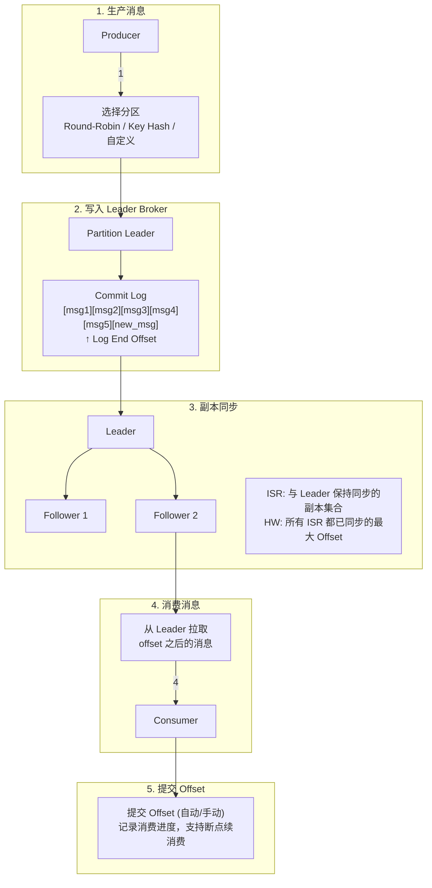

---

## 三、存储引擎设计

### 3.1 存储架构

存储引擎是消息队列的核心，直接决定性能和可靠性。Kafka 的设计精髓在于**顺序写入**和**零拷贝**。

```
Topic: order-events
│
├── Partition-0/
│   ├── 00000000000000000000.log      # 第一个日志段 (0 ~ 1GB)
│   ├── 00000000000000000000.index    # 稀疏偏移量索引
│   ├── 00000000000000000000.timeindex # 时间戳索引
│   ├── 00000000000001048576.log      # 第二个日志段
│   ├── 00000000000001048576.index
│   ├── 00000000000001048576.timeindex
│   └── leader-epoch-checkpoint       # Leader 纪元检查点
│
├── Partition-1/
│   └── ...
│
└── Partition-2/
    └── ...
```

### 3.2 日志段设计 (Log Segment)

| 文件类型 | 作用 | 命名规则 |
| :--- | :--- | :--- |
| **.log** | 存储消息内容 | 基于 baseOffset 命名 |
| **.index** | 偏移量 → 物理位置映射 | 稀疏索引，节省空间 |
| **.timeindex** | 时间戳 → 偏移量映射 | 支持按时间查找 |
| **.snapshot** | 生产者状态快照 | 幂等性支持 |

### 3.3 消息格式设计

**消息批次格式 (Record Batch)**

**Batch Header (61 bytes)**

| 字段 | 大小 | 描述 |
| :--- | :--- | :--- |
| baseOffset | 8 bytes | 批次起始偏移量 |
| batchLength | 4 bytes | 批次总长度 |
| partitionLeaderEpoch | 4 bytes | 分区 Leader 纪元 |
| magic | 1 byte | 消息格式版本 |
| crc | 4 bytes | 校验和 |
| attributes | 2 bytes | 压缩类型、时间戳类型等 |
| lastOffsetDelta | 4 bytes | 批次内最后消息的偏移量增量 |
| firstTimestamp | 8 bytes | 批次第一条消息时间戳 |
| maxTimestamp | 8 bytes | 批次最大时间戳 |
| producerId | 8 bytes | 生产者 ID (幂等性) |
| producerEpoch | 2 bytes | 生产者纪元 |
| baseSequence | 4 bytes | 基础序列号 |
| recordCount | 4 bytes | 消息数量 |

**Records 结构**

```
Record 0: length (varint) | attributes | timestampDelta | offsetDelta | keyLength | key | valueLength | value | headers
Record 1: ...
Record N: ...
```

### 3.4 索引设计

**稀疏索引结构**

**.index 文件结构 (Offset Index)**

每个条目 8 bytes: `[相对偏移量 4 bytes][物理位置 4 bytes]`

| Entry | offset | position |
| :--- | :--- | :--- |
| Entry 0 | 0 | 0 |
| Entry 1 | 100 | 4096 |
| Entry 2 | 200 | 8192 |
| Entry 3 | 300 | 12288 |

**查找过程** (查找 offset=250 的消息):
1. 二分查找 .index，找到 ≤ 250 的最大条目 (offset=200, position=8192)
2. 从 position=8192 开始顺序扫描 .log 文件
3. 找到 offset=250 的消息

**.timeindex 文件结构 (Time Index)**

每个条目 12 bytes: `[时间戳 8 bytes][相对偏移量 4 bytes]`

| Entry | timestamp | offset |
| :--- | :--- | :--- |
| Entry 0 | 1704067200000 | 0 |
| Entry 1 | 1704067260000 | 100 |
| Entry 2 | 1704067320000 | 200 |

### 3.5 日志清理策略

| 策略 | 描述 | 适用场景 |
| :--- | :--- | :--- |
| **Delete** | 基于时间或大小删除旧日志段 | 普通消息，如日志、事件 |
| **Compact** | 保留每个 Key 的最新值 | 状态快照，如用户配置 |

**日志压缩 (Log Compaction)**

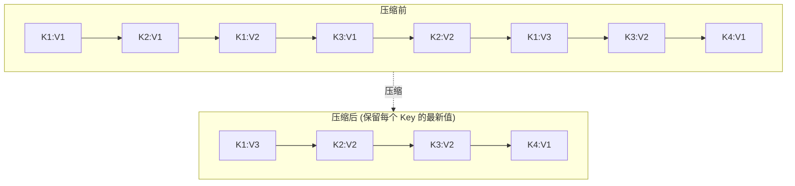

**注意**: 如果 value=null，表示墓碑消息，压缩后该 Key 将被删除

---

## 四、网络通信模型

### 4.1 Reactor 网络模型

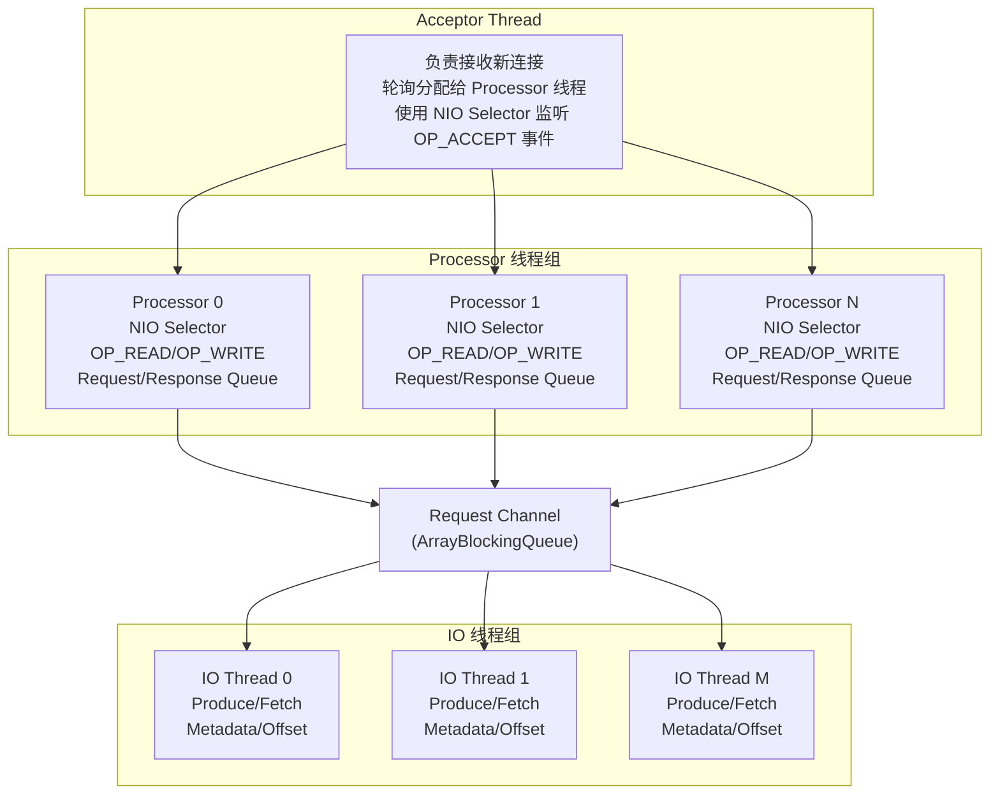

**配置参数**:
- `num.network.threads` = Processor 线程数 (默认 3)
- `num.io.threads` = IO 线程数 (默认 8)
- `queued.max.requests` = 请求队列大小 (默认 500)

### 4.2 请求处理流程

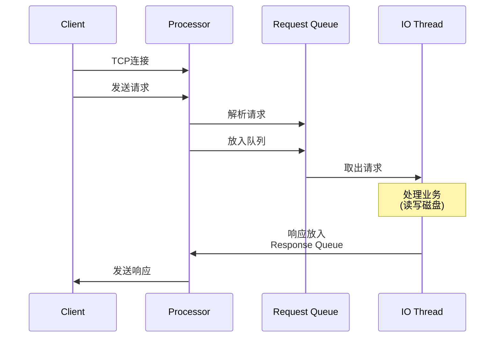

### 4.3 协议设计

| 字段 | 大小 | 描述 |
| :--- | :--- | :--- |
| **Size** | 4 bytes | 请求/响应总长度 |
| **API Key** | 2 bytes | 请求类型 (Produce=0, Fetch=1, ...) |
| **API Version** | 2 bytes | 协议版本号 |
| **Correlation ID** | 4 bytes | 请求关联 ID |
| **Client ID** | 变长 | 客户端标识 |
| **Payload** | 变长 | 请求/响应体 |

---

## 五、分区与复制策略

### 5.1 分区策略

| 策略 | 描述 | 使用场景 |
| :--- | :--- | :--- |
| **Round-Robin** | 轮询分配，负载均衡 | 无顺序要求 |
| **Key Hash** | 相同 Key 路由到同一分区 | 需要保证顺序 |
| **Sticky** | 批次内使用同一分区，减少请求数 | 提高吞吐 |
| **Custom** | 自定义分区逻辑 | 特殊业务需求 |

### 5.2 副本同步机制

**关键概念**:
- **LEO (Log End Offset)**: 日志末端偏移量，下一条消息写入位置
- **HW (High Watermark)**: 高水位，所有 ISR 已同步的最大偏移量
- **ISR (In-Sync Replicas)**: 与 Leader 保持同步的副本集合
- **OSR (Out-of-Sync Replicas)**: 滞后的副本

**副本状态示意**:

| 角色 | Broker | 状态 | 数据范围 | LEO |
| :--- | :--- | :--- | :--- | :--- |
| Leader | Broker-1 | - | [0][1][2][3][4][5][6][7][8][9] | LEO=10, HW=8 |
| Follower-1 | Broker-2 | ISR | [0][1][2][3][4][5][6][7][8] | LEO=9 |
| Follower-2 | Broker-3 | ISR | [0][1][2][3][4][5][6][7] | LEO=8 |
| Follower-3 | Broker-4 | OSR | [0][1][2][3] | LEO=4 (滞后太多) |

**计算规则**:
- HW = min(LEO of all ISR) = min(10, 9, 8) = **8**
- 消费者只能读取 < HW 的消息 (即 offset 0~7)

### 5.3 ISR 机制

| 参数 | 默认值 | 描述 |
| :--- | :--- | :--- |
| `replica.lag.time.max.ms` | 30000 | Follower 落后超过此时间将被移出 ISR |
| `min.insync.replicas` | 1 | 写入成功所需的最小 ISR 数量 |
| `unclean.leader.election.enable` | false | 是否允许非 ISR 副本成为 Leader |

### 5.4 ACK 机制

| acks | 含义 | 持久性 | 性能 |
| :--- | :--- | :--- | :--- |
| **0** | 不等待确认 | 可能丢失 | 最高 |
| **1** | Leader 写入成功即返回 | Leader 故障可能丢失 | 中等 |
| **all/-1** | 所有 ISR 写入成功才返回 | 不丢失 (配合 min.insync.replicas) | 较低 |

---

## 六、生产者设计

### 6.1 生产者架构

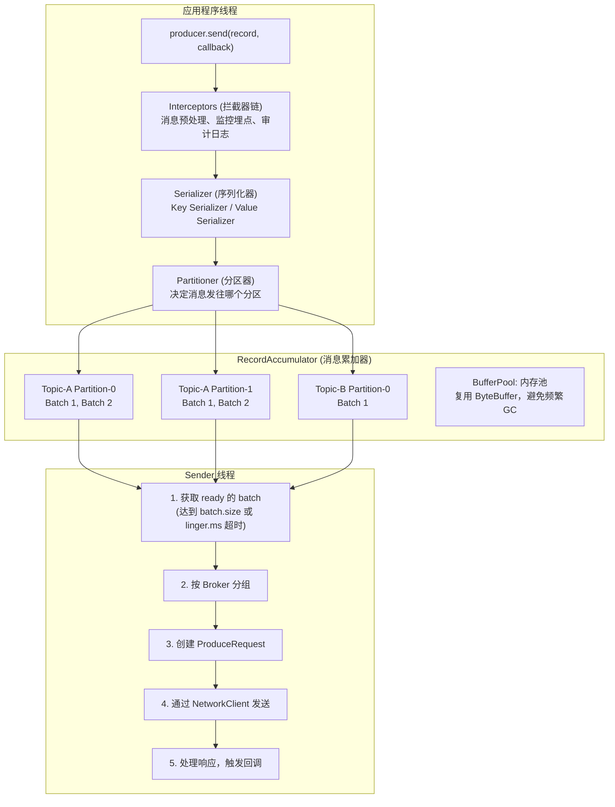

### 6.2 关键参数

| 参数 | 默认值 | 描述 |
| :--- | :--- | :--- |
| `batch.size` | 16384 | 批次大小 (bytes) |
| `linger.ms` | 0 | 批次等待时间 |
| `buffer.memory` | 33554432 | 发送缓冲区总大小 |
| `max.block.ms` | 60000 | send() 阻塞最大时间 |
| `max.in.flight.requests.per.connection` | 5 | 每个连接未确认请求数 |
| `retries` | 2147483647 | 重试次数 |
| `retry.backoff.ms` | 100 | 重试间隔 |
| `compression.type` | none | 压缩类型 (gzip/snappy/lz4/zstd) |

### 6.3 幂等性生产者

**问题**: 网络抖动导致重试，可能产生重复消息

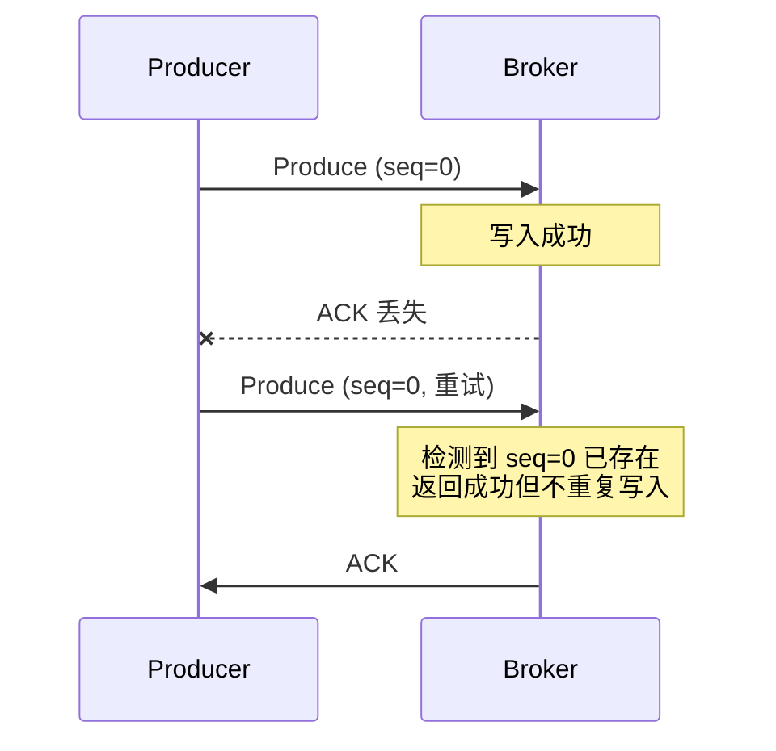

**关键机制**:
- **Producer ID (PID)**: 每个生产者唯一标识
- **Sequence Number**: 每个分区的消息序列号
- **Broker 端去重**: `<PID, Partition, Sequence>` 三元组唯一

**开启方式**: `enable.idempotence=true`
**约束**: `max.in.flight.requests.per.connection <= 5`

### 6.4 事务消息

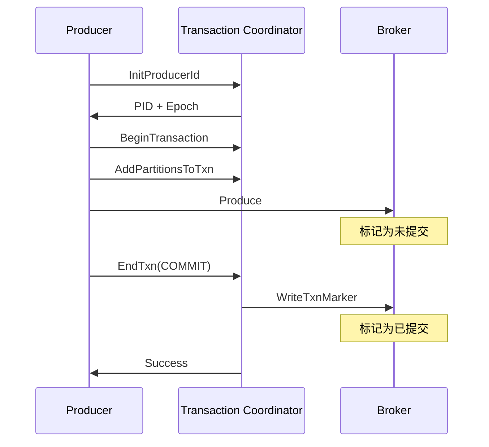

**事务隔离级别 (Consumer 端)**:
- `read_uncommitted`: 读取所有消息 (包括未提交)
- `read_committed`: 只读取已提交的消息

---

## 七、消费者与消费组

### 7.1 消费者架构

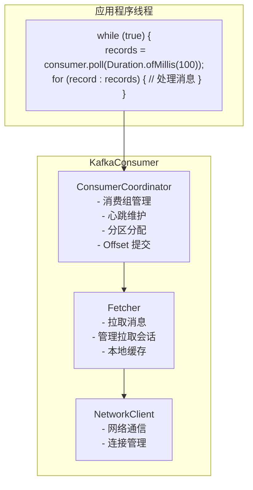

### 7.2 消费组与分区分配

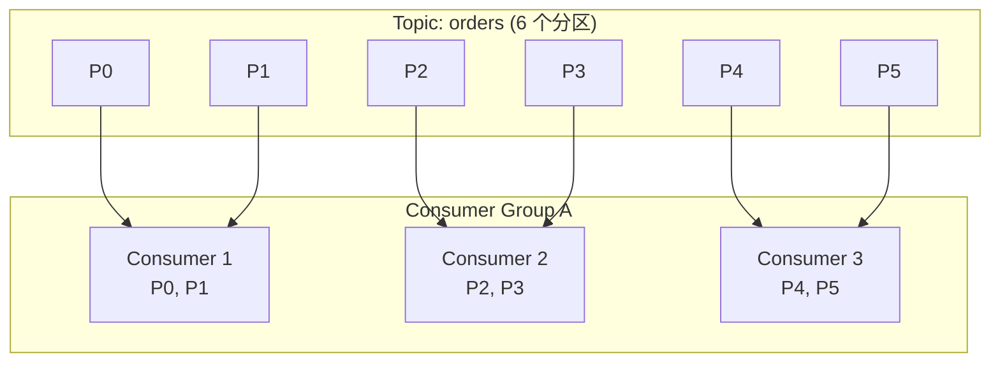

**分配策略**:

| 策略 | 描述 |
| :--- | :--- |
| **Range** | 按分区范围分配，可能不均匀 |
| **RoundRobin** | 轮询分配，较均匀 |
| **Sticky** | 尽量保持原有分配，减少 Rebalance 影响 |
| **Cooperative** | 增量式 Rebalance，不停止消费 |

### 7.3 Rebalance 机制

**Rebalance 触发条件**:
1. 消费者加入/离开消费组
2. 消费者崩溃 (心跳超时)
3. 订阅的 Topic 分区数变化
4. 订阅的 Topic 被创建/删除

**Rebalance 流程**:

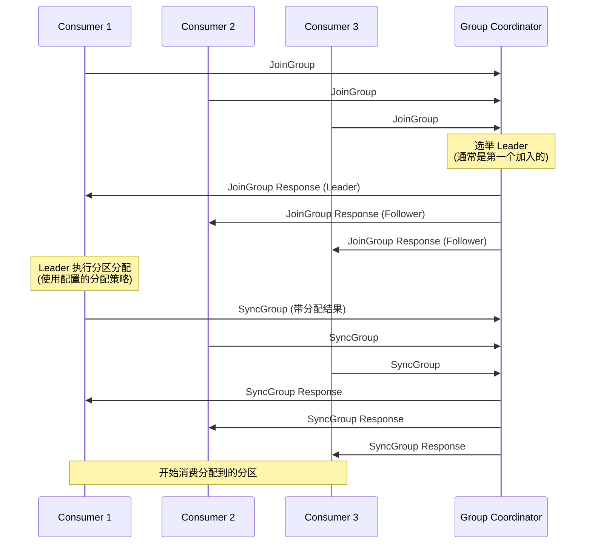

### 7.4 Offset 管理

| 提交方式 | 描述 | 风险 |
| :--- | :--- | :--- |
| **自动提交** | 定期自动提交 | 可能重复消费或丢失 |
| **同步提交** | 阻塞等待提交成功 | 影响吞吐 |
| **异步提交** | 非阻塞提交 | 失败不重试，可能丢失 |
| **指定 Offset 提交** | 精确控制提交位置 | 实现复杂 |

**Offset 存储位置**

内部 Topic: `__consumer_offsets` (默认 50 个分区)

| 字段 | 内容 |
| :--- | :--- |
| **Key** | `[group.id, topic, partition]` |
| **Value** | `[offset, metadata, commit_timestamp]` |
| **分区选择** | `hash(group.id) % 50` |

同一消费组的所有 Offset 存储在同一个分区，由该分区的 Leader Broker 作为 Group Coordinator。

---

## 八、协调服务设计

### 8.1 元数据管理架构

**协调服务架构演进**

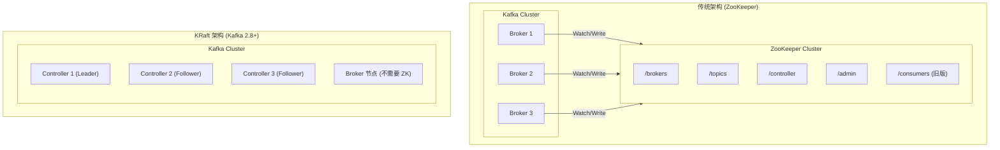

**KRaft 架构优势**:
- 减少外部依赖
- 降低运维复杂度
- 更快的故障恢复
- 支持更多分区 (百万级)

### 8.2 Controller 职责

| 职责 | 描述 |
| :--- | :--- |
| **Broker 管理** | 监控 Broker 上下线，维护活跃列表 |
| **分区 Leader 选举** | 当 Leader 故障时选举新 Leader |
| **副本管理** | 维护 ISR 列表，处理副本状态变更 |
| **Topic 管理** | 处理 Topic 创建、删除、扩分区 |
| **元数据广播** | 将元数据变更推送给所有 Broker |

### 8.3 Leader 选举机制

**选举触发条件**:
1. Broker 下线，其上的 Leader 分区需要重新选举
2. 手动触发 Preferred Leader 选举
3. 副本被移出/加入 ISR

**选举策略**:

**策略 1: 从 ISR 列表中选择第一个存活的副本作为新 Leader**
- ISR = [2, 1, 3] (副本 ID 列表，按优先级排序)
- Broker-2 存活 → 选择 Broker-2 作为 Leader
- Broker-2 宕机 → 检查 Broker-1，存活则选择

**策略 2: Unclean Leader Election (不推荐)**
- 当 ISR 为空时，是否从 OSR 中选择 Leader
- 风险: 数据丢失
- 配置: `unclean.leader.election.enable=false` (默认)

**Preferred Leader 选举**:
- 每个分区有一个 Preferred Leader (通常是副本列表中的第一个)
- 定期检查是否需要重新平衡 Leader 分布
- 配置: `auto.leader.rebalance.enable=true`

---

## 九、高性能设计

### 9.1 性能优化全景

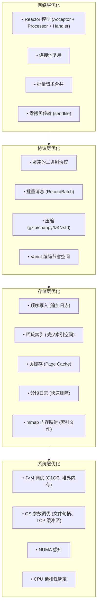

### 9.2 零拷贝 (Zero-Copy)

**传统方式 (4 次拷贝 + 4 次上下文切换)**:

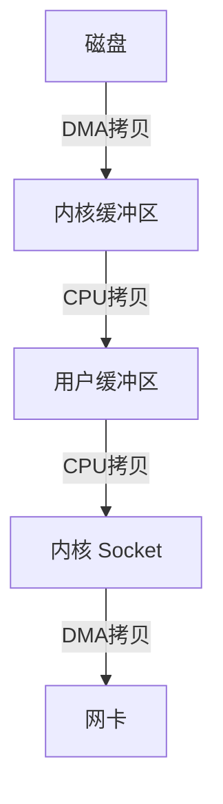

**sendfile 零拷贝 (2 次拷贝 + 2 次上下文切换)**:

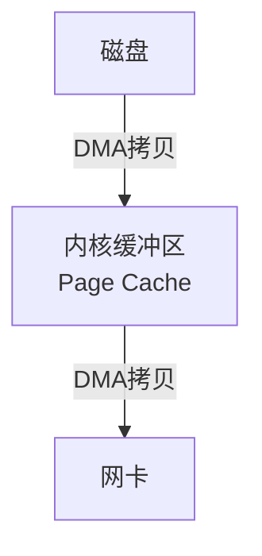

**优势**:
- 数据不经过用户态，直接从 Page Cache 发送到网卡
- 减少 CPU 拷贝次数和上下文切换
- Linux: `sendfile()` 系统调用
- Java: `FileChannel.transferTo()`

### 9.3 Page Cache 利用

**写入路径**:

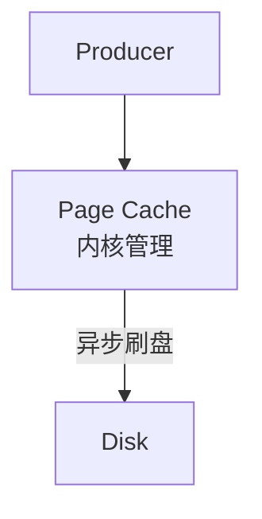

- 生产者写入直接落入 Page Cache
- OS 定期异步刷盘 (可配置 flush 策略)
- 利用 OS 的预读和延迟写特性

**读取路径**:

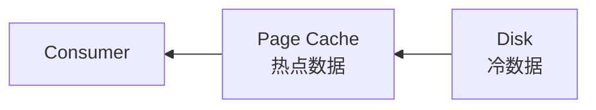

- **热数据** (近期写入): 直接从 Page Cache 读取，0 磁盘 IO
- **冷数据** (历史消息): 从磁盘读取并缓存

**最佳实践**:
- 预留足够内存给 Page Cache (建议 > 数据量的 25%)
- Consumer 跟进 Producer 消费，提高 Cache 命中率
- 避免随机读取历史数据

### 9.4 批量与压缩

| 技术 | 参数 | 效果 |
| :--- | :--- | :--- |
| **批量发送** | batch.size, linger.ms | 减少网络请求数 |
| **批量拉取** | fetch.min.bytes, fetch.max.wait.ms | 减少网络往返 |
| **压缩** | compression.type | 减少网络带宽和存储空间 |

| 压缩算法 | 压缩比 | CPU 消耗 | 适用场景 |
| :--- | :--- | :--- | :--- |
| **gzip** | 高 | 高 | 存储优先 |
| **snappy** | 中 | 低 | 平衡场景 |
| **lz4** | 中 | 很低 | 性能优先 |
| **zstd** | 高 | 中 | 推荐 (综合最优) |

---

## 十、高可用设计

### 10.1 高可用架构全景

**可用性目标**: 99.99% (全年停机 < 52.6 分钟)

| 层级 | 高可用策略 |
| :--- | :--- |
| **网络层** | 多网卡绑定、DNS 负载均衡、跨机房部署 |
| **接入层** | 多 Broker 入口、客户端自动重连 |
| **服务层** | 多 Broker、Controller 故障转移 |
| **数据层** | 多副本、ISR 机制、Leader 自动选举 |
| **协调层** | ZooKeeper/KRaft 多节点、仲裁机制 |
| **存储层** | RAID、SSD、多磁盘 |

### 10.2 多副本架构

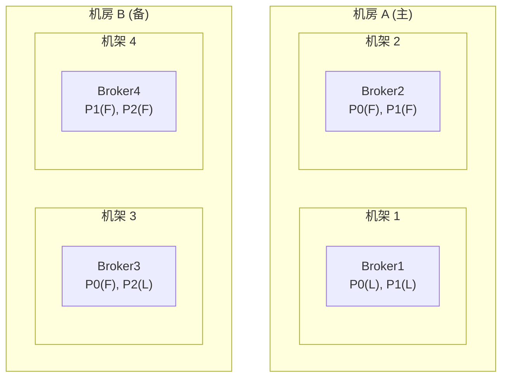

**副本分配策略**:
- `broker.rack` 配置机架标识
- 副本分散在不同机架/机房
- 优先同机房同步，跨机房异步

**关键配置**:
- `replication.factor = 3` (建议)
- `min.insync.replicas = 2`
- `acks = all`

### 10.3 故障恢复流程

**Broker 故障恢复时间线**:

| 时间点 | 事件 |
| :--- | :--- |
| T0 | Broker-1 宕机 |
| T1 | Controller 检测到 Broker-1 不可用 (session 超时) |
| T2 | 触发 Leader 选举: Partition-0 从 Broker-1 → Broker-2; Partition-3 从 Broker-1 → Broker-3 |
| T3 | 更新元数据，通知所有 Broker 和客户端 |
| T4 | 客户端刷新元数据，重新路由请求 |
| T5 | 服务恢复正常 |

**恢复时间预估**:
- 检测时间: `session.timeout.ms` (默认 10s, 可调低)
- 选举时间: < 1s
- 元数据传播: < 1s
- 总计: 通常 < 15s

### 10.4 数据一致性保障

| 场景 | 风险 | 解决方案 |
| :--- | :--- | :--- |
| **Leader 切换** | 未同步消息丢失 | min.insync.replicas + acks=all |
| **网络分区** | 脑裂 | 仲裁机制、fencing |
| **Broker 重启** | 数据不一致 | Leader Epoch、日志截断 |
| **Consumer 崩溃** | 重复消费 | 幂等消费、Exactly-Once |

---

## 十一、自动伸缩

### 11.1 伸缩维度

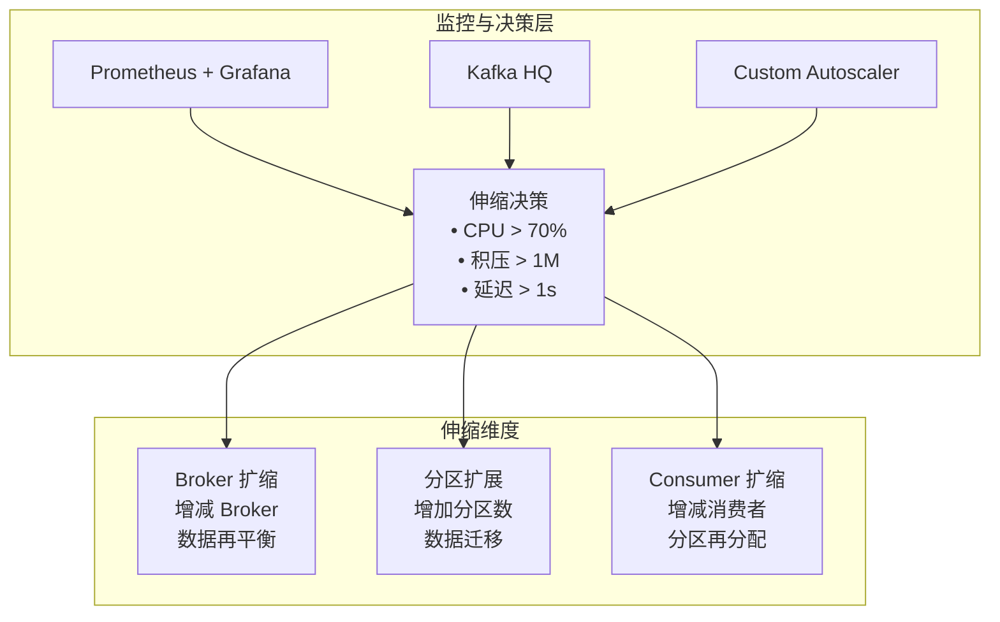

### 11.2 Broker 扩缩容

**Broker 扩容流程**:

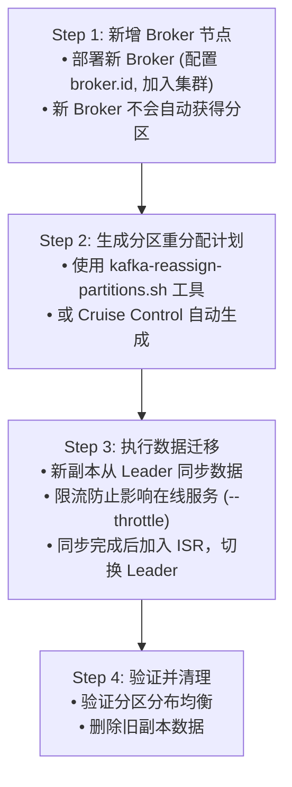

**重分配计划示例**:

```json
{
  "partitions": [
    {"topic": "orders", "partition": 0, "replicas": [1,4,2]},
    {"topic": "orders", "partition": 1, "replicas": [2,4,3]}
  ]
}
```

### 11.3 分区扩展

| 操作 | 支持 | 说明 |
| :--- | :--- | :--- |
| **增加分区** | ✅ | 在线操作，不影响现有分区 |
| **减少分区** | ❌ | 不支持，需重建 Topic |
| **分区迁移** | ✅ | 副本在 Broker 间迁移 |

**分区扩展影响**

**1. Key 顺序性破坏**:
- 扩展前: `hash(key) % 3 = 0` → Partition-0
- 扩展后: `hash(key) % 6 = 3` → Partition-3
- **解决方案**: 业务无序依赖则直接扩展；需要顺序则提前规划足够分区数，或使用自定义分区器

**2. Consumer Rebalance**:
- 新分区需要消费者重新分配
- 使用 Cooperative 策略减少影响

**3. 历史数据**:
- 新分区不包含历史数据
- 只有扩展后的新消息按新规则路由

### 11.4 Kubernetes 部署与弹性伸缩

```mermaid
graph TB
    subgraph K8s["Kubernetes Cluster"]
        subgraph SS["Kafka StatefulSet"]
            K0["kafka-0<br/>PVC-0"]
            K1["kafka-1<br/>PVC-1"]
            K2["kafka-2<br/>PVC-2"]
            KN["kafka-N<br/>PVC-N"]
        end

        subgraph Strimzi["Strimzi Kafka Operator"]
            S1["• 自动化部署和管理"]
            S2["• 滚动升级"]
            S3["• 自动扩缩容"]
            S4["• 监控集成"]
            S5["• TLS/认证配置"]
        end

        subgraph CC["Cruise Control (可选)"]
            C1["• 自动负载均衡"]
            C2["• 智能扩缩容建议"]
            C3["• 异常检测"]
        end

        Strimzi --> SS
        CC --> SS
    end
```

**关键技术选型**:
- **Operator**: Strimzi (CNCF 项目) 或 Confluent Operator
- **存储**: 高性能 SSD StorageClass (gp3/io2 on AWS, pd-ssd on GCP)
- **网络**: Headless Service + NodePort/LoadBalancer

---

## 十二、监控与可观测性

### 12.1 监控指标体系

| 层级 | 关键指标 | 告警阈值建议 |
| :--- | :--- | :--- |
| **Broker** | CPU、内存、磁盘、网络 | CPU > 70%, 磁盘 > 80% |
| **Topic** | 消息速率、字节速率 | 根据业务基线 |
| **Partition** | Leader 分布、ISR 数量 | ISR < replication.factor |
| **Consumer** | 消费延迟 (Lag)、消费速率 | Lag > 100万 或 持续增长 |
| **Producer** | 发送延迟、错误率、重试率 | P99 > 100ms, 错误率 > 1% |
| **JVM** | GC 频率、堆内存使用 | Full GC > 1次/小时 |

### 12.2 核心监控指标

**Broker 级别 JMX 指标**:

| 指标 | 描述 |
| :--- | :--- |
| `kafka.server:type=BrokerTopicMetrics,name=MessagesInPerSec` | 消息写入速率 |
| `kafka.server:type=BrokerTopicMetrics,name=BytesInPerSec` | 字节写入速率 |
| `kafka.server:type=BrokerTopicMetrics,name=BytesOutPerSec` | 字节读取速率 |
| `kafka.server:type=ReplicaManager,name=UnderReplicatedPartitions` | 欠副本分区数 (应为 0) |
| `kafka.controller:type=KafkaController,name=OfflinePartitionsCount` | 离线分区数 (应为 0) |

**请求级别 JMX 指标**:

| 指标 | 描述 |
| :--- | :--- |
| `kafka.network:type=RequestMetrics,name=TotalTimeMs,request=Produce` | 生产请求总延迟 |
| `kafka.network:type=RequestMetrics,name=TotalTimeMs,request=Fetch` | 消费请求总延迟 |
| `kafka.network:type=RequestChannel,name=RequestQueueSize` | 请求队列大小 (积压指标) |

**Consumer 级别 JMX 指标**:

| 指标 | 描述 |
| :--- | :--- |
| `kafka.consumer:type=consumer-fetch-manager-metrics,name=records-lag-max` | 最大消费延迟 |
| `kafka.consumer:type=consumer-coordinator-metrics,name=rebalance-rate-per-hour` | Rebalance 频率 |

### 12.3 可观测性架构

```mermaid
graph TB
    G["Grafana<br/>统一可视化面板"]

    subgraph Backend["后端存储"]
        P["Prometheus<br/>指标存储"]
        L["Loki<br/>日志聚合"]
        T["Tempo/Jaeger<br/>链路追踪"]
    end

    subgraph Kafka["Kafka Cluster"]
        JMX["JMX Exporter"]
        Log["Log Files"]
        OTel["OpenTelemetry Agent"]
    end

    G --> P & L & T
    JMX --> P
    Log --> L
    OTel --> T
```

**告警规则示例 (Prometheus AlertManager)**:

```yaml
- alert: KafkaUnderReplicatedPartitions
  expr: kafka_server_replicamanager_underreplicatedpartitions > 0
  for: 5m
  severity: critical

- alert: KafkaConsumerLagHigh
  expr: kafka_consumer_group_lag > 1000000
  for: 10m
  severity: warning
```

---

## 十三、技术选型总结

### 13.1 核心技术选型

| 组件 | 推荐选型 | 备选方案 | 选型理由 |
| :--- | :--- | :--- | :--- |
| **开发语言** | Java/Scala | Go, Rust | JVM 生态成熟，Kafka 原生语言 |
| **网络框架** | Java NIO | Netty | 原生 NIO 足够，减少依赖 |
| **存储格式** | 自定义二进制 | Protobuf, Avro | 更高效，更灵活 |
| **协调服务** | KRaft | ZooKeeper | 减少外部依赖，更好扩展性 |
| **序列化** | Avro + Schema Registry | Protobuf, JSON | 支持 Schema 演进 |
| **压缩算法** | zstd | lz4, snappy | 压缩比和性能平衡 |
| **容器编排** | Kubernetes + Strimzi | Docker Compose | 生产级自动化运维 |
| **监控** | Prometheus + Grafana | Datadog, ELK | 云原生标准，成本可控 |
| **日志** | Loki | ELK | 轻量级，与 Grafana 集成 |

### 13.2 关键设计决策

| 决策点 | 选择 | 权衡考量 |
| :--- | :--- | :--- |
| **存储模型** | 分区日志 | 顺序写优化，但牺牲灵活性 |
| **消费模型** | Pull | 消费者控制节奏，但延迟略高 |
| **一致性模型** | 最终一致 | 高吞吐，但需客户端处理重复 |
| **分区策略** | 静态分区 | 简单可靠，但扩展需数据迁移 |
| **副本同步** | ISR 机制 | 平衡一致性和可用性 |

### 13.3 性能基准 (参考值)

| 指标 | 单 Broker | 3 Broker 集群 | 说明 |
| :--- | :--- | :--- | :--- |
| **写入吞吐** | 100万 msg/s | 200万+ msg/s | 消息大小 100 bytes |
| **读取吞吐** | 150万 msg/s | 400万+ msg/s | 热数据，Page Cache 命中 |
| **写入延迟** | P99 < 5ms | P99 < 10ms | acks=1 |
| **端到端延迟** | P99 < 10ms | P99 < 20ms | 生产到消费 |
| **单分区顺序写** | 50MB/s | - | 磁盘顺序写能力 |

### 13.4 面试要点总结

**存储层**:
- 为什么选择顺序写？与随机写的性能差异？
- 如何实现快速查找指定 Offset 的消息？
- Page Cache 的作用和最佳实践？
- 日志压缩 (Log Compaction) 的实现原理？

**高可用**:
- ISR 机制是什么？如何保证数据不丢失？
- Leader 选举过程？Unclean Leader Election 的风险？
- 跨机房部署方案？

**高性能**:
- 零拷贝如何实现？节省了哪些开销？
- 批量和压缩的作用？
- Reactor 网络模型的优势？

**一致性**:
- 如何保证 Exactly-Once 语义？
- 幂等生产者的实现原理？
- 事务消息的隔离级别？

**消费者**:
- Consumer Group 和 Rebalance 机制？
- 如何避免 Rebalance 风暴？
- Offset 管理策略？

**运维**:
- 如何扩容 Broker？数据迁移过程？
- 关键监控指标有哪些？
- Kubernetes 部署的最佳实践？

---

## 附录：核心代码示意

### A.1 消息写入核心流程 (伪代码)

```java
// 消息追加到日志
public long append(RecordBatch batch) {
    // 1. 验证消息格式和 CRC
    validateBatch(batch);
    
    // 2. 分配 Offset
    long baseOffset = nextOffset.getAndAdd(batch.recordCount());
    batch.setBaseOffset(baseOffset);
    
    // 3. 追加到活跃日志段
    LogSegment activeSegment = getActiveSegment();
    if (activeSegment.size() + batch.size() > segmentSize) {
        activeSegment = roll(); // 滚动创建新日志段
    }
    
    // 4. 写入数据 (顺序追加)
    int position = activeSegment.append(batch);
    
    // 5. 更新索引 (稀疏索引)
    if (shouldAddIndex(batch)) {
        activeSegment.offsetIndex.append(baseOffset, position);
        activeSegment.timeIndex.append(batch.maxTimestamp(), baseOffset);
    }
    
    return baseOffset;
}
```

### A.2 消息读取核心流程 (伪代码)

```java
// 根据 Offset 读取消息
public FetchResult fetch(long offset, int maxBytes) {
    // 1. 定位日志段
    LogSegment segment = findSegment(offset);
    
    // 2. 通过索引定位物理位置
    int position = segment.offsetIndex.lookup(offset);
    
    // 3. 从物理位置开始扫描
    FileRecords records = segment.read(position, maxBytes);
    
    // 4. 零拷贝发送 (sendfile)
    // 实际通过 FileChannel.transferTo() 直接发送到 Socket
    return new FetchResult(records, segment.highWatermark());
}
```

### A.3 副本同步核心流程 (伪代码)

```java
// Follower 同步逻辑
public void replicaFetch() {
    while (running) {
        // 1. 发送 Fetch 请求到 Leader
        FetchRequest request = new FetchRequest(
            partitionId, 
            localLogEndOffset,  // Follower 的 LEO
            maxBytes
        );
        
        FetchResponse response = sendToLeader(request);
        
        // 2. 追加到本地日志
        for (RecordBatch batch : response.batches()) {
            log.append(batch);
        }
        
        // 3. 更新 LEO
        updateLocalLEO();
        
        // 4. 根据 Leader 的 HW 更新本地 HW
        if (response.highWatermark() < localLEO) {
            updateLocalHW(response.highWatermark());
        }
    }
}
```

---

> **总结**: 设计类似 Kafka 的消息队列，核心在于:
> 1. **存储设计**: 分段日志 + 稀疏索引 + 顺序写入
> 2. **网络模型**: Reactor 多路复用 + 零拷贝
> 3. **高可用**: 多副本 + ISR 机制 + 自动选举
> 4. **高性能**: 批量 + 压缩 + Page Cache
> 5. **弹性伸缩**: 分区机制 + 数据再平衡

---

## 相关文章

- [上一篇：如何设计一个消息队列](/articles/interview/interview-11-设计消息队列/)
- [下一篇：如何设计多线程消费消息模型](/articles/interview/interview-13-多线程消费模型/)
