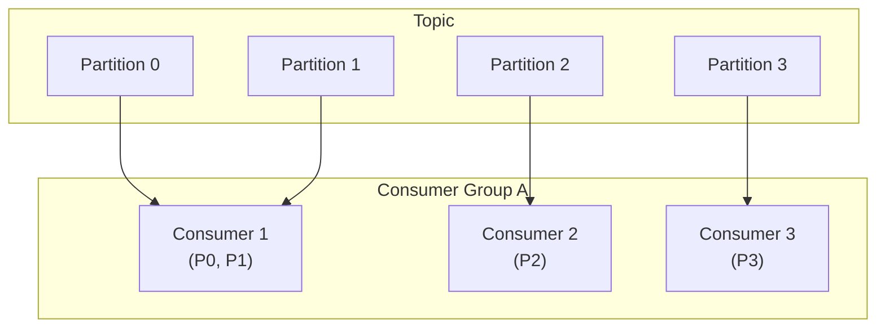
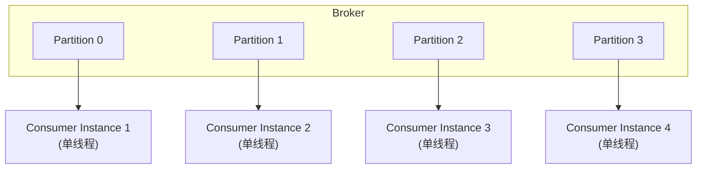
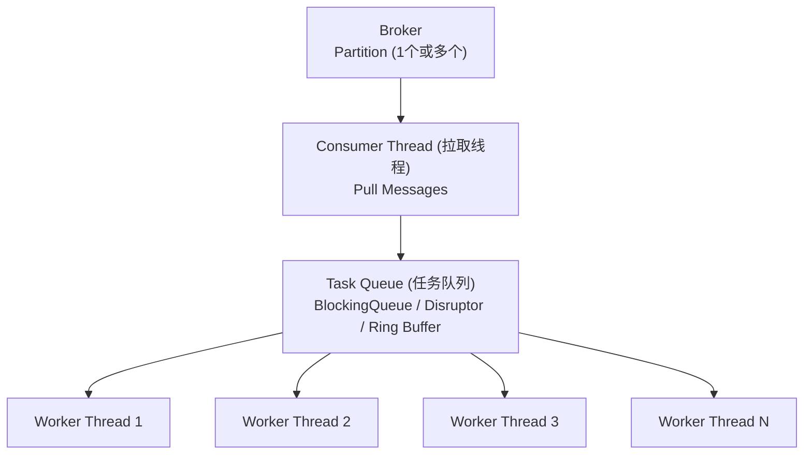
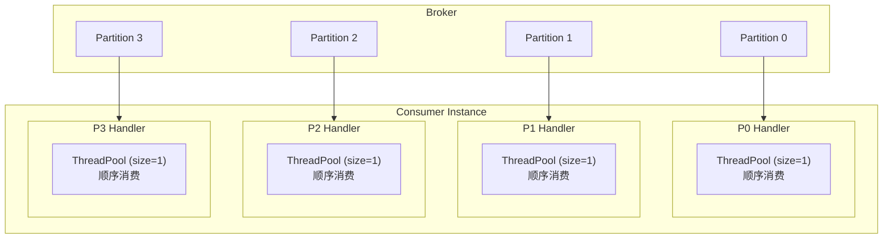
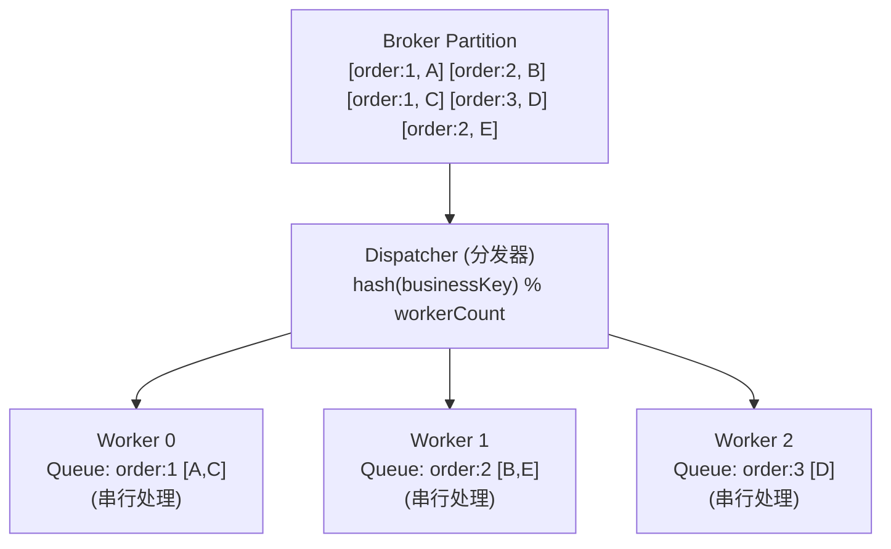
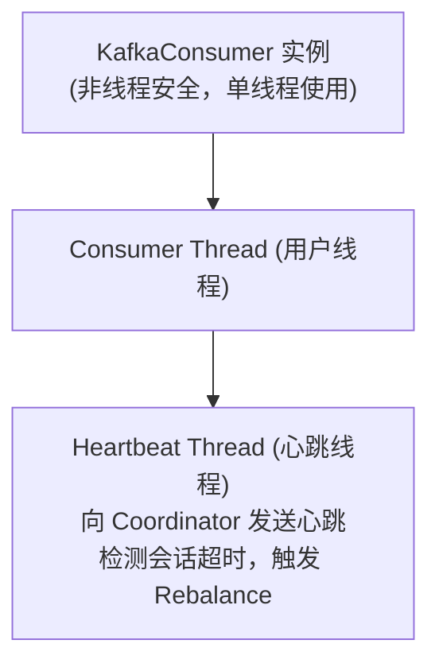
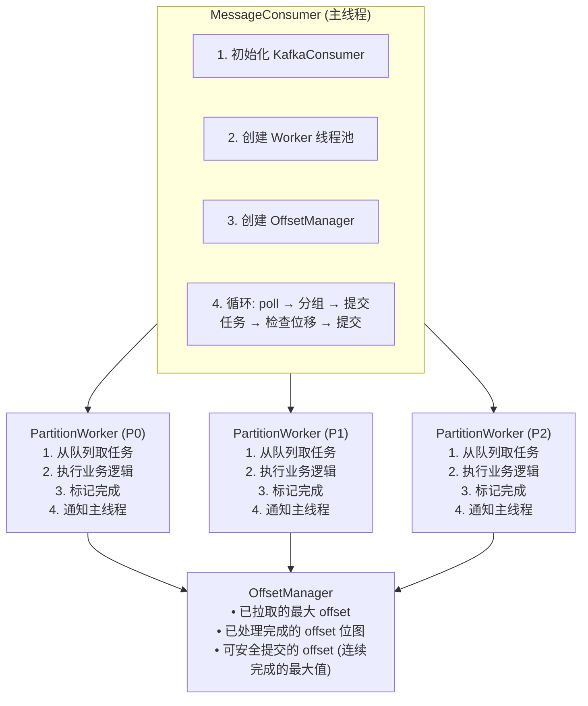
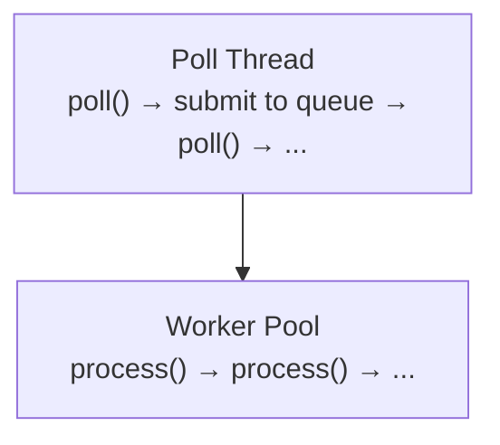

+++
title = "如何设计多线程消费消息模型"
slug = "interview-如何设计多线程消费消息模型"
weight = 13000
+++

# 如何设计多线程消费消息模型

> 本文深入剖析高性能消息消费系统的设计，涵盖线程模型、并发控制、顺序保证、幂等处理等核心主题，结合 Kafka、RocketMQ、RabbitMQ 等主流消息队列的最佳实践。

---

## 一、背景与挑战

### 1.1 为什么需要多线程消费

| 场景 | 问题 | 需求 |
| :--- | :--- | :--- |
| **消息积压** | 单线程消费速度跟不上生产速度 | 提升消费吞吐量 |
| **IO 密集型处理** | 消费逻辑涉及 DB/RPC 调用，线程阻塞等待 | 并发处理，利用等待时间 |
| **CPU 密集型处理** | 复杂计算、数据转换 | 利用多核 CPU |
| **延迟敏感** | 消息处理需要低延迟 | 并行处理，减少排队 |

### 1.2 核心挑战

| 挑战 | 问题 | 场景 |
| :--- | :--- | :--- |
| **顺序性保证** | 多线程并发处理，消息顺序被打乱 | 订单状态变更必须按顺序处理 |
| **重复消费** | 消费者重启、Rebalance 导致重复消费 | 扣款消息重复导致多次扣款 |
| **消息丢失** | 位移提交过早，消息实际未处理完 | 消费者崩溃，已提交但未处理的消息丢失 |
| **资源竞争** | 多线程共享资源的同步开销 | 线程池队列溢出、内存 OOM |
| **背压控制** | 消费速度超过下游处理能力 | 数据库写入瓶颈导致消息堆积在内存 |

---

## 二、消费模型基础

### 2.1 消息队列消费模型

| 模式 | 数据流向 | 优点 | 缺点 | 代表 |
| :--- | :--- | :--- | :--- | :--- |
| **Push (推模式)** | Broker → Consumer | 实时性好，消息到达即推送 | 无法控制消费速率，可能压垮消费者 | RabbitMQ (默认) |
| **Pull (拉模式)** | Consumer → Broker | 消费者自主控制速率，天然背压 | 需要轮询，可能有延迟 | Kafka, RocketMQ |
| **长轮询 (Long Polling)** | 结合 Push 和 Pull | 无消息时服务端 hold 请求，有消息时立即返回 | - | RocketMQ |

### 2.2 消费者组与分区



**核心规则**:
- 一个分区只能被同一消费者组内的一个消费者消费
- 一个消费者可以消费多个分区
- 消费者数量 > 分区数量时，多余消费者空闲

### 2.3 并发度与分区的关系

| 消费者数 | 分区数 | 实际并发度 | 说明 |
| :--- | :--- | :--- | :--- |
| 1 | 4 | 1 | 单消费者串行消费所有分区 |
| 2 | 4 | 2 | 每个消费者消费 2 个分区 |
| 4 | 4 | 4 | 最佳配比 |
| 6 | 4 | 4 | 2 个消费者空闲 |

**关键结论**：分区数决定了消费并发度的上限。

---

## 三、多线程消费设计模式

### 3.1 模式一：多消费者实例



**特点**:
- 每个 Consumer 实例独立进程/容器
- 通过增加实例数提升并发 (最多等于分区数)
- 水平扩展简单，Kubernetes HPA 友好

**适用场景**: 无状态消费逻辑、云原生环境、分区数足够多

| 优点 | 缺点 |
| :--- | :--- |
| 隔离性好，扩展简单，无共享状态 | 并发度受限于分区数，资源开销较大 |

### 3.2 模式二：单消费者 + 多工作线程



**特点**:
- 拉取与处理分离
- 并发度不受分区数限制
- 需要处理顺序性和位移提交问题

**适用场景**: 分区数有限需要更高并发、IO 密集型处理、单条消息处理时间长

| 优点 | 缺点 |
| :--- | :--- |
| 突破分区数限制，资源利用率高 | 顺序性难保证，位移管理复杂 |

### 3.3 模式三：分区级线程池



**特点**:
- 每个分区独立处理，保证分区内顺序
- 分区间并行，提升吞吐
- 位移管理简单，每个分区独立提交

**适用场景**: 需要保证分区内消息顺序、分区数足够多

| 优点 | 缺点 |
| :--- | :--- |
| 保证顺序性，位移管理简单 | 并发度 = 分区数，可能有热点分区 |

### 3.4 模式四：业务 Key 级并发

**设计思想**: 相同业务 Key 的消息串行，不同 Key 的消息并行



**特点**:
- 相同 Key 路由到同一 Worker，保证顺序
- 不同 Key 并行处理，提升吞吐
- 比分区级并发更细粒度

**实现要点**:
- 使用一致性哈希避免 Worker 数变化时大规模重排
- 每个 Worker 内部使用有序队列

### 3.5 模式对比总结

| 模式 | 并发度 | 顺序保证 | 位移管理 | 复杂度 | 适用场景 |
| :--- | :--- | :--- | :--- | :--- | :--- |
| 多消费者实例 | 分区数 | 分区内有序 | 简单 | 低 | 无状态、云原生 |
| 单消费者+线程池 | 不受限 | 无保证 | 复杂 | 中 | 无顺序要求 |
| 分区级线程池 | 分区数 | 分区内有序 | 简单 | 低 | 分区数够用 |
| 业务Key级并发 | Key数 | Key内有序 | 复杂 | 高 | 细粒度顺序控制 |

---

## 四、线程模型深度设计

### 4.1 线程池配置

**核心参数**：

| 参数 | 说明 | 推荐值 |
| :--- | :--- | :--- |
| corePoolSize | 核心线程数 | CPU密集: CPU核数; IO密集: 2*CPU核数 |
| maxPoolSize | 最大线程数 | corePoolSize 的 2-4 倍 |
| keepAliveTime | 空闲线程存活时间 | 60s |
| workQueue | 任务队列 | 有界队列，防止 OOM |
| rejectedHandler | 拒绝策略 | CallerRunsPolicy 背压 |

**队列选择**：

| 队列类型 | 特点 | 适用场景 |
| :--- | :--- | :--- |
| ArrayBlockingQueue | 有界，数组实现 | 控制内存，防止堆积 |
| LinkedBlockingQueue | 可选有界，链表实现 | 吞吐量优先 |
| SynchronousQueue | 无缓冲，直接交付 | 任务不可堆积 |
| Disruptor | 无锁环形缓冲区 | 极致性能 |

### 4.2 消费者线程模型（Kafka 示例）



**Consumer Thread 处理逻辑**:

```java
while (running) {
    records = consumer.poll(Duration);  // 拉取消息
    for (record : records) {
        process(record);                 // 处理消息
    }
    consumer.commitSync();              // 提交位移
}
```

**重要配置**:

| 配置项 | 说明 | 默认值 |
| :--- | :--- | :--- |
| `max.poll.interval.ms` | 两次 poll 最大间隔 | 5 分钟 |
| `max.poll.records` | 单次 poll 最大记录数 | 500 |
| `session.timeout.ms` | 会话超时 | 10 秒 |
| `heartbeat.interval.ms` | 心跳间隔 | 3 秒 |

### 4.3 多线程消费实现框架



### 4.4 位移管理详解

**问题**：多线程消费时，消息可能乱序完成，如何安全提交位移？

**示例**:
- 拉取消息: `[offset=0] [offset=1] [offset=2] [offset=3] [offset=4]`
- 处理完成顺序: `0 → 2 → 1 → 4 → 3`

**问题分析**:
- `offset=2` 完成时，能否提交 `offset=3`?
- **不能！** 因为 `offset=1` 还未完成
- 如果此时崩溃，`offset=1` 会丢失

**正确做法**:
- 维护完成位图: `[1, 0, 1, 0, 0]` → `[1, 1, 1, 0, 0]` → `[1, 1, 1, 0, 1]`
- 只提交连续完成的最大 offset
- 完成 `[0,1,2]` 后可提交 `offset=3`

**解决方案：滑动窗口 + 位图**

**数据结构**:
- `Partition 0`:
  - `baseOffset = 100` (窗口起始位置)
  - `bitmap = [1,1,1,0,1,1,0,0,0,0]` (长度=窗口大小)
  - 已完成 3 个，可提交 103

**算法**:
1. 消息完成 → 设置 `bitmap[offset - baseOffset] = 1`
2. 检查从头开始连续的 1 的数量
3. 可提交 `offset = baseOffset + 连续 1 的数量`
4. 提交后滑动窗口: `baseOffset += 连续 1 的数量`

**示例**:
- `bitmap = [1,1,1,0,1,1,0,0,0,0]`
- 连续 1 = 3
- 可提交 = 100 + 3 = 103
- 提交后: `baseOffset = 103`, `bitmap = [0,1,1,0,0,0,0,0,0,0]`

---

## 五、消息顺序性保证

### 5.1 顺序性级别

| 级别 | 说明 | 实现难度 |
| :--- | :--- | :--- |
| **全局有序** | 所有消息严格有序 | 极高（单分区单线程） |
| **分区有序** | 同一分区内有序 | 中（分区级处理） |
| **Key 有序** | 相同 Key 的消息有序 | 中（Key 路由） |
| **无序** | 不保证任何顺序 | 低 |

### 5.2 分区有序实现

```
生产端保证:
• 相同业务 Key 的消息发送到同一分区
• 使用 Kafka 的 Partitioner 或显式指定分区

消费端保证:
• 每个分区单线程消费
• 或使用分区级队列，串行处理
```

### 5.3 Key 有序实现

**核心思想**: 相同 Key 路由到同一线程的同一队列，串行处理

**实现步骤**:
1. 创建 N 个 Worker，每个 Worker 有自己的有序队列
2. 消息到达后，计算 `hash(key) % N`，确定目标 Worker
3. 将消息放入目标 Worker 的队列
4. 每个 Worker 从自己的队列顺序取出消息处理

**注意事项**:
- Worker 数量变化会导致 Key 重新分配
- 使用一致性哈希减少影响范围
- 热点 Key 可能导致 Worker 不均衡

### 5.4 顺序消费与并发的权衡

| 策略 | 并发度 | 顺序保证 | 建议 |
| :--- | :--- | :--- | :--- |
| 全局单线程 | 1 | 全局有序 | 仅限对顺序极度敏感场景 |
| 分区并行 | 分区数 | 分区内有序 | 推荐，平衡性好 |
| Key 并行 | Key 数 | Key 内有序 | 适合细粒度顺序控制 |
| 完全并行 | 无限 | 无保证 | 无顺序要求时使用 |

---

## 六、幂等与去重

### 6.1 重复消费场景

| 场景 | 原因 | 表现 |
| :--- | :--- | :--- |
| Rebalance | 消费者加入/退出触发重新分配 | 已消费未提交的消息重新消费 |
| 消费者重启 | 进程崩溃或重启 | 从上次提交位置重新消费 |
| 网络问题 | 位移提交失败 | 下次从旧位置消费 |
| 消息重投 | 生产者重试 | 同一消息投递多次 |

### 6.2 幂等消费方案

**方案一：唯一约束**

```
适用: 数据写入场景
实现: 数据库唯一索引，重复插入失败
示例: INSERT INTO orders (order_id, ...) ON DUPLICATE KEY UPDATE ...
```

**方案二：去重表**

**表结构**:

```sql
CREATE TABLE t_consume_record (
    id BIGINT PRIMARY KEY,
    msg_id VARCHAR(64) UNIQUE,    -- 消息唯一标识
    topic VARCHAR(64),
    partition INT,
    offset BIGINT,
    status TINYINT,               -- 0:处理中, 1:成功, 2:失败
    create_time DATETIME,
    update_time DATETIME
);
```

**处理流程**:
1. `INSERT t_consume_record (msg_id, status=0)`
2. 如果主键冲突 → 查询 status
   - `status=1`: 已成功处理，跳过
   - `status=0`: 正在处理，等待或跳过
   - `status=2`: 处理失败，可重试
3. 执行业务逻辑
4. `UPDATE status=1`

**优化**:
- 使用 Redis 做前置判断，减少 DB 压力
- 定期清理历史记录

**方案三：Redis 去重**

**方案 A: SETNX**
- Key: `consume:{topic}:{partition}:{offset}`
- Value: `1`
- TTL: 7 天 (根据消息保留时间)
- `SETNX` 成功 → 首次消费，执行业务逻辑
- `SETNX` 失败 → 重复消费，跳过

**方案 B: Bloom Filter (海量消息)**
- 空间效率极高 (1亿条数据约 120MB)
- 有一定误判率 (约 1%)
- 适合允许少量重复处理的场景

```bash
BF.ADD consume_filter {msg_id}
BF.EXISTS consume_filter {msg_id}
```

**方案四：业务幂等设计**

```
示例: 扣款操作

非幂等:
  UPDATE account SET balance = balance - 100 WHERE user_id = 1

幂等:
  UPDATE account SET balance = balance - 100 
  WHERE user_id = 1 
  AND order_id NOT IN (SELECT order_id FROM payment_log)

或使用状态机:
  UPDATE order SET status = 'PAID' 
  WHERE order_id = 1 AND status = 'UNPAID'
```

### 6.3 幂等方案选择

| 场景 | 推荐方案 |
| :--- | :--- |
| 数据库写入 | 唯一约束 |
| 通用消费 | 去重表 + Redis 前置 |
| 海量消息 | Bloom Filter |
| 资金操作 | 业务幂等 + 去重表 |

---

## 七、位移管理与可靠性

### 7.1 位移提交策略

| 策略 | 说明 | 可靠性 | 性能 |
| :--- | :--- | :--- | :--- |
| **自动提交** | 定时自动提交 | 低（可能丢失） | 高 |
| **同步手动提交** | 处理完同步提交 | 高 | 低 |
| **异步手动提交** | 处理完异步提交 | 中 | 高 |
| **混合提交** | 正常异步，关闭时同步 | 高 | 高 |

### 7.2 可靠性保证

| 语义 | 流程 | 风险/解决 |
| :--- | :--- | :--- |
| **At-Most-Once (最多一次)** | 1. 拉取消息 → 2. 提交位移 → 3. 处理消息 (可能失败) | 风险: 位移已提交，处理失败，消息丢失 |
| **At-Least-Once (最少一次)** | 1. 拉取消息 → 2. 处理消息 → 3. 提交位移 (可能失败) | 风险: 处理成功，位移提交失败，重复消费；解决: 幂等处理 |
| **Exactly-Once (精确一次)** | 1. 拉取消息 → 2. 开启事务 → 3. 处理消息 + 记录位移 (同一事务) → 4. 提交事务 | 实现: Kafka Transaction / 业务表记录 offset |

### 7.3 位移存储

| 存储位置 | 优点 | 缺点 |
| :--- | :--- | :--- |
| Kafka (__consumer_offsets) | 原生支持，简单 | 与业务不在同一事务 |
| 外部存储 (MySQL/Redis) | 可与业务同事务 | 需要额外维护 |
| 业务表 | 精确一次语义 | 耦合业务逻辑 |

---

## 八、高性能设计

### 8.1 批量处理

**逐条处理 (低效)**:

```java
for (record : records) {
    db.insert(record);  // 每条一次 IO
}
// 1000 条消息 = 1000 次 DB IO
```

**批量处理 (高效)**:

```java
List<Record> batch = new ArrayList<>();
for (record : records) {
    batch.add(record);
    if (batch.size() >= 100) {
        db.batchInsert(batch);  // 批量 IO
        batch.clear();
    }
}
// 1000 条消息 = 10 次 DB IO
```

**性能提升**: 10-100 倍

### 8.2 预取与缓冲

**Kafka 配置**:

| 配置项 | 说明 | 默认值 |
| :--- | :--- | :--- |
| `fetch.min.bytes` | 最小拉取字节数 | 1 |
| `fetch.max.wait.ms` | 最大等待时间 | 500ms |
| `max.partition.fetch.bytes` | 每分区最大拉取 | 1MB |
| `max.poll.records` | 单次最大记录数 | 500 |

**优化建议**:
- 增大 `fetch.min.bytes` 减少请求次数
- 增大 `max.poll.records` 批量处理
- 平衡延迟与吞吐

### 8.3 零拷贝消费

```
Kafka 消费使用 sendfile() 系统调用:

传统方式:
  Disk → Kernel Buffer → User Buffer → Socket Buffer → NIC
  (4 次拷贝)

零拷贝:
  Disk → Kernel Buffer → NIC
  (2 次拷贝，不经过用户空间)

消费端利用:
  • 使用 ByteBuffer 直接操作
  • 避免不必要的序列化/反序列化
```

### 8.4 异步处理

**同步处理**:
- 流程: `poll() → process() → commit() → poll() → ...`
- 问题: `process()` 阻塞时，无法继续 `poll()`

**异步处理**:



**优势**: Poll 线程不阻塞，持续预取消息

### 8.5 性能指标参考

| 场景 | 单线程吞吐 | 优化后吞吐 | 优化手段 |
| :--- | :--- | :--- | :--- |
| 简单处理 | 10,000/s | 100,000/s | 批量处理 |
| DB 写入 | 1,000/s | 20,000/s | 批量 + 多线程 |
| RPC 调用 | 500/s | 5,000/s | 异步 + 并行 |

---

## 九、高可用设计

### 9.1 消费者故障处理

**场景 1: 消费者进程崩溃**
- 流程: Coordinator 检测到心跳超时 → 触发 Rebalance → 分区重新分配 → 新消费者从上次提交的 offset 继续消费
- 影响: 未提交的消息会重新消费
- 缓解: 减小提交间隔，幂等处理

**场景 2: 消费者处理慢**
- 问题: `poll()` 间隔超过 `max.poll.interval.ms`
- 结果: 被踢出消费者组，触发 Rebalance
- 解决: 增大 `max.poll.interval.ms`、减小 `max.poll.records`、使用 `pause()/resume()` 暂停拉取

**场景 3: Rebalance 风暴**
- 问题: 频繁 Rebalance 导致消费停顿
- 原因: 消费者频繁加入/退出、处理时间不稳定、网络抖动
- 解决: 使用静态成员 (`group.instance.id`)、增大 `session.timeout.ms`、使用增量 Rebalance (Kafka 2.4+)

### 9.2 消息积压处理

**监控指标**:
- Consumer Lag: 未消费消息数量
- Lag 增长速度: 积压是否在恶化

**处理策略**:

| 级别 | 策略 | 措施 |
| :--- | :--- | :--- |
| Level 1 | 扩容消费者 | 增加消费者实例 (不超过分区数)、增加工作线程 |
| Level 2 | 临时消费 | 启动临时消费者组快速消费积压、简化处理逻辑 |
| Level 3 | 跳过处理 | 跳过过时消息 (如已过期的促销)、记录跳过的消息 |
| Level 4 | 数据修复 | 积压消除后进行数据一致性校验、补偿处理被跳过的关键消息 |

### 9.3 优雅关闭

```
消费者优雅关闭流程:

1. 收到关闭信号 (SIGTERM)

2. 设置 running = false，停止 poll 循环

3. 调用 consumer.wakeup() 中断阻塞的 poll()

4. 等待当前批次处理完成

5. 提交最终位移 (同步)

6. 调用 consumer.close()

7. 通知 Coordinator 主动离开消费者组

8. 退出进程

好处:
• 避免 Rebalance 等待超时
• 减少消息重复消费
• 清理资源
```

---

## 十、自动伸缩

### 10.1 伸缩触发条件

| 指标 | 扩容条件 | 缩容条件 |
| :--- | :--- | :--- |
| Consumer Lag | Lag > 10000 持续 5 分钟 | Lag = 0 持续 30 分钟 |
| 处理延迟 | P99 > 1s | P99 < 100ms |
| CPU 使用率 | > 70% | < 20% |
| 消息年龄 | > 5 分钟 | < 10 秒 |

### 10.2 Kubernetes HPA 配置

```yaml
apiVersion: autoscaling/v2
kind: HorizontalPodAutoscaler
metadata:
  name: order-consumer-hpa
spec:
  scaleTargetRef:
    apiVersion: apps/v1
    kind: Deployment
    name: order-consumer
  minReplicas: 2
  maxReplicas: 16  # 不超过分区数
  metrics:
  - type: External
    external:
      metric:
        name: kafka_consumer_lag
        selector:
          matchLabels:
            topic: orders
            group: order-consumer
      target:
        type: AverageValue
        averageValue: "1000"  # 每个 Pod 平均处理 1000 条积压
  behavior:
    scaleUp:
      stabilizationWindowSeconds: 60
      policies:
      - type: Pods
        value: 4
        periodSeconds: 60
    scaleDown:
      stabilizationWindowSeconds: 300
      policies:
      - type: Percent
        value: 25
        periodSeconds: 60
```

### 10.3 KEDA 配置

```yaml
apiVersion: keda.sh/v1alpha1
kind: ScaledObject
metadata:
  name: order-consumer-scaledobject
spec:
  scaleTargetRef:
    name: order-consumer
  minReplicaCount: 1
  maxReplicaCount: 16
  triggers:
  - type: kafka
    metadata:
      bootstrapServers: kafka:9092
      consumerGroup: order-consumer
      topic: orders
      lagThreshold: "1000"
      offsetResetPolicy: latest
```

---

## 十一、不同 MQ 实现对比

### 11.1 Kafka

```
特点:
• Pull 模式
• 分区是并发单位
• 消费者组内分区独占
• 位移存储在 __consumer_offsets

多线程消费:
• 方案 1: 多 Consumer 实例 (推荐)
• 方案 2: 单 Consumer + 线程池 (需处理位移)

关键配置:
• max.poll.records
• max.poll.interval.ms
• enable.auto.commit
• auto.offset.reset
```

### 11.2 RocketMQ

```
特点:
• Pull + 长轮询
• MessageQueue 是并发单位
• 支持消息重试和死信队列
• 支持事务消息

多线程消费:
• DefaultMQPushConsumer 内置线程池
• consumeThreadMin / consumeThreadMax 配置
• 支持顺序消费 (ConsumeMessageOrderlyService)
• 支持并发消费 (ConsumeMessageConcurrentlyService)

特色:
• 原生支持多线程，开箱即用
• 消费失败自动重试
• 广播消费模式
```

### 11.3 RabbitMQ

```
特点:
• Push 模式为主
• Queue 是消费单位
• 消息确认 (ACK) 机制
• 支持消息优先级

多线程消费:
• 多 Channel 并发消费
• prefetchCount 控制预取数量
• 手动 ACK 保证可靠性

特色:
• 灵活的路由 (Exchange)
• 死信队列 (DLX)
• 延迟队列 (插件)
```

### 11.4 对比总结

| 特性 | Kafka | RocketMQ | RabbitMQ |
| :--- | :--- | :--- | :--- |
| 并发模型 | 分区级 | 队列级+线程池 | 通道级 |
| 顺序保证 | 分区内有序 | 队列内有序 | 队列内有序 |
| 原生多线程 | 不支持 | 支持 | 支持 |
| 消息重试 | 需自行实现 | 原生支持 | 原生支持 (Reject+Requeue) |
| 死信队列 | 需自行实现 | 原生支持 | 原生支持 |
| 事务消息 | 支持 | 支持 | 支持 (TX) |

---

## 十二、生产环境最佳实践

### 12.1 消费者配置清单

| 配置项 | 推荐值 | 说明 |
| :--- | :--- | :--- |
| enable.auto.commit | false | 手动提交，保证可靠性 |
| max.poll.records | 100-500 | 根据处理能力调整 |
| max.poll.interval.ms | 300000 | 5 分钟，给足处理时间 |
| session.timeout.ms | 30000 | 30 秒 |
| heartbeat.interval.ms | 10000 | session.timeout 的 1/3 |
| fetch.min.bytes | 1024 | 1KB，减少请求次数 |
| fetch.max.wait.ms | 500 | 最大等待 500ms |

### 12.2 线程池配置清单

| 配置项 | 推荐值 | 说明 |
| :--- | :--- | :--- |
| corePoolSize | CPU 核数 * 2 | IO 密集型 |
| maxPoolSize | corePoolSize * 2 | 应对峰值 |
| keepAliveTime | 60s | 空闲线程存活 |
| workQueue | ArrayBlockingQueue(1000) | 有界队列 |
| rejectedHandler | CallerRunsPolicy | 背压策略 |

### 12.3 消费流程最佳实践

```
1. 幂等处理
   • 每条消息都假设可能重复
   • 使用去重表或业务幂等

2. 异常处理
   • 捕获所有异常，不要让线程池崩溃
   • 区分可重试和不可重试异常
   • 不可重试发送到死信队列

3. 超时控制
   • 外部调用设置超时
   • 整体处理时间有上限

4. 监控埋点
   • 消费延迟
   • 处理时间
   • 成功/失败计数

5. 日志记录
   • 记录消息 ID、offset
   • 便于问题排查
```

---

## 十三、监控与告警

### 13.1 核心监控指标

| 指标 | 含义 | 告警阈值 |
| :--- | :--- | :--- |
| consumer_lag | 消费积压 | > 10000 |
| consume_rate | 消费速率 | 异常下降 50% |
| process_time_p99 | 处理延迟 | > 1s |
| error_rate | 错误率 | > 1% |
| rebalance_count | Rebalance 次数 | > 5/小时 |

### 13.2 Prometheus 指标

```
# 消费延迟
kafka_consumer_group_lag{topic="orders", group="order-consumer"}

# 消费速率
rate(kafka_consumer_records_consumed_total[5m])

# 处理时间
histogram_quantile(0.99, sum(rate(consumer_process_duration_bucket[5m])) by (le))

# Rebalance 次数
sum(rate(kafka_consumer_rebalance_total[1h]))
```

### 13.3 告警规则

```yaml
groups:
- name: consumer-alerts
  rules:
  - alert: HighConsumerLag
    expr: kafka_consumer_group_lag > 10000
    for: 5m
    labels:
      severity: warning
    annotations:
      summary: "Consumer lag is high"
      
  - alert: ConsumerDown
    expr: up{job="consumer"} == 0
    for: 1m
    labels:
      severity: critical
    annotations:
      summary: "Consumer is down"
      
  - alert: HighProcessTime
    expr: histogram_quantile(0.99, sum(rate(consumer_process_duration_bucket[5m])) by (le)) > 1
    for: 5m
    labels:
      severity: warning
    annotations:
      summary: "Process time is high"
```

---

## 附录：关键词索引

### 消费模型
`Push`, `Pull`, `Long Polling`, `Consumer Group`, `Partition`, `Rebalance`, `Coordinator`

### 多线程模式
`多消费者实例`, `单消费者多线程`, `分区级线程池`, `Key级并发`, `线程池`, `BlockingQueue`, `Disruptor`

### 顺序性
`全局有序`, `分区有序`, `Key有序`, `顺序消费`, `并发消费`

### 可靠性
`At-Most-Once`, `At-Least-Once`, `Exactly-Once`, `位移提交`, `手动提交`, `自动提交`

### 幂等
`去重表`, `唯一约束`, `Bloom Filter`, `SETNX`, `业务幂等`

### 高性能
`批量处理`, `预取`, `零拷贝`, `异步处理`, `背压`

### 高可用
`故障转移`, `优雅关闭`, `消息积压`, `Rebalance`, `死信队列`

### 监控
`Consumer Lag`, `Rebalance`, `处理延迟`, `Prometheus`, `KEDA`

### MQ 产品
`Kafka`, `RocketMQ`, `RabbitMQ`, `Pulsar`

---

## 相关文章

- [上一篇：如何设计一个类似Kafka的消息队列](@/articles/interview/interview-12-设计Kafka消息队列.md)
- [下一篇：如何设计一个限流器](@/articles/interview/interview-14-设计限流器.md)
