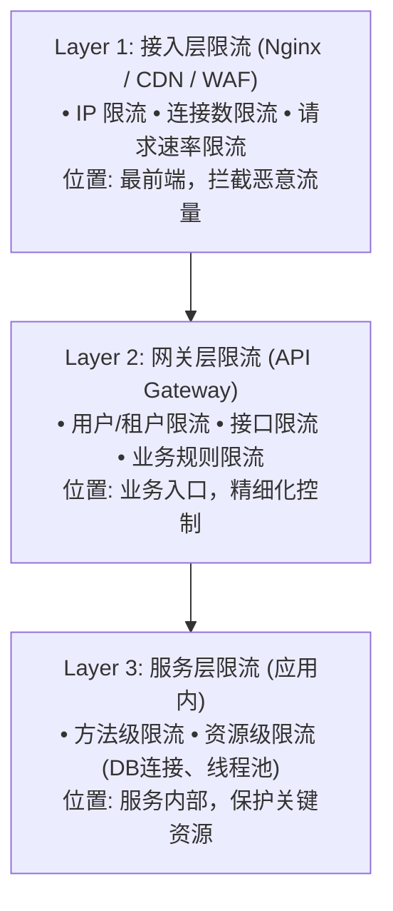
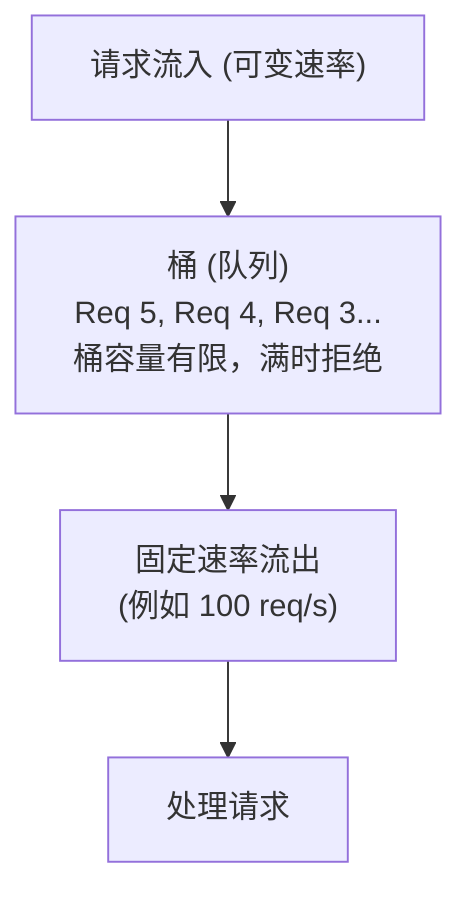
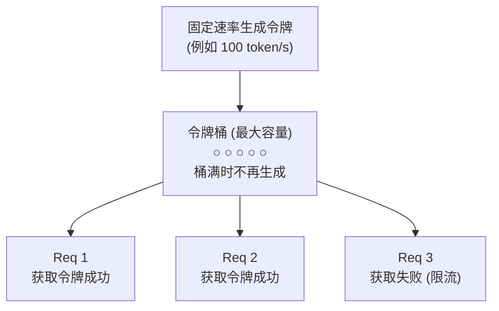
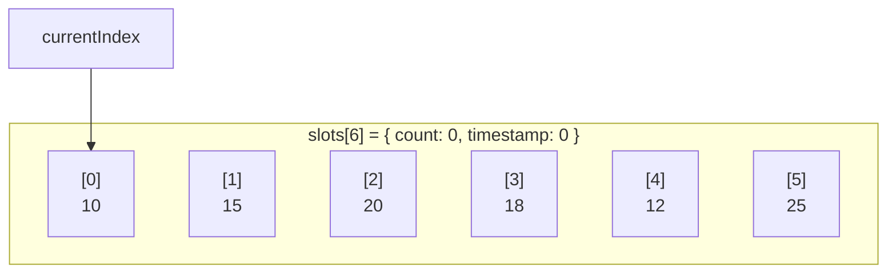
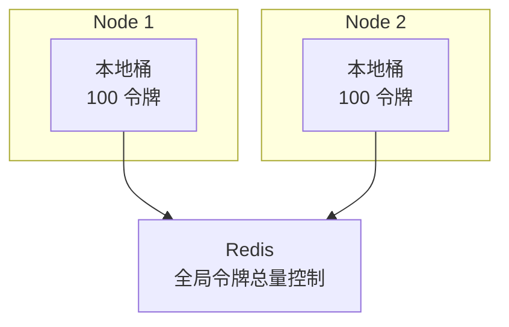
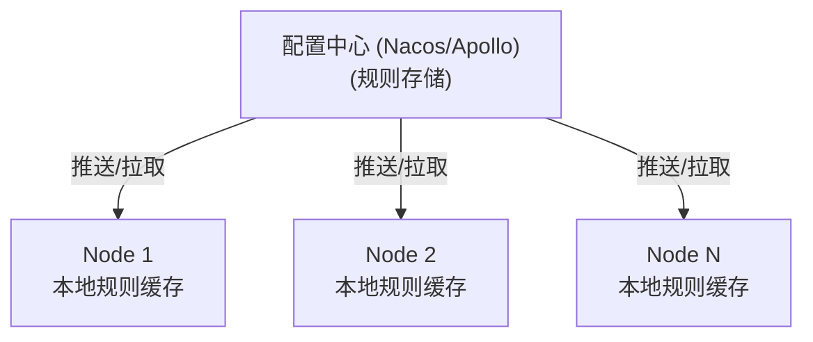
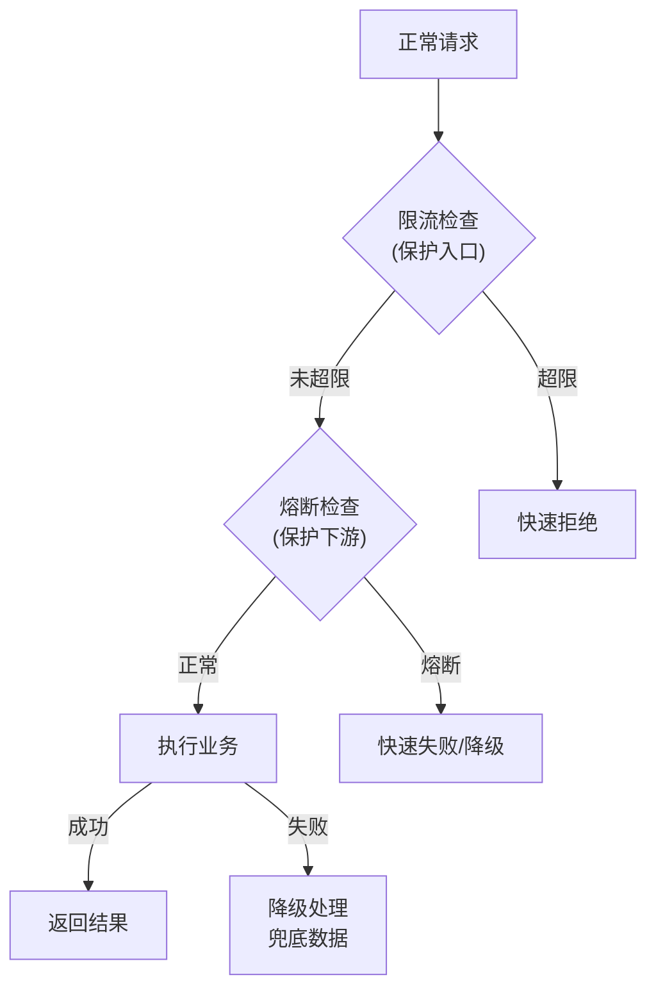
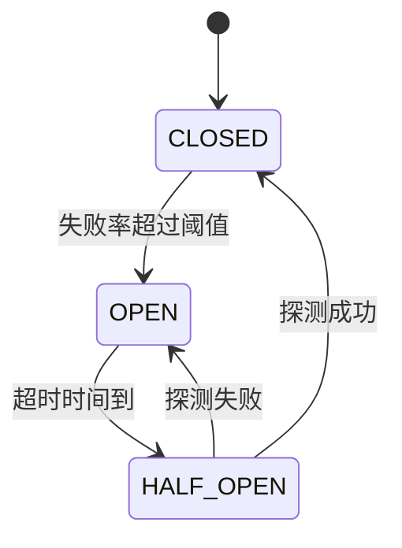
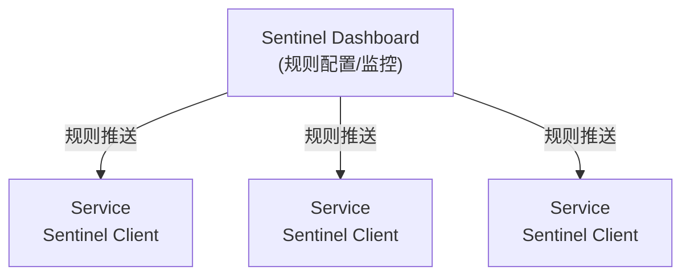
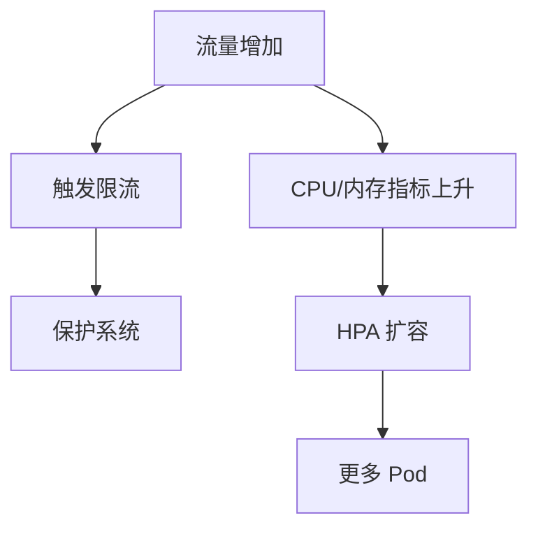

+++
title = "14.如何设计一个限流器"
slug = "interview-如何设计一个限流器"
+++

# 如何设计一个限流器

> 本文深入剖析限流器的设计与实现，涵盖经典限流算法、单机与分布式限流、高性能高可用设计，结合 Sentinel、Nginx、Redis 等业界最佳实践。

---

## 一、限流概述

### 1.1 为什么需要限流

| 场景 | 问题 | 限流作用 |
| :--- | :--- | :--- |
| **突发流量** | 秒杀/促销导致流量激增 | 保护系统不被打垮 |
| **恶意攻击** | DDoS、爬虫、刷接口 | 拦截异常流量 |
| **资源保护** | 下游服务承载有限 | 控制请求速率 |
| **公平性** | 大客户占用过多资源 | 多租户资源隔离 |
| **成本控制** | 云服务按量付费 | 控制调用成本 |

### 1.2 限流的位置



### 1.3 限流 vs 熔断 vs 降级

| 机制 | 触发条件 | 作用 | 恢复方式 |
| :--- | :--- | :--- | :--- |
| **限流** | 请求速率超阈值 | 拒绝/排队超量请求 | 速率降低后自动恢复 |
| **熔断** | 错误率/慢调用超阈值 | 快速失败，不再调用 | 半开状态探测恢复 |
| **降级** | 主动触发/系统过载 | 返回兜底数据/简化功能 | 手动/自动恢复 |

---

## 二、限流算法详解

### 2.1 固定窗口计数器

**原理**: 将时间划分为固定窗口，每个窗口独立计数

**限流规则示例**: 每分钟最多 100 个请求

| 窗口 | 时间段 | 计数 | 状态 |
| :--- | :--- | :--- | :--- |
| 窗口 1 | 00:00-00:01 | 95 | 未超限 |
| 窗口 2 | 00:01-00:02 | 100 | 达到限额 |
| 窗口 3 | 00:02-00:03 | 50 | 未超限 |

**优点**: 实现简单，内存占用小，计算快速

**缺点**: 临界问题 - 窗口边界可能出现 2 倍流量

**临界问题示例**:
- 窗口 1 后半分钟: 95 个请求
- 窗口 2 前半分钟: 100 个请求
- 结果: `00:00:30 - 00:01:30` 这 1 分钟内实际通过 195 个请求

### 2.2 滑动窗口计数器

**原理**: 将窗口划分为多个小格子，统计当前时间往前一个窗口周期内的总数

**时间轴示例** (窗口 1 分钟，划分 6 个格子，每格 10 秒):

```
[10] [15] [20] [18] [12] [25] [10] [15] [20]
      └─────────────────────────────┘
           当前窗口 (最近 60 秒)
           sum = 10+15+20+18+12+25 = 100
```

随着时间推移，窗口向右滑动:

```
[10] [15] [20] [18] [12] [25] [10] [15] [20]
           └─────────────────────────────┘
                当前窗口 (最近 60 秒)
                sum = 15+20+18+12+25+10 = 100
```

**优点**: 解决了临界问题，限流更平滑；精度可调 (格子越多越精确)

**缺点**: 内存占用随精度增加；需要维护多个计数器

### 2.3 漏桶算法

**原理**: 请求进入桶中排队，以固定速率流出处理



**特点**:
- 流出速率恒定，平滑处理
- 无法应对突发流量 (即使系统空闲也只能固定速率)

**适用场景**: 需要严格控制处理速率；下游系统承载能力固定

### 2.4 令牌桶算法

**原理**: 以固定速率生成令牌，请求需要获取令牌才能处理



**特点**:
- 允许突发流量 (桶内有积累的令牌)
- 长期平均速率受控
- 比漏桶更灵活

**关键参数**:
- `rate`: 令牌生成速率 (每秒生成多少令牌)
- `capacity`: 桶容量 (最多积累多少令牌)

**突发流量处理**: 假设 `rate=100/s, capacity=200`，空闲 2 秒后桶内有 200 个令牌，突发 200 个请求可立即处理，之后恢复 100/s 的速率

### 2.5 滑动日志算法

**原理**: 记录每个请求的精确时间戳，统计时间窗口内的请求数

**数据结构**: 有序列表 (按时间戳排序)

```
请求日志: [ 12:00:00.100, 12:00:00.250, 12:00:00.500, 12:00:00.750, ... ]
```

**算法流程**:
1. 移除所有过期的时间戳 (`now - window_size`)
2. 统计剩余时间戳数量
3. 如果数量 < 限流阈值，添加当前时间戳，允许请求
4. 否则拒绝请求

**优点**: 最精确的限流方式；无临界问题

**缺点**: 内存占用最大 (每个请求一条记录)；高并发时性能开销大

**适用场景**: 对精度要求极高的场景；QPS 较低的接口

### 2.6 算法对比

| 算法 | 突发处理 | 平滑性 | 精度 | 内存占用 | 适用场景 |
| :--- | :--- | :--- | :--- | :--- | :--- |
| **固定窗口** | 差 | 差 | 低 | 极小 | 简单场景 |
| **滑动窗口** | 中 | 好 | 中 | 小 | 通用限流 |
| **滑动日志** | 中 | 好 | 极高 | 大 | 精确限流 |
| **漏桶** | 差 | 极好 | 高 | 小 | 严格限速 |
| **令牌桶** | 好 | 好 | 高 | 小 | 允许突发 |

---

## 三、单机限流实现

### 3.1 Guava RateLimiter

基于令牌桶算法的单机限流实现

**核心概念**:
- `SmoothBursty`: 允许突发，预存令牌
- `SmoothWarmingUp`: 预热模式，逐渐提升速率

**使用方式**:

```java
RateLimiter limiter = RateLimiter.create(100); // 100 permits/s
if (limiter.tryAcquire()) {
    // 获取令牌成功，处理请求
} else {
    // 获取失败，拒绝请求
}
```

**核心方法**:

| 方法 | 说明 |
| :--- | :--- |
| `acquire()` | 阻塞等待获取令牌 |
| `tryAcquire()` | 非阻塞尝试获取 |
| `tryAcquire(timeout)` | 带超时的尝试获取 |

**优点**: 开箱即用，API 简洁；支持预热

**缺点**: 仅支持单机；不支持动态调整限流规则

### 3.2 Semaphore 限流

**原理**: 通过信号量控制并发数

**使用方式**:

```java
Semaphore semaphore = new Semaphore(100); // 最大 100 并发

try {
    if (semaphore.tryAcquire(timeout)) {
        try {
            // 处理请求
        } finally {
            semaphore.release();
        }
    } else {
        // 拒绝请求
    }
}
```

**特点**: 控制的是并发数，而非 QPS；适合控制资源池大小（如数据库连接）

**适用场景**: 限制同时访问某资源的线程数；连接池、线程池大小控制

### 3.3 滑动窗口实现

**数据结构**: 使用环形数组存储每个时间片的计数；时间片数量 = 窗口大小 / 时间片大小

**示例**: 1 分钟窗口，10 秒时间片，共 6 个槽位



**算法流程**:
1. 计算当前时间对应的槽位: `index = (now / slotSize) % slotCount`
2. 如果槽位时间戳过期，重置该槽位
3. 累加当前窗口内所有有效槽位的计数
4. 如果总数 >= 限流阈值，拒绝；否则当前槽位 +1

**关键点**: 槽位重置时需要检查时间戳，避免误统计；使用 CAS 保证线程安全

---

## 四、分布式限流实现

### 4.1 分布式限流挑战

| 挑战 | 说明 |
| :--- | :--- |
| **全局视图** | 多个节点需要共享限流状态 |
| **一致性** | 限流计数需要强一致或最终一致 |
| **性能** | 分布式调用增加延迟 |
| **可用性** | 限流中心故障不能影响业务 |

### 4.2 Redis 令牌桶实现

**数据结构**:
- KEY: `rate_limiter:{resource}`
- VALUE: `{ tokens: 当前令牌数, last_time: 上次更新时间戳 }`

**Lua 脚本 (保证原子性)**:

```lua
local key = KEYS[1]
local rate = tonumber(ARGV[1])      -- 令牌生成速率
local capacity = tonumber(ARGV[2])  -- 桶容量
local now = tonumber(ARGV[3])       -- 当前时间戳
local requested = tonumber(ARGV[4]) -- 请求的令牌数

local data = redis.call('HMGET', key, 'tokens', 'last_time')
local tokens = tonumber(data[1]) or capacity
local last_time = tonumber(data[2]) or now

-- 计算新增的令牌数
local delta = math.max(0, now - last_time)
local new_tokens = math.min(capacity, tokens + delta * rate)

-- 判断是否有足够令牌
if new_tokens >= requested then
    new_tokens = new_tokens - requested
    redis.call('HMSET', key, 'tokens', new_tokens, 'last_time', now)
    redis.call('EXPIRE', key, capacity / rate * 2)
    return 1  -- 成功
else
    return 0  -- 失败
end
```

**优点**: Lua 脚本保证原子性；支持分布式多节点共享；实现简单可靠

### 4.3 Redis 滑动窗口实现

**方案一: ZSET (Sorted Set)**

- **数据结构**: KEY `rate_limiter:{resource}`，ZSET 的 member = 请求ID, score = 时间戳

**算法**:

```lua
1. ZREMRANGEBYSCORE key 0 (now - window_size)  -- 移除过期请求
2. ZCARD key                                    -- 统计当前窗口数量
3. if count < limit:
       ZADD key now request_id                 -- 添加请求
       EXPIRE key window_size                  -- 设置过期
       return ALLOW
   else:
       return DENY
```

**优点**: 精确统计 | **缺点**: 内存占用大 (每个请求一条记录)

**方案二: Hash + 时间片**

- **数据结构**: KEY `rate_limiter:{resource}:{minute}`，HASH 的 field = 秒级时间片, value = 计数

```json
// 示例: rate_limiter:api:202501071430
{
    "0": 15,   // 第 0-9 秒的计数
    "1": 20,   // 第 10-19 秒的计数
    ...
}
```

**优点**: 内存占用小 | **缺点**: 精度有限

### 4.4 本地 + 远程混合限流

**问题**: 每次请求都访问 Redis，延迟和性能开销大

**解决**: 本地预取令牌，减少 Redis 访问



**流程**:
1. 本地桶令牌充足 → 直接使用本地令牌，不访问 Redis
2. 本地桶令牌不足 → 从 Redis 批量申请令牌到本地
3. 定时归还: 如果本地令牌长时间不用，归还给 Redis

**优点**: 大部分请求本地处理，延迟极低；全局限流仍然有效

**缺点**: 限流精度有一定误差；实现复杂度增加

---

## 五、限流维度与策略

### 5.1 限流维度

| 维度 | 说明 | Key 设计 |
| :--- | :--- | :--- |
| **全局限流** | 整个服务的总 QPS | `rate_limit:global` |
| **接口限流** | 单个接口的 QPS | `rate_limit:api:{path}` |
| **用户限流** | 单用户的 QPS | `rate_limit:user:{user_id}` |
| **IP 限流** | 单 IP 的 QPS | `rate_limit:ip:{ip}` |
| **租户限流** | 多租户场景 | `rate_limit:tenant:{tenant_id}` |
| **组合限流** | 用户+接口 | `rate_limit:user:{uid}:api:{path}` |

### 5.2 限流策略配置

**配置示例**:

```json
{
  "rules": [
    {
      "resource": "/api/order/create",
      "type": "QPS",
      "threshold": 1000,
      "dimension": "GLOBAL"
    },
    {
      "resource": "/api/order/create",
      "type": "QPS",
      "threshold": 10,
      "dimension": "USER",
      "dimensionKey": "user_id"
    },
    {
      "resource": "/api/sms/send",
      "type": "QPS",
      "threshold": 1,
      "dimension": "IP",
      "timeWindow": 60
    },
    {
      "resource": "db_connection",
      "type": "CONCURRENCY",
      "threshold": 100,
      "dimension": "GLOBAL"
    }
  ]
}
```

**限流类型**:
- `QPS`: 每秒请求数
- `QPM`: 每分钟请求数
- `CONCURRENCY`: 并发数

### 5.3 限流响应策略

| 策略 | 说明 | 适用场景 |
| :--- | :--- | :--- |
| **直接拒绝** | 返回 429 Too Many Requests | 明确告知客户端 |
| **排队等待** | 请求进入队列，等待处理 | 可容忍延迟 |
| **匀速排队** | 漏桶模式，均匀处理 | 削峰填谷 |
| **冷启动** | 逐渐增加通过率 | 服务预热 |
| **降级返回** | 返回兜底数据 | 非核心功能 |

---

## 六、高性能设计

### 6.1 性能优化策略

| 策略 | 说明 |
| :--- | :--- |
| **本地缓存** | 限流规则本地缓存，避免每次从配置中心读取；配置变更通过推送或定时拉取更新 |
| **批量处理** | 本地预取令牌，减少 Redis 访问；批量申请/归还令牌 |
| **异步计数** | 非核心场景使用异步计数；允许一定误差，换取性能 |
| **分片** | 将热点 Key 分片，减少单点压力；例如 `rate_limit:api:order:{hash % 10}` |
| **Lua 脚本优化** | 使用 Redis Lua 脚本减少网络往返；预加载脚本 (SCRIPT LOAD) |
| **连接池** | Redis 连接池复用；避免频繁建立连接 |

### 6.2 热点 Key 处理

```
问题: 热门接口的限流 Key 被频繁访问，成为瓶颈

解决方案:

1. Key 分片
   原 Key: rate_limit:api:hot_api
   分片后: rate_limit:api:hot_api:0
           rate_limit:api:hot_api:1
           ...
           rate_limit:api:hot_api:9
   
   每个请求随机或 hash 选择一个分片
   阈值分摊: 原阈值 1000/s → 每个分片 100/s

2. 本地限流兜底
   • 先过本地限流 (Guava RateLimiter)
   • 本地限流设置为全局阈值的 1/N (N = 节点数)
   • 大部分请求被本地拦截，减少 Redis 压力

3. 读写分离
   • 使用 Redis Cluster 的多副本
   • 限流读请求分散到从节点
```

---

## 七、高可用设计

### 7.1 限流器故障处理

**核心原则**: 限流器故障不能影响正常业务

**策略 1: 降级放行**

```java
if (redis.isAvailable()) {
    return redis.checkLimit(key, limit);
} else {
    // Redis 不可用，降级到本地限流或直接放行
    return localLimiter.checkLimit(key, limit / nodeCount);
}
```

**策略 2: 多级限流**
- Level 1: 本地限流 (Guava) - 永远可用
- Level 2: 分布式限流 (Redis) - 可能不可用
- 两级都通过才放行: 本地限流阈值 = 全局阈值 / 节点数

**策略 3: 超时快速失败**
- Redis 操作设置短超时 (如 10ms)
- 超时则走降级逻辑，不阻塞业务

### 7.2 Redis 高可用

| 方案 | 说明 | 适用场景 |
| :--- | :--- | :--- |
| **主从复制** | 一主多从，故障手动切换 | 简单场景 |
| **Sentinel** | 自动故障检测和切换 | 中等规模 |
| **Cluster** | 分片 + 高可用 | 大规模 |

### 7.3 规则配置高可用



**高可用保障**:
1. 规则本地缓存，配置中心不可用时使用缓存
2. 规则持久化到本地文件，重启可恢复
3. 规则变更推送 + 定时拉取双保险

---

## 八、限流与熔断降级

### 8.1 三者关系



### 8.2 熔断器状态机



| 状态 | 说明 |
|------|------|
| **CLOSED** | 正常处理请求，统计失败率 |
| **OPEN** | 快速失败，不调用下游，等待超时 |
| **HALF_OPEN** | 允许少量请求探测，根据结果决定恢复或继续熔断 |

---

## 九、业界限流方案

### 9.1 Sentinel (阿里巴巴)

**核心功能**: 流量控制 (限流)、熔断降级、系统保护、热点参数限流



**特点**:
- 本地限流，不依赖外部存储
- 支持多种限流模式 (QPS/线程数/关联限流)
- 支持集群限流 (需要 Token Server)
- 丰富的 Dashboard 和实时监控

### 9.2 Nginx 限流

**模块 1: limit_req_zone (请求速率限流)**

```nginx
http {
    # 定义限流区域: 按 IP 限流，10MB 共享内存，10 req/s
    limit_req_zone $binary_remote_addr zone=perip:10m rate=10r/s;

    server {
        location /api/ {
            # 应用限流: 允许突发 20 个请求，不延迟
            limit_req zone=perip burst=20 nodelay;
        }
    }
}
```

**模块 2: limit_conn_zone (连接数限流)**

```nginx
http {
    # 定义连接限流区域
    limit_conn_zone $binary_remote_addr zone=perip:10m;

    server {
        location /download/ {
            # 每 IP 最多 5 个并发连接
            limit_conn perip 5;
        }
    }
}
```

**算法**: 漏桶算法

**参数**:
- `rate`: 处理速率 (r/s 或 r/m)
- `burst`: 桶容量，允许的突发请求数
- `nodelay`: 不延迟突发请求，直接处理

### 9.3 API Gateway 限流

| 网关 | 限流能力 | 特点 |
| :--- | :--- | :--- |
| **Kong** | 内置 rate-limiting 插件 | 支持 Redis 集群限流 |
| **APISIX** | 内置多种限流插件 | 高性能，支持动态配置 |
| **Spring Cloud Gateway** | RequestRateLimiter | 基于 Redis + Lua |
| **Envoy** | Rate Limit Service | 外部服务实现 |

### 9.4 Resilience4j

**特点**: 轻量级，无外部依赖；函数式 API 设计；与 Spring Boot 集成良好；Hystrix 的现代替代品

**核心模块**:

| 模块 | 功能 |
| :--- | :--- |
| `RateLimiter` | 限流 (基于令牌桶) |
| `CircuitBreaker` | 熔断 |
| `Retry` | 重试 |
| `Bulkhead` | 隔离 (信号量/线程池) |
| `TimeLimiter` | 超时 |

**配置示例**:

```yaml
resilience4j.ratelimiter:
  instances:
    orderService:
      limitForPeriod: 100        # 周期内允许的请求数
      limitRefreshPeriod: 1s     # 刷新周期
      timeoutDuration: 500ms     # 等待超时
```

**优点**: 比 Hystrix 更轻量；支持响应式编程；配置灵活

**缺点**: 主要是单机限流；无可视化 Dashboard

### 9.5 方案对比

| 方案 | 部署位置 | 限流算法 | 分布式支持 | 适用场景 |
| :--- | :--- | :--- | :--- | :--- |
| **Guava** | 应用内 | 令牌桶 | 不支持 | 单机简单限流 |
| **Sentinel** | 应用内 | 多种 | 需 Token Server | 微服务架构 |
| **Resilience4j** | 应用内 | 令牌桶 | 不支持 | Spring Boot 应用 |
| **Redis** | 独立 | 自定义 | 原生支持 | 通用分布式 |
| **Nginx** | 接入层 | 漏桶 | 不支持 | 入口限流 |
| **Kong** | 网关 | 多种 | 支持 | API 管理 |

---

## 十、限流最佳实践

### 10.1 限流阈值设定

| 方法 | 说明 |
| :--- | :--- |
| **压测法** | 对系统进行压力测试，找到系统最大承载能力，阈值设为最大承载的 70-80% |
| **历史数据法** | 分析历史峰值流量，阈值设为历史峰值的 1.5-2 倍，留有冗余空间 |
| **资源推算法** | 根据资源容量反推，例如: 数据库 1000 连接，单请求 10ms，最大 QPS = 1000 / 0.01 = 100,000 |
| **动态调整** | 监控系统负载，根据负载动态调整阈值，使用自适应限流算法 |

### 10.2 限流粒度选择

| 粒度 | 优点 | 缺点 | 适用场景 |
| :--- | :--- | :--- | :--- |
| **粗粒度** (全局/服务) | 实现简单，性能好 | 不精确，一刀切 | 入口保护 |
| **中粒度** (接口/用户) | 较精确 | 规则多，维护成本 | 通用场景 |
| **细粒度** (用户+接口) | 精确控制 | 规则爆炸，性能差 | 重要接口 |

### 10.3 限流规则设计原则

```
1. 分层限流
   • 入口层: 粗粒度限流，拦截恶意流量
   • 网关层: 用户/租户限流
   • 服务层: 接口/资源限流

2. 梯度限流
   • 普通用户: 10 QPS
   • VIP 用户: 100 QPS
   • 合作伙伴: 1000 QPS

3. 优先级限流
   • 核心接口高阈值
   • 非核心接口低阈值
   • 系统过载时优先保障核心

4. 弹性限流
   • 正常时期: 标准阈值
   • 大促时期: 提高阈值
   • 故障时期: 降低阈值
```

### 10.4 自适应限流

**原理**: 根据系统实时负载动态调整限流阈值

**核心指标**: CPU 使用率、系统负载 (Load)、平均响应时间 (RT)、并发线程数、入口 QPS

**Sentinel 系统保护规则**:
- 当 `CPU > 80%` 或 `Load > 2.5` 时: 自动降低入口 QPS
- 计算公式: `maxQPS = minRT * maxThread`
- BBR 算法 (类似 TCP BBR): 通过探测发现系统最佳吞吐点，动态调整

**优点**: 无需手动设置阈值；根据系统实际能力动态调整；更好地利用系统资源

**实现方式**: 监控系统指标 → 设置触发条件 → 使用 PID 控制或 BBR 算法调整

### 10.5 客户端限流

**原理**: 在客户端/调用方实现限流，减少对服务端的无效请求

**场景**: SDK 调用第三方 API、移动端调用后端接口、微服务间调用

**实现方式**:
1. **本地限流器**: 客户端内嵌令牌桶，限制自身请求速率
2. **服务端反馈限流**: 服务端返回 429 状态码时，客户端根据响应头暂停请求或指数退避重试

**响应头示例**:

```
Retry-After: 5
X-RateLimit-Remaining: 0
X-RateLimit-Reset: 1704700000
```

**优点**: 减少无效网络请求；减轻服务端压力；更好的用户体验

### 10.6 限流与重试策略

```
问题: 客户端重试可能放大限流压力

场景分析:
• 100 个客户端同时请求
• 服务端限流 50 QPS
• 被拒绝的 50 个请求立即重试
• 重试请求再次被拒绝，继续重试
• 造成重试风暴

解决方案:

1. 指数退避 (Exponential Backoff)
   第 1 次重试: 等待 1s
   第 2 次重试: 等待 2s
   第 3 次重试: 等待 4s
   ...
   最大等待: 32s

2. 抖动 (Jitter)
   在退避时间上增加随机性
   wait = baseWait * 2^attempt + random(0, 1000ms)
   避免所有客户端同时重试

3. 限制重试次数
   最多重试 3 次
   超过后快速失败

4. 断路器
   连续失败 N 次后停止重试
   等待一段时间后再尝试

最佳实践:
• 被限流后使用指数退避 + 抖动
• 设置最大重试次数
• 结合熔断器使用
```

### 10.7 限流测试

| 测试类型 | 说明 |
| :--- | :--- |
| **功能测试** | 验证限流是否生效；验证限流阈值是否准确；验证拒绝响应是否正确 (429) |
| **精度测试** | 发送略高于阈值的请求，统计实际通过数量，计算误差率: `|实际 - 预期| / 预期`，误差应 < 5% |
| **压力测试** | 使用压测工具 (wrk / ab / JMeter)，模拟高并发请求，验证限流器性能开销和系统稳定性 |
| **边界测试** | 刚好达到阈值、超过阈值 1 个请求、窗口边界的请求 |
| **分布式测试** | 多节点同时请求，验证全局限流效果和一致性 |

**测试命令示例 (wrk)**:

```bash
wrk -t12 -c400 -d30s --latency http://localhost:8080/api/test
```

### 10.8 限流的副作用与注意事项

| 问题 | 说明 | 解决方案 |
| :--- | :--- | :--- |
| **误杀正常请求** | 阈值设置过低 | 压测确定阈值，留有余量 |
| **用户体验差** | 直接返回 429 错误 | 提供友好提示，引导重试 |
| **雪崩效应** | 限流导致重试风暴 | 指数退避 + 熔断 |
| **限流器故障** | Redis 不可用 | 降级放行，多级限流 |
| **时钟不同步** | 分布式时钟偏差 | 使用服务端时间戳 |
| **规则冲突** | 多个限流规则矛盾 | 明确优先级，先精细后粗粒度 |

---

## 十一、监控与告警

### 11.1 监控指标

| 指标 | 说明 | 告警阈值 |
| :--- | :--- | :--- |
| **通过 QPS** | 限流后通过的请求数 | - |
| **拒绝 QPS** | 被限流拒绝的请求数 | > 0 告警 |
| **拒绝率** | 拒绝数 / 总请求数 | > 1% 告警 |
| **限流触发次数** | 触发限流的次数 | 频繁触发告警 |
| **限流器延迟** | 限流判断耗时 | > 5ms 告警 |

### 11.2 监控看板

```
核心看板:
• 实时 QPS 曲线 (总量/通过/拒绝)
• 各接口限流触发次数
• 各用户/IP 限流情况
• 限流规则命中排行

告警规则:
• 拒绝率突增: 1 分钟内拒绝率 > 5%
• 热点限流: 某 Key 限流次数 > 1000/分钟
• 限流器异常: 限流判断延迟 > 10ms
```

### 11.3 限流日志

```
记录内容:
• 时间戳
• 请求 ID
• 限流 Key (用户ID/接口/IP)
• 限流规则
• 当前计数
• 限流阈值
• 限流结果 (PASS/BLOCK)

日志示例:
{
  "timestamp": "2025-01-07T12:00:00.000Z",
  "request_id": "abc123",
  "limit_key": "user:10001:/api/order/create",
  "rule": "QPS:100",
  "current_count": 101,
  "threshold": 100,
  "result": "BLOCK"
}
```

---

## 十二、自动伸缩与限流

### 12.1 限流与 HPA 的配合

**场景**: 流量增加 → 触发限流 (保护系统) → 同时触发扩容 (增加处理能力)



**动态调整限流阈值**:
- Pod 数量增加 → 全局限流阈值可动态提升
- 单机限流阈值 = 全局阈值 / Pod 数量
- 通过 ConfigMap 或配置中心动态更新

**KEDA (Kubernetes Event-driven Autoscaling)**:
- 基于限流拒绝率触发扩容
- 拒绝率 > 5% 时增加副本
- 拒绝率 < 1% 时减少副本

### 12.2 限流阈值动态调整

**场景**: Pod 数量变化时自动调整限流阈值

| 方案 | 步骤 |
| :--- | :--- |
| **方案 1: 配置中心联动** | 1. HPA 扩容: 2 Pod → 4 Pod<br/>2. Operator 监听 Pod 变化<br/>3. Operator 更新配置中心: 单机限流 = 1000/4 = 250 QPS<br/>4. 各 Pod 监听配置变化，热更新 |
| **方案 2: Sentinel 集群限流** | 1. Token Server 维护全局令牌总量<br/>2. 各 Pod 作为 Token Client<br/>3. Pod 数量变化时，自动重新分配令牌<br/>4. 无需手动调整配置 |
| **方案 3: Redis 全局限流 (推荐)** | 1. 所有 Pod 共享 Redis 限流<br/>2. 全局阈值固定<br/>3. Pod 数量变化不影响限流逻辑<br/>4. 天然支持动态扩缩容 |

---

## 十三、面试常见问题

### 13.1 基础问题

**Q1: 令牌桶和漏桶的区别是什么？**
```
• 漏桶: 流出速率固定，无法应对突发流量
• 令牌桶: 允许突发，消耗积累的令牌
• 选择: 需要突发能力选令牌桶，需要严格平滑选漏桶
```

**Q2: 固定窗口的临界问题如何解决？**
```
• 使用滑动窗口算法
• 将窗口划分为多个小格子
• 统计滑动时间段内的总请求数
```

**Q3: 分布式限流如何保证原子性？**
```
• 使用 Redis Lua 脚本
• Lua 脚本在 Redis 中原子执行
• 避免竞态条件
```

### 13.2 进阶问题

**Q4: 如何设计一个高性能的分布式限流器？**
```
核心要点:
1. 本地 + 远程混合限流
2. 本地预取令牌，减少 Redis 调用
3. Lua 脚本保证原子性
4. 热点 Key 分片
5. 降级策略 (Redis 不可用时)
```

**Q5: 限流器故障时如何处理？**
```
策略优先级:
1. 降级到本地限流
2. 设置短超时 (10ms)
3. 超时直接放行
4. 核心原则: 限流故障不能影响业务
```

**Q6: 如何实现多租户限流？**
```
设计方案:
1. Key 设计: rate_limit:tenant:{tenant_id}:api:{path}
2. 每个租户独立配额
3. 支持配额调整
4. 共享资源池或独立资源池
```

### 13.3 场景问题

**Q7: 秒杀场景如何限流？**
```
多级限流:
1. CDN/WAF 层: 拦截恶意流量
2. 网关层: 用户 ID 限流 (每人每秒 1 次)
3. 服务层: 全局限流 (如 1000 QPS)
4. 结合排队机制: 超量请求进入队列
```

**Q8: 如何防止重试风暴？**
```
1. 客户端指数退避 + 抖动
2. 服务端返回 Retry-After 头
3. 熔断器: 连续失败后停止重试
4. 限制最大重试次数
```

**Q9: 如何验证限流器是否正确？**
```
测试方法:
1. 单元测试: 验证算法正确性
2. 压力测试: wrk/JMeter 验证精度
3. 分布式测试: 多节点验证全局限流
4. 边界测试: 临界值测试
```

### 13.4 设计问题

**Q10: 设计一个通用限流 SDK，你会考虑哪些方面？**
```
核心功能:
1. 多种限流算法 (令牌桶/滑动窗口)
2. 多限流维度 (用户/接口/IP)
3. 本地 + 分布式限流
4. 规则热更新
5. 降级策略

非功能性:
1. 低延迟 (< 1ms)
2. 高可用 (限流故障不影响业务)
3. 可观测 (指标/日志/告警)
4. 易集成 (注解/AOP)
```

---

## 附录：关键词索引

### 限流算法
`固定窗口`, `滑动窗口`, `滑动日志`, `漏桶算法`, `令牌桶算法`, `Leaky Bucket`, `Token Bucket`, `Sliding Window`, `Sliding Log`

### 实现技术
`Guava RateLimiter`, `Semaphore`, `Redis`, `Lua脚本`, `分布式限流`, `本地限流`, `混合限流`, `令牌预取`

### 限流维度
`QPS限流`, `并发限流`, `用户限流`, `IP限流`, `接口限流`, `租户限流`, `多维限流`, `组合限流`

### 高可用
`降级放行`, `多级限流`, `热点Key`, `Key分片`, `规则缓存`, `超时快速失败`

### 业界方案
`Sentinel`, `Hystrix`, `Resilience4j`, `Nginx`, `Kong`, `APISIX`, `Envoy`, `Spring Cloud Gateway`

### 相关概念
`熔断`, `降级`, `流量控制`, `过载保护`, `背压`, `自适应限流`, `BBR算法`

### 自动伸缩
`HPA`, `KEDA`, `动态阈值`, `配额分配`

### 测试验证
`压力测试`, `边界测试`, `精度测试`, `wrk`, `JMeter`

### 客户端策略
`指数退避`, `抖动`, `Retry-After`, `重试风暴`

---

## 相关文章

- [上一篇：如何设计多线程消费消息模型](/articles/interview/interview-13-多线程消费模型/)
- [下一篇：如何设计一个限流系统](/articles/interview/interview-15-设计限流系统/)
