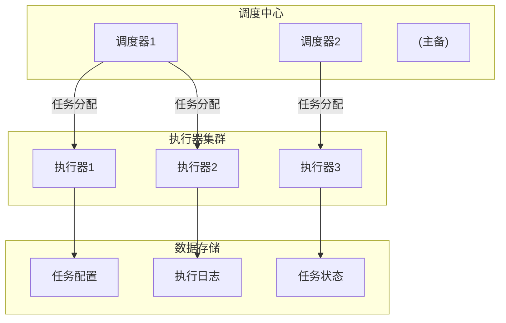

+++
title = "如何设计一个定时任务系统"
description = "分布式定时任务系统设计：任务调度、分片执行、失败处理与高可用方案"
date = 2025-01-16
weight = 16000
[taxonomies]
tags = ["interview", "system-design", "scheduler", "distributed", "cron"]
+++

# 如何设计一个定时任务系统

## 一、需求分析

### 1.1 核心需求

- **定时触发**：按指定时间或周期执行任务
- **可靠执行**：任务不漏执行、不重复执行
- **分布式支持**：多机部署，任务分配
- **任务管理**：增删改查、启停控制

### 1.2 扩展需求

- 任务依赖（DAG调度）
- 任务分片（大任务拆分）
- 失败重试和告警
- 执行日志和监控
- 动态调整参数

### 1.3 任务类型

| 类型 | 说明 | 示例 |
|------|------|------|
| Cron任务 | 按Cron表达式周期执行 | 每天凌晨2点备份 |
| 延迟任务 | 一次性延迟执行 | 30分钟后检查订单 |
| 固定间隔 | 上次执行完后固定间隔 | 每隔5分钟轮询 |
| 依赖任务 | 依赖其他任务完成后执行 | 数据同步后再聚合 |

---

## 二、单机方案

### 2.1 Timer/ScheduledExecutor

**Java ScheduledExecutorService**：
- 简单易用
- 单机场景足够
- 无持久化，重启丢失

**适用场景**：单机应用内的简单定时任务

### 2.2 Quartz单机模式

**特点**：
- 支持Cron表达式
- 支持持久化（数据库）
- 集群模式需要数据库锁

**局限**：
- 依赖数据库锁，性能瓶颈
- 任务无法分片

### 2.3 Spring @Scheduled

**特点**：
- 注解方式，简单
- 与Spring集成
- 本质是ScheduledExecutor

**局限**：
- 无集群协调
- 无法动态管理

---

## 三、分布式方案

### 3.1 核心挑战

**任务分配**：如何将任务分配给执行节点

**避免重复**：同一任务不能被多个节点执行

**故障转移**：节点故障，任务转移到其他节点

**负载均衡**：任务均匀分配

### 3.2 架构模式

**去中心化模式**：
- 各节点通过分布式锁竞争执行
- 简单，但效率不高

**中心化模式**：
- 调度中心负责分配
- 执行器负责执行
- 主流方案

### 3.3 典型架构



---

## 四、调度中心设计

### 4.1 核心职责

- 任务配置管理
- 触发时间计算
- 任务分发
- 执行监控

### 4.2 时间触发

**时间轮算法**：
- 环形数组，每个槽代表一个时间刻度
- 指针按时间推进
- 到期任务放入对应槽
- 高效处理大量定时任务

**多层时间轮**：
- 秒级、分钟级、小时级多层
- 类似时钟
- 处理跨度大的定时

### 4.3 任务分发策略

**随机**：随机选择执行器

**轮询**：按顺序分配

**一致性哈希**：相同任务尽量分配到同一执行器

**最少连接**：分配给负载最低的执行器

**广播**：所有执行器都执行

### 4.4 高可用

**调度中心高可用**：
- 主备模式或集群模式
- 使用分布式锁选主
- 主节点故障，备节点接管

**故障检测**：
- 心跳检测执行器存活
- 超时视为故障
- 任务转移到其他执行器

---

## 五、执行器设计

### 5.1 核心职责

- 接收任务
- 执行任务
- 报告结果
- 资源管理

### 5.2 执行模式

**同步执行**：
- 阻塞直到完成
- 简单可靠

**异步执行**：
- 返回后继续执行
- 需要回调报告

### 5.3 线程池管理

**隔离执行**：
- 快任务和慢任务分开
- 避免相互影响

**资源限制**：
- 控制并发任务数
- 避免资源耗尽

### 5.4 任务分片

**场景**：处理大量数据的任务

**原理**：
- 将数据分成N片
- 分配给N个执行器
- 每个执行器处理一片

**分片方式**：
- 按ID取模
- 按范围划分
- 按业务规则

**示例**：
- 总共100万用户
- 分10片，每片10万
- 10个执行器并行处理

---

## 六、可靠性保障

### 6.1 任务不丢失

**调度端**：
- 任务持久化到数据库
- 调度失败重试
- 故障转移

**执行端**：
- 执行状态及时上报
- 超时检测
- 失败重试

### 6.2 避免重复执行

**调度锁**：
- 分布式锁保证单一调度
- 任务实例级别锁

**幂等执行**：
- 任务本身实现幂等
- 记录执行ID去重

### 6.3 失败处理

**重试策略**：
- 立即重试
- 固定间隔重试
- 指数退避重试
- 最大重试次数限制

**失败处理**：
- 告警通知
- 进入死信队列
- 人工介入

### 6.4 超时处理

**执行超时**：
- 设置最大执行时间
- 超时强制终止
- 标记为失败

**心跳超时**：
- 执行器定期心跳
- 超时视为故障
- 任务转移

---

## 七、任务依赖

### 7.1 DAG调度

**场景**：任务之间有依赖关系

**示例**：
```
任务A → 任务B → 任务D
   ↘         ↗
    任务C ───
```

**实现**：
- 构建任务依赖图
- 拓扑排序确定执行顺序
- 前置任务完成才触发后续

### 7.2 工作流引擎

**功能**：
- 可视化DAG编排
- 条件分支
- 并行执行
- 状态追踪

**常见系统**：
- Apache Airflow
- Azkaban
- DolphinScheduler

---

## 八、监控与运维

### 8.1 监控指标

**调度指标**：
- 任务调度延迟
- 调度成功率
- 待调度任务数

**执行指标**：
- 执行成功率
- 执行耗时
- 执行器负载

**业务指标**：
- 任务队列积压
- 失败任务数
- 重试任务数

### 8.2 告警策略

**任务级别**：
- 任务执行失败
- 任务执行超时
- 任务连续失败

**系统级别**：
- 调度器不可用
- 执行器离线
- 系统负载过高

### 8.3 运维操作

**任务管理**：
- 暂停/恢复任务
- 手动触发
- 参数调整

**执行器管理**：
- 上线/下线
- 负载查看
- 日志查看

---

## 九、实际系统参考

### 9.1 XXL-JOB

**特点**：
- 调度中心 + 执行器架构
- 支持分片
- Web界面管理
- 广泛使用

### 9.2 Elastic-Job

**特点**：
- 基于ZooKeeper协调
- 弹性扩容
- 分片策略丰富

### 9.3 Apache DolphinScheduler

**特点**：
- 可视化DAG
- 丰富的任务类型
- 大数据场景

---

## 十、面试要点

### 10.1 常见追问

**Q：如何保证任务不重复执行？**
A：调度端使用分布式锁保证单一调度；任务实例有唯一ID，执行器通过ID去重；任务本身实现幂等。

**Q：执行器故障如何处理？**
A：心跳检测发现故障；正在执行的任务超时后重新调度；任务转移到健康的执行器。

**Q：大任务如何处理？**
A：任务分片，将数据拆分成多片并行执行；例如处理1000万用户，分10片，每片处理100万。

**Q：如何支持任务依赖？**
A：构建DAG描述依赖关系；前置任务完成才触发后续任务；记录任务状态进行流转控制。

### 10.2 设计要点总结

1. **调度与执行分离**：调度中心负责触发，执行器负责执行
2. **高可用**：调度中心主备，执行器集群，故障转移
3. **任务分片**：大任务拆分并行执行
4. **可靠性**：持久化、重试、幂等
5. **可观测**：日志、监控、告警

---

## 相关文章

- [上一篇：如何设计一个限流系统](@/articles/interview/interview-15-设计限流系统.md)
- [下一篇：如何设计一个高性能定时器系统](@/articles/interview/interview-17-设计高性能定时器.md)
