+++
title = "17.如何设计一个高性能定时器系统"
slug = "interview-如何设计一个高性能定时器系统"
+++

# 如何设计一个高性能定时器系统

> 本文从系统设计面试角度，深入剖析如何设计一个每秒精确触发回调的定时器系统，涵盖操作系统原理、数据结构选型、分布式架构、高可用保障等核心主题。

---

## 一、需求分析与问题定义

### 1.1 问题拆解

"每一秒向回调发出通知"看似简单，但在工程实践中涉及多个层次：

| 层次 | 关键问题 | 技术挑战 |
| :--- | :--- | :--- |
| **操作系统** | 如何获取精确时间？如何被唤醒？ | 系统调用开销、时钟源选择 |
| **单机应用** | 如何管理大量定时任务？ | 数据结构效率、CPU 占用 |
| **分布式** | 如何保证定时任务不丢、不重？ | 一致性、故障恢复 |
| **可扩展** | 如何支撑百万级定时任务？ | 水平扩展、负载均衡 |

### 1.2 非功能性需求

| 维度 | 要求 | 量化指标 |
| :--- | :--- | :--- |
| **精度** | 毫秒级触发 | 抖动 < 10ms |
| **吞吐** | 支撑海量定时任务 | 百万级任务/节点 |
| **可用性** | 定时任务不丢失 | 99.99% |
| **延迟** | 回调执行时延 | P99 < 5ms |
| **一致性** | 不重复触发、不漏触发 | Exactly-Once 语义 |

### 1.3 典型应用场景

| 场景 | 精度要求 | 规模 | 技术选型倾向 |
| :--- | :--- | :--- | :--- |
| **心跳检测** | 100ms~1s | 万级连接 | 时间轮 |
| **订单超时取消** | 秒级 | 百万级订单 | 延迟队列 |
| **定时调度任务** | 秒级~分钟级 | 万级任务 | 分布式调度器 |
| **游戏帧同步** | 16ms (60FPS) | 房间级 | 高精度定时器 |
| **金融交易** | 微秒级 | 高频 | 硬件时钟 + 内核旁路 |

---

## 二、操作系统定时器原理

### 2.1 Linux 时钟源

操作系统提供多种时钟源，精度和开销不同：

| 时钟源 | 精度 | 开销 | 适用场景 |
| :--- | :--- | :--- | :--- |
| **TSC** (Time Stamp Counter) | 纳秒级 | 极低 (10~20 cycles) | 高频计时 |
| **HPET** (High Precision Event Timer) | 纳秒级 | 较高 (需访问 MMIO) | 通用高精度 |
| **ACPI PM Timer** | 微秒级 | 较高 | 兼容老旧系统 |
| **PIT** (Programmable Interval Timer) | 毫秒级 | 中等 | 传统 x86 |

**最佳实践**: 现代 Linux 系统优先使用 TSC，配合 `clock_gettime(CLOCK_MONOTONIC)` 获取单调递增时间。

### 2.2 Linux 内核定时机制

| 机制 | 精度 | 特点 | 用户态接口 |
| :--- | :--- | :--- | :--- |
| **Tick-based** | HZ (通常 1ms~10ms) | 周期性中断，空闲时有开销 | - |
| **Tickless (NO_HZ)** | 动态 | 无任务时停止 tick，节能 | - |
| **High-Resolution Timer (hrtimer)** | 纳秒级 | 基于红黑树，按需中断 | timerfd, nanosleep |

### 2.3 用户态定时器接口对比

| 接口 | 精度 | 可扩展性 | 使用复杂度 |
| :--- | :--- | :--- | :--- |
| **sleep/usleep** | 毫秒~秒 | 差 (阻塞线程) | 简单 |
| **nanosleep** | 纳秒 | 差 (阻塞线程) | 简单 |
| **setitimer/alarm** | 微秒~秒 | 差 (进程级信号) | 中等 |
| **timer_create (POSIX)** | 纳秒 | 中 (信号或线程通知) | 复杂 |
| **timerfd_create** | 纳秒 | **优秀 (fd 可 epoll)** | 中等 |
| **io_uring + timeout** | 纳秒 | **优秀 (异步批量)** | 复杂 |

**最佳实践**: 高性能场景首选 `timerfd` + `epoll`，Linux 5.x 以上可考虑 `io_uring`。

### 2.4 timerfd 核心优势

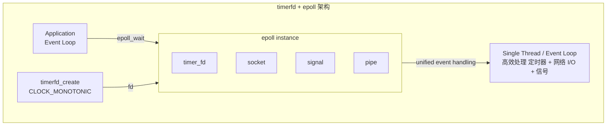

**timerfd 的核心优势**：
1. **统一事件模型**: timer 成为 fd，可与 socket/pipe 统一在 epoll 中处理
2. **无信号干扰**: 避免 signal handler 的竞态和复杂性
3. **高精度**: 底层使用 hrtimer，支持纳秒精度
4. **零拷贝通知**: read() 返回过期次数，无额外内存开销

---

## 三、定时器数据结构选型

管理大量定时任务时，数据结构直接决定性能上限。

### 3.1 常见数据结构对比

| 数据结构 | 插入 | 删除 | 查询最近 | 适用场景 |
| :--- | :--- | :--- | :--- | :--- |
| **有序链表** | O(n) | O(1) | O(1) | 任务数少 |
| **最小堆** | O(log n) | O(log n) | O(1) | 通用场景 |
| **红黑树** | O(log n) | O(log n) | O(log n) | 需范围查询 |
| **时间轮** | O(1) | O(1) | O(1) | **大规模定时任务** |
| **分层时间轮** | O(1) | O(1) | O(1) | 跨度大的定时任务 |

### 3.2 最小堆 (Min-Heap)

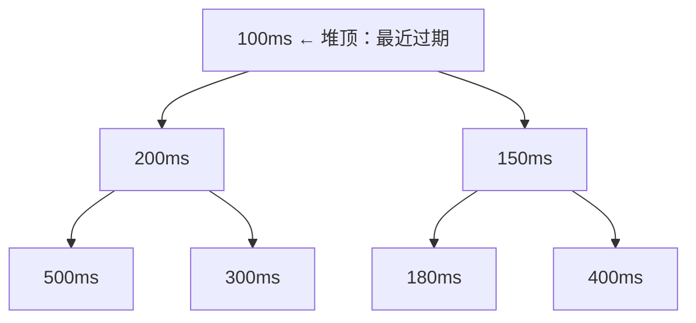

**优点：**
- 插入/删除 O(log n)
- 堆顶即最近过期任务 O(1)
- 实现简单，标准库支持

**缺点：**
- 大量任务同时过期时，批量出堆开销大
- 删除任意任务需要额外索引

**应用：** Go runtime timer、Java DelayQueue

### 3.3 简单时间轮 (Simple Timing Wheel)

**参数:** tick = 1秒, 轮大小 = 60 格 (覆盖 60 秒)

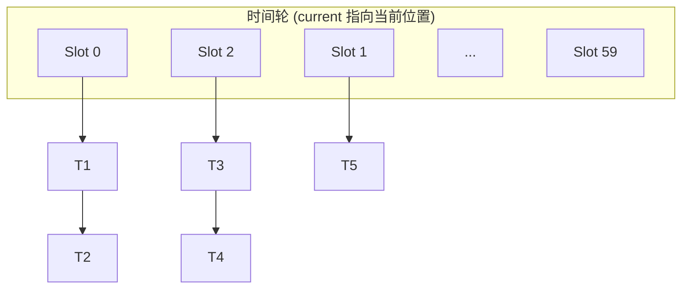

> 链表存储同一时刻的任务

**算法：**
1. **添加任务：** `slot = (current + delay) % wheel_size`
2. **tick 推进：** `current = (current + 1) % wheel_size`
3. **触发任务：** 遍历当前 slot 的任务链表

**复杂度：** 插入 O(1)，删除 O(1)，tick O(任务数)

**局限性**: 简单时间轮的时间跨度 = tick × 轮大小。如果 tick=1ms，轮大小=1000，只能覆盖 1 秒的定时任务。

### 3.4 分层时间轮 (Hierarchical Timing Wheel)

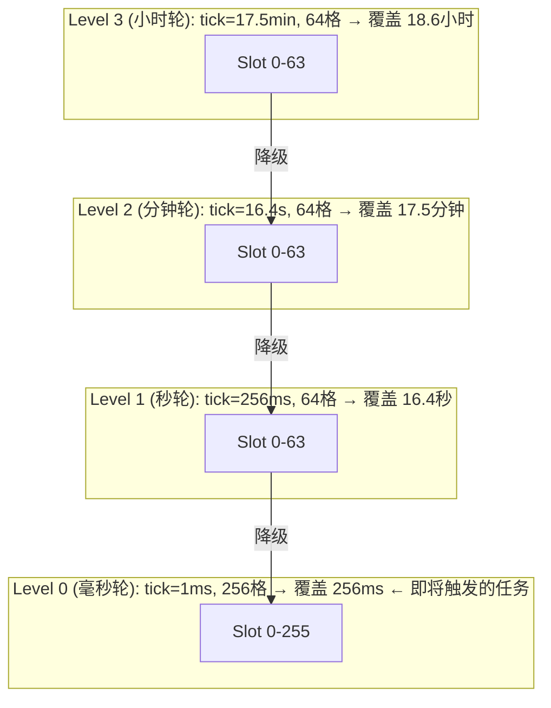

**工作原理：**
1. 新任务根据延迟时间放入合适层级
2. 高层级轮指针推进时，任务"降级"到低层级
3. Level 0 指针推进时，触发当前格的所有任务

**应用：** Kafka、Netty HashedWheelTimer

### 3.5 数据结构选型决策

| 场景 | 推荐数据结构 | 理由 |
| :--- | :--- | :--- |
| 任务数 < 1000 | **最小堆** | 实现简单，性能足够 |
| 任务数 > 10000，延迟分布均匀 | **简单时间轮** | O(1) 操作，内存紧凑 |
| 任务数 > 10000，延迟跨度大 | **分层时间轮** | 覆盖大时间范围 |
| 需要精确取消任务 | **最小堆 + HashMap** | O(1) 查找 + O(log n) 删除 |
| 需要范围查询 | **红黑树/跳表** | 高效范围操作 |

---

## 四、单机定时器设计

### 4.1 架构设计

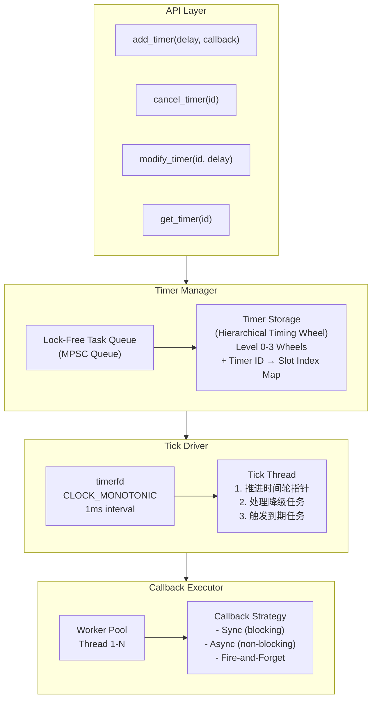

### 4.2 核心组件设计

#### 4.2.1 定时器任务结构

```c
// 定时器任务结构 (伪代码)
struct Timer {
    uint64_t    timer_id;       // 全局唯一 ID
    uint64_t    expire_time;    // 绝对过期时间 (纳秒)
    uint64_t    interval;       // 周期间隔 (0 表示一次性)
    void*       callback;       // 回调函数指针
    void*       user_data;      // 用户数据
    uint8_t     state;          // PENDING | RUNNING | CANCELLED
    ListNode    wheel_node;     // 时间轮链表节点
};
```

#### 4.2.2 Tick 驱动设计

**关键设计决策**：

| 决策点 | 选项 | 推荐 | 理由 |
| :--- | :--- | :--- | :--- |
| **Tick 线程模型** | 专用线程 / 复用事件循环 | 专用线程 | 隔离抖动影响 |
| **时钟源** | CLOCK_REALTIME / CLOCK_MONOTONIC | MONOTONIC | 避免时间回拨 |
| **Tick 精度** | 1ms / 10ms / 100ms | 根据业务 | 精度越高 CPU 越高 |
| **过期处理** | 立即执行 / 提交线程池 | 线程池 | 避免阻塞 tick |

### 4.3 线程安全设计

**方案 1: 全局锁 (简单但性能差)**

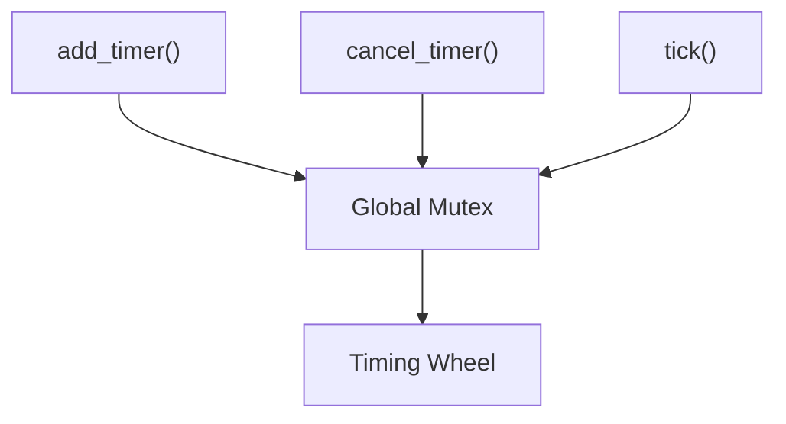

**方案 2: MPSC 队列 + 单线程处理 (推荐)**

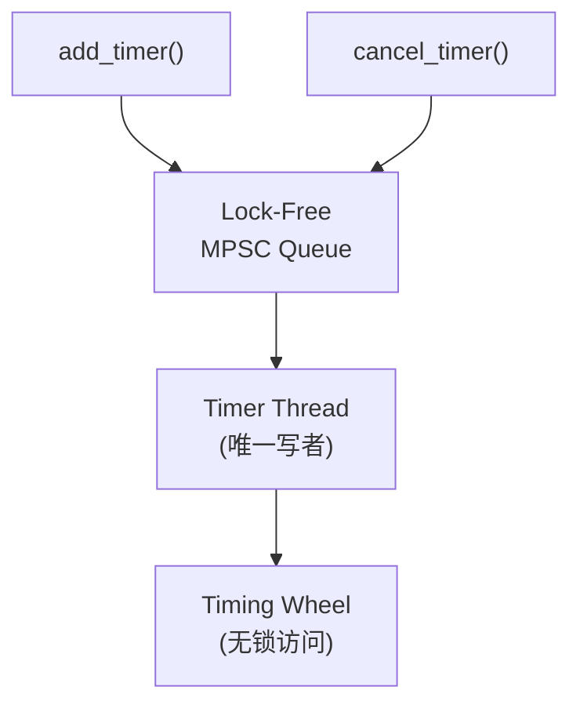

**方案 3: 分片时间轮 (大规模)**

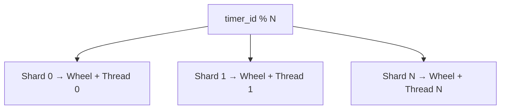

**最佳实践**: 采用 MPSC 队列 + 单 Timer 线程，配合 Work-Stealing 线程池执行回调。

### 4.4 回调执行策略

| 策略 | 描述 | 优点 | 缺点 | 适用场景 |
| :--- | :--- | :--- | :--- | :--- |
| **同步执行** | Timer 线程直接执行 | 延迟最低 | 阻塞后续 tick | 快速回调 |
| **异步提交** | 提交到线程池 | 不阻塞 tick | 增加调度延迟 | 慢回调 |
| **批量提交** | 批量提交到线程池 | 减少调度开销 | 可能增加延迟 | 大量回调 |
| **优先级队列** | 按优先级调度 | 关键任务优先 | 实现复杂 | 混合负载 |

---

## 五、分布式定时器架构

### 5.1 为什么需要分布式定时器

| 单机局限 | 分布式解决方案 |
| :--- | :--- |
| 单点故障 | 多副本 + 故障转移 |
| 容量上限 | 水平分片扩展 |
| 无法持久化 | 分布式存储 |
| 时钟漂移 | 集中式时钟源 |

### 5.2 分布式定时器架构

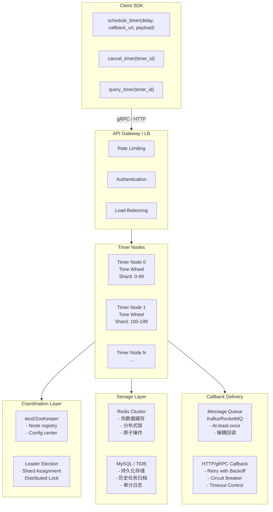

### 5.3 分片策略

| 策略 | 描述 | 优点 | 缺点 |
| :--- | :--- | :--- | :--- |
| **Timer ID Hash** | timer_id % N | 均匀分布，扩容简单 | 热点问题 |
| **时间范围分片** | 按过期时间范围 | 自然负载均衡 | 历史任务处理 |
| **租户分片** | 按 tenant_id | 隔离性好 | 大租户问题 |
| **一致性哈希** | 虚拟节点 | 扩缩容平滑 | 实现复杂 |

**最佳实践**: 采用**一致性哈希 + 虚拟节点**，配合动态权重调整。

### 5.4 任务存储设计

**MySQL/TiDB - 持久化存储**

```sql
CREATE TABLE timer_task (
    timer_id        BIGINT PRIMARY KEY,
    tenant_id       VARCHAR(64),
    expire_time     BIGINT,          -- 过期时间戳(ms)
    interval_ms     BIGINT,          -- 周期间隔
    callback_type   TINYINT,         -- HTTP/MQ/RPC
    callback_url    VARCHAR(512),
    payload         TEXT,
    retry_count     INT DEFAULT 0,
    max_retry       INT DEFAULT 3,
    status          TINYINT,         -- PENDING/DONE/...
    shard_id        INT,
    created_at      TIMESTAMP,
    updated_at      TIMESTAMP,
    INDEX idx_expire (shard_id, status, expire_time)
);
```

**Redis Cluster - 热数据 + 分布式锁**

| 属性 | 值 |
| :--- | :--- |
| Key | `timer:{shard_id}:bucket:{bucket_time}` |
| Type | Sorted Set |
| Score | expire_time |
| Member | timer_id |

> 按时间窗口分桶，减少大 Key: `bucket_time = expire_time / bucket_interval`

### 5.5 Exactly-Once 语义保证

分布式环境下保证定时任务**不丢失、不重复**执行：

**1. 任务获取阶段 - 乐观锁 + 分布式锁**

```sql
-- 原子性获取并锁定任务
UPDATE timer_task
SET status = 'PROCESSING',
    worker_id = :worker_id,
    version = version + 1
WHERE shard_id = :shard_id
  AND status = 'PENDING'
  AND expire_time <= :now
  AND version = :expected_version
LIMIT :batch_size;
```

**2. 回调执行阶段 - 幂等性设计**

- 请求携带 timer_id 作为幂等键
- Callback 服务基于 timer_id 去重
- 返回成功后才标记任务完成

**3. 故障恢复阶段 - 超时重试**

```sql
-- 后台任务扫描超时任务
SELECT * FROM timer_task
WHERE status = 'PROCESSING'
  AND updated_at < :timeout_threshold;

-- 重置为 PENDING 状态，由其他 Worker 重新获取执行
```

---

## 六、高性能设计

### 6.1 性能优化策略

| 优化点 | 策略 | 效果 |
| :--- | :--- | :--- |
| **数据结构** | 分层时间轮替代堆 | O(1) 插入/删除 |
| **锁优化** | MPSC 无锁队列 | 减少竞争 |
| **批处理** | 批量获取/提交任务 | 减少 DB 交互 |
| **内存池** | Timer 对象复用 | 减少 GC |
| **IO 模型** | timerfd + epoll | 统一事件处理 |
| **预取** | 提前加载即将过期任务 | 减少延迟 |

### 6.2 批量处理优化

**逐条处理 (低效):**

```python
for timer in expired_timers:
    fetch_from_db(timer.id)      # N 次 DB 查询
    execute_callback(timer)      # N 次网络调用
    update_status(timer.id)      # N 次 DB 更新
```

**批量处理 (高效):**

```python
# 批量获取
timers = batch_fetch(shard_id, limit=100)

# 并发执行回调
results = parallel_execute(timers)

# 批量更新状态
batch_update_status(results)

# Pipeline Redis 操作
with redis.pipeline() as pipe:
    for timer in completed:
        pipe.zrem(key, timer.id)
    pipe.execute()
```

### 6.3 预取机制

**Timeline:**

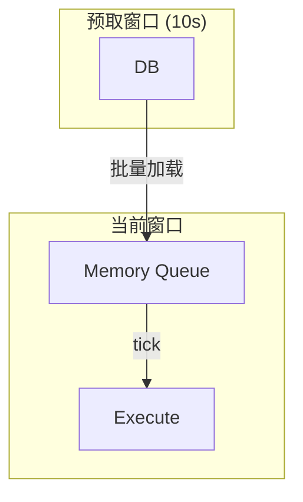

**优点：**
1. 减少实时 DB 查询延迟
2. 平滑 DB 负载
3. 容忍短暂 DB 不可用

**实现：**

```python
# 后台预取线程
def prefetch_loop():
    while True:
        window_end = now() + prefetch_window
        timers = db.query(
            expire_time BETWEEN now() AND window_end
        )
        for timer in timers:
            memory_wheel.add(timer)
        sleep(prefetch_interval)
```

### 6.4 性能指标参考

| 指标 | 单机 | 分布式集群 (10 节点) |
| :--- | :--- | :--- |
| **任务数** | 100 万 | 1000 万 |
| **创建 QPS** | 10 万/s | 100 万/s |
| **触发 QPS** | 10 万/s | 100 万/s |
| **触发延迟 P99** | < 5ms | < 20ms |
| **精度抖动** | < 1ms | < 10ms |

---

## 七、高可用设计

### 7.1 故障场景分析

| 故障类型 | 影响 | 恢复策略 |
| :--- | :--- | :--- |
| **Worker 宕机** | 该分片任务暂停 | 快速故障转移 |
| **DB 不可用** | 新任务无法持久化 | 降级到内存模式 |
| **Redis 故障** | 热数据丢失 | 从 DB 重建 |
| **网络分区** | 脑裂风险 | Fencing + 仲裁 |

### 7.2 故障转移设计

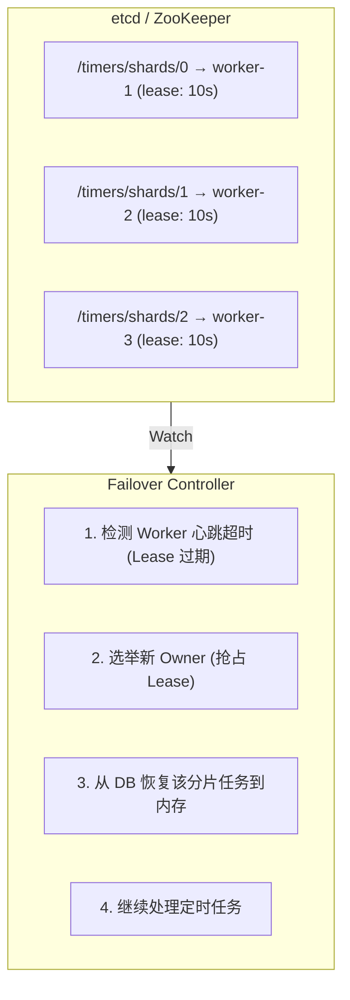

**故障转移流程:**

| 时间 | 事件 |
| :--- | :--- |
| T0 | Worker-1 宕机 |
| T0+10s | etcd 检测到 Lease 过期 |
| T0+11s | Worker-2 抢占 Shard-0 的 Lease |
| T0+12s | Worker-2 从 DB 加载 Shard-0 的任务 |
| T0+13s | Worker-2 开始处理 Shard-0 的定时任务 |

> **故障转移时间:** ~13s (可配置)

### 7.3 多活架构

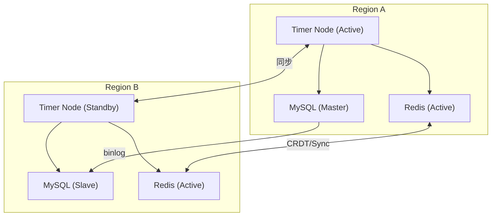

**模式选择:**
- **Active-Standby:** 简单，RTO 分钟级
- **Active-Active:** 复杂，RTO 秒级，需解决冲突

### 7.4 降级策略

| 级别 | 触发条件 | 降级措施 |
| :--- | :--- | :--- |
| **L1** | DB 响应慢 | 切换只读副本、增大缓存 |
| **L2** | DB 不可用 | 降级到纯内存模式 |
| **L3** | 回调服务过载 | 限流、延迟执行 |
| **L4** | 系统过载 | 丢弃低优先级任务 |

---

## 八、自动伸缩

### 8.1 伸缩指标

| 指标类型 | 指标 | 扩容阈值 | 缩容阈值 |
| :--- | :--- | :--- | :--- |
| **负载** | CPU 使用率 | > 70% (持续 5min) | < 30% (持续 30min) |
| **任务量** | 任务积压数 | > 10000 | < 1000 |
| **延迟** | 触发延迟 P99 | > 100ms | < 10ms |
| **内存** | 内存使用率 | > 80% | < 40% |

### 8.2 分片再均衡

**扩容场景 (3 节点 → 4 节点):**

**Before:**

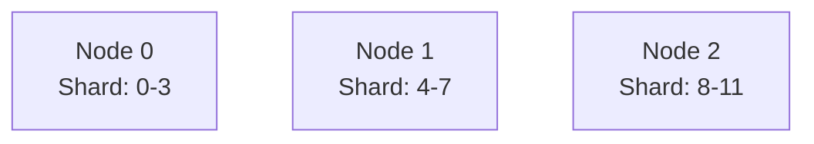

**Step 1: 新节点加入**

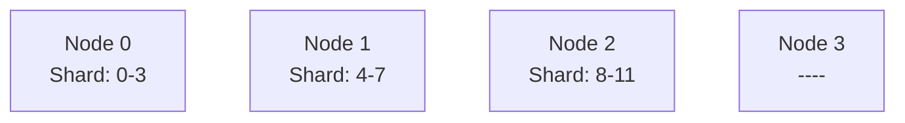

**Step 2: 计算新分配**
- 每节点目标: 12/4 = 3 个分片
- 迁移策略: 每个老节点迁出 1 个分片给新节点

**Step 3: 双写迁移 (不停服)**
1. 新任务同时写入源和目标分片
2. 后台迁移存量任务
3. 验证数据一致性
4. 切换读流量到新分片
5. 停止双写，删除源分片数据

**After:**

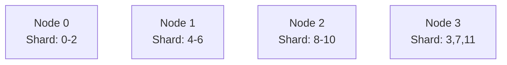

### 8.3 Kubernetes HPA 配置示例

```yaml
apiVersion: autoscaling/v2
kind: HorizontalPodAutoscaler
metadata:
  name: timer-service-hpa
spec:
  scaleTargetRef:
    apiVersion: apps/v1
    kind: Deployment
    name: timer-service
  minReplicas: 3
  maxReplicas: 20
  metrics:
  - type: Resource
    resource:
      name: cpu
      target:
        type: Utilization
        averageUtilization: 70
  - type: Pods
    pods:
      metric:
        name: timer_pending_tasks
      target:
        type: AverageValue
        averageValue: 5000
  behavior:
    scaleUp:
      stabilizationWindowSeconds: 60
      policies:
      - type: Pods
        value: 2
        periodSeconds: 60
    scaleDown:
      stabilizationWindowSeconds: 300
      policies:
      - type: Percent
        value: 10
        periodSeconds: 120
```

---

## 九、精度与抖动控制

### 9.1 抖动来源分析

| 来源 | 影响 | 缓解措施 |
| :--- | :--- | :--- |
| **OS 调度** | 线程可能被抢占 | 提高 Timer 线程优先级 |
| **GC 暂停** | 应用暂停 | 调优 GC、使用无 GC 语言 |
| **时钟漂移** | 节点间时间不一致 | NTP/PTP 同步 |
| **负载波动** | 处理延迟不稳定 | 资源隔离、限流 |
| **网络延迟** | 回调延迟 | 本地优先、预热连接 |

### 9.2 高精度定时器优化

| 优化技术 | 原理 | 适用场景 |
| :--- | :--- | :--- |
| **CPU 亲和性** | 绑定到固定 CPU | 减少缓存失效 |
| **实时优先级** | SCHED_FIFO | 减少被抢占 |
| **忙等待** | spin-wait 最后 1ms | 极高精度要求 |
| **内核旁路** | DPDK/XDP | 金融交易 |
| **硬件时钟** | PTP + 专用网卡 | 微秒级精度 |

### 9.3 时钟同步

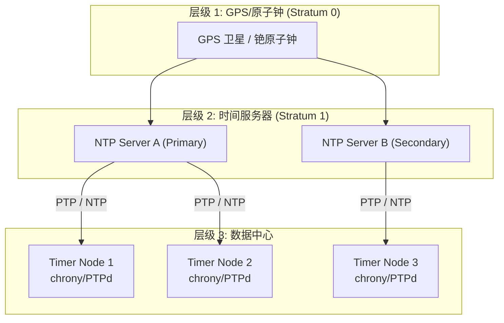

**精度对比:**
- **NTP:** 毫秒级 (1-10ms)
- **PTP (IEEE 1588):** 微秒级 (< 1μs)
- **同机房 NTP:** 亚毫秒级 (< 1ms)

---

## 十、监控与可观测性

### 10.1 关键指标

| 类别 | 指标 | 说明 | 告警阈值 |
| :--- | :--- | :--- | :--- |
| **吞吐** | timer.create.qps | 任务创建速率 | 突增 200% |
| | timer.trigger.qps | 任务触发速率 | 下降 50% |
| **延迟** | timer.trigger.latency.p99 | 触发延迟 | > 100ms |
| | timer.callback.latency.p99 | 回调延迟 | > 500ms |
| **积压** | timer.pending.count | 待处理任务数 | > 100000 |
| | timer.overdue.count | 过期未处理数 | > 1000 |
| **错误** | timer.callback.error.rate | 回调失败率 | > 1% |
| | timer.timeout.count | 超时任务数 | > 100/min |
| **资源** | timer.memory.usage | 内存使用 | > 80% |
| | timer.wheel.bucket.max | 最大桶大小 | > 10000 |

### 10.2 分布式追踪

**Trace ID:** `abc-123-def-456`

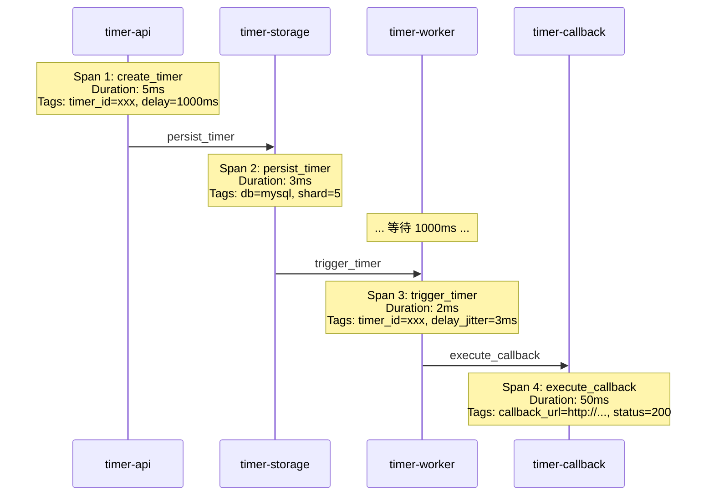

---

## 十一、业界实现参考

### 11.1 开源实现对比

| 项目 | 语言 | 特点 | 适用场景 |
| :--- | :--- | :--- | :--- |
| **Netty HashedWheelTimer** | Java | 分层时间轮，高性能 | 单机网络框架 |
| **Kafka TimingWheel** | Scala | 分层时间轮，延迟队列 | 消息延迟投递 |
| **Go runtime timer** | Go | 四叉堆，每个 P 独立 | Go 程序内置 |
| **libevent** | C | 最小堆 + epoll | C 网络编程 |
| **tokio** | Rust | 分层时间轮 | Rust 异步运行时 |
| **XXL-JOB** | Java | 分布式任务调度 | 企业任务调度 |
| **Quartz** | Java | 经典调度框架 | 传统企业应用 |

### 11.2 云厂商服务

| 服务 | 提供商 | 特点 |
| :--- | :--- | :--- |
| **AWS EventBridge Scheduler** | AWS | Serverless，按需付费 |
| **Google Cloud Scheduler** | GCP | Cron 调度，与 Pub/Sub 集成 |
| **Azure Durable Functions Timer** | Azure | 持久化工作流 |
| **阿里云 SchedulerX** | 阿里云 | 分布式调度，可视化 |
| **腾讯云 SCF 定时触发** | 腾讯云 | Serverless 定时触发 |

### 11.3 设计模式参考

| 模式 | 来源 | 核心思想 |
| :--- | :--- | :--- |
| **Timing Wheel** | BSD Unix | 时间轮分桶，O(1) 操作 |
| **Hierarchical Timing Wheel** | Linux/Kafka | 多级时间轮，大时间跨度 |
| **Delay Queue** | RabbitMQ/RocketMQ | 基于消息队列的延迟 |
| **Two-Phase Commit** | 分布式数据库 | 强一致性保证 |
| **Saga Pattern** | 微服务 | 最终一致性回滚 |

---

## 十二、技术选型总结

### 12.1 单机定时器

| 维度 | 推荐选型 | 理由 |
| :--- | :--- | :--- |
| **OS 接口** | timerfd + epoll | 统一事件模型，高精度 |
| **数据结构** | 分层时间轮 | O(1) 操作，覆盖大时间范围 |
| **线程模型** | 单 Timer 线程 + Worker Pool | 隔离抖动，并发执行 |
| **编程语言** | C/C++/Rust/Go | 低延迟，无/少 GC |

### 12.2 分布式定时器

| 维度 | 推荐选型 | 理由 |
| :--- | :--- | :--- |
| **协调服务** | etcd | 高可用，Raft 一致性 |
| **持久化存储** | MySQL/TiDB + Redis | 可靠性 + 性能 |
| **消息队列** | Kafka/RocketMQ | 回调解耦，削峰填谷 |
| **分片策略** | 一致性哈希 | 平滑扩缩容 |
| **部署方式** | Kubernetes | 自动伸缩，故障自愈 |

### 12.3 关键设计决策

| 决策点 | 权衡因素 | 推荐 |
| :--- | :--- | :--- |
| **精度 vs 资源** | 精度越高 CPU 越高 | 根据业务选择，通常 1ms~10ms |
| **一致性 vs 可用性** | CP vs AP | 定时任务通常选 AP + 幂等 |
| **推 vs 拉** | 回调推送 vs 业务拉取 | 推送 (低延迟) + 拉取 (补偿) |
| **内存 vs 持久化** | 性能 vs 可靠性 | 热数据内存 + 冷数据持久化 |

### 12.4 架构演进路径

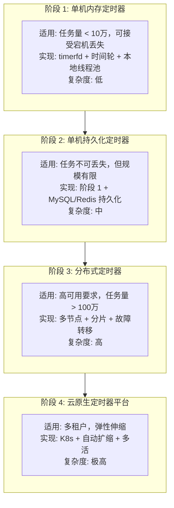

---

## 面试回答要点

回答"如何设计一个每秒触发的定时器"时，可以从以下层次展开：

1. **明确需求**: 单机/分布式？精度要求？任务规模？可靠性要求？

2. **操作系统层**: timerfd + epoll 是 Linux 下的最佳实践

3. **数据结构**: 小规模用最小堆，大规模用时间轮

4. **执行策略**: Timer 线程负责触发，Worker Pool 执行回调

5. **分布式扩展**: 分片 + 持久化 + 故障转移

6. **高可用**: Exactly-Once 语义、幂等设计、降级策略

7. **可观测性**: 延迟指标、积压监控、分布式追踪

根据面试深度，可以在任意层次深入讨论具体实现细节。

---

## 附录：关键核心代码

> 以下为精简的核心代码片段，展示关键设计思路，省略错误处理和边界情况。

### A.1 Linux timerfd 使用 (C)

```c
// 创建高精度定时器 fd
int tfd = timerfd_create(CLOCK_MONOTONIC, TFD_NONBLOCK);

// 设置 1 秒周期
struct itimerspec ts = {
    .it_interval = {.tv_sec = 1, .tv_nsec = 0},  // 周期
    .it_value    = {.tv_sec = 1, .tv_nsec = 0}   // 首次触发
};
timerfd_settime(tfd, 0, &ts, NULL);

// 加入 epoll 统一事件循环
epoll_ctl(epfd, EPOLL_CTL_ADD, tfd, &ev);

// 事件循环
while (1) {
    int n = epoll_wait(epfd, events, MAX_EVENTS, -1);
    for (int i = 0; i < n; i++) {
        if (events[i].data.fd == tfd) {
            uint64_t expirations;
            read(tfd, &expirations, sizeof(expirations));
            // expirations = 过期次数，处理回调
            handle_timer_callback();
        }
    }
}
```

### A.2 简单时间轮核心逻辑 (Python 伪代码)

```python
class TimingWheel:
    def __init__(self, tick_ms=1, wheel_size=1024):
        self.tick_ms = tick_ms
        self.wheel_size = wheel_size
        self.current_tick = 0
        self.slots = [[] for _ in range(wheel_size)]  # 每个槽是任务链表
    
    def add_timer(self, delay_ms, callback):
        ticks = delay_ms // self.tick_ms
        slot_idx = (self.current_tick + ticks) % self.wheel_size
        timer = Timer(expire_tick=self.current_tick + ticks, callback=callback)
        self.slots[slot_idx].append(timer)
        return timer
    
    def tick(self):
        """每 tick_ms 调用一次"""
        self.current_tick += 1
        slot_idx = self.current_tick % self.wheel_size
        expired = self.slots[slot_idx]
        self.slots[slot_idx] = []
        
        for timer in expired:
            if timer.expire_tick <= self.current_tick:
                timer.callback()  # 触发回调
            else:
                # 多圈任务，重新入轮
                self.slots[slot_idx].append(timer)
```

### A.3 分层时间轮降级逻辑 (Go 伪代码)

```go
type HierarchicalWheel struct {
    levels []*TimingWheel  // levels[0] 最细粒度
}

func (hw *HierarchicalWheel) AddTimer(delay time.Duration, cb func()) {
    // 根据延迟时间选择合适层级
    for i, level := range hw.levels {
        if delay < level.MaxDuration() {
            level.Add(delay, cb)
            return
        }
    }
    // 超出最大层级，放入最高层
    hw.levels[len(hw.levels)-1].Add(delay, cb)
}

func (hw *HierarchicalWheel) Tick() {
    // Level 0 tick，触发到期任务
    expired := hw.levels[0].Tick()
    for _, timer := range expired {
        go timer.Callback()  // 异步执行回调
    }
    
    // 检查是否需要从高层级降级
    for i := 1; i < len(hw.levels); i++ {
        if hw.levels[i].NeedCascade() {
            demoted := hw.levels[i].Cascade()
            for _, timer := range demoted {
                hw.levels[i-1].Add(timer.Remaining(), timer.Callback)
            }
        }
    }
}
```

### A.4 分布式任务获取 - 乐观锁 (SQL)

```sql
-- 原子性获取并锁定一批待执行任务
UPDATE timer_task
SET 
    status = 'PROCESSING',
    worker_id = :worker_id,
    version = version + 1,
    updated_at = NOW()
WHERE 
    shard_id = :shard_id
    AND status = 'PENDING'
    AND expire_time <= UNIX_TIMESTAMP() * 1000
    AND version = :expected_version
ORDER BY expire_time
LIMIT :batch_size;

-- 执行成功后标记完成
UPDATE timer_task
SET status = 'COMPLETED', updated_at = NOW()
WHERE timer_id IN (:completed_ids) AND status = 'PROCESSING';

-- 后台扫描超时任务，重置状态
UPDATE timer_task
SET status = 'PENDING', worker_id = NULL, retry_count = retry_count + 1
WHERE 
    status = 'PROCESSING' 
    AND updated_at < DATE_SUB(NOW(), INTERVAL 30 SECOND)
    AND retry_count < max_retry;
```

### A.5 Redis 延迟队列 (Lua 原子操作)

```lua
-- KEYS[1]: sorted set key (按过期时间排序)
-- ARGV[1]: 当前时间戳
-- ARGV[2]: 批量获取数量

local expired = redis.call('ZRANGEBYSCORE', KEYS[1], '-inf', ARGV[1], 'LIMIT', 0, ARGV[2])

if #expired > 0 then
    -- 原子移除已获取的任务
    redis.call('ZREM', KEYS[1], unpack(expired))
end

return expired
```

---

## 附录：常见面试追问

### Q1: 为什么选择时间轮而不是最小堆？

| 对比维度 | 最小堆 | 时间轮 |
| :--- | :--- | :--- |
| 插入复杂度 | O(log n) | O(1) |
| 删除复杂度 | O(log n) | O(1) |
| 查找最近 | O(1) | O(1) |
| 内存局部性 | 差 (堆调整) | 好 (数组) |
| 适用规模 | < 10K 任务 | > 100K 任务 |

**结论**: 任务数超过 10K 时，时间轮的 O(1) 操作优势明显。

### Q2: 如何保证定时器的精度？

1. **时钟源选择**: 使用 `CLOCK_MONOTONIC`，避免系统时间回拨影响
2. **减少调度延迟**: Timer 线程设置高优先级 (`SCHED_FIFO`)
3. **CPU 绑定**: 使用 `sched_setaffinity` 绑定到固定 CPU，避免上下文切换
4. **减少 GC**: 使用对象池复用 Timer 对象，或选择无 GC 语言
5. **批处理权衡**: tick 粒度与 CPU 消耗的平衡

### Q3: 定时任务触发时回调阻塞怎么办？

**绝不能在 Timer 线程执行阻塞回调**，否则影响其他任务精度。

解决方案：
1. **异步提交**: 将回调提交到独立线程池
2. **超时控制**: 回调设置超时时间
3. **熔断降级**: 回调失败率高时熔断
4. **消息队列**: 通过 MQ 解耦，回调服务独立消费

### Q4: 分布式场景如何避免重复触发？

1. **分片独占**: 每个分片只有一个 Worker 处理
2. **乐观锁**: 获取任务时检查 version
3. **分布式锁**: 执行前加 Redis/etcd 锁
4. **幂等设计**: 回调端基于 timer_id 去重
5. **状态机**: PENDING → PROCESSING → COMPLETED 严格流转

### Q5: 节点宕机后任务如何恢复？

```
正常流程:
1. Worker 持有分片 Lease (如 10s TTL)
2. Worker 定期续约 Lease

故障恢复:
1. Worker 宕机，停止续约
2. Lease 过期 (10s 后)
3. 其他 Worker 检测到 Lease 过期
4. 新 Worker 抢占 Lease，成为新 Owner
5. 从 DB 加载该分片的 PENDING 任务到内存
6. 继续处理定时任务

恢复时间 = Lease TTL + 加载时间 ≈ 10~15s
```

### Q6: 如何支撑百万级定时任务？

| 优化手段 | 效果 |
| :--- | :--- |
| 分层时间轮 | 单机百万任务，O(1) 操作 |
| 水平分片 | N 个节点 = N 倍容量 |
| 批量操作 | 减少 DB/Redis 交互次数 |
| 预取机制 | 减少实时 DB 查询延迟 |
| 冷热分离 | 热数据内存，冷数据 DB |

### Q7: 时间轮的 tick 间隔如何选择？

| tick 间隔 | CPU 消耗 | 精度 | 适用场景 |
| :--- | :--- | :--- | :--- |
| 1ms | 高 | 毫秒级 | 高精度需求 (游戏、交易) |
| 10ms | 中 | 10ms 级 | 通用场景 |
| 100ms | 低 | 100ms 级 | 粗粒度调度 |
| 1s | 极低 | 秒级 | 延迟任务、订单超时 |

**建议**: 根据业务精度需求选择，通常 10ms 是性价比最高的选择。

### Q8: 如何监控定时器系统的健康状态？

**关键指标 (Golden Signals)**:

| 类型 | 指标 | 告警条件 |
| :--- | :--- | :--- |
| **延迟** | timer.trigger.latency.p99 | > 100ms |
| **吞吐** | timer.trigger.qps | 下降 > 50% |
| **错误** | timer.callback.error_rate | > 1% |
| **饱和** | timer.pending.count | > 100K |

**健康检查**:
- 探针定时器: 每秒触发，检查实际触发时间与预期偏差
- 积压监控: 待处理任务数持续增长告警
- 回调成功率: 下降时自动扩容或熔断

---

## 附录：扩展阅读

| 主题 | 资源 |
| :--- | :--- |
| **Timing Wheel 论文** | "Hashed and Hierarchical Timing Wheels" - Varghese & Lauck, 1987 |
| **Linux hrtimer** | kernel/time/hrtimer.c 源码 |
| **Kafka TimingWheel** | kafka/server-common/src/main/java/org/apache/kafka/server/util/timer/ |
| **Netty HashedWheelTimer** | io.netty.util.HashedWheelTimer 源码 |
| **Go runtime timer** | runtime/time.go 源码 |
| **分布式调度** | XXL-JOB、Quartz、Elastic-Job 文档 |

---

## 相关文章

- [上一篇：如何设计一个定时任务系统](/articles/interview/interview-16-设计定时任务系统/)
- [下一篇：如何设计一个配置中心](/articles/interview/interview-18-设计配置中心/)
