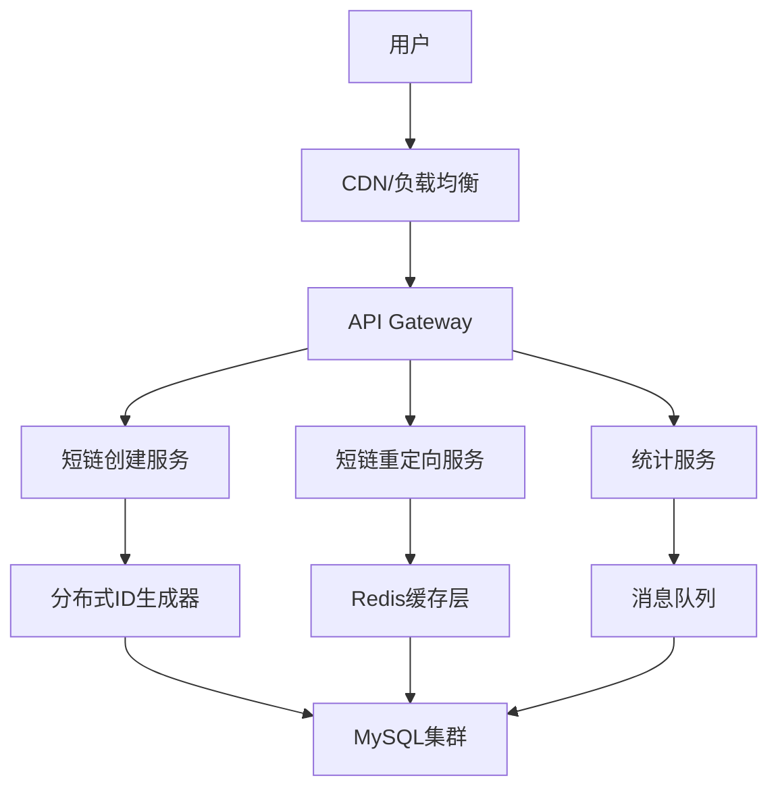

+++
title = "19.如何设计一个短链接服务"
description = "短链接服务的系统设计：ID生成、编码策略、重定向优化与高可用架构"
date = 2025-01-16
[taxonomies]
tags = ["interview", "system-design", "architecture", "url-shortener"]
+++

# 如何设计一个短链接服务

## 一、需求分析

### 1.1 功能需求

- **核心功能**：输入长URL，返回短URL；访问短URL时重定向到原始长URL
- **可选功能**：自定义短码、过期时间、访问统计、用户管理

### 1.2 非功能需求

- **高可用**：服务不能中断，短链接必须持久有效
- **低延迟**：重定向响应时间 < 100ms
- **高并发**：支持每秒数万次读取，数千次写入
- **短码尽量短**：6-8位字符

### 1.3 规模估算

假设日活1亿用户，每天创建1000万短链接，读写比100:1：

```
写入QPS：1000万 / 86400 ≈ 116 QPS（峰值约500 QPS）
读取QPS：116 × 100 ≈ 11600 QPS（峰值约5万 QPS）
存储5年：1000万 × 365 × 5 = 182.5亿条记录
单条记录约500字节，总存储约10TB
```

---

## 二、短码生成策略

这是系统设计的核心问题：**如何生成唯一、短小、不可预测的短码？**

### 2.1 方案对比

| 方案 | 优点 | 缺点 | 适用场景 |
|------|------|------|----------|
| 自增ID+Base62 | 简单、紧凑 | 可预测、需要中心化ID生成 | 内部系统 |
| 哈希截断 | 无中心依赖 | 可能冲突、需要冲突处理 | 中小规模 |
| 预生成ID池 | 高性能、无冲突 | 实现复杂、需要维护 | 大规模高并发 |
| 雪花算法变种 | 分布式、无冲突 | 短码较长 | 分布式系统 |

### 2.2 方案一：自增ID + Base62编码

**思路**：使用全局自增ID，然后用Base62（a-z, A-Z, 0-9共62个字符）编码。

**ID生成方式**：
- 单机MySQL自增：简单但有单点问题
- 分布式ID生成器（如美团Leaf、百度UidGenerator）：推荐

**短码长度分析**：
- 6位Base62可表示 62^6 = 568亿个短码
- 7位Base62可表示 62^7 = 3.5万亿个短码

**优势**：短码最短、无冲突、实现简单

**劣势**：短码可预测（连续的ID编码后仍有规律），可通过随机偏移或加密混淆解决

### 2.3 方案二：哈希截断

**思路**：对长URL做MD5/SHA256哈希，取前6-8位Base62编码作为短码。

**冲突处理**：
1. 检测到冲突时，在原URL后追加随机字符串重新哈希
2. 或使用布隆过滤器快速判断是否存在，再查数据库确认

**优势**：无需中心化ID生成器

**劣势**：冲突概率随数据量增加，冲突处理增加延迟

### 2.4 方案三：预生成ID池

**思路**：后台服务预先生成大量唯一短码存入Redis/数据库，业务服务直接取用。

**实现要点**：
- 维护"已用池"和"可用池"
- 池快耗尽时异步补充
- 多实例可各自领取一批，减少竞争

**优势**：创建短链接无需实时生成ID，性能极高

**劣势**：系统复杂度增加，需要维护ID池的可用性

### 2.5 推荐方案

**中小规模**：自增ID + Base62，使用分布式ID生成器

**大规模**：预生成ID池，或自增ID配合缓存批量获取

---

## 三、系统架构

### 3.1 整体架构



### 3.2 核心组件

**API Gateway**：统一入口，负责限流、认证、路由

**短链创建服务**：
- 接收长URL，生成短码
- 写入数据库和缓存
- 返回短链接

**短链重定向服务**：
- 解析短码，查询原始URL
- 返回301/302重定向
- 异步记录访问日志

**缓存层**：
- 热点短链缓存
- 使用Redis，设置合理的过期时间
- 缓存命中率应 > 90%

**数据库**：
- 存储短码与长URL的映射
- 分库分表应对海量数据

---

## 四、关键设计决策

### 4.1 301 vs 302重定向

| 状态码 | 含义 | 浏览器行为 | 适用场景 |
|--------|------|-----------|----------|
| 301 | 永久重定向 | 缓存，后续直接访问目标 | 不需要统计的场景 |
| 302 | 临时重定向 | 每次都访问短链服务 | 需要统计访问数据 |

**推荐**：使用302，便于统计和控制；如果追求性能且不需统计，用301

### 4.2 数据库设计

**核心表结构**：

```
短链表：
- id: 主键
- short_code: 短码（唯一索引）
- original_url: 原始URL
- user_id: 创建用户
- created_at: 创建时间
- expired_at: 过期时间
- click_count: 点击次数
```

**索引策略**：
- short_code 唯一索引（查询核心）
- original_url 索引（查重用）
- user_id + created_at 联合索引（用户查询）

### 4.3 分库分表策略

**按短码分表**：
- 根据短码前1-2位字符分表
- 例如：62个字符可分62张表，或取前两位分3844张表

**好处**：
- 查询时可直接定位到具体表
- 数据分布均匀

### 4.4 缓存策略

**读取流程**：
1. 先查Redis缓存
2. 缓存未命中则查数据库
3. 查到后回写缓存

**缓存过期**：
- 热点数据设置较长过期时间（如7天）
- 冷数据较短过期时间（如1天）
- 可使用LRU淘汰策略

**缓存穿透防护**：
- 对不存在的短码缓存空值（较短过期时间）
- 使用布隆过滤器预判断

---

## 五、高可用设计

### 5.1 服务层高可用

- 多实例部署，无状态设计
- 负载均衡器健康检查
- 熔断降级：短链服务不可用时返回错误页而非超时

### 5.2 缓存层高可用

- Redis Cluster或Sentinel模式
- 主从复制，自动故障转移
- 多级缓存：本地缓存 + Redis

### 5.3 数据库高可用

- 主从复制，读写分离
- 短码到长URL的映射一旦创建不会变更，可异步复制
- 定期备份

### 5.4 容灾设计

- 多机房部署
- 数据库跨机房同步
- DNS故障转移

---

## 六、扩展功能

### 6.1 自定义短码

- 允许用户指定短码（需检查是否已存在）
- 自定义短码与自动生成短码分表存储，避免冲突

### 6.2 过期机制

- 创建时指定过期时间
- 定时任务清理过期数据
- 或访问时判断是否过期

### 6.3 访问统计

- 异步记录访问日志（避免影响重定向性能）
- 写入消息队列，异步消费入库
- 统计维度：访问量、UV、地域、设备、Referer

### 6.4 防滥用

- 限制单用户创建频率
- 检测恶意URL（黑名单、安全扫描）
- 验证码或认证机制

---

## 七、面试要点

### 7.1 常见追问

**Q：如何保证短码不重复？**
A：使用全局唯一ID生成器（如Snowflake变种），或预生成ID池。哈希方案需要冲突检测和重试。

**Q：如何处理热点短链？**
A：多级缓存（本地+Redis），热点数据预加载，缓存不过期或长过期。

**Q：短码可以被枚举吗？**
A：自增ID方案确实可预测。可以通过ID加密混淆、加盐哈希等方式增加不可预测性。

**Q：如何保证高可用？**
A：无状态服务多实例、缓存集群、数据库主从、多机房部署。

### 7.2 设计要点总结

1. **短码生成**是核心，需要权衡唯一性、短小、性能、可预测性
2. **读多写少**的场景，缓存至关重要
3. **重定向性能**要求极高，需要精简处理链路
4. **数据量大**需要分库分表
5. **统计功能**需要异步处理，不能阻塞主流程

---

## 相关文章

- [上一篇：如何设计一个配置中心](/articles/interview/interview-18-设计配置中心/)
- [下一篇：如何设计一个下载功能](/articles/interview/interview-20-设计下载功能/)
