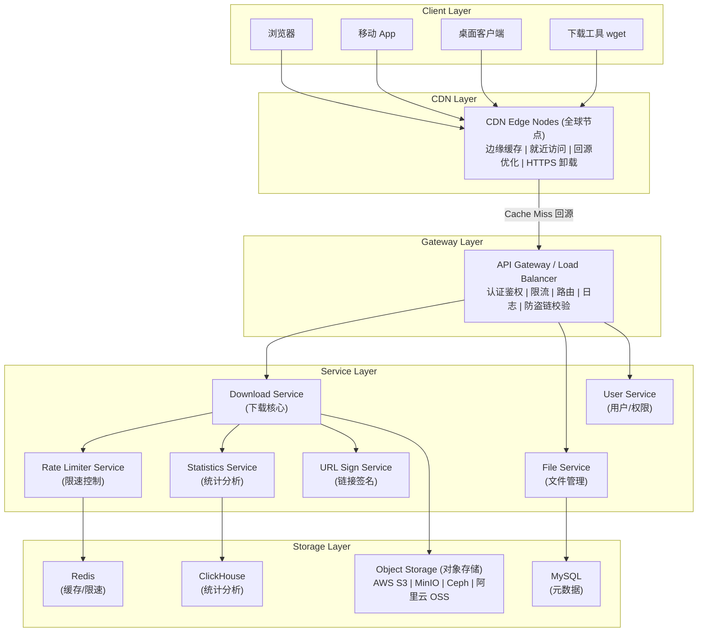
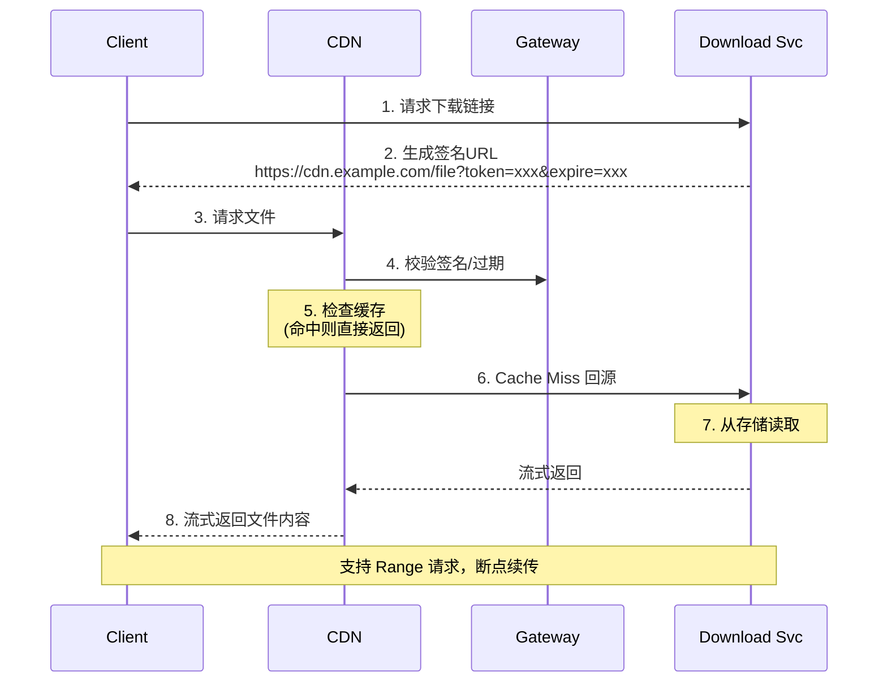
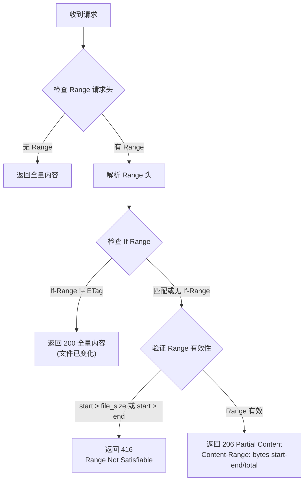
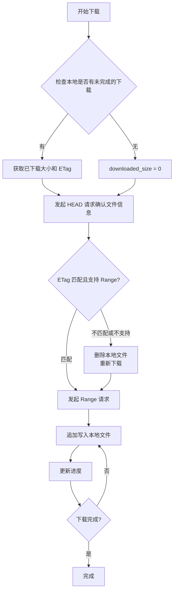
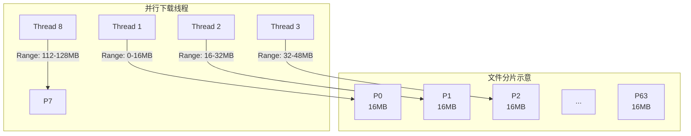
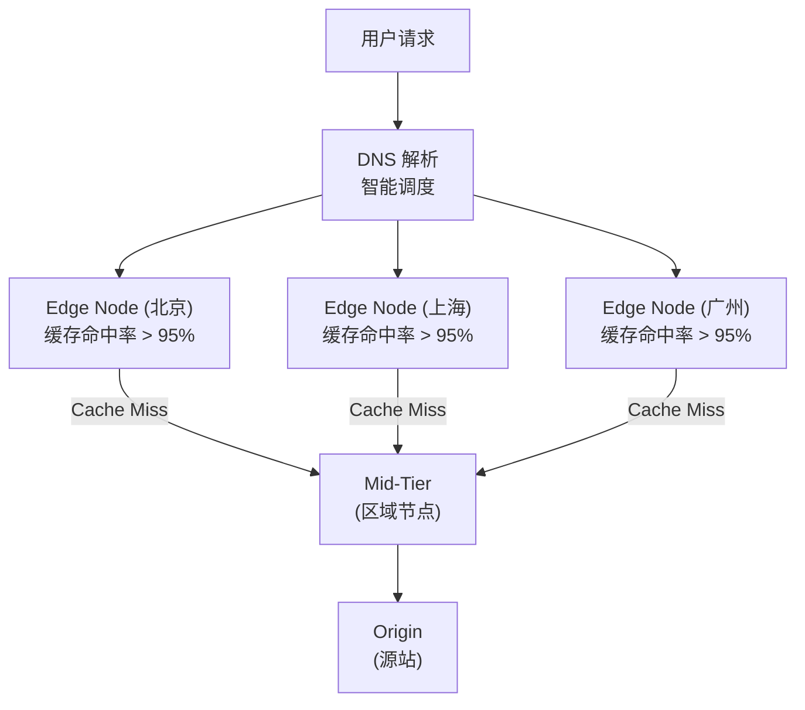
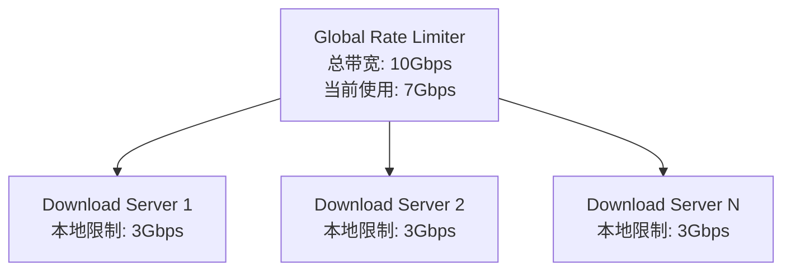
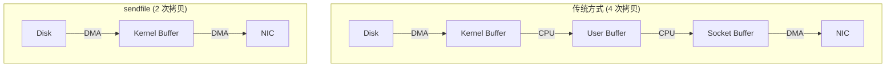
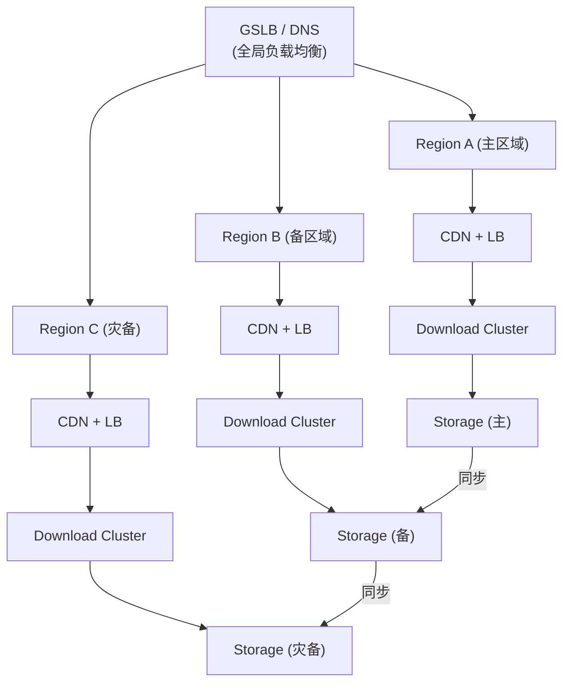
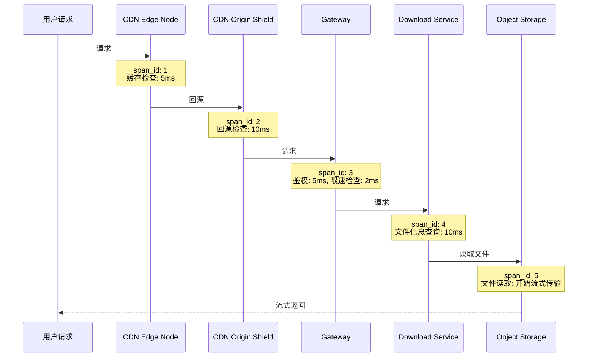

+++
title = "20.如何设计一个下载功能"
slug = "interview-如何设计一个下载功能"
+++

# 如何设计一个高性能、高可用的下载系统

> 本文从系统设计面试角度，深入剖析企业级文件下载系统的完整架构设计，涵盖大文件传输、断点续传、CDN 加速、限速控制、安全防护等核心主题。

---

## 一、需求分析与场景定义

### 1.1 下载场景分类

| 场景 | 特点 | 代表产品 |
| :--- | :--- | :--- |
| **网盘下载** | 大文件、断点续传、限速会员 | 百度网盘、Google Drive |
| **软件分发** | 版本管理、增量更新、校验 | App Store、Steam |
| **视频点播** | 流式传输、码率自适应 | Netflix、YouTube |
| **静态资源** | 小文件、高并发、CDN | 网站图片、CSS/JS |
| **API 导出** | 动态生成、异步下载 | 报表导出、数据备份 |

### 1.2 核心功能需求

| 功能 | 描述 | 优先级 |
| :--- | :--- | :--- |
| **基础下载** | HTTP/HTTPS 文件下载 | P0 |
| **断点续传** | 支持暂停、恢复下载 | P0 |
| **大文件支持** | 支持 GB/TB 级文件 | P0 |
| **多线程下载** | 客户端分片并行下载 | P1 |
| **下载限速** | 按用户/全局限速 | P1 |
| **下载统计** | 下载次数、流量统计 | P1 |
| **防盗链** | 防止资源被盗用 | P1 |
| **临时链接** | 带过期时间的下载链接 | P2 |

### 1.3 非功能性需求

| 维度 | 要求 | 量化指标 |
| :--- | :--- | :--- |
| **性能** | 高吞吐下载 | 单节点 10Gbps+ |
| **并发** | 支撑海量下载连接 | 10万+ 并发连接 |
| **可用性** | 下载服务高可用 | 99.9% |
| **延迟** | 首字节响应快 | TTFB < 100ms |
| **扩展性** | 支撑存储增长 | PB 级存储 |

### 1.4 技术挑战

**下载系统核心挑战**：

1. **大文件传输**
   - 单文件可能达 GB/TB 级别
   - 网络中断导致重传成本高
   - 内存/磁盘 IO 压力大

2. **高并发连接**
   - 大量长连接占用服务器资源
   - 慢速客户端拖慢整体性能
   - 连接数与带宽的权衡

3. **带宽成本**
   - 带宽是主要成本来源
   - 需要限速控制成本
   - CDN 流量费用优化

4. **存储与分发**
   - 热点文件与冷门文件访问差异大
   - 多地域用户就近访问
   - 存储后端性能瓶颈

---

## 二、系统架构设计

### 2.1 整体架构



### 2.2 下载请求流程



### 2.3 核心服务职责

| 服务 | 职责 | 核心能力 |
| :--- | :--- | :--- |
| **Download Service** | 下载核心逻辑 | Range 处理、流式传输、限速 |
| **File Service** | 文件元数据管理 | 文件信息、存储路径、校验和 |
| **URL Sign Service** | 下载链接签名 | 生成临时 URL、防盗链 |
| **Rate Limiter** | 限速控制 | 用户级/全局限速 |
| **Statistics Service** | 下载统计 | 下载量、流量、热度分析 |

---

## 三、核心技术：HTTP Range 与断点续传

### 3.1 HTTP Range 协议

**断点续传的核心**是 HTTP/1.1 的 Range 请求头，允许客户端请求资源的部分内容。

**HTTP Range 请求流程**：

1. **客户端探测服务器是否支持 Range**
   ```
   HEAD /file.zip HTTP/1.1
   ```

2. **服务器响应**
   ```
   HTTP/1.1 200 OK
   Accept-Ranges: bytes          ← 支持 Range
   Content-Length: 1073741824    ← 文件总大小 (1GB)
   ETag: "abc123"                ← 文件标识
   ```

3. **客户端请求部分内容**
   ```
   GET /file.zip HTTP/1.1
   Range: bytes=0-104857599      ← 请求前 100MB
   ```

4. **服务器返回部分内容**
   ```
   HTTP/1.1 206 Partial Content  ← 206 表示部分内容
   Content-Range: bytes 0-104857599/1073741824
   Content-Length: 104857600
   ```

5. **断点续传 (下载中断后)**
   ```
   GET /file.zip HTTP/1.1
   Range: bytes=104857600-       ← 从已下载位置继续
   If-Range: "abc123"            ← 确认文件未变化
   ```

### 3.2 Range 请求格式

| 格式 | 含义 | 示例 |
| :--- | :--- | :--- |
| `bytes=0-499` | 前 500 字节 | 文件开头 |
| `bytes=500-999` | 第 501-1000 字节 | 中间部分 |
| `bytes=-500` | 最后 500 字节 | 文件结尾 |
| `bytes=500-` | 从 500 到结尾 | 断点续传 |
| `bytes=0-0,-1` | 第一个和最后一个字节 | 多段请求 |

### 3.3 服务端实现要点

**服务端 Range 处理逻辑**：



**伪代码示例**：

```python
# 1. 检查请求头
if request.headers.get("Range"):
    range_header = parse_range(request.headers["Range"])
else:
    return full_content()

# 2. 验证文件一致性 (If-Range)
if request.headers.get("If-Range"):
    if If_Range != current_etag:
        return full_content_200()  # 文件已变化，返回全量

# 3. 验证 Range 有效性
if start > file_size or start > end:
    return 416 Range Not Satisfiable
    # Content-Range: bytes */file_size

# 4. 返回部分内容
return 206 Partial Content
# Content-Range: bytes start-end/total
# Content-Length: end - start + 1
# Body: file_content[start:end+1]
```

### 3.4 关键响应头

| 响应头 | 说明 | 示例 |
| :--- | :--- | :--- |
| `Accept-Ranges` | 声明支持的范围单位 | `bytes` |
| `Content-Range` | 返回的范围和总大小 | `bytes 0-999/5000` |
| `Content-Length` | 本次返回的内容长度 | `1000` |
| `ETag` | 文件唯一标识 | `"abc123"` |
| `Last-Modified` | 文件最后修改时间 | `Wed, 01 Jan 2025 00:00:00 GMT` |

### 3.5 断点续传的客户端实现

**客户端断点续传流程**：



**伪代码实现**：

```python
# 1. 检查本地是否有未完成的下载
local_file = check_partial_download(url)
if local_file:
    downloaded_size = local_file.size
    etag = local_file.metadata.etag
else:
    downloaded_size = 0

# 2. 发起 HEAD 请求确认文件信息
response = HEAD(url)
total_size = response.headers["Content-Length"]
server_etag = response.headers["ETag"]
supports_range = response.headers["Accept-Ranges"] == "bytes"

# 3. 判断是否需要重新下载
if etag != server_etag or not supports_range:
    # 文件变化或不支持续传，重新下载
    downloaded_size = 0
    delete_local_file()

# 4. 发起 Range 请求
headers = {
    "Range": f"bytes={downloaded_size}-",
    "If-Range": etag
}
response = GET(url, headers=headers, stream=True)

# 5. 追加写入本地文件
with open(local_file, "ab") as f:  # append binary mode
    for chunk in response.iter_content(chunk_size=8192):
        f.write(chunk)
        update_progress()
```

---

## 四、大文件分片下载

### 4.1 分片下载原理

**分片并行下载架构**：

**参数示例**：
- 文件: 1GB (1073741824 bytes)
- 分片大小: 16MB
- 分片数: 64 个
- 并发数: 8 个



**并行下载线程**：
- Thread 1 → Range: bytes=0-16777215 → [P0]
- Thread 2 → Range: bytes=16777216-33554431 → [P1]
- Thread 3 → Range: bytes=33554432-50331647 → [P2]
- ...
- Thread 8 → Range: bytes=117440512-134217727 → [P7]
- 完成后继续下载 P8, P9, ...

**分片合并方式**：
- **方式 1 (推荐)**: 预分配文件，各线程直接写入对应位置 - `seek(offset) + write(chunk)`
- **方式 2**: 分片文件 → 最后合并 - `file.part0, file.part1, ... → file`

### 4.2 分片策略

| 文件大小 | 分片大小 | 并发数 | 说明 |
| :--- | :--- | :--- | :--- |
| < 10MB | 不分片 | 1 | 小文件无需分片 |
| 10MB - 100MB | 2MB | 4 | 中等文件 |
| 100MB - 1GB | 8MB | 8 | 大文件 |
| > 1GB | 16MB | 8-16 | 超大文件 |

### 4.3 分片下载状态管理

**分片状态管理**：

**下载任务元数据 (持久化)**：

```json
{
  "url": "https://example.com/file.zip",
  "file_name": "file.zip",
  "total_size": 1073741824,
  "etag": "abc123",
  "chunk_size": 16777216,
  "chunk_count": 64,
  "created_at": "2025-01-07T10:00:00Z",
  "chunks": [
    {"index": 0, "start": 0, "end": 16777215, "status": "completed"},
    {"index": 1, "start": 16777216, "end": 33554431, "status": "completed"},
    {"index": 2, "start": 33554432, "end": 50331647, "status": "downloading"},
    {"index": 3, "start": 50331648, "end": 67108863, "status": "pending"}
  ]
}
```

**状态枚举**：
- **pending**: 待下载
- **downloading**: 下载中
- **completed**: 已完成
- **failed**: 失败 (可重试)

### 4.4 服务端分片存储

对于超大文件，服务端也可以采用分片存储：

**服务端分片存储架构**：

**逻辑文件**: video.mp4 (10GB)

**元数据 (MySQL/MongoDB)**：

```json
{
  "file_id": "f001",
  "file_name": "video.mp4",
  "total_size": 10737418240,
  "chunk_size": 67108864,
  "chunk_count": 160,
  "checksum": "sha256:...",
  "chunks": [
    {"index": 0, "storage_key": "chunks/f001/0", "checksum": "..."},
    {"index": 1, "storage_key": "chunks/f001/1", "checksum": "..."}
  ]
}
```

**对象存储**：

```
s3://bucket/chunks/f001/0    (64MB)
s3://bucket/chunks/f001/1    (64MB)
s3://bucket/chunks/f001/2    (64MB)
...
s3://bucket/chunks/f001/159  (64MB)
```

**优势**：
- 并行上传/下载
- 分块校验，损坏可单独重传
- 存储后端压力分散
- 支持断点续传

---

## 五、CDN 加速与边缘分发

### 5.1 CDN 架构



### 5.2 CDN 缓存策略

| 策略 | 配置方式 | 适用场景 |
| :--- | :--- | :--- |
| **按文件类型** | `.zip/.exe` 缓存 30 天 | 软件包 |
| **按路径** | `/static/*` 缓存 1 年 | 静态资源 |
| **按 Header** | `Cache-Control: max-age=86400` | 动态控制 |
| **版本化** | `/v1.2.3/file.zip` 永久缓存 | 版本化资源 |

### 5.3 回源优化

**回源优化策略**：

1. **分片回源 (Range 回源)**
   - CDN 节点按分片回源，不回源整个文件
   - 用户请求 Range: 0-1MB，CDN 只回源这 1MB
   - 减少回源带宽，加快首字节响应

2. **预热 (Prefetch)**
   - 新文件发布前，主动推送到 CDN 节点
   - 避免首次访问的回源延迟
   - 适用于热门资源、新版本发布

3. **回源合并 (Origin Shield)**
   - 多个边缘节点回源请求合并为一个
   - 减少源站压力
   - 适用于热点文件首次缓存

4. **主备源站**
   - 配置多个源站，主站故障自动切换
   - 源站健康检查
   - 跨地域容灾

### 5.4 CDN 与对象存储集成

**CDN + 对象存储最佳实践**：

| 方案 | 架构 | 优点 | 缺点/注意事项 |
| :--- | :--- | :--- | :--- |
| **方案一：CDN 回源对象存储 (推荐)** | 用户 → CDN → S3/OSS | 架构简单，无需维护下载服务器 | CDN 源站设置为 S3 endpoint |
| **方案二：预签名 URL + CDN** | 业务服务生成 PreSigned URL → CDN → S3 | 安全性高，支持临时授权 | CDN 缓存 Key 需包含签名参数 |
| **方案三：私有协议回源** | CDN → 私有协议 → 源站服务 → 对象存储 | 可添加业务逻辑 (鉴权、限速、统计) | 需要维护源站服务 |

### 5.5 CDN 选型对比

| CDN 服务商 | 特点 | 适用场景 |
| :--- | :--- | :--- |
| **CloudFlare** | 全球节点、免费套餐、DDoS 防护 | 全球业务 |
| **AWS CloudFront** | 与 S3 深度集成、Lambda@Edge | AWS 生态 |
| **阿里云 CDN** | 国内节点多、成本低 | 国内业务 |
| **Akamai** | 企业级、性能最优 | 大型企业 |
| **Fastly** | 边缘计算、实时清缓存 | 动态内容 |

---

## 六、限速与流控设计

### 6.1 限速场景

| 场景 | 目的 | 实现层级 |
| :--- | :--- | :--- |
| **用户级限速** | VIP 差异化、公平使用 | 应用层 |
| **文件级限速** | 热点文件保护 | 应用层 |
| **全局限速** | 保护带宽成本 | 网关/CDN |
| **IP 级限速** | 防止滥用 | 网关 |

### 6.2 限速算法

**限速算法对比**：

| 算法 | 原理 | 特点 | 参数示例 |
| :--- | :--- | :--- | :--- |
| **令牌桶 (Token Bucket)** - 推荐 | 以固定速率向桶中添加令牌，请求消耗令牌 | 允许一定程度的突发流量 | rate: 1MB/s, burst: 10MB |
| **漏桶 (Leaky Bucket)** | 以固定速率流出 | 流量绝对平滑，不允许突发 | rate: 1MB/s |
| **滑动窗口 (Sliding Window)** | 统计时间窗口内的流量 | 超过阈值则拒绝，适用于请求数限制 | 1分钟内最多100次请求 |

### 6.3 服务端限速实现

**服务端流式限速**：

核心思想: 控制每秒发送的数据量

**实现伪代码**：

```python
def stream_with_rate_limit(file, rate_limit_bytes_per_sec):
    chunk_size = 64 * 1024  # 64KB per chunk
    interval = chunk_size / rate_limit_bytes_per_sec

    while chunk := file.read(chunk_size):
        start_time = time.now()
        yield chunk
        elapsed = time.now() - start_time
        if elapsed < interval:
            sleep(interval - elapsed)  # 限速等待
```

**Nginx 配置示例**：

```nginx
location /download/ {
    limit_rate 1m;          # 限速 1MB/s
    limit_rate_after 10m;   # 前 10MB 不限速
}
```

### 6.4 分级限速策略

**分级限速策略**：

| 用户等级 | 限速策略 | 带宽配额 |
| :--- | :--- | :--- |
| 免费用户 | 100KB/s | 1GB/天 |
| 普通会员 | 1MB/s | 10GB/天 |
| 高级会员 | 5MB/s | 100GB/天 |
| VIP 会员 | 不限速 | 不限 |

**实现要点**：
1. 用户请求时查询用户等级和剩余配额
2. 根据等级设置 rate_limit
3. 下载完成后扣减配额
4. 配额耗尽返回 429 Too Many Requests

**Redis 存储**：

```
user:quota:{user_id}:daily = 剩余配额 (bytes)
user:bandwidth:{user_id} = 当前带宽使用 (令牌桶状态)
```

### 6.5 全局流控

**全局流控架构**：

目标: 保护出口带宽，防止单服务占满带宽



**实现**：
- 分布式令牌桶 (Redis)
- 各服务器定期同步全局状态
- 超限时降低本地限速

---

## 七、高性能设计

### 7.1 性能优化全景

**性能优化层次**：

| 优化层 | 优化策略 |
| :--- | :--- |
| **网络层优化** | CDN 就近访问 / TCP 优化 (BBR 拥塞控制) / HTTP/2 多路复用 / QUIC/HTTP3 |
| **应用层优化** | 异步 IO (epoll/io_uring) / 零拷贝 (sendfile) / 连接复用 / 流式传输 |
| **存储层优化** | SSD 存储热点数据 / 本地缓存层 / 预读取 (Read-ahead) / 对象存储分片 |

### 7.2 零拷贝技术

**零拷贝原理**：



**sendfile 优势**：数据不经过用户空间，大幅减少 CPU 开销

**应用场景**：
- Nginx: `sendfile on;`
- Java: `FileChannel.transferTo()`
- Go: `io.Copy()` with `*os.File`

**性能提升**: 吞吐量提升 2-3 倍，CPU 使用率降低 50%

### 7.3 异步 IO 模型

| 模型 | 特点 | 适用场景 |
| :--- | :--- | :--- |
| **同步阻塞** | 简单，但并发低 | 小规模 |
| **多线程** | 每连接一线程，资源消耗大 | 中等规模 |
| **epoll** | 事件驱动，高并发 | Linux 高并发 |
| **io_uring** | 异步 IO，性能最优 | 最新 Linux 内核 |
| **IOCP** | Windows 异步 IO | Windows 服务器 |

### 7.4 连接管理

**连接管理优化**：

挑战: 大量下载连接占用资源

| 优化策略 | 说明 | 配置示例 |
| :--- | :--- | :--- |
| **Keep-Alive 复用** | 同一用户多次下载复用连接，减少 TCP 握手开销 | `keepalive_timeout 65;` |
| **连接数限制** | 单 IP 最大连接数限制，防止单用户耗尽资源 | `limit_conn_zone / limit_conn` |
| **慢连接处理** | 设置发送超时，检测并断开慢速连接 | `send_timeout 60s;` |
| **连接池 (回源)** | 下载服务到存储后端的连接池，避免频繁建立连接 | 设置合理的池大小和超时 |

### 7.5 热点文件处理

**热点文件优化**：

问题: 少数热门文件占据大部分下载流量

| 策略 | 说明 |
| :--- | :--- |
| **本地 SSD 缓存** | 热点文件 → 本地 SSD → 用户，冷门文件 → 对象存储。缓存策略: LRU + 访问频次 |
| **内存缓存小文件** | < 1MB 的热点文件缓存到内存，直接从内存返回，无磁盘 IO |
| **CDN 预热** | 预测热点文件，提前推送到 CDN。例如: 新版本发布前预热 |
| **多副本分发** | 热点文件存储多个副本，负载均衡分发请求 |

### 7.6 性能指标参考

| 指标 | 目标值 | 优化手段 |
| :--- | :--- | :--- |
| **TTFB** | < 50ms | CDN 边缘缓存 |
| **单机吞吐** | 10Gbps+ | 零拷贝、异步 IO |
| **并发连接** | 10万+ | epoll/io_uring |
| **CPU 使用率** | < 50% | 零拷贝减少 CPU |
| **缓存命中率** | > 95% | 合理缓存策略 |

---

## 八、高可用设计

### 8.1 高可用架构



### 8.2 故障转移策略

| 故障类型 | 检测方式 | 转移策略 | RTO |
| :--- | :--- | :--- | :--- |
| **服务器故障** | 健康检查 | LB 自动摘除 | 秒级 |
| **机房故障** | 心跳检测 | DNS 切换 | 分钟级 |
| **CDN 故障** | 监控告警 | 切换备用 CDN | 分钟级 |
| **存储故障** | 读写检测 | 切换备用存储 | 分钟级 |

### 8.3 存储高可用

**存储高可用策略**：

| 策略 | 说明 |
| :--- | :--- |
| **对象存储多副本** | AWS S3: 跨 AZ 3 副本，99.999999999% 持久性；阿里云 OSS: 同城冗余/跨区域复制 |
| **跨区域复制** | 主区域 S3 → 异步复制 → 灾备区域 S3，RPO: 分钟级 |
| **多源站配置** | CDN 配置多个源站，主站故障自动切换：源站 A (主) → 源站 B (备) → 源站 C (灾备) |
| **文件校验** | 存储文件 MD5/SHA256 校验和，定期校验数据完整性，损坏文件从副本恢复 |

### 8.4 服务降级

**下载服务降级策略**：

| 场景 | 降级策略 | 影响 |
| :--- | :--- | :--- |
| 存储后端慢 | 返回 CDN 缓存 (可能过期) | 数据可能不是最新 |
| 限速服务故障 | 跳过限速检查 | 可能超配额 |
| 统计服务故障 | 异步补偿统计 | 统计数据延迟 |
| 签名服务故障 | 使用缓存的签名 URL | 安全性降低 |
| 全局过载 | 拒绝新请求，保护已有下载 | 部分用户无法下载 |

**降级开关**：
- 配置中心实时控制
- 自动触发 + 手动确认
- 降级日志记录

---

## 九、安全设计

### 9.1 安全威胁分析

| 威胁 | 描述 | 影响 |
| :--- | :--- | :--- |
| **盗链** | 第三方网站直接引用下载链接 | 带宽成本增加 |
| **暴力下载** | 恶意用户大量下载 | 服务过载 |
| **未授权访问** | 访问无权限的文件 | 数据泄露 |
| **链接泄露** | 下载链接被传播 | 资源被滥用 |
| **中间人攻击** | 下载内容被篡改 | 安全风险 |

### 9.2 防盗链设计

**防盗链方案**：

| 方案 | 说明 | 优点 | 缺点 |
| :--- | :--- | :--- | :--- |
| **Referer 校验** | 检查请求头 Referer 是否为允许的域名 | 简单 | 可伪造，安全性低 |
| **签名 URL (推荐)** | URL 带 token 和过期时间 | 安全性高 | 需要签名计算 |
| **一次性令牌** | 每次请求生成唯一 token，使用后立即失效 | 最高安全性 | 需要 Redis 存储 |

**签名 URL 详解**：

```
URL 格式: https://cdn.example.com/file.zip?token=xxx&expire=1704672000

签名算法: token = MD5(secret_key + file_path + expire_time + user_ip)

校验逻辑:
1. 检查 expire 是否过期
2. 使用相同算法计算 token
3. 对比 token 是否匹配
4. (可选) 校验 IP 是否匹配
```

### 9.3 签名 URL 设计

**签名 URL 设计**：

**URL 结构**：

```
https://download.example.com/files/{file_id}
    ?sign={signature}
    &expire={timestamp}
    &user={user_id}
    &nonce={random}
```

**签名算法**：

```python
payload = f"{file_id}:{user_id}:{expire}:{nonce}"
signature = HMAC_SHA256(secret_key, payload)
signature = base64_url_encode(signature)
```

**安全增强**：
- **IP 绑定**: 签名包含客户端 IP，切换 IP 失效
- **User-Agent 绑定**: 防止链接在不同设备使用
- **下载次数限制**: 同一签名最多使用 N 次
- **密钥轮换**: 定期更换签名密钥

### 9.4 访问控制

**访问控制矩阵**：

| 文件类型 | 访问规则 | 验证方式 |
| :--- | :--- | :--- |
| 公开文件 | 任何人可下载 | 无 |
| 私有文件 | 仅所有者 | Token + 用户验证 |
| 共享文件 | 指定用户 | Token + 权限检查 |
| 临时分享 | 链接有效期内 | 签名 URL + 过期时间 |
| 付费资源 | 已购买用户 | Token + 订单验证 |

**权限验证流程**：
1. 解析请求中的 Token/签名
2. 查询用户信息和权限
3. 校验文件访问权限
4. 检查配额/限制
5. 允许或拒绝访问

### 9.5 传输安全

| 措施 | 说明 | 配置 |
| :--- | :--- | :--- |
| **HTTPS** | 加密传输，防中间人 | TLS 1.3 |
| **HSTS** | 强制 HTTPS | `Strict-Transport-Security` |
| **证书验证** | 防止证书伪造 | Certificate Pinning |
| **完整性校验** | 文件 MD5/SHA256 | 提供校验和 |

---

## 十、自动伸缩

### 10.1 伸缩指标

| 指标 | 扩容阈值 | 缩容阈值 | 说明 |
| :--- | :--- | :--- | :--- |
| **带宽使用率** | > 70% | < 30% | 核心指标 |
| **CPU 使用率** | > 70% | < 20% | 辅助指标 |
| **连接数** | > 80% 容量 | < 30% 容量 | 连接密集场景 |
| **请求队列** | > 1000 | = 0 | 请求积压 |

### 10.2 Kubernetes HPA 配置

```yaml
apiVersion: autoscaling/v2
kind: HorizontalPodAutoscaler
metadata:
  name: download-service-hpa
spec:
  scaleTargetRef:
    apiVersion: apps/v1
    kind: Deployment
    name: download-service
  minReplicas: 3
  maxReplicas: 50
  metrics:
  # CPU 指标
  - type: Resource
    resource:
      name: cpu
      target:
        type: Utilization
        averageUtilization: 70
  # 自定义指标: 带宽使用率
  - type: Pods
    pods:
      metric:
        name: network_bandwidth_usage_percent
      target:
        type: AverageValue
        averageValue: "70"
  # 自定义指标: 活跃连接数
  - type: Pods
    pods:
      metric:
        name: active_connections
      target:
        type: AverageValue
        averageValue: "5000"
  behavior:
    scaleUp:
      stabilizationWindowSeconds: 60
      policies:
      - type: Percent
        value: 50
        periodSeconds: 60
    scaleDown:
      stabilizationWindowSeconds: 300
      policies:
      - type: Percent
        value: 25
        periodSeconds: 120
```

### 10.3 弹性伸缩策略

**弹性伸缩策略**：

| 策略 | 说明 |
| :--- | :--- |
| **预测性伸缩** | 基于历史数据预测流量，提前扩容避免冷启动延迟。例如: 每天 20:00 是下载高峰，19:50 开始扩容 |
| **事件驱动伸缩** | 新版本发布 → 预先扩容；促销活动 → 提前扩容；活动结束 → 延迟缩容 |
| **多维度联合决策** | 扩容: 带宽 > 70% OR CPU > 70% OR 连接数 > 阈值；缩容: 带宽 < 30% AND CPU < 20% AND 连接数 < 阈值 |
| **缩容保护** | 缩容冷却期 5 分钟，保留最小实例数，优雅下线等待现有下载完成 |

### 10.4 CDN 弹性

**CDN 弹性能力**：

**CDN 天然具备弹性**：
- 全球节点自动负载均衡
- 边缘节点自动扩缩容 (由 CDN 服务商管理)
- 突发流量自动吸收

**源站保护**：
- CDN 缓存减少回源请求
- 回源限流保护源站
- Origin Shield 合并回源请求

**成本控制**：
- 按实际流量付费
- 预留带宽 + 突发带宽
- 多 CDN 切换优化成本

---

## 十一、监控与可观测性

### 11.1 监控指标体系

**监控指标体系**：

| 类别 | 指标 |
| :--- | :--- |
| **业务指标** | 下载次数 (QPS)、下载流量 (Bytes/s)、下载成功率、平均下载速度、热门文件 Top N |
| **性能指标** | TTFB (首字节时间)、下载耗时分布 (P50/P90/P99)、吞吐量 (Throughput)、并发连接数 |
| **资源指标** | CPU 使用率、内存使用率、网络带宽使用率、磁盘 IO、连接池使用率 |
| **错误指标** | HTTP 4xx/5xx 错误率、下载失败率、超时率、存储后端错误率 |

### 11.2 关键监控指标

| 指标 | 计算方式 | 告警阈值 |
| :--- | :--- | :--- |
| **下载成功率** | 成功次数 / 总请求数 | < 99% |
| **TTFB P99** | 首字节时间第 99 百分位 | > 200ms |
| **带宽使用率** | 当前带宽 / 总带宽 | > 80% |
| **错误率** | 5xx 错误 / 总请求 | > 0.1% |
| **CDN 缓存命中率** | 命中次数 / 总请求 | < 90% |

### 11.3 日志设计

**下载日志设计**：

**访问日志格式**：

```json
{
  "timestamp": "2025-01-07T12:00:00.000Z",
  "request_id": "req-12345",
  "user_id": "user-001",
  "file_id": "file-abc",
  "file_name": "software.zip",
  "file_size": 1073741824,
  "client_ip": "1.2.3.4",
  "user_agent": "Mozilla/5.0...",
  "range_start": 0,
  "range_end": 16777215,
  "bytes_sent": 16777216,
  "duration_ms": 1500,
  "speed_bps": 11184810,
  "status_code": 206,
  "cache_status": "HIT",
  "cdn_node": "edge-beijing-01",
  "error": null
}
```

**日志存储**：
- **实时**: Kafka → Flink → Elasticsearch
- **离线**: Kafka → S3 → Hive/ClickHouse

### 11.4 告警策略

**告警分级策略**：

| 级别 | 响应时间 | 触发条件 |
| :--- | :--- | :--- |
| **P0 (紧急)** | 5分钟内 | 下载服务完全不可用、下载成功率 < 90%、存储后端不可访问 |
| **P1 (重要)** | 30分钟内 | 下载成功率 < 99%、TTFB P99 > 500ms、带宽使用率 > 90%、CDN 缓存命中率 < 80% |
| **P2 (警告)** | 2小时内 | 下载成功率 < 99.5%、错误率上升趋势、异常 IP 访问 |
| **P3 (提示)** | 工作时间 | 热点文件变化、流量异常波动 |

### 11.5 链路追踪



**工具**: Jaeger / Zipkin / SkyWalking

---

## 十二、技术选型总结

### 12.1 技术栈全景

| 层次 | 技术选型 | 选择理由 |
| :--- | :--- | :--- |
| **CDN** | CloudFlare / AWS CloudFront / 阿里云 CDN | 全球加速、边缘缓存 |
| **网关** | Nginx / Kong / APISIX | 高性能、限流、鉴权 |
| **服务框架** | Go / Rust / Java | 高并发、低延迟 |
| **对象存储** | AWS S3 / MinIO / 阿里云 OSS | 海量存储、高可用 |
| **缓存** | Redis Cluster | 限速、签名缓存 |
| **数据库** | MySQL / PostgreSQL | 文件元数据 |
| **消息队列** | Kafka | 日志收集、异步处理 |
| **监控** | Prometheus + Grafana | 指标监控 |
| **日志** | ELK / Loki | 日志分析 |
| **链路追踪** | Jaeger / Zipkin | 分布式追踪 |
| **容器编排** | Kubernetes | 自动伸缩、高可用 |

### 12.2 架构决策总结

| 决策点 | 推荐方案 | 理由 |
| :--- | :--- | :--- |
| **传输协议** | HTTP/2 + Range | 多路复用、断点续传 |
| **存储方案** | 对象存储 | 成本低、扩展性好 |
| **分发方案** | CDN + 源站 | 加速、减轻源站压力 |
| **限速方案** | 令牌桶 | 支持突发、平滑限速 |
| **签名方案** | HMAC-SHA256 | 安全性高、性能好 |
| **伸缩方案** | K8s HPA + 自定义指标 | 自动化、细粒度控制 |

### 12.3 设计原则

| 原则 | 实践 |
| :--- | :--- |
| **分层架构** | CDN → 网关 → 服务 → 存储 |
| **边缘加速** | CDN 缓存、就近访问 |
| **断点续传** | HTTP Range、分片下载 |
| **流式传输** | 不缓存整个文件到内存 |
| **零拷贝** | sendfile 减少 CPU 开销 |
| **弹性伸缩** | 基于带宽/CPU 自动伸缩 |
| **安全防护** | 签名 URL、HTTPS、限速 |
| **可观测性** | Metrics、Logging、Tracing |

---

## 附录：关键词索引

### 协议与传输
`HTTP Range`, `断点续传`, `分片下载`, `206 Partial Content`, `Content-Range`, `ETag`, `If-Range`, `零拷贝`, `sendfile`

### CDN 与分发
`CDN`, `边缘节点`, `回源`, `预热`, `缓存命中率`, `Origin Shield`, `GSLB`, `CloudFlare`, `CloudFront`

### 存储
`对象存储`, `S3`, `MinIO`, `OSS`, `分片存储`, `多副本`, `跨区域复制`

### 安全
`签名URL`, `防盗链`, `HMAC`, `Referer校验`, `临时令牌`, `HTTPS`, `访问控制`

### 限速与流控
`令牌桶`, `漏桶`, `滑动窗口`, `用户限速`, `全局限速`, `配额管理`

### 高性能
`异步IO`, `epoll`, `io_uring`, `连接池`, `Keep-Alive`, `热点缓存`, `SSD缓存`

### 高可用
`多区域部署`, `故障转移`, `健康检查`, `服务降级`, `存储冗余`

### 自动伸缩
`HPA`, `Kubernetes`, `弹性伸缩`, `预测性伸缩`, `带宽指标`

### 监控
`Prometheus`, `Grafana`, `TTFB`, `下载成功率`, `链路追踪`, `Jaeger`

---

## 相关文章

- [上一篇：如何设计一个短链接服务](/articles/interview/interview-19-设计短链接服务/)
- [下一篇：如何设计一个搜索引擎](/articles/interview/interview-21-设计搜索引擎/)
