+++
title = "22. 如何设计一个推荐系统"
slug = "interview-如何设计一个推荐系统"
weight = 22000
+++

# 如何设计一个推荐系统

> 本文从系统设计面试角度，深入剖析工业级推荐系统的完整架构，涵盖召回、排序、特征工程、实时推荐、冷启动等核心主题，结合业界最佳实践。

---

## 一、推荐系统概述

### 1.1 推荐系统的价值

| 视角 | 价值 |
| :--- | :--- |
| **用户** | 发现感兴趣的内容，节省筛选时间 |
| **平台** | 提升用户活跃、留存、转化 |
| **内容方** | 获得更多曝光机会 |

### 1.2 核心指标

| 指标类型 | 指标 | 说明 |
| :--- | :--- | :--- |
| **用户体验** | CTR (点击率) | 点击数 / 曝光数 |
| | 观看时长 | 视频/文章的消费时长 |
| | 完播率/完读率 | 完整消费的比例 |
| **商业** | GMV | 电商成交额 |
| | 转化率 | 购买 / 点击 |
| | ARPU | 人均收入 |
| **生态** | 多样性 | 推荐内容的丰富度 |
| | 覆盖率 | 被推荐的物品比例 |
| | 新颖性 | 推荐长尾内容的能力 |

### 1.3 推荐场景

| 场景 | 特点 | 代表产品 |
| :--- | :--- | :--- |
| **信息流推荐** | 无明确意图，兴趣驱动 | 抖音、今日头条 |
| **电商推荐** | 购物意图，转化驱动 | 淘宝、京东 |
| **搜索推荐** | 有明确意图，相关性驱动 | Google、百度 |
| **社交推荐** | 关系驱动，好友/关注 | 微信、微博 |
| **音视频推荐** | 消费时长驱动 | Netflix、Spotify |

---

## 二、整体架构设计

### 2.1 推荐系统四层架构

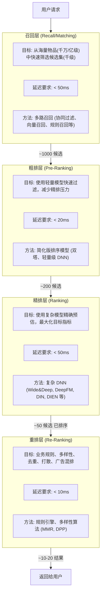

### 2.2 离线/近线/在线架构

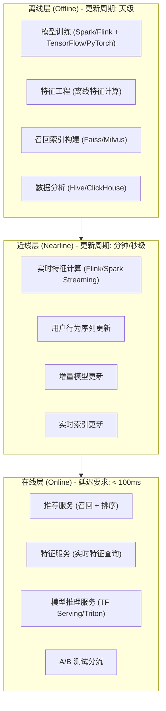

### 2.3 数据流架构

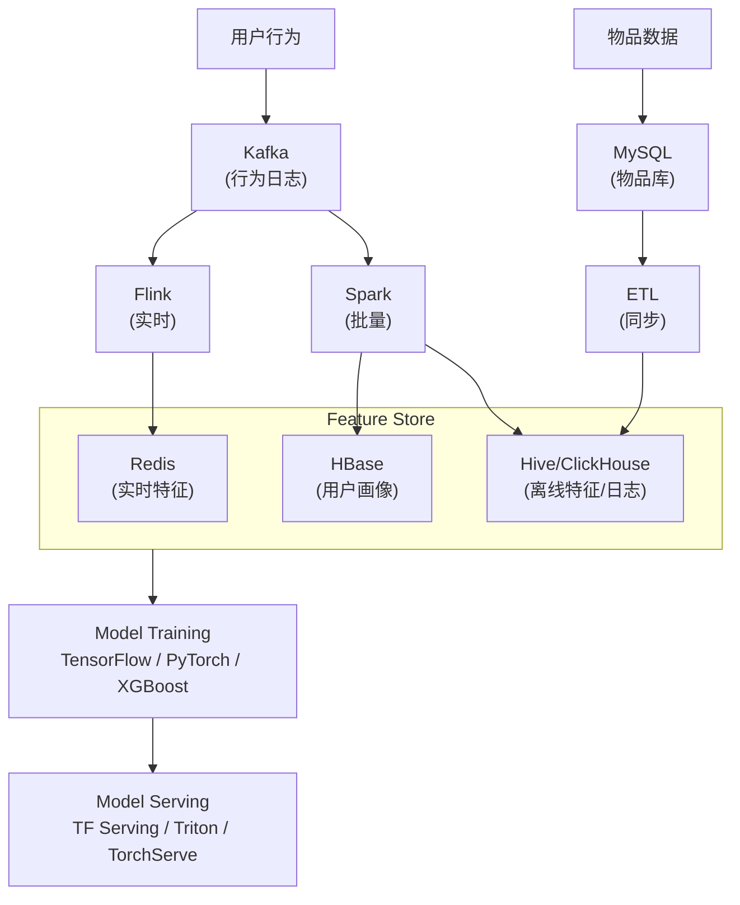

---

## 三、召回层设计

### 3.1 多路召回架构

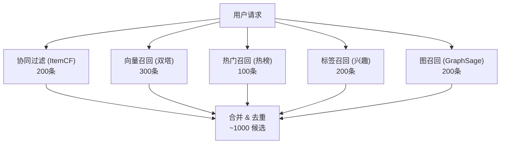

### 3.2 召回策略详解

#### 3.2.1 协同过滤召回

| 方法 | 原理 | 优点 | 缺点 |
| :--- | :--- | :--- | :--- |
| **UserCF** | 找相似用户，推荐其喜欢的物品 | 个性化强 | 用户量大时计算慢 |
| **ItemCF** | 找相似物品，推荐用户喜欢物品的相似物品 | 可解释性好 | 长尾物品覆盖差 |
| **Swing** | 改进的 ItemCF，考虑用户共现 | 效果优于 ItemCF | 计算复杂度略高 |

**ItemCF 相似度计算**：

```
Jaccard 相似度: sim(i,j) = |U_i ∩ U_j| / |U_i ∪ U_j|

余弦相似度: sim(i,j) = |U_i ∩ U_j| / √(|U_i| × |U_j|)

Swing 相似度: sim(i,j) = Σ (1 / (α + |I_u ∩ I_v|))
              (u,v 同时交互 i,j 的用户对)
```

#### 3.2.2 向量召回 (Embedding-based)

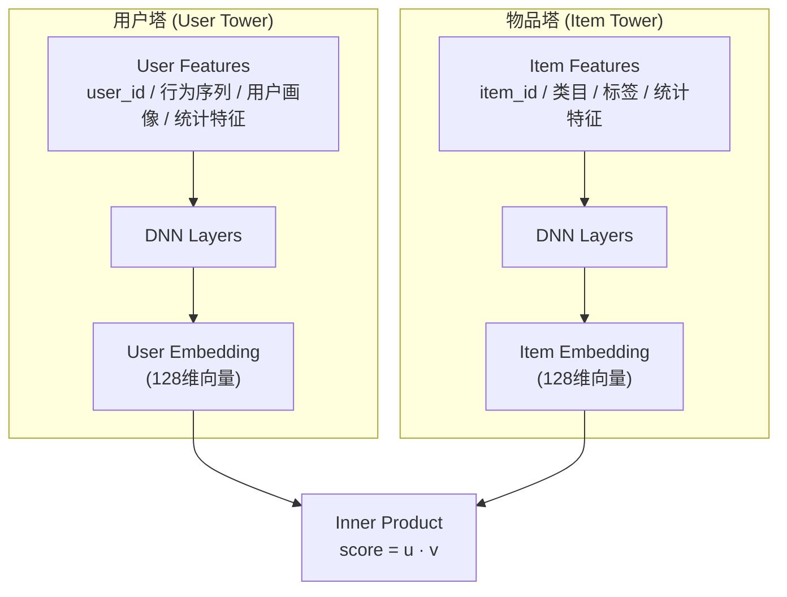

**工作流程**：
- **离线**: 预计算所有 Item Embedding，存入向量索引 (Faiss/Milvus)
- **在线**: 计算 User Embedding，ANN 检索 Top-K 相似物品

**向量索引选择**：

| 索引 | 类型 | 特点 | 适用场景 |
| :--- | :--- | :--- | :--- |
| **Faiss** | 本地库 | 高性能，支持 GPU | 单机百万级 |
| **Milvus** | 分布式 | 云原生，水平扩展 | 亿级向量 |
| **Pinecone** | SaaS | 托管服务 | 快速上线 |
| **Elasticsearch** | 插件 | 与 ES 集成 | 混合检索 |

**ANN 算法**：

| 算法 | 原理 | 召回率 | 速度 |
| :--- | :--- | :--- | :--- |
| **IVF** | 聚类 + 倒排 | 高 | 中 |
| **HNSW** | 图索引 | 高 | 快 |
| **PQ** | 乘积量化 | 中 | 极快 |
| **IVF_PQ** | IVF + PQ | 中 | 很快 |

#### 3.2.3 图召回

**图召回 (Graph-based)**：

**构建图**：
- User - Item 二部图 (行为边)
- Item - Item 图 (共现边)
- User - User 图 (社交边)

**图神经网络**：
| 方法 | 原理 |
| :--- | :--- |
| **GraphSage** | 采样邻居聚合 |
| **GAT** | 注意力加权聚合 |
| **PinSage** | Pinterest 工业级 GraphSage |

**优势**：
- 捕获高阶关系 (用户-物品-用户-物品...)
- 缓解冷启动 (通过邻居传播)
- 支持多种边类型 (点击/购买/收藏)

### 3.3 召回策略配置

| 召回源 | 候选数 | 更新频率 | 特点 |
| :--- | :--- | :--- | :--- |
| ItemCF | 200 | 天级 | 可解释，长尾差 |
| 双塔 | 300 | 天级 | 泛化好 |
| 热门 | 100 | 小时级 | 覆盖冷启动 |
| 标签 | 200 | 实时 | 探索性 |
| 图召回 | 200 | 天级 | 高阶关系 |

---

## 四、粗排层设计

### 4.1 粗排的定位

| 对比维度 | 召回 | 粗排 | 精排 |
| :--- | :--- | :--- | :--- |
| **候选量** | 千万 → 千 | 千 → 百 | 百 → 十 |
| **延迟** | < 50ms | < 20ms | < 50ms |
| **模型复杂度** | 向量内积 | 轻量 DNN | 复杂 DNN |
| **特征** | 少 | 中 | 多 |

### 4.2 粗排模型

**轻量双塔**：

```
与召回双塔类似，但:
• 更浅的网络 (2-3层)
• 更少的特征
• 更快的推理

在线计算:
score = dot(user_emb, item_emb)
```

**蒸馏模型**：

```
使用精排模型作为 Teacher，训练轻量的 Student 模型

Teacher: 复杂精排模型，离线打分
Student: 轻量模型，学习 Teacher 的打分分布

优势: 接近精排效果，但推理速度快
```

### 4.3 粗排截断策略

| 策略 | 说明 |
| :--- | :--- |
| **Top-K 截断** | 取分数最高的 K 个 |
| **分数阈值** | 保留分数 > threshold 的候选 |
| **分层截断** | 每个召回源保留一定比例 |

---

## 五、精排层设计

### 5.1 精排模型演进

**精排模型演进**：

| 代际 | 特点 | 代表模型 |
| :--- | :--- | :--- |
| **第一代** | 人工特征 + LR/GBDT，可解释性强，特征工程依赖高 | LR, GBDT, XGBoost |
| **第二代** | 特征交叉 + DNN，自动特征交叉，端到端学习 | Wide&Deep (2016), DeepFM (2017), DCN (2017) |
| **第三代** | 用户行为序列建模，Attention 机制 | DIN (2018), DIEN (2019), SIM (2020) |
| **第四代** | 多目标 + 多场景，同时优化多个目标，跨场景迁移 | ESMM (2018), MMOE (2018), PLE (2020) |

### 5.2 经典模型详解

#### 5.2.1 Wide & Deep

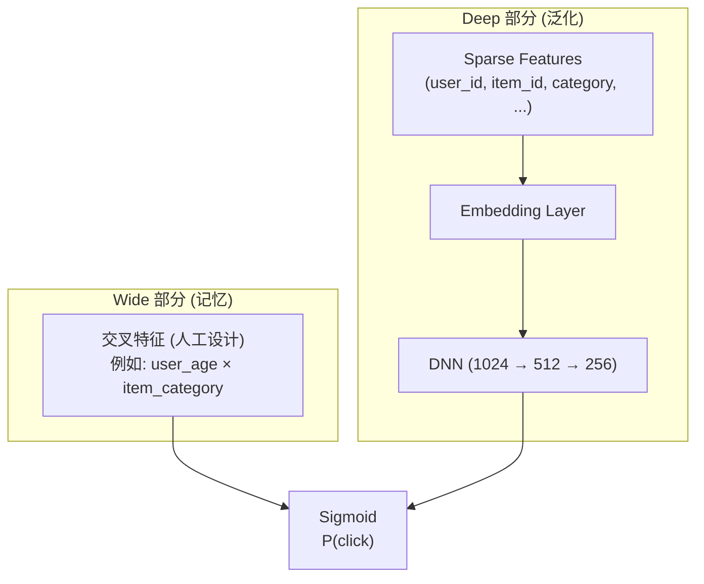

**模型特点**：
- **Wide**: 线性模型，捕获高频特征组合的记忆能力
- **Deep**: DNN，捕获低频特征的泛化能力

#### 5.2.2 DIN (Deep Interest Network)

**DIN (Deep Interest Network)**：

核心思想: 用户对不同物品的兴趣不同，使用 Attention 加权

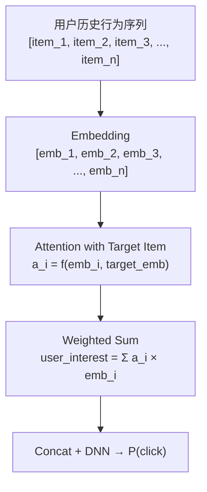

**优势**: 捕获与当前候选相关的用户兴趣，而非固定的用户表示

#### 5.2.3 多目标模型 (MMOE/ESMM)

**多目标学习 (Multi-Task Learning)**：

**业务目标**：点击 (CTR)、转化 (CVR)、时长 (Watch Time)、完播率 (Completion Rate)

**MMOE 架构**：

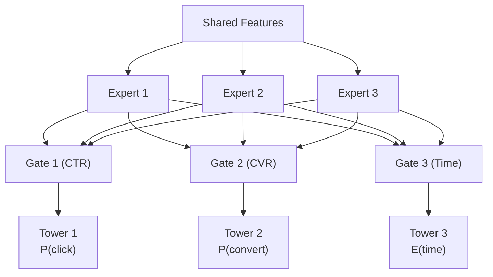

**原理**：
- **Gate**: 对 Expert 输出加权，每个任务学习不同的权重
- 共享 Expert 可以学习通用表示，任务特定 Tower 学习差异化

### 5.3 模型融合打分

**多目标融合**：

```
最终得分 = w1 × P(click) + w2 × P(convert) × price + w3 × E(watch_time)

权重调整:
• 业务目标导向 (GMV 优先则加大 convert 权重)
• A/B 测试确定最优权重
• 可以使用 Bandit 算法动态调整
```

---

## 六、重排层设计

### 6.1 重排的目标

| 目标 | 说明 |
| :--- | :--- |
| **多样性** | 避免推荐结果过于相似 |
| **去重** | 去除近期已曝光/点击的物品 |
| **打散** | 同类物品不能连续出现 |
| **业务规则** | 广告插入、置顶、保量 |
| **公平性** | 给新内容/新商家曝光机会 |

### 6.2 多样性算法

**MMR (Maximal Marginal Relevance)**：

```
MMR = argmax [ λ × Rel(d, Q) - (1-λ) × max Sim(d, d') ]
               d∈R\S                      d'∈S

• Rel(d, Q): 候选 d 与用户兴趣的相关性 (精排分数)
• Sim(d, d'): 候选 d 与已选集合 S 中物品的相似度
• λ: 相关性与多样性的权衡参数

流程:
1. 选择相关性最高的物品加入结果集 S
2. 迭代选择：MMR 分数最高的物品加入 S
3. 重复直到选够 K 个
```

**DPP (Determinantal Point Process)**：

```
选择集合 S 的概率 ∝ det(L_S)

L: 半正定核矩阵
L_ij = q_i × q_j × S_ij

• q_i: 物品 i 的质量分数 (精排分数)
• S_ij: 物品 i, j 的相似度

特点:
• 数学优雅，理论保证多样性
• 计算复杂度较高，工程优化难
```

### 6.3 打散规则

```
规则示例:

1. 类目打散: 相同一级类目的物品间隔 >= 3
2. 店铺打散: 相同店铺的商品间隔 >= 5
3. 作者打散: 相同作者的内容间隔 >= 2
4. 低质打散: 低质内容间隔 >= 4

实现: 贪心算法 + 规则引擎
```

### 6.4 广告混排

**广告混排策略**：

| Position | 内容类型 |
| :--- | :--- |
| Position 0 | 自然内容 |
| Position 1 | 自然内容 |
| Position 2 | 广告 (第一个广告位) |
| Position 3-5 | 自然内容 |
| Position 6 | 广告 (第二个广告位) |
| ... | ... |

**混排策略**：
- **固定位置**: 广告出现在固定 position
- **动态位置**: 根据广告质量和出价动态调整
- **原生广告**: 与自然内容同样排序，标记为"广告"

---

## 七、特征工程

### 7.1 特征分类

**特征分类体系**：

| 特征类别 | 特征示例 |
| :--- | :--- |
| **用户特征 (User Features)** | ID类 (user_id, device_id)、画像 (年龄, 性别, 地域)、统计 (历史点击数, 购买数)、偏好 (类目, 价格, 品牌)、实时 (Session 行为, 最近点击) |
| **物品特征 (Item Features)** | ID类 (item_id, sku_id, shop_id)、属性 (类目, 标签, 价格)、统计 (曝光数, CTR, 销量)、内容 (标题/图片 Embedding)、实时 (实时 CTR) |
| **上下文特征 (Context Features)** | 时间 (小时, 星期, 节假日)、位置 (城市, 经纬度)、设备 (类型, OS, 网络)、场景 (首页/搜索/详情页) |
| **交叉特征 (Cross Features)** | 用户-物品 (用户对该类目的历史 CTR)、用户-上下文 (用户在该时段的活跃度)、物品-上下文 (物品在该时段的 CTR) |

### 7.2 特征存储架构

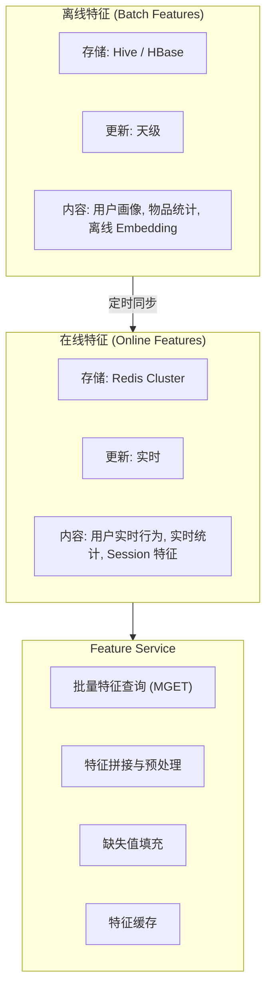

**Redis Key 设计**：
- `user_feature:{user_id}` → Hash
- `item_feature:{item_id}` → Hash
- `user_behavior:{user_id}` → List (最近 N 次行为)

### 7.3 用户行为序列

**用户行为序列建模**：

**行为类型**: 曝光 (Impression)、点击 (Click)、加购 (Add to Cart)、购买 (Purchase)、收藏 (Favorite)、评价 (Review)

**序列结构**：

```json
{
  "user_id": "12345",
  "behaviors": [
    {"item_id": "A", "action": "click", "time": 1704600000, "cate": "3C"},
    {"item_id": "B", "action": "buy", "time": 1704600100, "cate": "服装"},
    {"item_id": "C", "action": "click", "time": 1704600200, "cate": "3C"}
  ]
}
```

**长度限制**：
- 短期序列: 最近 50 条 (实时更新)
- 长期序列: 最近 30 天 / 1000 条 (天级更新)

**建模方式**：
| 方法 | 特点 |
| :--- | :--- |
| **Mean Pooling** | 简单平均 |
| **Attention Pooling** | DIN/DIEN |
| **Transformer** | 捕获序列依赖 |

---

## 八、实时推荐系统

### 8.1 实时性需求

| 场景 | 实时性要求 | 说明 |
| :--- | :--- | :--- |
| 用户点击后刷新 | 秒级 | 根据刚才的点击调整推荐 |
| 新物品上架 | 分钟级 | 新商品进入推荐池 |
| 热点事件 | 分钟级 | 热点新闻/商品实时上榜 |
| 活动开始 | 分钟级 | 促销商品优先推荐 |

### 8.2 实时特征计算

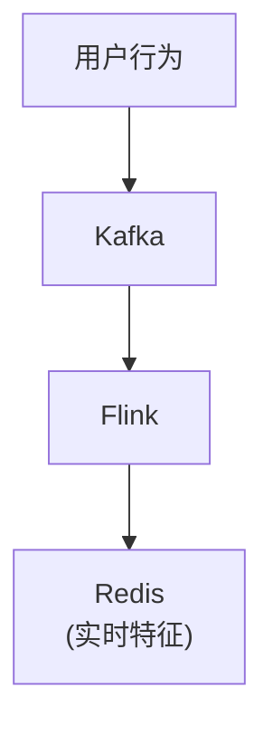

**Flink 实时聚合**：
- 用户最近 N 分钟点击数
- 物品最近 N 分钟 CTR
- 用户最近 N 次行为序列

**窗口类型**：
- Tumbling Window (滚动窗口)
- Sliding Window (滑动窗口)
- Session Window (会话窗口)

### 8.3 实时召回更新

```
场景: 用户刚点击了 item_A，如何实时更新召回?

方案 1: I2I 实时召回
• 触发: 用户点击 item_A
• 动作: 查询 item_A 的相似物品，加入召回结果
• 延迟: < 100ms

方案 2: 实时向量召回
• 触发: 用户点击 item_A
• 动作: 更新用户 Embedding，重新 ANN 检索
• 延迟: 较高，可降级为方案 1

方案 3: Session 召回
• 触发: 用户连续点击多个物品
• 动作: 基于 Session 序列计算 Embedding，ANN 检索
```

### 8.4 Online Learning

**在线学习架构**：

目标: 模型参数实时更新，快速适应数据分布变化

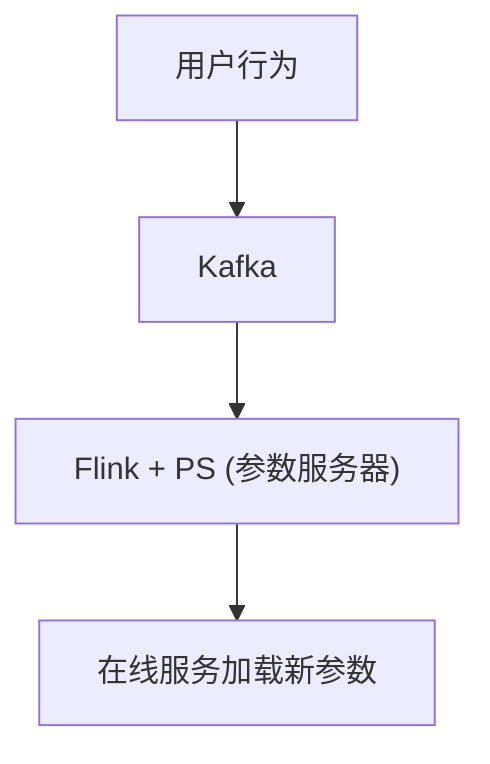

**Flink + PS 流程**：
1. 样本拼接: 实时拼接特征和 Label
2. 增量训练: 小批量梯度下降
3. 参数更新: 推送到参数服务器
4. 模型同步: 在线服务加载新参数

**挑战**：
- **样本延迟**: 转化 Label 可能延迟 (如订单 7 天无理由退货)
- **特征穿越**: 确保特征是预测时刻的值，而非事后值
- **模型稳定**: 防止异常样本导致模型崩溃

---

## 九、冷启动问题

### 9.1 冷启动分类

| 类型 | 场景 | 难点 |
| :--- | :--- | :--- |
| **新用户冷启动** | 新注册用户，无历史行为 | 不知道用户兴趣 |
| **新物品冷启动** | 新上架商品/内容 | 无行为数据，无法进入召回 |
| **系统冷启动** | 新系统上线 | 全部从零开始 |

### 9.2 新用户冷启动

**新用户冷启动策略**：

| 阶段 | 策略 |
| :--- | :--- |
| **阶段 1: 注册/首次访问** | 热门召回 (全局热门)、设备特征推断画像、渠道特征推断兴趣、地域特征推荐本地热门 |
| **阶段 2: 首次交互** | 让用户主动选择兴趣标签，根据标签召回对应内容 |
| **阶段 3: 首批行为 (3-10 次交互)** | 根据点击行为快速学习兴趣、Explore & Exploit、Bandit 算法动态调整 |
| **阶段 4: 稳定期 (10+ 次交互)** | 进入正常推荐流程，协同过滤等算法开始生效 |

### 9.3 新物品冷启动

**新物品冷启动策略**：

| 策略 | 说明 |
| :--- | :--- |
| **内容特征召回** | 根据物品的类目、标签、价格等属性特征，基于内容的相似度匹配 |
| **文本/图像 Embedding** | 使用预训练模型 (BERT, CLIP) 生成 Embedding，与现有物品计算相似度 |
| **规则保量** | 新物品强制曝光一定次数，收集初始行为数据 |
| **快速迭代** | 根据初始曝光的行为数据，快速更新物品统计特征，进入正常推荐流程 |
| **Look-alike** | 找到与新物品相似的老物品，使用老物品的行为数据做代理 |

---

## 十、多样性与探索

### 10.1 Explore & Exploit 问题

**Explore & Exploit 权衡**：

| 策略 | 说明 | 风险/收益 |
| :--- | :--- | :--- |
| **Exploit (利用)** | 推荐模型预估分数最高的物品 | 短期收益最大化，但有信息茧房、用户疲劳风险 |
| **Explore (探索)** | 推荐用户可能感兴趣但模型不确定的物品 | 发现新兴趣，打破信息茧房，收集更多样本 |

**权衡策略**：
- 90% Exploit + 10% Explore
- 根据用户活跃度调整 (活跃用户更多 Exploit)
- 根据物品确定性调整 (不确定的多 Explore)

### 10.2 Bandit 算法

| 算法 | 原理 | 特点 |
| :--- | :--- | :--- |
| **ε-Greedy** | 以 ε 概率随机探索 | 简单，但探索效率低 |
| **UCB** | 选择置信上界最大的 | 理论保证，适合物品有限 |
| **Thompson Sampling** | 基于后验分布采样 | 效果好，实现略复杂 |
| **LinUCB** | 线性上下文 Bandit | 支持个性化探索 |

### 10.3 多样性保障

```
1. 召回层多样性
   • 多路召回: 不同召回源的物品有差异
   • 探索召回: 专门的探索性召回通道

2. 排序层多样性
   • 多目标融合: 兼顾点击率和新颖性
   • 多样性正则: 在 Loss 中加入多样性惩罚

3. 重排层多样性
   • MMR/DPP 算法
   • 类目/标签打散规则

4. 评估指标
   • 覆盖率: 被推荐的物品占总物品的比例
   • Intra-List Diversity: 推荐列表内的多样性
   • Novelty: 推荐长尾物品的能力
```

---

## 十一、高性能设计

### 11.1 性能要求

| 指标 | 要求 |
| :--- | :--- |
| 端到端延迟 | P99 < 100ms |
| QPS | 10,000+ (单机) |
| 召回延迟 | < 50ms |
| 精排延迟 | < 50ms |

### 11.2 性能优化策略

**性能优化策略**：

| 策略 | 具体措施 |
| :--- | :--- |
| **并行化** | 多路召回并行执行、特征查询并行化 (批量 MGET)、模型推理批处理 |
| **缓存** | 用户/物品特征缓存 (Redis)、召回结果缓存 (短期有效)、本地缓存 (Caffeine) |
| **模型优化** | 模型量化 (FP32 → INT8)、模型剪枝、模型蒸馏、GPU/TensorRT 加速 |
| **预计算** | 用户/物品 Embedding 预计算、协同过滤相似度离线计算 |
| **分层截断** | 召回 1000 → 粗排 200 → 精排 50 → 重排 20，每层过滤减少下层计算量 |

### 11.3 模型推理优化

| 优化手段 | 效果 | 适用场景 |
| :--- | :--- | :--- |
| **批处理** | 提升吞吐 2-5x | 所有场景 |
| **FP16/INT8 量化** | 延迟降低 2-4x | 精排模型 |
| **TensorRT** | 延迟降低 2-3x | NVIDIA GPU |
| **ONNX Runtime** | 通用加速 | 跨平台部署 |
| **模型蒸馏** | 保持精度，降低复杂度 | 粗排模型 |

---

## 十二、高可用设计

### 12.1 架构高可用

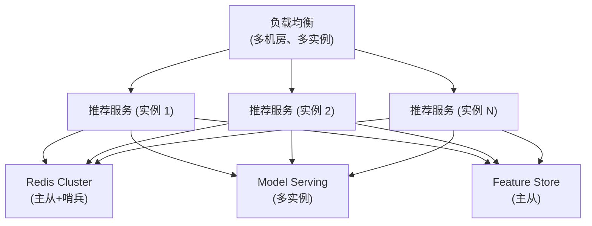

### 12.2 降级策略

| 场景 | 降级策略 | 影响 |
| :--- | :--- | :--- |
| 精排服务故障 | 使用粗排结果 | 推荐质量下降 |
| 特征服务故障 | 使用缓存特征 | 特征可能过期 |
| 向量索引故障 | 跳过向量召回 | 召回多样性下降 |
| 全部故障 | 热门兜底 | 无个性化 |

### 12.3 容错设计

```
1. 超时控制
   • 召回超时: 30ms
   • 精排超时: 50ms
   • 全链路超时: 100ms

2. 熔断
   • 错误率 > 50% 触发熔断
   • 熔断期间走降级逻辑

3. 限流
   • 按用户限流，防止恶意请求
   • 按服务限流，保护下游

4. 重试
   • 幂等接口可重试
   • 非幂等接口不重试
```

---

## 十三、A/B 测试系统

### 13.1 分流架构

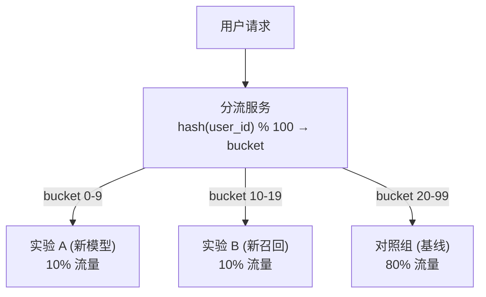

**分流原则**：
- **一致性**: 同一用户始终进入同一实验组
- **随机性**: 用户均匀分布
- **正交性**: 支持多层实验

### 13.2 多层实验

**多层实验 (正交实验)**：

| 实验层 | 分流规则 | 实验组 | 对照组 |
| :--- | :--- | :--- | :--- |
| **Layer 1: 召回层** | hash1(user_id) % 100 | 0-9: 新召回策略 A (10%) | 10-99: 基线召回 (90%) |
| **Layer 2: 排序层** | hash2(user_id) % 100 (不同 hash 种子) | 0-19: 新模型 B (20%) | 20-99: 基线模型 (80%) |
| **Layer 3: 重排层** | hash3(user_id) % 100 | 0-4: 新打散策略 C (5%) | 5-99: 基线打散 (95%) |

**正交性**: 每层独立分流，互不影响。用户可能同时进入多层的实验组。

### 13.3 实验评估

| 指标 | 计算方式 | 显著性检验 |
| :--- | :--- | :--- |
| CTR | 点击 / 曝光 | t 检验 / Z 检验 |
| 人均时长 | 总时长 / 活跃用户数 | t 检验 |
| 留存率 | 次日回访 / 当日活跃 | 卡方检验 |
| GMV | 成交总额 | t 检验 |

---

## 十四、监控与评估

### 14.1 线上监控指标

| 类别 | 指标 | 告警阈值 |
| :--- | :--- | :--- |
| **系统** | 服务延迟 P99 | > 100ms |
| | 服务 QPS | 下降 50% |
| | 错误率 | > 0.1% |
| **业务** | CTR | 下降 10% |
| | 人均曝光数 | 下降 20% |
| | 推荐覆盖率 | 下降 10% |
| **模型** | 特征缺失率 | > 1% |
| | 推理超时率 | > 1% |
| | 模型 AUC (离线) | 下降 0.5% |

### 14.2 离线评估指标

| 指标 | 含义 | 适用场景 |
| :--- | :--- | :--- |
| **AUC** | ROC 曲线下面积 | 排序模型 |
| **NDCG** | 归一化折损累计增益 | 排序质量 |
| **Recall@K** | Top-K 召回率 | 召回评估 |
| **HR@K** | 命中率 | 召回评估 |
| **Coverage** | 物品覆盖率 | 多样性 |
| **Diversity** | 推荐列表多样性 | 多样性 |

### 14.3 监控看板

```
核心看板:
• 实时 CTR 曲线
• 实时 QPS 和延迟
• 各召回源占比
• 模型版本和 A/B 实验状态

排查工具:
• 用户推荐 Debug (查看用户画像、召回来源、排序分数)
• 物品推荐 Debug (查看物品特征、曝光次数、CTR)
• 链路追踪 (Jaeger/Zipkin)
```

---

## 十五、技术选型总结

### 15.1 技术栈

| 模块 | 技术选型 | 说明 |
| :--- | :--- | :--- |
| **数据采集** | Kafka | 行为日志收集 |
| **实时计算** | Flink | 实时特征、实时指标 |
| **离线计算** | Spark | 特征工程、模型训练数据 |
| **特征存储** | Redis + HBase | 在线/离线特征 |
| **向量索引** | Milvus / Faiss | 向量召回 |
| **模型训练** | TensorFlow / PyTorch | 深度学习模型 |
| **模型服务** | TF Serving / Triton | 在线推理 |
| **推荐服务** | Go / Java | 高性能服务 |
| **A/B 测试** | 自研 / 开源 | 分流、评估 |
| **监控** | Prometheus + Grafana | 系统监控 |

### 15.2 设计原则

| 原则 | 实践 |
| :--- | :--- |
| **分层架构** | 召回 → 粗排 → 精排 → 重排 |
| **多路召回** | 保证召回多样性和覆盖率 |
| **特征工程** | 离线 + 近线 + 在线特征 |
| **实时性** | 实时特征、实时召回、Online Learning |
| **A/B 测试** | 数据驱动决策 |
| **高可用** | 降级、熔断、限流 |
| **可观测性** | 全链路监控、Debug 工具 |

---

## 附录：关键词索引

### 召回
`多路召回`, `协同过滤`, `ItemCF`, `UserCF`, `Swing`, `双塔模型`, `向量召回`, `ANN`, `Faiss`, `Milvus`, `HNSW`, `图召回`, `GraphSage`, `PinSage`

### 排序
`Wide&Deep`, `DeepFM`, `DCN`, `DIN`, `DIEN`, `SIM`, `多目标学习`, `MMOE`, `ESMM`, `PLE`, `CTR预估`, `CVR预估`

### 特征
`Feature Store`, `用户画像`, `行为序列`, `Embedding`, `实时特征`, `交叉特征`

### 系统
`四层架构`, `离线/近线/在线`, `实时推荐`, `Online Learning`, `模型服务`, `TF Serving`, `Triton`

### 策略
`冷启动`, `Explore&Exploit`, `Bandit`, `多样性`, `MMR`, `DPP`, `重排打散`

### 评估
`A/B测试`, `分流`, `正交实验`, `CTR`, `NDCG`, `AUC`, `覆盖率`

---

## 相关文章

- [上一篇：如何设计一个搜索引擎](@/articles/interview/interview-21-设计搜索引擎.md)
- [下一篇：如何设计一个Feed流系统](@/articles/interview/interview-23-设计Feed流系统.md)
