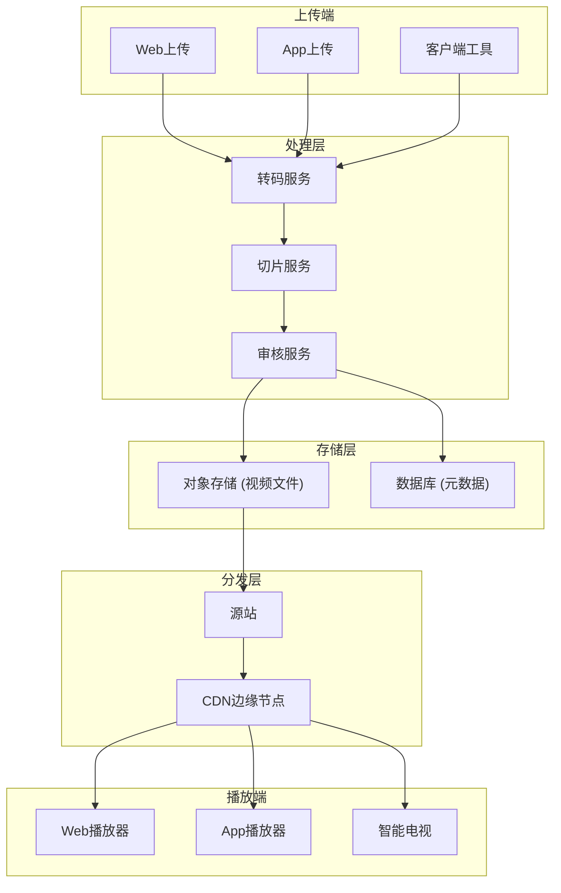
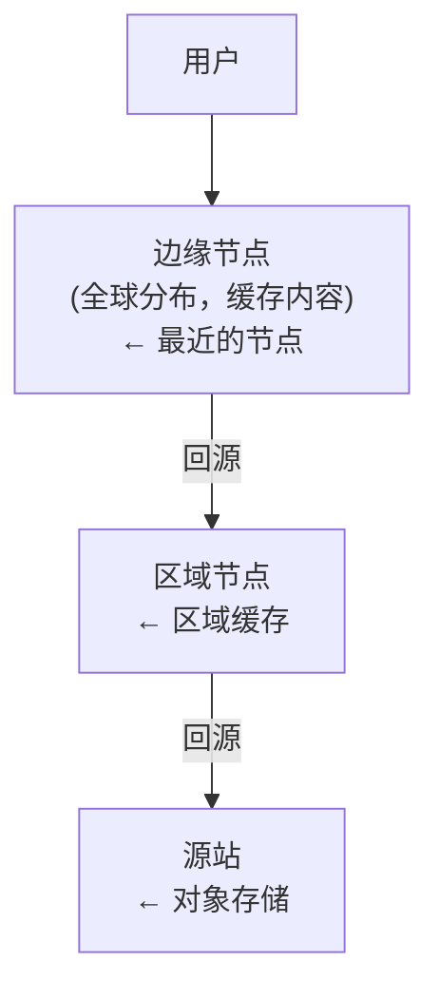
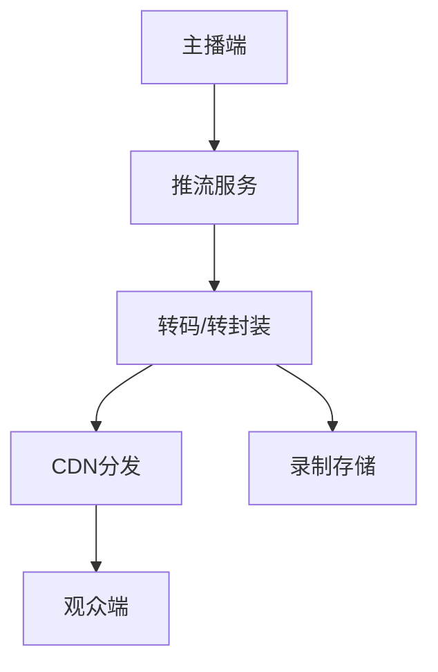

+++
title = "26.如何设计一个视频流系统"
description = "视频流系统设计：视频处理、存储分发、播放优化与直播架构"
date = 2025-01-16
[taxonomies]
tags = ["interview", "system-design", "video", "streaming", "cdn"]
+++

# 如何设计一个视频流系统

## 一、需求分析

### 1.1 核心功能

**点播（VOD）**：
- 视频上传
- 视频处理（转码、切片）
- 视频播放

**直播（Live）**：
- 实时推流
- 实时分发
- 实时播放

### 1.2 非功能需求

- **低延迟**：播放启动快，直播延迟低
- **高并发**：支持大量同时观看
- **高可用**：服务稳定可靠
- **跨平台**：支持多终端播放

### 1.3 规模估算

假设日活1000万用户：

```
日播放量：1000万 × 5次 = 5000万次
峰值并发：100万同时在线
视频存储：假设10万视频，平均500MB，约50PB
带宽需求：100万 × 2Mbps = 2Tbps
```

---

## 二、视频基础知识

### 2.1 视频组成

**容器格式**：MP4、FLV、MKV等
- 封装视频、音频、字幕等

**编码格式**：
- 视频：H.264、H.265/HEVC、VP9、AV1
- 音频：AAC、MP3、Opus

**分辨率**：
- 360p、480p、720p、1080p、4K

### 2.2 流媒体协议

| 协议 | 延迟 | 兼容性 | 适用场景 |
|------|------|--------|----------|
| HLS | 10-30秒 | 最广 | 点播、直播 |
| DASH | 10-30秒 | 广泛 | 点播、直播 |
| RTMP | 1-3秒 | 需Flash | 推流 |
| WebRTC | <1秒 | 较好 | 实时互动 |
| HTTP-FLV | 2-5秒 | 需插件 | 直播 |

### 2.3 自适应码率

**原理**：根据网络状况自动切换清晰度

**实现**：
- 视频切片为多个码率版本
- 播放器监测网络状况
- 动态请求合适的码率

---

## 三、点播系统架构

### 3.1 整体架构



### 3.2 上传流程

**分片上传**：
1. 客户端将大文件切片（如5MB/片）
2. 并行上传各分片
3. 服务端合并分片
4. 支持断点续传

**上传优化**：
- 就近上传到边缘节点
- 压缩后上传
- 后台继续

### 3.3 转码处理

**为什么转码**：
- 统一格式，适配播放
- 生成多码率版本
- 生成切片支持HLS/DASH

**转码流程**：
1. 获取源视频
2. 解码
3. 处理（调整分辨率、码率）
4. 编码为目标格式
5. 切片打包

**转码优化**：
- 分布式转码（任务分片）
- 优先转码热门视频
- 智能转码（根据内容调整参数）

---

## 四、视频存储

### 4.1 存储方案

**对象存储**：
- 存储视频文件和切片
- 如AWS S3、阿里OSS
- 高可靠、低成本

**元数据存储**：
- MySQL存储视频信息
- 标题、描述、时长、状态等

### 4.2 存储分层

**热存储**：
- 热门视频
- 高性能SSD
- CDN缓存

**冷存储**：
- 长尾视频
- 低成本存储
- 访问时预热

### 4.3 存储成本优化

**按访问频率分层**：
- 热门视频用高性能存储
- 冷门视频用归档存储

**智能存储**：
- 只保留常用码率
- 冷门视频按需转码

---

## 五、内容分发

### 5.1 CDN架构



### 5.2 CDN策略

**缓存策略**：
- 热门视频缓存到边缘
- 设置合理的缓存时间
- 支持预热

**调度策略**：
- 就近访问
- 负载均衡
- 故障切换

### 5.3 分发优化

**预热**：
- 新上传热门视频预热到边缘
- 减少首次访问延迟

**回源优化**：
- 合并回源请求
- 源站多副本

---

## 六、播放优化

### 6.1 起播优化

**问题**：用户点击到开始播放的时间

**优化手段**：
- 首个切片预加载
- DNS预解析
- 连接复用
- 首帧优化（关键帧在切片开头）

### 6.2 卡顿优化

**问题**：播放过程中缓冲

**优化手段**：
- 自适应码率
- 预加载缓冲区
- 优化切片大小
- 就近节点选择

### 6.3 画质优化

**动态码率**：
- 根据网络动态调整
- 避免画质突变

**编码优化**：
- 使用更高效的编码（H.265）
- 同等画质更低码率

---

## 七、直播系统

### 7.1 直播架构



### 7.2 推流

**推流协议**：RTMP最常用

**推流流程**：
1. 主播端采集音视频
2. 编码压缩
3. 通过RTMP推送到服务器

### 7.3 拉流

**拉流协议选择**：
- HLS：兼容性好，延迟高
- HTTP-FLV：低延迟，需要支持
- WebRTC：超低延迟

### 7.4 直播延迟优化

**延迟来源**：
- 采集编码：100-500ms
- 推流：100-500ms
- 转码：500-2000ms
- CDN分发：100-500ms
- 播放缓冲：1-10s

**优化手段**：
- 减少GOP（关键帧间隔）
- 使用低延迟协议（WebRTC）
- 减少切片时长
- 边缘转码

### 7.5 直播录制

**实时录制**：
- 推流同时录制
- 存储为点播格式

**用途**：
- 回放
- 审核
- 剪辑二次创作

---

## 八、高可用设计

### 8.1 上传高可用

- 分片上传，断点续传
- 多地域上传入口
- 上传失败重试

### 8.2 转码高可用

- 任务队列持久化
- 转码失败重试
- 多节点分布式处理

### 8.3 播放高可用

- CDN多节点冗余
- 故障节点自动切换
- 源站多副本

### 8.4 直播高可用

- 推流自动重连
- 备用推流通道
- 多线路分发

---

## 九、成本优化

### 9.1 带宽成本

**问题**：带宽是最大成本

**优化**：
- 使用更高效编码（H.265比H.264节省30-50%带宽）
- 智能码率（按内容复杂度调整）
- P2P分发（用户间共享）

### 9.2 存储成本

**优化**：
- 冷热分层存储
- 删除冗余版本
- 低频视频压缩存储

### 9.3 转码成本

**优化**：
- 按需转码（冷门视频不预转）
- 使用硬件加速
- 智能调度（利用空闲资源）

---

## 十、面试要点

### 10.1 常见追问

**Q：如何实现自适应码率？**
A：视频预先转码为多个码率版本并切片；播放器监测下载速度；根据带宽选择合适码率的切片；平滑切换避免画质突变。

**Q：如何优化起播速度？**
A：首个切片预加载；DNS预解析和连接复用；使用低延迟协议；首帧为关键帧；就近CDN节点。

**Q：直播延迟如何降低？**
A：减少GOP（1-2秒）；减少切片时长（2秒）；使用低延迟协议（HTTP-FLV或WebRTC）；减少缓冲区。

**Q：如何保证大规模并发观看？**
A：CDN多级缓存，边缘节点承载流量；热门内容预热；弹性扩容；P2P分担压力。

### 10.2 设计要点总结

1. **分层架构**：上传、处理、存储、分发、播放分离
2. **CDN是核心**：承载大部分流量
3. **自适应码率**：提升用户体验
4. **成本意识**：带宽和存储是主要成本
5. **延迟优化**：直播场景尤为重要

---

## 相关文章

- [上一篇：如何设计一个通知推送系统](/articles/interview/interview-25-设计通知推送系统/)
- [下一篇：如何设计一个对象存储系统](/articles/interview/interview-27-设计对象存储系统/)
