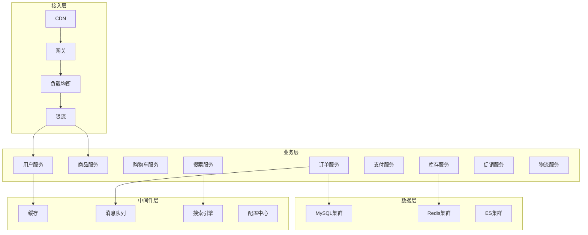
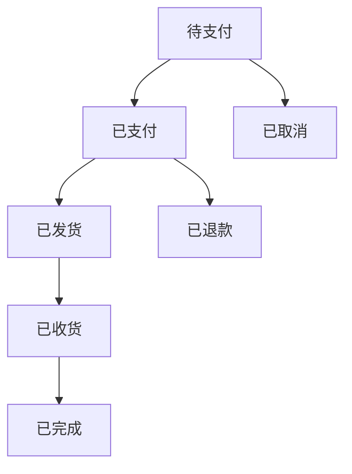

+++
title = "30. 如何设计一个电商系统"
description = "电商系统架构设计：商品、订单、库存、支付的核心设计与高并发解决方案"
date = 2025-01-16
weight = 30000
[taxonomies]
tags = ["interview", "system-design", "e-commerce", "distributed"]
+++

# 如何设计一个电商系统

## 一、需求分析

### 1.1 核心功能

**用户端**：
- 商品浏览和搜索
- 购物车管理
- 下单和支付
- 订单管理

**商家端**：
- 商品管理
- 订单处理
- 库存管理

**平台端**：
- 用户管理
- 商家管理
- 数据分析

### 1.2 非功能需求

- **高并发**：支持大促期间的流量洪峰
- **高可用**：核心链路不能中断
- **数据一致**：库存和订单状态准确
- **低延迟**：用户体验流畅

### 1.3 规模估算

假设日活1000万用户：

```
商品浏览：1000万 × 20次 = 2亿次/天
下单量：100万单/天
峰值QPS：商品查询约5万，下单约5000
大促期间：峰值可达平时的10-50倍
```

---

## 二、系统架构

### 2.1 整体架构



### 2.2 服务拆分

| 服务 | 职责 | 特点 |
|------|------|------|
| 用户服务 | 登录、注册、信息管理 | 读多写少 |
| 商品服务 | 商品信息管理 | 读多写少 |
| 库存服务 | 库存扣减和查询 | 高并发写 |
| 购物车服务 | 购物车管理 | 用户维度 |
| 订单服务 | 订单生命周期 | 核心链路 |
| 支付服务 | 支付流程 | 资金安全 |
| 搜索服务 | 商品搜索 | 高并发读 |
| 促销服务 | 优惠券、满减等 | 规则复杂 |

---

## 三、商品系统

### 3.1 商品模型

**SPU（Standard Product Unit）**：
- 标准化产品单元
- 如：iPhone 15

**SKU（Stock Keeping Unit）**：
- 最小库存单位
- 如：iPhone 15 128G 黑色

**属性设计**：
- 销售属性：颜色、规格（决定SKU）
- 描述属性：材质、产地（仅展示）

### 3.2 商品存储

**基本信息**：MySQL存储

**详情内容**：大文本单独存储或使用文档数据库

**图片/视频**：对象存储 + CDN

**搜索索引**：Elasticsearch

### 3.3 商品查询优化

**读多写少场景**：
- 多级缓存：本地缓存 → Redis → 数据库
- 缓存预热：热门商品提前加载
- CDN加速：商品详情页静态化

**缓存策略**：
- 商品基本信息：较长过期时间
- 库存/价格：短过期或不缓存

---

## 四、库存系统

### 4.1 库存模型

**可售库存**：可供销售的数量

**锁定库存**：已下单未支付锁定的数量

**实际库存**：物理库存数量

**公式**：可售库存 = 实际库存 - 锁定库存

### 4.2 库存扣减

**下单时扣减**：
- 下单即扣减可售库存
- 锁定库存增加
- 支付成功后确认
- 未支付则回滚

**支付时扣减**：
- 下单只校验库存
- 支付时真正扣减
- 可能出现超卖

**推荐**：下单时扣减，更安全

### 4.3 防超卖

**数据库层**：
- 乐观锁：UPDATE SET stock = stock - 1 WHERE stock > 0
- 防止并发扣减为负

**缓存层**：
- Redis预扣库存
- Lua脚本原子操作
- 减少数据库压力

**流程**：
1. Redis预扣库存
2. 扣减成功则创建订单
3. 异步同步到数据库
4. 对账修正差异

### 4.4 库存回滚

**触发场景**：
- 订单取消
- 支付超时
- 订单关闭

**处理方式**：
- 释放锁定库存
- 增加可售库存
- 使用消息队列保证可靠

---

## 五、订单系统

### 5.1 订单状态



**状态机设计**：
- 明确状态和转换条件
- 防止非法状态转换
- 记录状态变更历史

### 5.2 下单流程

**核心步骤**：
1. 参数校验
2. 商品校验（价格、状态）
3. 优惠计算
4. 库存扣减
5. 创建订单
6. 发起支付

**事务处理**：
- 库存扣减和订单创建需要保证一致
- 使用本地事务或分布式事务

### 5.3 订单超时

**超时关闭**：
- 未支付订单超时自动关闭
- 释放库存

**实现方式**：
- 延迟消息队列
- 定时任务扫描
- Redis过期事件

### 5.4 订单分库分表

**分片键**：用户ID

**优势**：
- 用户查看自己订单高效
- 单用户数据在同一库

**挑战**：
- 商家查订单需要跨库
- 可通过数据同步解决

---

## 六、购物车系统

### 6.1 存储方案

**登录用户**：
- Redis存储
- 支持跨设备同步
- 长期保存

**未登录用户**：
- LocalStorage
- 登录后合并

### 6.2 数据结构

使用Redis Hash：
- Key：cart:{user_id}
- Field：sku_id
- Value：数量和其他信息

### 6.3 核心操作

- 添加商品
- 修改数量
- 删除商品
- 选中/取消选中
- 清空购物车

---

## 七、搜索推荐

### 7.1 搜索系统

**技术选型**：Elasticsearch

**索引设计**：
- 商品基本信息
- 类目属性
- 搜索关键词

**搜索功能**：
- 关键词搜索
- 分类筛选
- 属性筛选
- 排序（销量、价格）

### 7.2 搜索优化

**相关性**：
- 标题权重最高
- 关键词匹配
- 类目相关

**召回策略**：
- 精确匹配
- 同义词扩展
- 拼音搜索

### 7.3 推荐系统

**推荐场景**：
- 首页推荐
- 详情页相似商品
- 购物车关联推荐

**推荐策略**：
- 热门商品
- 协同过滤
- 基于用户画像

---

## 八、高并发设计

### 8.1 读优化

**多级缓存**：
- 浏览器缓存
- CDN缓存
- 应用本地缓存
- 分布式缓存

**静态化**：
- 商品详情页静态化
- 定时或事件触发更新

### 8.2 写优化

**异步化**：
- 非核心操作异步处理
- 消息队列削峰

**批量处理**：
- 合并写入
- 减少数据库压力

### 8.3 大促准备

**容量评估**：
- 预估峰值流量
- 压测验证容量

**限流降级**：
- 入口限流
- 非核心功能降级
- 排队机制

**预案准备**：
- 扩容预案
- 降级预案
- 回滚预案

---

## 九、数据一致性

### 9.1 最终一致性

**场景**：库存、订单等核心数据

**方案**：
- 消息队列保证可靠传递
- 对账发现和修复差异
- 补偿机制

### 9.2 缓存一致性

**策略**：
- 先更新数据库，再删除缓存
- 设置合理过期时间
- 变更通知刷新

### 9.3 分布式事务

**Saga模式**：
- 拆分为多个本地事务
- 失败时执行补偿操作

**TCC模式**：
- Try-Confirm-Cancel
- 资源预留后确认或取消

---

## 十、面试要点

### 10.1 常见追问

**Q：如何防止超卖？**
A：数据库乐观锁（stock > 0条件）；Redis预扣库存原子操作；下单时锁定库存，支付后确认；对账修正差异。

**Q：订单超时如何实现？**
A：延迟消息队列（RocketMQ延迟消息）；定时任务扫描（性能差）；Redis过期事件（不可靠）。推荐延迟消息队列。

**Q：大促如何保障系统稳定？**
A：提前容量评估和压测；多级限流（入口、服务、接口）；非核心功能降级；静态化和缓存预热；弹性扩容。

**Q：如何保证库存和订单一致？**
A：使用本地事务保证单库一致；库存扣减和订单创建在同一事务；失败时统一回滚；对账机制兜底。

### 10.2 设计要点总结

1. **服务拆分**：按业务领域拆分，独立演进
2. **库存设计**：锁定机制防超卖
3. **缓存策略**：多级缓存，读写分离
4. **高并发**：限流、降级、异步化
5. **数据一致**：最终一致性 + 对账机制

---

## 相关文章

- [上一篇：如何设计一个订单系统](@/articles/interview/interview-29-设计订单系统.md)
- [下一篇：如何设计一个秒杀系统](@/articles/interview/interview-31-设计秒杀系统.md)
