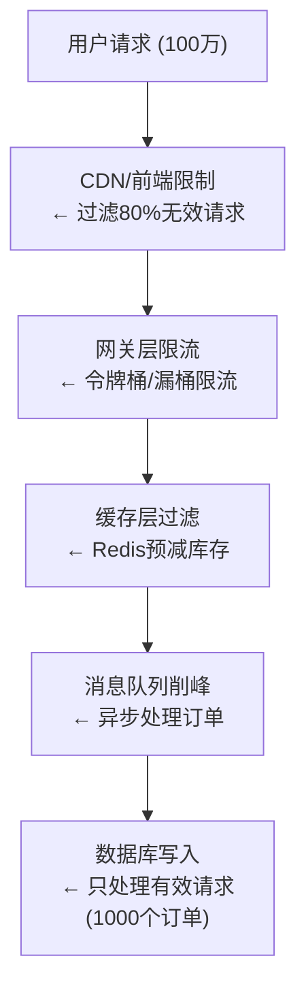

+++
title = "31. 如何设计一个秒杀系统"
description = "秒杀系统架构设计：流量控制、库存扣减、防超卖与高并发解决方案"
date = 2025-01-16
weight = 31000
[taxonomies]
tags = ["interview", "system-design", "high-concurrency", "flash-sale"]
+++

# 如何设计一个秒杀系统

## 一、秒杀场景特点

### 1.1 业务特点

- **瞬时流量极高**：平时QPS可能只有几百，秒杀时可达几十万
- **读多写少**：大量用户刷新页面，实际下单的很少
- **库存有限**：通常只有几百到几千件商品
- **时间敏感**：必须在毫秒级完成响应

### 1.2 技术挑战

- **高并发读**：如何承受瞬时百万级请求
- **高并发写**：如何保证库存不超卖
- **系统稳定**：如何保护后端系统不被打垮
- **用户公平**：如何防止黄牛和机器人

### 1.3 规模估算

假设100万用户同时抢购1000件商品：
- 峰值QPS：100万（秒杀开始瞬间）
- 有效写入：1000次（实际成交）
- 请求成功率：0.1%

---

## 二、核心设计原则

### 2.1 三个原则

**尽量少**：减少请求数、减少数据量、减少计算量

**尽量快**：使用缓存、异步处理、并行计算

**尽量分**：分层过滤、分散热点、分离读写

### 2.2 漏斗模型

---

## 三、详细设计

### 3.1 前端优化

**静态化**：
- 秒杀页面静态化，推送到CDN
- 只有"立即购买"按钮需要动态交互
- 秒杀未开始时，按钮置灰并显示倒计时

**限制提交**：
- 按钮点击后立即禁用，防止重复提交
- 前端做倒计时，到点才能点击
- 加入简单验证码或滑块验证

**请求控制**：
- 随机延迟：点击后随机延迟0-几百毫秒再发请求
- 分批请求：将请求分散到几秒内
- 客户端限流：控制请求频率

### 3.2 网关层限流

**令牌桶/漏桶**：
- 控制进入后端的请求速率
- 例如：只放行10万QPS到应用层

**用户维度限流**：
- 每个用户每秒只允许1次请求
- 基于用户ID的滑动窗口计数

**IP限流**：
- 单IP请求频率限制
- 防止机器人批量请求

**黑白名单**：
- 已购买用户直接返回
- 黑名单用户直接拒绝

### 3.3 缓存层库存校验

**秒杀开始前**：
- 将库存数量预热到Redis
- 使用单独的Redis实例或集群，避免影响其他业务

**库存预减**：
- 使用Redis的DECR命令原子减库存
- 减后值 >= 0：进入下单流程
- 减后值 < 0：直接返回售罄

**Lua脚本保证原子性**：
1. 判断库存是否 > 0
2. 判断用户是否已购买
3. 减库存
4. 标记用户已购买
以上操作通过Lua脚本一次执行，保证原子性

**库存为0后快速失败**：
- 设置"已售罄"标记
- 后续请求直接返回，不再执行Lua脚本

### 3.4 消息队列削峰

**为什么用消息队列**：
- 缓存预减成功的请求仍可能有数千个/秒
- 数据库无法承受这样的写入压力
- 需要异步处理，削平峰值

**流程**：
1. 缓存预减成功后，发送消息到队列
2. 消费者按照数据库能承受的速率消费
3. 消费者真正创建订单、扣减数据库库存
4. 用户通过轮询或WebSocket获取结果

**消息内容**：用户ID、商品ID、下单时间、请求唯一标识

### 3.5 数据库层

**库存扣减**：
- 使用乐观锁：UPDATE SET stock = stock - 1 WHERE id = ? AND stock > 0
- 或悲观锁：SELECT FOR UPDATE（性能较差）

**防超卖**：
- 数据库层stock > 0的条件是最后一道防线
- 即使Redis数据不一致，数据库也能保证不超卖

**订单表设计**：
- 用户ID + 商品ID 唯一索引，防止重复购买
- 订单状态：待支付、已支付、已取消

**分库分表**：
- 如果是多个商品的秒杀，按商品ID分表
- 减少热点集中

---

## 四、防超卖详解

超卖是秒杀最核心的问题，需要多层防护：

### 4.1 缓存层防护

使用Redis Lua脚本原子操作：
1. 检查库存
2. 检查用户是否已购买
3. 扣减库存
4. 记录用户

### 4.2 消息队列防护

- 消费时再次检查用户是否已购买
- 幂等处理：同一用户的重复消息只处理一次

### 4.3 数据库层防护

- 唯一索引：用户+商品唯一索引防止重复下单
- 乐观锁：stock > 0条件防止超卖
- 事务：扣库存和创建订单在同一事务

### 4.4 库存一致性

Redis库存和数据库库存可能不一致的情况：
- Redis扣减成功，但订单创建失败

**解决方案**：
- 定时对账：比较Redis和数据库库存
- 补偿机制：订单超时未支付则回滚库存
- Redis库存设置略大于实际库存，以数据库为准

---

## 五、高可用设计

### 5.1 服务隔离

- 秒杀服务独立部署，不与普通业务共用资源
- 独立的Redis集群、数据库实例
- 秒杀失败不影响正常购物

### 5.2 熔断降级

- 下游服务（订单、支付）故障时快速熔断
- 返回"系统繁忙"而非超时
- 限流触发时返回友好提示

### 5.3 流量预估

- 基于历史数据预估峰值流量
- 压测验证系统容量
- 准备扩容预案

### 5.4 演练

- 秒杀前进行全链路压测
- 模拟各种故障场景
- 验证限流、熔断、降级机制

---

## 六、防作弊

### 6.1 防机器人

- 验证码（图片、滑块、行为验证）
- 接口签名，前端加密
- 请求特征分析（请求间隔、User-Agent等）

### 6.2 防黄牛

- 手机号验证
- 收货地址分析
- 用户行为分析（新用户、异常用户）
- 设备指纹

### 6.3 公平性

- 抽签模式：不是先到先得，而是在时间窗口内随机抽取
- 预约模式：提前预约，秒杀时优先服务预约用户

---

## 七、面试要点

### 7.1 常见追问

**Q：如何保证不超卖？**
A：三层防护——Redis原子扣减预校验、消息队列幂等消费、数据库乐观锁+唯一索引。

**Q：Redis扣减成功但订单创建失败怎么办？**
A：接受少量损耗（设置Redis库存略大），通过订单超时回滚机制补偿，定时对账修正。

**Q：如何处理恶意刷接口？**
A：多层限流（网关、用户、IP）、验证码、设备指纹、行为分析。

**Q：秒杀结束后如何恢复？**
A：解除限流、释放独占资源、未支付订单回滚库存、统计分析。

### 7.2 设计要点总结

1. **层层过滤**：尽早拒绝无效请求
2. **缓存为王**：核心判断在缓存完成
3. **异步削峰**：消息队列平滑写入压力
4. **多层防护**：不依赖单一手段防超卖
5. **隔离保护**：秒杀不影响正常业务

---

## 相关文章

- [上一篇：如何设计一个电商系统](@/articles/interview/interview-30-设计电商系统.md)
- [下一篇：微服务架构设计原则](@/articles/interview/interview-32-微服务架构设计原则.md)
