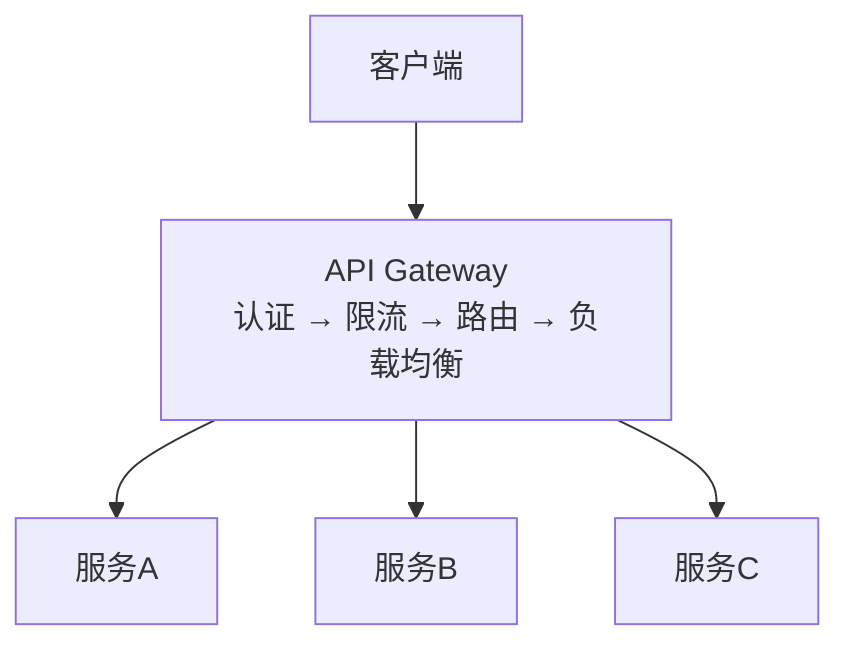
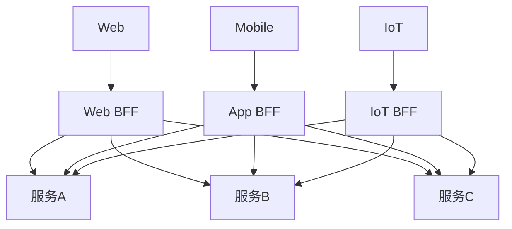
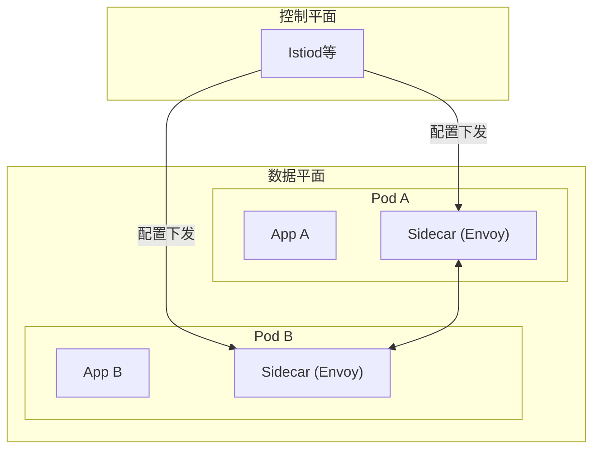

+++
title = "服务注册发现与API网关"
description = "微服务核心组件：服务注册发现原理、API网关设计与负载均衡策略"
date = 2025-01-16
weight = 33000
[taxonomies]
tags = ["interview", "microservices", "service-discovery", "api-gateway", "load-balancing"]
+++

# 服务注册发现与API网关

## 一、服务注册与发现

### 1.1 为什么需要

**传统方式的问题**：
- 服务地址写死在配置
- 扩容缩容需要修改配置
- 无法感知服务健康状态

**服务发现解决**：
- 服务实例动态注册
- 客户端动态获取可用实例
- 自动感知服务上下线

### 1.2 核心概念

**服务注册**：服务启动时向注册中心注册自己的地址

**服务发现**：客户端从注册中心获取服务提供者列表

**健康检查**：定期检测服务实例是否可用

**服务下线**：服务停止时或健康检查失败时移除

### 1.3 实现模式

**客户端发现**：
- 客户端查询注册中心
- 客户端负责负载均衡
- 如Eureka + Ribbon

**服务端发现**：
- 通过代理访问服务
- 代理负责服务发现和负载均衡
- 如Kubernetes Service

### 1.4 主流方案

| 方案 | 一致性 | 特点 |
|------|--------|------|
| Eureka | AP | Netflix出品，简单易用 |
| Consul | CP | 功能丰富，支持多数据中心 |
| Nacos | AP/CP | 阿里出品，支持配置管理 |
| ZooKeeper | CP | 强一致，通用协调服务 |
| etcd | CP | Kubernetes使用 |

**AP vs CP**：
- AP：高可用，可能数据不一致，Eureka选择
- CP：强一致，可能部分不可用，ZooKeeper选择

---

## 二、健康检查

### 2.1 检查方式

**客户端心跳**：
- 服务主动上报心跳
- 注册中心被动接收
- Eureka采用此方式

**服务端探测**：
- 注册中心主动探测服务
- 服务被动响应
- Consul支持此方式

### 2.2 检查类型

**TCP检查**：端口是否可连接

**HTTP检查**：健康接口返回200

**脚本检查**：执行自定义脚本

### 2.3 故障处理

**超时未心跳**：
- 标记为不健康
- 一段时间后移除

**主动下线**：
- 服务优雅停止
- 主动通知注册中心

---

## 三、负载均衡

### 3.1 负载均衡算法

**轮询（Round Robin）**：
- 依次分配请求
- 简单均匀
- 不考虑服务器差异

**加权轮询**：
- 按权重分配
- 考虑服务器能力差异

**随机**：
- 随机选择
- 简单有效

**最少连接**：
- 选择连接数最少的
- 适合长连接场景

**一致性哈希**：
- 相同请求路由到相同实例
- 适合有状态场景

### 3.2 实现位置

**客户端负载均衡**：
- Ribbon、Spring Cloud LoadBalancer
- 客户端直接调用服务实例
- 减少一跳，性能好

**服务端负载均衡**：
- Nginx、HAProxy、Envoy
- 通过代理分发
- 统一管理，对客户端透明

### 3.3 区域感知

**原则**：优先调用同区域/同机房的服务

**实现**：
- 服务注册时带上区域信息
- 负载均衡优先选择同区域

---

## 四、API网关

### 4.1 API网关的作用

**统一入口**：
- 所有请求通过网关
- 屏蔽内部服务复杂性

**核心功能**：
- 路由转发
- 认证授权
- 限流熔断
- 日志监控
- 协议转换

### 4.2 网关架构

### 4.3 主流网关

| 网关 | 特点 |
|------|------|
| Kong | 基于Nginx，插件丰富 |
| Spring Cloud Gateway | Spring生态，异步非阻塞 |
| APISIX | 高性能，云原生 |
| Envoy | 云原生，Service Mesh |
| Nginx | 老牌网关，稳定可靠 |

### 4.4 网关功能详解

**路由**：
- 根据路径、Header等路由到不同服务
- 支持路径重写
- 支持版本管理

**认证授权**：
- 统一认证（JWT、OAuth2）
- 权限校验
- 安全过滤

**限流**：
- 全局限流
- 按用户/IP/接口限流
- 保护后端服务

**熔断**：
- 后端服务故障时熔断
- 返回兜底响应
- 防止故障扩散

**监控**：
- 请求日志
- 调用统计
- 性能指标

---

## 五、网关设计要点

### 5.1 高可用

**多实例部署**：
- 至少两个实例
- 前置负载均衡

**无状态设计**：
- 网关不存储状态
- 便于水平扩展

### 5.2 高性能

**异步非阻塞**：
- 避免阻塞IO
- 使用Reactor模式

**连接复用**：
- HTTP Keep-Alive
- 连接池

**缓存**：
- 路由规则缓存
- 响应缓存（可选）

### 5.3 安全

**认证**：
- 验证用户身份
- JWT解析验证

**防攻击**：
- SQL注入防护
- XSS防护
- 请求体大小限制

**TLS**：
- HTTPS加密
- 证书管理

### 5.4 可观测

**日志**：
- 访问日志
- 错误日志
- 包含TraceID

**指标**：
- 请求量
- 延迟分布
- 错误率

**链路**：
- 生成/传递TraceID
- 集成追踪系统

---

## 六、BFF模式

### 6.1 什么是BFF

**Backend for Frontend**：
- 为不同前端提供专属后端
- 聚合多个微服务
- 适配前端需求

### 6.2 架构

### 6.3 适用场景

- 不同前端需求差异大
- 需要接口聚合
- 前端需要特定数据格式

---

## 七、Service Mesh

### 7.1 什么是Service Mesh

**服务网格**：
- 将服务治理能力下沉到基础设施
- Sidecar代理处理网络通信
- 应用代码无需关心服务治理

### 7.2 架构

### 7.3 优势

- 服务治理与业务代码解耦
- 统一的流量管理
- 语言无关
- 渐进式接入

### 7.4 代表方案

- Istio：功能最全
- Linkerd：轻量级
- Consul Connect：HashiCorp出品

---

## 八、面试要点

### 8.1 常见追问

**Q：Eureka和ZooKeeper选哪个？**
A：Eureka是AP，保证可用性，适合服务发现；ZooKeeper是CP，保证一致性，可能短暂不可用。服务发现通常选AP。

**Q：API网关和Nginx的区别？**
A：Nginx是通用反向代理，API网关是面向微服务的，提供认证、限流、熔断等功能。网关通常构建在Nginx/Envoy之上。

**Q：如何实现灰度发布？**
A：网关根据请求特征（用户ID、Header）路由到不同版本服务；或使用Service Mesh的流量管理能力。

**Q：Service Mesh有什么问题？**
A：增加延迟（经过Sidecar）；资源开销（每个Pod一个Sidecar）；运维复杂度；学习曲线陡峭。

### 8.2 核心要点

1. **服务发现是基础**：动态管理服务实例
2. **网关是统一入口**：认证、限流、路由
3. **负载均衡分散压力**：多种算法适配场景
4. **高可用是前提**：多实例、无状态
5. **Service Mesh是趋势**：服务治理下沉

---

## 相关文章

- [上一篇：微服务架构设计原则](@/articles/interview/interview-32-微服务架构设计原则.md)
- [下一篇：数据库选型指南](@/articles/interview/interview-34-数据库选型指南.md)
