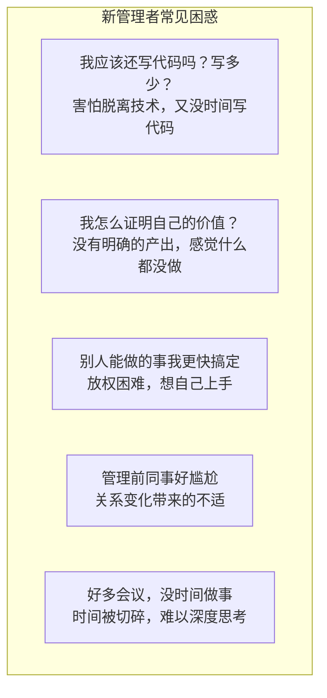
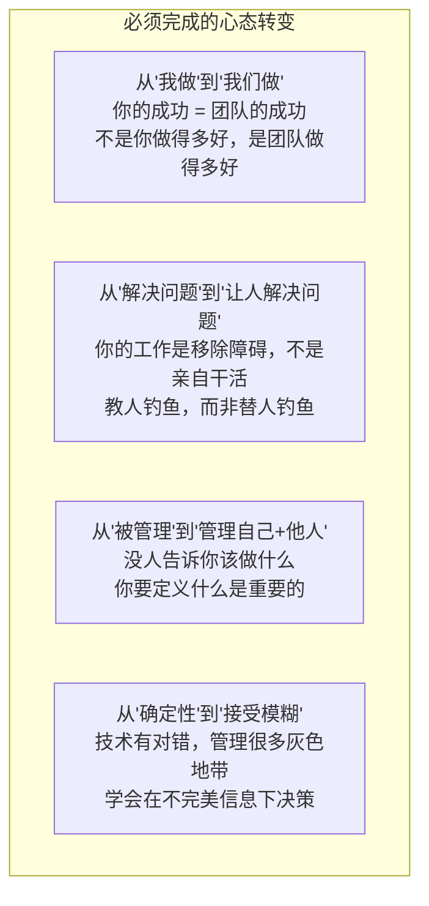
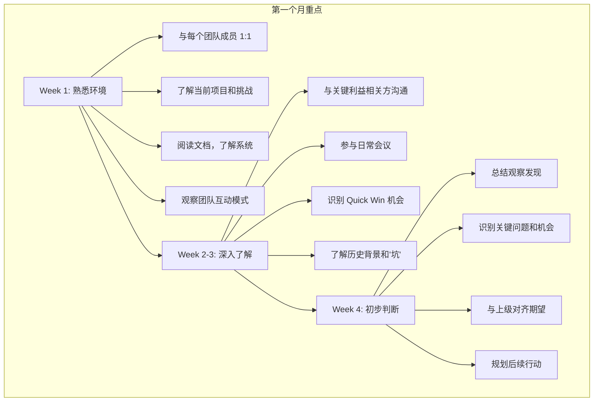
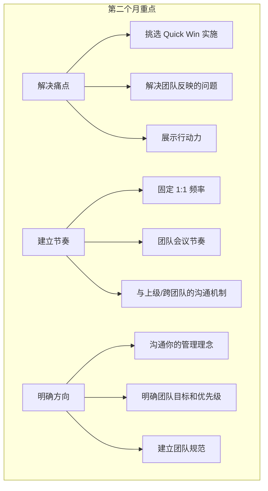
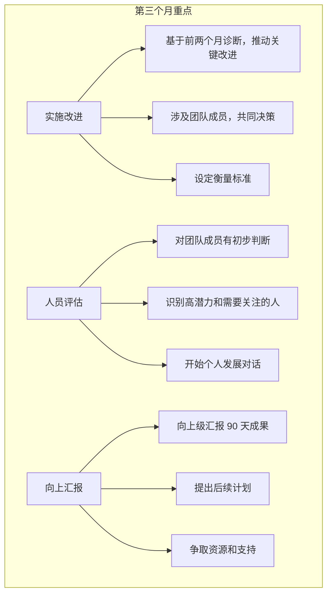
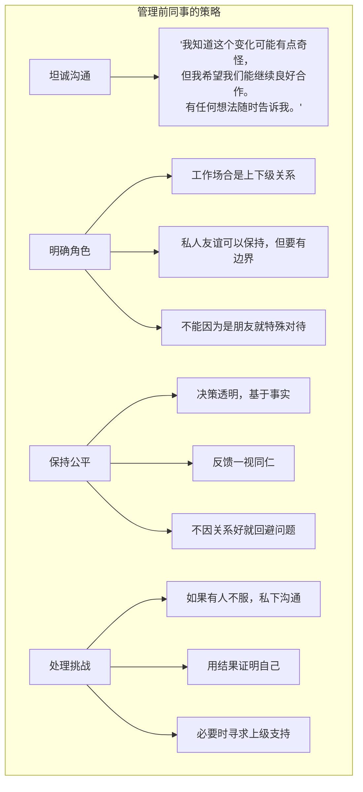
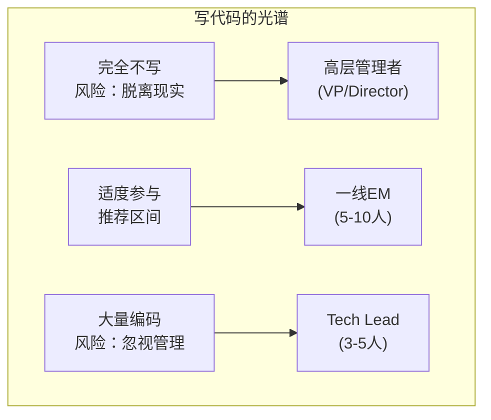
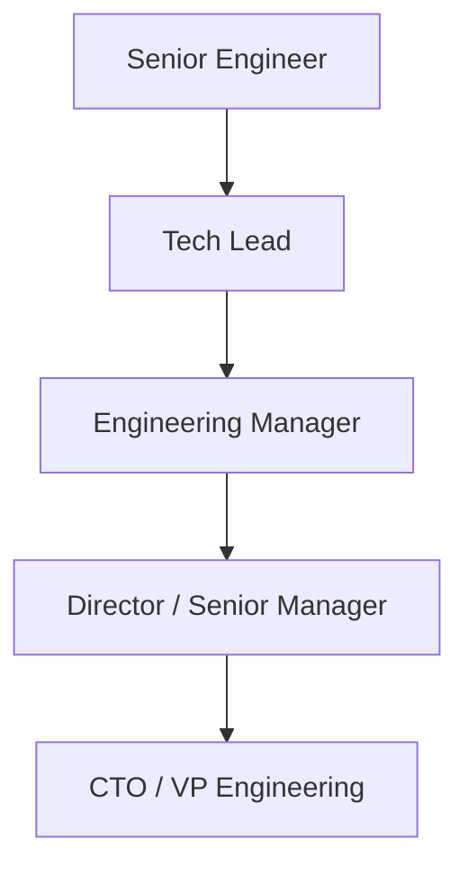
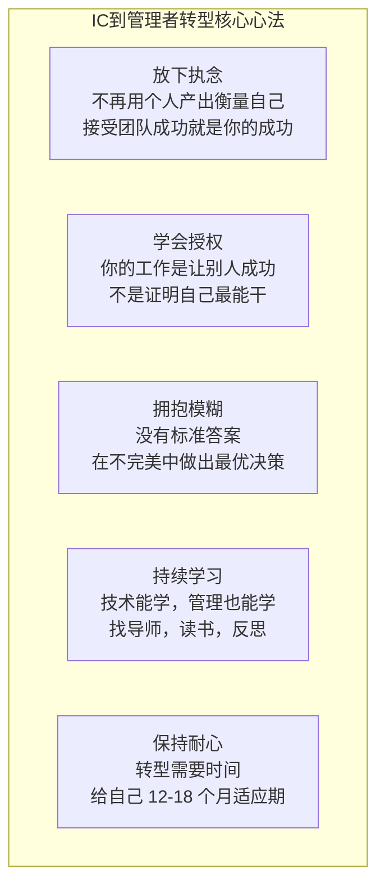

+++
title = "IC到管理的角色转型"
date = 2025-01-15
weight = 1000
description = "从个人贡献者到技术管理者的转型指南：心态转变、常见陷阱、新官上任、持续发展"
[taxonomies]
tags = ["leadership", "management", "career", "transition", "interview"]
+++

## 概述

从优秀的 Individual Contributor（个人贡献者）晋升为管理者是职业发展的重要里程碑，但也是最具挑战的转型之一。本文探讨这一转型的关键挑战和应对策略。

---

## 一、转型的挑战

### 1.1 为什么转型困难

**IC vs Manager 的本质差异：**

| Individual Contributor | Manager |
|------------------------|---------|
| 价值 = 个人产出 | 价值 = 团队产出 |
| 控制力强（自己能搞定） | 影响力导向（通过他人） |
| 即时反馈（代码能跑） | 延迟反馈（人的成长慢） |
| 技术深度 | 技术 + 人 + 流程 |
| 线性时间 | 碎片化时间 |
| 明确的对错 | 灰度和权衡 |

### 1.2 常见困惑

**面试问题**：你当初从 IC 转管理最大的挑战是什么？



---

## 二、心态转变

### 2.1 核心心态转变



### 2.2 价值观重塑

```
新的成功定义：

作为 IC：
├── 我解决了多少技术难题
├── 我写了多少高质量代码
├── 我的技术方案多漂亮
└── 我得到了多少技术认可

作为 Manager：
├── 团队交付了多少价值
├── 团队成员成长了多少
├── 团队协作多高效
├── 团队多稳定（留存）
└── 我培养了多少接班人

"如果你走了，团队仍然能运转良好，
 说明你是个好 Manager。"
```

---

## 三、常见陷阱

### 3.1 微观管理（Micromanagement）

**微观管理的表现：**

- ❌ 每个任务都要检查进度
- ❌ 不信任团队的判断
- ❌ 细节层面指导"应该这样写代码"
- ❌ 越过团队成员直接干活
- ❌ 每个决定都要过问

**为什么会这样：**

- 对放权缺乏安全感
- 认为自己能做得更好
- 害怕团队出错
- 不知道管理者应该做什么

**后果：**

- 团队失去自主性和积极性
- 成员不成长
- 你成为瓶颈
- 筋疲力尽

**如何改变：**

```
学会授权的阶梯：

Level 1: 告诉我情况，我来决定
Level 2: 给我选项，我来选择
Level 3: 给我建议，等我批准
Level 4: 告诉我你打算怎么做
Level 5: 做完告诉我结果
Level 6: 不用告诉我，除非有问题

根据人和事的风险程度，选择合适的授权层级
资深+低风险 → Level 5-6
新人+高风险 → Level 1-2
```

### 3.2 技术执着

**技术执着的表现：**

- ❌ 花大量时间写代码，忽视管理职责
- ❌ 每次 Code Review 都要改成自己的风格
- ❌ 坚持自己的技术方案，不听他人意见
- ❌ 用技术能力"镇压"团队
- ❌ 嫌弃团队代码不够好，自己重写

**根源：**

- 技术是舒适区，管理不擅长
- 担心技术能力退化
- 用技术证明自己的价值
- 对团队技术水平不信任

**平衡之道：**

- 明确自己的首要职责是管理
- 保持技术敏感度，但不必事事亲为
- 在关键技术决策上把关，日常放手
- 通过 Code Review 和设计评审参与
- 接受"足够好"，不追求完美

### 3.3 当老好人

**老好人的表现：**

- ❌ 不敢给负面反馈
- ❌ 回避困难对话
- ❌ 不敢拒绝不合理请求
- ❌ 害怕得罪人，决策和稀泥
- ❌ 低绩效员工不处理

**后果：**

- 团队标准下降
- 高绩效者不满
- 问题积累爆发
- 失去团队尊重
- 自己压力巨大

**真相：** "善良不是软弱。真正的善良是对人诚实，帮助他们成长，即使这意味着要进行困难对话。"

### 3.4 孤军奋战

**孤军奋战的表现：**

- ❌ 不向上级寻求帮助
- ❌ 不与同级管理者交流
- ❌ 所有问题自己扛
- ❌ 不参与管理者社群
- ❌ 没有导师或教练

**改变方法：**

- 找一个管理导师
- 建立管理者同侪网络
- 定期与上级 1:1
- 参加管理培训/读书会
- 读管理类书籍

---

## 四、新官上任 90 天

### 4.1 第一个月：倾听与学习

**面试问题**：如果你新接手一个团队，前 30 天你会做什么？



**注意事项：**
- 多听少说
- 不急于做大改变
- 先建立信任再推动变革

### 4.2 第二个月：建立信任



### 4.3 第三个月：推动改进



### 4.4 管理前同事



---

## 五、保持技术敏感度

### 5.1 管理者还要写代码吗？

**面试问题**：作为管理者，你如何保持技术能力？



**建议参与方式：**

不在关键路径上：
- 处理技术债务
- 做工具/自动化
- 原型/POC
- 紧急救火（但不常态）

保持技术判断力：
- 参与设计评审
- 做 Code Review
- 关注技术博客和趋势
- 与团队技术讨论

### 5.2 技术管理者 vs 纯管理者

| 路径 | 技术管理者 | 纯管理者 |
|------|-----------|----------|
| 编码 | 保持一定编码 | 很少或不编码 |
| 团队规模 | 更小的团队（5-8人） | 更大的组织（多团队） |
| 关注点 | 深度参与技术决策 | 聚焦人和流程 |
| 适合 | 热爱技术，不想完全脱离 | 热爱带人，愿意放手技术 |

> 两者都是合法的职业路径，关键是：知道自己想要什么

---

## 六、时间管理

### 6.1 管理者的时间挑战

**时间被切碎的现实：**

| 角色 | 时间特点 |
|------|----------|
| IC 的一天 | 大块连续时间，深度工作 |
| Manager 的一天 | 1:1 会议 1:1 会议... 碎片化时间 |

> 这是正常的，不是问题。管理者的工作就是通过沟通和协调来完成。

### 6.2 时间管理策略

**管理者时间管理原则：**

1. **批量处理 1:1** - 把 1:1 集中在某几天，留出大块时间
2. **保护思考时间** - 日历上 block 时间用于思考和规划
3. **区分紧急和重要** - 紧急的不一定要你亲自做，重要的不能一直拖
4. **学会说不** - 不是每个会议都要参加
5. **授权** - 能授权的事情授权出去
6. **利用碎片时间** - 回复消息、审批等可以用碎片时间

**日程示例：**

| 星期 | 安排 |
|------|------|
| 周一 | 1:1 Day（集中安排所有 1:1） |
| 周二 | 会议 + 跨团队协调 |
| 周三 | 上午 Focus Time（思考/规划），下午会议 |
| 周四 | 会议 + 技术评审 |
| 周五 | 复盘 + 下周规划 + 灵活 |

---

## 七、持续发展

### 7.1 管理者的成长路径



**每一级需要不同的技能：**

| 级别 | 核心技能 |
|------|----------|
| TL | 技术 + 带小团队 |
| EM | 人 + 项目管理 |
| Director | 多团队 + 战略 |
| VP | 组织 + 业务 |

### 7.2 管理者的技能发展

```
管理技能发展清单：

一线 Manager 必备：
├── 1:1 和反馈
├── 招聘和面试
├── 绩效管理
├── 项目管理
├── 团队建设
└── 向上管理

进阶技能：
├── 战略思维
├── 组织设计
├── 变革管理
├── 跨部门影响力
├── 人才梯队建设
└── 文化塑造
```

### 7.3 学习资源

```
推荐书籍：

入门：
├── 《The Manager's Path》- Camille Fournier
├── 《Radical Candor》- Kim Scott
└── 《High Output Management》- Andy Grove

进阶：
├── 《An Elegant Puzzle》- Will Larson
├── 《The Making of a Manager》- Julie Zhuo
└── 《Crucial Conversations》

其他资源：
├── LeadDev（博客和会议）
├── Engineering Manager Slack 社区
├── 公司内部管理者培训
└── 找一个管理导师
```

---

## 八、面试常见问题

### Q1: 你为什么想做管理？

```
回答框架：

展示正确动机：
✅ 想通过团队创造更大影响
✅ 发现自己喜欢帮助他人成长
✅ 想解决更大范围的问题
✅ 在之前的工作中自然承担了协调角色

避免错误动机：
❌ 觉得管理是晋升的唯一路径
❌ 想要更多权力/控制
❌ 以为管理更轻松

示例回答：
"在做 Senior Engineer 时，我发现自己越来越多地
 帮助团队解决协作问题、辅导新人、推动技术决策。
 我意识到通过帮助团队成功，
 我能创造比自己单独编码更大的价值。
 这让我对管理产生了兴趣。"
```

### Q2: 你如何处理不想做管理的尴尬？

```
坦诚的回答：

"我觉得这是正常的探索。
 有些人发现自己更适合技术路线，
 回到 IC 并不丢脸。

 我会给自己设定一个时间框架，
 比如一年，认真尝试做好管理。
 同时保持对自己感受的觉察。

 如果发现确实不适合或不喜欢，
 我会诚实地和上级沟通，
 寻找回到技术路线的机会。

 但目前，我对管理是有热情的，
 因为..."
```

### Q3: 描述你从 IC 转管理的经历

```
STAR 回答结构：

Situation：
"两年前，团队 TL 离职，我被提升为 Tech Lead，
 管理 5 个人的后端团队。"

Task：
"需要在保持技术领导的同时，
 承担起人员管理和项目交付的责任。"

Action：
"最初我犯了很多错误：
 - 什么都想自己做，成为瓶颈
 - 不好意思给反馈，问题积累

 后来我做了调整：
 - 刻意练习授权，从小事开始
 - 建立固定 1:1，强迫自己给反馈
 - 找了一个 Manager 导师定期交流
 - 阅读管理书籍"

Result：
"一年后，团队扩展到 8 人，
 交付了 X 个重要项目，
 团队 eNPS 从 30 提升到 50，
 培养了一位新 TL。"

Learning：
"关键学习是：
 管理者的价值在于团队，不在于自己。
 放手比亲自做更难，但更重要。"
```

### Q4: 如果你发现自己不适合做管理，怎么办？

```
成熟的回答：

"首先，我会认真尝试。
 不会因为最初的不适应就放弃，
 因为任何转型都有学习曲线。

 我会：
 1. 寻求反馈，了解具体问题
 2. 有针对性地学习和改进
 3. 给自己合理的时间（如 12-18 个月）

 如果经过充分努力后，
 仍然发现自己不适合或不快乐：
 1. 诚实与上级沟通
 2. 探讨转回 IC 或专家路线
 3. 确保平稳过渡

 我认为这不是失败，而是自我认知。
 知道自己适合什么，
 并做出相应选择，
 是成熟的职业管理。"
```

---

## 九、自检清单

### 9.1 转型准备度

```
你准备好做管理了吗？

动机自检：
□ 我是因为想帮助团队成功，而非想要权力/头衔
□ 我愿意让渡个人技术成就感
□ 我对帮助他人成长有热情
□ 我有耐心处理人的问题

能力自检：
□ 我能清晰沟通，无论是 1:1 还是群体
□ 我能给出建设性反馈，包括负面的
□ 我能在信息不完整时做决策
□ 我能处理冲突和困难对话

意愿自检：
□ 我接受时间被切碎
□ 我接受成就感延迟
□ 我接受处理模糊和灰度
□ 我愿意为团队的失败承担责任
```

### 9.2 新管理者 90 天检查点

```
30 天：
□ 与所有团队成员完成首次 1:1
□ 了解团队当前项目和挑战
□ 识别了 Quick Win 机会
□ 与上级对齐了期望

60 天：
□ 建立了固定 1:1 节奏
□ 实施了至少一个改进
□ 团队对你的管理有基本信任
□ 知道团队每个人的优势和发展方向

90 天：
□ 有清晰的团队目标和优先级
□ 解决了至少一个长期痛点
□ 获得了上级和团队的初步认可
□ 有了后续的发展规划
```

---

## 总结



> "从优秀的 IC 到优秀的管理者，是职业生涯最难也最有价值的转型之一。关键不是天赋，而是心态转变和刻意练习。"

---

## 相关文章

- [下一篇：技术招聘与团队组建](@/articles/leadership/mgr-02-技术招聘与团队组建.md)
