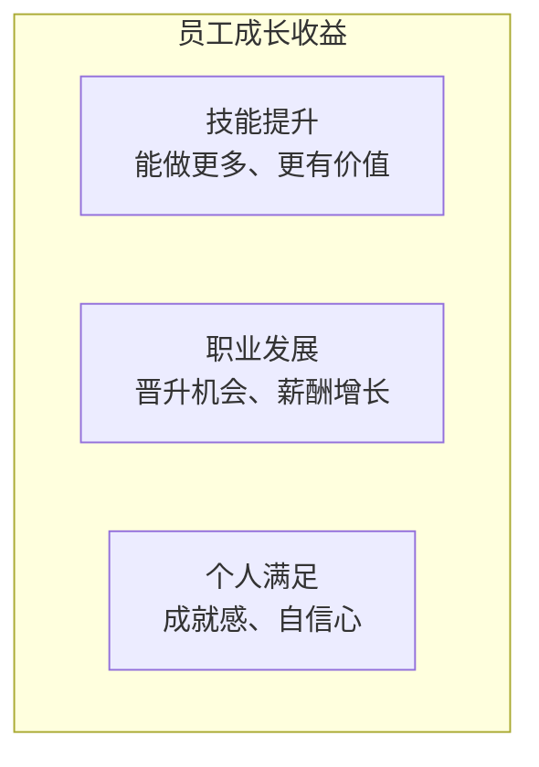
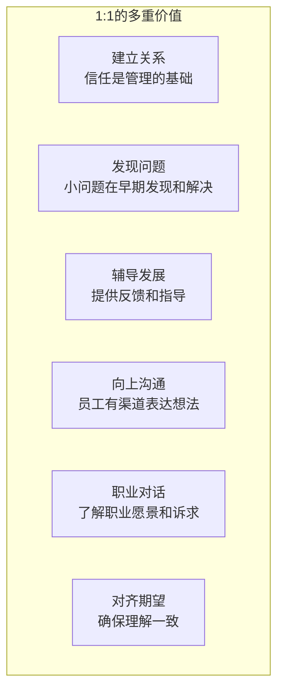
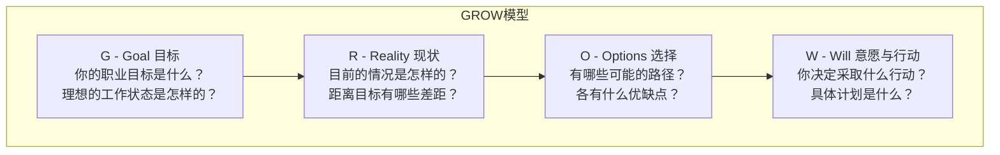
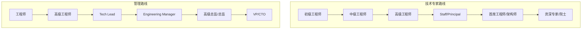
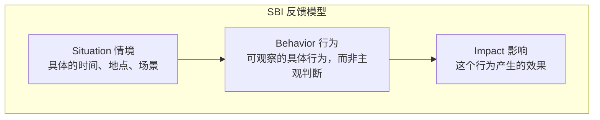
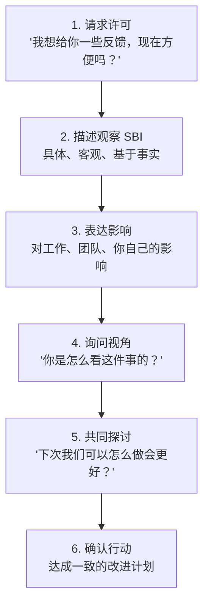
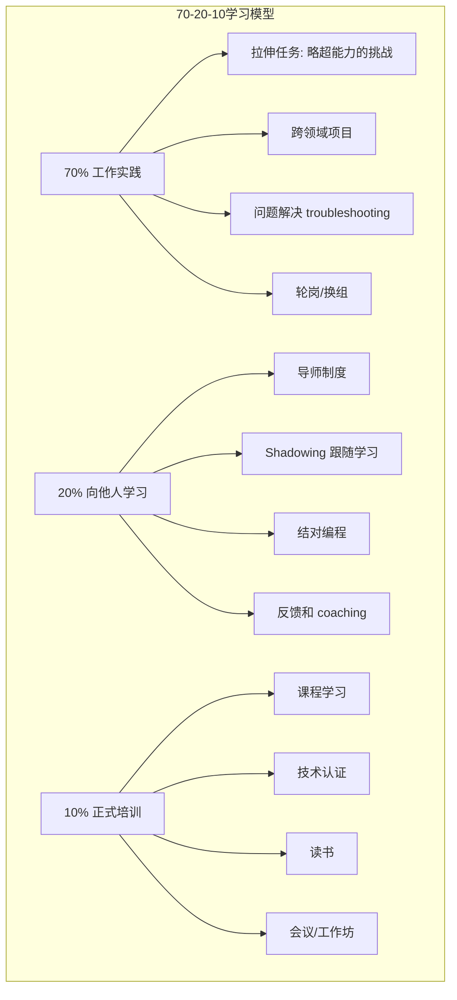
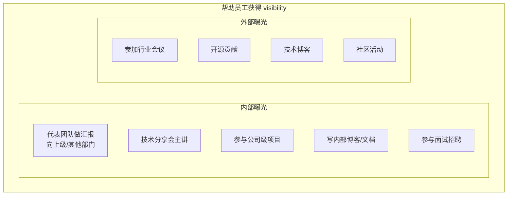
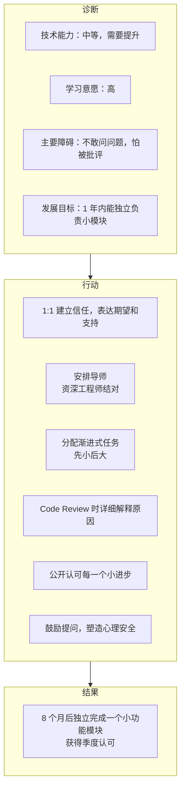
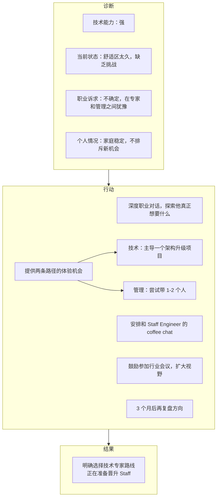

+++
title = "03. 员工发展与辅导指南"
date = 2025-01-15
weight = 3000
description = "作为技术管理者如何系统性地帮助团队成员成长，涵盖1:1沟通、职业发展对话、绩效辅导、导师制度等核心话题"
[taxonomies]
tags = ["leadership", "management", "coaching", "mentoring", "career-development"]
+++

## 概述

优秀的管理者不仅要达成业务目标，更要帮助团队成员成长。本文提供系统性的员工发展框架和实操方法。

---

## 一、为什么员工发展很重要

### 1.1 对员工的价值



### 1.2 对团队和公司的价值

| 收益 | 说明 |
|------|------|
| 留存率提升 | 员工看到成长空间，更愿意留下 |
| 产能提高 | 能力提升直接转化为更高效率 |
| 创新增强 | 成长型文化鼓励尝试和创新 |
| 人才梯队 | 内部培养储备管理和专家人才 |
| 招聘吸引力 | "能学到东西"是重要的雇主品牌 |

### 1.3 对管理者的价值

```
帮助他人成长的管理者：

✓ 团队更强，自己能处理更高层面的事务
✓ 建立信任和追随者
✓ 个人影响力扩大
✓ 晋升时有接班人，更容易被提拔
✓ 职业满足感
```

---

## 二、1:1 会议（One-on-One）

### 2.1 为什么 1:1 重要



### 2.2 1:1 最佳实践

**频率和时长：**

```
建议：每周 30 分钟 或 每两周 45-60 分钟

注意：
• 这是员工的时间，不是你的状态汇报会
• 固定时间，不轻易取消
• 可以灵活调整，但要保持节奏
```

**议程设计：**

| 部分 | 时间分配 | 话题示例 |
|------|----------|----------|
| 开场 | 5分钟 | 近况，工作外的轻松话题 |
| 员工议题 | 15分钟 | 他想讨论的问题（优先） |
| 管理者议题 | 10分钟 | 你想沟通的事项 |
| 收尾 | 5分钟 | 总结行动项，确认下次时间 |

### 2.3 高质量 1:1 问题库

**日常跟进：**

```
• 最近工作感觉怎么样？
• 有什么让你特别兴奋或沮丧的事吗？
• 有什么阻碍你工作的问题吗？
• 你觉得我能怎么帮到你？
```

**团队和协作：**

```
• 和团队其他人合作顺利吗？
• 有谁的工作给你留下深刻印象？
• 团队里有什么你觉得可以改进的？
```

**职业发展：**

```
• 你对未来的职业规划是怎样的？
• 你觉得目前在哪些方面想要提升？
• 有什么工作内容是你想尝试但还没机会的？
• 你觉得在我们团队的成长空间如何？
```

**反馈征集：**

```
• 对我的管理方式有什么建议吗？
• 有什么信息你觉得应该更早告诉你的？
• 你觉得我们团队的沟通有什么可以改进的？
```

### 2.4 1:1 常见误区

```
❌ 变成项目状态会
   → 这有其他渠道，1:1 应该聚焦人

❌ 只有管理者在说
   → 应该是 70% 员工说，30% 你说

❌ 只在有问题时才谈
   → 日常关系建设同样重要

❌ 没有行动项
   → 谈了问题要跟进，否则失去信任

❌ 轻易取消
   → 传递的信号是"你不重要"
```

---

## 三、职业发展对话

### 3.1 职业发展对话的目的

```
帮助员工回答三个问题：

1. 我在哪里？（当前状态）
   └── 能力、绩效、在组织中的位置

2. 我想去哪里？（愿景目标）
   └── 短期和长期的职业愿景

3. 如何到达？（路径规划）
   └── 技能差距、机会、行动计划
```

### 3.2 职业发展对话框架

**GROW 模型：**



### 3.3 技术人员职业路径



### 3.4 帮助员工识别成长方向

| 问题 | 目的 |
|------|------|
| 你最享受工作的哪部分？ | 发现兴趣和热情所在 |
| 你最擅长什么？ | 识别核心优势 |
| 你想成为什么样的人？ | 了解长期愿景 |
| 5年后你想在做什么？ | 探索中期目标 |
| 有谁是你的榜样？ | 通过榜样理解诉求 |

---

## 四、绩效辅导与反馈

### 4.1 持续反馈 vs 年度评估

持续反馈的优势：

| 传统年度评估 | 持续反馈 |
|--------------|----------|
| 一年一次 | 日常进行 |
| 回顾历史 | 关注当下和未来 |
| surprise | no surprise |
| 补救太晚 | 及时调整 |
| 关系紧张 | 建设性对话 |

### 4.2 反馈技巧

**SBI 反馈模型：**



**示例：**

| 类型 | S（情境） | B（行为） | I（影响） |
|------|----------|----------|----------|
| 正向反馈 | 上周的技术分享会上 | 你用了很多图表来解释复杂概念 | 大家的理解度明显提高了，会后好几个人来感谢你 |
| 改进反馈 | 昨天的代码评审中 | 你直接说'这写得不对'，没有解释原因 | 小王看起来有些沮丧，而且他还是不清楚问题在哪 |

**反馈对话结构：**



### 4.3 困难对话处理

**准备工作：**

```
□ 明确对话目的（要达成什么）
□ 收集客观事实和例子
□ 预想对方可能的反应
□ 选择合适的时间地点（私密、充裕）
□ 调整自己的情绪状态
```

**对话技巧：**

| 场景 | 技巧 |
|------|------|
| 对方防御 | 倾听 > 反驳，承认对方感受 |
| 对方沉默 | 给时间，用开放问题引导 |
| 对方激动 | 保持冷静，可以暂停后再谈 |
| 对方否认 | 回到具体事实，不纠缠对错 |
| 对方找借口 | 聚焦未来改变，而非过去原因 |

### 4.4 绩效改进计划（PIP）

**绩效改进计划 (PIP) 结构**：

| 要素 | 说明 |
|------|------|
| 当前问题 | 具体列出绩效差距（基于事实） |
| 期望标准 | 明确定义"达标"是什么样子 |
| 改进措施 | 员工需要采取的具体行动 |
| 支持资源 | 公司/管理者提供的帮助 |
| 时间线 | 通常 30/60/90 天 |
| 检查点 | 定期回顾进展的节点 |
| 结果 | 达标 → 正常工作；未达标 → 可能的后果（调岗、离职） |

```

---

## 五、成长机会创造

### 5.1 成长机会类型



### 5.2 任务分配策略

**能力-意愿矩阵：**

| | 能力低 | 能力高 |
|---|--------|--------|
| **意愿高** | 辅导 (Coach) - 激励+指导 | 授权 (Delegate) - 给空间 |
| **意愿低** | 指导 (Direct) - 手把手 | 激励 (Motivate) - 找根因 |

**拉伸任务设计：**

| 原则 | 说明 |
|------|------|
| 略超舒适区 | 有挑战但不至于失败 |
| 有安全网 | 你在旁边支持，不会掉入深渊 |
| 有价值 | 是真正的工作，不是"练手" |
| 可见成果 | 完成后有认可和反馈 |

### 5.3 曝光机会



---

## 六、导师制度

### 6.1 导师 vs 管理者

| 导师（Mentor） | 管理者（Manager） |
|----------------|-------------------|
| 关系是咨询性的 | 关系是正式汇报的 |
| 聚焦长期发展 | 聚焦当前绩效 |
| 分享经验 | 设定目标 |
| 引导思考 | 分配任务 |
| 可以拒绝 | 有组织责任 |

### 6.2 如何做好导师

**导师的角色：**

**导师的多重角色：**

| 角色 | 职责 |
|------|------|
| 倾听者 | 用心倾听、理解困境 |
| 顾问 | 分享经验、提供建议 |
| 榜样 | 以身作则、展示可能 |
| 连接者 | 引荐资源、建立人脉 |
| 挑战者 | 提出问题、拓展视野 |
| 支持者 | 鼓励前行、提供信心 |

**导师沟通技巧：**

| 技巧 | 示例 |
|------|------|
| 开放式提问 | "你是怎么看这个问题的？" |
| 分享经验 | "我之前遇到类似情况时..." |
| 启发思考 | "如果没有这个限制，你会怎么做？" |
| 不给答案 | "你觉得有哪些选择？" |
| 建设性挑战 | "有没有另一种可能性？" |

### 6.3 建立导师制度

```
公司级导师计划：

1. 匹配原则
   ├── 跨团队（避免利益冲突）
   ├── 经验差距适中（不要太远也不要太近）
   └── 双向选择（chemistry 很重要）

2. 期望设定
   ├── 每月至少 1 次会面
   ├── 保密原则
   └── 承诺期（如 6 个月起）

3. 支持机制
   ├── 导师培训
   ├── 话题指引
   └── 定期检查项目效果

4. 退出机制
   └── 不合适可以换
```

---

## 七、团队学习文化

### 7.1 打造学习型团队

**学习型团队的特征：**

| 特征 | 表现 |
|------|------|
| 心理安全 | 敢于提问、承认不懂 |
| 知识分享 | 乐于教授、共同成长 |
| 复盘反思 | 从失败学习、不blame |
| 持续改进 | 追求卓越、拥抱变化 |
| 好奇心 | 探索新技术、关注行业动态 |
| 实验精神 | 允许试错、快速迭代 |

### 7.2 学习活动设计

| 活动 | 频率 | 形式 |
|------|------|------|
| Tech Talk | 每周/双周 | 轮流分享技术话题 |
| 读书会 | 每月 | 共读一本书并讨论 |
| Code Review | 持续 | 不只是审查，也是学习 |
| Lunch & Learn | 不定期 | 午餐时间轻松分享 |
| Hackathon | 每季度 | 自由探索创新项目 |
| 复盘会 | 项目后 | 总结经验教训 |

### 7.3 知识管理

```
团队知识库建设：

1. 文档类型
   ├── 技术决策记录（ADR）
   ├── 故障复盘报告
   ├── 最佳实践指南
   ├── 常见问题 FAQ
   └── 新人 Onboarding 手册

2. 保持更新
   ├── 指定负责人
   ├── 定期 review
   └── 融入工作流程

3. 易于发现
   ├── 良好的分类和搜索
   └── 入口明显
```

---

## 八、实战案例

### 案例 1：帮助初级工程师成长

**背景：** 小王加入团队 6 个月，技术基础一般，有时候信心不足。



### 案例 2：帮助资深员工寻找成长空间

**背景：** 老李是团队最资深的工程师，近期表现有些倦怠，觉得没有成长空间。



---

## 九、管理者自检清单

```
每周自检：
□ 本周和每个直属有 1:1 吗？
□ 给了几个正向反馈？
□ 有需要给的建设性反馈拖延了吗？
□ 团队里谁最近需要更多关注？

每月自检：
□ 每个人的发展计划在推进吗？
□ 有谁的成长被忽视了？
□ 团队学习活动开展如何？
□ 自己在帮助他人成长上花了多少时间？

每季度自检：
□ 向团队征集对自己的反馈
□ 回顾每个人的职业发展进展
□ 识别高潜人才和需要关注的人
□ 更新团队发展计划
```

---

## 总结

> "管理者最大的成就，不是自己做出了什么，而是帮助团队成员成为了更好的自己。"

**核心心法：**
- 相信每个人都能成长
- 投入时间和精力去培养
- 创造机会和安全的试错空间
- 给予真诚的反馈和认可
- 成为他们的支持者和代言人

---

## 相关文章

- [上一篇：技术招聘与团队组建](@/articles/leadership/mgr-02-技术招聘与团队组建.md)
- [下一篇：项目交付与敏捷实践](@/articles/leadership/mgr-04-项目交付与敏捷实践.md)
