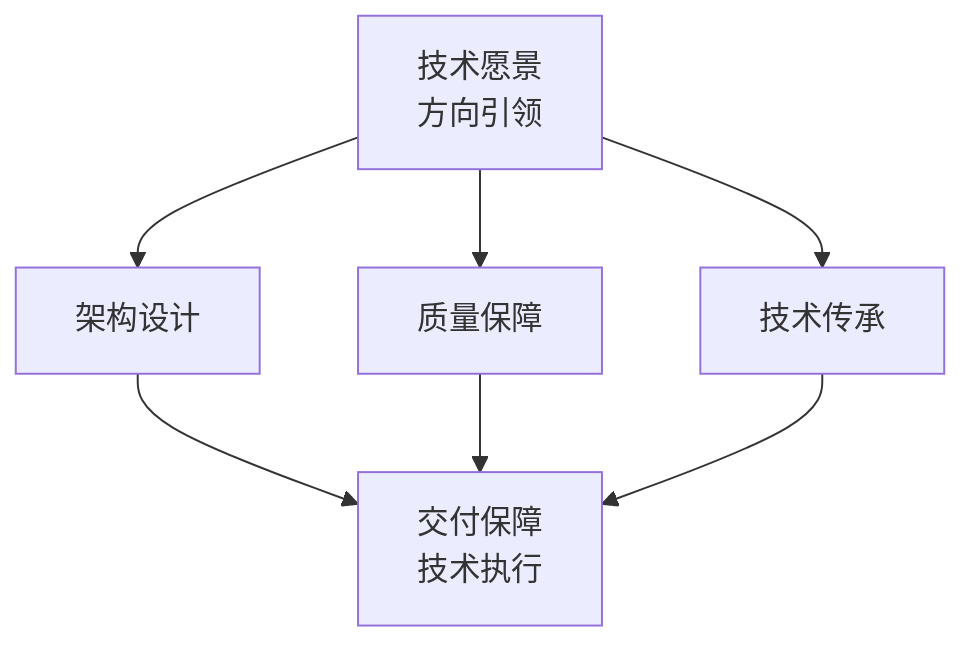
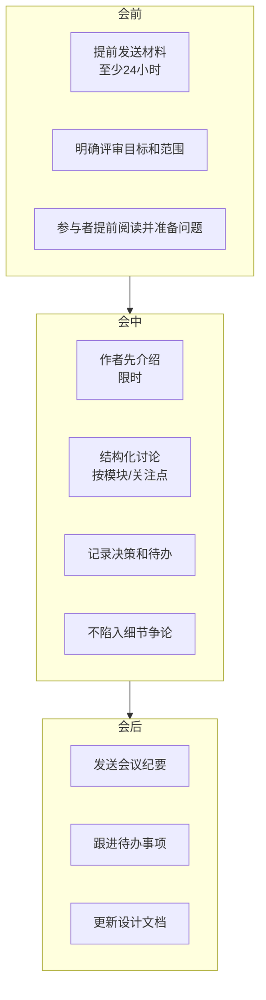
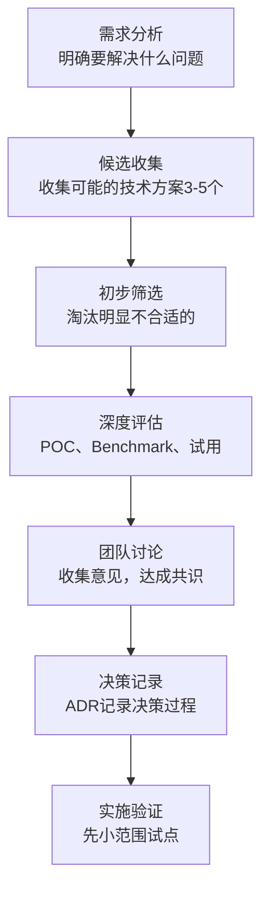
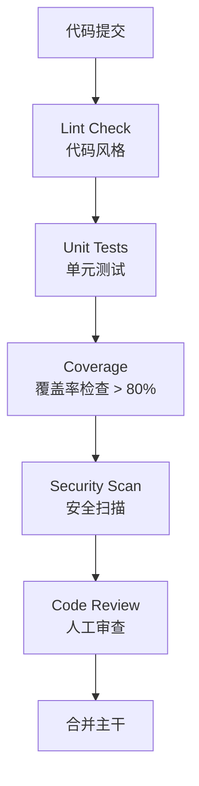
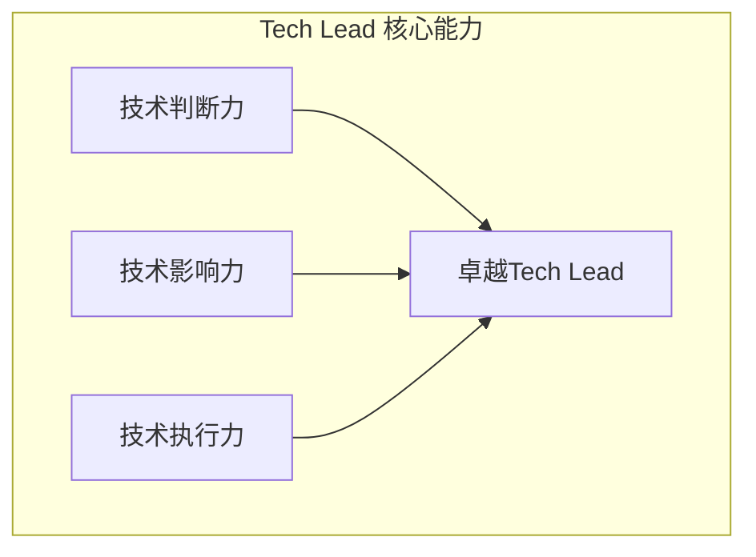

+++
title = "技术领导力与架构治理"
date = 2025-01-15
weight = 8000
description = "Tech Lead核心职责详解：技术决策、架构治理、代码质量、技术债务管理、技术选型等关键话题"
[taxonomies]
tags = ["leadership", "tech-lead", "architecture", "technical-decision", "interview"]
+++

## 概述

Tech Lead 是技术团队的技术负责人，需要在技术方向、架构设计、代码质量和团队技术成长等方面发挥领导作用。本文深入解析 Tech Lead 的核心技术职责和面试常见问题。

---

## 一、Tech Lead 的角色定位

### 1.1 Tech Lead vs Engineering Manager

**Tech Lead vs EM 职责对比：**

| Tech Lead | Engineering Manager |
|-----------|---------------------|
| 技术方向 | 人员管理 |
| 架构设计 | 招聘/绩效/晋升 |
| 代码质量 | 1:1/职业发展 |
| 技术决策 | 跨团队协调 |
| 技术债务 | 资源规划 |
| 技术导师 | 流程优化 |

> **注意**：很多公司 Tech Lead + EM 职责由同一人承担；大公司可能分开，Tech Lead 专注技术

### 1.2 Tech Lead 的核心职责

**Tech Lead 能力模型：**



| 能力领域 | 具体职责 |
|----------|----------|
| **架构设计** | 系统设计、技术选型、技术债务 |
| **质量保障** | Code Review、规范制定 |
| **技术传承** | 导师辅导、技术分享、招聘 |

---

## 二、技术决策与架构治理

### 2.1 技术决策的挑战

**面试问题**：描述一个你做过的重大技术决策

**技术决策的复杂性：**

| 维度 | 挑战 | 表现 |
|------|------|------|
| **不确定性** | 信息不完整、未来难预测 | 难以预判后果 |
| **多方利益** | 不同角色诉求不同 | 需要平衡取舍 |
| **长期影响** | 难以回退、影响深远 | 需谨慎决策 |
| **时间压力** | 业务等不了 | 快速决策 |
| **技术债务** | 理想vs现实 | 短期vs长期 |
| **团队能力** | 学习成本、执行能力 | 可行性考量 |

### 2.2 技术决策框架

**RAPID 决策模型：**

| 角色 | 含义 | 职责 |
|------|------|------|
| R - Recommend | 建议者 | 提出方案，收集信息 |
| A - Agree | 同意者 | 必须同意才能继续（如安全、合规） |
| P - Perform | 执行者 | 实施决策 |
| I - Input | 输入者 | 提供意见和建议 |
| D - Decide | 决策者 | 最终拍板 |

**技术决策检查清单：**

```
决策前：
□ 问题定义清晰了吗？
□ 收集了足够信息吗？
□ 考虑了哪些方案？
□ 评估了各方案的 Pros/Cons？
□ 咨询了相关专家吗？
□ 利益相关方知晓吗？

决策时：
□ 决策标准是什么？
□ 权衡了短期和长期影响吗？
□ 最坏情况可以接受吗？
□ 有回退方案吗？

决策后：
□ 记录了决策过程（ADR）吗？
□ 沟通给所有相关人了吗？
□ 设置了验证点吗？
```

### 2.3 架构决策记录（ADR）

**什么是 ADR：**

```
Architecture Decision Record（架构决策记录）

目的：
• 记录重要的架构决策
• 解释决策背景和原因
• 为未来提供参考
• 新人快速理解历史决策

**格式示例：**

| 字段 | 内容 |
|------|------|
| **标题** | ADR-001: 选择 PostgreSQL 作为主数据库 |
| **状态** | 已接受 |
| **日期** | 2025-01-15 |
| **决策者** | Tech Lead |
| **背景** | 我们需要选择一个关系型数据库... |
| **考虑的选项** | 1. PostgreSQL - ... 2. MySQL - ... 3. SQL Server - ... |
| **决策** | 选择 PostgreSQL，因为... |
| **后果** | 需要团队学习 PostgreSQL、获得更好的 JSON 支持 |

### 2.4 技术评审会议

**评审类型：**

| 类型 | 目的 | 参与者 | 频率 |
|------|------|--------|------|
| Design Review | 方案设计评审 | 相关开发者 | 按需 |
| Architecture Review | 架构重大变更 | 架构师/TL | 重大变更 |
| RFC Review | 跨团队影响 | 多团队代表 | 按需 |
| Tech Radar Review | 技术栈更新 | 技术委员会 | 季度 |

**评审会议最佳实践：**



---

## 三、技术选型

### 3.1 技术选型的考量维度

**面试问题**：你如何进行技术选型？

**技术选型评估矩阵：**

| 维度 | 考量因素 |
|------|----------|
| 功能匹配 | 满足当前需求？满足未来需求？ |
| 性能 | 吞吐量、延迟、资源消耗 |
| 可维护性 | 代码质量、文档、社区活跃度 |
| 学习成本 | 团队熟悉度、学习曲线 |
| 生态系统 | 周边工具、集成能力、插件 |
| 成熟度 | 生产验证、版本稳定性 |
| 社区/支持 | 社区活跃、商业支持、Stack Overflow |
| 许可证 | 开源协议、商业使用限制 |
| 成本 | 许可费、运维成本、人力成本 |
| 安全 | 漏洞历史、安全更新频率 |

### 3.2 技术选型流程

**技术选型流程：**



### 3.3 技术雷达（Tech Radar）

```
Tech Radar 四象限：

                    ADOPT
                  (推荐采用)
                     │
         TRIAL ──────┼────── ASSESS
       (可以试用)     │      (值得评估)
                     │
                   HOLD
                 (暂不推荐)

使用方式：
• 定期（如季度）更新团队的 Tech Radar
• 新技术进入时从 ASSESS 开始
• 验证后逐步移向 TRIAL → ADOPT
• 过时技术移向 HOLD
```

---

## 四、技术债务管理

### 4.1 什么是技术债务

**面试问题**：你如何看待和管理技术债务？

**技术债务的类型：**

|  | 有意债务 | 无意债务 |
|--|----------|----------|
| **定义** | "我们知道这不完美，但为了赶进度先这样" | "我们不知道更好的做法" |
| **谨慎的** | 有意识的权衡、有计划偿还 | - |
| **鲁莽的** | 快糙猛、不管后果 | - |

**常见技术债务：**
- 过时的依赖版本
- 缺失的测试
- 重复代码
- 硬编码配置
- 文档缺失
- 遗留系统
- 设计缺陷

### 4.2 技术债务的成本

```
技术债务的复利效应：

          成本
            │                           ╱
            │                         ╱
            │                       ╱
            │                     ╱
            │                   ╱
            │                ╱╱
            │             ╱╱
            │          ╱╱
            │       ╱╱
            │    ╱╱
            │ ╱╱
            └────────────────────────────── 时间

"如果不还债，利息会越来越高"

成本表现：
• 开发速度变慢（80%时间在和遗留代码搏斗）
• Bug 更多（改一处，坏三处）
• 新人上手难（理解成本高）
• 团队士气低（没人喜欢在烂代码里工作）
• 安全风险（过时依赖）
```

### 4.3 技术债务管理策略

**策略一：可视化和量化**

**技术债务看板示例：**

| 类型 | 描述 | 影响 | 优先级 | 预估 |
|------|------|------|--------|------|
| 依赖升级 | Spring Boot 2.x → 3.x | 安全 | 高 | 3天 |
| 重复代码 | 用户验证逻辑在3处重复 | 维护 | 中 | 2天 |
| 测试缺失 | 支付模块覆盖率 < 30% | 质量 | 高 | 5天 |

**策略二：分配固定容量**

**Sprint 容量分配：**

| 类型 | 占比 |
|------|------|
| 功能开发 | 80% |
| 技术债务 | 20% |

**其他方式：**
- 每个 Sprint 安排 1-2 个技术债务 Story
- 每季度安排一个"技术健康"Sprint
- 结合功能开发顺带还债（重构影响到的模块）

**策略三：童子军法则**

```
"让代码比你发现时更干净"

每次改动时：
• 顺手改进命名
• 补充缺失的注释
• 抽取重复代码
• 增加测试

不用专门安排，持续小改进
```

**策略四：与业务对话**

```
如何向非技术人员解释技术债务：

❌ "我们需要重构代码"
   → 对方不理解

✅ "我们的开发速度在变慢"
   "新功能原来2周能做完，现在需要4周"
   "因为我们的代码库变得很难维护"
   "如果花2周时间清理，之后每个功能能节省1周"
   → 用业务影响说话
```

---

## 五、代码质量保障

### 5.1 Code Review 文化

**面试问题**：你如何建立 Code Review 文化？

**Code Review 的价值：**

| 质量保障 | 知识共享 | 团队协作 |
|----------|----------|----------|
| 发现 Bug | 技术传承 | 代码共识 |
| 设计审查 | 最佳实践 | 打破孤岛 |
| 安全检查 | 新人学习 | 集体所有权 |

**Code Review 最佳实践：**

| 原则 | 说明 |
|------|------|
| 小而频繁 | 每次 PR 不超过 400 行 |
| 及时响应 | 24 小时内完成 Review |
| 尊重作者 | 提建议而非命令，对事不对人 |
| 自动化优先 | Lint、Format 让机器做 |
| 关注重点 | 设计 > 逻辑 > 风格 |

**Review 检查清单：**

```
设计层面：
□ 整体设计是否合理？
□ 是否符合现有架构？
□ 是否过度设计？

逻辑层面：
□ 逻辑是否正确？
□ 边界条件处理了吗？
□ 错误处理完善吗？

可维护性：
□ 代码是否易读？
□ 命名是否清晰？
□ 有必要的注释吗？

测试：
□ 测试覆盖了吗？
□ 测试有意义吗？

安全：
□ 有安全隐患吗？
□ 敏感信息处理正确吗？
```

### 5.2 工程规范

**工程规范体系：**

| 规范类别 | 具体内容 |
|----------|----------|
| **编码规范** | 代码风格（自动格式化）、命名约定、注释规范、错误处理规范 |
| **Git 规范** | 分支策略（Git Flow / Trunk Based）、Commit Message 格式、PR 描述模板、Merge 策略 |
| **测试规范** | 测试覆盖率要求、测试命名、Mock 使用规范、测试数据管理 |
| **API 规范** | RESTful 设计规范、错误码规范、版本控制、文档要求 |

### 5.3 自动化质量门禁

**CI/CD 质量门禁：**



---

## 六、技术团队能力建设

### 6.1 技术分享机制

**技术分享体系：**

| 类别 | 形式 |
|------|------|
| **日常分享** | 站会时的技术 Tips、Slack/Teams 技术频道、结对编程 |
| **定期分享** | 周度 Tech Talk（30-60分钟）、月度技术沙龙、读书会 |
| **知识沉淀** | 技术博客、Wiki 文档、代码示例库 |

### 6.2 技术导师制度

**作为 Tech Lead 的导师职责：**

| 对象 | 关注点 |
|------|--------|
| 初级工程师 | 基础技能、编码习惯、问题解决方法 |
| 中级工程师 | 设计能力、技术深度、独立性 |
| 高级工程师 | 架构思维、技术影响力、带人能力 |

### 6.3 技术文化塑造

```mermaid
graph TB
    subgraph "Tech Lead 塑造技术文化的方式"
        subgraph 以身作则
            A1[自己写高质量代码]
            A2[认真做 Code Review]
            A3[主动分享和学习]
            A4[承认不懂，展示求知]
        end
        
        subgraph 创造环境
            B1[心理安全<br/>可以提问和犯错]
            B2[鼓励创新<br/>Hackathon、实验项目]
            B3[认可贡献<br/>技术成就的公开认可]
            B4[时间空间<br/>学习不是"偷懒"]
        end
        
        subgraph 建立机制
            C1[定期技术分享]
            C2[技术决策透明]
            C3[技术债务可见]
            C4[持续改进复盘]
        end
    end
```

---

## 七、面试常见问题

### Q1: 你如何保持技术判断力？

```
回答要点：

1. 持续学习
   ├── 技术博客、论文、书籍
   ├── 开源社区参与
   └── 技术会议和社区

2. 动手实践
   ├── 不完全脱离编码
   ├── POC 和 Prototype
   └── Side Project

3. 与人交流
   ├── 和团队讨论
   ├── 跨公司技术交流
   └── 导师和同行

4. 关注趋势
   ├── 技术雷达
   ├── 行业动态
   └── 竞品分析
```

### Q2: 你如何平衡"做正确的事"和"快速交付"？

```
回答框架：

1. 理解业务优先级
   └── 不是所有事情都需要完美

2. 区分"必须"和"理想"
   ├── 安全、正确性 → 不能妥协
   └── 代码优雅、完美抽象 → 可以迭代

3. 明确债务
   └── 如果妥协，记录下来，计划偿还

4. 沟通透明
   └── 让利益相关方了解权衡

示例：
"这个功能如果做完美需要2周，但MVP版本3天可以上线。
 我建议先上MVP验证业务假设，
 同时我们把完善计划排进后续Sprint。"
```

### Q3: 描述一次技术决策失误

```
回答结构：

1. 坦诚承认失误
   └── 不找借口

2. 描述当时的决策过程
   └── 为什么当时觉得是对的

3. 失误的影响
   └── 造成了什么问题

4. 如何发现和纠正
   └── 采取了什么补救措施

5. 学到了什么
   └── 之后如何避免类似问题

示例：
"曾经选择了一个新兴框架，看起来很酷，但社区支持不足。
 上线后遇到问题很难找到解决方案。
 后来不得不迁移回主流框架，浪费了3个月。
 教训是：对于核心系统，成熟稳定比新潮更重要。"
```

### Q4: 你如何处理技术团队和产品团队的冲突？

**常见冲突类型及处理：**

| 冲突类型 | 处理方式 |
|----------|----------|
| 需求理解分歧 | 拉到一起对齐，确保理解一致 |
| 排期冲突 | 明确优先级标准，数据说话 |
| 技术可行性 | 解释清楚限制，提供替代方案 |
| 质量vs速度 | 量化风险，让PM做知情决策 |
| 技术债务时间 | 用业务语言解释债务成本 |

**核心原则：**
- 建立信任关系（不是对立）
- 用数据和事实沟通
- 提供选项而非只说"不行"
- 理解业务诉求，不只关心技术

---

## 八、总结

**Tech Lead 核心能力总结：**



| 能力 | 表现 |
|------|------|
| **技术判断力** | 能做出正确的技术决策、能平衡短期和长期、能识别风险和机会 |
| **技术影响力** | 能推动技术改进落地、能说服和带领团队、能建立技术文化 |
| **技术执行力** | 能保障项目技术交付、能解决技术难题、能提升团队效能 |

> "Tech Lead 是团队的技术灵魂，既要看得远，也要走得稳。"

---

## 相关文章

- [上一篇：远程与分布式团队管理](@/articles/leadership/mgr-07-远程与分布式团队管理.md)
- [下一篇：高级管理话题-组织预算与向上管理](@/articles/leadership/mgr-09-组织预算与向上管理.md)
