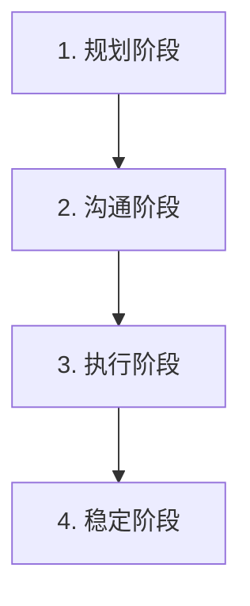
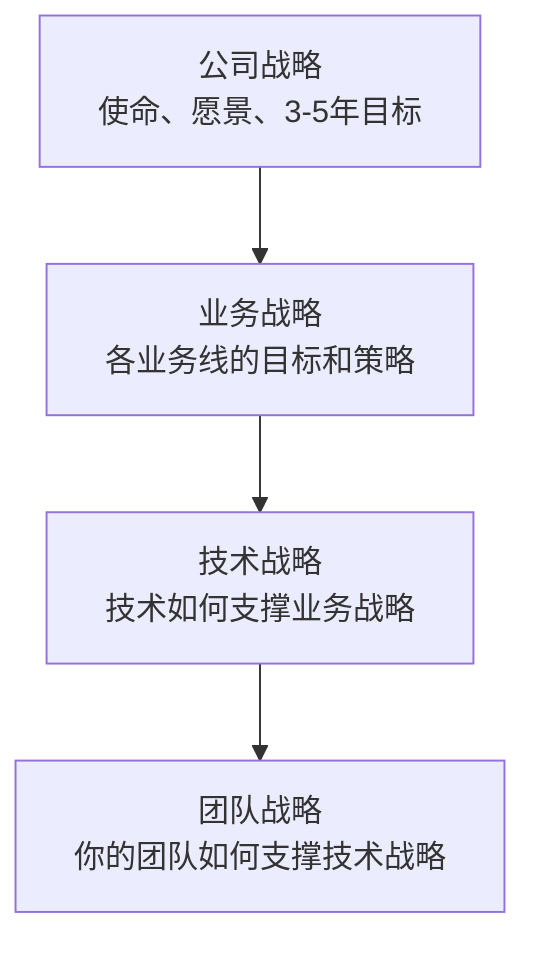

+++
title = "09. 高级管理话题-组织预算与向上管理"
date = 2025-01-15
weight = 9000
description = "Director+级别管理话题：组织架构设计、团队拆分、预算与资源规划、深度向上管理技巧"
[taxonomies]
tags = ["leadership", "management", "organization", "budget", "managing-up", "director", "interview"]
+++

## 概述

本文涵盖技术管理中较高级的话题，这些内容在 **一线 Manager/Tech Lead 面试中较少被问到**，但对于 **Director/Senior Manager** 级别或希望深入了解管理全貌的读者非常有价值。

> ⚠️ **面试频率提示**：本文话题在一线管理者面试中出现概率约 10-20%，但在 Director+ 面试中是核心考察点。

---

## 一、组织设计与团队拆分

> 📊 **面试频率**：一线 Manager ⭐ | Director+ ⭐⭐⭐⭐⭐

### 1.1 何时需要拆分团队

**团队拆分的信号：**

| 类别 | 信号 |
|------|------|
| **规模信号** | 团队超过 8-10 人、"两个披萨"喂不饱、沟通成本明显增加 |
| **业务信号** | 负责的领域变多、不同方向需要不同专注、优先级冲突频繁 |
| **技术信号** | 代码库变大，认知负担重、不同模块需要不同专业知识、依赖管理变复杂 |
| **管理信号** | Manager 带不过来、1:1 时间不够、有人准备好成为 Manager |

### 1.2 团队拆分原则

**拆分考量维度：**

| 维度 | 说明 | 示例 |
|------|------|------|
| **1. 业务边界** | 按产品线/功能域拆分 | 用户团队、订单团队、支付团队 |
| **2. 技术边界** | 按技术栈/系统拆分 | 前端团队、后端团队、数据团队 |
| **3. 客户边界** | 按服务对象拆分 | B端团队、C端团队、内部工具团队 |
| **4. 生命周期** | 按产品阶段拆分 | 新产品团队、增长团队、维护团队 |

**最佳实践：**
- 优先按业务边界拆分（端到端负责）
- 减少跨团队依赖
- 保持团队自治能力

### 1.3 拆分执行步骤

**团队拆分流程：**



| 阶段 | 具体任务 |
|------|----------|
| **1. 规划阶段** | 明确拆分原因、设计新结构、确定边界和接口、选择新 Lead |
| **2. 沟通阶段** | 向上对齐、向团队说明、收集反馈、调整计划 |
| **3. 执行阶段** | 人员分配、系统/代码切分、流程调整、工具权限调整 |
| **4. 稳定阶段** | 建立协作机制、监控运行状况、调整和优化 |

### 1.4 组织架构模式

**常见技术组织架构：**

| 架构类型 | 分组方式 | 优点 | 缺点 |
|----------|----------|------|------|
| **功能型 (Functional)** | 按职能分组：前端、后端、QA、运维 | 专业深度、资源共享 | 跨团队协作成本高、端到端慢 |
| **产品型 (Product/Feature)** | 按产品/功能分组：搜索团队、推荐团队 | 端到端负责、快速迭代 | 技术可能重复建设 |
| **矩阵型 (Matrix)** | 双线汇报：职能 + 产品 | 兼顾专业和产品 | 复杂、权责不清 |
| **平台型 (Platform)** | 平台团队 + 业务团队 | 基础能力复用、业务快速迭代 | 平台优先级与业务冲突 |

> **趋势**：越来越多公司采用产品型 + 平台型混合

---

## 二、预算与资源规划

> 📊 **面试频率**：一线 Manager ⭐ | Director+ ⭐⭐⭐⭐⭐

### 2.1 技术团队预算组成

**技术团队预算结构：**

| 类别 | 占比 | 具体项目 |
|------|------|----------|
| **人力成本** | 60-80% | 薪酬（基本工资 + 奖金）、福利（保险、公积金等）、招聘成本（猎头、广告）、培训费用 |
| **基础设施** | 10-25% | 云服务费用（AWS/GCP/Azure）、服务器/硬件、第三方 SaaS 工具、数据存储 |
| **其他** | 5-15% | 差旅费、会议/活动、软件许可证、办公设备 |

### 2.2 Headcount 规划

**面试问题**：你如何进行人员规划？

**Headcount 规划流程：**

| 步骤 | 具体任务 |
|------|----------|
| **1. 业务需求驱动** | 明年业务目标是什么？需要哪些新能力/项目？现有团队能支撑吗？ |
| **2. 现状分析** | 当前人员配置、预计离职（自然流失率）、能力缺口 |
| **3. 制定计划** | 需要新增多少 HC、什么级别/技能、什么时间到位 |
| **4. 预算核算** | 每个 HC 的全成本、招聘成本、与财务对齐 |
| **5. 审批与调整** | 向上汇报争取、根据反馈调整、确定最终 HC |

### 2.3 预算申请与谈判

**争取预算的技巧：**

| 技巧 | 说明 |
|------|------|
| **1. 业务价值导向** | ❌ "我们需要 3 个工程师"<br>✅ "增加 3 个工程师可以让 X 项目提前 3 个月上线，预计带来 Y 万收入" |
| **2. 数据支撑** | 当前负载数据、产能与需求对比、市场薪酬数据 |
| **3. 优先级排序** | 如果只给一半预算，你会怎么分配？展示你的判断力 |
| **4. 备选方案** | 如果不批准，有什么替代方案？外包？延期？砍需求？ |
| **5. 建立信任** | 过去申请的预算用得如何？有没有省下来的？历史记录影响未来信任 |

### 2.4 成本优化

**技术成本优化方向：**

| 类别 | 优化措施 |
|------|----------|
| **云成本优化** | Reserved Instances / Savings Plans、自动扩缩容、清理闲置资源、选择合适的实例类型、多云/混合云策略 |
| **人力成本优化** | 提升效率（工具、自动化）、合理的外包策略、远程招聘扩大人才池、减少不必要的招聘 |
| **工具成本优化** | 整合重复工具、谈判更好的合同、评估开源替代 |

> **注意**：成本优化不是"省钱"，是"花对钱"

---

## 三、向上管理（深度版）

> 📊 **面试频率**：一线 Manager ⭐⭐⭐ | Director+ ⭐⭐⭐⭐

### 3.1 向上管理的本质

**向上管理是什么：**

| 不是 | 而是 |
|------|------|
| 拍马屁 | 建立有效的工作关系 |
| 操纵上级 | 帮助上级做出更好的决策 |
| 政治手段 | 获取团队需要的资源和支持、让你的工作被看见和认可 |

> "你的上级也是人，也需要被管理。你有责任让这个关系有效运作。"

### 3.2 了解你的上级

**了解上级的关键维度：**

| 维度 | 关注点 |
|------|--------|
| **沟通偏好** | 喜欢邮件还是 Slack？喜欢书面还是口头？喜欢细节还是概要？什么时间沟通效果好？ |
| **决策风格** | 喜欢自己决定还是听取意见？需要多少数据支撑？风险偏好如何？ |
| **压力来源** | 他的 KPI 是什么？他在担心什么？他的上级在意什么？ |
| **期望** | 对你的期望是什么？多久同步一次？什么情况需要升级？ |

### 3.3 向上沟通技巧

**有效的向上沟通：**

| 原则 | 具体做法 |
|------|----------|
| **1. 定期同步，无惊喜** | 建立固定的 1:1 节奏、主动汇报不等被问、好消息和坏消息都要说、不让上级在会上被 surprise |
| **2. 汇报要结构化** | 先结论后细节、金字塔原则、区分 FYI 和需要决策 |
| **3. 带方案不带纯问题** | ❌ "项目要延期了"<br>✅ "项目可能延期 2 周，我有 3 个方案：..." |
| **4. 帮助上级成功** | 让他在他的上级面前有好的汇报、提供他需要的数据和信息、理解他的处境和难处 |
| **5. 管理期望** | 承诺要保守、交付要超预期、Under promise, over deliver |

### 3.4 争取资源和支持

**向上争取资源：**

| 策略 | 具体做法 |
|------|----------|
| **1. 选择时机** | 在他心情好/不忙的时候、在刚完成好的交付之后、在预算周期之前 |
| **2. 铺垫** | 不要突然提出大请求、提前种种子、让他参与问题发现过程 |
| **3. 框架** | 问题/挑战是什么、对业务的影响、需要什么资源、预期产出、不给资源的后果 |
| **4. 留有余地** | 如果不能全部满足，最低需要什么、有没有替代方案 |

### 3.5 处理分歧

**与上级意见不同时：**

| 原则 | 具体做法 |
|------|----------|
| **1. 私下表达** | 不在公开场合反驳、1:1 时诚实表达看法 |
| **2. 用事实和数据** | 不是"我觉得"，而是"数据显示"、准备充分再谈 |
| **3. 理解他的视角** | 他可能知道你不知道的、问"我是不是遗漏了什么信息？" |
| **4. 表达后尊重决定** | "Disagree and commit"、表达了意见后执行决定、不在背后抱怨 |
| **5. 知道什么时候升级** | 如果涉及原则/合规/道德、可能需要更高层级介入 |

---

## 四、战略思维

> 📊 **面试频率**：一线 Manager ⭐ | Director+ ⭐⭐⭐⭐⭐

### 4.1 技术战略的层次

**技术战略层次：**



| 层次 | 内容 |
|------|------|
| **公司战略** | 公司的使命、愿景、3-5年目标 |
| **业务战略** | 各业务线的目标和策略 |
| **技术战略** | 技术愿景、技术路线图、能力建设 |
| **团队战略** | 团队目标、项目优先级、人员发展 |

### 4.2 制定技术路线图

**技术路线图制定：**

| 阶段 | 内容 |
|------|------|
| **输入** | 业务目标和需求、当前技术状态、技术债务、行业趋势、团队能力 |
| **过程** | 1. 识别关键主题 2. 评估优先级（影响 vs 工作量）3. 依赖分析 4. 资源评估 5. 时间规划 |
| **输出** | 季度/年度技术主题、关键里程碑、资源需求、风险和依赖 |

| 时间范围 | 内容 |
|----------|------|
| 短期（本季度） | 具体项目 |
| 中期（1年） | 主题方向 |
| 长期（2-3年） | 愿景 |

---

## 五、变革管理

> 📊 **面试频率**：一线 Manager ⭐⭐ | Director+ ⭐⭐⭐⭐

### 5.1 推动变革的挑战

**变革阻力来源：**

| 层面 | 阻力来源 |
|------|----------|
| **个人层面** | 习惯舒适区、担心能力不足、过去的失败经历、不理解变革原因 |
| **组织层面** | 流程惯性、利益格局、资源限制、文化阻力 |

### 5.2 变革管理框架

**Kotter 变革八步法：**

| 步骤 | 说明 |
|------|------|
| **1. 建立紧迫感** | 让人理解为什么必须改变 |
| **2. 组建变革联盟** | 找到支持者和影响者 |
| **3. 形成愿景** | 描绘变革后的美好图景 |
| **4. 沟通愿景** | 反复传达，多种渠道 |
| **5. 移除障碍** | 解决阻碍变革的因素 |
| **6. 创造短期胜利** | 快速见效，建立信心 |
| **7. 巩固成果** | 不要过早宣布胜利 |
| **8. 固化到文化** | 让变革成为新常态 |

---

## 六、面试问题

### Q1: 你如何规划团队的 Headcount？

> ⚠️ **Director+ 常见问题**

```
回答框架：

1. 业务驱动
   └── 从业务目标倒推需要的能力和产能

2. 现状分析
   ├── 当前团队配置
   ├── 预计流失
   └── 能力缺口

3. 规划过程
   ├── 需要多少人、什么技能
   ├── 什么时间到位
   └── 预算核算

4. 向上沟通
   ├── 用业务价值说服
   ├── 优先级排序
   └── 备选方案
```

### Q2: 如何向上级争取资源？

```
回答要点：

1. 建立信任基础
   └── 过往交付记录

2. 业务价值框架
   └── 用投入产出比说话

3. 数据支撑
   └── 不是拍脑袋

4. 理解上级处境
   └── 帮他解决他的问题

5. 灵活度
   └── 提供选项，不是最后通牒
```

### Q3: 如何管理你的上级？

```
回答框架：

"向上管理的核心是建立有效的工作关系。

我的做法：
1. 了解他的沟通偏好和决策风格
2. 定期同步，无惊喜
3. 汇报时先结论后细节
4. 带方案不带纯问题
5. 帮助他在他的上级面前成功

有分歧时，我会私下表达意见，
一旦决定做出，就 disagree and commit。"
```

### Q4: 什么时候应该拆分团队？

> ⚠️ **Director+ 常见问题**

```
信号识别：

1. 规模信号
   └── 超过 8-10 人，沟通成本高

2. 业务信号
   └── 多个方向，优先级冲突

3. 技术信号
   └── 代码库大，需要不同专业

4. 管理信号
   └── Manager 带不过来

拆分原则：
├── 优先按业务边界
├── 端到端负责
├── 减少跨团队依赖
└── 考虑人才梯队
```

---

## 七、自检清单

```
高级管理能力自检：

组织设计：
□ 理解不同组织架构的优缺点
□ 知道什么时候该拆分团队
□ 能设计跨团队协作机制

预算规划：
□ 理解预算周期和流程
□ 能做 Headcount 规划
□ 能用业务语言争取资源
□ 能做成本优化

向上管理：
□ 了解上级的沟通偏好
□ 定期同步，无惊喜
□ 能有效争取资源
□ 能处理分歧

战略思维：
□ 理解公司/业务战略
□ 能制定技术路线图
□ 能做优先级决策
□ 能推动变革
```

---

## 总结

**高级管理者的能力跃迁：**

| 一线 Manager | Director+ |
|--------------|-----------|
| 带团队 | 设计组织 |
| 争取 HC | 规划预算 |
| 向上汇报 | 战略伙伴 |
| 执行项目 | 制定路线图 |
| 处理问题 | 推动变革 |

> "一线 Manager 是执行者，Director 是设计者和推动者。"

**提示**：这些话题在一线 Manager 面试中较少出现，但理解它们有助于：
- 更好地理解上级的工作
- 为未来晋升做准备
- 在需要时能够参与讨论

---

## 相关文章

- [上一篇：技术领导力与架构治理](@/articles/leadership/mgr-08-技术领导力与架构治理.md)
- [下一篇：管理者面试高频问题汇总](@/articles/leadership/mgr-10-管理者面试问题汇总.md)
