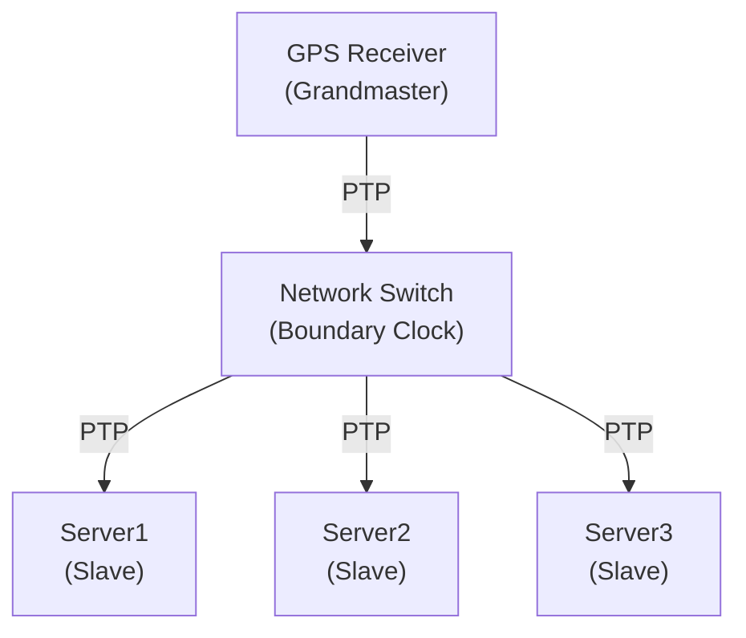

+++
title = "10.Linux时间子系统(HFT)"
slug = "linux-10-Linux时间子系统"
description = "深入讲解Linux时间子系统：时钟源、TSC、HPET、PTP精确时间协议、时间精度、clocksource与nohz模式"
date = 2026-01-21
draft = false
[taxonomies]
tags = ["Linux", "时间", "TSC", "PTP", "HFT"]
+++

# Linux时间子系统(HFT)

## 概述

精确的时间测量对HFT系统至关重要。Linux时间子系统提供了多种时钟源和API，理解其工作原理是进行低延迟优化的基础。

## 一、时钟源（Clocksource）

### 1.1 可用时钟源

```bash
# 查看可用时钟源
cat /sys/devices/system/clocksource/clocksource0/available_clocksource
# 输出示例: tsc hpet acpi_pm

# 查看当前时钟源
cat /sys/devices/system/clocksource/clocksource0/current_clocksource
# 输出示例: tsc

# 切换时钟源（需要root）
echo hpet > /sys/devices/system/clocksource/clocksource0/current_clocksource
```

### 1.2 时钟源对比

| 时钟源 | 精度 | 读取延迟 | 稳定性 | 适用场景 |
|--------|------|----------|--------|----------|
| TSC | 纳秒级 | ~10-20ns | 可能不稳定 | HFT首选 |
| HPET | 100ns | ~500ns | 稳定 | 通用场景 |
| ACPI_PM | 微秒级 | ~1µs | 非常稳定 | 旧系统 |
| PIT | 毫秒级 | 很慢 | 稳定 | 极旧系统 |

### 1.3 TSC（Time Stamp Counter）

```c
#include <stdint.h>

/* 读取TSC */
static inline uint64_t rdtsc(void) {
    uint32_t lo, hi;
    __asm__ __volatile__ ("rdtsc" : "=a" (lo), "=d" (hi));
    return ((uint64_t)hi << 32) | lo;
}

/* RDTSCP - 序列化读取，确保指令完成 */
static inline uint64_t rdtscp(uint32_t *cpu_id) {
    uint32_t lo, hi, cpu;
    __asm__ __volatile__ ("rdtscp" : "=a" (lo), "=d" (hi), "=c" (cpu));
    if (cpu_id) *cpu_id = cpu;
    return ((uint64_t)hi << 32) | lo;
}

/* 使用LFENCE确保序列化 */
static inline uint64_t rdtsc_ordered(void) {
    __asm__ __volatile__ ("lfence");
    return rdtsc();
}
```

### 1.4 TSC校准

```c
#include <time.h>
#include <stdio.h>

/* TSC频率校准 */
double calibrate_tsc_frequency(void) {
    struct timespec start, end;
    uint64_t tsc_start, tsc_end;
    
    /* 第一次测量 */
    clock_gettime(CLOCK_MONOTONIC, &start);
    tsc_start = rdtsc();
    
    /* 等待足够时间 */
    struct timespec delay = {0, 100000000}; /* 100ms */
    nanosleep(&delay, NULL);
    
    /* 第二次测量 */
    clock_gettime(CLOCK_MONOTONIC, &end);
    tsc_end = rdtsc();
    
    /* 计算经过的时间（纳秒） */
    double elapsed_ns = (end.tv_sec - start.tv_sec) * 1e9 + 
                        (end.tv_nsec - start.tv_nsec);
    
    /* 计算TSC频率（Hz） */
    double tsc_freq = (tsc_end - tsc_start) / elapsed_ns * 1e9;
    
    return tsc_freq;
}

/* TSC转纳秒 */
static double tsc_freq_ghz;

void init_tsc_converter(void) {
    tsc_freq_ghz = calibrate_tsc_frequency() / 1e9;
    printf("TSC频率: %.3f GHz\n", tsc_freq_ghz);
}

double tsc_to_ns(uint64_t tsc_cycles) {
    return tsc_cycles / tsc_freq_ghz;
}

int main(void) {
    init_tsc_converter();
    
    /* 测量函数执行时间 */
    uint64_t start = rdtscp(NULL);
    
    /* 要测量的代码 */
    volatile int x = 0;
    for (int i = 0; i < 1000; i++) x++;
    
    uint64_t end = rdtscp(NULL);
    
    printf("执行时间: %.2f ns\n", tsc_to_ns(end - start));
    
    return 0;
}
```

## 二、时间API

### 2.1 用户空间时间API

```c
#include <time.h>
#include <sys/time.h>

/* clock_gettime - 推荐使用 */
void demo_clock_gettime(void) {
    struct timespec ts;
    
    /* CLOCK_REALTIME - 系统实时时间（可能被NTP调整） */
    clock_gettime(CLOCK_REALTIME, &ts);
    
    /* CLOCK_MONOTONIC - 单调时钟（不会后退） */
    clock_gettime(CLOCK_MONOTONIC, &ts);
    
    /* CLOCK_MONOTONIC_RAW - 原始单调时钟（不受NTP影响） */
    clock_gettime(CLOCK_MONOTONIC_RAW, &ts);
    
    /* CLOCK_BOOTTIME - 包含休眠时间的单调时钟 */
    clock_gettime(CLOCK_BOOTTIME, &ts);
}

/* gettimeofday - 微秒精度，较老的API */
void demo_gettimeofday(void) {
    struct timeval tv;
    gettimeofday(&tv, NULL);
    printf("时间: %ld.%06ld\n", tv.tv_sec, tv.tv_usec);
}

/* time() - 秒精度，最简单 */
void demo_time(void) {
    time_t t = time(NULL);
    printf("时间: %ld\n", t);
}
```

### 2.2 clock_gettime开销测量

```c
#include <stdio.h>
#include <time.h>
#include <stdint.h>

/* 测量各种时间API的开销 */
void benchmark_time_apis(int iterations) {
    struct timespec ts;
    struct timeval tv;
    uint64_t start, end;
    
    /* clock_gettime CLOCK_REALTIME */
    start = rdtscp(NULL);
    for (int i = 0; i < iterations; i++) {
        clock_gettime(CLOCK_REALTIME, &ts);
    }
    end = rdtscp(NULL);
    printf("clock_gettime(REALTIME):     %.1f ns/call\n", 
           tsc_to_ns(end - start) / iterations);
    
    /* clock_gettime CLOCK_MONOTONIC */
    start = rdtscp(NULL);
    for (int i = 0; i < iterations; i++) {
        clock_gettime(CLOCK_MONOTONIC, &ts);
    }
    end = rdtscp(NULL);
    printf("clock_gettime(MONOTONIC):    %.1f ns/call\n", 
           tsc_to_ns(end - start) / iterations);
    
    /* clock_gettime CLOCK_MONOTONIC_RAW */
    start = rdtscp(NULL);
    for (int i = 0; i < iterations; i++) {
        clock_gettime(CLOCK_MONOTONIC_RAW, &ts);
    }
    end = rdtscp(NULL);
    printf("clock_gettime(MONOTONIC_RAW): %.1f ns/call\n", 
           tsc_to_ns(end - start) / iterations);
    
    /* gettimeofday */
    start = rdtscp(NULL);
    for (int i = 0; i < iterations; i++) {
        gettimeofday(&tv, NULL);
    }
    end = rdtscp(NULL);
    printf("gettimeofday:                %.1f ns/call\n", 
           tsc_to_ns(end - start) / iterations);
    
    /* RDTSC */
    start = rdtscp(NULL);
    for (int i = 0; i < iterations; i++) {
        rdtsc();
    }
    end = rdtscp(NULL);
    printf("rdtsc:                       %.1f ns/call\n", 
           tsc_to_ns(end - start) / iterations);
    
    /* RDTSCP */
    start = rdtscp(NULL);
    for (int i = 0; i < iterations; i++) {
        rdtscp(NULL);
    }
    end = rdtscp(NULL);
    printf("rdtscp:                      %.1f ns/call\n", 
           tsc_to_ns(end - start) / iterations);
}
```

### 2.3 VDSO加速

```bash
# 检查VDSO映射
cat /proc/self/maps | grep vdso
# 输出: 7fff12345000-7fff12346000 r-xp 00000000 00:00 0   [vdso]

# VDSO支持的时钟源（无需系统调用）
# - clock_gettime(CLOCK_REALTIME)
# - clock_gettime(CLOCK_MONOTONIC)
# - gettimeofday
# - time
```

## 三、PTP（精确时间协议）

### 3.1 PTP架构



### 3.2 PTP配置

```bash
# 安装linuxptp
apt install linuxptp

# PTP4L配置 (/etc/linuxptp/ptp4l.conf)
cat > /etc/linuxptp/ptp4l.conf << 'EOF'
[global]
twoStepFlag             1
slaveOnly               1
priority1               128
priority2               128
domainNumber            0

# 时钟伺服参数
clock_servo             pi
pi_proportional_const   0.0
pi_integral_const       0.0
step_threshold          0.00002
first_step_threshold    0.00002

# 使用硬件时间戳
time_stamping           hardware
delay_mechanism         E2E
network_transport       L2

[eth0]
logAnnounceInterval     0
logSyncInterval         -4
logMinDelayReqInterval  -4
announceReceiptTimeout  3
EOF

# 启动ptp4l
ptp4l -f /etc/linuxptp/ptp4l.conf -i eth0

# PHC2SYS - 将PHC同步到系统时钟
phc2sys -s eth0 -c CLOCK_REALTIME -w
```

### 3.3 PTP状态监控

```bash
#!/bin/bash
# ptp_monitor.sh - PTP状态监控

echo "=== PTP状态监控 ==="

# PMC命令查询状态
echo -e "\n>>> 时钟信息:"
pmc -u -b 0 'GET CLOCK_DESCRIPTION' 2>/dev/null

echo -e "\n>>> 当前数据集:"
pmc -u -b 0 'GET CURRENT_DATA_SET' 2>/dev/null

echo -e "\n>>> 父时钟信息:"
pmc -u -b 0 'GET PARENT_DATA_SET' 2>/dev/null

echo -e "\n>>> 时间属性:"
pmc -u -b 0 'GET TIME_PROPERTIES_DATA_SET' 2>/dev/null

# 从ptp4l日志获取偏移信息
echo -e "\n>>> 最近偏移记录:"
journalctl -u ptp4l --since "5 minutes ago" -n 10 | grep offset

# 硬件时间戳支持检查
echo -e "\n>>> 硬件时间戳支持:"
ethtool -T eth0 2>/dev/null | head -20
```

### 3.4 硬件时间戳

```c
#include <linux/net_tstamp.h>
#include <sys/socket.h>
#include <sys/ioctl.h>
#include <net/if.h>

/* 启用硬件时间戳 */
int enable_hw_timestamp(int sock, const char *ifname) {
    struct ifreq ifr;
    struct hwtstamp_config hwconfig;
    
    memset(&ifr, 0, sizeof(ifr));
    strncpy(ifr.ifr_name, ifname, IFNAMSIZ - 1);
    
    memset(&hwconfig, 0, sizeof(hwconfig));
    hwconfig.tx_type = HWTSTAMP_TX_ON;
    hwconfig.rx_filter = HWTSTAMP_FILTER_ALL;
    
    ifr.ifr_data = (void *)&hwconfig;
    
    if (ioctl(sock, SIOCSHWTSTAMP, &ifr) < 0) {
        perror("SIOCSHWTSTAMP");
        return -1;
    }
    
    /* 配置socket选项 */
    int flags = SOF_TIMESTAMPING_RX_HARDWARE |
                SOF_TIMESTAMPING_TX_HARDWARE |
                SOF_TIMESTAMPING_RAW_HARDWARE;
    
    if (setsockopt(sock, SOL_SOCKET, SO_TIMESTAMPING, 
                   &flags, sizeof(flags)) < 0) {
        perror("SO_TIMESTAMPING");
        return -1;
    }
    
    return 0;
}

/* 获取接收时间戳 */
int64_t get_rx_hw_timestamp(struct msghdr *msg) {
    struct cmsghdr *cmsg;
    
    for (cmsg = CMSG_FIRSTHDR(msg); cmsg != NULL; 
         cmsg = CMSG_NXTHDR(msg, cmsg)) {
        
        if (cmsg->cmsg_level == SOL_SOCKET &&
            cmsg->cmsg_type == SO_TIMESTAMPING) {
            
            struct timespec *ts = (struct timespec *)CMSG_DATA(cmsg);
            /* ts[0]: 软件时间戳
             * ts[1]: 已弃用
             * ts[2]: 硬件时间戳 */
            return ts[2].tv_sec * 1000000000LL + ts[2].tv_nsec;
        }
    }
    return -1;
}
```

## 四、nohz模式

### 4.1 Tickless内核

```bash
# 检查nohz配置
cat /proc/cmdline | tr ' ' '\n' | grep nohz

# 配置选项
# nohz=on        - 启用动态时钟（默认）
# nohz_full=2-7  - 指定CPU完全无tick

# 查看CPU tick模式
cat /sys/devices/system/cpu/cpu0/cpufreq/affected_cpus
```

### 4.2 nohz_full配置

```bash
# GRUB配置
GRUB_CMDLINE_LINUX="nohz_full=2-15 rcu_nocbs=2-15"

# 验证配置
cat /sys/devices/system/cpu/nohz_full
# 输出: 2-15

# 检查tick状态
cat /proc/timer_list | grep "cpu: 2" -A 20
```

### 4.3 减少时钟中断

```c
/* 在隔离CPU上避免时钟中断 */

#include <sched.h>
#include <sys/mman.h>

void setup_realtime_thread(int cpu) {
    /* 设置CPU亲和性 */
    cpu_set_t cpuset;
    CPU_ZERO(&cpuset);
    CPU_SET(cpu, &cpuset);
    sched_setaffinity(0, sizeof(cpuset), &cpuset);
    
    /* 设置实时优先级 */
    struct sched_param param;
    param.sched_priority = 90;
    sched_setscheduler(0, SCHED_FIFO, &param);
    
    /* 锁定内存 */
    mlockall(MCL_CURRENT | MCL_FUTURE);
}
```

## 五、时间测量最佳实践

### 5.1 高精度延迟测量

```c
#include <stdio.h>
#include <stdint.h>

/* 高精度延迟测量类 */
typedef struct {
    uint64_t start_tsc;
    uint64_t end_tsc;
    double tsc_freq_ghz;
} LatencyMeasure;

void latency_init(LatencyMeasure *lm, double tsc_freq_ghz) {
    lm->tsc_freq_ghz = tsc_freq_ghz;
}

static inline void latency_start(LatencyMeasure *lm) {
    /* 使用RDTSCP确保序列化 */
    uint32_t cpu;
    lm->start_tsc = rdtscp(&cpu);
}

static inline void latency_end(LatencyMeasure *lm) {
    uint32_t cpu;
    lm->end_tsc = rdtscp(&cpu);
}

double latency_get_ns(const LatencyMeasure *lm) {
    return (lm->end_tsc - lm->start_tsc) / lm->tsc_freq_ghz;
}

uint64_t latency_get_cycles(const LatencyMeasure *lm) {
    return lm->end_tsc - lm->start_tsc;
}
```

### 5.2 时间戳日志

```c
/* 带时间戳的日志系统 */
#include <stdarg.h>

static uint64_t log_start_tsc;
static double log_tsc_freq_ghz;

void log_init(double tsc_freq_ghz) {
    log_tsc_freq_ghz = tsc_freq_ghz;
    log_start_tsc = rdtscp(NULL);
}

void log_msg(const char *fmt, ...) {
    uint64_t now = rdtscp(NULL);
    double elapsed_us = (now - log_start_tsc) / log_tsc_freq_ghz / 1000.0;
    
    printf("[%12.3f us] ", elapsed_us);
    
    va_list args;
    va_start(args, fmt);
    vprintf(fmt, args);
    va_end(args);
    
    printf("\n");
}

/* 使用示例 */
void demo_logging(void) {
    log_init(3.0);  /* 3 GHz TSC */
    
    log_msg("开始处理");
    /* ... 一些操作 ... */
    log_msg("处理完成");
}
```

### 5.3 时间同步检查

```python
#!/usr/bin/env python3
"""时间同步质量检查"""

import subprocess
import re

def check_ptp_sync():
    """检查PTP同步状态"""
    try:
        output = subprocess.check_output(
            ["pmc", "-u", "-b", "0", "GET CURRENT_DATA_SET"],
            stderr=subprocess.DEVNULL
        ).decode()
        
        # 解析偏移
        match = re.search(r'offsetFromMaster\s+([-\d.]+)', output)
        if match:
            offset_ns = float(match.group(1))
            print(f"PTP偏移: {offset_ns:.0f} ns")
            
            if abs(offset_ns) < 100:
                print("  状态: 优秀 (<100ns)")
            elif abs(offset_ns) < 1000:
                print("  状态: 良好 (<1µs)")
            else:
                print("  状态: 需要检查 (>1µs)")
            
            return offset_ns
    except Exception as e:
        print(f"PTP检查失败: {e}")
    
    return None

def check_ntp_sync():
    """检查NTP同步状态"""
    try:
        output = subprocess.check_output(
            ["chronyc", "tracking"],
            stderr=subprocess.DEVNULL
        ).decode()
        
        # 解析偏移
        for line in output.split('\n'):
            if 'Last offset' in line:
                match = re.search(r'([-\d.]+)\s*(seconds|ms|us|ns)', line)
                if match:
                    value = float(match.group(1))
                    unit = match.group(2)
                    
                    # 转换为纳秒
                    multipliers = {'seconds': 1e9, 'ms': 1e6, 'us': 1e3, 'ns': 1}
                    offset_ns = value * multipliers.get(unit, 1)
                    
                    print(f"NTP偏移: {offset_ns:.0f} ns")
                    return offset_ns
    except Exception as e:
        print(f"NTP检查失败: {e}")
    
    return None

if __name__ == "__main__":
    print("=== 时间同步检查 ===\n")
    check_ptp_sync()
    print()
    check_ntp_sync()
```

## 六、面试常见问题

### Q1: RDTSC和RDTSCP的区别？

**答案**：
- **RDTSC**：仅读取TSC，不保证指令序列化，可能被CPU乱序执行
- **RDTSCP**：读取TSC并返回processor ID，保证之前的指令已完成
- **使用建议**：测量时用RDTSCP或RDTSC配合LFENCE

### Q2: 为什么HFT系统需要PTP？

**答案**：
- NTP精度通常只有毫秒级，PTP可达亚微秒级
- 交易所时间戳需要精确匹配
- 延迟测量需要纳秒级精度
- 监管要求时间同步（如MiFID II要求微秒级）

### Q3: nohz_full的作用？

**答案**：
- 消除指定CPU上的时钟tick中断
- 减少延迟抖动（可从100µs减少到<10µs）
- 适用于运行实时任务的隔离CPU
- 配合isolcpus和rcu_nocbs使用效果最佳

## 总结

Linux时间子系统的核心要点：

1. **TSC**：最快的时间源，需要校准和验证稳定性
2. **clock_gettime**：推荐的用户空间API，VDSO加速
3. **PTP**：亚微秒级同步，HFT必备
4. **nohz_full**：减少时钟中断，降低抖动
5. **硬件时间戳**：最精确的网络延迟测量

精确的时间测量是HFT系统的基础能力。

---

## 相关文章

- [上一篇：Linux内核网络栈详解(HFT)](/articles/linux/linux-09-Linux内核网络栈详解/)
- [下一篇：内存映射与高效IO(HFT)](/articles/linux/linux-11-内存映射与高效IO/)
