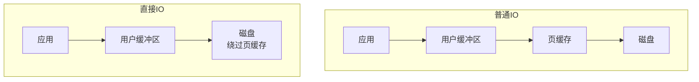
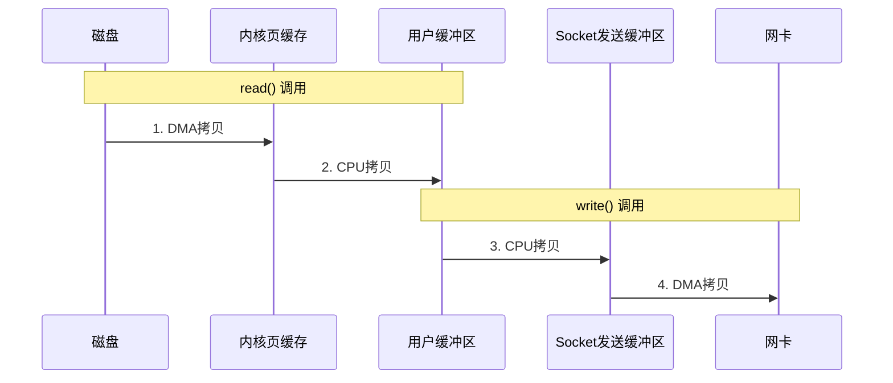
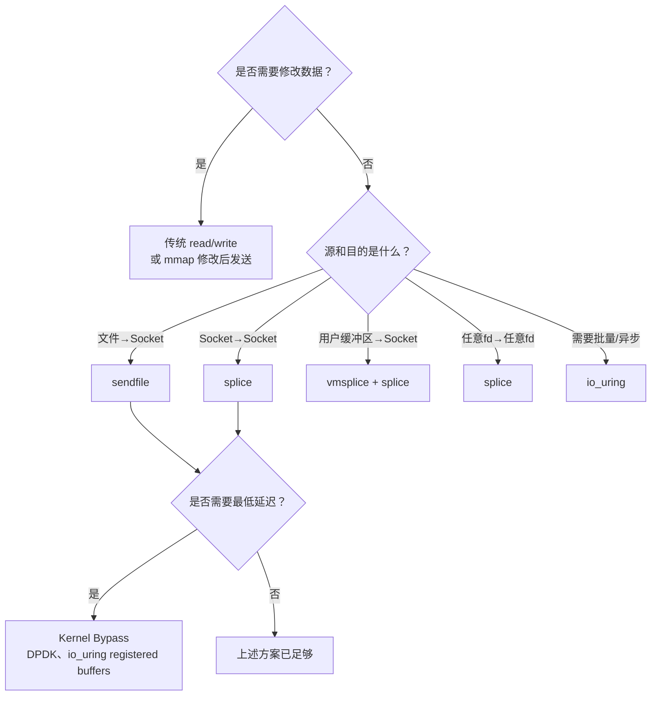

+++
title = "内存映射与高效IO(HFT)"
slug = "linux-11-内存映射与高效IO"
description = "深入讲解Linux高效IO：mmap原理与陷阱、Huge Pages、THP透明大页、O_DIRECT直接IO、AIO与零拷贝技术"
date = 2026-01-21
weight = 11000
draft = false
[taxonomies]
tags = ["Linux", "mmap", "Huge Pages", "IO", "零拷贝", "HFT"]
+++

# 内存映射与高效IO(HFT)

## 概述

高效的内存和IO管理是低延迟系统的关键。本文深入介绍mmap、Huge Pages、直接IO和零拷贝等技术，帮助优化HFT系统性能。

## 一、mmap内存映射

### 1.1 mmap原理

```c
#include <sys/mman.h>

void *mmap(void *addr, size_t length, int prot, int flags,
           int fd, off_t offset);

/* 参数说明:
 * addr   - 期望映射地址（通常为NULL让内核选择）
 * length - 映射长度
 * prot   - 保护模式（PROT_READ, PROT_WRITE, PROT_EXEC）
 * flags  - 映射类型（MAP_SHARED, MAP_PRIVATE, MAP_ANONYMOUS等）
 * fd     - 文件描述符（匿名映射为-1）
 * offset - 文件偏移
 */
```

### 1.2 mmap使用示例

```c
#include <sys/mman.h>
#include <fcntl.h>
#include <unistd.h>
#include <stdio.h>
#include <string.h>

/* 文件映射 */
void *map_file(const char *path, size_t *size) {
    int fd = open(path, O_RDONLY);
    if (fd < 0) return NULL;
    
    /* 获取文件大小 */
    *size = lseek(fd, 0, SEEK_END);
    
    /* 映射文件 */
    void *addr = mmap(NULL, *size, PROT_READ, MAP_PRIVATE, fd, 0);
    
    close(fd);  /* 映射后可以关闭fd */
    
    if (addr == MAP_FAILED) return NULL;
    return addr;
}

/* 匿名映射（分配内存） */
void *alloc_anonymous(size_t size) {
    void *addr = mmap(NULL, size, 
                      PROT_READ | PROT_WRITE,
                      MAP_PRIVATE | MAP_ANONYMOUS,
                      -1, 0);
    
    if (addr == MAP_FAILED) return NULL;
    return addr;
}

/* 共享内存 */
void *create_shared_memory(const char *name, size_t size) {
    int fd = shm_open(name, O_CREAT | O_RDWR, 0666);
    if (fd < 0) return NULL;
    
    ftruncate(fd, size);
    
    void *addr = mmap(NULL, size,
                      PROT_READ | PROT_WRITE,
                      MAP_SHARED, fd, 0);
    
    close(fd);
    return addr;
}

/* 使用大页映射 */
void *alloc_huge_pages(size_t size) {
    void *addr = mmap(NULL, size,
                      PROT_READ | PROT_WRITE,
                      MAP_PRIVATE | MAP_ANONYMOUS | MAP_HUGETLB,
                      -1, 0);
    
    if (addr == MAP_FAILED) {
        perror("mmap with MAP_HUGETLB");
        return NULL;
    }
    return addr;
}
```

### 1.3 mmap陷阱与最佳实践

```c
/* 陷阱1: 页面缺页故障延迟 */
void *addr = mmap(NULL, size, PROT_READ | PROT_WRITE, 
                  MAP_PRIVATE | MAP_ANONYMOUS, -1, 0);

/* 解决：使用MAP_POPULATE预填充页表 */
void *addr = mmap(NULL, size, PROT_READ | PROT_WRITE,
                  MAP_PRIVATE | MAP_ANONYMOUS | MAP_POPULATE,
                  -1, 0);

/* 或者手动预热 */
void prefault_memory(void *addr, size_t size) {
    volatile char *p = (volatile char *)addr;
    for (size_t i = 0; i < size; i += 4096) {
        p[i] = p[i];  /* 触发页面故障 */
    }
}

/* 陷阱2: 未对齐导致性能问题 */
/* 确保映射地址和大小对齐到页面边界 */
size_t aligned_size = (size + 4095) & ~4095;

/* 陷阱3: 映射后立即修改可能触发COW */
/* 使用madvise提示内核 */
madvise(addr, size, MADV_WILLNEED);  /* 预读 */
madvise(addr, size, MADV_SEQUENTIAL); /* 顺序访问 */
madvise(addr, size, MADV_RANDOM);     /* 随机访问 */

/* 锁定内存防止换出 */
mlock(addr, size);
```

## 二、Huge Pages

### 2.1 Huge Pages类型

| 类型 | 大小 | 配置方式 | 适用场景 |
|------|------|----------|----------|
| 标准页 | 4KB | 默认 | 通用 |
| 大页 | 2MB | 显式配置 | 数据库、JVM |
| 巨页 | 1GB | 显式配置 | HFT、大内存应用 |
| THP | 2MB | 自动 | 透明优化（有争议）|

### 2.2 配置Huge Pages

```bash
# 查看当前大页配置
cat /proc/meminfo | grep -i huge

# 配置2MB大页
echo 1024 > /sys/kernel/mm/hugepages/hugepages-2048kB/nr_hugepages

# 配置1GB大页（需要内核启动参数）
# GRUB: hugepagesz=1G hugepages=32

# 挂载hugetlbfs
mkdir -p /mnt/huge
mount -t hugetlbfs nodev /mnt/huge

# 持久化配置 (/etc/sysctl.conf)
vm.nr_hugepages = 1024

# 查看大页使用情况
cat /sys/kernel/mm/hugepages/hugepages-2048kB/free_hugepages
```

### 2.3 使用Huge Pages

```c
#include <sys/mman.h>
#include <fcntl.h>

/* 方法1: 通过hugetlbfs */
void *alloc_via_hugetlbfs(size_t size) {
    int fd = open("/mnt/huge/myfile", O_CREAT | O_RDWR, 0666);
    if (fd < 0) return NULL;
    
    void *addr = mmap(NULL, size,
                      PROT_READ | PROT_WRITE,
                      MAP_SHARED, fd, 0);
    close(fd);
    return addr;
}

/* 方法2: MAP_HUGETLB (推荐) */
void *alloc_huge(size_t size, int huge_size_log2) {
    int flags = MAP_PRIVATE | MAP_ANONYMOUS | MAP_HUGETLB;
    
    /* 指定大页大小 */
    if (huge_size_log2 == 21) {
        flags |= MAP_HUGE_2MB;
    } else if (huge_size_log2 == 30) {
        flags |= MAP_HUGE_1GB;
    }
    
    void *addr = mmap(NULL, size, 
                      PROT_READ | PROT_WRITE,
                      flags, -1, 0);
    
    if (addr == MAP_FAILED) {
        perror("mmap hugepage");
        return NULL;
    }
    
    /* 锁定内存 */
    mlock(addr, size);
    
    return addr;
}

/* 使用示例 */
int main() {
    size_t size = 1UL << 30;  /* 1GB */
    
    void *huge_mem = alloc_huge(size, 30);  /* 1GB大页 */
    if (!huge_mem) {
        /* 降级到2MB大页 */
        huge_mem = alloc_huge(size, 21);
    }
    if (!huge_mem) {
        /* 再次降级到普通内存 */
        huge_mem = mmap(NULL, size, PROT_READ | PROT_WRITE,
                       MAP_PRIVATE | MAP_ANONYMOUS, -1, 0);
    }
    
    return 0;
}
```

### 2.4 THP（透明大页）

```bash
# 查看THP状态
cat /sys/kernel/mm/transparent_hugepage/enabled
# [always] madvise never

# 禁用THP（HFT推荐）
echo never > /sys/kernel/mm/transparent_hugepage/enabled
echo never > /sys/kernel/mm/transparent_hugepage/defrag

# 或通过GRUB
GRUB_CMDLINE_LINUX="transparent_hugepage=never"

# 为什么HFT要禁用THP？
# 1. khugepaged后台整理导致延迟抖动
# 2. 页面分裂/合并导致不可预测的延迟
# 3. 显式大页更可控
```

## 三、直接IO（O_DIRECT）

### 3.1 直接IO原理



### 3.2 直接IO使用

```c
#include <fcntl.h>
#include <unistd.h>
#include <stdlib.h>

/* 直接IO的对齐要求 */
#define BLOCK_SIZE 4096

/* 分配对齐的缓冲区 */
void *aligned_alloc_buffer(size_t size) {
    void *buf;
    if (posix_memalign(&buf, BLOCK_SIZE, size) != 0) {
        return NULL;
    }
    return buf;
}

/* 直接IO读取 */
ssize_t direct_read(const char *path, void *buf, size_t count, off_t offset) {
    int fd = open(path, O_RDONLY | O_DIRECT);
    if (fd < 0) return -1;
    
    /* 确保offset和count对齐 */
    if (offset % BLOCK_SIZE != 0 || count % BLOCK_SIZE != 0) {
        close(fd);
        return -1;
    }
    
    ssize_t ret = pread(fd, buf, count, offset);
    close(fd);
    return ret;
}

/* 直接IO写入 */
ssize_t direct_write(const char *path, const void *buf, size_t count, off_t offset) {
    int fd = open(path, O_WRONLY | O_DIRECT | O_CREAT, 0644);
    if (fd < 0) return -1;
    
    ssize_t ret = pwrite(fd, buf, count, offset);
    
    /* 确保数据落盘 */
    fsync(fd);
    
    close(fd);
    return ret;
}
```

### 3.3 何时使用直接IO

**适合使用 O_DIRECT：**
- 应用自己管理缓存（如数据库）
- 大块顺序 IO
- 避免双重缓冲
- 需要精确控制数据落盘

**不适合使用 O_DIRECT：**
- 小块随机 IO
- 需要 OS 缓存优化
- 共享文件访问

## 四、异步IO（AIO）

### 4.1 POSIX AIO

```c
#include <aio.h>

void posix_aio_example(void) {
    struct aiocb cb;
    char buf[4096];
    
    int fd = open("file.dat", O_RDONLY);
    
    memset(&cb, 0, sizeof(cb));
    cb.aio_fildes = fd;
    cb.aio_buf = buf;
    cb.aio_nbytes = sizeof(buf);
    cb.aio_offset = 0;
    
    /* 发起异步读取 */
    aio_read(&cb);
    
    /* 等待完成 */
    while (aio_error(&cb) == EINPROGRESS) {
        /* 可以做其他事情 */
    }
    
    /* 获取结果 */
    ssize_t ret = aio_return(&cb);
    
    close(fd);
}
```

### 4.2 Linux原生AIO

```c
#include <linux/aio_abi.h>
#include <sys/syscall.h>

/* 系统调用封装 */
int io_setup(unsigned nr, aio_context_t *ctxp) {
    return syscall(SYS_io_setup, nr, ctxp);
}

int io_destroy(aio_context_t ctx) {
    return syscall(SYS_io_destroy, ctx);
}

int io_submit(aio_context_t ctx, long nr, struct iocb **iocbpp) {
    return syscall(SYS_io_submit, ctx, nr, iocbpp);
}

int io_getevents(aio_context_t ctx, long min_nr, long nr,
                 struct io_event *events, struct timespec *timeout) {
    return syscall(SYS_io_getevents, ctx, min_nr, nr, events, timeout);
}

/* 使用示例 */
void linux_aio_example(void) {
    aio_context_t ctx = 0;
    struct iocb cb;
    struct iocb *cbs[1] = {&cb};
    struct io_event events[1];
    char *buf;
    
    /* 初始化上下文 */
    io_setup(128, &ctx);
    
    /* 分配对齐缓冲区 */
    posix_memalign((void**)&buf, 4096, 4096);
    
    int fd = open("file.dat", O_RDONLY | O_DIRECT);
    
    /* 设置IO控制块 */
    memset(&cb, 0, sizeof(cb));
    cb.aio_fildes = fd;
    cb.aio_lio_opcode = IOCB_CMD_PREAD;
    cb.aio_buf = (uint64_t)buf;
    cb.aio_nbytes = 4096;
    cb.aio_offset = 0;
    
    /* 提交IO */
    io_submit(ctx, 1, cbs);
    
    /* 等待完成 */
    io_getevents(ctx, 1, 1, events, NULL);
    
    /* 处理结果 */
    ssize_t ret = events[0].res;
    
    close(fd);
    free(buf);
    io_destroy(ctx);
}
```

## 五、零拷贝技术

### 5.1 什么是零拷贝？

**零拷贝（Zero-Copy）** 是一种I/O优化技术，其核心目标是**消除或减少数据在用户空间和内核空间之间的复制次数**，从而降低CPU开销、减少内存带宽消耗、提升I/O吞吐量。

#### 为什么叫"零拷贝"？

"零"并不是绝对的零次复制，而是相对于传统I/O模型的优化：
- **传统I/O**：数据在磁盘→内核缓冲区→用户缓冲区→Socket缓冲区→网卡之间多次复制
- **零拷贝**：尽可能让数据直接从源传输到目的地，跳过中间的用户空间复制

### 5.2 传统I/O的痛点

#### 5.2.1 传统read/write的数据流

当我们用传统方式发送一个文件到网络时：



**问题分析**：
- **4次数据拷贝**：2次DMA拷贝 + 2次CPU拷贝
- **4次上下文切换**：用户态→内核态→用户态→内核态→用户态
- **CPU参与拷贝**：浪费宝贵的CPU周期在无意义的数据搬运上

#### 5.2.2 性能影响量化

| 操作 | 延迟 | CPU开销 |
|------|------|---------|
| 用户态/内核态切换 | ~1-2μs | 显著 |
| CPU内存拷贝(1KB) | ~0.5μs | 100% |
| DMA拷贝(1KB) | ~0.2μs | 接近0% |

**对于HFT系统的影响**：
- 每次额外拷贝增加0.5-1μs延迟
- 高吞吐场景CPU可能被I/O拷贝完全占满
- 内存带宽成为瓶颈（现代DDR4带宽约25-50GB/s）

### 5.3 零拷贝技术演进

| 技术 | 内核版本 | 年份 | 核心思想 |
|------|----------|------|----------|
| mmap | 1.0 | 1991 | 文件映射到用户空间，消除read拷贝 |
| sendfile | 2.2 | 1999 | 内核直接传输，不经过用户空间 |
| sendfile + DMA scatter/gather | 2.4 | 2001 | 真正的零CPU拷贝 |
| splice/tee/vmsplice | 2.6.17 | 2006 | 管道作为内核缓冲区中介 |
| io_uring | 5.1 | 2019 | 异步零拷贝，批量提交 |
| DPDK/SPDK | 用户态 | 2010s | 完全绕过内核 |

### 5.4 各技术深入分析

#### 5.4.1 mmap + write

**原理**：通过内存映射消除read系统调用中的一次拷贝。

```
文件映射后发送:
  1. 磁盘 → DMA → 内核页缓存（同时映射到用户空间）
  2. 用户空间直接访问，无需read拷贝
  3. 用户空间 → CPU拷贝 → Socket缓冲区（write仍需拷贝！）
  4. Socket缓冲区 → DMA → 网卡
```

**优点**：减少1次拷贝，适合随机访问大文件
**缺点**：
- write仍需CPU拷贝
- 页表建立有开销
- 缺页中断不可预测（HFT大忌）

**适用场景**：数据库、日志系统、需要随机读写的场景

#### 5.4.2 sendfile

**原理**：在内核中直接将文件数据传输到Socket，完全不经过用户空间。

```
sendfile数据流:
  1. 磁盘 → DMA → 内核页缓存
  2. 内核页缓存 → CPU拷贝 → Socket缓冲区
  3. Socket缓冲区 → DMA → 网卡
```

仅**3次拷贝**（减少1次），但更重要的是**只有2次上下文切换**。

**进化：支持scatter/gather DMA的网卡**

如果网卡支持SG-DMA（大多数现代网卡都支持），sendfile可以做到真正的零CPU拷贝：

```
sendfile + SG-DMA:
  1. 磁盘 → DMA → 内核页缓存
  2. 内核只传递描述符（指针+长度）到Socket缓冲区
  3. 网卡根据描述符直接从页缓存DMA读取 → 网卡
```

仅**2次DMA拷贝，0次CPU拷贝**！

**验证网卡是否支持SG-DMA**：
```bash
ethtool -k eth0 | grep scatter-gather
# scatter-gather: on
```

#### 5.4.3 splice/vmsplice

**核心思想**：使用Linux管道（pipe）作为内核缓冲区中介，实现任意文件描述符间的零拷贝。

**为什么用管道？**
- 管道是内核中的环形缓冲区
- splice操作的是缓冲区的引用（指针），而非数据本身
- 只要数据不需要修改，就可以"传递引用"而非"复制数据"

**splice vs sendfile**：

| 特性 | sendfile | splice |
|------|----------|--------|
| 源 | 只能是文件 | 任何fd（包括socket） |
| 目的 | 只能是socket | 任何fd |
| 灵活性 | 低 | 高 |
| 需要管道 | 否 | 是 |

**典型用例：代理服务器（socket→socket）**

传统方式需要read+write两次系统调用和两次用户态拷贝，splice只需要：
```
client_socket → splice → pipe → splice → backend_socket
```
数据始终在内核，0次用户态拷贝！

### 5.5 零拷贝方法对比

| 方法 | 数据拷贝 | 上下文切换 | CPU拷贝 | 适用场景 |
|------|----------|------------|---------|----------|
| read+write | 4次 | 4次 | 2次 | 需要处理数据 |
| mmap+write | 3次 | 4次 | 1次 | 随机访问大文件 |
| sendfile | 2-3次 | 2次 | 0-1次 | 静态文件服务 |
| splice | 2次 | 2次 | 0次 | 代理/转发 |
| io_uring | 2次 | 批量分摊 | 0次 | 通用高性能I/O |

### 5.6 sendfile

```c
#include <sys/sendfile.h>

ssize_t send_file_to_socket(int out_fd, int in_fd, size_t count) {
    off_t offset = 0;
    return sendfile(out_fd, in_fd, &offset, count);
}

/* 简单的静态文件服务器 */
void serve_file(int client_sock, const char *path) {
    int fd = open(path, O_RDONLY);
    struct stat st;
    fstat(fd, &st);
    
    /* 发送HTTP头 */
    char header[256];
    snprintf(header, sizeof(header),
             "HTTP/1.1 200 OK\r\n"
             "Content-Length: %ld\r\n"
             "\r\n", st.st_size);
    write(client_sock, header, strlen(header));
    
    /* 零拷贝发送文件内容 */
    sendfile(client_sock, fd, NULL, st.st_size);
    
    close(fd);
}
```

### 5.3 splice

```c
#include <fcntl.h>

/* 文件到socket的splice */
ssize_t splice_file_to_socket(int file_fd, int sock_fd, size_t len) {
    int pipefd[2];
    pipe(pipefd);
    
    /* 文件 → 管道 */
    ssize_t ret = splice(file_fd, NULL, pipefd[1], NULL, len,
                         SPLICE_F_MOVE | SPLICE_F_MORE);
    
    /* 管道 → socket */
    ret = splice(pipefd[0], NULL, sock_fd, NULL, ret,
                 SPLICE_F_MOVE | SPLICE_F_MORE);
    
    close(pipefd[0]);
    close(pipefd[1]);
    
    return ret;
}

/* socket到socket的splice */
ssize_t splice_sockets(int in_sock, int out_sock, size_t len) {
    int pipefd[2];
    pipe(pipefd);
    
    /* 设置非阻塞管道 */
    fcntl(pipefd[0], F_SETFL, O_NONBLOCK);
    fcntl(pipefd[1], F_SETFL, O_NONBLOCK);
    
    ssize_t ret = splice(in_sock, NULL, pipefd[1], NULL, len,
                         SPLICE_F_MOVE | SPLICE_F_NONBLOCK);
    if (ret > 0) {
        ret = splice(pipefd[0], NULL, out_sock, NULL, ret,
                     SPLICE_F_MOVE | SPLICE_F_NONBLOCK);
    }
    
    close(pipefd[0]);
    close(pipefd[1]);
    
    return ret;
}
```

### 5.4 vmsplice

```c
#include <fcntl.h>
#include <sys/uio.h>

/* 用户空间缓冲区直接映射到管道 */
ssize_t vmsplice_to_socket(int sock_fd, void *buf, size_t len) {
    int pipefd[2];
    pipe(pipefd);
    
    struct iovec iov = {
        .iov_base = buf,
        .iov_len = len
    };
    
    /* 将用户缓冲区映射到管道 */
    ssize_t ret = vmsplice(pipefd[1], &iov, 1, SPLICE_F_GIFT);
    
    /* 管道到socket */
    ret = splice(pipefd[0], NULL, sock_fd, NULL, ret, SPLICE_F_MOVE);
    
    close(pipefd[0]);
    close(pipefd[1]);
    
    return ret;
}
```

### 5.10 零拷贝的限制与陷阱

#### 5.10.1 并非万能

**1. 数据必须不经修改直接传输**

零拷贝的前提是数据"透传"。如果需要：
- 加密/解密（TLS）
- 压缩/解压
- 协议转换
- 任何数据处理

则必须将数据拷贝到用户空间处理，零拷贝优势消失。

**2. 小数据量不划算**

零拷贝有固定开销（系统调用、设置DMA描述符等），对于小于4KB的数据，传统拷贝可能更快。

```
数据量 vs 零拷贝收益:
< 4KB:   零拷贝可能更慢（setup开销）
4KB-64KB: 零拷贝略有优势
> 64KB:  零拷贝显著优势
> 1MB:   零拷贝必须使用
```

**3. 缺页中断风险**

sendfile/splice如果数据不在页缓存中，会触发磁盘I/O和缺页中断，延迟不可预测。HFT系统必须预热或使用O_DIRECT。

#### 5.10.2 TLS与零拷贝的矛盾

HTTPS/TLS需要加密数据，传统做法：
```
明文 → 用户空间加密 → 密文 → 发送
```
这破坏了零拷贝。

**解决方案：kTLS（内核TLS）**

Linux 4.13+支持内核层TLS加密，使sendfile可以与TLS共存：
```c
setsockopt(sockfd, SOL_TLS, TLS_TX, &crypto_info, sizeof(crypto_info));
// 之后sendfile自动加密
sendfile(sockfd, file_fd, NULL, file_size);
```

### 5.11 如何选择零拷贝方法？



### 5.12 零拷贝是否仍是最佳实践？

**答案：取决于场景**

| 场景 | 推荐方案 | 原因 |
|------|----------|------|
| Web静态文件服务 | sendfile | 成熟稳定，性能足够 |
| 代理/负载均衡 | splice | socket到socket零拷贝 |
| 数据库 | mmap + O_DIRECT | 需要随机访问和自管理缓存 |
| HFT Market Data | DPDK/Solarflare | 内核本身是瓶颈 |
| 通用高性能服务 | io_uring | 现代最佳选择 |

### 5.13 比零拷贝更好的方案

对于追求极致延迟的HFT系统，**内核本身就是瓶颈**。即使零拷贝消除了用户态拷贝，数据仍然要经过：
- 内核网络栈（协议处理）
- 中断处理
- 调度器

**Kernel Bypass方案**：

| 方案 | 延迟 | 复杂度 | 适用场景 |
|------|------|--------|----------|
| 零拷贝(sendfile) | ~10-20μs | 低 | 通用服务 |
| io_uring | ~5-10μs | 中 | 高性能服务 |
| DPDK | ~1-2μs | 高 | HFT、NFV |
| Solarflare Onload | ~1μs | 中 | HFT |
| FPGA | ~100-500ns | 极高 | 顶级HFT |

**何时使用Kernel Bypass？**

```
延迟要求:
> 100μs:  传统I/O足够
10-100μs: 零拷贝(sendfile/splice)
1-10μs:   io_uring + busy polling
< 1μs:    Kernel Bypass (DPDK/Onload/FPGA)
```

## 六、io_uring

### 6.1 io_uring基础

```c
#include <liburing.h>

void io_uring_example(void) {
    struct io_uring ring;
    struct io_uring_sqe *sqe;
    struct io_uring_cqe *cqe;
    
    /* 初始化ring */
    io_uring_queue_init(256, &ring, 0);
    
    /* 打开文件 */
    int fd = open("file.dat", O_RDONLY);
    char buf[4096];
    
    /* 获取SQE */
    sqe = io_uring_get_sqe(&ring);
    
    /* 准备读取操作 */
    io_uring_prep_read(sqe, fd, buf, sizeof(buf), 0);
    sqe->user_data = 1;  /* 标识这个操作 */
    
    /* 提交 */
    io_uring_submit(&ring);
    
    /* 等待完成 */
    io_uring_wait_cqe(&ring, &cqe);
    
    /* 处理结果 */
    if (cqe->res >= 0) {
        printf("Read %d bytes\n", cqe->res);
    }
    
    /* 标记CQE已处理 */
    io_uring_cqe_seen(&ring, cqe);
    
    close(fd);
    io_uring_queue_exit(&ring);
}
```

### 6.2 io_uring批量提交

```c
void io_uring_batch_example(void) {
    struct io_uring ring;
    io_uring_queue_init(256, &ring, 0);
    
    /* 批量准备多个操作 */
    for (int i = 0; i < 10; i++) {
        struct io_uring_sqe *sqe = io_uring_get_sqe(&ring);
        io_uring_prep_nop(sqe);
        sqe->user_data = i;
    }
    
    /* 一次提交所有操作 */
    io_uring_submit(&ring);
    
    /* 批量等待完成 */
    struct io_uring_cqe *cqes[10];
    int ret = io_uring_peek_batch_cqe(&ring, cqes, 10);
    
    for (int i = 0; i < ret; i++) {
        printf("Completed: %llu\n", cqes[i]->user_data);
    }
    
    io_uring_cq_advance(&ring, ret);
    io_uring_queue_exit(&ring);
}
```

## 总结

### 核心概念回顾

| 技术 | 核心价值 | HFT适用性 |
|------|----------|-----------|
| mmap | 消除read拷贝，支持随机访问 | 中（需预热） |
| Huge Pages | 减少TLB miss 90%+ | 高（必用） |
| THP | 自动大页管理 | 低（建议禁用） |
| O_DIRECT | 绕过页缓存，延迟可控 | 高 |
| sendfile | 文件→网络零拷贝 | 中 |
| splice | 任意fd间零拷贝 | 中 |
| io_uring | 异步批量零拷贝 | 高 |
| Kernel Bypass | 彻底消除内核开销 | 极高（顶级HFT必用） |

### 关键决策点

1. **是否需要处理数据？** → 需要则无法使用零拷贝
2. **延迟要求多少？** → <10μs考虑io_uring，<1μs考虑Kernel Bypass
3. **数据量多大？** → <4KB零拷贝可能不划算
4. **是否可预测延迟？** → HFT必须避免缺页中断，需预热或O_DIRECT

### 最佳实践

1. **通用服务**：sendfile/splice处理静态内容，io_uring处理动态请求
2. **数据库**：mmap + Huge Pages + O_DIRECT，自管理缓冲区
3. **代理网关**：splice实现socket到socket零拷贝
4. **HFT系统**：io_uring + busy polling，或直接Kernel Bypass（DPDK/Onload）

### 性能优化检查清单

- [ ] 启用Huge Pages（至少1GB大页）
- [ ] 禁用THP（`echo never > /sys/kernel/mm/transparent_hugepage/enabled`）
- [ ] 热数据预热到内存（避免运行时缺页）
- [ ] 网卡启用SG-DMA（`ethtool -K eth0 sg on`）
- [ ] 考虑io_uring替代epoll+阻塞I/O
- [ ] 极端场景评估Kernel Bypass方案

---

## 相关文章

- [上一篇：Linux时间子系统(HFT)](@/articles/linux/linux-10-Linux时间子系统.md)
- [下一篇：内核与系统组件详解](@/articles/linux/linux-12-内核与系统组件详解.md)
