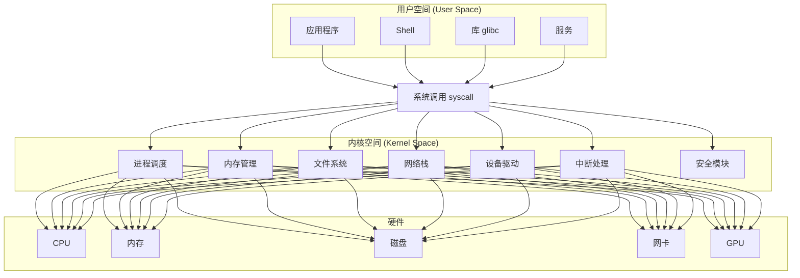
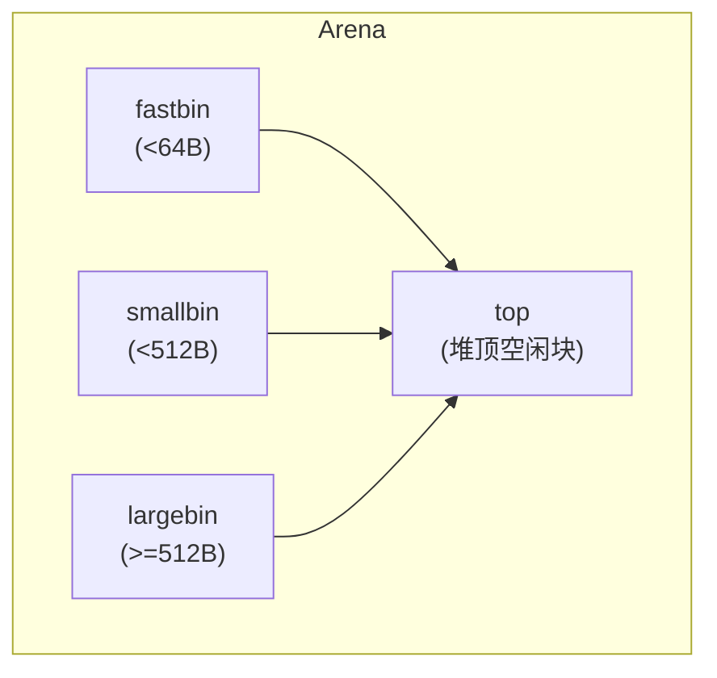
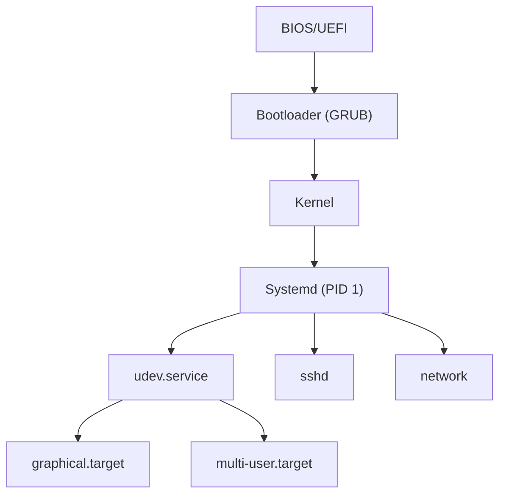
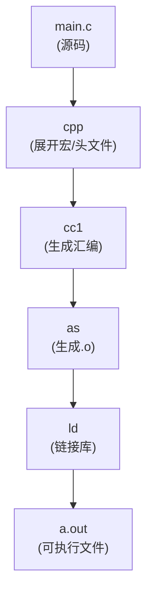

+++
title = "内核与系统组件详解"
description = "Linux操作系统核心组件深度解析：内核架构与编译、Glibc内存分配器、Systemd服务管理、工具链与编译流程"
date = 2026-01-27
weight = 12000
draft = false
[taxonomies]
tags = ["Linux", "Kernel", "Glibc", "Systemd", "Toolchain", "System"]
+++

# Linux 内核与系统组件详解

本文深入介绍 Linux 操作系统的核心组件，包括内核、C 标准库、系统服务管理和编译工具链。

---

## 一、Linux Kernel (内核)

**一句话：内核是硬件与软件之间的"翻译官"，管理所有资源分配**



### 1.1 内核核心子系统

| 子系统 | 功能 | 源码位置 |
|--------|------|----------|
| **进程调度** | 进程创建/销毁/调度 | `kernel/sched/` |
| **内存管理** | 虚拟内存、页面分配、OOM | `mm/` |
| **文件系统** | VFS、ext4、XFS等 | `fs/` |
| **网络栈** | TCP/IP协议栈 | `net/` |
| **设备驱动** | 硬件抽象层 | `drivers/` |
| **中断处理** | 硬中断、软中断 | `kernel/irq/` |

### 1.2 内核编译与配置

```bash
# 获取内核源码
git clone https://git.kernel.org/pub/scm/linux/kernel/git/torvalds/linux.git
cd linux

# 查看当前内核配置
zcat /proc/config.gz > .config  # 如果内核开启了CONFIG_IKCONFIG

# 或从运行内核复制
cp /boot/config-$(uname -r) .config

# 配置内核
make menuconfig    # 文本菜单界面
make xconfig       # Qt图形界面
make nconfig       # ncurses界面

# 编译
make -j$(nproc)

# 安装
sudo make modules_install
sudo make install

# 更新引导加载器
sudo grub-mkconfig -o /boot/grub/grub.cfg
```

### 1.3 常用内核调优参数

```bash
# 网络性能
echo 1 > /proc/sys/net/ipv4/tcp_low_latency
echo "4096 87380 16777216" > /proc/sys/net/ipv4/tcp_rmem
echo "4096 65536 16777216" > /proc/sys/net/ipv4/tcp_wmem

# 内存管理
echo 0 > /proc/sys/vm/swappiness              # 减少换页
echo 1 > /proc/sys/vm/overcommit_memory       # 允许过度提交
echo 1000000 > /proc/sys/vm/max_map_count     # 增加mmap数量

# 实时性
echo -1 > /proc/sys/kernel/sched_rt_runtime_us  # 允许实时进程占用100%CPU

# 查看内核日志
dmesg -T --follow

# 动态加载/卸载模块
lsmod                        # 列出已加载模块
modinfo e1000e               # 查看模块信息
sudo modprobe nvme           # 加载模块
sudo rmmod nvme              # 卸载模块
```

### 1.4 内核调试入口

```bash
# 查看内核符号
cat /proc/kallsyms | grep tcp_sendmsg

# 查看内核数据结构
cat /proc/slabinfo

# 追踪系统调用
cat /proc/self/syscall

# 内核参数
sysctl -a | grep net.core
sysctl -w net.core.somaxconn=65535
```

---

## 二、Glibc (GNU C Library)

**一句话：Glibc 是用户程序与内核之间的"标准接口"，封装系统调用为C函数**

```mermaid
graph TB
    APP["应用程序<br/>printf(\"hello\")"]
    GLIBC["glibc: write()<br/>(glibc封装)"]
    SYSCALL["syscall(SYS_write)<br/>(系统调用)"]
    KERNEL["内核"]
    
    APP -->|C标准库函数| GLIBC
    GLIBC --> SYSCALL
    SYSCALL --> KERNEL
```

### 2.1 Glibc 核心组件

| 组件 | 功能 | 头文件 |
|------|------|--------|
| **stdio** | 标准I/O | `<stdio.h>` |
| **stdlib** | 内存分配、进程控制 | `<stdlib.h>` |
| **string** | 字符串操作 | `<string.h>` |
| **pthread** | POSIX线程 | `<pthread.h>` |
| **math** | 数学函数 | `<math.h>` |
| **动态链接器** | ld.so | - |
| **NSS** | 名称服务 | - |

### 2.2 Glibc 内存分配器 (ptmalloc2)



> **多线程**：每个线程可能有独立的 Arena，减少锁竞争

```c
// 查看glibc版本
#include <gnu/libc-version.h>
printf("glibc version: %s\n", gnu_get_libc_version());

// 或命令行
ldd --version
/lib/x86_64-linux-gnu/libc.so.6
```

### 2.3 Glibc 调试技巧

```bash
# 查看符号解析
LD_DEBUG=symbols ./program

# 查看动态链接过程
LD_DEBUG=libs ./program

# 使用调试版glibc
apt install libc6-dbg

# malloc调试
export MALLOC_CHECK_=3      # 开启malloc检查
export MALLOC_TRACE=/tmp/mtrace.log  # 追踪分配

# 查看内存分配统计
malloc_stats();   // 在程序中调用

# 替换内存分配器（高性能场景）
LD_PRELOAD=/usr/lib/libtcmalloc.so ./program   # Google tcmalloc
LD_PRELOAD=/usr/lib/libjemalloc.so ./program   # jemalloc
```

### 2.4 Glibc vs Musl

| 特性 | Glibc | Musl |
|------|-------|------|
| 代码量 | ~1M行 | ~100K行 |
| 兼容性 | 最广泛 | 较好 |
| 性能 | 优化成熟 | 部分场景更快 |
| 静态链接 | 复杂 | 简单干净 |
| 适用场景 | 通用Linux发行版 | 容器、嵌入式 |

---

## 三、Systemd

**一句话：Systemd 是现代 Linux 的"大管家"，管理系统启动和服务生命周期**



### 3.1 Systemd 核心概念

| 概念 | 说明 | 示例 |
|------|------|------|
| **Unit** | 资源管理单元 | nginx.service |
| **Target** | 一组Unit集合 | multi-user.target |
| **Service** | 后台服务 | sshd.service |
| **Socket** | 套接字激活 | sshd.socket |
| **Timer** | 定时任务 | backup.timer |
| **Mount** | 挂载点 | home.mount |

### 3.2 常用 systemctl 命令

```bash
# 服务管理
systemctl start nginx          # 启动
systemctl stop nginx           # 停止
systemctl restart nginx        # 重启
systemctl reload nginx         # 重载配置
systemctl status nginx         # 查看状态
systemctl enable nginx         # 开机启动
systemctl disable nginx        # 禁用开机启动

# 查看日志
journalctl -u nginx            # 服务日志
journalctl -f                  # 实时跟踪
journalctl --since "1 hour ago"
journalctl -b                  # 本次启动日志
journalctl -k                  # 内核日志

# 分析启动
systemd-analyze                # 启动耗时
systemd-analyze blame          # 各服务启动时间
systemd-analyze critical-chain # 关键路径

# 依赖关系
systemctl list-dependencies nginx
systemctl list-units --type=service --state=running
```

### 3.3 编写自定义 Service

```ini
# /etc/systemd/system/myapp.service
[Unit]
Description=My High Performance Application
After=network.target
Wants=network-online.target

[Service]
Type=simple
ExecStartPre=/usr/bin/myapp --check
ExecStart=/usr/bin/myapp --config /etc/myapp.conf
ExecReload=/bin/kill -HUP $MAINPID
ExecStop=/bin/kill -TERM $MAINPID
Restart=on-failure
RestartSec=5s

# 性能优化
Nice=-10
CPUSchedulingPolicy=fifo
CPUSchedulingPriority=99
IOSchedulingClass=realtime
MemoryLock=true

# 安全加固
PrivateTmp=true
NoNewPrivileges=true
ProtectSystem=strict
ProtectHome=true

# 资源限制
LimitNOFILE=65535
LimitMEMLOCK=infinity
LimitRTPRIO=99

[Install]
WantedBy=multi-user.target
```

```bash
# 重载配置并启动
systemctl daemon-reload
systemctl start myapp
systemctl enable myapp
```

### 3.4 Systemd 资源控制 (cgroups)

```bash
# 查看服务资源使用
systemctl status nginx
systemd-cgtop

# 设置资源限制
systemctl set-property nginx.service CPUQuota=50%
systemctl set-property nginx.service MemoryLimit=1G

# 查看cgroup设置
systemctl show nginx.service -p CPUQuota
```

---

## 四、Toolchain (工具链)

**一句话：工具链是把源代码变成可执行程序的"流水线"**



### 4.1 GNU工具链组件

| 工具 | 功能 | 命令 |
|------|------|------|
| **GCC** | 编译器驱动 | `gcc`, `g++` |
| **Binutils** | 二进制工具 | `as`, `ld`, `objdump`, `nm` |
| **GDB** | 调试器 | `gdb` |
| **Make** | 构建工具 | `make` |
| **Glibc** | C标准库 | - |

### 4.2 编译过程详解

```bash
# 查看完整编译过程
gcc -v -save-temps main.c -o main

# 生成的中间文件：
# main.i   - 预处理后的源码
# main.s   - 汇编代码
# main.o   - 目标文件
# main     - 可执行文件

# 只预处理
gcc -E main.c -o main.i

# 只编译到汇编
gcc -S main.c -o main.s

# 只编译到目标文件
gcc -c main.c -o main.o

# 链接
gcc main.o -o main
```

### 4.3 链接器详解

```bash
# 查看符号表
nm main.o
nm -C main.o      # C++ demangle

# 查看动态依赖
ldd ./main
readelf -d ./main

# 查看段信息
readelf -S ./main
objdump -h ./main

# 反汇编
objdump -d ./main
objdump -d -M intel ./main   # Intel语法
```

### 4.4 静态链接 vs 动态链接

**静态链接 vs 动态链接：**

| 特性 | 静态链接 | 动态链接 |
|------|----------|----------|
| 结构 | main.o + printf() 代码复制进来 | main.o → 运行时加载 libc.so.6 |
| 文件大小 | 大 | 小 |
| 启动速度 | 快 | 稍慢 |
| 内存使用 | 每进程独立 | 多进程共享库 |
| 可执行性 | 单独可执行 | 依赖共享库 |

```bash
# 静态链接
gcc -static main.c -o main_static
ldd main_static   # not a dynamic executable

# 查看动态链接器
readelf -l ./main | grep interpreter
# [Requesting program interpreter: /lib64/ld-linux-x86-64.so.2]

# 预加载库
LD_PRELOAD=/path/to/mylib.so ./main

# 自定义库搜索路径
LD_LIBRARY_PATH=/opt/lib ./main
```

### 4.5 交叉编译

```bash
# 为ARM编译
arm-linux-gnueabihf-gcc main.c -o main_arm

# 为RISC-V编译
riscv64-linux-gnu-gcc main.c -o main_riscv

# 查看目标架构
file main_arm
# main_arm: ELF 32-bit LSB executable, ARM, EABI5...
```

---

## 相关文章

- [Linux核心概念索引](@/articles/00-glossary/glossary-01-linux-concepts.md) - 概念速查
- [内核调试工具详解](@/articles/linux/linux-13-内核调试工具详解.md) - Crash/GDB/Ftrace/BPFtrace
- [性能分析与调试](@/articles/linux/linux-08-性能分析与调试.md) - perf/strace/Valgrind
