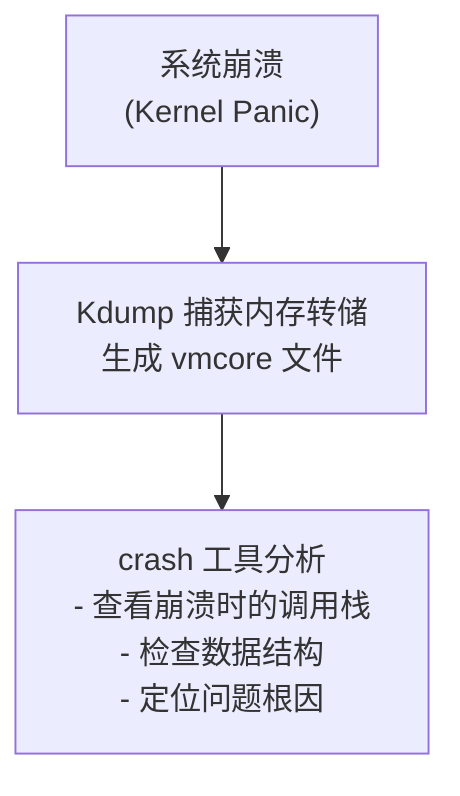
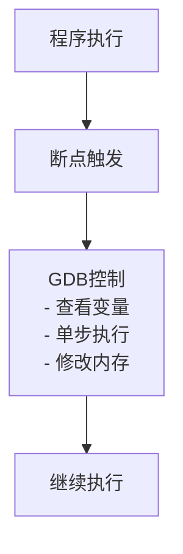
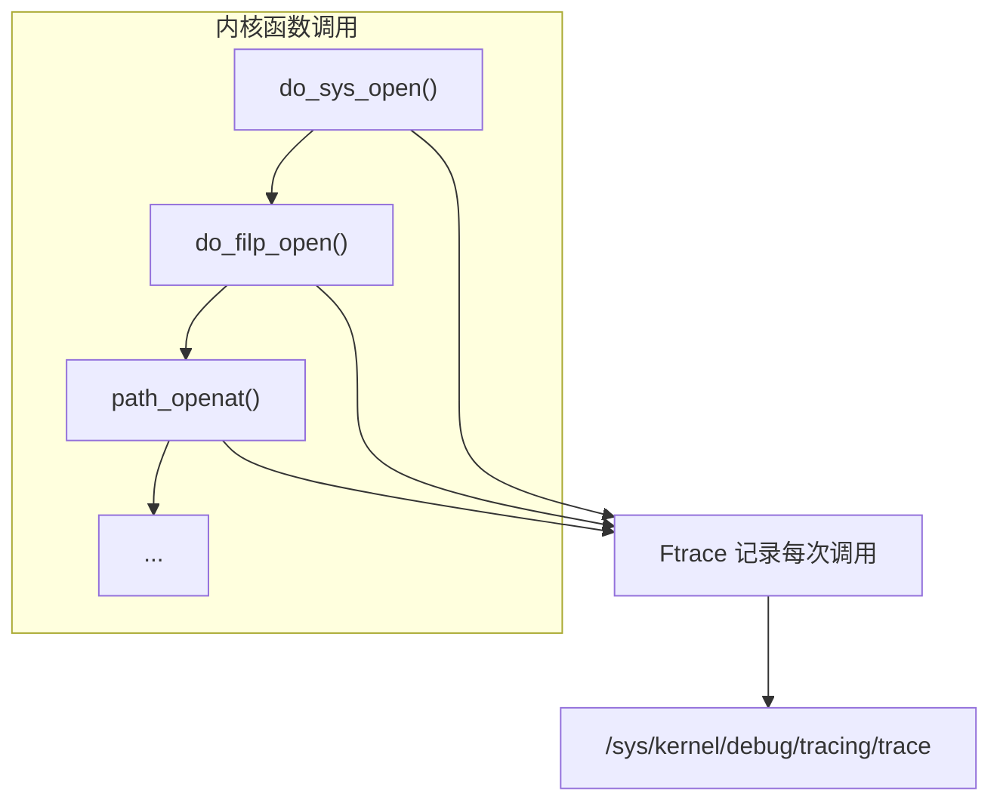
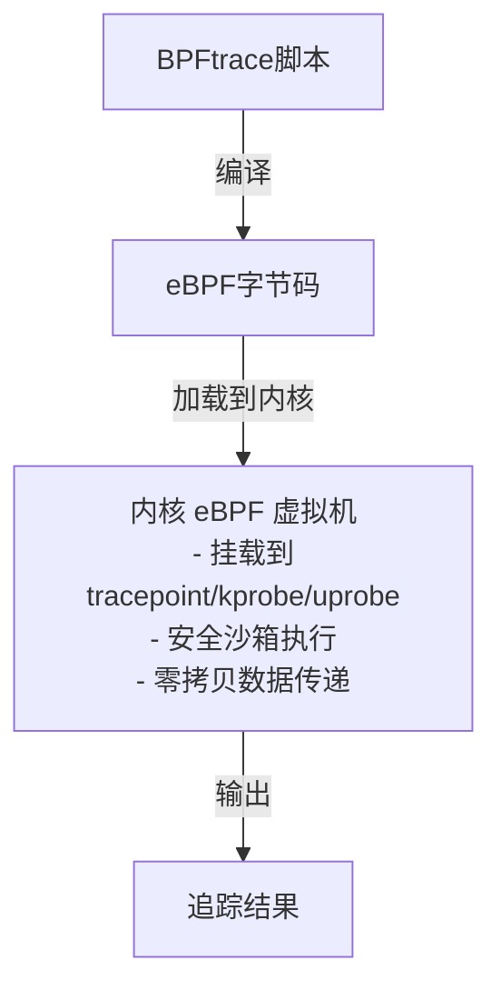

+++
title = "13. 内核调试工具详解"
description = "Linux内核调试与追踪工具深度解析：Crash崩溃分析、GDB高级调试、Ftrace函数追踪、BPFtrace可编程追踪"
date = 2026-01-27
weight = 13000
draft = false
[taxonomies]
tags = ["Linux", "Debug", "Crash", "GDB", "Ftrace", "BPFtrace", "eBPF"]
+++

# Linux 内核调试工具详解

本文深入介绍 Linux 内核调试与追踪工具，包括崩溃分析、交互式调试、函数追踪和可编程追踪。

---

## 一、Crash (内核崩溃分析)

**一句话：Crash 是分析内核崩溃转储 (vmcore) 的"尸检工具"**



### 1.1 配置 Kdump

```bash
# 安装
sudo apt install kdump-tools crash linux-image-$(uname -r)-dbgsym

# 或 RHEL/CentOS
sudo yum install kexec-tools crash kernel-debuginfo

# 配置预留内存（/etc/default/grub）
GRUB_CMDLINE_LINUX="crashkernel=256M"
sudo update-grub

# 启用kdump
sudo systemctl enable kdump
sudo systemctl start kdump

# 验证
cat /sys/kernel/kexec_crash_loaded   # 应为1
```

### 1.2 Crash 基本使用

```bash
# 分析vmcore
crash /usr/lib/debug/boot/vmlinux-$(uname -r) /var/crash/vmcore

# 常用命令
crash> bt                # 当前进程回溯
crash> bt -a             # 所有CPU的回溯
crash> log               # 内核日志
crash> dmesg             # dmesg输出
crash> ps                # 进程列表
crash> files <pid>       # 进程打开的文件
crash> vm <pid>          # 进程内存映射
crash> task <pid>        # task_struct详情
crash> struct task_struct <addr>   # 查看结构体

# 内存分析
crash> kmem -i           # 内存使用概览
crash> kmem -s           # slab信息

# 崩溃原因定位
crash> sys               # 系统信息
crash> mod               # 加载的模块
crash> runq              # 运行队列

# 退出
crash> quit
```

### 1.3 常见崩溃类型分析

```bash
# 1. NULL指针解引用
crash> bt
# PID: 1234  TASK: ffff8800deadbeef  CPU: 0   COMMAND: "process"
#  #0 [ffff...] page_fault at ffffffff...
#  #1 [ffff...] my_function at ffffffffa0001234
# 
# 查看寄存器，RIP指向NULL附近

# 2. 死锁分析
crash> foreach UN bt    # 查看所有UNINTERRUPTIBLE进程
crash> ps -m            # 按状态排序

# 3. OOM分析
crash> log | grep -i oom
crash> kmem -i          # 检查内存使用
```

### 1.4 高级分析技巧

```bash
# 查看特定进程的内核栈
crash> set <pid>
crash> bt

# 分析锁状态
crash> struct mutex <addr>

# 查看文件描述符
crash> files <pid>

# 分析网络连接
crash> net

# 搜索内存
crash> search -s "pattern"
```

---

## 二、GDB (GNU Debugger) 高级技巧

**一句话：GDB 是程序员的"显微镜"，可以暂停程序执行并检查内部状态**



### 2.1 编译调试版本

```bash
# 必须加 -g 生成调试信息
gcc -g -O0 main.c -o main_debug

# 不要strip，保留符号
# strip main_debug  # 不要这样做！

# 分离调试信息（生产环境）
objcopy --only-keep-debug main main.debug
objcopy --strip-debug main
objcopy --add-gnu-debuglink=main.debug main
```

### 2.2 GDB 核心命令

```bash
# 启动
gdb ./program
gdb -p <pid>                 # 附加到运行中进程
gdb ./program core           # 分析core dump

# 运行控制
(gdb) run arg1 arg2          # 运行
(gdb) start                  # 运行到main停止
(gdb) continue (c)           # 继续
(gdb) next (n)               # 单步（不进入函数）
(gdb) step (s)               # 单步（进入函数）
(gdb) finish                 # 执行到函数返回
(gdb) until                  # 执行到指定行

# 断点
(gdb) break main             # 函数断点
(gdb) break file.c:100       # 行断点
(gdb) break *0x400500        # 地址断点
(gdb) break func if x > 10   # 条件断点
(gdb) watch var              # 监视点（变量修改时停止）
(gdb) rwatch var             # 读监视点
(gdb) info breakpoints       # 查看断点
(gdb) delete 1               # 删除断点

# 查看信息
(gdb) print var              # 打印变量
(gdb) print *ptr             # 解引用
(gdb) print arr[0]@10        # 打印数组前10个元素
(gdb) print/x var            # 十六进制显示
(gdb) display var            # 每次停止时显示
(gdb) info locals            # 局部变量
(gdb) info registers         # 寄存器
(gdb) backtrace (bt)         # 调用栈
(gdb) frame 2                # 切换栈帧
(gdb) list                   # 查看源码

# 内存检查
(gdb) x/10x $rsp             # 查看栈顶10个字
(gdb) x/s 0x400600           # 查看字符串
(gdb) x/i $rip               # 查看当前指令

# 多线程
(gdb) info threads           # 查看线程
(gdb) thread 2               # 切换线程
(gdb) thread apply all bt    # 所有线程回溯
```

### 2.3 高级调试技巧

```bash
# 反向调试（需要record）
(gdb) record                 # 开始记录
(gdb) reverse-next           # 反向单步
(gdb) reverse-continue       # 反向继续

# 远程调试
# 目标机器
gdbserver :1234 ./program
# 调试机器
(gdb) target remote host:1234

# 调试优化代码
(gdb) set print object on    # 显示虚类型
(gdb) set print pretty on    # 美化输出

# Python扩展
(gdb) python print(gdb.parse_and_eval("var"))

# 保存/加载断点
(gdb) save breakpoints bp.txt
(gdb) source bp.txt
```

### 2.4 Core Dump 分析

```bash
# 启用core dump
ulimit -c unlimited

# 设置core文件路径
echo "/tmp/core.%e.%p" | sudo tee /proc/sys/kernel/core_pattern

# 分析core文件
gdb ./program /tmp/core.program.1234

(gdb) bt                     # 查看崩溃时的调用栈
(gdb) info registers         # 查看寄存器状态
(gdb) print *ptr             # 检查可疑指针
```

---

## 三、Ftrace (函数追踪器)

**一句话：Ftrace 是内核自带的"追踪雷达"，可以追踪内核函数调用和事件**



### 3.1 Ftrace 基本使用

```bash
# 挂载debugfs（通常已挂载）
mount -t debugfs nodev /sys/kernel/debug

# 切换到tracing目录
cd /sys/kernel/debug/tracing

# 查看可用追踪器
cat available_tracers
# hwlat blk mmiotrace function_graph wakeup_dl wakeup_rt wakeup function nop

# 设置追踪器
echo function > current_tracer

# 开始/停止追踪
echo 1 > tracing_on
# ... 运行你的程序 ...
echo 0 > tracing_on

# 查看结果
cat trace

# 过滤特定函数
echo 'tcp_*' > set_ftrace_filter      # 只追踪tcp开头的函数
echo 'do_sys_open' >> set_ftrace_filter  # 追加
cat set_ftrace_filter                  # 查看当前过滤器

# 清空过滤器
echo > set_ftrace_filter
```

### 3.2 Function Graph 追踪器

```bash
# 显示调用关系图
echo function_graph > current_tracer

# 设置追踪深度
echo 5 > max_graph_depth

# 输出示例：
#  1)               |  do_sys_open() {
#  1)   0.123 us    |    getname();
#  1)               |    do_filp_open() {
#  1)   0.089 us    |      path_openat();
#  1)   0.456 us    |    }
#  1)   1.234 us    |  }
```

### 3.3 事件追踪

```bash
# 查看可用事件
ls /sys/kernel/debug/tracing/events/
# block  ext4  irq  kmem  net  sched  syscalls ...

# 启用调度事件
echo 1 > events/sched/sched_switch/enable
echo 1 > events/sched/sched_wakeup/enable

# 启用系统调用事件
echo 1 > events/syscalls/sys_enter_open/enable

# 查看追踪结果
cat trace

# 使用trace-cmd简化操作
trace-cmd record -e sched_switch ./myprogram
trace-cmd report
```

### 3.4 性能分析示例

```bash
# 追踪函数执行时间
echo 1 > function_profile_enabled
echo 1 > tracing_on
# 运行程序
echo 0 > tracing_on
cat trace_stat/function0

# 输出：
#   Function                  Hit    Time            Avg
#   --------                  ---    ----            ---
#   schedule                 1234   123456 us       100 us
#   tcp_sendmsg               567    56789 us        100 us
```

### 3.5 Ftrace 一键脚本

```bash
#!/bin/bash
# ftrace_tcp.sh - 追踪TCP函数

TRACE_DIR=/sys/kernel/debug/tracing

# 清理
echo 0 > $TRACE_DIR/tracing_on
echo > $TRACE_DIR/trace
echo > $TRACE_DIR/set_ftrace_filter

# 配置
echo function_graph > $TRACE_DIR/current_tracer
echo 'tcp_*' > $TRACE_DIR/set_ftrace_filter
echo 3 > $TRACE_DIR/max_graph_depth

# 追踪
echo 1 > $TRACE_DIR/tracing_on
sleep 5
echo 0 > $TRACE_DIR/tracing_on

# 输出
cat $TRACE_DIR/trace
```

---

## 四、BPFtrace / eBPF

**一句话：BPFtrace 是可编程的"内核探针"，用脚本语言追踪任何内核/用户态事件**



### 4.1 BPFtrace 安装

```bash
# Ubuntu
sudo apt install bpftrace

# Fedora
sudo dnf install bpftrace

# 验证
bpftrace --version
```

### 4.2 BPFtrace 一行程序

```bash
# 追踪系统调用
bpftrace -e 'tracepoint:syscalls:sys_enter_open { printf("%s %s\n", comm, str(args->filename)); }'

# 追踪进程创建
bpftrace -e 'tracepoint:sched:sched_process_exec { printf("%s -> %s\n", comm, str(args->filename)); }'

# 统计系统调用次数
bpftrace -e 'tracepoint:raw_syscalls:sys_enter { @[comm] = count(); }'

# 追踪TCP连接
bpftrace -e 'kprobe:tcp_connect { printf("%s connecting\n", comm); }'

# 测量函数执行时间
bpftrace -e 'kprobe:do_sys_open { @start[tid] = nsecs; }
             kretprobe:do_sys_open /@start[tid]/ { 
               @ns = hist(nsecs - @start[tid]); 
               delete(@start[tid]); 
             }'
```

### 4.3 BPFtrace 脚本示例

```c
// tcp_latency.bt - TCP连接延迟分析
#!/usr/bin/env bpftrace

kprobe:tcp_v4_connect
{
    @start[tid] = nsecs;
    @comm[tid] = comm;
}

kretprobe:tcp_v4_connect
/@start[tid]/
{
    $latency = (nsecs - @start[tid]) / 1000;  // 微秒
    printf("%-16s %6d us\n", @comm[tid], $latency);
    @latency_hist = hist($latency);
    delete(@start[tid]);
    delete(@comm[tid]);
}

END
{
    printf("\n连接延迟分布 (us):\n");
    print(@latency_hist);
}
```

```bash
# 运行脚本
sudo bpftrace tcp_latency.bt
```

### 4.4 常用追踪场景

```bash
# 1. 高延迟系统调用
bpftrace -e '
tracepoint:raw_syscalls:sys_enter { @start[tid] = nsecs; }
tracepoint:raw_syscalls:sys_exit /@start[tid]/ {
    $ns = nsecs - @start[tid];
    if ($ns > 1000000) {  // >1ms
        printf("%s: %d us\n", comm, $ns/1000);
    }
    delete(@start[tid]);
}'

# 2. 内存分配追踪
bpftrace -e 'tracepoint:kmem:kmalloc { @bytes[comm] = sum(args->bytes_alloc); }'

# 3. 块I/O延迟
bpftrace -e '
tracepoint:block:block_rq_issue { @start[args->dev, args->sector] = nsecs; }
tracepoint:block:block_rq_complete /@start[args->dev, args->sector]/ {
    @us = hist((nsecs - @start[args->dev, args->sector]) / 1000);
    delete(@start[args->dev, args->sector]);
}'

# 4. 用户态函数追踪
bpftrace -e 'uprobe:/lib/x86_64-linux-gnu/libc.so.6:malloc { @[ustack] = count(); }'

# 5. 文件打开追踪
bpftrace -e 'tracepoint:syscalls:sys_enter_openat { printf("%s: %s\n", comm, str(args->filename)); }'
```

### 4.5 eBPF 工具集 (BCC)

```bash
# 安装BCC
sudo apt install bpfcc-tools linux-headers-$(uname -r)

# 常用工具
execsnoop        # 追踪进程执行
opensnoop        # 追踪文件打开
biolatency       # 块I/O延迟直方图
tcpconnect       # TCP连接追踪
tcplife          # TCP连接生命周期
runqlat          # 调度延迟
profile          # CPU采样
offcputime       # 离CPU时间分析
```

### 4.6 追踪工具对比

| 特性 | strace | Ftrace | eBPF/BPFtrace |
|------|--------|--------|---------------|
| 开销 | 高 (10-100x) | 低 | 极低 |
| 安全性 | - | - | 沙箱验证 |
| 灵活性 | 低 | 中 | 高（可编程） |
| 生产可用 | 慎用 | 可用 | 推荐 |
| 用户态追踪 | ✓ | 有限 | ✓ |
| 聚合统计 | ✗ | 有限 | ✓ |

---

## 五、调试工具选择指南

| 场景 | 推荐工具 |
|------|----------|
| 程序崩溃分析 | GDB + core dump |
| 内核崩溃分析 | Crash + vmcore |
| 性能热点分析 | perf |
| 系统调用追踪 | strace (开发), BPFtrace (生产) |
| 内核函数追踪 | Ftrace, BPFtrace |
| 延迟分析 | BPFtrace, perf |
| 内存问题 | Valgrind (开发), BPFtrace (生产) |
| 多线程问题 | GDB, Helgrind |

---

## 相关文章

- [Linux核心概念索引](@/articles/00-glossary/glossary-01-linux-concepts.md) - 概念速查
- [性能分析与调试](@/articles/linux/linux-08-性能分析与调试.md) - perf/strace/Valgrind
- [内核与系统组件详解](@/articles/linux/linux-12-内核与系统组件详解.md) - 内核/Glibc/Systemd
