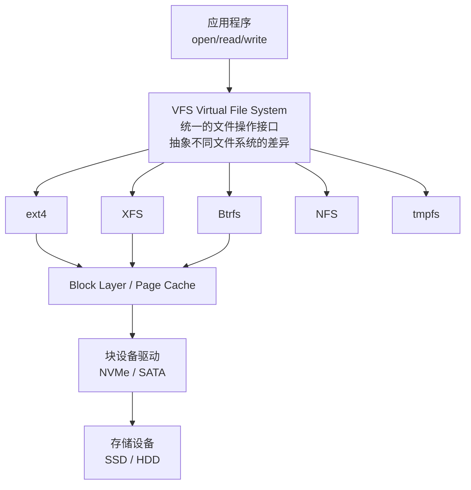

+++
title = "14.存储与文件系统详解"
description = "Linux存储技术深度解析：VFS架构、NVMe驱动原理、SPDK用户态存储、FUSE用户态文件系统开发"
date = 2026-01-27
draft = false
[taxonomies]
tags = ["Linux", "Storage", "NVMe", "SPDK", "FUSE", "FileSystem"]
+++

# Linux 存储与文件系统详解

本文深入介绍 Linux 存储技术，包括文件系统架构、NVMe 驱动、SPDK 用户态存储和 FUSE 文件系统开发。

---

## 一、Linux 文件系统架构

**一句话：VFS 是文件系统的"统一接口"，上接应用，下接各种具体文件系统**



### 1.1 主要文件系统对比

| 文件系统 | 特点 | 适用场景 |
|----------|------|----------|
| **ext4** | 成熟稳定，广泛支持 | 通用、根分区 |
| **XFS** | 高性能，大文件优化 | 大文件、数据库 |
| **Btrfs** | 写时复制，快照，压缩 | 需要高级特性 |
| **F2FS** | 闪存优化 | SSD、eMMC |
| **tmpfs** | 内存文件系统 | 临时文件、/tmp |
| **overlay** | 联合挂载 | 容器 |

### 1.2 VFS 核心数据结构

```c
// 超级块：文件系统整体信息
struct super_block {
    struct file_system_type *s_type;  // 文件系统类型
    struct super_operations *s_op;     // 操作函数
    struct dentry *s_root;             // 根目录
    // ...
};

// inode：文件元数据
struct inode {
    umode_t i_mode;           // 权限
    uid_t i_uid;              // 所有者
    loff_t i_size;            // 大小
    struct timespec i_mtime;  // 修改时间
    struct inode_operations *i_op;
    // ...
};

// dentry：目录项缓存
struct dentry {
    struct inode *d_inode;    // 关联的inode
    struct dentry *d_parent;  // 父目录
    struct qstr d_name;       // 名称
    // ...
};

// file：打开的文件
struct file {
    struct path f_path;       // 路径
    struct inode *f_inode;    // inode
    const struct file_operations *f_op;  // 操作函数
    loff_t f_pos;             // 当前位置
    // ...
};
```

### 1.3 文件系统操作命令

```bash
# 查看挂载的文件系统
mount | column -t
df -Th

# 创建文件系统
mkfs.ext4 /dev/sdb1
mkfs.xfs /dev/sdb2

# 挂载选项
mount -o noatime,nodiratime /dev/sdb1 /mnt/data

# 查看文件系统信息
tune2fs -l /dev/sdb1    # ext4
xfs_info /dev/sdb2      # XFS

# 性能优化挂载选项
mount -o noatime,nodiratime,nobarrier,discard /dev/nvme0n1p1 /mnt/fast
```

---

## 二、NVMe 驱动与原理

**一句话：NVMe 是专为 SSD 设计的高性能存储协议，通过 PCIe 直连 CPU**

```
传统存储 (SATA/SAS):
CPU → 南桥/PCH → SATA控制器 → SSD
     多层转发，延迟高

NVMe:
CPU ←──── PCIe ────→ NVMe SSD
     直连，延迟低
     
性能对比：
SATA SSD:  延迟 ~100μs, IOPS ~100K
NVMe SSD:  延迟 ~10μs,  IOPS ~1M+
```

### 2.1 NVMe 架构

```
┌─────────────────────────────────────────────────┐
│                    NVMe SSD                      │
│  ┌─────────────────────────────────────────┐    │
│  │        NVMe Controller                   │    │
│  │  ┌─────┐ ┌─────┐ ┌─────┐     ┌─────┐   │    │
│  │  │ SQ1 │ │ SQ2 │ │ SQ3 │ ... │ SQn │   │    │  Submission Queues
│  │  └──┬──┘ └──┬──┘ └──┬──┘     └──┬──┘   │    │
│  │     │       │       │           │       │    │
│  │     ↓       ↓       ↓           ↓       │    │
│  │  ┌─────────────────────────────────┐   │    │
│  │  │      Command Processing          │   │    │
│  │  └─────────────────────────────────┘   │    │
│  │     │       │       │           │       │    │
│  │     ↓       ↓       ↓           ↓       │    │
│  │  ┌─────┐ ┌─────┐ ┌─────┐     ┌─────┐   │    │  Completion Queues
│  │  │ CQ1 │ │ CQ2 │ │ CQ3 │ ... │ CQn │   │    │
│  │  └─────┘ └─────┘ └─────┘     └─────┘   │    │
│  └─────────────────────────────────────────┘    │
│                                                  │
│  ┌─────────────────────────────────────────┐    │
│  │              Flash Memory                │    │
│  └─────────────────────────────────────────┘    │
└─────────────────────────────────────────────────┘

特点：
- 多队列（最多64K个队列）
- 每个队列最多64K个命令
- 支持多核心并行
- 每个CPU核心可以有独立队列
```

### 2.2 NVMe 管理命令

```bash
# 安装管理工具
sudo apt install nvme-cli

# 列出NVMe设备
nvme list

# 查看设备信息
nvme id-ctrl /dev/nvme0
nvme id-ns /dev/nvme0n1

# 查看SMART信息
nvme smart-log /dev/nvme0

# 查看错误日志
nvme error-log /dev/nvme0

# 查看队列信息
cat /sys/block/nvme0n1/queue/nr_requests

# 性能测试
sudo fio --name=randread --ioengine=libaio --iodepth=64 \
    --rw=randread --bs=4k --direct=1 --size=1G \
    --numjobs=4 --runtime=60 --filename=/dev/nvme0n1
```

### 2.3 NVMe 内核驱动

```bash
# 查看NVMe驱动
lsmod | grep nvme
# nvme                   45056  3
# nvme_core             106496  5 nvme
# nvme_common            16384  1 nvme_core

# 驱动参数
modinfo nvme
cat /sys/module/nvme_core/parameters/io_timeout

# 查看队列数量
cat /sys/block/nvme0n1/queue/nr_requests
ls /sys/class/nvme/nvme0/nvme0n1/queue/

# 中断亲和性
cat /proc/interrupts | grep nvme
```

### 2.4 NVMe 性能调优

```bash
# 调整队列深度
echo 1024 > /sys/block/nvme0n1/queue/nr_requests

# 调度器选择（NVMe 推荐 none）
echo none > /sys/block/nvme0n1/queue/scheduler

# 中断合并
echo 0 > /sys/block/nvme0n1/queue/nomerges

# 预读设置
blockdev --setra 256 /dev/nvme0n1
```

---

## 三、SPDK (Storage Performance Development Kit)

**一句话：SPDK 绕过内核直接操作 NVMe，实现极致低延迟存储**

```
传统内核 I/O:                    SPDK 用户态 I/O:
┌─────────┐                      ┌─────────┐
│ 应用程序 │                      │ 应用程序 │
└────┬────┘                      └────┬────┘
     │ syscall                        │ 直接调用
     ↓                                ↓
┌─────────┐                      ┌─────────┐
│  VFS    │                      │  SPDK   │
└────┬────┘                      │  库     │
     │                           └────┬────┘
     ↓                                │ 用户态驱动
┌─────────┐                           │
│ Block   │                           │
│ Layer   │                           │
└────┬────┘                           │
     │                                │
     ↓                                │
┌─────────┐                           │
│ NVMe    │                           │
│ Driver  │                           │
└────┬────┘                           │
     │                                │
═════╧════════════════════════════════╧═════
     │                                │
     ↓                                ↓
┌─────────────────────────────────────────┐
│              NVMe SSD                    │
└─────────────────────────────────────────┘

延迟对比：
内核 I/O: ~10-20μs
SPDK:     ~2-5μs
```

### 3.1 SPDK 核心特性

| 特性 | 说明 |
|------|------|
| **用户态驱动** | 绕过内核，直接操作硬件 |
| **轮询模式** | 无中断，忙等待 |
| **零拷贝** | 避免数据复制 |
| **无锁设计** | 每核心独立队列 |
| **异步I/O** | 批量提交，高并发 |

### 3.2 SPDK 安装与配置

```bash
# 获取源码
git clone https://github.com/spdk/spdk.git
cd spdk
git submodule update --init

# 安装依赖
sudo scripts/pkgdep.sh

# 编译
./configure
make -j$(nproc)

# 设置大页内存
sudo HUGEMEM=4096 scripts/setup.sh

# 将NVMe设备绑定到用户态驱动
sudo scripts/setup.sh status
sudo scripts/setup.sh

# 验证
sudo ./build/examples/identify
```

### 3.3 SPDK 编程示例

```c
#include "spdk/stdinc.h"
#include "spdk/nvme.h"
#include "spdk/env.h"

struct ctrlr_entry {
    struct spdk_nvme_ctrlr *ctrlr;
    struct ctrlr_entry *next;
};

struct ns_entry {
    struct spdk_nvme_ctrlr *ctrlr;
    struct spdk_nvme_ns *ns;
    struct spdk_nvme_qpair *qpair;
    struct ns_entry *next;
};

static struct ctrlr_entry *g_controllers = NULL;
static struct ns_entry *g_namespaces = NULL;

// 读取完成回调
static void read_complete(void *arg, const struct spdk_nvme_cpl *completion)
{
    if (spdk_nvme_cpl_is_error(completion)) {
        fprintf(stderr, "I/O error status: %s\n",
                spdk_nvme_cpl_get_status_string(&completion->status));
    }
    // 处理完成...
}

// 执行读取
static void do_read(struct ns_entry *ns_entry, void *buffer, 
                    uint64_t lba, uint32_t lba_count)
{
    int rc = spdk_nvme_ns_cmd_read(ns_entry->ns, ns_entry->qpair,
                                   buffer, lba, lba_count,
                                   read_complete, NULL, 0);
    if (rc != 0) {
        fprintf(stderr, "spdk_nvme_ns_cmd_read failed\n");
        return;
    }
    
    // 轮询等待完成
    while (spdk_nvme_qpair_process_completions(ns_entry->qpair, 0) == 0) {
        // 忙等待
    }
}

// 探测回调
static bool probe_cb(void *cb_ctx, const struct spdk_nvme_transport_id *trid,
                     struct spdk_nvme_ctrlr_opts *opts)
{
    printf("Found NVMe controller at %s\n", trid->traddr);
    return true;
}

// 附加回调
static void attach_cb(void *cb_ctx, const struct spdk_nvme_transport_id *trid,
                      struct spdk_nvme_ctrlr *ctrlr,
                      const struct spdk_nvme_ctrlr_opts *opts)
{
    // 注册控制器和命名空间...
}

int main(int argc, char **argv)
{
    struct spdk_env_opts opts;
    
    spdk_env_opts_init(&opts);
    opts.name = "hello_world";
    
    if (spdk_env_init(&opts) < 0) {
        fprintf(stderr, "Unable to initialize SPDK env\n");
        return 1;
    }
    
    // 探测NVMe控制器
    if (spdk_nvme_probe(NULL, NULL, probe_cb, attach_cb, NULL) != 0) {
        fprintf(stderr, "spdk_nvme_probe failed\n");
        return 1;
    }
    
    // 执行I/O操作...
    
    // 清理
    spdk_env_fini();
    return 0;
}
```

### 3.4 SPDK 应用场景

| 场景 | 说明 |
|------|------|
| **分布式存储** | Ceph with SPDK |
| **数据库** | RocksDB with SPDK |
| **虚拟化** | SPDK vhost |
| **NVMe-oF** | NVMe over Fabrics |

---

## 四、用户态文件系统 (FUSE)

**一句话：FUSE 让你用普通程序实现文件系统，无需修改内核**

```
用户程序
    │
    │  open("/mnt/myfs/file")
    ↓
┌─────────────────────────────────────────────────┐
│                  VFS                             │
└───────────────────┬─────────────────────────────┘
                    │
                    ↓
┌─────────────────────────────────────────────────┐
│              FUSE Kernel Module                  │
│        将VFS请求转发到用户态                      │
└───────────────────┬─────────────────────────────┘
                    │ /dev/fuse
                    ↓
┌─────────────────────────────────────────────────┐
│              用户态文件系统进程                   │
│         libfuse  +  你的实现                     │
└─────────────────────────────────────────────────┘

示例：sshfs、s3fs、glusterfs
```

### 4.1 FUSE 编程示例

```c
#define FUSE_USE_VERSION 31
#include <fuse3/fuse.h>
#include <string.h>
#include <errno.h>
#include <stdio.h>

static const char *hello_str = "Hello World!\n";
static const char *hello_path = "/hello";

// 获取文件属性
static int hello_getattr(const char *path, struct stat *stbuf,
                         struct fuse_file_info *fi)
{
    (void) fi;
    memset(stbuf, 0, sizeof(struct stat));
    
    if (strcmp(path, "/") == 0) {
        stbuf->st_mode = S_IFDIR | 0755;
        stbuf->st_nlink = 2;
        return 0;
    }
    
    if (strcmp(path, hello_path) == 0) {
        stbuf->st_mode = S_IFREG | 0444;
        stbuf->st_nlink = 1;
        stbuf->st_size = strlen(hello_str);
        return 0;
    }
    
    return -ENOENT;
}

// 读取目录
static int hello_readdir(const char *path, void *buf, 
                         fuse_fill_dir_t filler,
                         off_t offset, struct fuse_file_info *fi,
                         enum fuse_readdir_flags flags)
{
    (void) offset;
    (void) fi;
    (void) flags;
    
    if (strcmp(path, "/") != 0)
        return -ENOENT;
    
    filler(buf, ".", NULL, 0, 0);
    filler(buf, "..", NULL, 0, 0);
    filler(buf, hello_path + 1, NULL, 0, 0);
    
    return 0;
}

// 打开文件
static int hello_open(const char *path, struct fuse_file_info *fi)
{
    if (strcmp(path, hello_path) != 0)
        return -ENOENT;
    
    if ((fi->flags & O_ACCMODE) != O_RDONLY)
        return -EACCES;
    
    return 0;
}

// 读取文件
static int hello_read(const char *path, char *buf, size_t size,
                      off_t offset, struct fuse_file_info *fi)
{
    size_t len;
    (void) fi;
    
    if (strcmp(path, hello_path) != 0)
        return -ENOENT;
    
    len = strlen(hello_str);
    if (offset >= len)
        return 0;
    
    if (offset + size > len)
        size = len - offset;
    
    memcpy(buf, hello_str + offset, size);
    return size;
}

static const struct fuse_operations hello_oper = {
    .getattr  = hello_getattr,
    .readdir  = hello_readdir,
    .open     = hello_open,
    .read     = hello_read,
};

int main(int argc, char *argv[])
{
    return fuse_main(argc, argv, &hello_oper, NULL);
}
```

### 4.2 编译和运行

```bash
# 安装开发库
sudo apt install libfuse3-dev

# 编译
gcc -Wall hello_fuse.c -o hello_fuse $(pkg-config fuse3 --cflags --libs)

# 创建挂载点
mkdir /tmp/hello

# 挂载（前台运行，方便调试）
./hello_fuse -f /tmp/hello

# 另一个终端测试
ls /tmp/hello
# hello

cat /tmp/hello/hello
# Hello World!

# 卸载
fusermount3 -u /tmp/hello
```

### 4.3 常见 FUSE 文件系统

| 文件系统 | 说明 |
|----------|------|
| **sshfs** | 通过SSH挂载远程目录 |
| **s3fs** | 挂载S3存储桶 |
| **rclone** | 多种云存储 |
| **glusterfs** | 分布式文件系统 |
| **encfs** | 加密文件系统 |

### 4.4 FUSE 性能优化

```c
// 1. 增加读取缓冲区
static const struct fuse_operations oper = {
    // ...
};

struct fuse_conn_info_opts *conn_opts;
conn_opts = fuse_parse_conn_info_opts(args);

// 2. 启用异步读取
fi->direct_io = 0;
fi->keep_cache = 1;
fi->nonseekable = 0;

// 3. 使用splice减少拷贝
// libfuse3 支持 splice 优化
```

---

## 五、存储技术选型

| 场景 | 推荐方案 |
|------|----------|
| 通用文件存储 | ext4/XFS + 内核NVMe |
| 数据库存储 | XFS + O_DIRECT |
| 超低延迟 | SPDK |
| 分布式存储 | Ceph + SPDK |
| 云存储挂载 | FUSE (s3fs/rclone) |
| 容器存储 | overlayfs |

---

## 相关文章

- [Linux核心概念索引](/articles/00-glossary/glossary-01-linux-concepts/) - 概念速查
- [文件系统与IO](/articles/linux/linux-04-文件系统与IO/) - 基础知识
- [内存映射与高效IO](/articles/linux/linux-11-内存映射与高效IO/) - mmap/零拷贝
