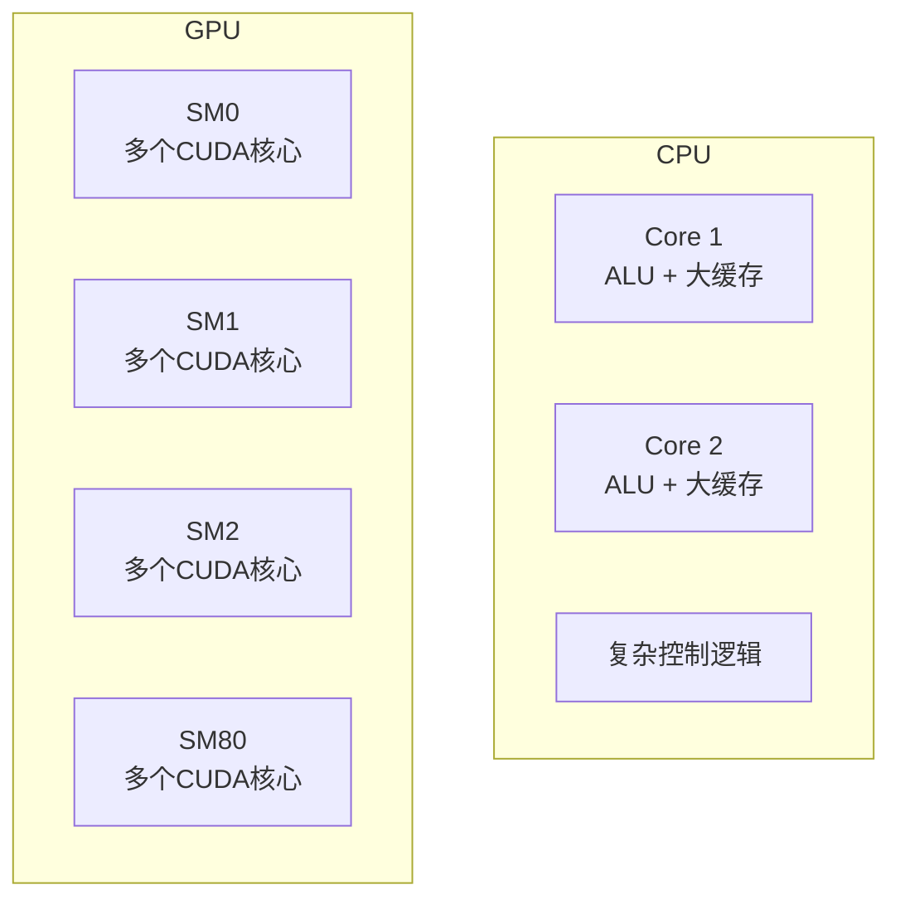
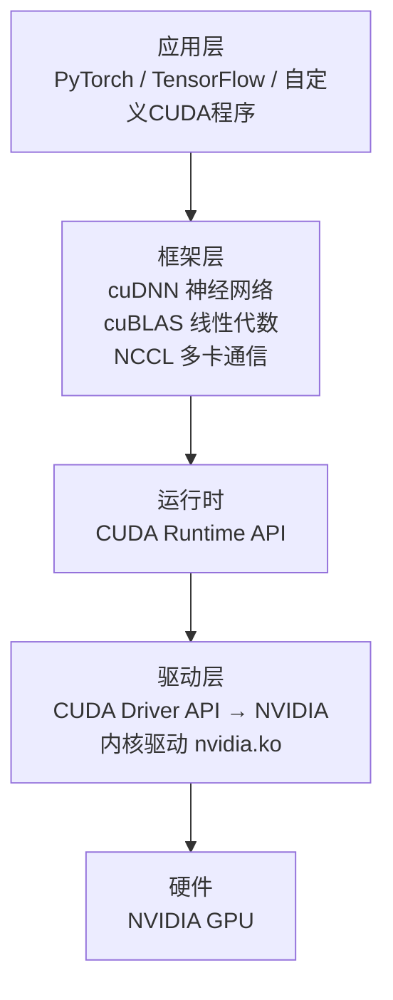
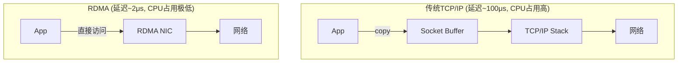
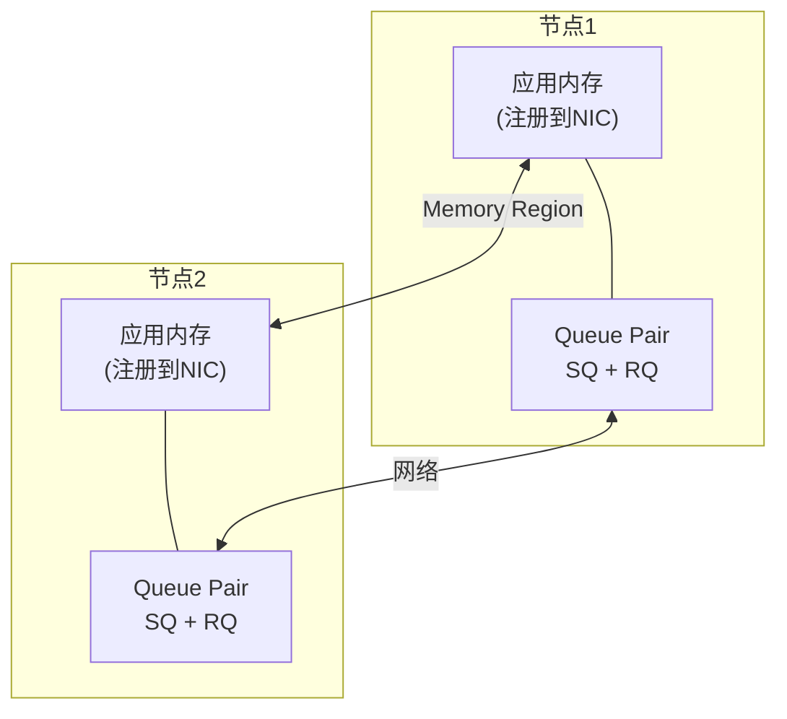
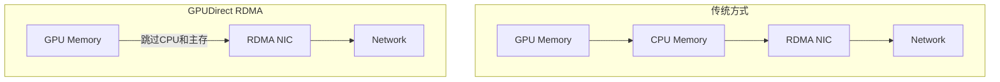

+++
title = "15.AI基础设施详解"
description = "AI底层基础设施深度解析：GPU架构与CUDA编程、NVIDIA驱动管理、RDMA网络原理与编程、高性能计算优化"
date = 2026-01-27
draft = false
[taxonomies]
tags = ["Linux", "GPU", "CUDA", "RDMA", "InfiniBand", "AI", "HPC"]
+++

# AI 基础设施详解

本文深入介绍 AI 底层基础设施，包括 GPU 计算、NVIDIA 驱动管理和 RDMA 高性能网络。

---

## 一、GPU 计算与驱动

**一句话：GPU 是"大规模并行计算器"，擅长同时处理成千上万个简单任务**

**CPU vs GPU 架构：**

| 特性 | CPU (适合复杂逻辑) | GPU (适合并行计算) |
|------|-------------------|-------------------|
| 核心数 | 4-64核 | 数千核 |
| 结构 | 少量大核心 + 大缓存 + 复杂控制逻辑 | 多个SM，每个SM有多个CUDA核心 |
| 优势 | 分支、复杂逻辑 | 矩阵运算、并行 |



### 1.1 GPU 软件栈



### 1.2 NVIDIA 驱动管理

```bash
# 查看GPU状态
nvidia-smi

# 输出示例:
# +-----------------------------------------------------------------------------+
# | NVIDIA-SMI 525.60.11    Driver Version: 525.60.11    CUDA Version: 12.0     |
# |-------------------------------+----------------------+----------------------+
# | GPU  Name        Persistence-M| Bus-Id        Disp.A | Volatile Uncorr. ECC |
# | Fan  Temp  Perf  Pwr:Usage/Cap|         Memory-Usage | GPU-Util  Compute M. |
# |===============================+======================+======================|
# |   0  NVIDIA A100-SXM4   On   | 00000000:07:00.0 Off |                    0 |
# | N/A   32C    P0    52W / 400W|  12345MiB / 40960MiB |     23%      Default |
# +-------------------------------+----------------------+----------------------+

# 持续监控
nvidia-smi dmon -s u    # 利用率监控
nvidia-smi pmon         # 进程监控
watch -n 1 nvidia-smi   # 每秒刷新

# 查看驱动版本
cat /proc/driver/nvidia/version

# 查看CUDA版本
nvcc --version
cat /usr/local/cuda/version.txt
```

### 1.3 GPU 模式设置

```bash
# 持久模式（减少启动延迟）
sudo nvidia-smi -pm 1                    

# 设置GPU时钟频率（固定频率减少延迟抖动）
sudo nvidia-smi -ac 5001,1590           

# 计算模式设置
sudo nvidia-smi --compute-mode=DEFAULT           # 多进程共享
sudo nvidia-smi --compute-mode=EXCLUSIVE_PROCESS # 独占模式
sudo nvidia-smi --compute-mode=PROHIBITED        # 禁止计算

# GPU拓扑（多卡通信优化）
nvidia-smi topo -m

# 查看NVLink状态
nvidia-smi nvlink -s
nvidia-smi nvlink -c

# 重置GPU
sudo nvidia-smi --gpu-reset

# 设置功率限制
sudo nvidia-smi -pl 300   # 限制300W
```

### 1.4 CUDA 编程示例

```c
#include <cuda_runtime.h>
#include <stdio.h>

// GPU核函数：向量加法
__global__ void vectorAdd(const float *A, const float *B, float *C, int N)
{
    int i = blockDim.x * blockIdx.x + threadIdx.x;
    if (i < N) {
        C[i] = A[i] + B[i];
    }
}

int main()
{
    int N = 1000000;
    size_t size = N * sizeof(float);
    
    // 分配主机内存
    float *h_A = (float*)malloc(size);
    float *h_B = (float*)malloc(size);
    float *h_C = (float*)malloc(size);
    
    // 初始化数据
    for (int i = 0; i < N; i++) {
        h_A[i] = i;
        h_B[i] = i * 2;
    }
    
    // 分配设备内存
    float *d_A, *d_B, *d_C;
    cudaMalloc(&d_A, size);
    cudaMalloc(&d_B, size);
    cudaMalloc(&d_C, size);
    
    // 复制数据到GPU
    cudaMemcpy(d_A, h_A, size, cudaMemcpyHostToDevice);
    cudaMemcpy(d_B, h_B, size, cudaMemcpyHostToDevice);
    
    // 启动核函数
    int threadsPerBlock = 256;
    int blocksPerGrid = (N + threadsPerBlock - 1) / threadsPerBlock;
    vectorAdd<<<blocksPerGrid, threadsPerBlock>>>(d_A, d_B, d_C, N);
    
    // 等待完成
    cudaDeviceSynchronize();
    
    // 复制结果回主机
    cudaMemcpy(h_C, d_C, size, cudaMemcpyDeviceToHost);
    
    // 验证结果
    for (int i = 0; i < 10; i++) {
        printf("%f + %f = %f\n", h_A[i], h_B[i], h_C[i]);
    }
    
    // 释放内存
    cudaFree(d_A);
    cudaFree(d_B);
    cudaFree(d_C);
    free(h_A);
    free(h_B);
    free(h_C);
    
    return 0;
}
```

```bash
# 编译
nvcc -o vectorAdd vectorAdd.cu

# 运行
./vectorAdd

# 性能分析
nsys profile ./vectorAdd           # Nsight Systems
ncu ./vectorAdd                    # Nsight Compute
nvprof ./vectorAdd                 # 旧版profiler
```

### 1.5 常见 GPU 问题排查

```bash
# GPU内存不足
nvidia-smi --query-gpu=memory.used,memory.total --format=csv
# 解决：减小batch size，使用梯度检查点，混合精度训练

# 查看进程GPU使用
nvidia-smi pmon
fuser -v /dev/nvidia*

# GPU利用率低
nvidia-smi dmon -s u
# 可能原因：数据加载瓶颈、CPU预处理慢、batch太小

# 检查GPU错误
dmesg | grep -i nvidia
nvidia-bug-report.sh    # 生成诊断报告

# PCIe带宽检测
nvidia-smi --query-gpu=pcie.link.gen.current,pcie.link.width.current --format=csv

# ECC错误检查
nvidia-smi --query-gpu=ecc.errors.corrected.volatile.total --format=csv

# 温度监控
nvidia-smi --query-gpu=temperature.gpu --format=csv -l 1
```

### 1.6 多GPU编程 (NCCL)

```python
# PyTorch 多GPU训练示例
import torch
import torch.distributed as dist
from torch.nn.parallel import DistributedDataParallel as DDP

def setup(rank, world_size):
    dist.init_process_group("nccl", rank=rank, world_size=world_size)
    torch.cuda.set_device(rank)

def cleanup():
    dist.destroy_process_group()

def train(rank, world_size):
    setup(rank, world_size)
    
    model = MyModel().to(rank)
    model = DDP(model, device_ids=[rank])
    
    # 训练循环...
    
    cleanup()

# 启动
# torchrun --nproc_per_node=8 train.py
```

---

## 二、RDMA (Remote Direct Memory Access)

**一句话：RDMA 让网卡直接读写远程内存，绕过 CPU 和操作系统，实现微秒级网络延迟**



### 2.1 RDMA 技术栈

| 技术 | 说明 | 带宽 | 延迟 |
|------|------|------|------|
| **InfiniBand** | 专用RDMA网络 | 200-400 Gbps | ~1μs |
| **RoCE v2** | 以太网上的RDMA | 100-400 Gbps | ~2μs |
| **iWARP** | TCP上的RDMA | 10-100 Gbps | ~10μs |

### 2.2 RDMA 核心概念



**关键操作：**
- **RDMA SEND/RECV**：类似Socket，双方都参与
- **RDMA WRITE**：直接写远程内存（对端CPU无感知）
- **RDMA READ**：直接读远程内存（对端CPU无感知）
- **Atomic**：远程原子操作

**核心术语**：

| 术语 | 说明 |
|------|------|
| **PD (Protection Domain)** | 保护域，隔离资源 |
| **MR (Memory Region)** | 注册到RDMA的内存区域 |
| **QP (Queue Pair)** | 发送队列+接收队列 |
| **CQ (Completion Queue)** | 完成事件队列 |
| **WR (Work Request)** | 工作请求 |
| **WC (Work Completion)** | 完成通知 |

### 2.3 RDMA 环境配置

```bash
# 安装RDMA软件包
sudo apt install rdma-core libibverbs-dev librdmacm-dev infiniband-diags perftest

# 查看RDMA设备
ibv_devices
# 输出:
#     device                 node GUID
#     ------              ----------------
#     mlx5_0              0c42a10300756abc

ibv_devinfo
# 输出设备详细信息

# 检查链路状态
ibstat
ibstatus

# 查看端口信息
cat /sys/class/infiniband/mlx5_0/ports/1/state
# 4: ACTIVE

cat /sys/class/infiniband/mlx5_0/ports/1/rate
# 200 Gb/sec
```

### 2.4 RDMA 性能测试

```bash
# 带宽测试
# 服务端
ib_write_bw
# 客户端
ib_write_bw <server_ip>

# 延迟测试
# 服务端
ib_write_lat
# 客户端
ib_write_lat <server_ip>

# SEND/RECV测试
ib_send_bw / ib_send_lat

# READ测试
ib_read_bw / ib_read_lat

# 连通性测试
ibping -S -C mlx5_0 -P 1          # 服务端
ibping -c 1000 -C mlx5_0 -P 1 <lid>  # 客户端
```

### 2.5 RDMA 编程示例 (libibverbs)

```c
#include <infiniband/verbs.h>
#include <stdio.h>
#include <stdlib.h>
#include <string.h>

#define BUFFER_SIZE 4096

int main()
{
    struct ibv_device **dev_list;
    struct ibv_context *ctx;
    struct ibv_pd *pd;
    struct ibv_cq *cq;
    struct ibv_qp *qp;
    struct ibv_mr *mr;
    char *buf;
    int num_devices;
    
    // 获取设备列表
    dev_list = ibv_get_device_list(&num_devices);
    if (!dev_list) {
        fprintf(stderr, "Failed to get IB devices\n");
        return 1;
    }
    
    // 打开设备
    ctx = ibv_open_device(dev_list[0]);
    if (!ctx) {
        fprintf(stderr, "Failed to open device\n");
        return 1;
    }
    
    // 分配保护域
    pd = ibv_alloc_pd(ctx);
    if (!pd) {
        fprintf(stderr, "Failed to allocate PD\n");
        return 1;
    }
    
    // 创建完成队列
    cq = ibv_create_cq(ctx, 100, NULL, NULL, 0);
    if (!cq) {
        fprintf(stderr, "Failed to create CQ\n");
        return 1;
    }
    
    // 创建Queue Pair
    struct ibv_qp_init_attr qp_attr = {
        .send_cq = cq,
        .recv_cq = cq,
        .cap = {
            .max_send_wr = 10,
            .max_recv_wr = 10,
            .max_send_sge = 1,
            .max_recv_sge = 1,
        },
        .qp_type = IBV_QPT_RC,  // Reliable Connection
    };
    
    qp = ibv_create_qp(pd, &qp_attr);
    if (!qp) {
        fprintf(stderr, "Failed to create QP\n");
        return 1;
    }
    
    // 分配并注册内存
    buf = malloc(BUFFER_SIZE);
    memset(buf, 0, BUFFER_SIZE);
    
    mr = ibv_reg_mr(pd, buf, BUFFER_SIZE,
        IBV_ACCESS_LOCAL_WRITE | 
        IBV_ACCESS_REMOTE_WRITE |
        IBV_ACCESS_REMOTE_READ);
    if (!mr) {
        fprintf(stderr, "Failed to register MR\n");
        return 1;
    }
    
    printf("QP created, lkey: 0x%x, rkey: 0x%x\n", mr->lkey, mr->rkey);
    
    // ... QP状态转换、连接建立、数据传输 ...
    
    // 清理资源
    ibv_dereg_mr(mr);
    free(buf);
    ibv_destroy_qp(qp);
    ibv_destroy_cq(cq);
    ibv_dealloc_pd(pd);
    ibv_close_device(ctx);
    ibv_free_device_list(dev_list);
    
    return 0;
}
```

```bash
# 编译
gcc -o rdma_example rdma_example.c -libverbs

# 运行
./rdma_example
```

### 2.6 RDMA 应用场景

| 场景 | 说明 | 示例 |
|------|------|------|
| **分布式存储** | 存储节点间数据传输 | Ceph、GlusterFS over RDMA |
| **AI训练** | 多卡/多机梯度同步 | NCCL over RDMA |
| **HPC** | 高性能计算通信 | MPI over RDMA |
| **数据库** | 分布式数据库通信 | Oracle Exadata、SAP HANA |
| **内存池** | 分布式共享内存 | 远程内存访问 |

### 2.7 RDMA 常见问题排查

```bash
# 检查MTU
cat /sys/class/net/ib0/mtu

# 查看QP状态
cat /sys/kernel/debug/mlx5/mlx5_0/QPs/*

# 检查错误计数器
cat /sys/class/infiniband/mlx5_0/ports/1/counters/*

# 检查链路错误
perfquery -x

# 网络拓扑
ibnetdiscover

# 诊断工具
ibdiagnet

# 日志
dmesg | grep -i mlx
dmesg | grep -i infiniband
```

### 2.8 RDMA 性能调优

```bash
# 增加接收队列大小
echo 8192 > /sys/class/net/ib0/device/recv_queue_size

# 启用忙轮询
echo 1 > /proc/sys/net/core/busy_read
echo 1 > /proc/sys/net/core/busy_poll

# CPU亲和性
# 将RDMA应用绑定到NUMA本地CPU

# 大页内存
echo 1024 > /proc/sys/vm/nr_hugepages

# 中断亲和性
# 将RDMA中断绑定到特定CPU
```

---

## 三、GPU + RDMA 协同

**GPUDirect RDMA**：GPU 内存与 RDMA 网卡直接通信，绕过 CPU 和主存。



### 3.1 GPUDirect 技术栈

| 技术 | 说明 |
|------|------|
| **GPUDirect P2P** | GPU间直接通信（同一节点） |
| **GPUDirect RDMA** | GPU与RDMA网卡直接通信 |
| **GPUDirect Storage** | GPU与NVMe直接通信 |

### 3.2 NCCL with RDMA

```python
# PyTorch + NCCL + RDMA
import os
os.environ['NCCL_IB_DISABLE'] = '0'  # 启用InfiniBand
os.environ['NCCL_NET_GDR_LEVEL'] = '2'  # GPUDirect RDMA级别

import torch.distributed as dist
dist.init_process_group(backend='nccl')
```

```bash
# 检查NCCL RDMA支持
NCCL_DEBUG=INFO python train.py
# 查找: NET/IB : Using [0]mlx5_0:1/...
```

---

## 四、性能优化清单

### GPU 优化

| 优化项 | 说明 |
|--------|------|
| 持久模式 | `nvidia-smi -pm 1` |
| 固定时钟 | `nvidia-smi -ac` |
| 独占模式 | 避免GPU资源争抢 |
| 混合精度 | FP16/BF16训练 |
| 梯度检查点 | 减少显存占用 |

### RDMA 优化

| 优化项 | 说明 |
|--------|------|
| 大页内存 | 减少TLB miss |
| CPU亲和性 | NUMA本地访问 |
| 忙轮询 | 减少延迟 |
| 正确的MTU | 通常4K或9K |

---

## 相关文章

- [上一篇：存储与文件系统详解](/articles/linux/linux-14-存储与文件系统详解/)
- [下一篇：内核内存管理详解](/articles/linux/linux-16-内核内存管理详解/)

**延伸阅读**：
- [Linux核心概念索引](/articles/00-glossary/glossary-01-linux-concepts/) - 概念速查
- [HFT-CPU亲和性与NUMA优化](/articles/ccpp/cpp-26-HFT-CPU亲和性与NUMA优化/) - NUMA优化
- [内核调试工具详解](/articles/linux/linux-13-内核调试工具详解/) - 调试工具
