+++
title = "内核内存管理详解"
date = 2026-01-31
weight = 16000
description = "Linux内核内存管理：地址空间布局、虚拟地址映射、MMU与页表、缺页中断、内核分配器"
[taxonomies]
tags = ["Linux", "内核", "内存管理", "MMU", "缺页中断"]
+++

# Linux 内核内存管理详解

本文从内核开发者视角深入剖析 Linux 内存管理的核心机制，涵盖地址空间布局、虚拟地址映射、缺页中断设计和内核分配器实现。

---

## 一、Linux 内存布局

### 1.1 地址空间划分

Linux 采用虚拟内存机制，每个进程拥有独立的虚拟地址空间。地址空间被划分为**用户空间**和**内核空间**两部分。

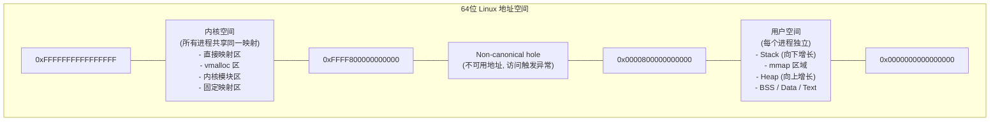

| 架构 | 用户空间范围 | 内核空间范围 | 可用位数 |
|------|-------------|-------------|---------|
| x86-32 | 0 ~ 3GB | 3GB ~ 4GB | 32位全用 |
| x86-64 (4级页表) | 0 ~ 128TB | 高128TB | 48位 |
| x86-64 (5级页表) | 0 ~ 64PB | 高64PB | 57位 |
| ARM64 | 0 ~ 256TB | 高256TB | 48/52位 |

**关键设计决策**：

- **用户/内核分离**：用户态代码不能直接访问内核空间，访问会触发 Segmentation Fault
- **内核空间共享**：所有进程的内核空间映射相同，进程切换时无需刷新内核页表
- **Canonical 地址**：x86-64 要求地址的高位必须是低48位符号扩展，中间存在不可用的"空洞"

### 1.2 内核空间详细布局

| 地址范围 | 区域 | 说明 |
|----------|------|------|
| 0xFFFFFFFFFFFFFFFF ~ 0xFFFFFFFFFE000000 | Fixed mappings | 固定映射 |
| 0xFFFFFFFFFE000000 ~ 0xFFFFFFFFC0000000 | Modules | 内核模块 (~1.5GB) |
| 0xFFFFFFFFC0000000 ~ 0xFFFFFFFF80000000 | Kernel text/data | 内核代码和数据 |
| 0xFFFFFFFF80000000 ~ 0xFFFFC90000000000 | 空洞 | - |
| 0xFFFFC90000000000 ~ 0xFFFFC10000000000 | vmalloc/ioremap | ~32TB |
| 0xFFFFC10000000000 ~ 0xFFFF888000000000 | 虚拟内存映射区 | - |
| 0xFFFF888000000000 ~ 0xFFFF800000000000 | 直接映射区 | 物理内存1:1映射 (~64TB) |

**直接映射区（Direct Mapping）**：

- 物理内存被线性映射到虚拟地址 `0xFFFF888000000000` 开始的区域
- 虚拟地址 = 物理地址 + `PAGE_OFFSET`
- 转换极快：`phys_to_virt()` 和 `virt_to_phys()` 只需加减偏移
- `kmalloc` 分配的内存位于此区域

**vmalloc 区域**：

- 用于需要连续虚拟地址但不需要连续物理地址的分配
- 每次分配需要修改页表
- 适用于大块内存分配（如内核模块加载）

### 1.3 ZONE 划分

Linux 将物理内存划分为多个 Zone，因为不同硬件对内存有不同限制：

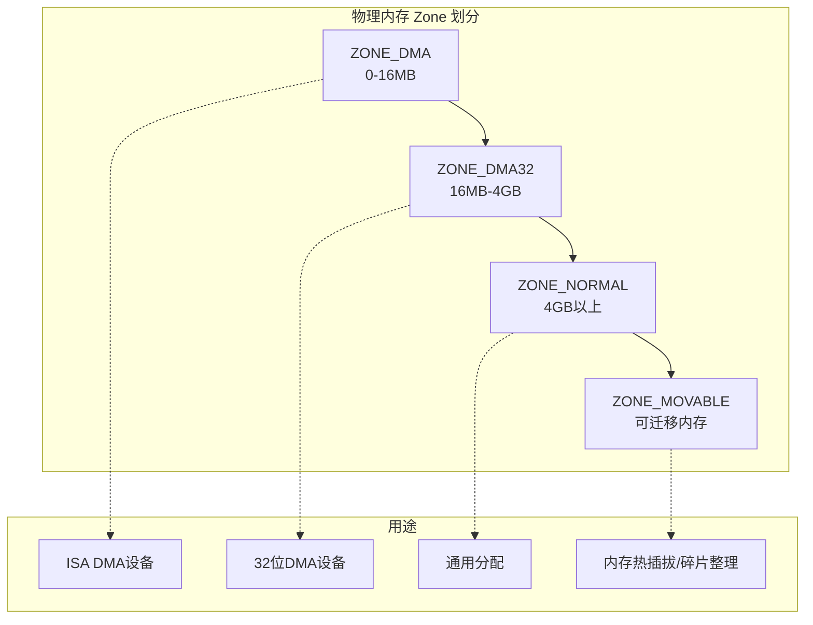

| Zone | 范围 (x86-64) | 用途 |
|------|--------------|------|
| ZONE_DMA | 0 ~ 16MB | 传统 ISA DMA 设备只能访问低16MB |
| ZONE_DMA32 | 16MB ~ 4GB | 32位 DMA 设备限制 |
| ZONE_NORMAL | 4GB 以上 | 常规分配，无限制 |
| ZONE_MOVABLE | 可配置 | 支持内存热插拔和碎片整理 |

---

## 二、虚拟地址映射

### 2.1 MMU 工作原理

**内存管理单元（MMU）** 是 CPU 中负责虚拟地址到物理地址转换的硬件。

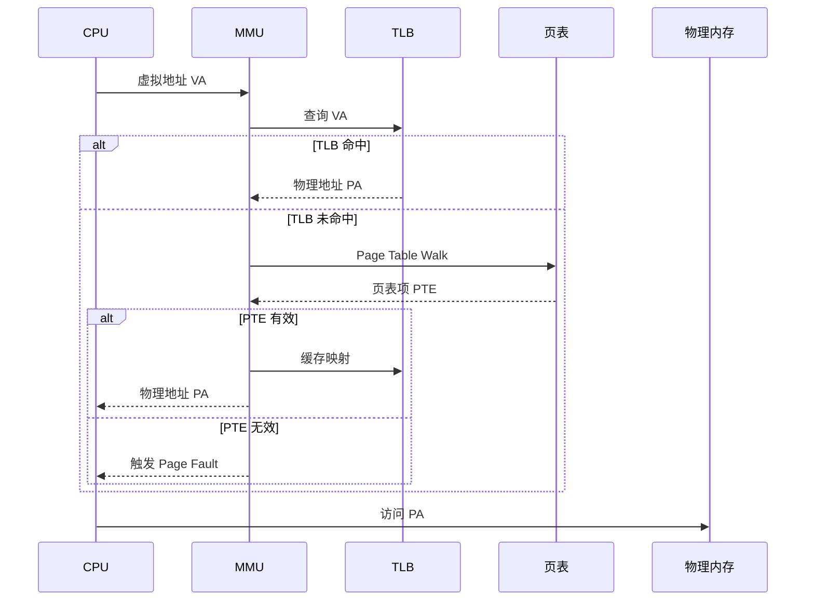

**关键概念**：

- **页（Page）**：虚拟内存的最小管理单位，x86-64 默认 4KB
- **页帧（Page Frame）**：物理内存的最小管理单位
- **页表（Page Table）**：存储虚拟页到物理页帧的映射关系
- **TLB（Translation Lookaside Buffer）**：页表的硬件缓存，加速地址转换

### 2.2 多级页表结构

x86-64 使用 **4 级页表**（可扩展到 5 级）：

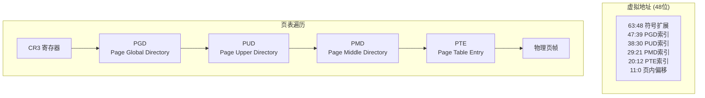

**48 位虚拟地址解析**：

| 位域 | 用途 | 条目数 |
|------|------|--------|
| [63:48] | 符号扩展（必须全0或全1） | - |
| [47:39] | PGD 索引 | 512 |
| [38:30] | PUD 索引 | 512 |
| [29:21] | PMD 索引 | 512 |
| [20:12] | PTE 索引 | 512 |
| [11:0] | 页内偏移 | 4096 (4KB) |

**页表项（PTE）格式**：

| 位域 | 名称 | 含义 |
|------|------|------|
| 63 | NX | No Execute (不可执行) |
| 62:52 | Avail | 可用位 |
| 51:12 | Physical Frame No. | 物理页帧号 |
| 11:9 | Avl | 可用位 |
| 8 | G | Global (TLB刷新时保留) |
| 7 | PS | Page Size (1=大页) |
| 6 | D | Dirty (被写过) |
| 5 | A | Accessed (被访问过) |
| 4 | PCD | Page Cache Disable |
| 3 | PWT | Page Write Through |
| 2 | U/S | User/Supervisor (0=仅内核, 1=用户可访问) |
| 1 | R/W | Read/Write (0=只读, 1=可写) |
| 0 | P | Present (页在物理内存中) |

### 2.3 TLB 与地址翻译加速

TLB 是页表的高速缓存，命中时地址转换只需 1-2 个 CPU 周期，未命中则需要 10-100 个周期进行 Page Walk。

**TLB 层次结构（典型）**：

| 级别 | 条目数 | 延迟 | 特点 |
|------|--------|------|------|
| L1 ITLB | 64-128 | 1 cycle | 指令 TLB |
| L1 DTLB | 64-128 | 1 cycle | 数据 TLB |
| L2 STLB | 1024-2048 | 7-8 cycles | 共享 TLB |

**TLB 刷新时机**：

- 进程切换时切换 CR3 会刷新非 Global 的 TLB 条目
- `invlpg` 指令刷新单个地址的 TLB 条目
- 内核空间标记为 Global，进程切换时不刷新

### 2.4 大页（Huge Pages）

大页减少 TLB 条目数量，提高 TLB 命中率：

| 页大小 | TLB 条目覆盖 | 页表级别 |
|--------|-------------|----------|
| 4KB | 4KB/条目 | 4级 |
| 2MB | 2MB/条目 | 3级（PMD 终止） |
| 1GB | 1GB/条目 | 2级（PUD 终止） |

**适用场景**：大内存应用（数据库、虚拟化、HFT）

---

## 三、缺页中断（Page Fault）

### 3.1 缺页中断触发条件

当 CPU 访问的虚拟地址无法完成映射时，MMU 触发**缺页异常**（x86 中断号 14）：

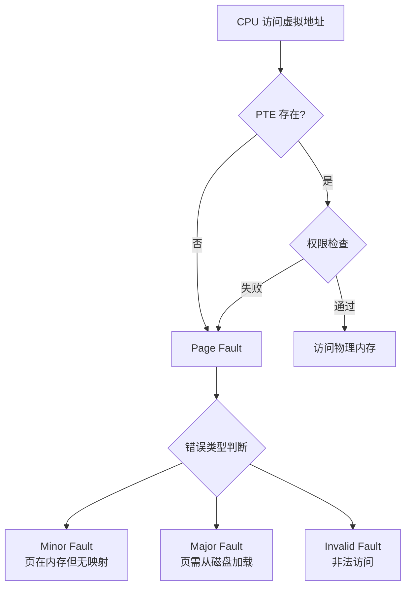

**错误码（Error Code）解析**：

| 位 | 含义 |
|----|------|
| bit 0 | 0=页不存在, 1=权限错误 |
| bit 1 | 0=读操作, 1=写操作 |
| bit 2 | 0=内核态, 1=用户态 |
| bit 3 | 1=保留位错误 |
| bit 4 | 1=取指令时发生 |

### 3.2 缺页处理流程

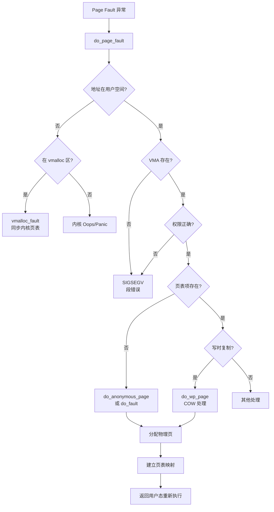

### 3.3 Minor Fault vs Major Fault

| 类型 | 定义 | 延迟 | 场景 |
|------|------|------|------|
| **Minor Fault** | 页在内存中，只需建立映射 | ~1-10μs | 首次访问匿名页、COW |
| **Major Fault** | 页不在内存，需从磁盘读取 | ~1-10ms | 换入被换出的页、mmap 文件 |

**性能影响**：Major Fault 延迟是 Minor Fault 的 **1000 倍**，对延迟敏感系统（如 HFT）需要避免。

### 3.4 写时复制（Copy-on-Write）

COW 是一种延迟复制优化，`fork()` 时不复制页面，而是共享并标记为只读：

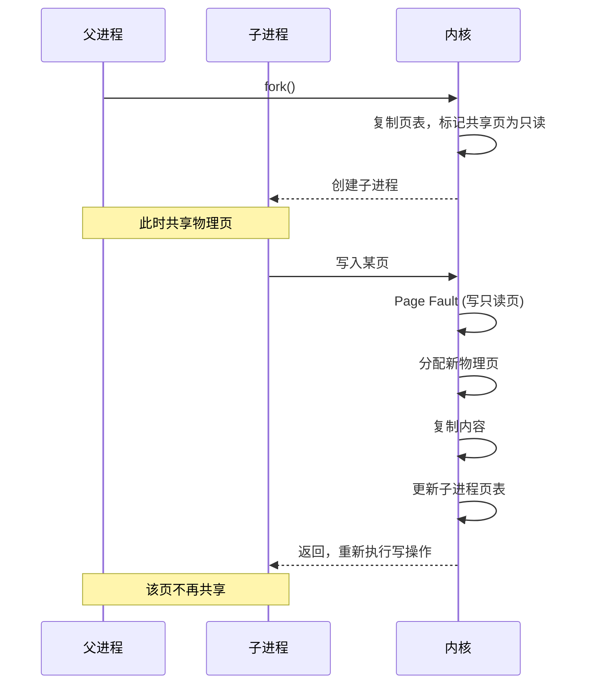

### 3.5 需求分页（Demand Paging）

进程地址空间中的页面不会立即分配物理内存，而是**首次访问时**才分配：

1. `malloc()` 只分配虚拟地址空间（VMA），不分配物理页
2. 首次读：分配零页（zero page）的只读映射
3. 首次写：分配物理页，建立可写映射

**优势**：避免分配从未使用的内存

---

## 四、进程地址空间布局

### 4.1 进程虚拟地址空间


### 4.2 VMA（Virtual Memory Area）

内核用 `vm_area_struct` 描述进程地址空间中的每个连续区域：

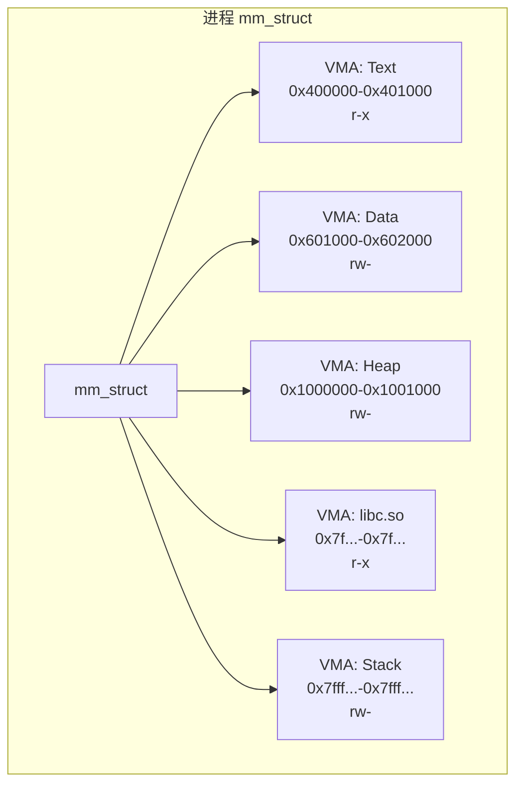

VMA 按地址排序，用**红黑树**组织以加速查找。

### 4.3 查看进程内存布局

通过 `/proc/[pid]/maps` 查看：

```
地址范围                 权限 偏移     设备   inode  路径
00400000-00401000        r-xp 00000000 08:01 1234   /bin/example    # Text
00600000-00601000        r--p 00000000 08:01 1234   /bin/example    # Read-only data  
00601000-00602000        rw-p 00001000 08:01 1234   /bin/example    # Data
01000000-01021000        rw-p 00000000 00:00 0      [heap]
7f1234500000-7f12346c0000 r-xp 00000000 08:01 5678  /lib/libc.so.6  # 共享库
7ffc12345000-7ffc12366000 rw-p 00000000 00:00 0     [stack]
7ffc123fe000-7ffc12400000 r-xp 00000000 00:00 0     [vdso]
```

### 4.4 ASLR（地址空间布局随机化）

ASLR 随机化各区域的基地址，增加攻击难度：

| 区域 | 随机化 |
|------|--------|
| Stack | 随机基地址 |
| mmap/共享库 | 随机基地址 |
| Heap | 随机基地址 |
| Text (PIE) | 随机基地址 |

---

## 五、内核内存分配器

### 5.1 分配器层次结构

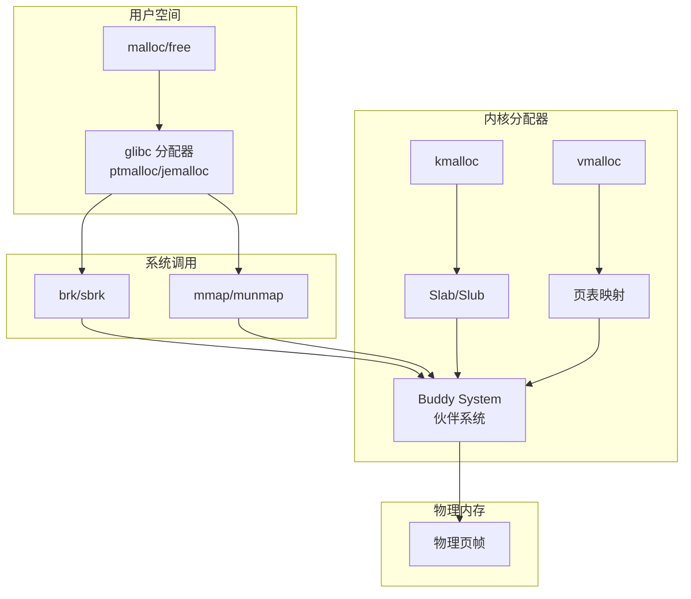

### 5.2 伙伴系统（Buddy System）

伙伴系统管理物理页帧的分配，以 **2^n 个连续页** 为单位：

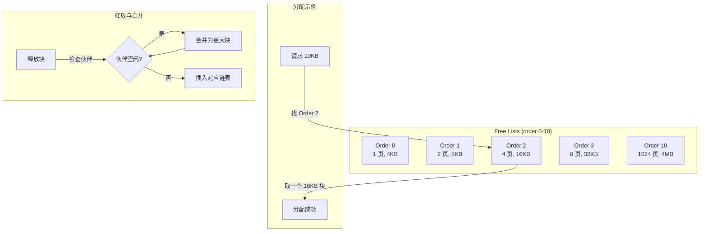

**分配流程**：
1. 向上取整到 2^n 页
2. 查找对应 order 的空闲链表
3. 如果没有，从更高 order 分裂
4. 返回页帧

**释放流程**：
1. 检查"伙伴"是否空闲
2. 如果伙伴空闲，合并为更大块，递归检查
3. 否则插入对应链表

**内部碎片问题**：请求 5 页只能分配 8 页，浪费 3 页

### 5.3 Slab 分配器

Slab 分配器解决小对象分配问题，为常用对象维护缓存：

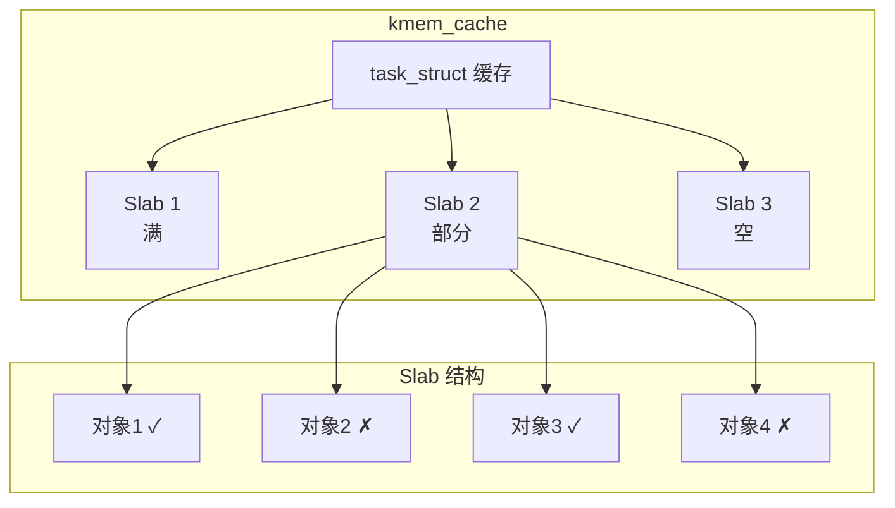

**设计目标**：
- **减少碎片**：同类对象大小相同
- **提高速度**：对象预分配，避免频繁调用伙伴系统
- **缓存着色**：错开对象地址，减少 Cache 冲突

**Linux 实现演进**：
- **Slab**：原始实现，功能完整但复杂
- **Slub**：当前默认，简化设计，更好的多核扩展性
- **Slob**：嵌入式系统，极简实现

### 5.4 kmalloc vs vmalloc

| 特性 | kmalloc | vmalloc |
|------|---------|---------|
| 物理连续 | 是 | 否 |
| 虚拟连续 | 是 | 是 |
| 速度 | 快 | 慢（需修改页表） |
| 最大大小 | ~4MB（受限于伙伴系统） | 理论无限 |
| 适用场景 | DMA、小块分配 | 大块分配、内核模块 |

**选择原则**：
- 需要物理连续（DMA）→ `kmalloc`
- 小于 1 页 → `kmalloc`
- 大块且不需要物理连续 → `vmalloc`

---

## 六、内核面试要点

### 6.1 常见问题

**Q: 为什么需要虚拟内存？**

A: 三个核心原因：
1. **隔离**：进程间互不影响，一个进程崩溃不会破坏其他进程
2. **抽象**：进程看到简单连续的地址空间，无需关心物理布局
3. **效率**：通过分页按需分配，支持共享（共享库、COW）

**Q: 缺页中断的处理流程？**

A: 
1. MMU 发现 PTE 无效或权限错误，触发 #PF 异常
2. 内核 `do_page_fault` 获取错误地址（CR2）和错误码
3. 判断地址是否属于有效 VMA
4. 根据类型调用对应处理函数（匿名页、文件页、COW）
5. 分配物理页，建立映射，返回用户态重新执行

**Q: 什么是 TLB 抖动（TLB Thrashing）？**

A: 当工作集超过 TLB 容量时，频繁发生 TLB miss，导致大量 Page Walk。解决方案：
- 使用大页减少 TLB 条目需求
- 优化数据局部性
- 减少进程切换

### 6.2 性能优化要点

1. **预分配内存**：避免运行时 Page Fault
2. **使用大页**：减少 TLB miss
3. **NUMA 感知**：在本地节点分配内存
4. **锁页（mlock）**：防止关键数据被换出
5. **避免 Major Fault**：预读文件，禁用 swap

---

## 相关文章

- [上一篇：AI基础设施详解](@/articles/linux/linux-15-AI基础设施详解.md)
- [下一篇：中断与系统调用详解](@/articles/linux/linux-17-中断与系统调用详解.md)
